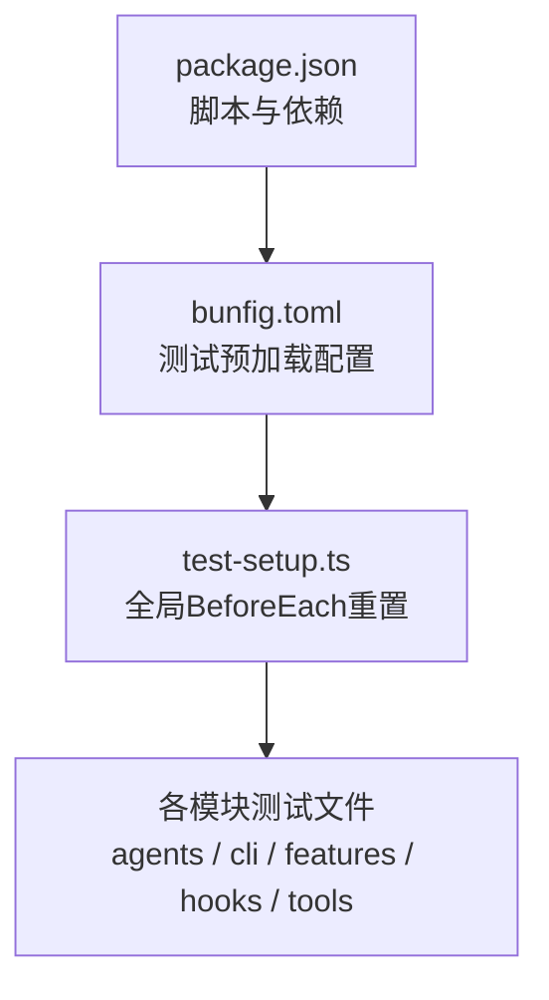
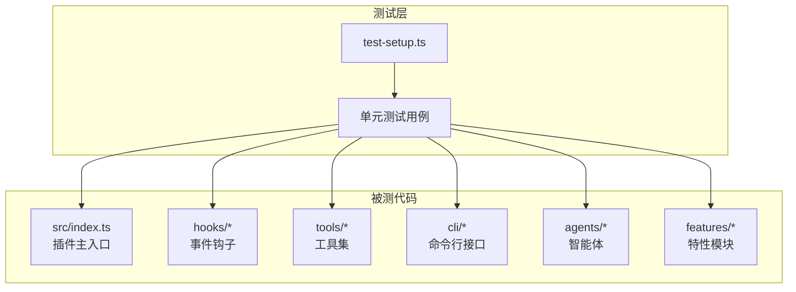
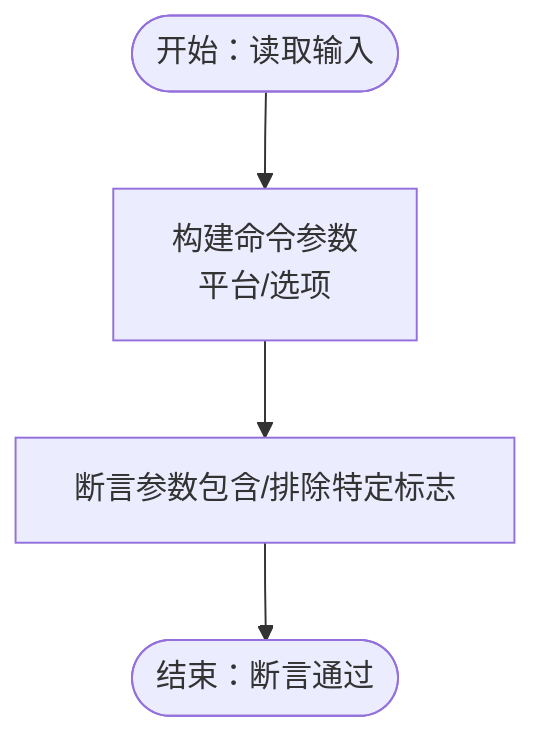
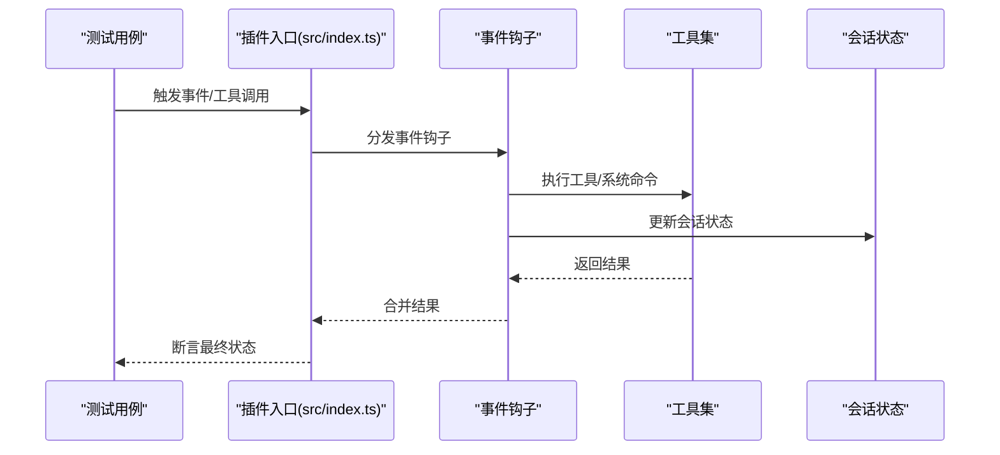
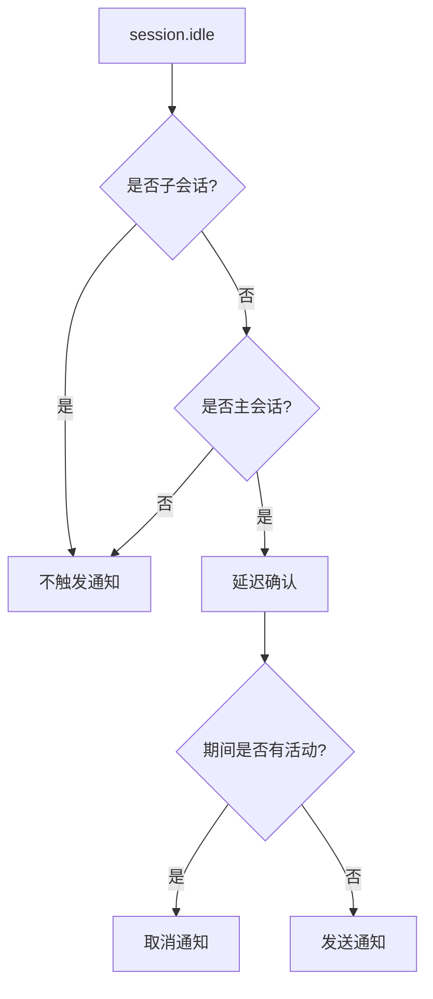
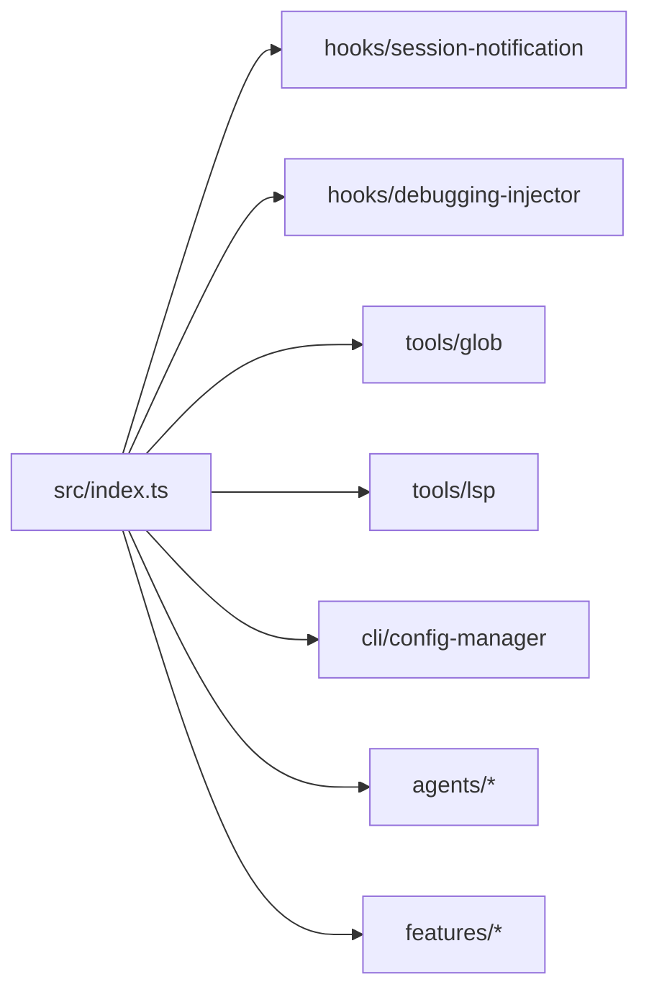

# 测试与调试

<cite>
**本文引用的文件**   
- [package.json](file://package.json)
- [bunfig.toml](file://bunfig.toml)
- [test-setup.ts](file://test-setup.ts)
- [src/index.ts](file://src/index.ts)
- [src/shared/logger.ts](file://src/shared/logger.ts)
- [src/agents/archiver.test.ts](file://src/agents/archiver.test.ts)
- [src/agents/implementer.test.ts](file://src/agents/implementer.test.ts)
- [src/cli/config-manager.test.ts](file://src/cli/config-manager.test.ts)
- [src/features/builtin-skills/skills.test.ts](file://src/features/builtin-skills/skills.test.ts)
- [src/shared/deep-merge.test.ts](file://src/shared/deep-merge.test.ts)
- [src/hooks/session-notification.test.ts](file://src/hooks/session-notification.test.ts)
- [src/tools/glob/cli.test.ts](file://src/tools/glob/cli.test.ts)
- [src/features/skill-mcp-manager/env-cleaner.test.ts](file://src/features/skill-mcp-manager/env-cleaner.test.ts)
- [src/hooks/debugging-injector/index.ts](file://src/hooks/debugging-injector/index.ts)
</cite>

## 目录
1. [简介](#简介)
2. [项目结构](#项目结构)
3. [核心组件](#核心组件)
4. [架构总览](#架构总览)
5. [详细组件分析](#详细组件分析)
6. [依赖分析](#依赖分析)
7. [性能考虑](#性能考虑)
8. [故障排查指南](#故障排查指南)
9. [结论](#结论)
10. [附录](#附录)

## 简介
本指南面向 Oh My OpenCode 的测试与调试实践，系统阐述测试策略、测试框架配置、单元测试/集成测试/端到端测试的编写方法，以及测试环境搭建、测试数据准备、日志分析、断点调试与性能分析等调试技巧。同时给出常见测试场景与调试案例的解决方案，并明确测试覆盖率与质量保证标准建议。

## 项目结构
- 测试框架：基于 Bun 内置测试能力（bun:test），通过脚本与配置启用。
- 预加载：在每个测试运行前执行预加载脚本以重置会话状态，确保测试隔离性。
- 测试分布：按功能模块划分，覆盖 agents、cli、features、hooks、tools 等子系统。

**图表来源**
- [package.json](file://package.json#L26-L36)
- [bunfig.toml](file://bunfig.toml#L1-L3)
- [test-setup.ts](file://test-setup.ts#L1-L7)

**章节来源**
- [package.json](file://package.json#L26-L36)
- [bunfig.toml](file://bunfig.toml#L1-L3)

## 核心组件
- 测试框架与运行
  - 使用 Bun 内置测试命令执行所有测试文件。
  - 通过脚本统一入口，便于 CI/本地一键运行。
- 预加载机制
  - 在测试启动时自动重置会话状态，避免跨用例污染。
- 日志与可观测性
  - 提供共享日志工具，输出到临时目录日志文件，便于定位问题。
- 关键模块测试示例
  - agents：验证代理提示词约束与技能要求。
  - cli：安装与配置管理逻辑、网络请求模拟与错误回退。
  - features：内置技能集合、深度合并工具、会话状态清理。
  - hooks：会话通知钩子行为、调试注入钩子策略。
  - tools：文件搜索工具参数构建、环境变量清理。

**章节来源**
- [package.json](file://package.json#L26-L36)
- [bunfig.toml](file://bunfig.toml#L1-L3)
- [test-setup.ts](file://test-setup.ts#L1-L7)
- [src/shared/logger.ts](file://src/shared/logger.ts#L1-L21)

## 架构总览
下图展示测试与被测代码的交互关系，突出“预加载 -> 模块测试 -> 钩子/工具/CLI/Agents”的调用链路。

**图表来源**
- [test-setup.ts](file://test-setup.ts#L1-L7)
- [src/index.ts](file://src/index.ts#L1-L624)

## 详细组件分析

### 单元测试策略与示例
- 基本模式
  - 使用描述块组织测试场景，断言返回值或副作用。
  - 对外部依赖进行模拟（如 fetch、文件系统、外部命令）。
- 典型用例
  - agents：校验代理提示词中必须包含的技能名称与禁用项。
  - cli：对版本标签解析、网络失败回退、模型选择优先级进行断言。
  - features：对深度合并函数的行为边界、原型污染防护、数组替换策略进行覆盖。
  - hooks：对会话通知钩子的状态判断顺序、延迟确认、重复触发抑制进行验证。
  - tools：对不同平台下的命令参数构建策略进行断言。
  - skill-mcp-manager：对 MCP 环境变量过滤规则进行验证。

**图表来源**
- [src/tools/glob/cli.test.ts](file://src/tools/glob/cli.test.ts#L1-L159)

**章节来源**
- [src/agents/archiver.test.ts](file://src/agents/archiver.test.ts#L1-L23)
- [src/agents/implementer.test.ts](file://src/agents/implementer.test.ts#L1-L23)
- [src/cli/config-manager.test.ts](file://src/cli/config-manager.test.ts#L1-L332)
- [src/features/builtin-skills/skills.test.ts](file://src/features/builtin-skills/skills.test.ts#L1-L56)
- [src/shared/deep-merge.test.ts](file://src/shared/deep-merge.test.ts#L1-L337)
- [src/hooks/session-notification.test.ts](file://src/hooks/session-notification.test.ts#L1-L362)
- [src/tools/glob/cli.test.ts](file://src/tools/glob/cli.test.ts#L1-L159)
- [src/features/skill-mcp-manager/env-cleaner.test.ts](file://src/features/skill-mcp-manager/env-cleaner.test.ts#L1-L39)

### 集成测试与端到端测试
- 集成测试
  - 验证多个模块协作的行为，例如 hooks 与 tools 的组合、CLI 与配置管理的联动。
  - 可通过模拟外部服务（如 npm dist-tags）与真实文件系统操作结合，覆盖关键路径。
- 端到端测试
  - 以真实插件入口为起点，构造完整事件流（session.created -> tool.execute.* -> event.*），验证通知钩子、会话状态、工具执行链路。
  - 建议使用最小化外部依赖，必要时对系统命令进行路径探测与回退处理。

**图表来源**
- [src/index.ts](file://src/index.ts#L330-L606)
- [src/hooks/session-notification.test.ts](file://src/hooks/session-notification.test.ts#L100-L123)

**章节来源**
- [src/index.ts](file://src/index.ts#L330-L606)

### 测试环境搭建与数据准备
- 运行环境
  - 使用 Bun 运行测试，确保 Node 生态兼容性。
  - 通过脚本统一入口，避免手动指定文件列表。
- 预加载与隔离
  - 预加载脚本在每次测试前重置会话状态，避免跨用例干扰。
- 外部依赖模拟
  - 对 fetch、系统命令路径探测、文件系统写入等进行模拟或桩对象替换。
- 数据准备
  - 为 CLI/工具测试准备最小化的配置对象与输入参数集合。
  - 为 hooks 测试准备会话 ID、事件类型与属性集合。

**章节来源**
- [package.json](file://package.json#L26-L36)
- [bunfig.toml](file://bunfig.toml#L1-L3)
- [test-setup.ts](file://test-setup.ts#L1-L7)
- [src/hooks/session-notification.test.ts](file://src/hooks/session-notification.test.ts#L10-L43)

### 调试技巧与工具使用
- 日志分析
  - 使用共享日志工具输出时间戳与上下文数据，定位异常发生的时间点与输入。
  - 日志文件位于系统临时目录，便于在 CI 或本地快速检索。
- 断点调试
  - 在复杂钩子或工具执行前设置断点，观察输入输出与中间状态。
  - 对异步事件流（如 idle -> cancel -> activity）分阶段断点验证。
- 性能分析
  - 对高频钩子与工具记录耗时，识别阻塞点。
  - 对网络请求与文件系统操作进行采样，评估外部依赖影响。

**章节来源**
- [src/shared/logger.ts](file://src/shared/logger.ts#L1-L21)
- [src/hooks/session-notification.test.ts](file://src/hooks/session-notification.test.ts#L186-L217)

### 常见测试场景与调试案例
- 场景一：会话通知仅在主会话空闲时触发
  - 现象：子会话或非主会话空闲不应触发通知。
  - 解决：先检查子会话集合，再检查主会话 ID，最后延迟确认。
- 场景二：工具执行前活动打断通知
  - 现象：空闲后收到活动事件应取消待发送通知。
  - 解决：在活动事件中清除定时器并重置状态。
- 场景三：MCP 环境变量泄漏
  - 现象：私有 registry 或缓存配置泄露到子进程。
  - 解决：过滤 NPM_CONFIG_* 与 npm_config_* 环境变量，保留 PATH 等必要项。

**图表来源**
- [src/hooks/session-notification.test.ts](file://src/hooks/session-notification.test.ts#L100-L123)
- [src/hooks/session-notification.test.ts](file://src/hooks/session-notification.test.ts#L186-L217)

**章节来源**
- [src/hooks/session-notification.test.ts](file://src/hooks/session-notification.test.ts#L1-L362)
- [src/features/skill-mcp-manager/env-cleaner.test.ts](file://src/features/skill-mcp-manager/env-cleaner.test.ts#L1-L39)

## 依赖分析
- 测试框架与配置
  - 通过脚本统一运行测试；预加载脚本确保状态隔离。
- 模块间耦合
  - 插件入口集中注册钩子与工具，测试需覆盖事件分发与工具执行链路。
  - hooks 与 tools 之间存在强耦合（如会话通知依赖工具执行时机），测试应关注时序与状态一致性。

**图表来源**
- [src/index.ts](file://src/index.ts#L86-L606)

**章节来源**
- [src/index.ts](file://src/index.ts#L86-L606)

## 性能考虑
- 测试执行
  - 尽量减少外部 I/O 与网络请求，必要时使用内存桩或本地镜像。
  - 对异步事件进行超时控制，避免单个测试长时间阻塞。
- 钩子与工具
  - 对高频钩子进行轻量实现，避免在事件回调中执行重型任务。
  - 对文件系统与外部命令调用进行批量合并与去重。

## 故障排查指南
- 无法复现的问题
  - 使用调试注入钩子记录失败模式与时间窗口，清理过期记录后再定位。
- 会话状态异常
  - 检查预加载脚本是否正确重置，确认测试间无共享状态。
- 网络请求失败
  - 在测试中模拟 fetch 并断言回退逻辑，确保错误路径可验证。
- 环境变量泄漏
  - 对 MCP 环境变量进行过滤测试，确保私有配置不外泄。

**章节来源**
- [src/hooks/debugging-injector/index.ts](file://src/hooks/debugging-injector/index.ts#L1-L126)
- [test-setup.ts](file://test-setup.ts#L1-L7)
- [src/cli/config-manager.test.ts](file://src/cli/config-manager.test.ts#L77-L102)
- [src/features/skill-mcp-manager/env-cleaner.test.ts](file://src/features/skill-mcp-manager/env-cleaner.test.ts#L20-L39)

## 结论
本指南提供了 Oh My OpenCode 的测试与调试实践蓝图：以 Bun 测试为核心，配合预加载与隔离策略，覆盖单元、集成与端到端场景；通过日志、断点与性能分析工具提升可观测性；针对常见问题提供可复用的调试方案。建议在持续集成中强制执行测试并通过覆盖率阈值，保障质量与稳定性。

## 附录
- 质量保证标准建议
  - 单元测试覆盖率：核心模块不低于 80%，关键分支与异常路径 100%。
  - 集成测试：覆盖主要事件流与工具组合，确保钩子与工具协同稳定。
  - 端到端测试：至少包含一次完整会话生命周期（创建/执行/删除）。
  - 回归测试：对重大变更与修复进行回归验证，保持长期稳定性。
- 测试数据与环境
  - 使用最小化配置与输入，避免外部依赖。
  - 对系统命令路径进行探测与回退，确保跨平台可用。