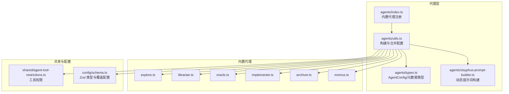
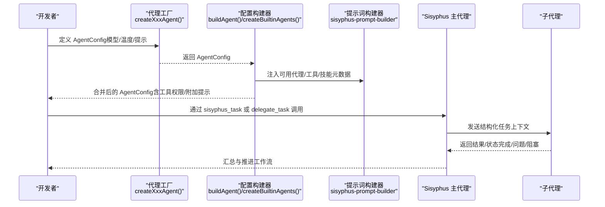
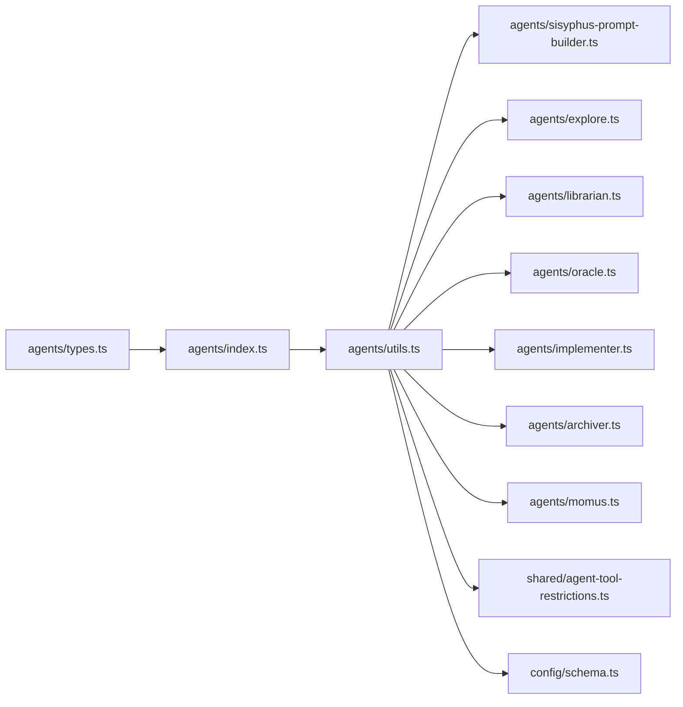

# 自定义代理开发

<cite>
**本文引用的文件**
- [src/agents/types.ts](file://src/agents/types.ts)
- [src/agents/index.ts](file://src/agents/index.ts)
- [src/agents/utils.ts](file://src/agents/utils.ts)
- [src/agents/sisyphus.ts](file://src/agents/sisyphus.ts)
- [src/agents/sisyphus-prompt-builder.ts](file://src/agents/sisyphus-prompt-builder.ts)
- [src/agents/explore.ts](file://src/agents/explore.ts)
- [src/agents/librarian.ts](file://src/agents/librarian.ts)
- [src/agents/oracle.ts](file://src/agents/oracle.ts)
- [src/agents/archiver.ts](file://src/agents/archiver.ts)
- [src/agents/implementer.ts](file://src/agents/implementer.ts)
- [src/agents/momus.ts](file://src/agents/momus.ts)
- [src/shared/agent-tool-restrictions.ts](file://src/shared/agent-tool-restrictions.ts)
- [src/config/schema.ts](file://src/config/schema.ts)
- [AGENTS.md](file://AGENTS.md)
- [CONFIGURATION-GUIDE.md](file://CONFIGURATION-GUIDE.md)
</cite>

## 目录
1. [简介](#简介)
2. [项目结构](#项目结构)
3. [核心组件](#核心组件)
4. [架构总览](#架构总览)
5. [详细组件分析](#详细组件分析)
6. [依赖关系分析](#依赖关系分析)
7. [性能与成本考量](#性能与成本考量)
8. [故障排查指南](#故障排查指南)
9. [结论](#结论)
10. [附录](#附录)

## 简介
本指南面向希望在 Oh My OpenCode 生态中创建与扩展自定义代理的开发者。内容涵盖代理配置结构、AgentConfig 接口与生命周期管理；提供从零到一创建新代理的完整步骤（配置定义、提示词编写、温度参数调整）；解释代理间通信机制、消息传递格式与状态管理；总结内置代理的实现模式，并给出扩展现有代理的方法；最后提供代理测试与调试的实践建议。

## 项目结构
Oh My OpenCode 将代理组织在 src/agents 下，采用“工厂函数 + 统一导出”的模式，配合工具模块构建动态提示词与运行时配置合并。关键目录与文件如下：
- 代理工厂与导出：src/agents/index.ts、src/agents/utils.ts
- 提示词构建器：src/agents/sisyphus-prompt-builder.ts
- 内置代理：explore、librarian、oracle、implementer、archiver、momus 等
- 工具权限限制：src/shared/agent-tool-restrictions.ts
- 配置与类型：src/config/schema.ts、src/agents/types.ts
- 开发与配置指南：AGENTS.md、CONFIGURATION-GUIDE.md

图表来源
- [src/agents/index.ts](file://src/agents/index.ts#L1-L37)
- [src/agents/utils.ts](file://src/agents/utils.ts#L1-L224)
- [src/agents/sisyphus-prompt-builder.ts](file://src/agents/sisyphus-prompt-builder.ts#L1-L360)
- [src/agents/types.ts](file://src/agents/types.ts#L1-L87)
- [src/shared/agent-tool-restrictions.ts](file://src/shared/agent-tool-restrictions.ts#L1-L57)
- [src/config/schema.ts](file://src/config/schema.ts#L1-L200)

章节来源
- [AGENTS.md](file://AGENTS.md#L1-L182)
- [src/agents/index.ts](file://src/agents/index.ts#L1-L37)
- [src/agents/utils.ts](file://src/agents/utils.ts#L1-L224)

## 核心组件
- AgentConfig 接口与类型
  - AgentConfig 由 OpenCode SDK 提供，用于描述代理的模型、温度、工具白名单、模式等。
  - 在 Oh My OpenCode 中，AgentConfig 通常通过工厂函数创建，并在运行时被 buildAgent 与 createBuiltinAgents 合并与增强。
- AgentPromptMetadata 元数据
  - 描述代理的分类、成本、触发条件、使用时机、避免场景、专用段落、别名与关键触发等，用于动态构建 Sisyphus 的提示词表。
- AgentFactory 与内置代理注册
  - 通过工厂函数统一创建 AgentConfig，再在 agents/index.ts 中集中导出为 builtinAgents 记录。
- 工具权限与限制
  - 通过 createAgentToolRestrictions 生成工具白/黑名单，确保不同代理仅能使用授权工具集。

章节来源
- [src/agents/types.ts](file://src/agents/types.ts#L1-L87)
- [src/agents/index.ts](file://src/agents/index.ts#L1-L37)
- [src/shared/agent-tool-restrictions.ts](file://src/shared/agent-tool-restrictions.ts#L1-L57)

## 架构总览
下图展示了代理生命周期与交互的关键阶段：配置构建、提示词动态生成、工具权限注入、以及与 Sisyphus 的协作。

图表来源
- [src/agents/utils.ts](file://src/agents/utils.ts#L63-L99)
- [src/agents/sisyphus-prompt-builder.ts](file://src/agents/sisyphus-prompt-builder.ts#L60-L146)
- [src/agents/sisyphus.ts](file://src/agents/sisyphus.ts#L752-L800)

## 详细组件分析

### AgentConfig 接口与配置结构
- 关键字段
  - model：模型标识符（如 anthropic/claude-opus-4-5）
  - temperature：采样温度（代码类代理建议 0.1，高推理模型可提升 textVerbosity）
  - mode：代理模式（subagent/primary/all）
  - tools：工具白/黑名单（通过 createAgentToolRestrictions 生成）
  - prompt：系统提示词（可由技能内容拼接）
  - 其他：thinking、reasoningEffort、top_p、max_tokens 等
- 运行时增强
  - buildAgent：根据类别配置（categories）设置模型/温度/变体
  - createBuiltinAgents：合并用户覆盖（agent overrides）、技能注入、环境上下文（如 Librarian 的时间信息）

章节来源
- [src/agents/utils.ts](file://src/agents/utils.ts#L63-L99)
- [src/agents/utils.ts](file://src/agents/utils.ts#L141-L224)
- [src/config/schema.ts](file://src/config/schema.ts#L109-L151)

### AgentPromptMetadata 与动态提示词
- 字段说明
  - category/cost：用于构建“工具与技能选择表”
  - triggers/useWhen/avoidWhen：用于“委托表”与“关键触发”
  - dedicatedSection/keyTrigger/promptAlias：用于专属段落与快速触发
- 动态构建
  - sisyphus-prompt-builder 根据可用代理/工具/技能生成“关键触发”“工具选择表”“委托表”“前端约束”“Oracle 使用建议”“硬性禁令”“反模式”等段落，最终拼接到 Sisyphus 的主提示词中。

章节来源
- [src/agents/types.ts](file://src/agents/types.ts#L25-L53)
- [src/agents/sisyphus-prompt-builder.ts](file://src/agents/sisyphus-prompt-builder.ts#L60-L203)
- [src/agents/sisyphus.ts](file://src/agents/sisyphus.ts#L752-L800)

### 工具权限与限制
- 不同代理的工具限制差异较大
  - Explore/Librarian：禁止 write/edit/task/delegate_task/call_omo_agent
  - Oracle：禁止 write/edit/task/delegate_task
  - 文档/前端工程师：禁止 task/delegate_task/call_omo_agent
- 通过 createAgentToolRestrictions 统一生成布尔映射，注入到 AgentConfig.tools 中

章节来源
- [src/shared/agent-tool-restrictions.ts](file://src/shared/agent-tool-restrictions.ts#L7-L57)
- [src/agents/explore.ts](file://src/agents/explore.ts#L27-L126)
- [src/agents/librarian.ts](file://src/agents/librarian.ts#L24-L330)
- [src/agents/oracle.ts](file://src/agents/oracle.ts#L100-L126)

### 内置代理实现模式与扩展示例
- Explore（探索）
  - 用途：上下文 grep，多工具并行搜索，要求绝对路径与可操作结果
  - 温度：0.1；工具限制：禁止写操作
- Librarian（文献管理员）
  - 用途：外部库/官方文档/开源仓库检索，强调永久链接与证据引用
  - 温度：0.1；工具限制：禁止写操作
- Oracle（顾问）
  - 用途：高阶架构/疑难调试咨询，只读专家
  - 温度：0.1；工具限制：禁止写/编辑/任务/委派
- Implementer（执行者）
  - 用途：单任务实现，遵循 TDD 与 Codex 协作
  - 温度：0.1；工具限制：禁止任务/后台任务/委派/网络搜索
- Archiver（归档者）
  - 用途：执行 git 策略、诊断、构建验证与变更归档
  - 温度：0.1；工具限制：禁止写/编辑/任务/委派/网络搜索
- Momus（计划评审者）
  - 用途：严格审查工作计划，确保清晰、可验证、完整
  - 温度：0.1；工具限制：禁止写/编辑/任务/委派

扩展示例（以实现模式为参考）：
- 新建文件：src/agents/my-agent.ts
- 编写工厂函数：createMyAgent(model?) -> AgentConfig
- 定义元数据：MY_AGENT_PROMPT_METADATA（包含 category/cost/triggers 等）
- 导出：在 agents/index.ts 中加入 my-agent 并在 utils.ts 的 agentSources/agentMetadata 中注册
- 如需动态提示词：在 sisyphus-prompt-builder.ts 中补充对应构建函数或复用现有逻辑

章节来源
- [src/agents/explore.ts](file://src/agents/explore.ts#L27-L126)
- [src/agents/librarian.ts](file://src/agents/librarian.ts#L24-L330)
- [src/agents/oracle.ts](file://src/agents/oracle.ts#L100-L126)
- [src/agents/implementer.ts](file://src/agents/implementer.ts#L125-L153)
- [src/agents/archiver.ts](file://src/agents/archiver.ts#L96-L124)
- [src/agents/momus.ts](file://src/agents/momus.ts#L394-L419)
- [src/agents/index.ts](file://src/agents/index.ts#L17-L32)
- [src/agents/utils.ts](file://src/agents/utils.ts#L25-L57)

### 代理间通信机制、消息传递格式与状态管理
- 通信通道
  - 通过 OpenCode SDK 的工具调用（如 task、delegate_task、background_task、background_output、background_cancel 等）进行跨代理协作
  - Sisyphus 作为编排者，负责任务拆分、并行调度、结果收集与清理
- 消息传递格式
  - 结构化任务上下文：例如 Implementer 的 ImplementerTaskContext、Archiver 的 ArchiverTaskContext
  - 委托前声明：必须明确“类别/代理、原因、技能、预期结果”，否则视为违规
- 状态管理
  - 使用 todos 系统进行实时进度跟踪（todowrite/in_progress/completed），避免批量完成与漂移
  - 失败恢复：连续失败后回滚、咨询 Oracle、必要时请求用户确认

章节来源
- [src/agents/sisyphus.ts](file://src/agents/sisyphus.ts#L240-L308)
- [src/agents/sisyphus.ts](file://src/agents/sisyphus.ts#L408-L481)
- [src/agents/sisyphus.ts](file://src/agents/sisyphus.ts#L644-L700)
- [src/agents/sisyphus.ts](file://src/agents/sisyphus.ts#L546-L642)

### 生命周期管理
- 创建阶段
  - 工厂函数生成基础 AgentConfig
  - buildAgent 合并类别配置（模型/温度/变体/技能）
  - createBuiltinAgents 支持用户覆盖（agents/categories）、注入环境上下文、合并 prompt_append
- 运行阶段
  - Sisyphus 根据请求类型与上下文选择合适代理或技能
  - 并行执行与后台任务收集，完成后统一清理
- 销毁/回收
  - 通过 background_cancel(all=true) 释放资源
  - todos 状态清零，避免残留

章节来源
- [src/agents/utils.ts](file://src/agents/utils.ts#L63-L99)
- [src/agents/utils.ts](file://src/agents/utils.ts#L141-L224)
- [src/agents/sisyphus.ts](file://src/agents/sisyphus.ts#L328-L355)

### 提示词编写与温度参数调整
- 提示词编写要点
  - 明确角色与职责（Role/Skills/Workflow/Constraints/Communication）
  - 结构化输出模板（完成/问题/阻塞）便于下游解析
  - 对于 Librarian 强调“当前年份”与“永久链接”
  - 对于 Explore 强制“意图分析 + 并行执行 + 结构化结果”
- 温度参数
  - 代码类代理建议 0.1，保持确定性
  - 高推理模型（如 GPT-5.2）可提升 textVerbosity
  - 通过 categories 配置统一管理温度，避免分散设置

章节来源
- [src/agents/explore.ts](file://src/agents/explore.ts#L56-L121)
- [src/agents/librarian.ts](file://src/agents/librarian.ts#L46-L52)
- [src/agents/oracle.ts](file://src/agents/oracle.ts#L118-L122)
- [src/config/schema.ts](file://src/config/schema.ts#L170-L186)

### 扩展现有代理的方法
- 修改提示词：在对应代理文件中更新系统提示词字符串
- 调整工具权限：在 shared/agent-tool-restrictions.ts 中扩展/收紧限制
- 调整元数据：在 types.ts 的 AgentPromptMetadata 中增删 triggers/useWhen/avoidWhen
- 调整模型与温度：通过 categories 或 agents 覆盖配置
- 注入技能：在 categories.defaultSkills 或 AgentOverrideConfig.skills 中添加

章节来源
- [src/shared/agent-tool-restrictions.ts](file://src/shared/agent-tool-restrictions.ts#L15-L56)
- [src/agents/types.ts](file://src/agents/types.ts#L25-L53)
- [src/config/schema.ts](file://src/config/schema.ts#L109-L151)

### 测试与调试示例
- 测试策略
  - 遵循 TDD：先写失败用例，再最小实现，最后重构
  - 用例命名：与源文件同目录，文件名 *.test.ts
  - 断言风格：BDD 注释 #given/#when/#then
- 调试技巧
  - 使用 background_output 收集并行结果
  - 使用 background_cancel(all=true) 清理资源
  - 通过 todos 精确定位未完成步骤
  - 对于 Librarian 的日期敏感查询，确保使用当前年份

章节来源
- [AGENTS.md](file://AGENTS.md#L49-L74)
- [src/agents/sisyphus.ts](file://src/agents/sisyphus.ts#L328-L355)
- [src/agents/librarian.ts](file://src/agents/librarian.ts#L46-L52)

## 依赖关系分析

图表来源
- [src/agents/types.ts](file://src/agents/types.ts#L1-L87)
- [src/agents/index.ts](file://src/agents/index.ts#L1-L37)
- [src/agents/utils.ts](file://src/agents/utils.ts#L1-L224)
- [src/agents/sisyphus-prompt-builder.ts](file://src/agents/sisyphus-prompt-builder.ts#L1-L360)
- [src/shared/agent-tool-restrictions.ts](file://src/shared/agent-tool-restrictions.ts#L1-L57)
- [src/config/schema.ts](file://src/config/schema.ts#L1-L200)

章节来源
- [src/agents/index.ts](file://src/agents/index.ts#L1-L37)
- [src/agents/utils.ts](file://src/agents/utils.ts#L1-L224)

## 性能与成本考量
- 成本分类
  - FREE/CHEAP/EXPENSIVE：用于“工具与技能选择表”排序与默认使用策略
- 思维预算
  - 非 GPT 模型可通过 thinking.budgetTokens 控制推理预算
  - GPT 模型通过 reasoningEffort/textVerbosity 控制推理深度
- 并行与资源
  - 并行执行与后台任务收集可显著缩短总耗时，但需及时清理（background_cancel）

章节来源
- [src/agents/types.ts](file://src/agents/types.ts#L13-L13)
- [src/agents/sisyphus-prompt-builder.ts](file://src/agents/sisyphus-prompt-builder.ts#L122-L145)
- [src/agents/utils.ts](file://src/agents/utils.ts#L127-L139)

## 故障排查指南
- 常见问题
  - 未按要求声明委托：违反“预声明四要素”将被视为违规
  - 未使用 todos：多步任务未创建 todos 或批量完成将被视为不完整
  - 直接修改视觉文件：前端视觉更改一律委托给前端工程师代理
  - 未清理后台任务：导致资源浪费与后续任务异常
- 定位方法
  - 检查 AgentConfig.tools 是否正确注入
  - 校验 categories 与 agents 覆盖是否生效
  - 使用 background_output 获取中间结果，定位失败环节
  - 回滚至最近一次稳定状态，再咨询 Oracle

章节来源
- [src/agents/sisyphus.ts](file://src/agents/sisyphus.ts#L225-L308)
- [src/agents/sisyphus.ts](file://src/agents/sisyphus.ts#L644-L700)
- [src/agents/sisyphus-prompt-builder.ts](file://src/agents/sisyphus-prompt-builder.ts#L289-L336)

## 结论
通过统一的工厂函数、元数据驱动的动态提示词与严格的工具权限控制，Oh My OpenCode 为自定义代理提供了清晰的开发范式。遵循本文的步骤与最佳实践，开发者可以快速创建高质量的代理，并安全地融入整体编排体系。

## 附录

### 创建新代理的完整步骤
- 步骤清单
  - 定义工厂函数：createMyAgent(model?) -> AgentConfig
  - 编写系统提示词：明确角色、技能、工作流、约束与沟通格式
  - 定义元数据：AgentPromptMetadata（分类/成本/触发/使用时机）
  - 注册导出：在 agents/index.ts 中加入 my-agent
  - 注册构建：在 utils.ts 的 agentSources/agentMetadata 中登记
  - 配置覆盖：通过 categories/agents 覆盖模型/温度/技能/提示追加
  - 权限与限制：在 shared/agent-tool-restrictions.ts 中设置工具白/黑名单
  - 测试与调试：编写 *.test.ts，使用 todos 与后台任务收集进行验证

章节来源
- [src/agents/utils.ts](file://src/agents/utils.ts#L25-L57)
- [src/agents/index.ts](file://src/agents/index.ts#L17-L32)
- [src/agents/types.ts](file://src/agents/types.ts#L25-L53)
- [CONFIGURATION-GUIDE.md](file://CONFIGURATION-GUIDE.md#L62-L146)