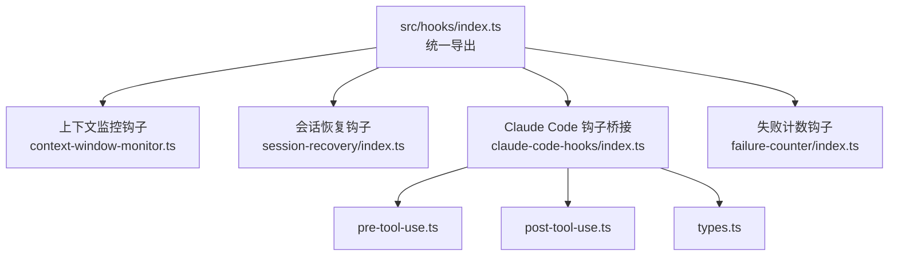
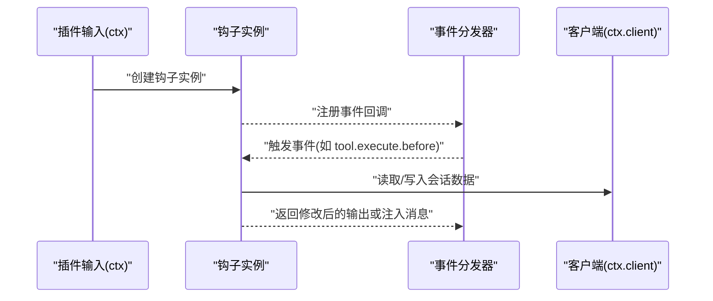
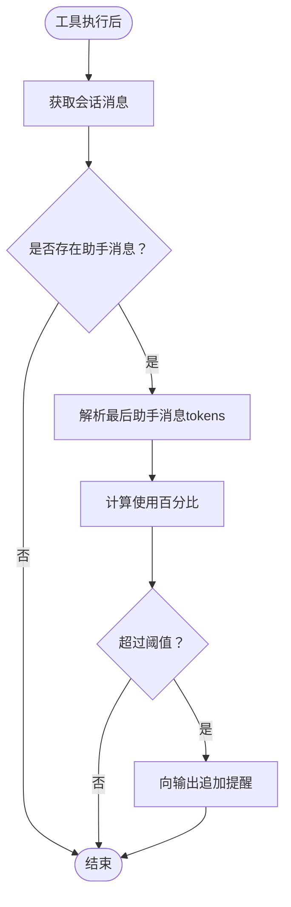
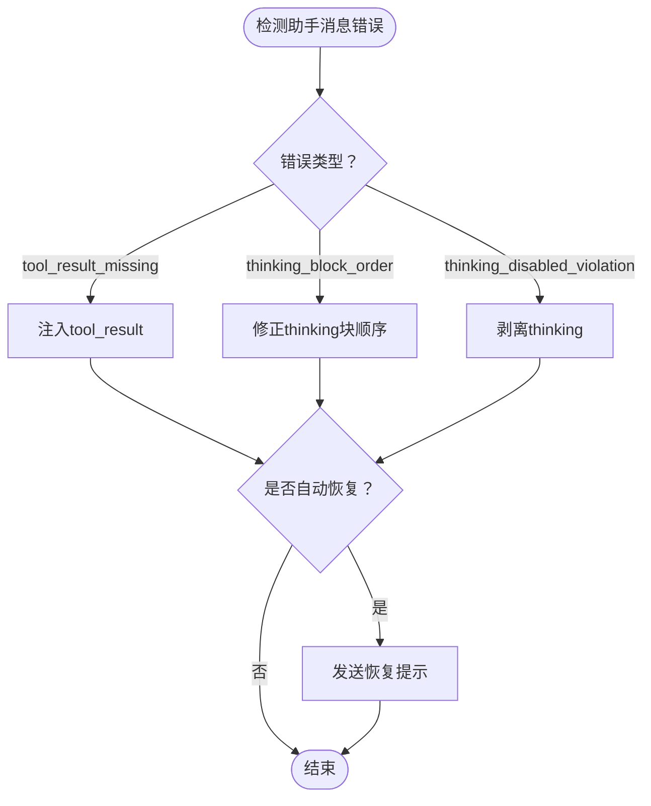
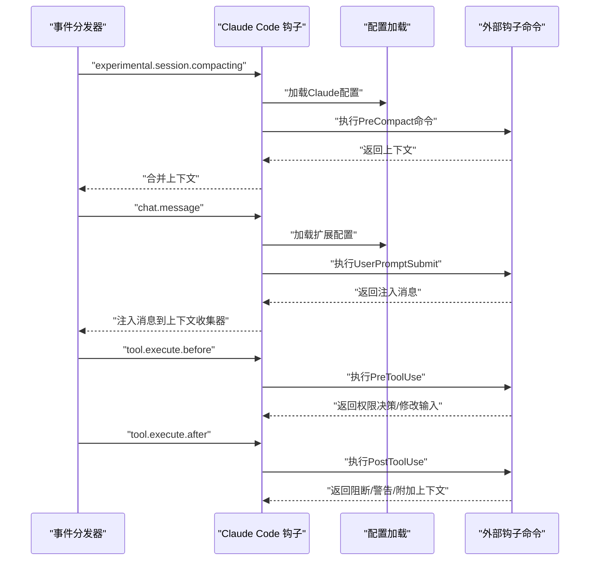
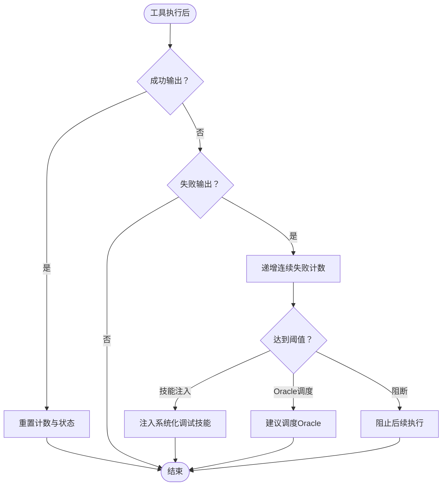
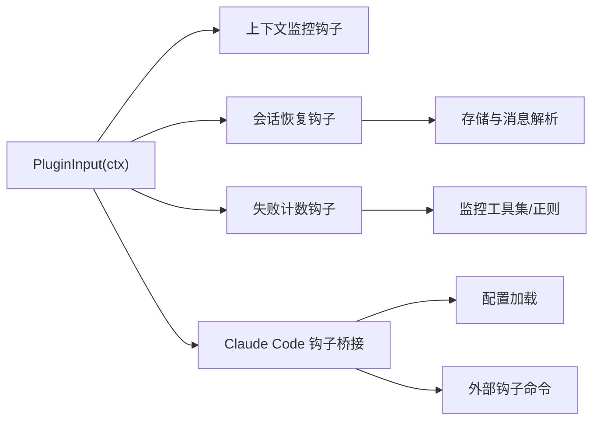

# 钩子扩展开发

<cite>
**本文引用的文件**
- [src/hooks/index.ts](file://src/hooks/index.ts)
- [src/hooks/context-window-monitor.ts](file://src/hooks/context-window-monitor.ts)
- [src/hooks/session-recovery/index.ts](file://src/hooks/session-recovery/index.ts)
- [src/hooks/session-recovery/types.ts](file://src/hooks/session-recovery/types.ts)
- [src/hooks/claude-code-hooks/index.ts](file://src/hooks/claude-code-hooks/index.ts)
- [src/hooks/claude-code-hooks/types.ts](file://src/hooks/claude-code-hooks/types.ts)
- [src/hooks/claude-code-hooks/pre-tool-use.ts](file://src/hooks/claude-code-hooks/pre-tool-use.ts)
- [src/hooks/claude-code-hooks/post-tool-use.ts](file://src/hooks/claude-code-hooks/post-tool-use.ts)
- [src/hooks/failure-counter/index.ts](file://src/hooks/failure-counter/index.ts)
- [src/hooks/tdd-guard/types.ts](file://src/hooks/tdd-guard/types.ts)
- [src/features/hook-message-injector/injector.ts](file://src/features/hook-message-injector/injector.ts)
</cite>

## 目录
1. [简介](#简介)
2. [项目结构](#项目结构)
3. [核心组件](#核心组件)
4. [架构总览](#架构总览)
5. [详细组件分析](#详细组件分析)
6. [依赖分析](#依赖分析)
7. [性能考量](#性能考量)
8. [故障排查指南](#故障排查指南)
9. [结论](#结论)
10. [附录](#附录)

## 简介
本指南面向希望为 Oh My OpenCode 开发钩子扩展的开发者，系统讲解钩子系统的架构与生命周期、createXXXHook 的命名规范与返回值结构、各类钩子的实现模式（上下文监控、会话管理、错误恢复等）、钩子之间的依赖关系与执行顺序，并提供最佳实践与性能优化建议及完整示例与调试方法。

## 项目结构
钩子扩展主要集中在 src/hooks 目录下，每个钩子通常以独立子目录组织，导出一个 createXXXHook 工厂函数；同时，src/hooks/index.ts 统一导出所有可用的钩子工厂，便于插件侧按需启用。

图表来源
- [src/hooks/index.ts](file://src/hooks/index.ts#L1-L48)
- [src/hooks/context-window-monitor.ts](file://src/hooks/context-window-monitor.ts#L1-L100)
- [src/hooks/session-recovery/index.ts](file://src/hooks/session-recovery/index.ts#L1-L433)
- [src/hooks/claude-code-hooks/index.ts](file://src/hooks/claude-code-hooks/index.ts#L1-L200)
- [src/hooks/claude-code-hooks/pre-tool-use.ts](file://src/hooks/claude-code-hooks/pre-tool-use.ts#L1-L173)
- [src/hooks/claude-code-hooks/post-tool-use.ts](file://src/hooks/claude-code-hooks/post-tool-use.ts#L1-L200)
- [src/hooks/claude-code-hooks/types.ts](file://src/hooks/claude-code-hooks/types.ts#L1-L205)
- [src/hooks/failure-counter/index.ts](file://src/hooks/failure-counter/index.ts#L1-L338)

章节来源
- [src/hooks/index.ts](file://src/hooks/index.ts#L1-L48)

## 核心组件
- 钩子工厂函数命名规范
  - 统一使用 createXxxHook 或 createXxx 等前缀，如 createSessionRecoveryHook、createContextWindowMonitorHook、createClaudeCodeHooksHook、createFailureCounterHook。
  - 返回值为一个对象，键名为“事件名字符串”，值为异步处理函数；或包含 event 处理函数的对象，用于订阅会话事件。
- 事件类型与生命周期
  - 工具执行前后事件：tool.execute.before、tool.execute.after。
  - 用户消息提交事件：UserPromptSubmit。
  - 实验性会话压缩事件：experimental.session.compacting。
  - 通用会话事件：session.error、session.deleted、session.idle 等。
- 典型返回值结构
  - 工具执行前/后钩子：返回对象包含对应事件名键，值为函数，入参包含工具名、会话ID、调用ID、输出参数等；可修改输出或注入消息。
  - 会话事件钩子：返回对象包含 event 键，值为异步函数，接收 { event: { type, properties } }。
  - 特定钩子（如会话恢复）：返回对象包含业务方法，如 handleSessionRecovery、setOnRecoveryCompleteCallback 等。

章节来源
- [src/hooks/context-window-monitor.ts](file://src/hooks/context-window-monitor.ts#L33-L99)
- [src/hooks/session-recovery/index.ts](file://src/hooks/session-recovery/index.ts#L321-L432)
- [src/hooks/claude-code-hooks/index.ts](file://src/hooks/claude-code-hooks/index.ts#L36-L200)
- [src/hooks/failure-counter/index.ts](file://src/hooks/failure-counter/index.ts#L107-L335)

## 架构总览
Oh My OpenCode 的钩子系统通过 createXXXHook 工厂函数创建钩子实例，钩子实例以“事件名字符串”为键注册回调，框架在相应生命周期触发这些回调。Claude Code 钩子桥接将外部命令式钩子与 OpenCode 事件模型映射，支持权限决策、内容注入与上下文增强。

图表来源
- [src/hooks/context-window-monitor.ts](file://src/hooks/context-window-monitor.ts#L33-L99)
- [src/hooks/session-recovery/index.ts](file://src/hooks/session-recovery/index.ts#L321-L432)
- [src/hooks/claude-code-hooks/index.ts](file://src/hooks/claude-code-hooks/index.ts#L36-L200)

## 详细组件分析

### 上下文窗口监控钩子（Context Window Monitor）
- 作用：在工具执行后检查最近一次助手消息的输入令牌用量，超过阈值时向输出追加提醒信息。
- 关键点：
  - 通过 session.messages 获取消息列表，解析最后一条助手消息的 tokens 字段。
  - 使用实际限制与显示限制区分计算百分比，避免误导。
  - 在 session.deleted 事件中清理会话状态，防止重复提醒。
- 返回值结构：包含 "tool.execute.after" 与 event 键的对象。

图表来源
- [src/hooks/context-window-monitor.ts](file://src/hooks/context-window-monitor.ts#L33-L99)

章节来源
- [src/hooks/context-window-monitor.ts](file://src/hooks/context-window-monitor.ts#L1-L100)

### 会话恢复钩子（Session Recovery）
- 作用：在助手消息生成失败时，根据错误类型进行结构修复、内容填充或结果注入，必要时自动恢复会话。
- 错误类型识别：缺少 tool_result、thinking 块顺序问题、禁用 thinking 违规等。
- 恢复策略：
  - 缺少 tool_result：注入“用户中断”类的结果。
  - thinking 块顺序问题：前置 thinking 部分或移除孤儿 thinking。
  - 禁用 thinking 违规：剥离 thinking 部分。
- 回调接口：handleSessionRecovery、isRecoverableError、setOnAbortCallback、setOnRecoveryCompleteCallback。
- 数据模型：MessageData、StoredPart 等，定义消息与部件的结构。

图表来源
- [src/hooks/session-recovery/index.ts](file://src/hooks/session-recovery/index.ts#L125-L424)
- [src/hooks/session-recovery/types.ts](file://src/hooks/session-recovery/types.ts#L1-L99)

章节来源
- [src/hooks/session-recovery/index.ts](file://src/hooks/session-recovery/index.ts#L1-L433)
- [src/hooks/session-recovery/types.ts](file://src/hooks/session-recovery/types.ts#L1-L99)

### Claude Code 钩子桥接（Claude Code Hooks）
- 作用：将 Claude Code 的 PreToolUse/PostToolUse/UserPromptSubmit/Stop/PreCompact 等事件映射到 OpenCode 插件事件，执行外部命令式钩子并合并输出。
- 执行顺序：
  - experimental.session.compacting -> PreCompact
  - chat.message -> UserPromptSubmit（可注入消息到上下文收集器）
  - tool.execute.before -> PreToolUse（权限决策、输入修改）
  - tool.execute.after -> PostToolUse（阻断、警告、附加上下文）
  - event -> session.error/session.deleted/session.idle（状态维护）
- 返回值结构：返回对象包含上述事件键，值为异步处理函数；部分事件可直接修改输出或注入消息。

图表来源
- [src/hooks/claude-code-hooks/index.ts](file://src/hooks/claude-code-hooks/index.ts#L36-L200)
- [src/hooks/claude-code-hooks/types.ts](file://src/hooks/claude-code-hooks/types.ts#L1-L205)
- [src/hooks/claude-code-hooks/pre-tool-use.ts](file://src/hooks/claude-code-hooks/pre-tool-use.ts#L46-L173)
- [src/hooks/claude-code-hooks/post-tool-use.ts](file://src/hooks/claude-code-hooks/post-tool-use.ts#L44-L200)

章节来源
- [src/hooks/claude-code-hooks/index.ts](file://src/hooks/claude-code-hooks/index.ts#L1-L200)
- [src/hooks/claude-code-hooks/types.ts](file://src/hooks/claude-code-hooks/types.ts#L1-L205)
- [src/hooks/claude-code-hooks/pre-tool-use.ts](file://src/hooks/claude-code-hooks/pre-tool-use.ts#L1-L173)
- [src/hooks/claude-code-hooks/post-tool-use.ts](file://src/hooks/claude-code-hooks/post-tool-use.ts#L1-L200)

### 失败计数钩子（Failure Counter）
- 作用：跟踪特定工具的连续失败次数，在阈值达到时自动注入调试技能、调度 Oracle 或阻止后续执行，并提供 /reset-failures 命令重置。
- 关键点：
  - 监控工具集合与时间窗口。
  - 成功输出会重置计数与状态。
  - 支持多级响应：技能注入、Oracle 调度、阻断。
- 返回值结构：包含 tool.execute.before、tool.execute.after、UserPromptSubmit 事件键的对象。

图表来源
- [src/hooks/failure-counter/index.ts](file://src/hooks/failure-counter/index.ts#L107-L335)

章节来源
- [src/hooks/failure-counter/index.ts](file://src/hooks/failure-counter/index.ts#L1-L338)

### 测试驱动开发守卫（TDD Guard）
- 作用：对 Tier 2/3 文件强制执行测试驱动开发，基于风险等级与语言适配器进行质量校验，必要时阻断编辑并注入相关技能。
- 关键点：配置项控制启用、风险等级、忽略模式、断言严格度等；提供测试质量检查与阻断结果。

章节来源
- [src/hooks/tdd-guard/types.ts](file://src/hooks/tdd-guard/types.ts#L1-L59)

### 钩子消息注入器（Hook Message Injector）
- 作用：在会话中安全地注入钩子生成的消息，避免空内容注入；提供消息目录与部件 ID 生成逻辑。
- 关键点：校验注入内容长度；在会话目录不存在时自动创建；支持查找已有会话路径。

章节来源
- [src/features/hook-message-injector/injector.ts](file://src/features/hook-message-injector/injector.ts#L82-L127)

## 依赖分析
- 钩子与插件输入（PluginInput）的耦合
  - 多数钩子通过 ctx.client 访问会话 API，读取消息、发送提示、中止会话等。
- 钩子间依赖
  - Claude Code 钩子桥接依赖配置加载模块与外部命令执行工具。
  - 会话恢复钩子依赖存储与消息解析工具（findMessagesWithEmptyTextParts 等）。
  - 失败计数钩子依赖预定义的监控工具集与正则模式。
- 事件依赖
  - PreToolUse/PostToolUse 依赖工具执行生命周期；UserPromptSubmit 依赖用户消息提交；PreCompact 依赖会话压缩阶段。

图表来源
- [src/hooks/context-window-monitor.ts](file://src/hooks/context-window-monitor.ts#L1-L100)
- [src/hooks/session-recovery/index.ts](file://src/hooks/session-recovery/index.ts#L1-L433)
- [src/hooks/failure-counter/index.ts](file://src/hooks/failure-counter/index.ts#L1-L338)
- [src/hooks/claude-code-hooks/index.ts](file://src/hooks/claude-code-hooks/index.ts#L1-L200)

## 性能考量
- 异步与幂等
  - 钩子回调均为异步，避免阻塞主流程；对同一会话的处理应具备幂等性，避免重复注入或重复恢复。
- I/O 与缓存
  - 会话恢复钩子涉及文件系统读写，应尽量减少不必要的磁盘访问；优先使用 API 获取消息列表。
- 条件短路
  - 在工具执行前根据配置快速判断是否需要执行钩子，避免无效命令调用。
- 超时与降级
  - 对外部命令执行设置超时；对网络请求与文件操作采用优雅降级，保证主流程稳定。

## 故障排查指南
- 常见问题定位
  - 工具执行前被意外阻断：检查 PreToolUse 返回的权限决策与原因；确认外部钩子命令是否正确返回 JSON 结构。
  - 输出未注入：检查 PostToolUse 是否返回 systemMessage/warnings/additionalContext；确认 Claude Code 配置是否禁用该钩子。
  - 会话恢复失败：查看 detectErrorType 的错误类型匹配；确认存储层读取是否成功；关注自动恢复开关。
  - 上下文监控不生效：确认 session.messages 能正常获取；检查会话删除事件是否清理了提醒状态。
- 调试建议
  - 启用日志：利用钩子内部的日志记录关键路径与耗时。
  - 单元测试：参考各钩子目录下的测试文件，验证边界条件与错误分支。
  - 配置核对：检查 disabledHooks、ignore_patterns、risk_tier_enabled 等配置项。

章节来源
- [src/hooks/claude-code-hooks/index.ts](file://src/hooks/claude-code-hooks/index.ts#L314-L354)
- [src/hooks/session-recovery/index.ts](file://src/hooks/session-recovery/index.ts#L394-L424)
- [src/hooks/context-window-monitor.ts](file://src/hooks/context-window-monitor.ts#L77-L82)

## 结论
Oh My OpenCode 的钩子系统通过清晰的生命周期事件与统一的 createXXXHook 规范，提供了强大的扩展能力。Claude Code 钩子桥接进一步打通外部命令式钩子生态。开发者应遵循事件驱动、异步非阻塞、条件短路与降级容错的原则，结合测试与日志，构建稳定可靠的钩子扩展。

## 附录

### 钩子开发最佳实践
- 命名与导出
  - 使用 createXxxHook 前缀，返回值为事件回调对象；在 src/hooks/index.ts 中集中导出。
- 输入与输出
  - 严格解构输入参数，对可选字段进行防御性检查；对输出进行最小化修改，避免破坏原有意图。
- 事件选择
  - 仅在必要阶段注册回调；对 session.* 事件进行状态管理，及时清理。
- 错误处理
  - 对外部命令与网络请求捕获异常并记录；在失败时返回合理的默认行为或降级方案。
- 可观测性
  - 记录关键路径耗时与事件类型；提供可配置的日志级别与开关。

### 钩子类型实现模式速览
- 上下文监控：在工具执行后读取最新消息，基于 tokens 百分比决定是否注入提醒。
- 会话管理：在 session.error/session.deleted/session.idle 中维护状态，必要时中止或恢复。
- 错误恢复：根据错误类型选择修复策略，优先使用 API 读取与写入，其次回退到存储层。
- 权限与输入修改：在 tool.execute.before 决策是否允许、是否修改输入。
- 输出增强：在 tool.execute.after 注入 warnings、systemMessage、additionalContext。
- 消息注入：通过上下文收集器或直接发送提示，避免空内容注入。

### 完整开发示例（步骤指引）
- 创建目录与入口
  - 在 src/hooks 下新建 my-hook 子目录，实现 createMyHook(ctx, options?) 导出。
- 设计事件回调
  - 根据需求注册 tool.execute.before/after、UserPromptSubmit、event 等键。
- 集成到插件
  - 在 src/hooks/index.ts 中导出 createMyHook；在插件配置中启用。
- 测试与调试
  - 编写单元测试覆盖关键分支；通过日志与 TUI 提示观察行为；必要时开启详细日志。