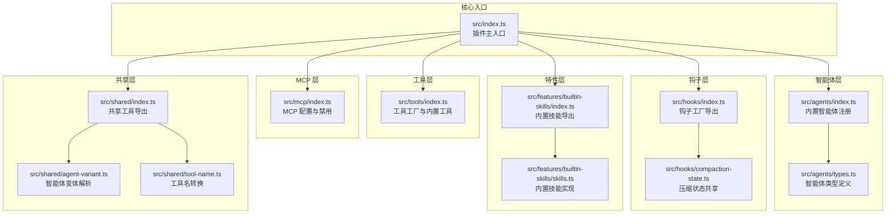
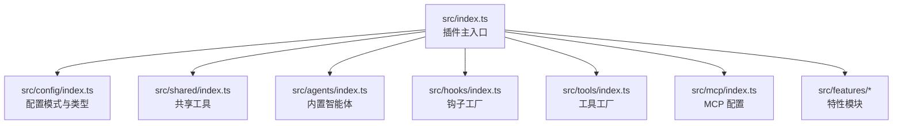
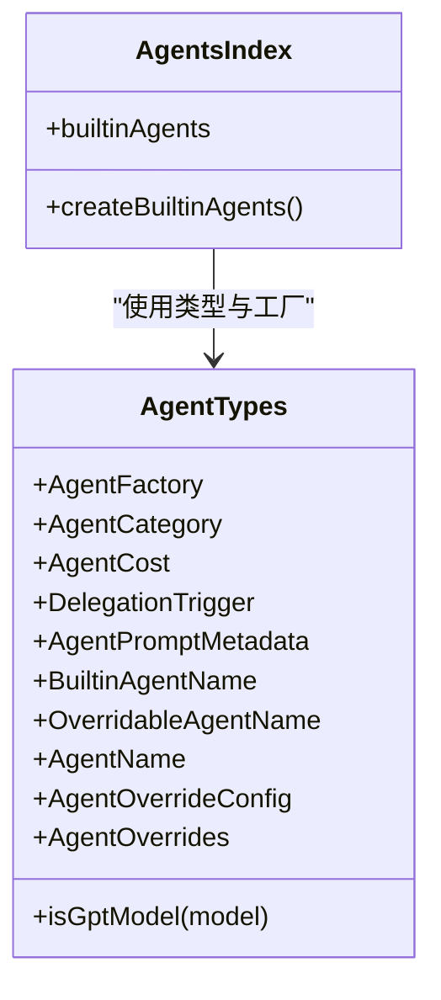
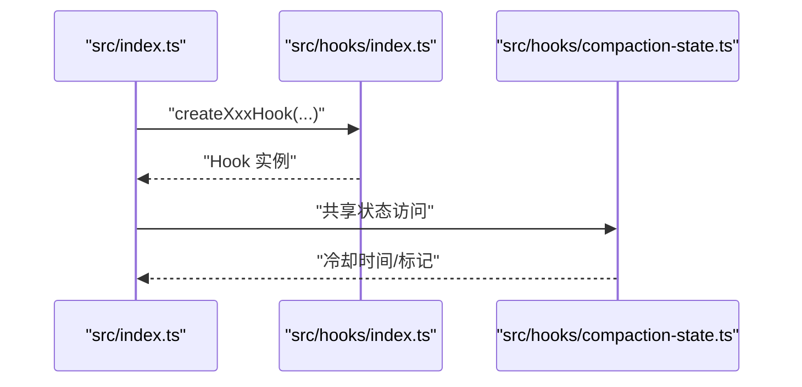
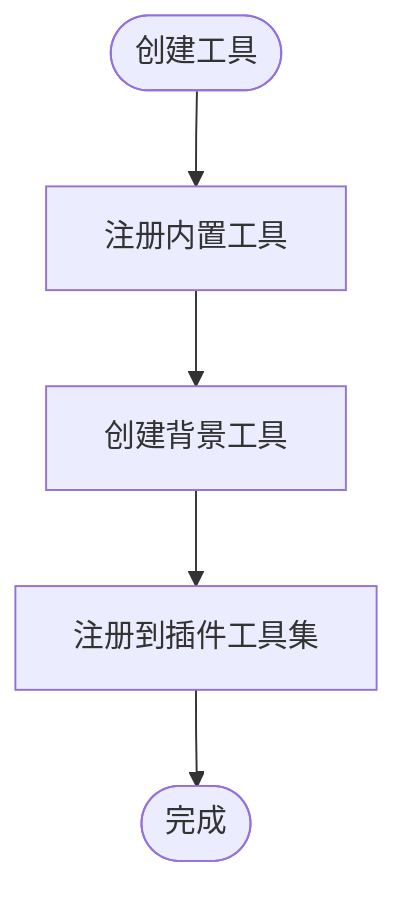
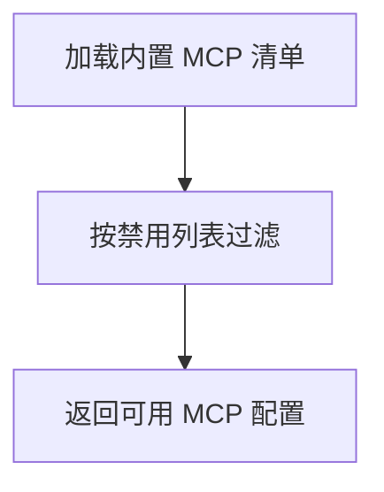
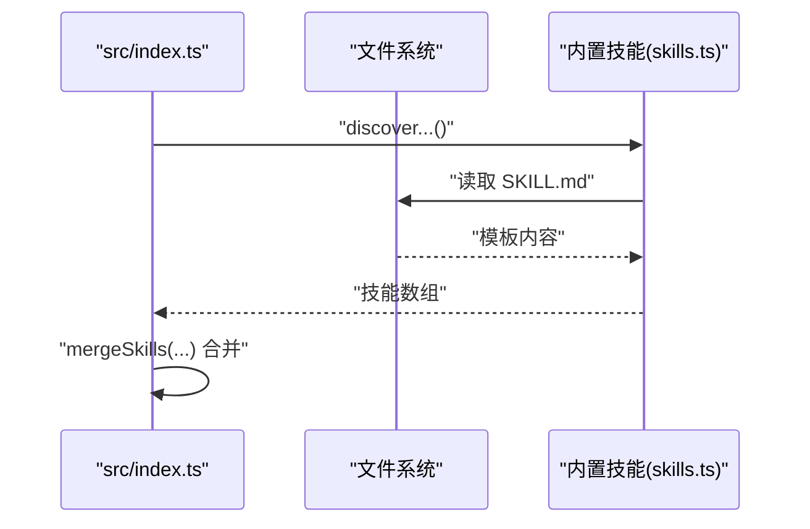
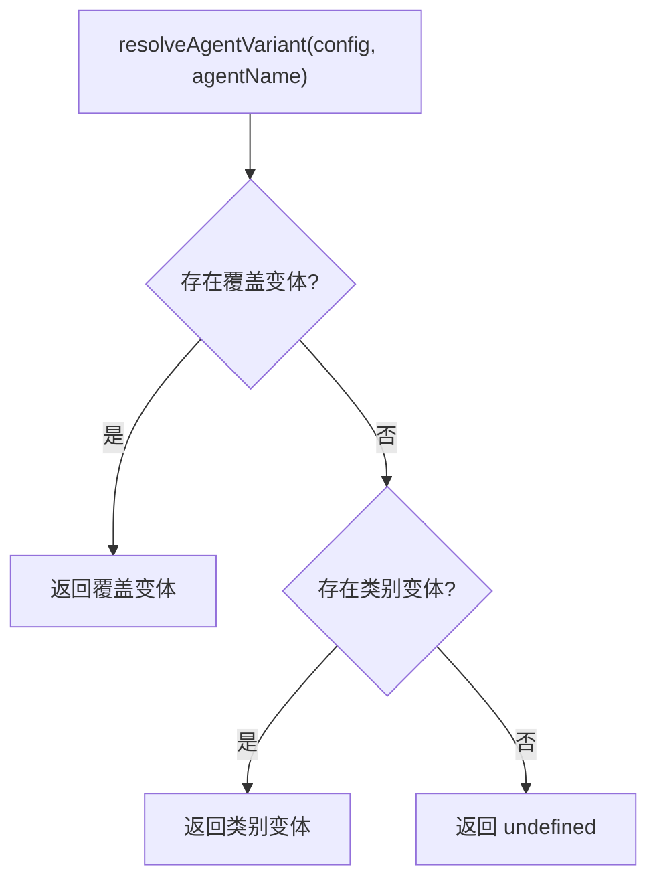
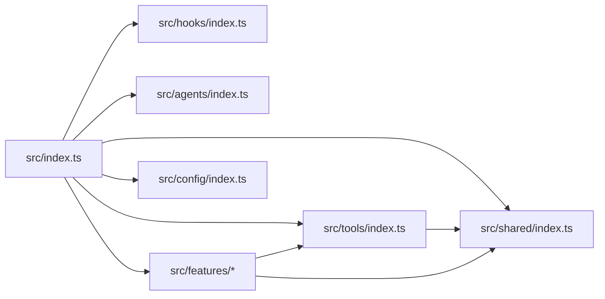

# 项目结构说明

<cite>
**本文档引用的文件**
- [src/index.ts](file://src/index.ts)
- [src/agents/index.ts](file://src/agents/index.ts)
- [src/agents/types.ts](file://src/agents/types.ts)
- [src/hooks/index.ts](file://src/hooks/index.ts)
- [src/hooks/compaction-state.ts](file://src/hooks/compaction-state.ts)
- [src/tools/index.ts](file://src/tools/index.ts)
- [src/mcp/index.ts](file://src/mcp/index.ts)
- [src/features/builtin-skills/index.ts](file://src/features/builtin-skills/index.ts)
- [src/features/builtin-skills/skills.ts](file://src/features/builtin-skills/skills.ts)
- [src/shared/index.ts](file://src/shared/index.ts)
- [src/shared/agent-variant.ts](file://src/shared/agent-variant.ts)
- [src/shared/tool-name.ts](file://src/shared/tool-name.ts)
- [src/config/index.ts](file://src/config/index.ts)
- [package.json](file://package.json)
- [tsconfig.json](file://tsconfig.json)
</cite>

## 目录
1. [简介](#简介)
2. [项目结构](#项目结构)
3. [核心组件](#核心组件)
4. [架构总览](#架构总览)
5. [详细组件分析](#详细组件分析)
6. [依赖关系分析](#依赖关系分析)
7. [性能考量](#性能考量)
8. [故障排除指南](#故障排除指南)
9. [结论](#结论)
10. [附录](#附录)

## 简介
本文件为 Oh My OpenCode 项目的项目结构说明文档，面向开发者与维护者，系统阐述源码目录组织原则、模块职责边界、命名约定、导入导出模式（barrel exports）以及模块间交互关系与数据流。重点覆盖以下核心目录：
- src/agents：内置智能体定义与工厂
- src/hooks：插件生命周期钩子集合
- src/tools：工具集与 LSP/AST/Grep 等能力封装
- src/mcp：MCP 服务器配置与管理
- src/features：特性化功能模块（技能加载、会话状态、后台任务等）
- src/shared：跨模块共享工具与通用能力
- src/config：配置模式与类型声明

同时，文档提供模块交互图、数据流图与最佳实践建议，帮助读者快速理解并扩展该插件。

## 项目结构
项目采用按“领域/职责”分层的目录组织方式，遵循“单一职责、清晰边界、可组合”的原则。核心目录如下：
- src/agents：内置智能体注册与类型定义
- src/hooks：插件生命周期钩子的工厂函数与导出
- src/tools：工具集合与背景任务封装
- src/mcp：MCP 服务器清单与禁用策略
- src/features：业务特性模块（技能加载、会话状态、后台代理等）
- src/shared：跨模块复用的工具与通用逻辑
- src/config：配置模式与类型声明
- src/cli：命令行入口与子命令（不在本次文档重点范围内）
- 其他：bin、script、docs、assets 等辅助资源

图表来源
- [src/index.ts](file://src/index.ts#L86-L606)
- [src/agents/index.ts](file://src/agents/index.ts#L1-L37)
- [src/agents/types.ts](file://src/agents/types.ts#L1-L87)
- [src/hooks/index.ts](file://src/hooks/index.ts#L1-L48)
- [src/hooks/compaction-state.ts](file://src/hooks/compaction-state.ts#L1-L49)
- [src/tools/index.ts](file://src/tools/index.ts#L1-L73)
- [src/mcp/index.ts](file://src/mcp/index.ts#L1-L33)
- [src/features/builtin-skills/index.ts](file://src/features/builtin-skills/index.ts#L1-L3)
- [src/features/builtin-skills/skills.ts](file://src/features/builtin-skills/skills.ts#L1-L200)
- [src/shared/index.ts](file://src/shared/index.ts#L1-L29)
- [src/shared/agent-variant.ts](file://src/shared/agent-variant.ts#L1-L41)
- [src/shared/tool-name.ts](file://src/shared/tool-name.ts#L1-L27)

章节来源
- [src/index.ts](file://src/index.ts#L86-L606)
- [src/agents/index.ts](file://src/agents/index.ts#L1-L37)
- [src/hooks/index.ts](file://src/hooks/index.ts#L1-L48)
- [src/tools/index.ts](file://src/tools/index.ts#L1-L73)
- [src/mcp/index.ts](file://src/mcp/index.ts#L1-L33)
- [src/features/builtin-skills/index.ts](file://src/features/builtin-skills/index.ts#L1-L3)
- [src/shared/index.ts](file://src/shared/index.ts#L1-L29)

## 核心组件
本节从“职责-接口-依赖”三个维度，对核心目录进行深入剖析，并给出命名约定与模块组织方式。

- src/agents
  - 职责：集中注册与导出内置智能体；提供智能体类型与工厂方法；支持按需覆盖与变体注入。
  - 命名约定：智能体文件使用短横线命名（如 explore.ts），类型导出统一在 index.ts 中聚合。
  - 依赖关系：依赖 SDK 的 AgentConfig 类型；通过 utils 提供创建工厂；类型定义位于 types.ts。
  - 关键路径
    - [内置智能体注册](file://src/agents/index.ts#L17-L32)
    - [智能体类型定义](file://src/agents/types.ts#L59-L87)

- src/hooks
  - 职责：提供插件生命周期钩子工厂，涵盖会话恢复、通知、规则注入、关键词检测、上下文窗口监控、自动更新检查、交互式 Bash、错误恢复、任务重试、Sisyphus 协调器、提示词限制、任务恢复信息、启动工作、超能力建议、规划流程引导、TDD 保护等。
  - 命名约定：钩子工厂以 createXxxHook 形式命名，导出统一在 index.ts 中 barrel。
  - 依赖关系：部分钩子依赖 shared 工具与 features 状态；钩子之间通过事件/消息流协作。
  - 关键路径
    - [钩子工厂导出](file://src/hooks/index.ts#L1-L48)
    - [压缩状态共享](file://src/hooks/compaction-state.ts#L1-L49)

- src/tools
  - 职责：封装 LSP、AST-Grep、Grep、Glob、会话管理、交互式 Bash、技能工具、MCP 技能工具、斜杠命令工具、背景任务工具等。
  - 命名约定：工具函数以动宾结构命名（如 createXxx、session_xxx），内置工具以小驼峰形式暴露。
  - 组织方式：index.ts 聚合导出，按功能域拆分子模块，支持动态创建背景工具。
  - 关键路径
    - [工具工厂与内置工具](file://src/tools/index.ts#L57-L73)
    - [背景工具创建](file://src/tools/index.ts#L50-L55)

- src/mcp
  - 职责：定义内置 MCP 服务器清单，支持按名称禁用；提供创建函数返回可用 MCP 列表。
  - 命名约定：MCP 名称使用小写与连字符；类型导出 McpName。
  - 组织方式：index.ts 聚合导出类型与配置；通过禁用列表过滤可用 MCP。
  - 关键路径
    - [MCP 清单与禁用策略](file://src/mcp/index.ts#L16-L32)

- src/features
  - 职责：内置技能加载、会话状态管理、后台代理、任务提示管理、Claude Code 加载器、Hook 注入器等。
  - 命名约定：模块内以 index.ts 聚合导出；具体功能模块按职责命名（如 builtin-skills、claude-code-*）。
  - 组织方式：features 下多为“领域特性”，通过工具层与钩子层协同工作。
  - 关键路径
    - [内置技能导出](file://src/features/builtin-skills/index.ts#L1-L3)
    - [内置技能实现](file://src/features/builtin-skills/skills.ts#L1-L200)

- src/shared
  - 职责：提供跨模块复用的工具与通用逻辑，如前端处理、命令执行、文件解析、日志、蛇形转 Pascal、工具名转换、模式匹配、配置路径、版本管理、权限兼容、外部插件检测、压缩提取、智能体变体、会话游标、Shell 环境、系统指令、智能体工具限制等。
  - 命名约定：工具函数语义化命名；类型与常量导出在 index.ts 聚合。
  - 关键路径
    - [共享工具导出](file://src/shared/index.ts#L1-L29)
    - [智能体变体解析](file://src/shared/agent-variant.ts#L3-L29)
    - [工具名转换](file://src/shared/tool-name.ts#L15-L26)

- src/config
  - 职责：集中导出配置模式与类型声明，确保配置校验与类型安全。
  - 命名约定：以 Schema 结尾的 Zod 模式；类型以 Config 结尾。
  - 关键路径
    - [配置模式与类型导出](file://src/config/index.ts#L1-L27)

章节来源
- [src/agents/index.ts](file://src/agents/index.ts#L1-L37)
- [src/agents/types.ts](file://src/agents/types.ts#L1-L87)
- [src/hooks/index.ts](file://src/hooks/index.ts#L1-L48)
- [src/hooks/compaction-state.ts](file://src/hooks/compaction-state.ts#L1-L49)
- [src/tools/index.ts](file://src/tools/index.ts#L1-L73)
- [src/mcp/index.ts](file://src/mcp/index.ts#L1-L33)
- [src/features/builtin-skills/index.ts](file://src/features/builtin-skills/index.ts#L1-L3)
- [src/features/builtin-skills/skills.ts](file://src/features/builtin-skills/skills.ts#L1-L200)
- [src/shared/index.ts](file://src/shared/index.ts#L1-L29)
- [src/shared/agent-variant.ts](file://src/shared/agent-variant.ts#L1-L41)
- [src/shared/tool-name.ts](file://src/shared/tool-name.ts#L1-L27)
- [src/config/index.ts](file://src/config/index.ts#L1-L27)

## 架构总览
下图展示插件主入口如何装配各层组件，形成“钩子-工具-智能体-特性-共享”的协作架构。

图表来源
- [src/index.ts](file://src/index.ts#L86-L606)
- [src/config/index.ts](file://src/config/index.ts#L1-L27)
- [src/shared/index.ts](file://src/shared/index.ts#L1-L29)
- [src/agents/index.ts](file://src/agents/index.ts#L1-L37)
- [src/hooks/index.ts](file://src/hooks/index.ts#L1-L48)
- [src/tools/index.ts](file://src/tools/index.ts#L1-L73)
- [src/mcp/index.ts](file://src/mcp/index.ts#L1-L33)

## 详细组件分析

### 智能体模块（src/agents）
- 设计要点
  - 通过 index.ts 聚合导出内置智能体配置与工厂，便于上层统一注册。
  - 类型定义集中在 types.ts，包含智能体分类、成本、委托触发器、提示元数据等。
- 交互关系
  - 主入口在 src/index.ts 中按配置启用/覆盖智能体变体，并在会话消息阶段应用。
- 复杂度与性能
  - 智能体注册为 O(n) 遍历；变体解析为 O(1) 查找。
- 错误处理
  - 变体缺失时回退默认行为；未找到覆盖配置时保持原样。

图表来源
- [src/agents/types.ts](file://src/agents/types.ts#L1-L87)
- [src/agents/index.ts](file://src/agents/index.ts#L1-L37)

章节来源
- [src/agents/index.ts](file://src/agents/index.ts#L1-L37)
- [src/agents/types.ts](file://src/agents/types.ts#L1-L87)

### 钩子模块（src/hooks）
- 设计要点
  - 以 createXxxHook 工厂函数形式提供钩子实例，统一在 index.ts 导出。
  - 支持按配置禁用特定钩子；部分钩子共享状态（如压缩状态）。
- 交互关系
  - 主入口在 src/index.ts 中根据配置创建钩子实例，并在 chat.message、event、tool.execute.before/after 等生命周期中调用。
- 复杂度与性能
  - 钩子创建为 O(1)；事件处理为 O(k)（k 为已启用钩子数量）。
- 错误处理
  - 对外部冲突（如通知插件冲突）进行检测与降级处理。

图表来源
- [src/index.ts](file://src/index.ts#L97-L258)
- [src/hooks/index.ts](file://src/hooks/index.ts#L1-L48)
- [src/hooks/compaction-state.ts](file://src/hooks/compaction-state.ts#L1-L49)

章节来源
- [src/hooks/index.ts](file://src/hooks/index.ts#L1-L48)
- [src/hooks/compaction-state.ts](file://src/hooks/compaction-state.ts#L1-L49)
- [src/index.ts](file://src/index.ts#L97-L258)

### 工具模块（src/tools）
- 设计要点
  - 聚合导出内置工具与动态创建背景工具；支持 LSP、AST-Grep、Grep、Glob、会话管理、交互式 Bash、技能工具、MCP 技能工具、斜杠命令工具等。
  - 通过 createBackgroundTools 动态生成背景输出与取消工具。
- 交互关系
  - 主入口在 src/index.ts 中创建工具实例并注册到插件工具集。
- 复杂度与性能
  - 工具创建为 O(1)；背景工具按需创建，避免无谓开销。
- 错误处理
  - 工具执行前后钩子负责截断输出、注入上下文、检测空响应等。

图表来源
- [src/tools/index.ts](file://src/tools/index.ts#L50-L73)

章节来源
- [src/tools/index.ts](file://src/tools/index.ts#L1-L73)

### MCP 模块（src/mcp）
- 设计要点
  - 定义内置 MCP 服务器清单（websearch、context7、grep_app），支持按名称禁用。
  - 提供 createBuiltinMcps 函数，返回可用 MCP 配置字典。
- 交互关系
  - 主入口在 src/index.ts 中获取系统 MCP 名称，过滤内置 MCP 并合并用户/全局/项目技能。
- 复杂度与性能
  - 过滤操作为 O(n)（n 为内置 MCP 数量）。
- 错误处理
  - 禁用列表为空时返回全部内置 MCP。

图表来源
- [src/mcp/index.ts](file://src/mcp/index.ts#L16-L32)

章节来源
- [src/mcp/index.ts](file://src/mcp/index.ts#L1-L33)

### 特性模块（src/features）
- 设计要点
  - 内置技能加载：从文件系统读取 SKILL.md 模板，解析前置内容，构建技能对象。
  - 会话状态管理：设置/获取主会话 ID、更新会话代理、清理临时目录客户端等。
  - 后台代理：管理后台任务与并发控制。
  - Hook 注入器：上下文收集、消息变换、规则注入等。
- 交互关系
  - 主入口在 src/index.ts 中发现并合并用户/全局/项目技能，创建技能工具与 MCP 技能工具。
- 复杂度与性能
  - 技能模板缓存提升重复读取效率；并发控制由后台代理管理。
- 错误处理
  - 文件不存在时返回空模板；会话删除时清理相关状态。

图表来源
- [src/index.ts](file://src/index.ts#L286-L299)
- [src/features/builtin-skills/skills.ts](file://src/features/builtin-skills/skills.ts#L11-L30)

章节来源
- [src/features/builtin-skills/index.ts](file://src/features/builtin-skills/index.ts#L1-L3)
- [src/features/builtin-skills/skills.ts](file://src/features/builtin-skills/skills.ts#L1-L200)
- [src/index.ts](file://src/index.ts#L286-L299)

### 共享模块（src/shared）
- 设计要点
  - 提供跨模块复用的工具：前端处理、命令执行、文件解析、日志、蛇形转 Pascal、工具名转换、模式匹配、配置路径、版本管理、权限兼容、外部插件检测、压缩提取、智能体变体、会话游标、Shell 环境、系统指令、智能体工具限制等。
  - 智能体变体解析：优先使用智能体覆盖变体，否则回退到类别变体。
  - 工具名转换：将短横线/下划线命名转换为 PascalCase 或首字母大写。
- 交互关系
  - 主入口在 src/index.ts 中调用变体解析与上下文收集等共享能力。
- 复杂度与性能
  - 变体解析与工具名转换均为 O(1)。
- 错误处理
  - 变体缺失时保持消息不变；工具名转换对特殊映射有兜底。

图表来源
- [src/shared/agent-variant.ts](file://src/shared/agent-variant.ts#L3-L29)

章节来源
- [src/shared/index.ts](file://src/shared/index.ts#L1-L29)
- [src/shared/agent-variant.ts](file://src/shared/agent-variant.ts#L1-L41)
- [src/shared/tool-name.ts](file://src/shared/tool-name.ts#L1-L27)
- [src/index.ts](file://src/index.ts#L40-L53)

## 依赖关系分析
- 模块耦合
  - 主入口对各层均有依赖，但通过 index.ts 聚合导出降低上层耦合。
  - 钩子与特性层通过事件/消息流松耦合协作。
- 直接与间接依赖
  - 主入口直接依赖 hooks、tools、features、shared、config。
  - features 依赖 shared 与 tools；tools 依赖 shared。
- 循环依赖
  - 未见循环依赖迹象；各层职责清晰，barrel 导出避免深层相互引用。
- 外部依赖
  - 依赖 @opencode-ai/*、@modelcontextprotocol/sdk、@ast-grep/* 等。

图表来源
- [src/index.ts](file://src/index.ts#L86-L606)
- [src/hooks/index.ts](file://src/hooks/index.ts#L1-L48)
- [src/tools/index.ts](file://src/tools/index.ts#L1-L73)
- [src/agents/index.ts](file://src/agents/index.ts#L1-L37)
- [src/features/builtin-skills/index.ts](file://src/features/builtin-skills/index.ts#L1-L3)
- [src/shared/index.ts](file://src/shared/index.ts#L1-L29)
- [src/config/index.ts](file://src/config/index.ts#L1-L27)

章节来源
- [src/index.ts](file://src/index.ts#L86-L606)
- [src/config/index.ts](file://src/config/index.ts#L1-L27)

## 性能考量
- 模块加载
  - 使用 barrel 导出减少上层 import 数量，降低模块解析开销。
- 缓存与懒加载
  - 内置技能模板缓存（Map）避免重复读取文件；钩子按配置启用，避免无效初始化。
- 并发与后台任务
  - 后台代理管理并发与任务队列；压缩状态冷却期避免频繁触发。
- I/O 优化
  - 文件系统读取仅在首次加载技能时发生；后续复用缓存。

## 故障排除指南
- 插件冲突导致的通知问题
  - 现象：外部通知插件与内置通知冲突。
  - 处理：主入口检测外部通知插件并在未强制启用时禁用内置通知。
  - 参考路径：[冲突检测与降级](file://src/index.ts#L104-L120)
- 会话错误恢复
  - 现象：会话错误触发恢复流程。
  - 处理：主入口在 event 中识别 recoverable 错误并调用会话恢复钩子。
  - 参考路径：[会话错误处理](file://src/index.ts#L487-L511)
- 工具输出截断
  - 现象：工具输出过长影响上下文窗口。
  - 处理：tool.execute.after 钩子负责截断输出。
  - 参考路径：[输出截断钩子](file://src/hooks/index.ts#L6-L6)
- 空任务响应检测
  - 现象：助手未生成有效响应。
  - 处理：tool.execute.after 钩子检测并提示。
  - 参考路径：[空响应检测钩子](file://src/hooks/index.ts#L9-L9)
- 交互式 Bash 会话
  - 现象：非交互环境或 tmux 异常。
  - 处理：钩子负责检测与提示；工具提供 tmux 路径查询。
  - 参考路径：[交互式 Bash 钩子](file://src/hooks/index.ts#L21-L22)、[tmux 路径查询](file://src/tools/index.ts#L33-L33)

章节来源
- [src/index.ts](file://src/index.ts#L104-L120)
- [src/index.ts](file://src/index.ts#L487-L511)
- [src/hooks/index.ts](file://src/hooks/index.ts#L6-L9)
- [src/hooks/index.ts](file://src/hooks/index.ts#L21-L22)
- [src/tools/index.ts](file://src/tools/index.ts#L33-L33)

## 结论
Oh My OpenCode 采用清晰的分层架构与 barrel 导出模式，实现了“配置驱动、钩子编排、工具聚合、特性解耦、共享复用”。通过智能体变体解析、上下文注入、技能加载与 MCP 管理，形成了可扩展、可维护的插件体系。建议在新增功能时遵循现有命名约定与模块组织方式，优先使用 barrel 导出与类型约束，确保一致性与可测试性。

## 附录
- 构建与导出
  - 主入口导出：插件主入口与配置模式。
  - CLI 导出：CLI 子模块独立构建。
  - 参考路径：[构建脚本与导出配置](file://package.json#L19-L35)
- 类型配置
  - TypeScript 配置：ESNext 目标、bundler 解析、严格模式。
  - 参考路径：[TS 配置](file://tsconfig.json#L1-L21)

章节来源
- [package.json](file://package.json#L19-L35)
- [tsconfig.json](file://tsconfig.json#L1-L21)