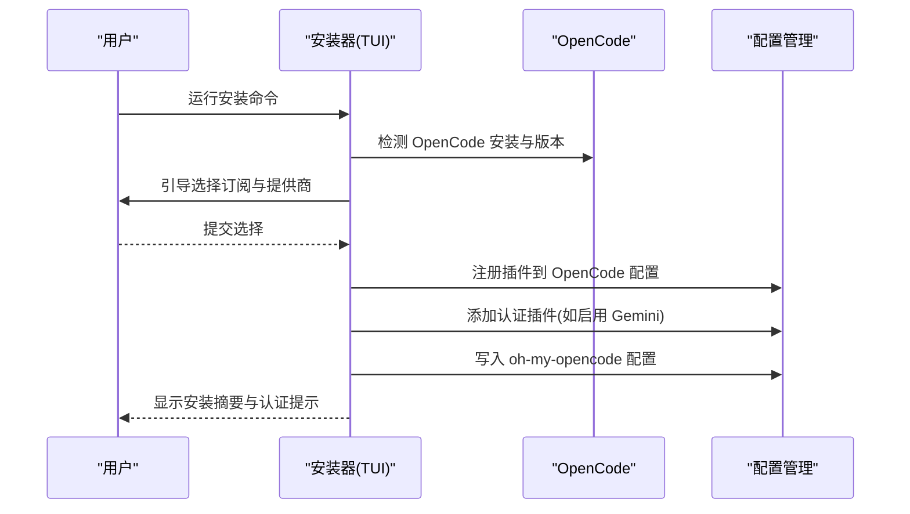
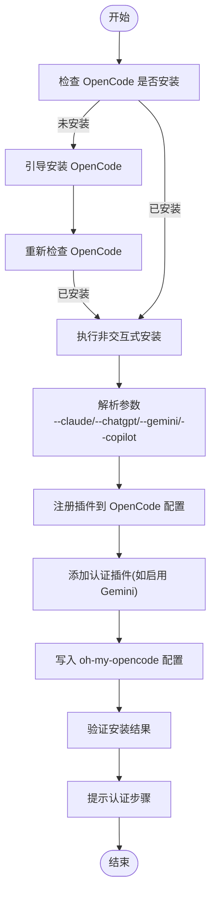
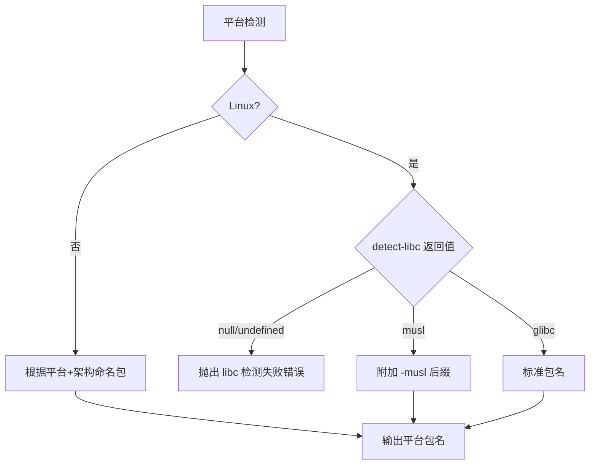
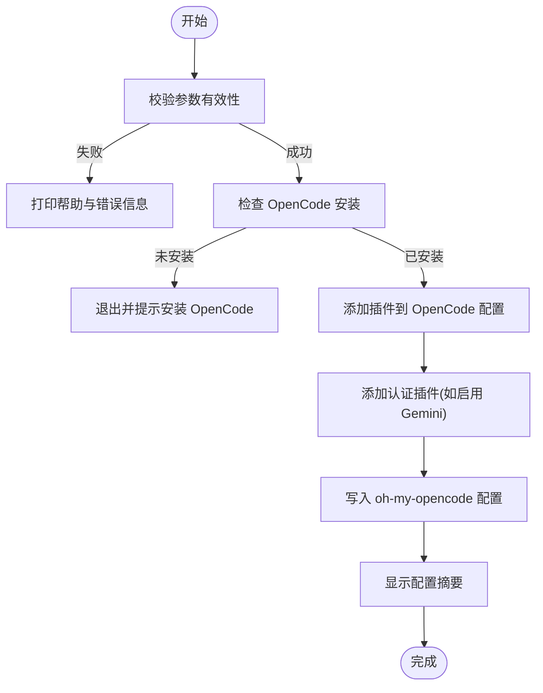
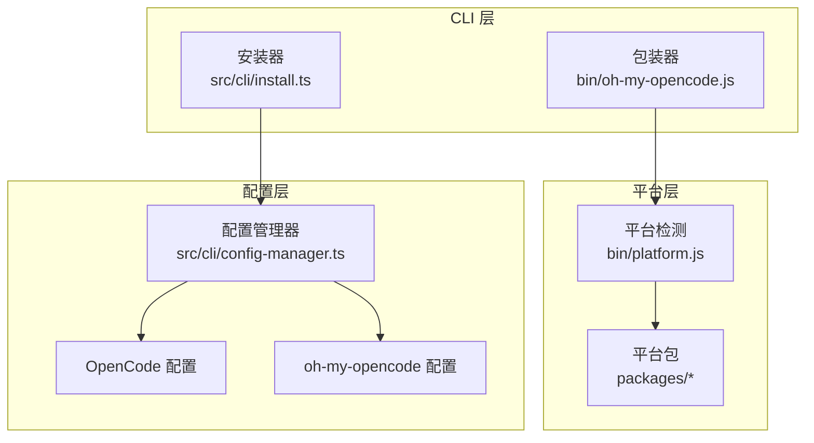

# 安装指南

<cite>
**本文档引用的文件**
- [README.md](file://README.md)
- [package.json](file://package.json)
- [bin/oh-my-opencode.js](file://bin/oh-my-opencode.js)
- [bin/platform.js](file://bin/platform.js)
- [bin/platform.test.ts](file://bin/platform.test.ts)
- [postinstall.mjs](file://postinstall.mjs)
- [script/build-binaries.ts](file://script/build-binaries.ts)
- [src/cli/install.ts](file://src/cli/install.ts)
- [src/cli/types.ts](file://src/cli/types.ts)
- [src/cli/config-manager.ts](file://src/cli/config-manager.ts)
- [docs/cli-guide.md](file://docs/cli-guide.md)
- [packages/darwin-arm64/package.json](file://packages/darwin-arm64/package.json)
</cite>

## 目录
1. [简介](#简介)
2. [系统要求与前置条件](#系统要求与前置条件)
3. [安装方式概览](#安装方式概览)
4. [人类用户安装流程](#人类用户安装流程)
5. [LLM 代理安装流程](#llm-代理安装流程)
6. [平台支持与差异](#平台支持与差异)
7. [非交互式安装参数](#非交互式安装参数)
8. [安装验证与配置](#安装验证与配置)
9. [常见问题与故障排除](#常见问题与故障排除)
10. [架构与工作原理](#架构与工作原理)
11. [总结](#总结)

## 简介
本指南面向两类用户：需要手动安装 Oh My OpenCode 的人类用户，以及需要自动化安装的 LLM 代理。文档覆盖从系统要求、平台差异到安装验证、故障排除的完整流程，并提供针对初学者友好的说明与高级用户的深度技术细节。

## 系统要求与前置条件
- 需要已安装 OpenCode（版本需满足最低要求），安装后可通过命令行调用。
- 支持的操作系统与架构：
  - macOS：ARM64、x64
  - Linux：x64（glibc）、ARM64（glibc）、x64（musl）、ARM64（musl）
  - Windows：x64
- 运行时环境：CLI 执行无需运行时（Bun/Node.js），但安装过程中可能需要网络访问以解析包信息。

章节来源
- [README.md](file://README.md#L270-L275)
- [package.json](file://package.json#L78-L86)

## 安装方式概览
- 人类用户推荐使用交互式安装器，通过 TUI 引导完成配置。
- LLM 代理可使用非交互式模式，通过命令行参数自动完成安装。
- 两种方式最终都会在 OpenCode 配置中注册插件，并生成 oh-my-opencode 的配置文件。

章节来源
- [README.md](file://README.md#L260-L282)
- [docs/cli-guide.md](file://docs/cli-guide.md#L31-L55)

## 人类用户安装流程
- 步骤 1：启动交互式安装器
  - 使用 npx 或 bunx 执行安装命令，进入 TUI 引导。
- 步骤 2：选择订阅与提供商
  - 根据是否有 Claude Pro/Max、ChatGPT、Gemini 订阅进行选择。
  - 可选是否启用 GitHub Copilot 作为回退提供商。
- 步骤 3：自动配置
  - 安装器会自动添加插件、配置认证插件（如启用 Gemini）、写入 oh-my-opencode 配置。
- 步骤 4：验证与认证
  - 检查 OpenCode 版本与插件注册状态。
  - 按提示运行认证命令，完成提供商授权。

图表来源
- [src/cli/install.ts](file://src/cli/install.ts#L352-L462)
- [src/cli/config-manager.ts](file://src/cli/config-manager.ts#L222-L280)

章节来源
- [README.md](file://README.md#L260-L275)
- [src/cli/install.ts](file://src/cli/install.ts#L170-L237)

## LLM 代理安装流程
- 第一步：确认 OpenCode 已安装
  - 通过命令检测 OpenCode 是否可用，若未安装则引导子代理处理安装。
- 第二步：执行非交互式安装
  - 基于用户提供的订阅信息，传入相应参数执行安装。
  - 参数包括：--claude、--chatgpt、--gemini、--copilot。
- 第三步：验证与认证
  - 检查 OpenCode 版本与插件注册。
  - 按提示运行认证命令，完成提供商授权。

图表来源
- [README.md](file://README.md#L310-L347)
- [src/cli/install.ts](file://src/cli/install.ts#L239-L350)
- [src/cli/config-manager.ts](file://src/cli/config-manager.ts#L468-L506)

章节来源
- [README.md](file://README.md#L283-L496)
- [src/cli/install.ts](file://src/cli/install.ts#L116-L144)

## 平台支持与差异
- 平台包命名规则
  - macOS：oh-my-opencode-darwin-arm64、oh-my-opencode-darwin-x64
  - Linux：oh-my-opencode-linux-x64、oh-my-opencode-linux-arm64、oh-my-opencode-linux-x64-musl、oh-my-opencode-linux-arm64-musl
  - Windows：oh-my-opencode-windows-x64
- Linux libc 检测
  - 安装器通过 detect-libc 判断 glibc 或 musl；若无法检测会抛出错误。
- 二进制构建
  - 构建脚本为每个目标平台编译独立的原生二进制，输出至对应 packages 目录。

图表来源
- [bin/platform.js](file://bin/platform.js#L10-L27)
- [bin/platform.test.ts](file://bin/platform.test.ts#L92-L109)
- [script/build-binaries.ts](file://script/build-binaries.ts#L16-L24)

章节来源
- [README.md](file://README.md#L270-L275)
- [bin/platform.js](file://bin/platform.js#L10-L27)
- [bin/platform.test.ts](file://bin/platform.test.ts#L1-L149)
- [script/build-binaries.ts](file://script/build-binaries.ts#L1-L104)

## 非交互式安装参数
- 必填参数
  - --claude：no | yes | max20
  - --chatgpt：no | yes
  - --gemini：no | yes
  - --copilot：no | yes
- 其他选项
  - --no-tui：禁用 TUI，强制非交互模式
  - --skip-auth：跳过认证提示（不推荐）

图表来源
- [src/cli/install.ts](file://src/cli/install.ts#L116-L144)
- [src/cli/install.ts](file://src/cli/install.ts#L239-L350)

章节来源
- [src/cli/install.ts](file://src/cli/install.ts#L116-L144)
- [src/cli/types.ts](file://src/cli/types.ts#L4-L11)

## 安装验证与配置
- 验证 OpenCode 安装与版本
  - 使用内置函数检测 OpenCode 二进制是否存在及版本号。
- 验证插件注册
  - 检查 OpenCode 配置文件中是否包含 oh-my-opencode 插件条目。
- 验证 oh-my-opencode 配置
  - 检查用户或项目级配置文件是否正确生成与合并。
- 认证配置
  - 根据选择的提供商运行认证命令，完成 OAuth 或密钥配置。

章节来源
- [src/cli/config-manager.ts](file://src/cli/config-manager.ts#L458-L466)
- [src/cli/config-manager.ts](file://src/cli/config-manager.ts#L222-L280)
- [src/cli/config-manager.ts](file://src/cli/config-manager.ts#L385-L430)

## 常见问题与故障排除
- OpenCode 未安装
  - 现象：安装器提示未检测到 OpenCode。
  - 处理：先安装 OpenCode，再重试安装。
- Linux libc 检测失败
  - 现象：报错提示无法检测 libc。
  - 处理：确保系统已安装 detect-libc，或在兼容的发行版上运行。
- 平台二进制缺失
  - 现象：提示平台二进制未安装。
  - 处理：确认已安装对应平台包，或检查网络与权限。
- 权限不足或文件系统只读
  - 现象：写入配置文件时报错。
  - 处理：提升权限或检查文件系统挂载状态。
- 配置文件格式错误
  - 现象：JSONC 解析失败或内容为空。
  - 处理：修正语法错误或删除无效文件后重试。

章节来源
- [README.md](file://README.md#L498-L530)
- [src/cli/config-manager.ts](file://src/cli/config-manager.ts#L64-L98)
- [src/cli/config-manager.ts](file://src/cli/config-manager.ts#L181-L213)
- [postinstall.mjs](file://postinstall.mjs#L25-L41)

## 架构与工作原理
- CLI 包装器
  - 通过包装脚本检测平台并加载对应平台包中的原生二进制。
- 平台检测模块
  - 统一处理平台、架构与 libc 类型映射，生成包名与二进制路径。
- 安装器
  - 在 TUI 或非交互模式下收集用户输入，调用配置管理器写入 OpenCode 与 oh-my-opencode 配置。
- 配置管理器
  - 负责检测与解析 OpenCode 配置、合并 oh-my-opencode 设置、添加认证插件与提供商配置。

图表来源
- [bin/oh-my-opencode.js](file://bin/oh-my-opencode.js#L29-L81)
- [bin/platform.js](file://bin/platform.js#L10-L38)
- [src/cli/install.ts](file://src/cli/install.ts#L352-L462)
- [src/cli/config-manager.ts](file://src/cli/config-manager.ts#L222-L280)

章节来源
- [bin/oh-my-opencode.js](file://bin/oh-my-opencode.js#L1-L81)
- [bin/platform.js](file://bin/platform.js#L1-L39)
- [src/cli/install.ts](file://src/cli/install.ts#L1-L463)
- [src/cli/config-manager.ts](file://src/cli/config-manager.ts#L1-L731)

## 总结
- 人类用户建议使用交互式安装器，获得直观的引导体验。
- LLM 代理可直接使用非交互式安装，通过参数自动化完成整个流程。
- 安装完成后务必完成提供商认证，以启用相应模型能力。
- 若遇到平台或配置问题，优先检查 OpenCode 安装状态与平台二进制可用性。