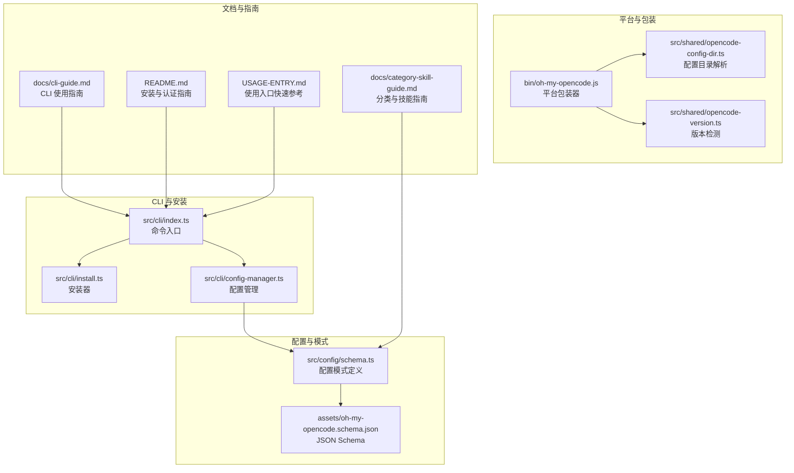
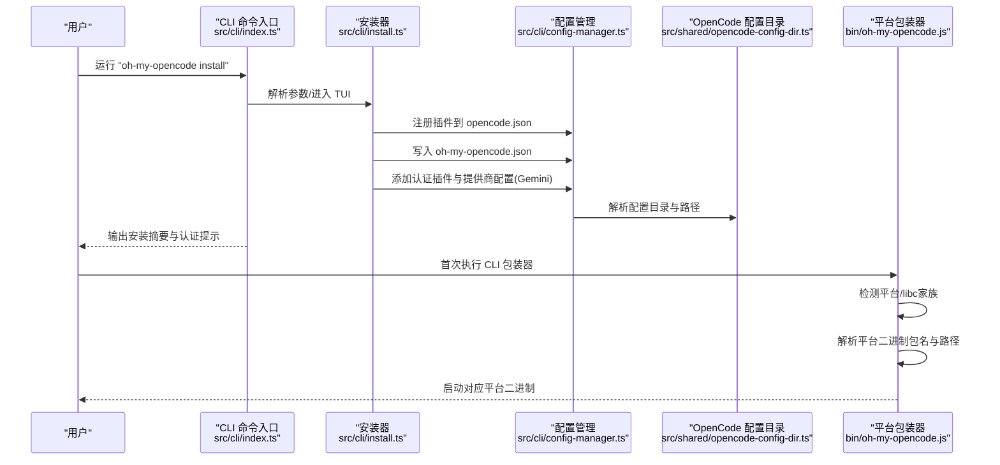
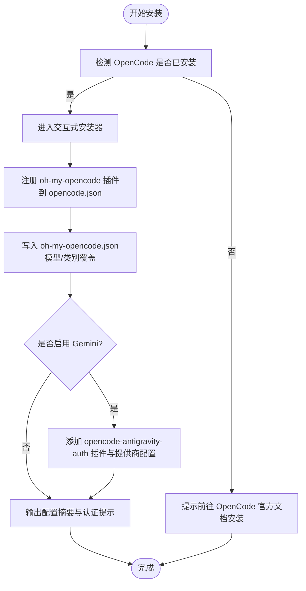
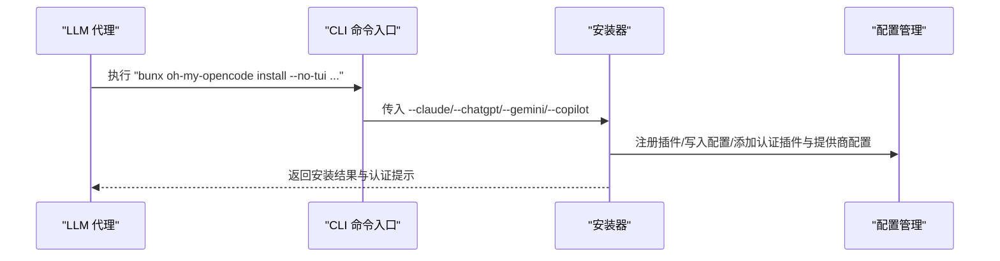
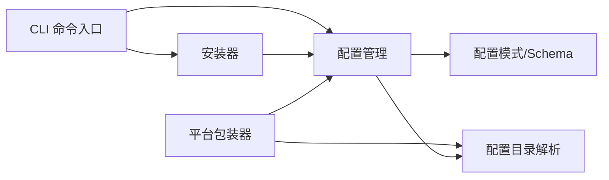

# 快速开始

<cite>
**本文引用的文件**
- [README.md](file://README.md)
- [USAGE-ENTRY.md](file://USAGE-ENTRY.md)
- [package.json](file://package.json)
- [bin/oh-my-opencode.js](file://bin/oh-my-opencode.js)
- [src/cli/index.ts](file://src/cli/index.ts)
- [src/cli/install.ts](file://src/cli/install.ts)
- [src/cli/config-manager.ts](file://src/cli/config-manager.ts)
- [src/shared/opencode-config-dir.ts](file://src/shared/opencode-config-dir.ts)
- [src/shared/opencode-version.ts](file://src/shared/opencode-version.ts)
- [src/config/schema.ts](file://src/config/schema.ts)
- [assets/oh-my-opencode.schema.json](file://assets/oh-my-opencode.schema.json)
- [docs/cli-guide.md](file://docs/cli-guide.md)
- [docs/category-skill-guide.md](file://docs/category-skill-guide.md)
</cite>

## 目录
1. [简介](#简介)
2. [项目结构](#项目结构)
3. [核心组件](#核心组件)
4. [架构总览](#架构总览)
5. [详细组件分析](#详细组件分析)
6. [依赖关系分析](#依赖关系分析)
7. [性能考虑](#性能考虑)
8. [故障排查指南](#故障排查指南)
9. [结论](#结论)
10. [附录](#附录)

## 简介
Oh My OpenCode 是一个“电池已满”的 AI 代理工具包，专为 OpenCode 打造，提供多模型编排、并行后台代理、以及精心设计的 LSP/AST 工具链。它能让你像拥有一个高效团队一样，让 AI 代理协同完成复杂开发任务，并在终端中保持高性能与高可用。

- 核心价值主张
  - 多模型编排：按需混合 Claude、ChatGPT、Gemini 等模型，按任务目的进行编排。
  - 并行代理：后台并行搜索、分析、实现，主代理专注统筹。
  - 专业工具：LSP、AST-Grep、MCP、交互式终端等，提升开发效率。
  - 一键安装与兼容：内置安装器、兼容 Claude Code 设置，开箱即用。

- 目标用户
  - 希望提升开发效率的工程师与技术负责人
  - 需要稳定、可扩展的 AI 代理体系的团队
  - 希望在终端中获得“类团队协作”体验的开发者

- 基本使用场景
  - 自然语言描述需求 → 自动触发规划与实现
  - 关键词触发 → 自动匹配技能（如“测试”“调试”“审查”）
  - 显式调用技能 → 精准控制任务类型与范围
  - “ultrawork/ulw”模式 → 最大性能模式，持续执行直到完成

**章节来源**
- [README.md](file://README.md#L168-L256)

## 项目结构
本仓库采用模块化组织，CLI、配置管理、安装器、共享工具与特性模块清晰分离；同时提供跨平台二进制包装器与平台检测逻辑。

**图表来源**
- [src/cli/index.ts](file://src/cli/index.ts#L1-L147)
- [src/cli/install.ts](file://src/cli/install.ts#L1-L463)
- [src/cli/config-manager.ts](file://src/cli/config-manager.ts#L1-L731)
- [bin/oh-my-opencode.js](file://bin/oh-my-opencode.js#L1-L81)
- [src/shared/opencode-config-dir.ts](file://src/shared/opencode-config-dir.ts#L1-L143)
- [src/shared/opencode-version.ts](file://src/shared/opencode-version.ts#L1-L73)
- [src/config/schema.ts](file://src/config/schema.ts#L1-L384)
- [assets/oh-my-opencode.schema.json](file://assets/oh-my-opencode.schema.json#L1-L200)
- [docs/cli-guide.md](file://docs/cli-guide.md#L1-L273)
- [docs/category-skill-guide.md](file://docs/category-skill-guide.md#L1-L201)
- [README.md](file://README.md#L257-L496)
- [USAGE-ENTRY.md](file://USAGE-ENTRY.md#L1-L201)

**章节来源**
- [package.json](file://package.json#L1-L93)
- [bin/oh-my-opencode.js](file://bin/oh-my-opencode.js#L1-L81)
- [src/cli/index.ts](file://src/cli/index.ts#L1-L147)

## 核心组件
- CLI 命令入口
  - 提供 install、run、doctor、version 等命令，统一入口与帮助信息。
- 安装器
  - 支持交互式 TUI 与非交互式参数模式，自动注册插件、写入 oh-my-opencode 配置、处理认证插件与提供商配置。
- 配置管理
  - 解析与合并多来源配置（用户级、项目级），生成 oh-my-opencode.json 并与 OpenCode 配置联动。
- 平台包装器
  - 根据运行平台选择对应二进制，确保无需运行时即可执行。
- 版本与配置目录
  - 统一解析 OpenCode 配置目录、版本检测与兼容性判断。
- 配置模式与 Schema
  - 定义 oh-my-opencode.json 的字段、枚举值与校验规则，保障配置一致性。

**章节来源**
- [src/cli/index.ts](file://src/cli/index.ts#L1-L147)
- [src/cli/install.ts](file://src/cli/install.ts#L1-L463)
- [src/cli/config-manager.ts](file://src/cli/config-manager.ts#L1-L731)
- [bin/oh-my-opencode.js](file://bin/oh-my-opencode.js#L1-L81)
- [src/shared/opencode-config-dir.ts](file://src/shared/opencode-config-dir.ts#L1-L143)
- [src/shared/opencode-version.ts](file://src/shared/opencode-version.ts#L1-L73)
- [src/config/schema.ts](file://src/config/schema.ts#L1-L384)
- [assets/oh-my-opencode.schema.json](file://assets/oh-my-opencode.schema.json#L1-L200)

## 架构总览
下图展示了从用户执行命令到安装与认证配置的关键流程。

**图表来源**
- [src/cli/index.ts](file://src/cli/index.ts#L22-L53)
- [src/cli/install.ts](file://src/cli/install.ts#L352-L462)
- [src/cli/config-manager.ts](file://src/cli/config-manager.ts#L222-L280)
- [src/shared/opencode-config-dir.ts](file://src/shared/opencode-config-dir.ts#L78-L111)
- [bin/oh-my-opencode.js](file://bin/oh-my-opencode.js#L29-L78)

## 详细组件分析

### 安装与配置流程（人类用户）
- 步骤概览
  - 运行交互式安装器，选择订阅情况（Claude/ChatGPT/Gemini/Copilot）
  - 自动注册插件、写入 oh-my-opencode.json
  - 如启用 Gemini，则添加认证插件与提供商配置
  - 输出配置摘要与认证指引
- 平台支持
  - 支持 macOS（ARM64/x64）、Linux（x64/ARM64，含 musl）、Windows（x64）
  - CLI 作为独立可执行，安装后无需运行时环境

**图表来源**
- [src/cli/install.ts](file://src/cli/install.ts#L239-L350)
- [src/cli/config-manager.ts](file://src/cli/config-manager.ts#L222-L280)
- [README.md](file://README.md#L260-L275)

**章节来源**
- [README.md](file://README.md#L257-L350)
- [src/cli/install.ts](file://src/cli/install.ts#L1-L463)
- [src/cli/config-manager.ts](file://src/cli/config-manager.ts#L1-L731)

### 安装与配置流程（LLM 代理）
- 步骤概览
  - 通过非交互式参数运行安装器（--no-tui）
  - 基于用户提供的订阅选项（--claude/--chatgpt/--gemini/--copilot）执行安装
  - 输出版本检查与配置摘要
- 认证配置
  - 安装完成后，按提示运行 opencode auth login，选择对应提供商完成 OAuth

**图表来源**
- [README.md](file://README.md#L283-L350)
- [src/cli/index.ts](file://src/cli/index.ts#L22-L53)
- [src/cli/install.ts](file://src/cli/install.ts#L239-L350)
- [src/cli/config-manager.ts](file://src/cli/config-manager.ts#L468-L506)

**章节来源**
- [README.md](file://README.md#L283-L350)
- [src/cli/index.ts](file://src/cli/index.ts#L1-L147)

### 认证配置（Anthropic Claude）
- 操作步骤
  - 运行 opencode auth login
  - 在交互界面选择提供商：Anthropic
  - 选择登录方式：Claude Pro/Max
  - 在浏览器中完成 OAuth 流程
  - 验证成功后确认
- 注意事项
  - 若使用 Max20 模式，系统会自动调整 Librarian 的模型
  - 若未安装 OpenCode，请先安装后再进行认证

**章节来源**
- [README.md](file://README.md#L354-L363)

### 认证配置（Google Gemini / Antigravity OAuth）
- 操作步骤
  - 在 opencode.json 中添加 opencode-antigravity-auth 插件
  - 配置 provider 为 Google，并使用 antigravity 前缀的模型名称
  - 在 oh-my-opencode.json 中覆盖前端/UI/文档等代理的模型
  - 运行 opencode auth login，选择 Google → OAuth with Antigravity
  - 可配置多账户以实现负载均衡
- 模型名称
  - 推荐使用带 antigravity- 前缀的模型名，确保配额路由稳定
  - 可用模型包括：gemini-3-pro-high/low、gemini-3-flash 等

**章节来源**
- [README.md](file://README.md#L365-L411)
- [src/cli/config-manager.ts](file://src/cli/config-manager.ts#L580-L606)

### 认证配置（GitHub Copilot）
- 说明
  - Copilot 作为回退提供商，优先级低于原生提供商
  - 当原生提供商不可用或额度不足时，系统自动切换
- 模型映射
  - Sisyphus → github-copilot/claude-opus-4.5
  - Oracle → github-copilot/gpt-5.2
  - Explore/Librarian 默认使用社区可用模型
- 操作步骤
  - 安装时选择“是”
  - 运行 opencode auth login，选择 GitHub → OAuth

**章节来源**
- [README.md](file://README.md#L412-L453)
- [src/cli/config-manager.ts](file://src/cli/config-manager.ts#L309-L382)

### 验证安装结果
- 基本验证
  - 检查 OpenCode 版本是否满足最低要求（≥ 1.1.1）
  - 确认 opencode.json 中已注册 oh-my-opencode 插件
  - 确认 oh-my-opencode.json 已生成并包含所需配置
- 使用 doctor 命令
  - 运行 oh-my-opencode doctor，检查安装、配置、认证、依赖、工具与更新状态
  - 可按类别筛选检查项（如 authentication）

**章节来源**
- [README.md](file://README.md#L461-L467)
- [docs/cli-guide.md](file://docs/cli-guide.md#L57-L115)
- [src/shared/opencode-version.ts](file://src/shared/opencode-version.ts#L1-L73)

### 常见问题与解决方案
- OpenCode 版本过低
  - 升级 OpenCode 到最新版本
- 插件未注册
  - 重新运行安装器，或手动在 opencode.json 中添加插件条目
- doctor 检查失败
  - 使用 --verbose 获取详细信息，针对具体类别进行修复
- 平台二进制缺失
  - 确认平台包装器已正确解析对应平台包；必要时手动安装对应平台包

**章节来源**
- [docs/cli-guide.md](file://docs/cli-guide.md#L186-L214)
- [bin/oh-my-opencode.js](file://bin/oh-my-opencode.js#L35-L55)

## 依赖关系分析
- CLI 与安装器
  - CLI 命令入口依赖安装器与配置管理模块
  - 安装器依赖配置管理模块写入配置与注册插件
- 平台包装器
  - 根据运行平台与 libc 家族选择对应二进制包
- 配置解析
  - 统一解析 OpenCode 配置目录，兼容 CLI 与桌面版
- 配置模式
  - JSON Schema 与 TypeScript 模式共同约束配置字段与取值

**图表来源**
- [src/cli/index.ts](file://src/cli/index.ts#L1-L147)
- [src/cli/install.ts](file://src/cli/install.ts#L1-L463)
- [src/cli/config-manager.ts](file://src/cli/config-manager.ts#L1-L731)
- [src/shared/opencode-config-dir.ts](file://src/shared/opencode-config-dir.ts#L1-L143)
- [src/config/schema.ts](file://src/config/schema.ts#L1-L384)
- [assets/oh-my-opencode.schema.json](file://assets/oh-my-opencode.schema.json#L1-L200)
- [bin/oh-my-opencode.js](file://bin/oh-my-opencode.js#L1-L81)

**章节来源**
- [src/cli/index.ts](file://src/cli/index.ts#L1-L147)
- [src/cli/install.ts](file://src/cli/install.ts#L1-L463)
- [src/cli/config-manager.ts](file://src/cli/config-manager.ts#L1-L731)
- [src/shared/opencode-config-dir.ts](file://src/shared/opencode-config-dir.ts#L1-L143)
- [src/config/schema.ts](file://src/config/schema.ts#L1-L384)
- [assets/oh-my-opencode.schema.json](file://assets/oh-my-opencode.schema.json#L1-L200)
- [bin/oh-my-opencode.js](file://bin/oh-my-opencode.js#L1-L81)

## 性能考虑
- 并行执行与后台任务
  - 通过并行代理与后台任务减少上下文负担，提升整体吞吐
- 上下文窗口管理
  - 动态截断与压缩机制，避免超限导致的失败
- 模型选择与优先级
  - 原生提供商优先，Copilot 作为回退，合理分配资源
- 平台二进制
  - 预编译二进制减少启动延迟，提升响应速度

[本节为通用指导，不直接分析具体文件]

## 故障排查指南
- doctor 命令
  - 检查安装、配置、认证、依赖、工具与更新状态
  - 支持按类别筛选与 JSON 输出，便于自动化集成
- 版本与兼容性
  - 确保 OpenCode 版本满足最低要求（≥ 1.1.1）
  - 使用版本缓存与比较函数避免误判
- 配置目录与权限
  - 确认配置目录存在且具备读写权限
  - 处理权限错误、文件不存在、磁盘空间不足等异常

**章节来源**
- [docs/cli-guide.md](file://docs/cli-guide.md#L57-L115)
- [src/shared/opencode-version.ts](file://src/shared/opencode-version.ts#L1-L73)
- [src/cli/config-manager.ts](file://src/cli/config-manager.ts#L64-L98)

## 结论
通过本快速开始指南，你可以：
- 以人类或 LLM 代理两种方式完成安装与认证
- 了解系统要求、平台支持与配置优先级
- 使用 doctor 命令验证安装结果
- 在遇到问题时快速定位与解决

随后，结合使用入口与分类/技能指南，你将能够高效地利用 Oh My OpenCode 的多模型编排与并行代理能力，显著提升开发效率与质量。

[本节为总结性内容，不直接分析具体文件]

## 附录

### 系统要求与平台支持
- 支持平台
  - macOS（ARM64、x64）、Linux（x64、ARM64、Alpine/musl）、Windows（x64）
- 运行时
  - CLI 作为独立可执行，安装后无需运行时环境

**章节来源**
- [README.md](file://README.md#L270-L275)
- [bin/oh-my-opencode.js](file://bin/oh-my-opencode.js#L1-L81)

### 使用入口与工作流
- 自然语言触发
  - 描述需求 → 自动触发规划与实现
- 关键词触发
  - 搜索/测试/调试/审查/提交等关键词 → 自动匹配技能
- 显式调用技能
  - 使用斜杠命令直接触发特定技能
- Ultrawork 模式
  - 在提示词中包含 ultrawork/ulw → 最大性能模式，持续执行直至完成

**章节来源**
- [USAGE-ENTRY.md](file://USAGE-ENTRY.md#L1-L201)
- [README.md](file://README.md#L141-L152)

### 配置优先级与 Schema
- 配置优先级
  - 项目级 > 用户级 > 项目级（.opencode） > 代码默认
- Schema
  - JSON Schema 与 TypeScript 模式共同约束字段与取值，确保配置一致性

**章节来源**
- [CONFIGURATION-GUIDE.md](file://CONFIGURATION-GUIDE.md#L150-L158)
- [assets/oh-my-opencode.schema.json](file://assets/oh-my-opencode.schema.json#L1-L200)
- [src/config/schema.ts](file://src/config/schema.ts#L1-L384)