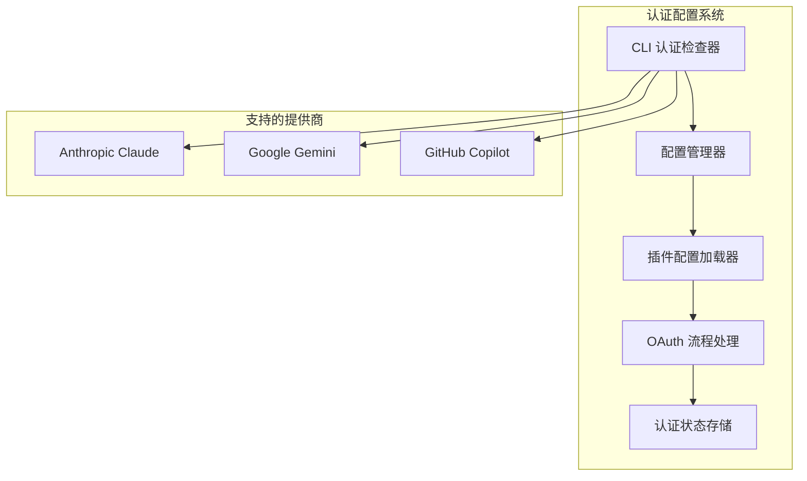
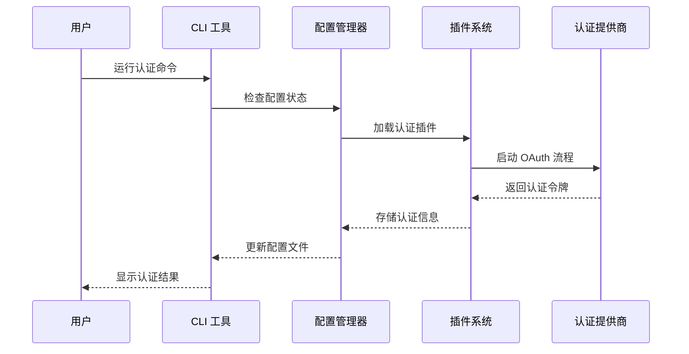
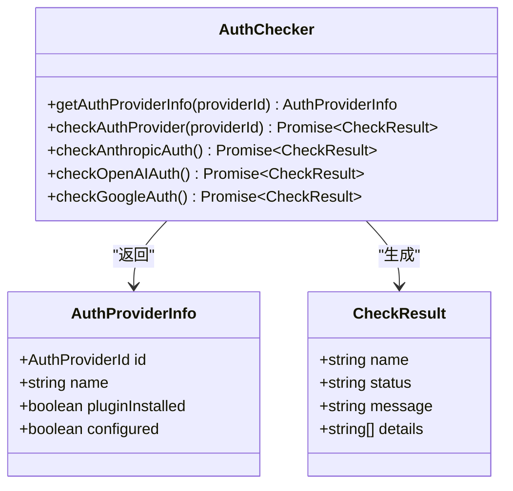
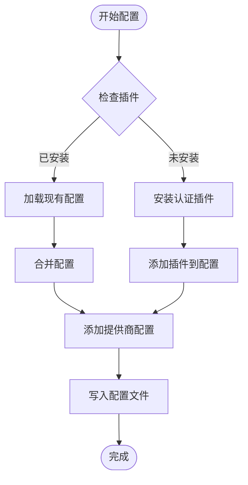
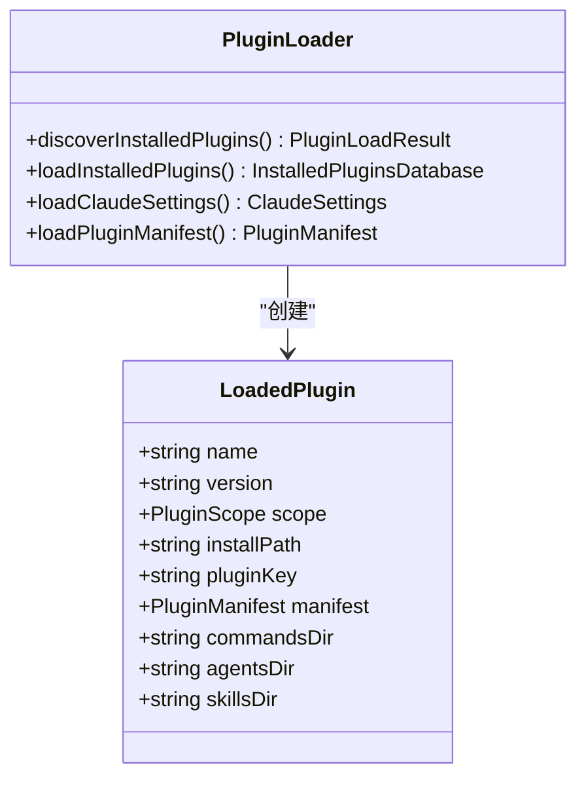
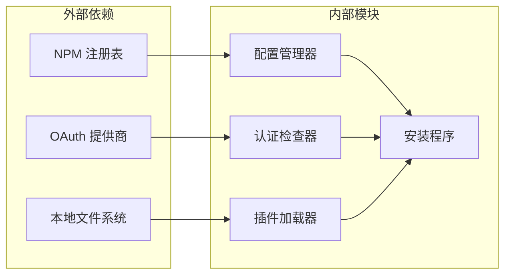
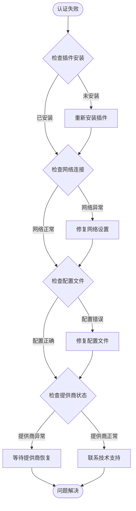

# 认证配置

<cite>
**本文档引用的文件**
- [src/cli/doctor/checks/auth.ts](file://src/cli/doctor/checks/auth.ts)
- [src/cli/config-manager.ts](file://src/cli/config-manager.ts)
- [src/plugin-config.ts](file://src/plugin-config.ts)
- [src/cli/install.ts](file://src/cli/install.ts)
- [src/features/claude-code-plugin-loader/loader.ts](file://src/features/claude-code-plugin-loader/loader.ts)
</cite>

## 目录
1. [简介](#简介)
2. [项目结构](#项目结构)
3. [核心组件](#核心组件)
4. [架构概览](#架构概览)
5. [详细组件分析](#详细组件分析)
6. [依赖关系分析](#依赖关系分析)
7. [性能考虑](#性能考虑)
8. [故障排除指南](#故障排除指南)
9. [结论](#结论)

## 简介

Oh My OpenCode 项目提供了完整的多提供商认证系统，支持 Anthropic Claude、Google Gemini 和 GitHub Copilot 三种主要的 AI 模型提供商。本指南将详细介绍如何配置这些认证提供商，包括从添加插件到完成 OAuth 流程的完整过程。

## 项目结构

认证配置系统由多个关键组件组成，分布在不同的模块中：

**图表来源**
- [src/cli/doctor/checks/auth.ts](file://src/cli/doctor/checks/auth.ts#L12-L16)
- [src/cli/config-manager.ts](file://src/cli/config-manager.ts#L468-L506)

## 核心组件

### 认证提供商映射

系统支持三个主要的认证提供商，每个都有特定的插件标识符：

| 提供商 | 插件名称 | 描述 |
|--------|----------|------|
| Anthropic | builtin | 内置 Claude 认证支持 |
| OpenAI | opencode-openai-codex-auth | OpenAI ChatGPT 认证 |
| Google | opencode-antigravity-auth | Google Gemini OAuth 认证 |

### 配置格式支持

系统支持两种配置格式：
- **JSONC**: 带注释的 JSON 格式，推荐使用
- **JSON**: 标准 JSON 格式

配置文件位置：`~/.config/opencode/` 目录下的 `opencode.json` 或 `opencode.jsonc`

**章节来源**
- [src/cli/doctor/checks/auth.ts](file://src/cli/doctor/checks/auth.ts#L12-L16)
- [src/plugin-config.ts](file://src/plugin-config.ts#L93-L135)

## 架构概览

认证系统的整体架构采用分层设计，确保了良好的可扩展性和维护性：

**图表来源**
- [src/cli/doctor/checks/auth.ts](file://src/cli/doctor/checks/auth.ts#L50-L77)
- [src/cli/config-manager.ts](file://src/cli/config-manager.ts#L468-L506)

## 详细组件分析

### 认证检查器

认证检查器负责验证各个提供商的安装状态和配置完整性：

**图表来源**
- [src/cli/doctor/checks/auth.ts](file://src/cli/doctor/checks/auth.ts#L35-L48)
- [src/cli/doctor/checks/auth.ts](file://src/cli/doctor/checks/auth.ts#L50-L77)

### 配置管理器

配置管理器负责处理认证相关的配置操作：

**图表来源**
- [src/cli/config-manager.ts](file://src/cli/config-manager.ts#L468-L506)
- [src/cli/config-manager.ts](file://src/cli/config-manager.ts#L610-L647)

**章节来源**
- [src/cli/doctor/checks/auth.ts](file://src/cli/doctor/checks/auth.ts#L35-L77)
- [src/cli/config-manager.ts](file://src/cli/config-manager.ts#L468-L647)

### 插件加载器

插件加载器负责管理和加载认证相关的插件：

**图表来源**
- [src/features/claude-code-plugin-loader/loader.ts](file://src/features/claude-code-plugin-loader/loader.ts#L147-L200)

**章节来源**
- [src/features/claude-code-plugin-loader/loader.ts](file://src/features/claude-code-plugin-loader/loader.ts#L147-L200)

## 依赖关系分析

认证系统的关键依赖关系如下：

**图表来源**
- [src/cli/config-manager.ts](file://src/cli/config-manager.ts#L100-L131)
- [src/cli/install.ts](file://src/cli/install.ts#L444-L459)

**章节来源**
- [src/cli/config-manager.ts](file://src/cli/config-manager.ts#L100-L131)
- [src/cli/install.ts](file://src/cli/install.ts#L444-L459)

## 性能考虑

认证系统的性能优化主要体现在以下几个方面：

1. **异步操作**: 所有网络请求和文件操作都采用异步模式
2. **缓存机制**: 插件数据库和配置信息进行缓存
3. **超时控制**: 网络请求设置合理的超时时间
4. **错误恢复**: 自动重试和降级策略

## 故障排除指南

### 常见认证问题及解决方案

| 问题类型 | 症状 | 解决方案 |
|----------|------|----------|
| 插件未安装 | 认证检查显示 "Auth plugin not installed" | 运行 `bunx oh-my-opencode install` |
| 权限错误 | 文件权限不足导致配置失败 | 检查 ~/.config/opencode 目录权限 |
| 网络超时 | OAuth 回调地址无法访问 | 检查防火墙设置和代理配置 |
| 配置格式错误 | JSON 解析失败 | 使用 JSONC 格式并检查语法 |

### 认证失败诊断流程

**章节来源**
- [src/cli/doctor/checks/auth.ts](file://src/cli/doctor/checks/auth.ts#L55-L76)
- [src/cli/config-manager.ts](file://src/cli/config-manager.ts#L74-L98)

## 结论

Oh My OpenCode 的认证配置系统提供了灵活且强大的多提供商支持。通过理解各个组件的作用和相互关系，用户可以轻松地配置和管理不同类型的认证提供商。建议在配置过程中遵循以下最佳实践：

1. 始终使用 JSONC 格式进行配置
2. 定期检查认证插件的更新
3. 建立适当的备份策略
4. 在生产环境中使用 HTTPS 和安全的存储方式

通过本指南提供的详细步骤和故障排除方法，用户应该能够成功配置并维护 Oh My OpenCode 的认证系统。