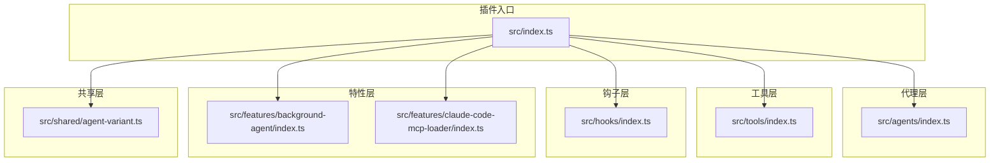
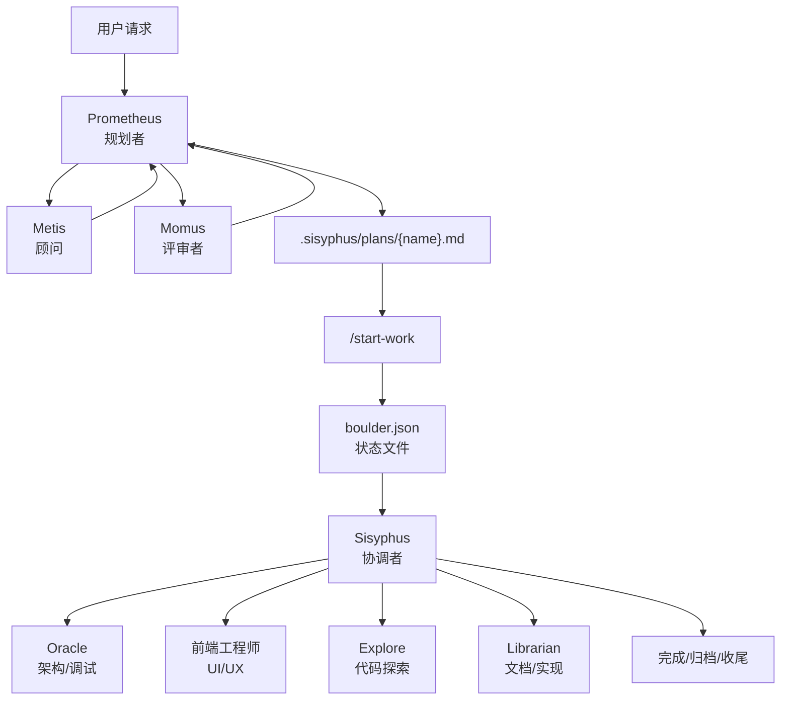
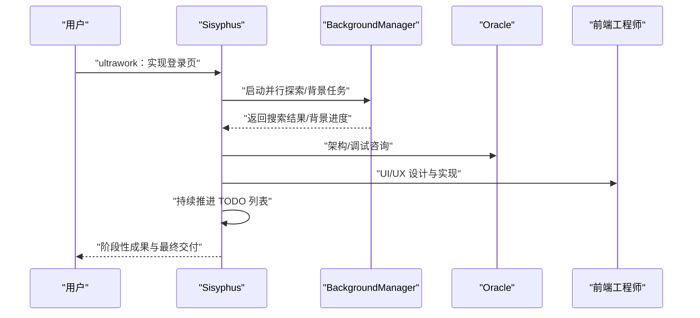
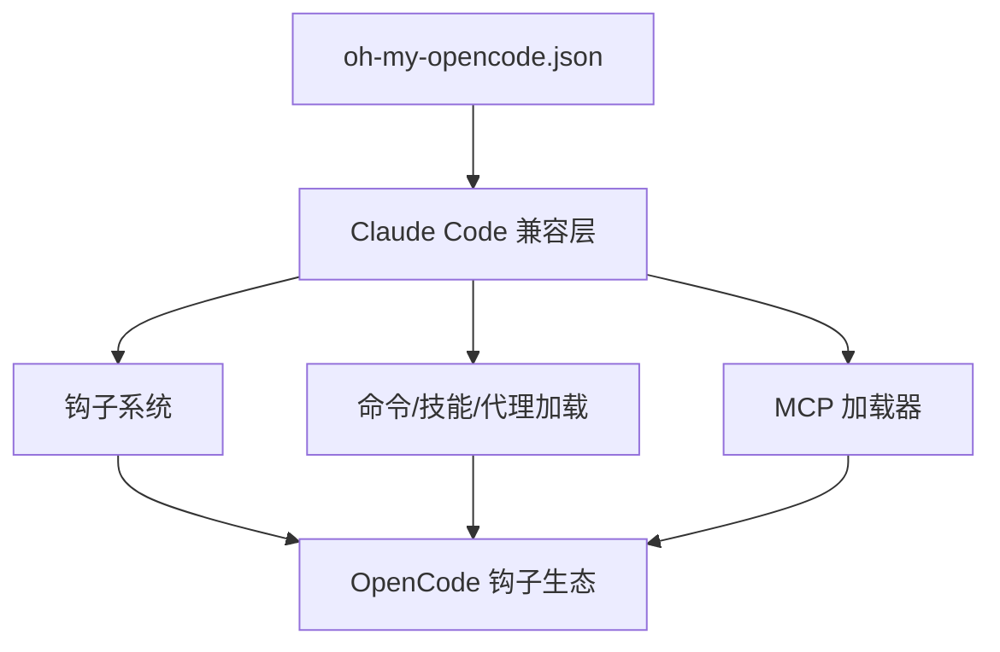
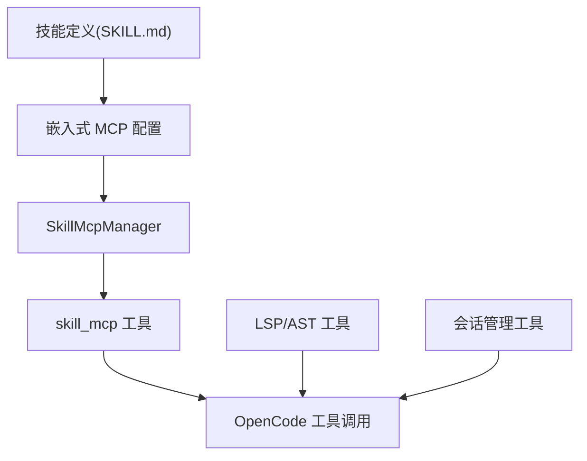
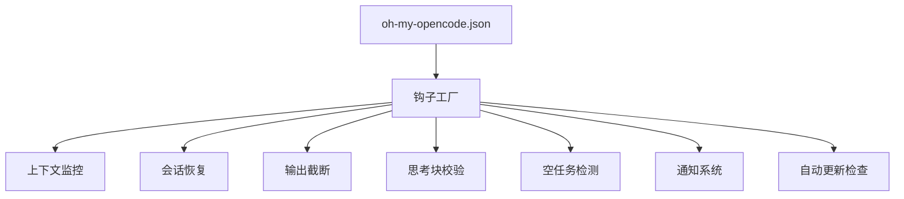
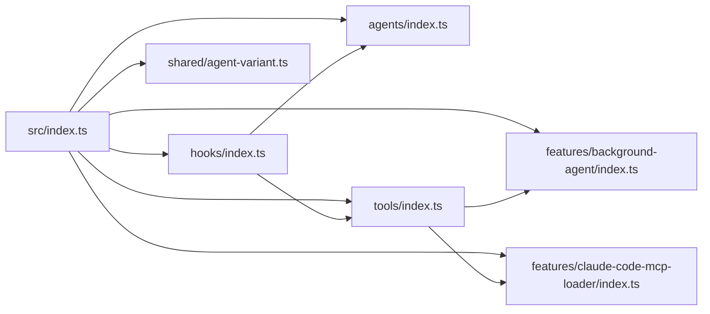

# 项目介绍与价值主张

<cite>
**本文引用的文件**
- [README.md](file://README.md)
- [USAGE-ENTRY.md](file://USAGE-ENTRY.md)
- [CONFIGURATION-GUIDE.md](file://CONFIGURATION-GUIDE.md)
- [CONTRIBUTING.md](file://CONTRIBUTING.md)
- [src/index.ts](file://src/index.ts)
- [src/agents/index.ts](file://src/agents/index.ts)
- [src/tools/index.ts](file://src/tools/index.ts)
- [src/hooks/index.ts](file://src/hooks/index.ts)
- [src/features/background-agent/index.ts](file://src/features/background-agent/index.ts)
- [src/features/claude-code-mcp-loader/index.ts](file://src/features/claude-code-mcp-loader/index.ts)
- [src/shared/agent-variant.ts](file://src/shared/agent-variant.ts)
- [docs/orchestration-guide.md](file://docs/orchestration-guide.md)
- [AGENTS.md](file://AGENTS.md)
</cite>

## 目录
1. [引言](#引言)
2. [项目结构](#项目结构)
3. [核心组件](#核心组件)
4. [架构总览](#架构总览)
5. [详细组件分析](#详细组件分析)
6. [依赖关系分析](#依赖关系分析)
7. [性能考量](#性能考量)
8. [故障排查指南](#故障排查指南)
9. [结论](#结论)
10. [附录](#附录)

## 引言
Oh My OpenCode 是面向开发者的一体化智能开发助手插件，旨在通过“多模型编排 + 并行代理执行 + Claude Code 兼容层”显著提升开发效率与质量。项目以“分离规划与执行”的理念为核心，提供从需求澄清、策略制定到持续执行与收尾的全链路自动化工作流；同时内置 LSP/AST 工具集、技能嵌入式 MCP 支持、背景代理与钩子生态，帮助团队像拥有“专业代理团队”一样高效协作。

- 核心价值主张
  - 让每个开发者都能获得“专业代理团队”的支持：Sisyphus 主协调者 + Oracle/Librarian/Explore/Frontend/UI 等专项代理并行协作。
  - 通过多模型编排与并行执行，将复杂任务拆解、委派、回环验证，直至完成。
  - 提供 Claude Code 兼容层，无缝迁移现有配置与工作流，降低学习成本。
  - 以工具集与钩子生态保障上下文管理、会话恢复、输出截断、思考块校验等工程化能力，确保稳定与高性能。

- 目标用户群体
  - 希望提升个人与团队开发效率的工程师与技术负责人。
  - 需要跨语言、跨框架、跨模型协同的全栈/移动端/前端/后端开发者。
  - 追求“可解释、可审计、可恢复”的工程化 AI 辅助流程的团队。

- 基本使用场景
  - 快速修复与小改动：直接自然语言描述即可。
  - 复杂功能开发：输入“ultrawork”或“ulw”，系统自动并行探索、背景任务与持续执行。
  - 规划驱动的大型任务：使用 @plan → /start-work，由 Prometheus 制定计划，Sisyphus 执行并持续推进。
  - 技术评审与验证：在完成前进行代码审查与验证，确保交付质量。

**章节来源**
- [README.md](file://README.md#L168-L256)
- [USAGE-ENTRY.md](file://USAGE-ENTRY.md#L1-L201)
- [docs/orchestration-guide.md](file://docs/orchestration-guide.md#L1-L153)

## 项目结构
项目采用模块化分层组织，围绕 OpenCode 插件体系构建，核心目录职责如下：
- src/index.ts：插件入口，注册工具、钩子、技能与状态管理。
- src/agents/：内置代理集合与变体机制，支持按角色与类别动态选择。
- src/tools/：LSP/AST-Grep/Grep/Glob/Session 等工具集，提供代码导航、搜索与会话管理。
- src/hooks/：31+ 生命周期钩子，覆盖上下文注入、会话恢复、输出截断、通知等。
- src/features/：背景代理、Claude Code 兼容层、技能 MCP 管理、会话状态等。
- src/shared/：跨模块通用工具与配置解析。
- docs/：架构与编排指南、对比与更新计划等文档。

**图表来源**
- [src/index.ts](file://src/index.ts#L86-L606)
- [src/agents/index.ts](file://src/agents/index.ts#L1-L37)
- [src/tools/index.ts](file://src/tools/index.ts#L1-L73)
- [src/hooks/index.ts](file://src/hooks/index.ts#L1-L48)
- [src/features/background-agent/index.ts](file://src/features/background-agent/index.ts#L1-L4)
- [src/features/claude-code-mcp-loader/index.ts](file://src/features/claude-code-mcp-loader/index.ts#L1-L12)
- [src/shared/agent-variant.ts](file://src/shared/agent-variant.ts#L1-L41)

**章节来源**
- [AGENTS.md](file://AGENTS.md#L13-L48)
- [CONTRIBUTING.md](file://CONTRIBUTING.md#L107-L124)

## 核心组件
- 多模型编排与并行代理执行
  - Sisyphus 主协调者负责规划委派与持续执行；Oracle/Librarian/Explore/Frontend/UI 等专项代理并行处理不同维度的任务。
  - 通过类别化（categories）与子任务委派（delegate_task），实现“后台并行 + 主线专注”的高效协作。
- Claude Code 兼容层
  - settings.json 钩子、命令、技能、代理、MCP 的加载与执行，确保现有配置平滑迁移。
- LSP/AST 工具集
  - 提供诊断、重命名、符号检索、AST 搜索/替换等能力，结合 look_at 视觉提取，减少上下文膨胀。
- 技能嵌入式 MCP 支持
  - 技能可内嵌 MCP 服务器，通过 skill_mcp 工具自动发现与调用，扩展浏览器自动化、代码搜索等能力。
- 钩子生态与工程化保障
  - 上下文窗口监控、会话恢复、输出截断、思考块校验、空任务响应检测、交互式 Bash、自动更新检查等，确保稳定性与性能。

**章节来源**
- [README.md](file://README.md#L531-L799)
- [src/index.ts](file://src/index.ts#L86-L606)
- [src/tools/index.ts](file://src/tools/index.ts#L57-L73)
- [src/hooks/index.ts](file://src/hooks/index.ts#L1-L48)

## 架构总览
下图展示了从用户请求到任务执行与收尾的端到端流程，体现“分离规划与执行”的核心思想：

**图表来源**
- [docs/orchestration-guide.md](file://docs/orchestration-guide.md#L39-L60)

**章节来源**
- [docs/orchestration-guide.md](file://docs/orchestration-guide.md#L24-L153)

## 详细组件分析

### 组件一：多模型编排与并行代理执行
- 设计要点
  - 通过类别化（categories）与子任务委派（delegate_task）实现“后台并行 + 主线专注”。
  - 支持“ultrawork/ulw”关键词触发最大性能模式，自动并行探索、背景任务与持续执行。
  - 代理变体（variant）机制允许按代理或类别动态覆盖消息风格与行为。
- 关键流程
  - 任务进入后，根据复杂度与上下文密度选择“直接提示”“ultrawork 模式”或“@plan → /start-work”。
  - 执行阶段通过 Todo 列表与会话恢复保障不中断推进。

**图表来源**
- [src/index.ts](file://src/index.ts#L238-L301)
- [src/features/background-agent/index.ts](file://src/features/background-agent/index.ts#L1-L4)

**章节来源**
- [README.md](file://README.md#L192-L256)
- [USAGE-ENTRY.md](file://USAGE-ENTRY.md#L141-L189)
- [src/shared/agent-variant.ts](file://src/shared/agent-variant.ts#L1-L41)

### 组件二：Claude Code 兼容层
- 功能范围
  - settings.json 钩子（PreToolUse/PostToolUse/UserPromptSubmit/Stop）。
  - 命令、技能、代理、MCP 的加载与执行。
  - 数据存储（todos、transcripts）与兼容性开关。
- 集成方式
  - 在插件入口统一注册 Claude Code 钩子，按配置决定是否启用各子系统。
  - MCP 加载器支持用户/项目/本地多级 .mcp.json，并支持环境变量展开。

**图表来源**
- [src/index.ts](file://src/index.ts#L140-L147)
- [src/features/claude-code-mcp-loader/index.ts](file://src/features/claude-code-mcp-loader/index.ts#L1-L12)

**章节来源**
- [README.md](file://README.md#L660-L764)
- [src/index.ts](file://src/index.ts#L286-L318)

### 组件三：LSP/AST 工具集与技能嵌入式 MCP
- LSP/AST 工具集
  - 诊断、重命名、符号检索、AST 搜索/替换等，配合 look_at 减少上下文膨胀。
- 技能嵌入式 MCP
  - 技能可通过 frontmatter 内嵌 MCP 配置，系统自动发现并通过 skill_mcp 工具调用。
- 会话管理
  - session_list/session_read/session_search/session_info 支持历史检索与连续性维护。

**图表来源**
- [src/tools/index.ts](file://src/tools/index.ts#L13-L73)
- [src/index.ts](file://src/index.ts#L300-L312)

**章节来源**
- [README.md](file://README.md#L567-L660)
- [src/tools/index.ts](file://src/tools/index.ts#L57-L73)

### 组件四：钩子生态与工程化保障
- 关键钩子
  - 上下文窗口监控、会话恢复、输出截断、思考块校验、空任务响应检测、交互式 Bash、自动更新检查、任务恢复信息等。
- 通知与并发
  - 背景通知与会话通知避免错过关键节点；并发管理保障资源合理分配。
- 配置优先级
  - 项目级 > 用户全局级 > 项目级 .opencode > 默认值，便于灵活定制。

**图表来源**
- [src/hooks/index.ts](file://src/hooks/index.ts#L1-L48)
- [src/index.ts](file://src/index.ts#L97-L234)

**章节来源**
- [CONFIGURATION-GUIDE.md](file://CONFIGURATION-GUIDE.md#L150-L158)
- [src/index.ts](file://src/index.ts#L97-L234)

## 依赖关系分析
- 插件入口对各子系统的依赖清晰：代理、工具、钩子、特性模块通过统一入口注册与初始化。
- 背景代理与技能 MCP 管理器作为横切关注点，被工具与钩子共同依赖。
- 代理变体机制通过配置驱动消息风格与行为，降低耦合。

**图表来源**
- [src/index.ts](file://src/index.ts#L86-L606)
- [src/agents/index.ts](file://src/agents/index.ts#L1-L37)
- [src/tools/index.ts](file://src/tools/index.ts#L1-L73)
- [src/hooks/index.ts](file://src/hooks/index.ts#L1-L48)
- [src/features/background-agent/index.ts](file://src/features/background-agent/index.ts#L1-L4)
- [src/features/claude-code-mcp-loader/index.ts](file://src/features/claude-code-mcp-loader/index.ts#L1-L12)
- [src/shared/agent-variant.ts](file://src/shared/agent-variant.ts#L1-L41)

**章节来源**
- [AGENTS.md](file://AGENTS.md#L13-L48)
- [src/index.ts](file://src/index.ts#L86-L606)

## 性能考量
- 并行与上下文管理
  - 通过并行代理与后台任务减轻主线上下文压力；工具输出截断与上下文窗口监控防止超限。
- 会话恢复与稳定性
  - 会话错误恢复、Todo 连续性强制、预压缩与上下文注入，确保长时间任务不中断。
- 资源与并发
  - 背景任务并发管理与通知批量化，避免资源争用与干扰。

[本节为通用指导，无需列出具体文件来源]

## 故障排查指南
- 常见问题定位
  - 会话异常：检查会话恢复钩子与错误类型，确认可恢复性。
  - 输出过大：启用工具输出截断与上下文窗口监控，必要时调整温度与提示。
  - 代理未按预期：核对代理变体配置与类别覆盖，确认消息风格与行为。
- 快速恢复步骤
  - 使用会话恢复钩子自动恢复；若失败，清理临时状态并重新发起任务。
  - 检查 Claude Code 兼容层开关与 MCP 配置，确保钩子与命令加载正常。

**章节来源**
- [src/index.ts](file://src/index.ts#L487-L511)
- [src/hooks/index.ts](file://src/hooks/index.ts#L1-L48)

## 结论
Oh My OpenCode 将“多模型编排 + 并行代理执行 + Claude Code 兼容层”有机融合，形成从规划、执行到收尾的全链路自动化开发体验。借助 LSP/AST 工具集、技能嵌入式 MCP、钩子生态与工程化保障，项目既适合初学者快速上手，也为资深开发者提供了深度定制与扩展的空间。通过“分离规划与执行”的理念与“ultrawork/ulw”等一键加速模式，开发者可以专注于创意与决策，而将重复与繁琐交给智能代理团队。

[本节为总结性内容，无需列出具体文件来源]

## 附录
- 快速开始清单
  - 只要说“我想 [做什么]”
  - 等待代理自动触发相应技能
  - 回答问题（每次一个）
  - 确认后继续下一步
  - 复杂任务时加上 “ultrawork”

**章节来源**
- [USAGE-ENTRY.md](file://USAGE-ENTRY.md#L192-L201)