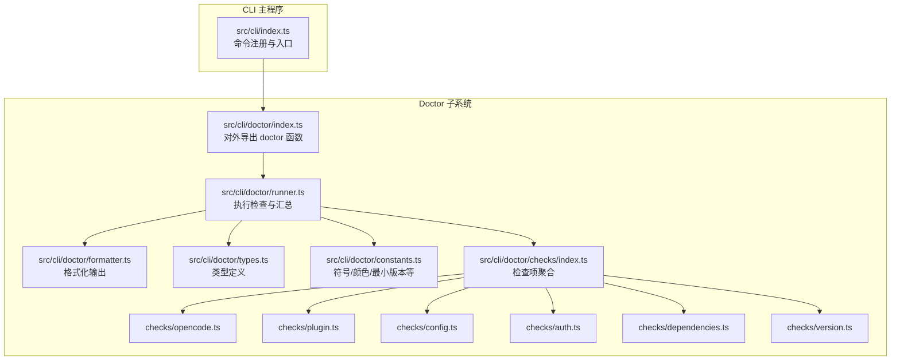
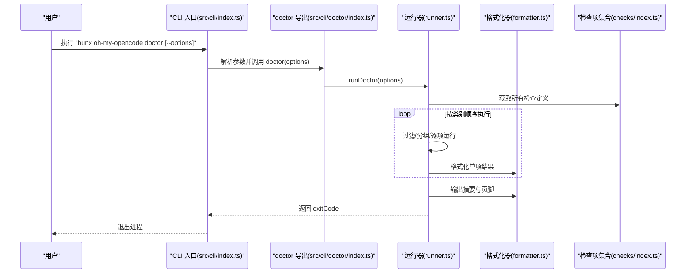
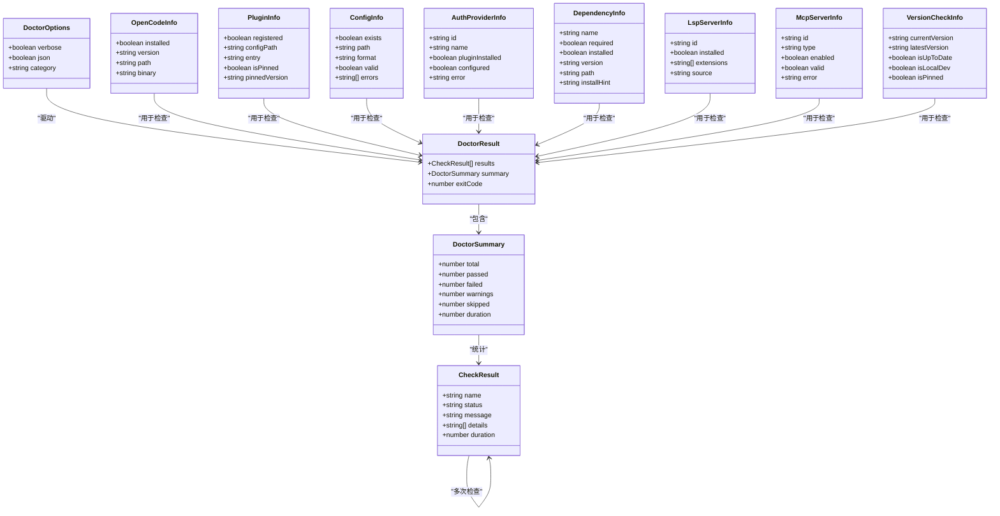

# 验证与故障排除

<cite>
**本文引用的文件**
- [README.md](file://README.md)
- [USAGE-ENTRY.md](file://USAGE-ENTRY.md)
- [CONFIGURATION-GUIDE.md](file://CONFIGURATION-GUIDE.md)
- [src/cli/doctor/index.ts](file://src/cli/doctor/index.ts)
- [src/cli/doctor/runner.ts](file://src/cli/doctor/runner.ts)
- [src/cli/doctor/formatter.ts](file://src/cli/doctor/formatter.ts)
- [src/cli/doctor/constants.ts](file://src/cli/doctor/constants.ts)
- [src/cli/doctor/types.ts](file://src/cli/doctor/types.ts)
- [src/cli/doctor/checks/index.ts](file://src/cli/doctor/checks/index.ts)
- [src/cli/doctor/checks/opencode.ts](file://src/cli/doctor/checks/opencode.ts)
- [src/cli/doctor/checks/plugin.ts](file://src/cli/doctor/checks/plugin.ts)
- [src/cli/doctor/checks/config.ts](file://src/cli/doctor/checks/config.ts)
- [src/cli/doctor/checks/auth.ts](file://src/cli/doctor/checks/auth.ts)
- [src/cli/doctor/checks/version.ts](file://src/cli/doctor/checks/version.ts)
- [src/cli/doctor/checks/dependencies.ts](file://src/cli/doctor/checks/dependencies.ts)
- [src/shared/index.ts](file://src/shared/index.ts)
- [docs/cli-guide.md](file://docs/cli-guide.md)
- [src/cli/index.ts](file://src/cli/index.ts)
</cite>

## 目录
1. [简介](#简介)
2. [项目结构](#项目结构)
3. [核心组件](#核心组件)
4. [架构总览](#架构总览)
5. [详细组件分析](#详细组件分析)
6. [依赖关系分析](#依赖关系分析)
7. [性能考虑](#性能考虑)
8. [故障排除指南](#故障排除指南)
9. [结论](#结论)
10. [附录](#附录)

## 简介
本指南面向首次安装与日常使用 Oh My OpenCode 的用户，提供从安装验证到环境诊断的完整流程，重点围绕以下目标展开：
- 如何验证安装是否成功：版本检查、插件注册、配置文件校验、功能可用性测试
- 如何使用诊断工具 oh-my-opencode doctor 进行系统健康检查
- 常见问题的识别与解决：认证失败、性能瓶颈、兼容性问题
- 日志与输出分析方法、调试技巧与最佳实践

## 项目结构
本项目采用模块化 CLI 架构，doctor 子系统位于 src/cli/doctor 下，包含运行器、格式化器、常量、类型定义以及按类别划分的检查项模块。

图表来源
- [src/cli/index.ts](file://src/cli/index.ts#L108-L137)
- [src/cli/doctor/index.ts](file://src/cli/doctor/index.ts#L1-L12)
- [src/cli/doctor/runner.ts](file://src/cli/doctor/runner.ts#L1-L133)
- [src/cli/doctor/formatter.ts](file://src/cli/doctor/formatter.ts#L1-L141)
- [src/cli/doctor/constants.ts](file://src/cli/doctor/constants.ts#L1-L73)
- [src/cli/doctor/types.ts](file://src/cli/doctor/types.ts#L1-L114)
- [src/cli/doctor/checks/index.ts](file://src/cli/doctor/checks/index.ts#L1-L35)

章节来源
- [src/cli/index.ts](file://src/cli/index.ts#L108-L137)
- [src/cli/doctor/index.ts](file://src/cli/doctor/index.ts#L1-L12)
- [src/cli/doctor/runner.ts](file://src/cli/doctor/runner.ts#L1-L133)
- [src/cli/doctor/formatter.ts](file://src/cli/doctor/formatter.ts#L1-L141)
- [src/cli/doctor/constants.ts](file://src/cli/doctor/constants.ts#L1-L73)
- [src/cli/doctor/types.ts](file://src/cli/doctor/types.ts#L1-L114)
- [src/cli/doctor/checks/index.ts](file://src/cli/doctor/checks/index.ts#L1-L35)

## 核心组件
- doctor 命令入口：解析参数（--verbose、--json、--category），调用 runDoctor 并根据结果退出码退出
- 运行器：按类别分组执行检查，统计摘要，决定退出码
- 格式化器：彩色输出、摘要、帮助建议、盒子样式输出
- 检查项：覆盖安装、配置、认证、依赖、工具、更新六大类，共 17+ 项
- 共享能力：JSONC 解析、OpenCode 配置路径探测、版本比较等

章节来源
- [src/cli/doctor/index.ts](file://src/cli/doctor/index.ts#L1-L12)
- [src/cli/doctor/runner.ts](file://src/cli/doctor/runner.ts#L1-L133)
- [src/cli/doctor/formatter.ts](file://src/cli/doctor/formatter.ts#L1-L141)
- [src/cli/doctor/checks/index.ts](file://src/cli/doctor/checks/index.ts#L1-L35)
- [src/shared/index.ts](file://src/shared/index.ts#L1-L29)

## 架构总览
下图展示 doctor 命令从入口到输出的端到端流程：

图表来源
- [src/cli/index.ts](file://src/cli/index.ts#L108-L137)
- [src/cli/doctor/index.ts](file://src/cli/doctor/index.ts#L1-L12)
- [src/cli/doctor/runner.ts](file://src/cli/doctor/runner.ts#L83-L132)
- [src/cli/doctor/formatter.ts](file://src/cli/doctor/formatter.ts#L63-L84)
- [src/cli/doctor/checks/index.ts](file://src/cli/doctor/checks/index.ts#L22-L34)

## 详细组件分析

### doctor 命令与参数
- 支持选项
  - --verbose：显示详细信息（含 details）
  - --json：以 JSON 格式输出完整结果
  - --category：仅运行指定类别（installation、configuration、authentication、dependencies、tools、updates）
- 退出码
  - 0：无失败项
  - 1：存在失败项

章节来源
- [src/cli/index.ts](file://src/cli/index.ts#L108-L137)
- [src/cli/doctor/runner.ts](file://src/cli/doctor/runner.ts#L47-L50)
- [src/cli/doctor/constants.ts](file://src/cli/doctor/constants.ts#L63-L66)

### 运行器与汇总逻辑
- 分类顺序固定，依次为 installation → configuration → authentication → dependencies → tools → updates
- 统计项：总数、通过、失败、警告、跳过、耗时
- 退出码依据是否存在失败项判定

章节来源
- [src/cli/doctor/runner.ts](file://src/cli/doctor/runner.ts#L74-L81)
- [src/cli/doctor/runner.ts](file://src/cli/doctor/runner.ts#L36-L45)
- [src/cli/doctor/runner.ts](file://src/cli/doctor/runner.ts#L47-L50)

### 格式化器与输出样式
- 状态符号与颜色：✓/✗/⚠/↻，分别对应 pass/fail/warn/skip
- 摘要：彩色打印“passed/failed/warnings/skipped/total/time”
- 页脚：根据失败/警告数量输出不同提示
- JSON 输出：--json 时输出完整 DoctorResult

章节来源
- [src/cli/doctor/formatter.ts](file://src/cli/doctor/formatter.ts#L3-L18)
- [src/cli/doctor/formatter.ts](file://src/cli/doctor/formatter.ts#L42-L61)
- [src/cli/doctor/formatter.ts](file://src/cli/doctor/formatter.ts#L67-L75)
- [src/cli/doctor/formatter.ts](file://src/cli/doctor/formatter.ts#L82-L84)

### 检查项分类与关键检查

#### 安装类（Installation）
- OpenCode 安装与版本
  - 最低版本要求：≥ 1.0.150
  - Windows 平台对 .ps1 文件的特殊处理
- 插件注册
  - 在 opencode.json 中检测是否包含 oh-my-opencode（支持带版本号的 pin）

章节来源
- [src/cli/doctor/checks/opencode.ts](file://src/cli/doctor/checks/opencode.ts#L1-L179)
- [src/cli/doctor/checks/plugin.ts](file://src/cli/doctor/checks/plugin.ts#L1-L125)
- [src/cli/doctor/constants.ts](file://src/cli/doctor/constants.ts#L68-L73)

#### 配置类（Configuration）
- 自定义配置文件探测：项目级 .opencode/oh-my-opencode.json 或用户级 ~/.config/opencode/oh-my-opencode.json
- 使用内置 Schema 校验 JSONC 配置，返回错误列表

章节来源
- [src/cli/doctor/checks/config.ts](file://src/cli/doctor/checks/config.ts#L1-L124)
- [src/config/schema.ts](file://src/config/schema.ts#L1-L200)

#### 认证类（Authentication）
- 检测 OpenCode 配置中的插件数组，判断各提供商插件是否已安装
- 提供商：Anthropic（内置）、OpenAI、Google（Antigravity）

章节来源
- [src/cli/doctor/checks/auth.ts](file://src/cli/doctor/checks/auth.ts#L1-L116)

#### 依赖类（Dependencies）
- AST-Grep CLI：sg 或 ast-grep
- AST-Grep NAPI：@ast-grep/napi
- Comment Checker：可选外部二进制
- 未安装时给出安装提示或降级行为说明

章节来源
- [src/cli/doctor/checks/dependencies.ts](file://src/cli/doctor/checks/dependencies.ts#L1-L164)

#### 工具与服务器类（Tools & Servers）
- 本节通常由其他子系统负责（如 LSP、MCP），doctor 侧提供占位与扩展空间

章节来源
- [src/cli/doctor/runner.ts](file://src/cli/doctor/runner.ts#L74-L81)

#### 更新类（Updates）
- 本地开发模式、pinned 版本、网络异常、最新版本查询与比较
- 提示升级命令与渠道推断

章节来源
- [src/cli/doctor/checks/version.ts](file://src/cli/doctor/checks/version.ts#L1-L136)

### 类关系图（代码级）

图表来源
- [src/cli/doctor/types.ts](file://src/cli/doctor/types.ts#L3-L114)

## 依赖关系分析
- doctor 运行器依赖检查项聚合器，后者再依赖具体检查模块
- 检查模块依赖共享工具（JSONC 解析、配置路径探测、版本比较等）
- 常量模块集中管理符号、颜色、最小版本、包名、二进制名

```mermaid
graph LR
RUN["runner.ts"] --> CHKIDX["checks/index.ts"]
CHKIDX --> OP["checks/opencode.ts"]
CHKIDX --> PLG["checks/plugin.ts"]
CHKIDX --> CFG["checks/config.ts"]
CHKIDX --> ATH["checks/auth.ts"]
CHKIDX --> DEP["checks/dependencies.ts"]
CHKIDX --> VSN["checks/version.ts"]
OP --> SHARED["shared/index.ts"]
PLG --> SHARED
CFG --> SHARED
ATH --> SHARED
DEP --> SHARED
VSN --> SHARED
RUN --> FMT["formatter.ts"]
RUN --> CONST["constants.ts"]
RUN --> TYPES["types.ts"]
```

图表来源
- [src/cli/doctor/runner.ts](file://src/cli/doctor/runner.ts#L1-L133)
- [src/cli/doctor/checks/index.ts](file://src/cli/doctor/checks/index.ts#L1-L35)
- [src/cli/doctor/checks/opencode.ts](file://src/cli/doctor/checks/opencode.ts#L1-L179)
- [src/cli/doctor/checks/plugin.ts](file://src/cli/doctor/checks/plugin.ts#L1-L125)
- [src/cli/doctor/checks/config.ts](file://src/cli/doctor/checks/config.ts#L1-L124)
- [src/cli/doctor/checks/auth.ts](file://src/cli/doctor/checks/auth.ts#L1-L116)
- [src/cli/doctor/checks/dependencies.ts](file://src/cli/doctor/checks/dependencies.ts#L1-L164)
- [src/cli/doctor/checks/version.ts](file://src/cli/doctor/checks/version.ts#L1-L136)
- [src/shared/index.ts](file://src/shared/index.ts#L1-L29)

## 性能考虑
- 检查项并发度：当前实现为串行顺序执行，避免资源竞争；若需加速可在不破坏状态一致性的前提下并行执行独立检查
- I/O 与网络：版本检查与外部二进制探测可能受网络与磁盘影响，建议在 CI 中使用 --json 与缓存策略
- 输出开销：--verbose 会打印详细 details，生产环境建议关闭以减少输出体积

## 故障排除指南

### 一、安装验证清单
- 版本检查
  - 使用命令：opencode --version
  - 要求：≥ 1.0.150（doctor 会进行比较并给出警告）
- 插件注册
  - 在 opencode.json 的 plugin 数组中包含 oh-my-opencode
  - 支持带版本号的 pin（如 oh-my-opencode@x.y.z）
- 配置文件
  - 项目级：.opencode/oh-my-opencode.json
  - 用户级：~/.config/opencode/oh-my-opencode.json
  - 使用内置 Schema 校验，错误会列出字段路径与消息

章节来源
- [README.md](file://README.md#L344-L347)
- [src/cli/doctor/checks/opencode.ts](file://src/cli/doctor/checks/opencode.ts#L134-L179)
- [src/cli/doctor/checks/plugin.ts](file://src/cli/doctor/checks/plugin.ts#L76-L125)
- [src/cli/doctor/checks/config.ts](file://src/cli/doctor/checks/config.ts#L83-L124)

### 二、使用 doctor 进行诊断
- 基本用法
  - bunx oh-my-opencode doctor
  - bunx oh-my-opencode doctor --verbose
  - bunx oh-my-opencode doctor --json
  - bunx oh-my-opencode doctor --category authentication
- 输出解读
  - pass：通过
  - fail：失败（需立即处理）
  - warn：警告（建议处理）
  - skip：跳过（因前置条件缺失）
  - 摘要与页脚：根据失败/警告数量提示后续步骤

章节来源
- [docs/cli-guide.md](file://docs/cli-guide.md#L57-L116)
- [src/cli/index.ts](file://src/cli/index.ts#L108-L137)
- [src/cli/doctor/formatter.ts](file://src/cli/doctor/formatter.ts#L42-L75)

### 三、常见问题与解决方案

#### 1. 安装类问题
- OpenCode 未安装
  - 现象：安装失败/版本为空
  - 处理：按照官方文档安装 OpenCode，并确保可执行文件在 PATH 中
  - 参考：[README.md](file://README.md#L310-L322)
- OpenCode 版本过低
  - 现象：警告“版本低于最低要求”
  - 处理：执行全局更新至 ≥ 1.0.150
  - 参考：[src/cli/doctor/checks/opencode.ts](file://src/cli/doctor/checks/opencode.ts#L149-L160)
- 插件未注册
  - 现象：插件未出现在 opencode.json 的 plugin 数组
  - 处理：重新运行安装向导或手动添加条目
  - 参考：[src/cli/doctor/checks/plugin.ts](file://src/cli/doctor/checks/plugin.ts#L79-L114)

#### 2. 配置类问题
- 配置文件不存在
  - 现象：使用默认配置（无错误）
  - 处理：按需创建项目级或用户级配置文件
  - 参考：[src/cli/doctor/checks/config.ts](file://src/cli/doctor/checks/config.ts#L83-L93)
- 配置文件无效
  - 现象：校验失败，返回字段路径与错误消息
  - 处理：修正 JSONC 语法与字段类型
  - 参考：[src/cli/doctor/checks/config.ts](file://src/cli/doctor/checks/config.ts#L95-L113)

#### 3. 认证类问题
- 认证插件未安装
  - 现象：跳过该提供商检查
  - 处理：安装对应认证插件或使用内置 Anthropic
  - 参考：[src/cli/doctor/checks/auth.ts](file://src/cli/doctor/checks/auth.ts#L55-L65)
- 认证未完成
  - 现象：插件已安装但未配置
  - 处理：运行 opencode auth login 并按提示完成认证
  - 参考：[README.md](file://README.md#L354-L408)

#### 4. 依赖类问题
- AST-Grep CLI 未安装
  - 现象：警告“未安装（可选）”，钩子可能降级
  - 处理：安装 @ast-grep/cli 或等待 NAPI 可用
  - 参考：[src/cli/doctor/checks/dependencies.ts](file://src/cli/doctor/checks/dependencies.ts#L124-L137)
- Comment Checker 未安装
  - 现象：警告“未安装（可选）”
  - 处理：安装 comment-checker 以启用相关钩子
  - 参考：[src/cli/doctor/checks/dependencies.ts](file://src/cli/doctor/checks/dependencies.ts#L134-L137)

#### 5. 更新类问题
- 无法确定当前版本
  - 现象：警告“无法确定当前版本”
  - 处理：使用 get-local-version 命令查看
  - 参考：[docs/cli-guide.md](file://docs/cli-guide.md#L1-L273)
- 无法检查更新（网络异常）
  - 现象：警告“网络异常”
  - 处理：稍后重试或使用 pinned 版本
  - 参考：[src/cli/doctor/checks/version.ts](file://src/cli/doctor/checks/version.ts#L101-L108)

### 四、日志与输出分析方法
- 使用 --json 输出完整 DoctorResult，便于自动化处理与归档
- 使用 --category 指定类别，缩小排查范围
- 使用 --verbose 查看 details，定位具体原因
- 将 doctor 输出保存到文件，结合 CI 日志进行趋势分析

章节来源
- [src/cli/doctor/runner.ts](file://src/cli/doctor/runner.ts#L123-L132)
- [src/cli/doctor/formatter.ts](file://src/cli/doctor/formatter.ts#L82-L84)
- [src/cli/index.ts](file://src/cli/index.ts#L108-L137)

### 五、调试技巧与最佳实践
- CI 环境
  - 使用 --no-tui 与 --json，结合 exitCode 判断失败
  - 将 doctor 报告作为构建产物上传
- 本地开发
  - 使用 --category 快速聚焦问题域
  - 结合 README 的安装与认证指引逐步排查
- 配置管理
  - 优先使用项目级配置，避免污染全局
  - 使用 Schema 校验，减少运行期错误

章节来源
- [docs/cli-guide.md](file://docs/cli-guide.md#L216-L227)
- [README.md](file://README.md#L498-L529)

## 结论
通过 doctor 命令与本指南，您可以系统地验证 Oh My OpenCode 的安装与配置，快速定位认证、版本、依赖与更新等方面的问题。建议在 CI 中集成 doctor 的 JSON 输出，在本地开发中配合 --category 与 --verbose 进行精准排查。遇到复杂问题时，结合 README 的安装与认证说明，逐步缩小范围直至根因。

## 附录

### A. doctor 命令与选项速查
- 基本用法：bunx oh-my-opencode doctor
- 选项
  - --verbose：显示详细信息
  - --json：输出 JSON
  - --category：<installation|configuration|authentication|dependencies|tools|updates>

章节来源
- [docs/cli-guide.md](file://docs/cli-guide.md#L57-L85)
- [src/cli/index.ts](file://src/cli/index.ts#L108-L137)

### B. 安装与认证快速核对表
- OpenCode 已安装且版本满足要求
- opencode.json 中已注册 oh-my-opencode
- 配置文件存在且通过 Schema 校验
- 认证插件已安装并完成登录
- 外部依赖（如 AST-Grep CLI）按需安装

章节来源
- [README.md](file://README.md#L344-L347)
- [README.md](file://README.md#L354-L408)
- [src/cli/doctor/checks/opencode.ts](file://src/cli/doctor/checks/opencode.ts#L134-L179)
- [src/cli/doctor/checks/plugin.ts](file://src/cli/doctor/checks/plugin.ts#L76-L125)
- [src/cli/doctor/checks/config.ts](file://src/cli/doctor/checks/config.ts#L83-L124)
- [src/cli/doctor/checks/dependencies.ts](file://src/cli/doctor/checks/dependencies.ts#L124-L137)