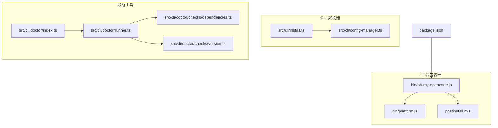
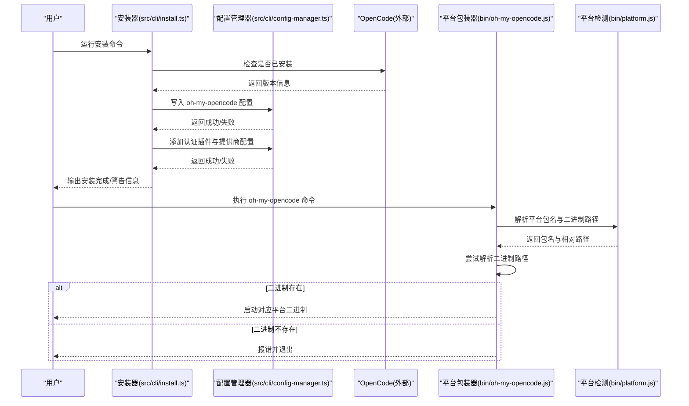
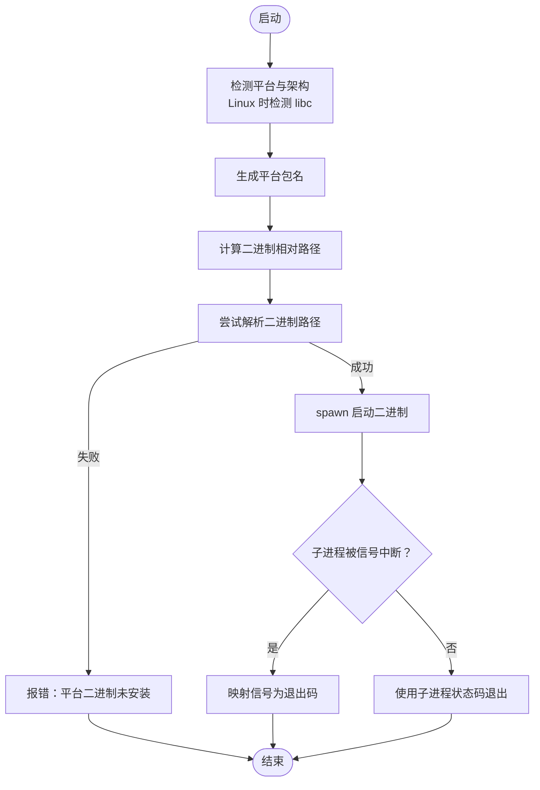
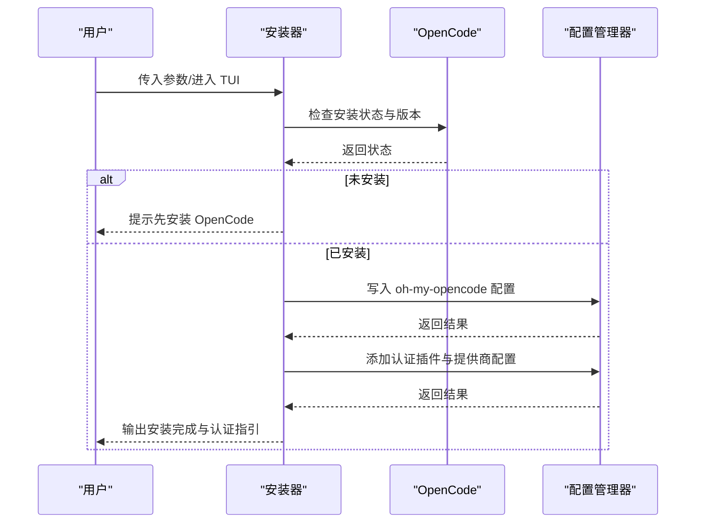
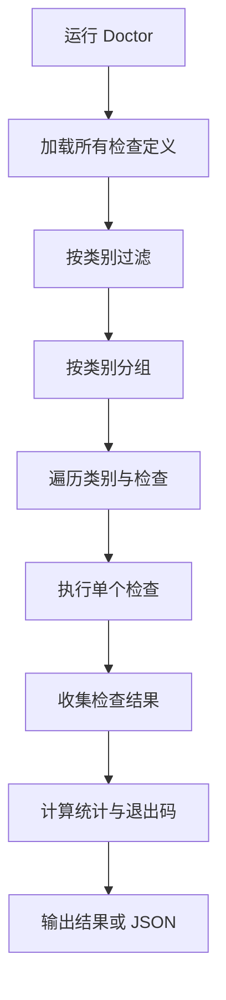
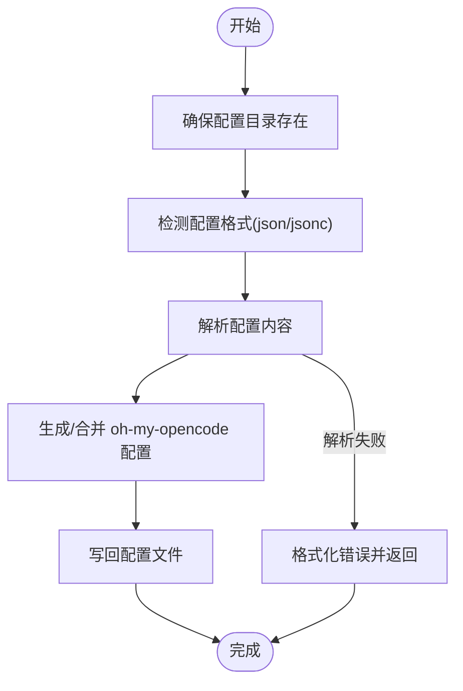
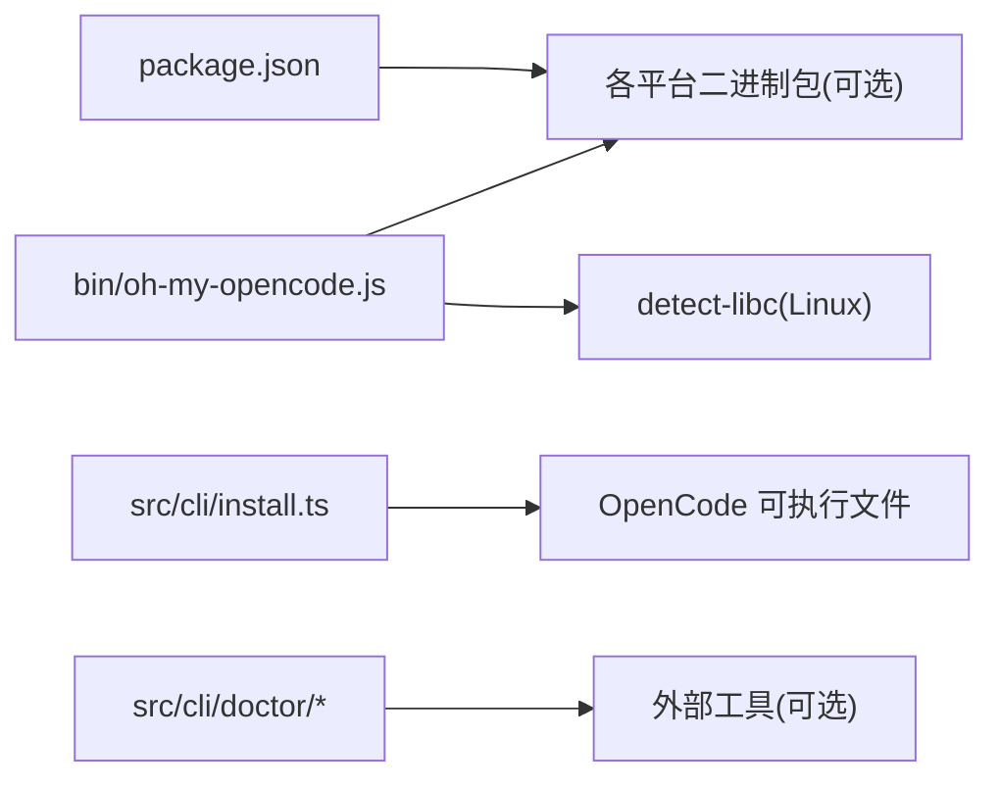

# 安装问题排查

<cite>
**本文档引用的文件**
- [README.md](file://README.md)
- [package.json](file://package.json)
- [bin/oh-my-opencode.js](file://bin/oh-my-opencode.js)
- [bin/platform.js](file://bin/platform.js)
- [postinstall.mjs](file://postinstall.mjs)
- [src/cli/install.ts](file://src/cli/install.ts)
- [src/cli/config-manager.ts](file://src/cli/config-manager.ts)
- [src/cli/doctor/index.ts](file://src/cli/doctor/index.ts)
- [src/cli/doctor/runner.ts](file://src/cli/doctor/runner.ts)
- [src/cli/doctor/checks/dependencies.ts](file://src/cli/doctor/checks/dependencies.ts)
- [src/cli/doctor/checks/version.ts](file://src/cli/doctor/checks/version.ts)
- [src/shared/config-errors.ts](file://src/shared/config-errors.ts)
</cite>

## 目录
1. [简介](#简介)
2. [项目结构](#项目结构)
3. [核心组件](#核心组件)
4. [架构总览](#架构总览)
5. [详细组件分析](#详细组件分析)
6. [依赖关系分析](#依赖关系分析)
7. [性能考虑](#性能考虑)
8. [故障排除指南](#故障排除指南)
9. [结论](#结论)
10. [附录](#附录)

## 简介
本指南面向在安装 Oh My OpenCode 时遇到问题的用户，覆盖系统要求不满足、依赖包安装失败、权限问题、网络连接异常等常见安装障碍。文档提供分步骤的诊断流程与具体修复方案，并针对不同操作系统平台给出注意事项与替代方案。同时解释安装过程中的关键检查点与错误信号，以及如何调试自动化安装脚本与进行手动安装。

## 项目结构
该项目采用模块化设计，CLI 安装器位于 src/cli 目录，平台二进制包装器位于 bin 目录，配置管理与诊断工具分别在 config-manager 与 doctor 子系统中实现。安装器负责检测 OpenCode 是否已安装、写入 oh-my-opencode 配置、添加认证插件与提供商配置；平台包装器负责根据当前系统选择正确的预编译二进制执行；doctor 工具用于运行健康检查以定位问题。

**图表来源**
- [package.json](file://package.json#L1-L93)
- [bin/oh-my-opencode.js](file://bin/oh-my-opencode.js#L1-L81)
- [bin/platform.js](file://bin/platform.js#L1-L39)
- [postinstall.mjs](file://postinstall.mjs#L1-L44)
- [src/cli/install.ts](file://src/cli/install.ts#L1-L463)
- [src/cli/config-manager.ts](file://src/cli/config-manager.ts#L1-L731)
- [src/cli/doctor/index.ts](file://src/cli/doctor/index.ts#L1-L12)
- [src/cli/doctor/runner.ts](file://src/cli/doctor/runner.ts#L1-L133)
- [src/cli/doctor/checks/dependencies.ts](file://src/cli/doctor/checks/dependencies.ts#L1-L164)
- [src/cli/doctor/checks/version.ts](file://src/cli/doctor/checks/version.ts#L1-L136)

**章节来源**
- [README.md](file://README.md#L257-L275)
- [package.json](file://package.json#L1-L93)

## 核心组件
- 平台包装器与二进制解析：负责在运行时根据系统平台与架构选择正确的预编译二进制，并处理缺失二进制或 libc 检测失败的情况。
- 安装器：提供交互式与非交互式两种安装模式，检测 OpenCode 是否已安装、写入 oh-my-opencode 配置、添加认证插件与提供商配置。
- 配置管理器：负责读取/写入 OpenCode 主配置与 oh-my-opencode 用户配置，包含错误格式化、权限/文件系统错误识别、版本查询与插件名带标签解析。
- 诊断工具：按类别运行多项检查（安装、配置、认证、依赖、工具、更新），输出结构化结果并决定退出码。
- 错误处理与建议：对常见错误（权限不足、文件不存在、磁盘空间不足、只读文件系统）提供明确提示与修复建议。

**章节来源**
- [bin/oh-my-opencode.js](file://bin/oh-my-opencode.js#L1-L81)
- [bin/platform.js](file://bin/platform.js#L1-L39)
- [postinstall.mjs](file://postinstall.mjs#L1-L44)
- [src/cli/install.ts](file://src/cli/install.ts#L1-L463)
- [src/cli/config-manager.ts](file://src/cli/config-manager.ts#L1-L731)
- [src/cli/doctor/index.ts](file://src/cli/doctor/index.ts#L1-L12)
- [src/cli/doctor/runner.ts](file://src/cli/doctor/runner.ts#L1-L133)
- [src/cli/doctor/checks/dependencies.ts](file://src/cli/doctor/checks/dependencies.ts#L1-L164)
- [src/cli/doctor/checks/version.ts](file://src/cli/doctor/checks/version.ts#L1-L136)
- [src/shared/config-errors.ts](file://src/shared/config-errors.ts#L1-L19)

## 架构总览
下图展示了从用户触发安装到最终写入配置的关键调用链路，以及平台包装器在运行期如何解析并执行对应平台的二进制。

**图表来源**
- [src/cli/install.ts](file://src/cli/install.ts#L239-L350)
- [src/cli/config-manager.ts](file://src/cli/config-manager.ts#L222-L280)
- [bin/oh-my-opencode.js](file://bin/oh-my-opencode.js#L29-L78)
- [bin/platform.js](file://bin/platform.js#L10-L38)

## 详细组件分析

### 组件A：平台包装器与二进制解析
该组件负责在运行时根据当前系统平台与架构选择正确的预编译二进制，并处理缺失二进制或 libc 检测失败的情况。其关键行为包括：
- 在 Linux 上检测 libc 类型（glibc 或 musl），并据此拼接平台包名后缀。
- 解析平台包内的二进制路径（Windows 使用 .exe 扩展名）。
- 尝试解析二进制路径，若失败则输出错误并建议安装对应平台包。
- 处理 spawn 子进程错误与信号，正确映射退出码。

**图表来源**
- [bin/oh-my-opencode.js](file://bin/oh-my-opencode.js#L15-L78)
- [bin/platform.js](file://bin/platform.js#L10-L38)

**章节来源**
- [bin/oh-my-opencode.js](file://bin/oh-my-opencode.js#L1-L81)
- [bin/platform.js](file://bin/platform.js#L1-L39)
- [postinstall.mjs](file://postinstall.mjs#L1-L44)

### 组件B：安装器（交互式与非交互式）
安装器支持两种模式：
- 非交互式：通过命令行参数传入订阅与提供商选项，进行快速安装。
- 交互式：通过 TUI 逐项确认，适合新手用户。

关键流程：
- 检测 OpenCode 是否已安装并返回版本。
- 添加 oh-my-opencode 插件到 OpenCode 配置。
- 若启用 Gemini，则添加认证插件与提供商配置。
- 写入 oh-my-opencode 用户配置（模型选择、分类器等）。
- 输出配置摘要与认证指引。

**图表来源**
- [src/cli/install.ts](file://src/cli/install.ts#L239-L350)
- [src/cli/config-manager.ts](file://src/cli/config-manager.ts#L222-L280)

**章节来源**
- [src/cli/install.ts](file://src/cli/install.ts#L1-L463)
- [README.md](file://README.md#L257-L275)

### 组件C：诊断工具（Doctor）
Doctor 将检查分为多个类别（安装、配置、认证、依赖、工具、更新），按固定顺序运行并汇总结果。每个检查函数返回标准化的检查结果对象，包含状态（通过/警告/失败/跳过）、消息与耗时。运行结束后根据是否存在失败检查决定退出码。

**图表来源**
- [src/cli/doctor/runner.ts](file://src/cli/doctor/runner.ts#L83-L133)
- [src/cli/doctor/index.ts](file://src/cli/doctor/index.ts#L1-L12)

**章节来源**
- [src/cli/doctor/index.ts](file://src/cli/doctor/index.ts#L1-L12)
- [src/cli/doctor/runner.ts](file://src/cli/doctor/runner.ts#L1-L133)
- [src/cli/doctor/checks/dependencies.ts](file://src/cli/doctor/checks/dependencies.ts#L1-L164)
- [src/cli/doctor/checks/version.ts](file://src/cli/doctor/checks/version.ts#L1-L136)

### 组件D：配置管理与错误处理
配置管理器负责：
- 自动创建配置目录，确保可写。
- 解析 OpenCode 配置格式（json/jsonc），并进行语法校验与空内容检查。
- 写入/合并 oh-my-opencode 用户配置，支持深度合并策略。
- 对常见错误进行格式化与建议（权限不足、文件不存在、磁盘空间不足、只读文件系统）。
- 获取最新版本信息与 dist-tags，用于判断是否需要更新。

**图表来源**
- [src/cli/config-manager.ts](file://src/cli/config-manager.ts#L215-L430)

**章节来源**
- [src/cli/config-manager.ts](file://src/cli/config-manager.ts#L1-L731)
- [src/shared/config-errors.ts](file://src/shared/config-errors.ts#L1-L19)

## 依赖关系分析
- 包管理与平台二进制：package.json 中声明了各平台的可选二进制包，安装器会根据用户系统选择对应包。
- 运行时依赖：安装器依赖 OpenCode 可执行文件存在且可执行；平台包装器依赖 detect-libc（Linux）以区分 glibc 与 musl。
- 诊断工具：依赖各工具的可执行文件存在（如 sg/ast-grep、comment-checker），若缺失则以警告形式提示。

**图表来源**
- [package.json](file://package.json#L78-L86)
- [bin/oh-my-opencode.js](file://bin/oh-my-opencode.js#L15-L27)
- [src/cli/install.ts](file://src/cli/install.ts#L261-L267)
- [src/cli/doctor/checks/dependencies.ts](file://src/cli/doctor/checks/dependencies.ts#L32-L104)

**章节来源**
- [package.json](file://package.json#L1-L93)
- [bin/oh-my-opencode.js](file://bin/oh-my-opencode.js#L1-L81)
- [src/cli/doctor/checks/dependencies.ts](file://src/cli/doctor/checks/dependencies.ts#L1-L164)

## 性能考虑
- 安装器在非交互模式下会进行网络请求（获取 npm 最新版本、dist-tags），默认超时时间有限，网络较慢时可能失败。
- Doctor 的检查按类别顺序执行，避免一次性大量并发操作；个别检查（如版本检查）会进行网络请求，建议在网络稳定环境下运行。
- 平台包装器在解析二进制路径时使用同步 require.resolve，通常开销很小，但在某些容器环境中可能因权限或路径问题导致失败。

[本节为通用指导，无需特定文件来源]

## 故障排除指南

### 1. 系统要求不满足
- 症状：安装器提示 OpenCode 未安装或版本过低。
- 排查步骤：
  - 运行安装器前先确认 OpenCode 已安装且版本满足要求。
  - 若未安装，参考官方安装指南进行安装。
- 修复方案：
  - 安装 OpenCode 后再次运行安装器。
  - 如需指定 OpenCode 版本，请参考 README 中的安装说明。

**章节来源**
- [src/cli/install.ts](file://src/cli/install.ts#L261-L267)
- [README.md](file://README.md#L257-L275)

### 2. 平台二进制缺失或无法解析
- 症状：运行 oh-my-opencode 报错“平台二进制未安装”或“无法执行二进制”。
- 排查步骤：
  - 检查当前系统平台与架构是否受支持。
  - 确认对应平台的二进制包已安装（例如 linux-x64、darwin-arm64 等）。
  - 在 Linux 上确认 detect-libc 可用，以正确区分 glibc 与 musl。
- 修复方案：
  - 安装对应平台包（如通过 npm 安装相应包）。
  - 在 Linux 上安装 detect-libc 或使用兼容的发行版。
  - 使用 postinstall.mjs 检查二进制可用性。

**章节来源**
- [bin/oh-my-opencode.js](file://bin/oh-my-opencode.js#L35-L55)
- [bin/platform.js](file://bin/platform.js#L10-L27)
- [postinstall.mjs](file://postinstall.mjs#L25-L41)

### 3. 权限问题（EACCES/EPERM）
- 症状：写入配置文件时报权限错误。
- 排查步骤：
  - 检查配置目录与文件的所有权与权限。
  - 确认当前用户对 ~/.config/opencode 有写权限。
- 修复方案：
  - 使用 sudo 提升权限或修改目录所有权。
  - 更换用户或使用具有足够权限的账户执行安装。

**章节来源**
- [src/cli/config-manager.ts](file://src/cli/config-manager.ts#L64-L98)

### 4. 文件系统错误（ENOENT/ENOSPC/EROFS）
- 症状：读取/写入配置文件失败，或磁盘空间不足、文件系统只读。
- 排查步骤：
  - 检查目标路径是否存在（ENOENT）。
  - 检查磁盘空间是否充足（ENOSPC）。
  - 检查文件系统是否为只读（EROFS）。
- 修复方案：
  - 删除或修复损坏的配置文件。
  - 清理磁盘空间或更换存储位置。
  - 重新挂载为读写模式。

**章节来源**
- [src/cli/config-manager.ts](file://src/cli/config-manager.ts#L64-L98)

### 5. 网络连接异常
- 症状：安装器或 Doctor 在查询版本或获取 npm 信息时失败。
- 排查步骤：
  - 检查网络连通性与代理设置。
  - 确认可访问 npm registry。
- 修复方案：
  - 配置正确的代理或直连网络。
  - 在非交互模式下重试，或稍后再试。

**章节来源**
- [src/cli/config-manager.ts](file://src/cli/config-manager.ts#L100-L131)
- [src/cli/doctor/checks/version.ts](file://src/cli/doctor/checks/version.ts#L120-L131)

### 6. 依赖工具缺失（可选）
- 症状：Doctor 报告某些外部工具未安装（如 AST-Grep CLI、Comment Checker）。
- 排查步骤：
  - 检查工具是否已安装并可执行。
- 修复方案：
  - 按提示安装缺失工具。
  - 若不安装，部分功能将以降级方式工作。

**章节来源**
- [src/cli/doctor/checks/dependencies.ts](file://src/cli/doctor/checks/dependencies.ts#L32-L104)

### 7. 自动化安装脚本调试
- 症状：postinstall.mjs 报告二进制不可用但安装仍继续。
- 排查步骤：
  - 查看 postinstall.mjs 的输出，确认是否抛出异常。
  - 手动运行 getPlatformPackage 与 getBinaryPath，验证路径解析。
- 修复方案：
  - 安装对应平台包。
  - 在 CI 环境中预装平台包或使用容器镜像内置二进制。

**章节来源**
- [postinstall.mjs](file://postinstall.mjs#L25-L41)
- [bin/platform.js](file://bin/platform.js#L10-L38)

### 8. 手动安装替代方案
- 症状：自动安装失败或网络受限。
- 替代方案：
  - 手动下载对应平台包并解压至本地。
  - 将平台包路径加入 PATH 或直接调用二进制。
  - 使用包管理器（如 npm）安装后，再运行安装器写入配置。

**章节来源**
- [README.md](file://README.md#L257-L275)
- [package.json](file://package.json#L78-L86)

### 9. 不同操作系统平台注意事项
- macOS：
  - 确保安装了对应架构（x64/ARM64）的二进制包。
  - 若使用 Homebrew，注意与系统默认工具链的兼容性。
- Linux：
  - glibc 与 musl 的二进制包不同，需确保 detect-libc 正常工作。
  - 在容器或只读根文件系统中，需提前准备可写的配置目录。
- Windows：
  - 注意 .exe 扩展名与路径分隔符。
  - 确保 PowerShell/命令提示符具备执行权限。

**章节来源**
- [bin/platform.js](file://bin/platform.js#L10-L38)
- [bin/oh-my-opencode.js](file://bin/oh-my-opencode.js#L35-L78)

### 10. 关键检查点与错误信号
- 安装器检查点：
  - OpenCode 是否已安装与版本号。
  - oh-my-opencode 插件是否已添加到 OpenCode 配置。
  - 认证插件与提供商配置是否正确写入。
  - oh-my-opencode 用户配置是否成功生成/合并。
- Doctor 检查点：
  - 安装状态、配置格式、认证可用性、依赖工具、工具可用性、版本更新状态。
- 错误信号：
  - 权限不足、文件不存在、磁盘空间不足、只读文件系统、网络超时/失败、平台二进制缺失。

**章节来源**
- [src/cli/install.ts](file://src/cli/install.ts#L258-L350)
- [src/cli/doctor/runner.ts](file://src/cli/doctor/runner.ts#L83-L133)
- [src/cli/config-manager.ts](file://src/cli/config-manager.ts#L64-L98)

## 结论
通过上述诊断与修复流程，大多数安装问题均可得到解决。建议优先使用 Doctor 工具进行系统性检查，结合平台包装器与安装器的日志输出定位问题根因。对于网络受限或权限受限的环境，可采用手动安装与平台包预置的方式绕过自动化安装的限制。

[本节为总结性内容，无需特定文件来源]

## 附录

### A. 常见错误对照表
- 权限错误：EACCES/EPERM → 检查目录所有权与写权限
- 文件不存在：ENOENT → 检查路径与文件存在性
- 磁盘空间不足：ENOSPC → 清理空间或更换位置
- 只读文件系统：EROFS → 重新挂载为读写
- 网络超时/失败：网络问题 → 配置代理或稍后重试
- 平台二进制缺失：Linux libc 未检测 → 安装 detect-libc 或使用兼容包

**章节来源**
- [src/cli/config-manager.ts](file://src/cli/config-manager.ts#L64-L98)

### B. Doctor 分类与建议
- 安装：确认 OpenCode 已安装且版本满足要求。
- 配置：检查 OpenCode 与 oh-my-opencode 配置格式与内容。
- 认证：确认认证插件与提供商配置已正确写入。
- 依赖：检查可选工具是否可用，必要时安装。
- 工具：确认工具可执行且版本正常。
- 更新：检查当前版本与最新版本，必要时更新。

**章节来源**
- [src/cli/doctor/runner.ts](file://src/cli/doctor/runner.ts#L74-L81)
- [src/cli/doctor/checks/version.ts](file://src/cli/doctor/checks/version.ts#L71-L125)