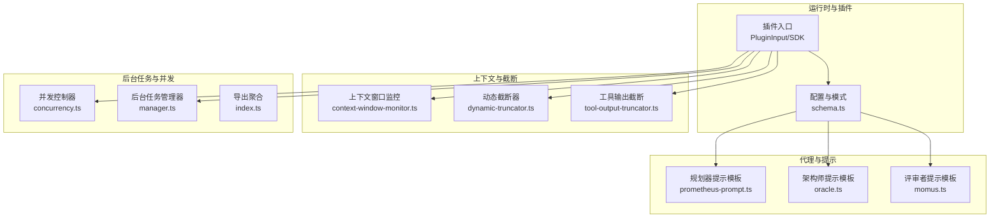
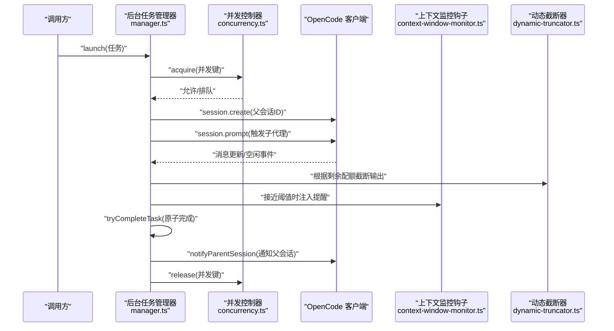
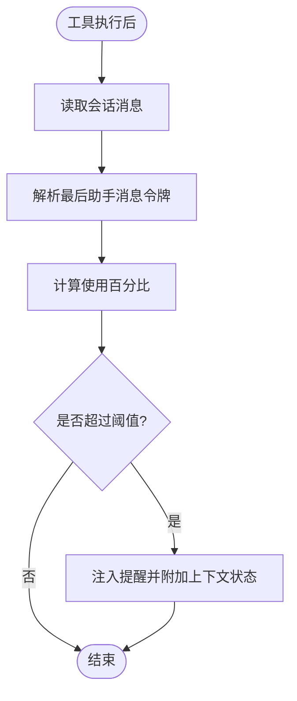
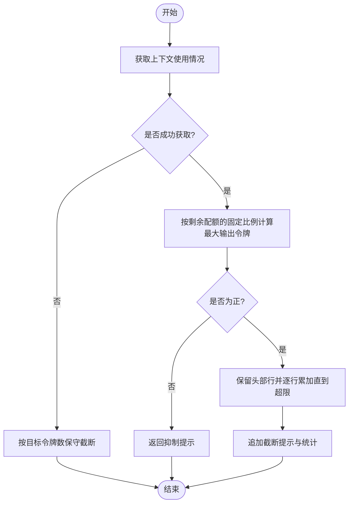
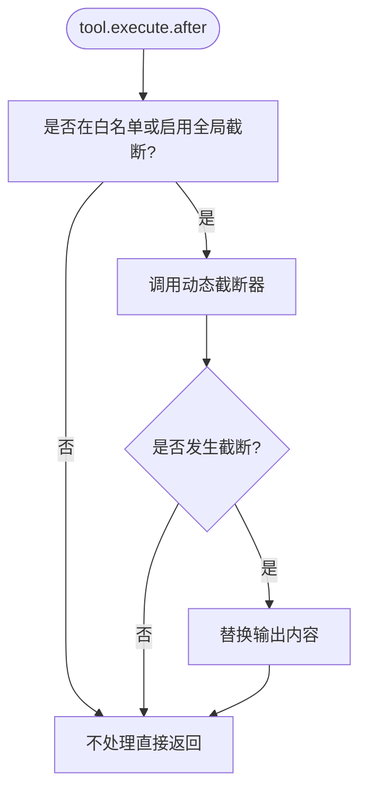
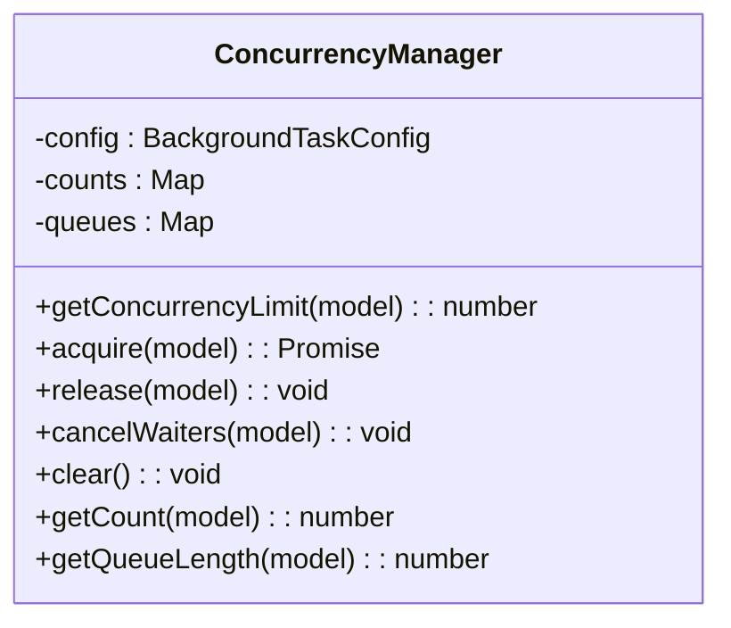
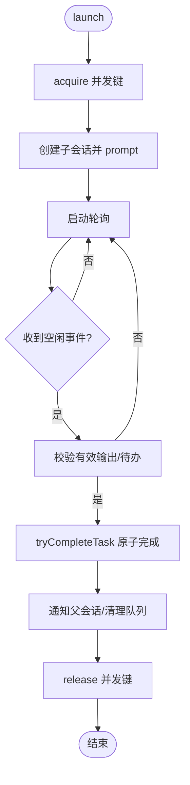
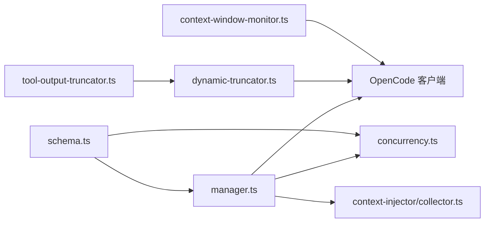

# 性能问题优化

<cite>
**本文引用的文件**
- [README.md](file://README.md)
- [package.json](file://package.json)
- [src/hooks/context-window-monitor.ts](file://src/hooks/context-window-monitor.ts)
- [src/shared/dynamic-truncator.ts](file://src/shared/dynamic-truncator.ts)
- [src/hooks/tool-output-truncator.ts](file://src/hooks/tool-output-truncator.ts)
- [src/features/background-agent/concurrency.ts](file://src/features/background-agent/concurrency.ts)
- [src/features/background-agent/manager.ts](file://src/features/background-agent/manager.ts)
- [src/features/background-agent/index.ts](file://src/features/background-agent/index.ts)
- [src/features/background-agent/concurrency.test.ts](file://src/features/background-agent/concurrency.test.ts)
- [src/features/background-agent/manager.test.ts](file://src/features/background-agent/manager.test.ts)
- [src/config/schema.ts](file://src/config/schema.ts)
- [src/features/context-injector/collector.ts](file://src/features/context-injector/collector.ts)
- [src/agents/prometheus-prompt.ts](file://src/agents/prometheus-prompt.ts)
- [src/agents/oracle.ts](file://src/agents/oracle.ts)
- [src/agents/momus.ts](file://src/agents/momus.ts)
- [src/agents/annis.ts](file://src/agents/annis.ts)
- [src/agents/annis.ts](file://src/agents/annis.ts)
- [src/agents/annis.ts](file://src/agents/annis.ts)
- [src/agents/annis.ts](file://src/agents/annis.ts)
- [src/agents/annis.ts](file://src/agents/annis.ts)
- [src/agents/annis.ts](file://src/agents/annis.ts)
- [src/agents/annis.ts](file://src/agents/annis.ts)
- [src/agents/annis.ts](file://src/agents/annis.ts)
- [src/agents/annis.ts](file://src/agents/annis.ts)
- [src/agents/annis.ts](file://src/agents/annis.ts)
- [src/agents/annis.ts](file://src/agents/annis.ts)
- [src/agents/annis.ts](file://src/agents/annis.ts)
- [src/agents/annis.ts](file://src/agents/annis.ts)
- [src/agents/annis.ts](file://src/agents/annis.ts)
- [src/agents/annis.ts](file://src/agents/annis.ts)
- [src/agents/annis.ts](file://src/agents/annis.ts)
- [src/agents/annis.ts](file://src/agents/annis.ts)
- [src/agents/annis.ts](file://src/agents/annis.ts)
- [src/agents/annis.ts](file://src/agents/annis.ts)
- [src/agents/annis.ts](file://src/agents/annis.ts)
- [src/agents/annis.ts](file://src/agents/annis.ts)
- [src/agents/annis.ts](file://src/agents/annis.ts)
- [src/agents/annis.ts](file://src/agents/annis.ts)
- [src/agents/annis.ts](file://src/agents/annis.ts)
- [src/agents/annis.ts](file://src/agents/annis.ts)
- [src/agents/annis.ts](file://src/agents/annis.ts)
- [src/agents/annis.ts](file://src/agents/annis.ts)
- [src/agents/annis.ts](file://src/agents/annis.ts)
- [src......](file://src/agents/annis.ts)
- [src/agents/annis.ts](file://src/agents/annis.ts)
- [src/agents/annis.ts](file://src/agents/annis.ts)
- [src/agents/annis.ts](file://src/agents/annis.ts)
- [src/agents/annis.ts](file://src/agents/annis.ts)
- [src/agents/annis.ts](file://src/agents/annis.ts)
- [src/agents/annis.ts](file://src/agents/annis.ts)
- [src/agents/annis.ts](file://src/agents/annis.ts)
- [src/agents/annis.ts](file://src/agents/annis.ts)
- [src/agents/annis.ts](file://src/agents/annis.ts)
- [src/agents/annis.ts](file://src/agents/annis.ts)
- [src/agents/annis.ts](file://src/agents/annis.ts)
- [src/agents/annis.ts](file://src/agents/annis.ts)
- [src/agents/annis.ts](file://src/agents/annis.ts)
- [src/agents/annis.ts](file://src/agents/annis.ts)
- [src/agents/annis.ts](file://src/agents/annis.ts)
- [src/agents/annis.ts](file://src/agents/annis.ts)
- [src/agents/annis.ts](file://src/agents/annis.ts)
- [src/agents/annis.ts](file://src/agents/annis.ts)
- [src/agents/annis.ts](file://src/agents/annis.ts)
- [src/agents/annis.ts](file://src/agents/annis.ts)
- [src/agents/annis.ts](file://src/agents/annis.ts)
- [src/agents/annis.ts](file://src/agents/annis.ts)
- [src/agents/annis.ts](file://src/agents/annis.ts)
- [src/agents/annis.ts](file://src/agents/annis.ts)
- [src/agents/annis.ts](file://src/agents/annis.ts)
- [src/agents/annis.ts](file://src/agents/annis.ts)
- [src/agents/annis.ts](file://src/agents/annis.ts)
- [src/agents/annis.ts](file://src......)
</cite>

## 目录
1. [简介](#简介)
2. [项目结构](#项目结构)
3. [核心组件](#核心组件)
4. [架构总览](#架构总览)
5. [详细组件分析](#详细组件分析)
6. [依赖关系分析](#依赖关系分析)
7. [性能考量](#性能考量)
8. [故障排查指南](#故障排查指南)
9. [结论](#结论)
10. [附录](#附录)

## 简介
本指南聚焦 Oh My OpenCode 在实际使用中可能遇到的性能问题：内存占用过高、CPU 占用异常、响应延迟增加等，并结合仓库中的上下文窗口管理、后台任务调度、资源限制与动态截断等机制，提供系统化的诊断与优化路径。文档同时覆盖并发控制、缓存策略、监控与指标分析、基准测试与持续监控的最佳实践，帮助在复杂多模型、多代理、多工具的运行环境中稳定提升吞吐与稳定性。

## 项目结构
从性能视角看，项目围绕“插件入口”“配置与模式”“上下文与截断”“后台任务与并发”“代理与提示工程”等模块协同工作。下图展示与性能直接相关的关键子系统：

图表来源
- [src/hooks/context-window-monitor.ts](file://src/hooks/context-window-monitor.ts#L1-L100)
- [src/shared/dynamic-truncator.ts](file://src/shared/dynamic-truncator.ts#L1-L194)
- [src/hooks/tool-output-truncator.ts](file://src/hooks/tool-output-truncator.ts#L1-L62)
- [src/features/background-agent/concurrency.ts](file://src/features/background-agent/concurrency.ts#L1-L138)
- [src/features/background-agent/manager.ts](file://src/features/background-agent/manager.ts#L1-L800)
- [src/features/background-agent/index.ts](file://src/features/background-agent/index.ts#L1-L3)
- [src/config/schema.ts](file://src/config/schema.ts#L297-L303)
- [src/agents/prometheus-prompt.ts](file://src/agents/prometheus-prompt.ts#L1218-L1229)
- [src/agents/oracle.ts](file://src/agents/oracle.ts#L35-L58)
- [src/agents/momus.ts](file://src/agents/momus.ts#L60-L83)

章节来源
- [README.md](file://README.md#L168-L185)
- [package.json](file://package.json#L1-L93)

## 核心组件
- 上下文窗口监控与提醒：在接近阈值时注入系统指令，避免过早压缩或跳过任务。
- 动态截断器：基于会话上下文使用量估算剩余配额，按比例截断输出，保留头部信息。
- 工具输出截断：对高产工具（如 grep、lsp、ast-grep）进行白名单或全局截断，防止上下文爆炸。
- 后台任务并发控制器：按模型/提供商/默认维度控制并发，支持排队与取消等待者。
- 后台任务管理器：周期轮询、事件驱动完成判定、通知父会话、释放并发槽位。
- 配置模式：并发上限、提供商/模型级并发、过期超时等参数化控制。

章节来源
- [src/hooks/context-window-monitor.ts](file://src/hooks/context-window-monitor.ts#L1-L100)
- [src/shared/dynamic-truncator.ts](file://src/shared/dynamic-truncator.ts#L105-L175)
- [src/hooks/tool-output-truncator.ts](file://src/hooks/tool-output-truncator.ts#L1-L62)
- [src/features/background-agent/concurrency.ts](file://src/features/background-agent/concurrency.ts#L1-L138)
- [src/features/background-agent/manager.ts](file://src/features/background-agent/manager.ts#L1-L800)
- [src/config/schema.ts](file://src/config/schema.ts#L297-L303)

## 架构总览
下图展示一次“后台任务启动→并发获取→会话创建→轮询完成→通知父会话→释放并发”的完整链路，以及与上下文截断的协作点。

图表来源
- [src/features/background-agent/manager.ts](file://src/features/background-agent/manager.ts#L79-L217)
- [src/features/background-agent/concurrency.ts](file://src/features/background-agent/concurrency.ts#L41-L94)
- [src/hooks/context-window-monitor.ts](file://src/hooks/context-window-monitor.ts#L33-L99)
- [src/shared/dynamic-truncator.ts](file://src/shared/dynamic-truncator.ts#L144-L175)

## 详细组件分析

### 上下文窗口监控与提醒
- 触发时机：工具执行后读取最近助手消息的输入/缓存读取令牌数，计算使用百分比。
- 阈值策略：超过阈值时注入系统指令提醒，避免在高负载下仓促收尾。
- 会话清理：删除事件时清理已提醒集合，避免重复注入。

图表来源
- [src/hooks/context-window-monitor.ts](file://src/hooks/context-window-monitor.ts#L33-L99)

章节来源
- [src/hooks/context-window-monitor.ts](file://src/hooks/context-window-monitor.ts#L1-L100)

### 动态截断器
- 使用场景：当上下文使用不可用时采用保守截断；可用时按剩余配额的一定比例截断，保留头部若干行。
- 截断策略：估算字符/令牌，保留标题行，追加“被截断”提示与移除行数统计。
- 适用范围：工具输出截断、同步/异步截断接口。

图表来源
- [src/shared/dynamic-truncator.ts](file://src/shared/dynamic-truncator.ts#L105-L175)

章节来源
- [src/shared/dynamic-truncator.ts](file://src/shared/dynamic-truncator.ts#L1-L194)

### 工具输出截断钩子
- 白名单工具：对高产工具（grep、lsp、ast-grep、webfetch 等）进行截断。
- 全局开关：可通过实验配置开启对所有工具输出的截断。
- 优雅降级：失败时不中断工具执行。

图表来源
- [src/hooks/tool-output-truncator.ts](file://src/hooks/tool-output-truncator.ts#L33-L61)

章节来源
- [src/hooks/tool-output-truncator.ts](file://src/hooks/tool-output-truncator.ts#L1-L62)
- [src/shared/dynamic-truncator.ts](file://src/shared/dynamic-truncator.ts#L177-L193)

### 后台任务并发控制
- 并发键：默认以代理名作为并发键，支持模型级与提供商级上限覆盖。
- 获取/释放：未达上限立即放行；达到上限进入队列；释放时优先交接给下一个等待者。
- 清理：支持取消等待者与清空状态，避免悬挂。

图表来源
- [src/features/background-agent/concurrency.ts](file://src/features/background-agent/concurrency.ts#L15-L137)

章节来源
- [src/features/background-agent/concurrency.ts](file://src/features/background-agent/concurrency.ts#L1-L138)
- [src/features/background-agent/concurrency.test.ts](file://src/features/background-agent/concurrency.test.ts#L167-L418)

### 后台任务管理器
- 生命周期：启动→轮询→事件驱动完成→通知父会话→释放并发。
- 完成判定：最小稳定时间、存在有效输出、无未完成待办。
- 通知批量化：按父会话聚合，减少冗余提示。
- 进程清理：注册信号处理器，确保退出前回收资源。

图表来源
- [src/features/background-agent/manager.ts](file://src/features/background-agent/manager.ts#L79-L217)
- [src/features/background-agent/manager.ts](file://src/features/background-agent/manager.ts#L444-L531)
- [src/features/background-agent/manager.ts](file://src/features/background-agent/manager.ts#L736-L764)

章节来源
- [src/features/background-agent/manager.ts](file://src/features/background-agent/manager.ts#L1-L800)
- [src/features/background-agent/manager.test.ts](file://src/features/background-agent/manager.test.ts#L954-L1007)

### 配置与参数化
- 并发配置：默认并发、提供商/模型级并发、过期超时。
- 实验特性：全局截断开关、动态上下文裁剪策略等。

章节来源
- [src/config/schema.ts](file://src/config/schema.ts#L297-L303)
- [src/config/schema.ts](file://src/config/schema.ts#L241-L248)

### 上下文收集与注入
- 收集器：按会话聚合上下文条目，排序后合并，支持消费与清理。
- 优先级：按预设顺序与时间戳排序，保证一致性与可预测性。

章节来源
- [src/features/context-injector/collector.ts](file://src/features/context-injector/collector.ts#L52-L83)

### 代理与提示工程
- 角色分工：规划器（Prometheus）、架构师（Oracle）、评审者（Momus）等，明确职责边界，降低重复思考与上下文膨胀。
- 指令约束：强调“必须有/不得有”“边界与验收标准”，减少 AI 溢出与漂移。

章节来源
- [src/agents/prometheus-prompt.ts](file://src/agents/prometheus-prompt.ts#L1218-L1229)
- [src/agents/oracle.ts](file://src/agents/oracle.ts#L35-L58)
- [src/agents/momus.ts](file://src/agents/momus.ts#L60-L83)

## 依赖关系分析
- 组件耦合
  - 后台任务管理器依赖并发控制器进行资源分配。
  - 动态截断器与工具输出截断钩子共同作用于工具输出，避免上下文膨胀。
  - 上下文窗口监控钩子在工具执行后读取会话消息，影响后续截断策略。
- 外部依赖
  - OpenCode SDK/客户端用于会话创建、消息查询与事件回调。
  - 配置模式通过 Zod Schema 参数化运行时行为。

图表来源
- [src/features/background-agent/manager.ts](file://src/features/background-agent/manager.ts#L1-L800)
- [src/features/background-agent/concurrency.ts](file://src/features/background-agent/concurrency.ts#L1-L138)
- [src/shared/dynamic-truncator.ts](file://src/shared/dynamic-truncator.ts#L1-L194)
- [src/hooks/tool-output-truncator.ts](file://src/hooks/tool-output-truncator.ts#L1-L62)
- [src/hooks/context-window-monitor.ts](file://src/hooks/context-window-monitor.ts#L1-L100)
- [src/config/schema.ts](file://src/config/schema.ts#L297-L303)

## 性能考量
- 内存使用过高
  - 症状：后台任务堆积、会话消息增长、并发队列长度上升。
  - 诊断：检查并发队列长度与任务计数，确认是否存在长时间无进展的任务。
  - 优化：合理设置并发上限与过期超时；启用工具输出截断；在高产工具上使用更严格的截断阈值。
- CPU 占用异常
  - 症状：轮询频率过高、事件处理频繁、动态截断计算密集。
  - 诊断：观察轮询间隔与事件触发频率；评估截断策略是否过于激进。
  - 优化：适当增大轮询间隔；减少不必要的并发；启用“动态上下文裁剪”策略保护近期工具输出。
- 响应延迟增加
  - 症状：工具输出过大导致上下文超限，触发多次截断与重试。
  - 诊断：查看上下文监控钩子提醒次数与工具输出截断命中率。
  - 优化：提前进行上下文裁剪（白名单工具）；在代理提示中明确“只保留必要信息”。

章节来源
- [src/features/background-agent/manager.ts](file://src/features/background-agent/manager.ts#L659-L673)
- [src/hooks/tool-output-truncator.ts](file://src/hooks/tool-output-truncator.ts#L1-L62)
- [src/shared/dynamic-truncator.ts](file://src/shared/dynamic-truncator.ts#L144-L175)
- [src/hooks/context-window-monitor.ts](file://src/hooks/context-window-monitor.ts#L1-L100)

## 故障排查指南
- 并发泄漏
  - 现象：队列长度持续增长、任务无法完成。
  - 排查：确认 tryCompleteTask 前是否已 release；检查错误路径是否遗漏释放。
  - 参考实现：原子化完成与释放顺序。
- 通知风暴
  - 现象：父会话频繁收到完成通知。
  - 排查：检查批量化 pendingByParent 的清理逻辑；确认任务完成后是否正确移除。
- 截断误伤
  - 现象：关键信息被截断。
  - 排查：调整保留头部行数；针对特定工具放宽截断阈值；必要时关闭全局截断。
- 上下文监控失效
  - 现象：阈值提醒缺失。
  - 排查：确认会话消息中存在助手消息且包含令牌信息；检查钩子注册与事件处理。

章节来源
- [src/features/background-agent/manager.ts](file://src/features/background-agent/manager.ts#L736-L764)
- [src/features/background-agent/manager.ts](file://src/features/background-agent/manager.ts#L648-L657)
- [src/hooks/tool-output-truncator.ts](file://src/hooks/tool-output-truncator.ts#L33-L61)
- [src/hooks/context-window-monitor.ts](file://src/hooks/context-window-monitor.ts#L33-L99)

## 结论
通过“并发控制 + 动态截断 + 上下文监控 + 代理提示约束”的组合拳，可以在多模型、多代理、多工具的复杂场景中显著缓解内存、CPU 与延迟压力。建议以配置参数化为先，配合工具输出截断与上下文监控钩子，再辅以后台任务的原子化完成与进程清理，形成闭环的性能保障体系。

## 附录
- 性能监控与指标建议
  - 关键指标：并发队列长度、任务完成时延、工具输出截断命中率、上下文使用百分比、会话消息数量。
  - 工具：结合 OpenCode 事件流与日志输出，建立可视化看板。
- 缓存策略优化
  - 利用“上下文窗口监控”与“动态截断器”的剩余配额感知，减少重复检索与冗余输出。
- 并发控制调整
  - 按提供商/模型设置并发上限；对高成本模型适当降低并发；为后台任务设置合理的过期超时。
- 基准测试与持续监控
  - 基准：在相同规模与工具集下对比不同并发与截断策略下的吞吐与延迟。
  - 持续：将性能指标纳入 CI/CD 报告，定期回归验证。