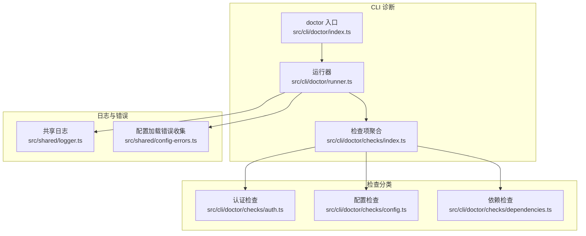
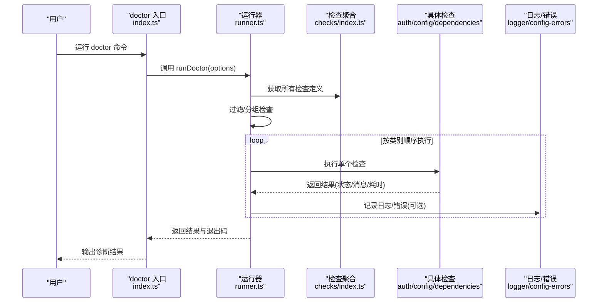
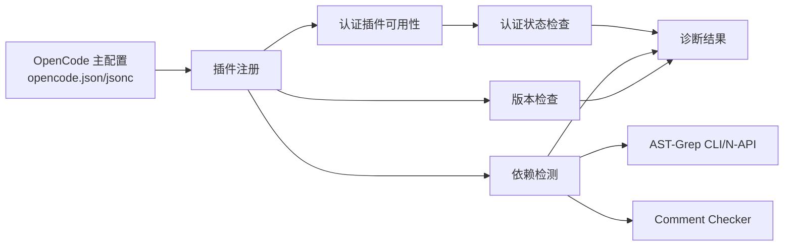

# 故障排除

<cite>
**本文引用的文件**
- [README.md](file://README.md)
- [CONFIGURATION-GUIDE.md](file://CONFIGURATION-GUIDE.md)
- [USAGE-ENTRY.md](file://USAGE-ENTRY.md)
- [CONTRIBUTING.md](file://CONTRIBUTING.md)
- [src/cli/doctor/index.ts](file://src/cli/doctor/index.ts)
- [src/cli/doctor/runner.ts](file://src/cli/doctor/runner.ts)
- [src/cli/doctor/checks/index.ts](file://src/cli/doctor/checks/index.ts)
- [src/cli/doctor/checks/auth.ts](file://src/cli/doctor/checks/auth.ts)
- [src/cli/doctor/checks/config.ts](file://src/cli/doctor/checks/config.ts)
- [src/cli/doctor/checks/dependencies.ts](file://src/cli/doctor/checks/dependencies.ts)
- [src/shared/logger.ts](file://src/shared/logger.ts)
- [src/shared/config-errors.ts](file://src/shared/config-errors.ts)
- [src/features/builtin-skills/systematic-debugging/SKILL.md](file://src/features/builtin-skills/systematic-debugging/SKILL.md)
</cite>

## 目录
1. [简介](#简介)
2. [项目结构](#项目结构)
3. [核心组件](#核心组件)
4. [架构总览](#架构总览)
5. [详细组件分析](#详细组件分析)
6. [依赖关系分析](#依赖关系分析)
7. [性能考虑](#性能考虑)
8. [故障排除指南](#故障排除指南)
9. [结论](#结论)
10. [附录](#附录)

## 简介
本指南面向使用 Oh My OpenCode 的用户与维护者，提供系统性的故障排除方法，涵盖安装问题、配置错误、运行时故障、性能瓶颈、日志分析与诊断工具使用，并给出可操作的排查流程与修复步骤。文档同时提供社区支持与问题报告建议，帮助快速定位并解决问题。

## 项目结构
从仓库结构可见，故障排除相关能力主要集中在 CLI 的 doctor 子系统与共享日志/错误收集模块，配合 README/配置与使用文档形成“安装—配置—运行—排错”的闭环。

**图表来源**
- [src/cli/doctor/index.ts](file://src/cli/doctor/index.ts#L1-L12)
- [src/cli/doctor/runner.ts](file://src/cli/doctor/runner.ts#L83-L133)
- [src/cli/doctor/checks/index.ts](file://src/cli/doctor/checks/index.ts#L22-L35)
- [src/cli/doctor/checks/auth.ts](file://src/cli/doctor/checks/auth.ts#L50-L89)
- [src/cli/doctor/checks/config.ts](file://src/cli/doctor/checks/config.ts#L83-L113)
- [src/cli/doctor/checks/dependencies.ts](file://src/cli/doctor/checks/dependencies.ts#L124-L137)
- [src/shared/logger.ts](file://src/shared/logger.ts#L9-L20)
- [src/shared/config-errors.ts](file://src/shared/config-errors.ts#L1-L19)

**章节来源**
- [README.md](file://README.md#L257-L530)
- [CONTRIBUTING.md](file://CONTRIBUTING.md#L107-L125)

## 核心组件
- doctor 诊断 CLI：提供统一的诊断入口，按类别执行多项检查，输出人类可读或 JSON 结果，并返回退出码。
- 检查项集合：包括安装、配置、认证、依赖、工具、更新等类别的检查。
- 日志与错误收集：提供临时日志文件路径与配置加载错误列表，辅助定位问题根因。

**章节来源**
- [src/cli/doctor/index.ts](file://src/cli/doctor/index.ts#L4-L11)
- [src/cli/doctor/runner.ts](file://src/cli/doctor/runner.ts#L83-L133)
- [src/shared/logger.ts](file://src/shared/logger.ts#L7-L20)
- [src/shared/config-errors.ts](file://src/shared/config-errors.ts#L1-L19)

## 架构总览
下图展示 doctor 的调用链路与检查分类，体现“入口—运行器—分组—逐项执行—汇总—输出”的流程。

**图表来源**
- [src/cli/doctor/index.ts](file://src/cli/doctor/index.ts#L4-L11)
- [src/cli/doctor/runner.ts](file://src/cli/doctor/runner.ts#L83-L133)
- [src/cli/doctor/checks/index.ts](file://src/cli/doctor/checks/index.ts#L22-L35)
- [src/cli/doctor/checks/auth.ts](file://src/cli/doctor/checks/auth.ts#L50-L89)
- [src/cli/doctor/checks/config.ts](file://src/cli/doctor/checks/config.ts#L83-L113)
- [src/cli/doctor/checks/dependencies.ts](file://src/cli/doctor/checks/dependencies.ts#L124-L137)
- [src/shared/logger.ts](file://src/shared/logger.ts#L9-L20)
- [src/shared/config-errors.ts](file://src/shared/config-errors.ts#L16-L18)

## 详细组件分析

### 诊断运行器与结果汇总
- 支持按类别过滤与排序，确保诊断流程稳定可控。
- 统一计算通过/失败/警告/跳过的统计，并根据是否存在 fail 决定退出码。
- 支持 JSON 输出，便于自动化集成。

**章节来源**
- [src/cli/doctor/runner.ts](file://src/cli/doctor/runner.ts#L52-L72)
- [src/cli/doctor/runner.ts](file://src/cli/doctor/runner.ts#L36-L45)
- [src/cli/doctor/runner.ts](file://src/cli/doctor/runner.ts#L47-L50)
- [src/cli/doctor/runner.ts](file://src/cli/doctor/runner.ts#L95-L111)
- [src/cli/doctor/runner.ts](file://src/cli/doctor/runner.ts#L117-L132)

### 认证检查（Anthropic/OpenAI/Google）
- 读取 OpenCode 主配置，判断对应认证插件是否已安装。
- 若未安装则跳过该检查；若安装则提示后续登录步骤。
- 便于快速识别认证层缺失导致的运行时问题。

**章节来源**
- [src/cli/doctor/checks/auth.ts](file://src/cli/doctor/checks/auth.ts#L18-L48)
- [src/cli/doctor/checks/auth.ts](file://src/cli/doctor/checks/auth.ts#L50-L89)

### 配置检查（oh-my-opencode.json）
- 自动发现项目级或用户级配置文件，支持 JSON/JSONC。
- 使用 Zod Schema 校验配置合法性，输出字段级错误。
- 无配置文件时视为默认配置，不阻断运行。

**章节来源**
- [src/cli/doctor/checks/config.ts](file://src/cli/doctor/checks/config.ts#L13-L25)
- [src/cli/doctor/checks/config.ts](file://src/cli/doctor/checks/config.ts#L27-L47)
- [src/cli/doctor/checks/config.ts](file://src/cli/doctor/checks/config.ts#L83-L113)

### 依赖检查（AST-Grep、Comment Checker 等）
- 检测二进制是否存在与版本信息，提供安装提示。
- 对可选依赖以警告形式提示，避免误判为失败。

**章节来源**
- [src/cli/doctor/checks/dependencies.ts](file://src/cli/doctor/checks/dependencies.ts#L4-L30)
- [src/cli/doctor/checks/dependencies.ts](file://src/cli/doctor/checks/dependencies.ts#L124-L137)

### 日志与错误收集
- 提供临时日志文件路径，记录诊断过程中的时间戳与消息。
- 提供配置加载错误列表，便于集中查看与清理。

**章节来源**
- [src/shared/logger.ts](file://src/shared/logger.ts#L7-L20)
- [src/shared/config-errors.ts](file://src/shared/config-errors.ts#L1-L19)

## 依赖关系分析
doctor 的检查项围绕“OpenCode 主配置—插件—认证—工具—依赖—版本”展开，形成清晰的依赖链。

**图表来源**
- [src/cli/doctor/checks/auth.ts](file://src/cli/doctor/checks/auth.ts#L18-L48)
- [src/cli/doctor/checks/config.ts](file://src/cli/doctor/checks/config.ts#L13-L25)
- [src/cli/doctor/checks/dependencies.ts](file://src/cli/doctor/checks/dependencies.ts#L32-L57)
- [src/cli/doctor/checks/dependencies.ts](file://src/cli/doctor/checks/dependencies.ts#L81-L104)

**章节来源**
- [src/cli/doctor/checks/index.ts](file://src/cli/doctor/checks/index.ts#L22-L35)

## 性能考虑
- 诊断运行器对每个检查进行计时，便于识别耗时检查。
- 依赖检查采用最小权限探测（如仅检测二进制存在与版本），避免重型初始化。
- 建议在 CI 中使用 JSON 输出，结合日志文件进行离线分析。

**章节来源**
- [src/cli/doctor/runner.ts](file://src/cli/doctor/runner.ts#L20-L34)
- [src/cli/doctor/runner.ts](file://src/cli/doctor/runner.ts#L123-L129)
- [src/cli/doctor/checks/dependencies.ts](file://src/cli/doctor/checks/dependencies.ts#L4-L30)

## 故障排除指南

### 一、安装与环境问题
- 症状
  - 无法找到 CLI 命令或运行时报找不到运行时。
- 诊断步骤
  - 使用 doctor 的“安装/更新”类别检查（如适用）。
  - 确认 OpenCode 版本满足要求。
- 修复建议
  - 按 README 的安装指引重新安装/升级。
  - 在非交互模式下传入订阅参数，避免认证前置步骤卡住。

**章节来源**
- [README.md](file://README.md#L257-L275)
- [README.md](file://README.md#L324-L341)
- [CONTRIBUTING.md](file://CONTRIBUTING.md#L54-L60)

### 二、配置错误
- 症状
  - 启动后行为异常、某些功能不可用、报字段校验错误。
- 诊断步骤
  - 运行 doctor 配置检查，确认配置文件是否存在、格式是否正确、字段是否符合 Schema。
  - 查看配置文件路径与格式（JSON/JSONC）。
- 修复建议
  - 修正 Schema 不匹配的字段，或删除无效字段。
  - 如需覆盖默认配置，参考配置指南中的优先级与覆盖方式。

**章节来源**
- [src/cli/doctor/checks/config.ts](file://src/cli/doctor/checks/config.ts#L83-L113)
- [CONFIGURATION-GUIDE.md](file://CONFIGURATION-GUIDE.md#L150-L158)

### 三、认证问题
- 症状
  - 登录成功但后续请求仍提示未认证；不同提供商登录冲突。
- 诊断步骤
  - 使用 doctor 认证检查，确认各提供商插件是否安装。
  - 检查 OpenCode 主配置中的插件数组是否包含所需认证插件。
- 修复建议
  - 安装缺失的认证插件后再进行登录。
  - 按 README 的认证步骤逐一完成提供商登录。

**章节来源**
- [src/cli/doctor/checks/auth.ts](file://src/cli/doctor/checks/auth.ts#L50-L89)
- [README.md](file://README.md#L354-L453)

### 四、依赖缺失或版本问题
- 症状
  - AST-Grep 或 Comment Checker 相关功能不可用或报错。
- 诊断步骤
  - 使用 doctor 依赖检查，查看二进制是否存在与版本信息。
- 修复建议
  - 安装缺失的二进制或启用 N-API 组件。
  - 若为可选功能，接受警告并继续使用。

**章节来源**
- [src/cli/doctor/checks/dependencies.ts](file://src/cli/doctor/checks/dependencies.ts#L124-L137)

### 五、运行时故障与日志分析
- 症状
  - 任务中途停止、空响应、上下文溢出、工具输出过大。
- 诊断步骤
  - 使用 doctor 的“工具/上下文窗口监控/预压缩”等特性检查（如适用）。
  - 查看共享日志文件路径，定位异常发生的时间点与上下文。
  - 检查配置加载错误列表，集中处理多次加载失败的配置项。
- 修复建议
  - 控制工具输出大小，启用预压缩与上下文注入。
  - 减少一次性注入的上下文长度，拆分任务批次。

**章节来源**
- [src/shared/logger.ts](file://src/shared/logger.ts#L7-L20)
- [src/shared/config-errors.ts](file://src/shared/config-errors.ts#L1-L19)
- [README.md](file://README.md#L782-L796)

### 六、系统性调试流程（基于内置技能）
- 步骤
  - 仔细阅读错误信息与堆栈，记录文件名、行号、错误码。
  - 尽可能复现问题，记录触发条件与环境差异。
  - 在多组件系统中，逐层记录输入/输出与环境变量传播。
  - 追溯数据流，定位坏值来源并在源头修复。
- 说明
  - 该流程来自内置“系统化调试”技能文档，适用于复杂问题定位。

**章节来源**
- [src/features/builtin-skills/systematic-debugging/SKILL.md](file://src/features/builtin-skills/systematic-debugging/SKILL.md#L50-L120)

### 七、性能问题识别与优化
- 识别要点
  - 上下文窗口接近上限时的提醒与预压缩是否生效。
  - 工具输出截断策略是否合理。
  - 是否存在不必要的背景任务或重复搜索。
- 优化建议
  - 启用预压缩与上下文注入，避免硬限阈值触发。
  - 使用“Wave 并行执行”或“子任务并行执行”提升吞吐。
  - 降低一次性注入的上下文长度，减少 Token 消耗。

**章节来源**
- [README.md](file://README.md#L782-L796)
- [USAGE-ENTRY.md](file://USAGE-ENTRY.md#L141-L188)

### 八、社区支持与问题报告
- 社区渠道
  - 加入 Discord 社区，与其他用户与贡献者交流。
  - 关注项目动态与更新。
- 问题报告建议
  - 提供 doctor 的 JSON 输出与日志文件路径。
  - 描述复现步骤、环境信息与期望/实际结果。
  - 附上相关配置片段与错误信息的关键部分。

**章节来源**
- [README.md](file://README.md#L11-L17)

## 结论
通过 doctor 诊断 CLI 与共享日志/错误模块，可以系统化地定位安装、配置、认证与依赖层面的问题；结合内置调试技能与性能优化建议，能够有效提升问题定位效率与系统稳定性。建议在日常使用中定期运行 doctor，并保留日志以便回溯分析。

## 附录

### A. doctor 常用命令与选项
- 运行诊断：使用 doctor 命令，支持按类别过滤与 JSON 输出。
- 常见选项
  - 指定类别：仅运行某类检查（如 authentication、configuration、dependencies）。
  - JSON 输出：便于自动化集成与二次分析。
  - 详细输出：显示检查耗时与细节。

**章节来源**
- [src/cli/doctor/index.ts](file://src/cli/doctor/index.ts#L4-L11)
- [src/cli/doctor/runner.ts](file://src/cli/doctor/runner.ts#L91-L111)
- [src/cli/doctor/runner.ts](file://src/cli/doctor/runner.ts#L123-L129)

### B. 常见错误信息与修复步骤
- 配置校验失败
  - 现象：字段类型/必填校验不通过。
  - 修复：对照 Schema 修正字段，或删除无效字段。
- 认证插件未安装
  - 现象：认证检查跳过或失败。
  - 修复：安装对应认证插件后再登录。
- 依赖缺失
  - 现象：相关功能不可用或报错。
  - 修复：安装缺失的二进制或启用 N-API 组件。

**章节来源**
- [src/cli/doctor/checks/config.ts](file://src/cli/doctor/checks/config.ts#L83-L113)
- [src/cli/doctor/checks/auth.ts](file://src/cli/doctor/checks/auth.ts#L50-L89)
- [src/cli/doctor/checks/dependencies.ts](file://src/cli/doctor/checks/dependencies.ts#L124-L137)