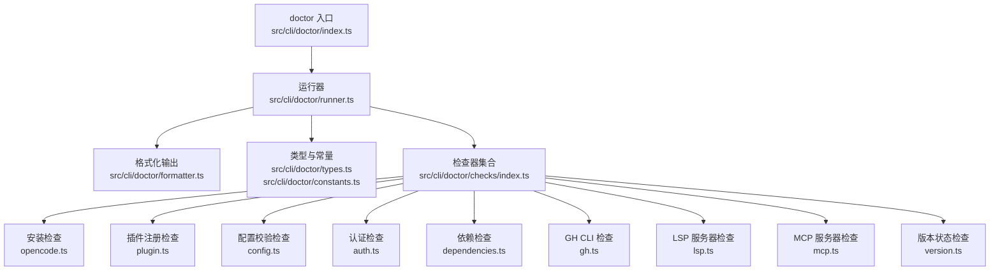
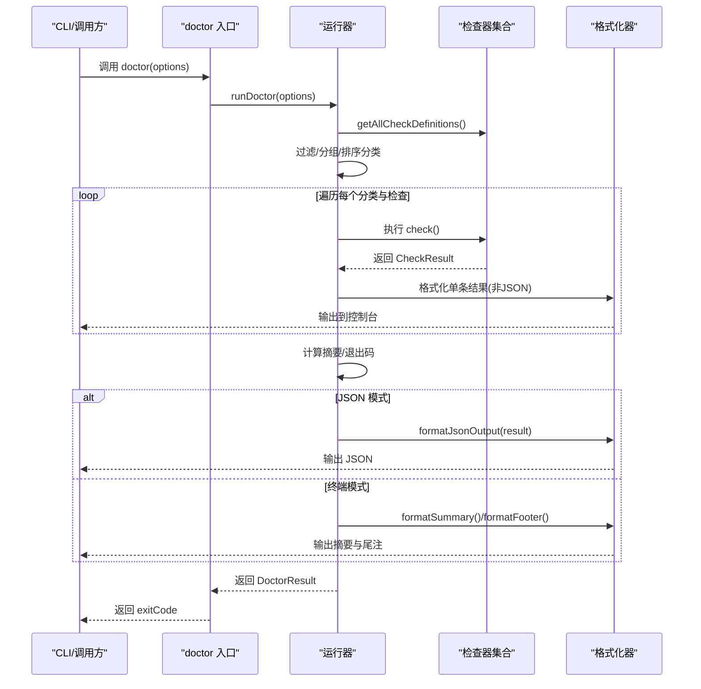
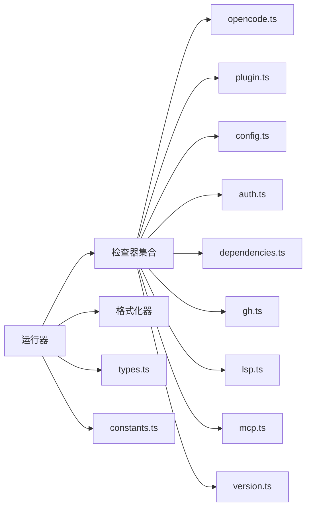
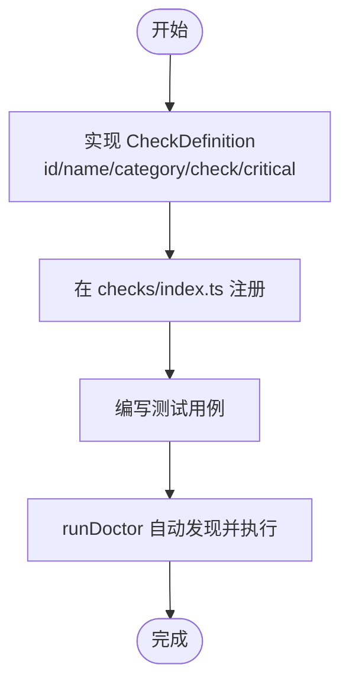

# 诊断工具使用

<cite>
**本文引用的文件**
- [src/cli/doctor/index.ts](file://src/cli/doctor/index.ts)
- [src/cli/doctor/runner.ts](file://src/cli/doctor/runner.ts)
- [src/cli/doctor/formatter.ts](file://src/cli/doctor/formatter.ts)
- [src/cli/doctor/types.ts](file://src/cli/doctor/types.ts)
- [src/cli/doctor/constants.ts](file://src/cli/doctor/constants.ts)
- [src/cli/doctor/checks/index.ts](file://src/cli/doctor/checks/index.ts)
- [src/cli/doctor/checks/opencode.ts](file://src/cli/doctor/checks/opencode.ts)
- [src/cli/doctor/checks/plugin.ts](file://src/cli/doctor/checks/plugin.ts)
- [src/cli/doctor/checks/config.ts](file://src/cli/doctor/checks/config.ts)
- [src/cli/doctor/checks/auth.ts](file://src/cli/doctor/checks/auth.ts)
- [src/cli/doctor/checks/dependencies.ts](file://src/cli/doctor/checks/dependencies.ts)
- [src/cli/doctor/checks/gh.ts](file://src/cli/doctor/checks/gh.ts)
- [src/cli/doctor/checks/lsp.ts](file://src/cli/doctor/checks/lsp.ts)
- [src/cli/doctor/checks/mcp.ts](file://src/cli/doctor/checks/mcp.ts)
- [src/cli/doctor/checks/version.ts](file://src/cli/doctor/checks/version.ts)
</cite>

## 目录
1. [简介](#简介)
2. [项目结构](#项目结构)
3. [核心组件](#核心组件)
4. [架构总览](#架构总览)
5. [详细组件分析](#详细组件分析)
6. [依赖关系分析](#依赖关系分析)
7. [性能与可扩展性](#性能与可扩展性)
8. [使用指南与最佳实践](#使用指南与最佳实践)
9. [诊断报告解读与改进建议](#诊断报告解读与改进建议)
10. [自定义检查器与扩展](#自定义检查器与扩展)
11. [故障排查](#故障排查)
12. [结论](#结论)

## 简介
本指南面向 Oh My OpenCode 的诊断工具（doctor 命令），帮助你快速理解其功能、使用方式、各检查项的含义与判断标准，并提供报告解读、改进建议、扩展方法以及批量与自动化检查的配置思路。通过 doctor 命令，你可以系统地检查安装、配置、认证、依赖、工具链、服务器与版本状态等关键环节，确保开发环境健康稳定。

## 项目结构
doctor 子系统由“入口函数”“运行器”“格式化输出”“类型与常量”“检查器集合”及“具体检查器”组成，采用模块化设计，便于扩展与维护。

图表来源
- [src/cli/doctor/index.ts](file://src/cli/doctor/index.ts#L1-L12)
- [src/cli/doctor/runner.ts](file://src/cli/doctor/runner.ts#L1-L133)
- [src/cli/doctor/formatter.ts](file://src/cli/doctor/formatter.ts#L1-L141)
- [src/cli/doctor/types.ts](file://src/cli/doctor/types.ts#L1-L114)
- [src/cli/doctor/constants.ts](file://src/cli/doctor/constants.ts#L1-L73)
- [src/cli/doctor/checks/index.ts](file://src/cli/doctor/checks/index.ts#L1-L35)

章节来源
- [src/cli/doctor/index.ts](file://src/cli/doctor/index.ts#L1-L12)
- [src/cli/doctor/runner.ts](file://src/cli/doctor/runner.ts#L83-L132)
- [src/cli/doctor/checks/index.ts](file://src/cli/doctor/checks/index.ts#L22-L34)

## 核心组件
- doctor 入口：导出 doctor(options) 主函数与 runDoctor、formatJsonOutput 工具，供 CLI 或内部调用。
- 运行器：负责加载检查器、按类别顺序执行、统计摘要、决定退出码、控制输出格式。
- 格式化器：负责终端彩色输出、JSON 输出、摘要与帮助建议提取。
- 类型与常量：统一检查结果、检查定义、分类、退出码、符号与名称映射等。
- 检查器集合：聚合所有检查器，支持按分类过滤与分组展示。

章节来源
- [src/cli/doctor/index.ts](file://src/cli/doctor/index.ts#L4-L11)
- [src/cli/doctor/runner.ts](file://src/cli/doctor/runner.ts#L20-L132)
- [src/cli/doctor/formatter.ts](file://src/cli/doctor/formatter.ts#L18-L88)
- [src/cli/doctor/types.ts](file://src/cli/doctor/types.ts#L1-L48)
- [src/cli/doctor/constants.ts](file://src/cli/doctor/constants.ts#L20-L73)
- [src/cli/doctor/checks/index.ts](file://src/cli/doctor/checks/index.ts#L22-L34)

## 架构总览
doctor 的执行流程如下：

图表来源
- [src/cli/doctor/index.ts](file://src/cli/doctor/index.ts#L4-L6)
- [src/cli/doctor/runner.ts](file://src/cli/doctor/runner.ts#L83-L132)
- [src/cli/doctor/formatter.ts](file://src/cli/doctor/formatter.ts#L82-L88)
- [src/cli/doctor/checks/index.ts](file://src/cli/doctor/checks/index.ts#L22-L34)

## 详细组件分析

### doctor 入口与运行器
- doctor(options)：封装 runDoctor 并返回退出码，便于外部集成。
- runDoctor：
  - 加载全部检查器定义，按类别过滤与分组。
  - 逐个执行检查，记录耗时与结果。
  - 计算摘要（总数、通过、失败、警告、跳过）与退出码（存在 fail 即失败）。
  - 支持 JSON 输出与人类可读输出两种模式。
- runCheck：包装单个检查，捕获异常并统一返回失败结果，同时记录耗时。
- 分类顺序固定，保证输出稳定性。

章节来源
- [src/cli/doctor/index.ts](file://src/cli/doctor/index.ts#L4-L11)
- [src/cli/doctor/runner.ts](file://src/cli/doctor/runner.ts#L20-L132)

### 格式化器
- 终端输出：彩色状态符号、缩进细节、摘要框、帮助建议提取。
- JSON 输出：序列化 DoctorResult，便于自动化处理。
- 辅助函数：strip ANSI、绘制边框盒、进度提示等。

章节来源
- [src/cli/doctor/formatter.ts](file://src/cli/doctor/formatter.ts#L5-L141)

### 类型与常量
- CheckResult/CheckDefinition：检查结果与定义，含 id、name、category、check 函数与可选 critical 字段。
- DoctorOptions/DoctorResult/DoctorSummary：运行选项、最终结果与摘要。
- CheckCategory：installation、configuration、authentication、dependencies、tools、updates。
- 符号与颜色映射、检查 ID 与名称映射、退出码、最小版本与二进制名等常量。

章节来源
- [src/cli/doctor/types.ts](file://src/cli/doctor/types.ts#L1-L114)
- [src/cli/doctor/constants.ts](file://src/cli/doctor/constants.ts#L1-L73)

### 安装检查（OpenCode）
- 功能：检测 opencode 或 opencode-desktop 是否安装、路径、版本是否满足最低要求。
- 判断标准：
  - 未安装：fail，提示安装与访问链接。
  - 版本低于最低要求：warn，提示升级命令。
  - 正常：pass，显示版本与路径。
- 关键点：Windows 下对可执行后缀进行选择；支持 PowerShell 脚本版本查询。

章节来源
- [src/cli/doctor/checks/opencode.ts](file://src/cli/doctor/checks/opencode.ts#L55-L168)
- [src/cli/doctor/constants.ts](file://src/cli/doctor/constants.ts#L68-L73)

### 插件注册检查
- 功能：检测 OpenCode 配置中是否已注册本包作为插件，支持是否被 pin 的版本信息。
- 判断标准：
  - 无配置文件：fail，提示安装命令与期望路径。
  - 未注册：fail，提示安装命令与配置路径。
  - 已注册：pass，显示配置路径与是否被 pin。
- 关键点：通过共享工具解析配置文件，定位正确配置路径。

章节来源
- [src/cli/doctor/checks/plugin.ts](file://src/cli/doctor/checks/plugin.ts#L76-L114)

### 配置校验检查
- 功能：查找项目或用户级配置文件，使用 Schema 校验有效性。
- 判断标准：
  - 未找到配置：pass（可选），提示默认配置。
  - 校验失败：fail，列出错误项与字段路径。
  - 校验通过：pass，显示格式与路径。
- 关键点：优先项目配置，其次用户配置；使用内置 Schema 进行安全校验。

章节来源
- [src/cli/doctor/checks/config.ts](file://src/cli/doctor/checks/config.ts#L83-L123)

### 认证检查（多 Provider）
- 功能：检测 Anthropic/OpenAI/Google 认证插件是否存在与可用。
- 判断标准：
  - 插件未安装：skip，提示安装命令与插件名。
  - 插件已安装：pass，提示登录或后续步骤。
- 关键点：Anthropic 使用内置插件，其他 Provider 使用外部插件；从 OpenCode 配置读取插件列表。

章节来源
- [src/cli/doctor/checks/auth.ts](file://src/cli/doctor/checks/auth.ts#L50-L115)

### 依赖检查
- 功能：检测 AST-Grep CLI/NAPI、Comment Checker 等可选依赖是否存在与版本。
- 判断标准：
  - 未安装：warn，提供安装建议（可选依赖）。
  - 安装成功：pass，显示版本与路径。
- 关键点：AST-Grep CLI 支持 sg 与 ast-grep 两种别名；NAPI 不存在时可回退 CLI。

章节来源
- [src/cli/doctor/checks/dependencies.ts](file://src/cli/doctor/checks/dependencies.ts#L32-L163)

### GitHub CLI 检查
- 功能：检测 gh 是否安装、版本、认证状态与账号、权限范围。
- 判断标准：
  - 未安装：warn，提示安装与用途。
  - 未认证：warn，提示认证命令与错误信息。
  - 认证通过：pass，显示版本、账号与权限范围。
- 关键点：并发获取版本与认证状态；忽略更新通知以避免干扰。

章节来源
- [src/cli/doctor/checks/gh.ts](file://src/cli/doctor/checks/gh.ts#L121-L171)

### LSP 服务器检查
- 功能：检测常见语言 LSP（TypeScript、Pyright、Rust Analyzer、gopls）是否安装。
- 判断标准：
  - 全部未安装：warn，提示工具受限与缺失项。
  - 部分安装：pass，列出已安装与缺失项。
- 关键点：基于工具侧配置判断安装情况。

章节来源
- [src/cli/doctor/checks/lsp.ts](file://src/cli/doctor/checks/lsp.ts#L38-L77)

### MCP 服务器检查
- 功能：检测内置与用户自定义 MCP 服务器配置。
- 判断标准：
  - 无用户配置：skip，提示可选配置。
  - 配置无效：warn，列出有效与无效项。
  - 配置有效：pass，列出已配置项。
- 关键点：内置服务器默认启用；用户配置来自多个可能位置的 JSON 文件。

章节来源
- [src/cli/doctor/checks/mcp.ts](file://src/cli/doctor/checks/mcp.ts#L67-L128)

### 版本状态检查
- 功能：判断当前运行模式（本地开发、被 pin、网络拉取最新版本）与是否需要更新。
- 判断标准：
  - 本地开发：pass，说明使用文件协议。
  - 被 pin：pass，跳过更新检查。
  - 无法确定当前版本：warn，提示获取本地版本。
  - 网络异常：warn，提示网络问题。
  - 有新版本：warn，提示更新命令。
  - 最新：pass，显示当前与最新版本。
- 关键点：结合自动更新钩子逻辑，支持频道提取与缓存版本。

章节来源
- [src/cli/doctor/checks/version.ts](file://src/cli/doctor/checks/version.ts#L71-L135)

## 依赖关系分析
- 运行器依赖检查器集合与格式化器；检查器之间相互独立，仅依赖共享工具与常量。
- 分类顺序在运行器内硬编码，确保输出一致性。
- 退出码策略简单明确：只要存在 fail，整体即失败。

图表来源
- [src/cli/doctor/runner.ts](file://src/cli/doctor/runner.ts#L83-L132)
- [src/cli/doctor/checks/index.ts](file://src/cli/doctor/checks/index.ts#L22-L34)
- [src/cli/doctor/types.ts](file://src/cli/doctor/types.ts#L1-L48)
- [src/cli/doctor/constants.ts](file://src/cli/doctor/constants.ts#L1-L73)

章节来源
- [src/cli/doctor/runner.ts](file://src/cli/doctor/runner.ts#L74-L81)
- [src/cli/doctor/checks/index.ts](file://src/cli/doctor/checks/index.ts#L22-L34)

## 性能与可扩展性
- 并发执行：部分检查（如 gh 的版本与认证）已使用并发，减少等待时间。
- 耗时统计：每个检查记录 duration，便于定位慢检查。
- 可扩展性：新增检查器只需实现 CheckDefinition 并加入集合，即可自动参与分类展示与退出码计算。
- 输出模式：支持 JSON 输出，便于 CI/CD 自动化消费。

章节来源
- [src/cli/doctor/runner.ts](file://src/cli/doctor/runner.ts#L103-L110)
- [src/cli/doctor/checks/gh.ts](file://src/cli/doctor/checks/gh.ts#L108-L108)
- [src/cli/doctor/checks/index.ts](file://src/cli/doctor/checks/index.ts#L22-L34)

## 使用指南与最佳实践

### 基本用法
- 在项目根目录或 OpenCode 配置目录下运行 doctor 命令，查看各分类检查结果。
- 常用参数：
  - --verbose：显示详细信息（如路径、权限范围等）。
  - --json：输出 JSON 结果，便于自动化处理。
  - --category：仅运行指定分类（installation、configuration、authentication、dependencies、tools、updates）。

章节来源
- [src/cli/doctor/types.ts](file://src/cli/doctor/types.ts#L29-L33)
- [src/cli/doctor/runner.ts](file://src/cli/doctor/runner.ts#L83-L132)

### 常见场景与建议
- 安装与插件注册失败：先执行安装命令，再确认配置中已注册插件。
- 认证插件未安装：根据提示安装对应 Provider 插件并完成登录。
- 依赖缺失：按提示安装可选工具，提升特定能力（如 AST-Grep、Comment Checker）。
- GH CLI 未认证：执行认证命令，确保权限范围满足需求。
- LSP 服务器缺失：安装常用语言 LSP，提升编辑体验。
- MCP 用户配置无效：修正 .mcp.json 格式或移除无效项。
- 版本陈旧：按提示更新至最新版本或解除 pin。

章节来源
- [src/cli/doctor/checks/opencode.ts](file://src/cli/doctor/checks/opencode.ts#L134-L168)
- [src/cli/doctor/checks/plugin.ts](file://src/cli/doctor/checks/plugin.ts#L76-L114)
- [src/cli/doctor/checks/auth.ts](file://src/cli/doctor/checks/auth.ts#L50-L89)
- [src/cli/doctor/checks/dependencies.ts](file://src/cli/doctor/checks/dependencies.ts#L124-L137)
- [src/cli/doctor/checks/gh.ts](file://src/cli/doctor/checks/gh.ts#L121-L161)
- [src/cli/doctor/checks/lsp.ts](file://src/cli/doctor/checks/lsp.ts#L38-L67)
- [src/cli/doctor/checks/mcp.ts](file://src/cli/doctor/checks/mcp.ts#L78-L109)
- [src/cli/doctor/checks/version.ts](file://src/cli/doctor/checks/version.ts#L71-L125)

### 批量诊断与自动化
- 在 CI 中使用 --json 参数，解析 DoctorResult，统计失败数与详情。
- 结合 --category 限定范围，分阶段扫描（如先安装与配置，再工具与依赖）。
- 将 doctor 作为预提交钩子或构建前置步骤，确保环境一致。

章节来源
- [src/cli/doctor/runner.ts](file://src/cli/doctor/runner.ts#L123-L129)
- [src/cli/doctor/types.ts](file://src/cli/doctor/types.ts#L29-L33)

## 诊断报告解读与改进建议

### 报告结构
- results：每条检查的结果数组，包含 name、status、message、details、duration。
- summary：包含 total、passed、failed、warnings、skipped、duration。
- exitCode：0 表示全部通过，1 表示存在失败。

章节来源
- [src/cli/doctor/types.ts](file://src/cli/doctor/types.ts#L44-L48)
- [src/cli/doctor/runner.ts](file://src/cli/doctor/runner.ts#L117-L121)

### 状态含义与判断标准
- pass：检查通过，通常表示环境健康。
- warn：存在风险但不影响运行，需关注并按建议修复。
- fail：关键问题导致功能不可用，必须立即处理。
- skip：条件不满足而跳过（如无用户配置），通常为可选项。

章节来源
- [src/cli/doctor/types.ts](file://src/cli/doctor/types.ts#L1-L9)
- [src/cli/doctor/constants.ts](file://src/cli/doctor/constants.ts#L63-L66)

### 常见问题与改进建议
- 多个 fail：优先解决 fail 项，再处理 warn 项。
- 大量 skip：检查是否遗漏必要配置或安装。
- 重复 warn：集中处理同一类问题（如认证、依赖、版本）。
- JSON 输出用于自动化：在 CI 中统计 summary.failed 与 summary.warnings，决定是否阻断流水线。

章节来源
- [src/cli/doctor/runner.ts](file://src/cli/doctor/runner.ts#L47-L50)
- [src/cli/doctor/formatter.ts](file://src/cli/doctor/formatter.ts#L126-L140)

## 自定义检查器与扩展

### 新增检查器步骤
- 实现 CheckDefinition：
  - id：唯一标识符（参考 constants 中 CHECK_IDS）。
  - name：显示名称（参考 CHECK_NAMES）。
  - category：所属分类（installation/configuration/authentication/dependencies/tools/updates）。
  - check：异步函数，返回 CheckResult。
  - critical：是否影响整体退出码（一般设为 false，除非是致命问题）。
- 将检查器加入集合：
  - 在 checks/index.ts 的 getAllCheckDefinitions 中添加你的检查器定义。
- 导出工具函数（可选）：如 info 获取、辅助判断等，保持与现有风格一致。

图表来源
- [src/cli/doctor/checks/index.ts](file://src/cli/doctor/checks/index.ts#L22-L34)
- [src/cli/doctor/types.ts](file://src/cli/doctor/types.ts#L21-L27)

章节来源
- [src/cli/doctor/checks/index.ts](file://src/cli/doctor/checks/index.ts#L22-L34)
- [src/cli/doctor/types.ts](file://src/cli/doctor/types.ts#L21-L27)

### 示例：新增一个“可选依赖”检查
- 参考 dependencies.ts 的实现风格，使用 which/where 查询二进制，通过 --version 获取版本。
- 对于不存在的情况，返回 warn 并提供安装建议。
- 在 checks/index.ts 中注册，确保被自动纳入分类与汇总。

章节来源
- [src/cli/doctor/checks/dependencies.ts](file://src/cli/doctor/checks/dependencies.ts#L124-L137)

## 故障排查
- doctor 无法识别某些二进制：
  - 确认 PATH 包含二进制所在目录。
  - Windows 下注意可执行后缀差异，工具已做兼容处理。
- 认证检查总是 skip：
  - 检查 OpenCode 配置中是否已安装对应 Provider 插件。
- GH CLI 未认证：
  - 执行认证命令，确认网络与权限范围。
- LSP 服务器缺失：
  - 安装对应语言 LSP，确保二进制可执行且在 PATH 中。
- MCP 用户配置无效：
  - 检查 .mcp.json 格式，确保为对象且键值合法。
- 版本检查异常：
  - 确认网络连通性；若处于本地开发或被 pin，行为符合预期。

章节来源
- [src/cli/doctor/checks/opencode.ts](file://src/cli/doctor/checks/opencode.ts#L55-L74)
- [src/cli/doctor/checks/auth.ts](file://src/cli/doctor/checks/auth.ts#L50-L77)
- [src/cli/doctor/checks/gh.ts](file://src/cli/doctor/checks/gh.ts#L121-L161)
- [src/cli/doctor/checks/lsp.ts](file://src/cli/doctor/checks/lsp.ts#L38-L67)
- [src/cli/doctor/checks/mcp.ts](file://src/cli/doctor/checks/mcp.ts#L78-L109)
- [src/cli/doctor/checks/version.ts](file://src/cli/doctor/checks/version.ts#L71-L125)

## 结论
doctor 命令提供了系统化的环境诊断能力，覆盖安装、配置、认证、依赖、工具链、服务器与版本等多个维度。通过清晰的状态与详细输出，你可以快速定位问题并采取针对性改进措施。借助 JSON 输出与分类过滤，doctor 亦可无缝融入自动化与持续集成流程，保障团队开发环境的一致性与可靠性。