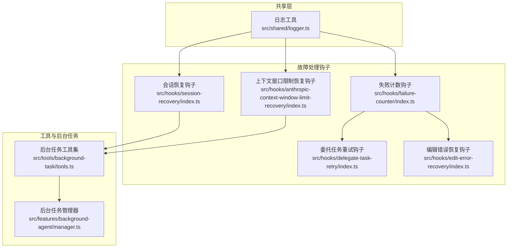
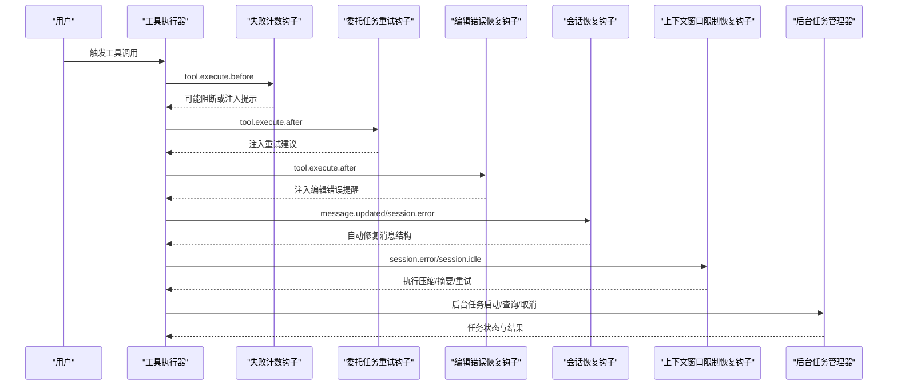
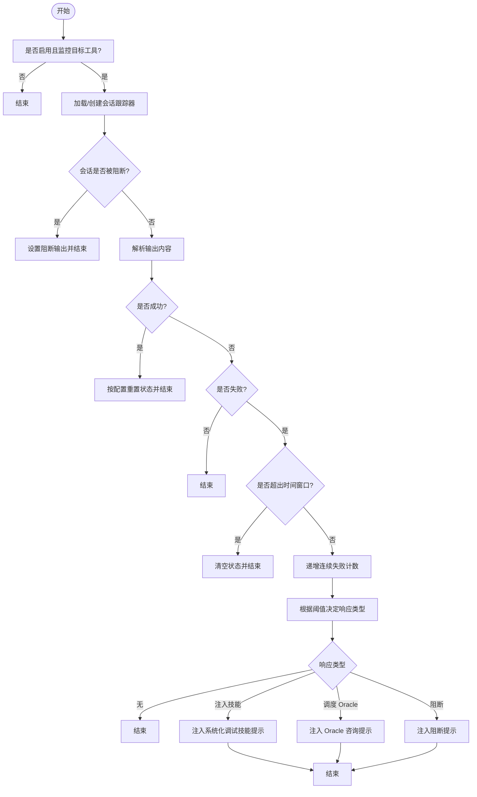
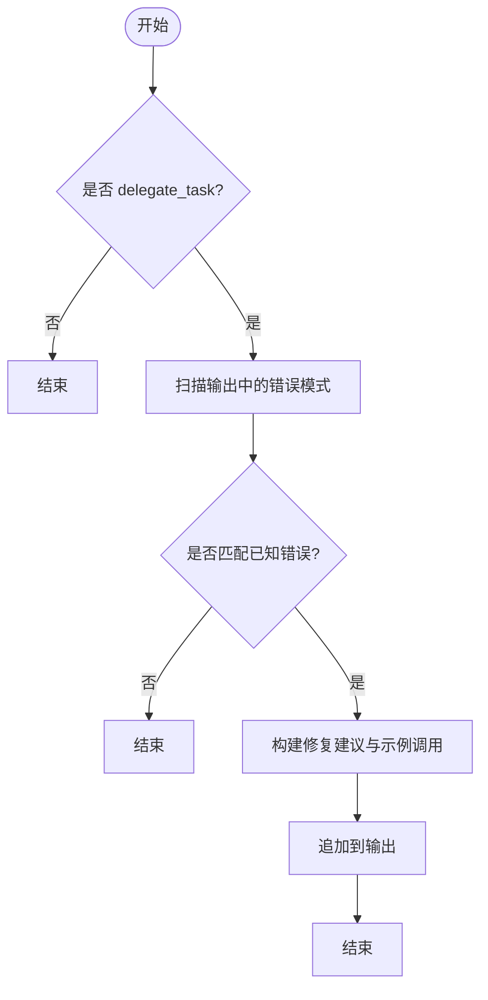
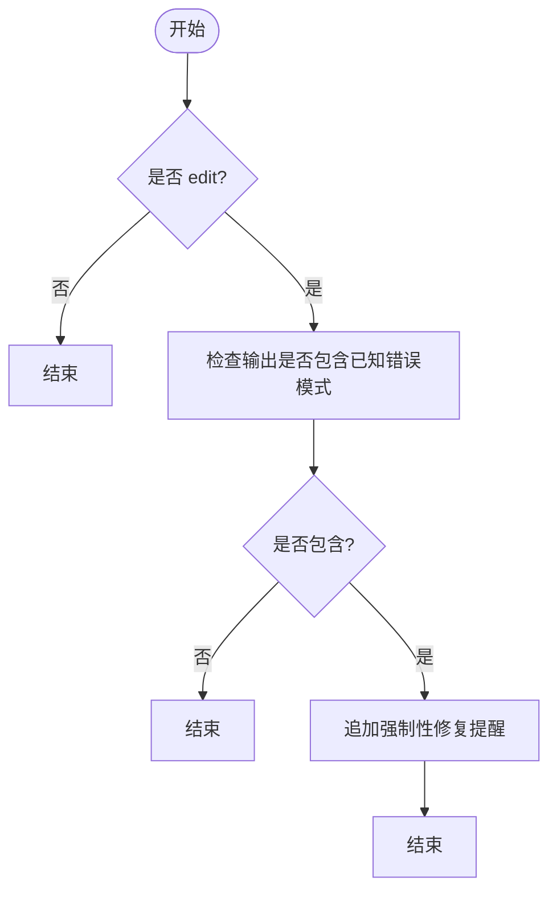
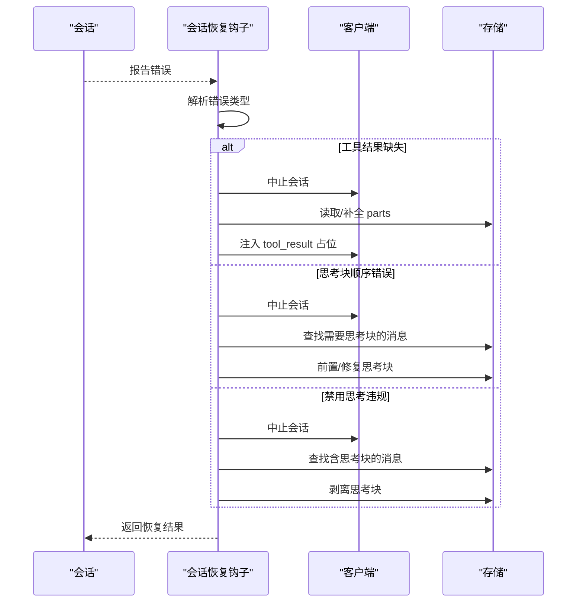
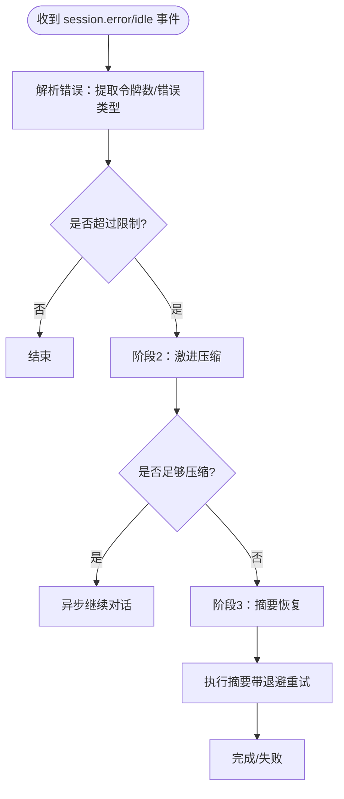
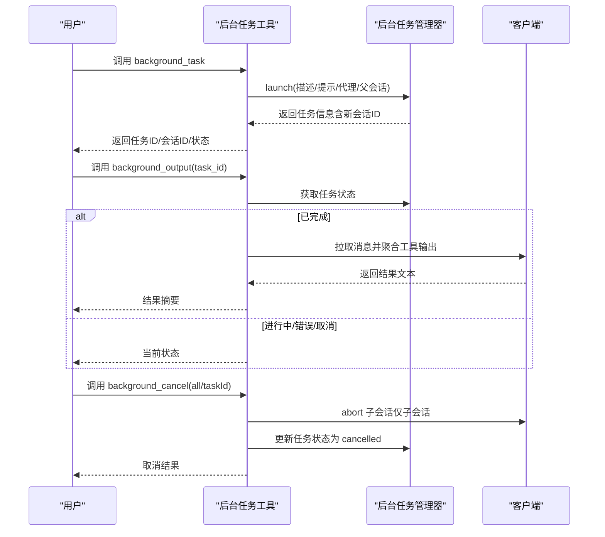
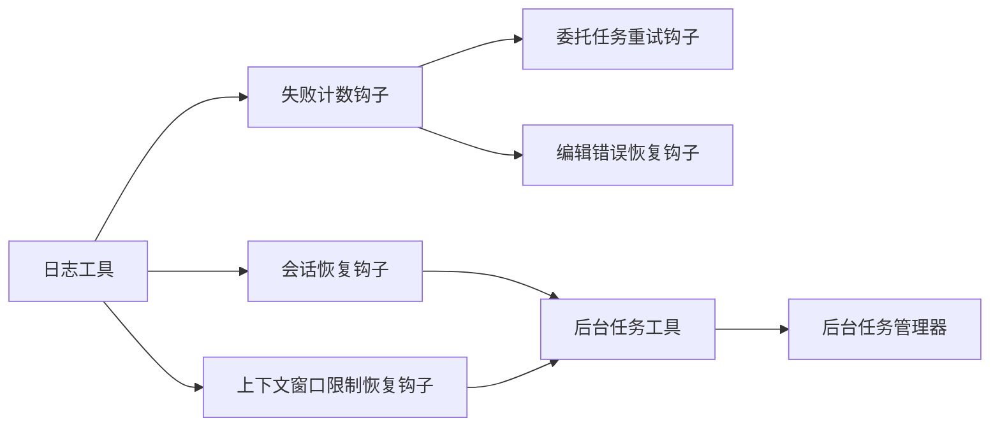

# 运行时故障处理

<cite>
**本文引用的文件**
- [src/shared/logger.ts](file://src/shared/logger.ts)
- [src/hooks/failure-counter/index.ts](file://src/hooks/failure-counter/index.ts)
- [src/hooks/delegate-task-retry/index.ts](file://src/hooks/delegate-task-retry/index.ts)
- [src/hooks/edit-error-recovery/index.ts](file://src/hooks/edit-error-recovery/index.ts)
- [src/hooks/session-recovery/index.ts](file://src/hooks/session-recovery/index.ts)
- [src/hooks/anthropic-context-window-limit-recovery/index.ts](file://src/hooks/anthropic-context-window-limit-recovery/index.ts)
- [src/hooks/anthropic-context-window-limit-recovery/parser.ts](file://src/hooks/anthropic-context-window-limit-recovery/parser.ts)
- [src/hooks/anthropic-context-window-limit-recovery/executor.ts](file://src/hooks/anthropic-context-window-limit-recovery/executor.ts)
- [src/tools/background-task/tools.ts](file://src/tools/background-task/tools.ts)
- [src/features/background-agent/manager.ts](file://src/features/background-agent/manager.ts)
</cite>

## 目录
1. [简介](#简介)
2. [项目结构](#项目结构)
3. [核心组件](#核心组件)
4. [架构总览](#架构总览)
5. [详细组件分析](#详细组件分析)
6. [依赖关系分析](#依赖关系分析)
7. [性能考量](#性能考量)
8. [故障排查指南](#故障排查指南)
9. [结论](#结论)
10. [附录](#附录)

## 简介
本指南聚焦 Oh My OpenCode 在运行时可能遇到的各类故障，包括但不限于：
- 代理执行失败与连续失败阈值触发
- 工具调用异常与参数错误的即时修复建议
- 编辑类工具错误的自动提醒与纠正
- 会话中断与消息结构异常的自动恢复
- 上下文窗口超限导致的自动压缩与恢复
- 后台任务生命周期管理与取消

文档提供实时监控与错误追踪方法、会话恢复机制与故障转移策略、日志分析技巧与错误信息解读，并给出系统性的定位流程与预防措施。

## 项目结构
围绕“运行时故障处理”的关键模块分布如下：
- 共享日志：统一输出运行时日志，便于追踪
- 失败计数钩子：对特定工具的连续失败进行分级响应（注入技能、调度 Oracle、阻断）
- 工具错误修复钩子：针对 delegate_task 与 edit 工具的常见错误模式提供即时修复建议
- 会话恢复钩子：检测并自动修复工具结果缺失、思考块顺序错误、禁用思考违规等
- 上下文窗口限制恢复：解析令牌超限错误并执行分段压缩与摘要恢复
- 后台任务工具与管理器：后台任务生命周期管理、通知与取消

图表来源
- [src/shared/logger.ts](file://src/shared/logger.ts#L1-L21)
- [src/hooks/failure-counter/index.ts](file://src/hooks/failure-counter/index.ts#L1-L338)
- [src/hooks/delegate-task-retry/index.ts](file://src/hooks/delegate-task-retry/index.ts#L1-L137)
- [src/hooks/edit-error-recovery/index.ts](file://src/hooks/edit-error-recovery/index.ts#L1-L58)
- [src/hooks/session-recovery/index.ts](file://src/hooks/session-recovery/index.ts#L1-L433)
- [src/hooks/anthropic-context-window-limit-recovery/index.ts](file://src/hooks/anthropic-context-window-limit-recovery/index.ts#L1-L152)
- [src/tools/background-task/tools.ts](file://src/tools/background-task/tools.ts#L1-L439)
- [src/features/background-agent/manager.ts](file://src/features/background-agent/manager.ts#L198-L773)

章节来源
- [src/shared/logger.ts](file://src/shared/logger.ts#L1-L21)
- [src/hooks/failure-counter/index.ts](file://src/hooks/failure-counter/index.ts#L1-L338)
- [src/hooks/delegate-task-retry/index.ts](file://src/hooks/delegate-task-retry/index.ts#L1-L137)
- [src/hooks/edit-error-recovery/index.ts](file://src/hooks/edit-error-recovery/index.ts#L1-L58)
- [src/hooks/session-recovery/index.ts](file://src/hooks/session-recovery/index.ts#L1-L433)
- [src/hooks/anthropic-context-window-limit-recovery/index.ts](file://src/hooks/anthropic-context-window-limit-recovery/index.ts#L1-L152)
- [src/tools/background-task/tools.ts](file://src/tools/background-task/tools.ts#L1-L439)
- [src/features/background-agent/manager.ts](file://src/features/background-agent/manager.ts#L198-L773)

## 核心组件
- 日志工具：统一写入临时目录下的日志文件，便于定位问题
- 失败计数钩子：对 sisyphus_task 等工具的连续失败进行阈值控制与自动干预
- 委托任务重试钩子：检测 delegate_task 的典型错误并生成即时修复建议
- 编辑错误恢复钩子：对 edit 工具的常见错误注入强制性提醒
- 会话恢复钩子：检测并自动修复多种消息结构异常，必要时可自动续会话
- 上下文窗口限制恢复：解析令牌超限错误并执行压缩、摘要与重试
- 后台任务工具与管理器：提供后台任务的启动、查询、取消与通知

章节来源
- [src/shared/logger.ts](file://src/shared/logger.ts#L1-L21)
- [src/hooks/failure-counter/index.ts](file://src/hooks/failure-counter/index.ts#L1-L338)
- [src/hooks/delegate-task-retry/index.ts](file://src/hooks/delegate-task-retry/index.ts#L1-L137)
- [src/hooks/edit-error-recovery/index.ts](file://src/hooks/edit-error-recovery/index.ts#L1-L58)
- [src/hooks/session-recovery/index.ts](file://src/hooks/session-recovery/index.ts#L1-L433)
- [src/hooks/anthropic-context-window-limit-recovery/index.ts](file://src/hooks/anthropic-context-window-limit-recovery/index.ts#L1-L152)
- [src/tools/background-task/tools.ts](file://src/tools/background-task/tools.ts#L1-L439)
- [src/features/background-agent/manager.ts](file://src/features/background-agent/manager.ts#L198-L773)

## 架构总览
运行时故障处理通过“事件/钩子 + 工具 + 管理器”的组合实现：
- 事件/钩子：在工具执行前后或会话事件发生时介入，进行检测、修正与自动响应
- 工具：提供具体能力（如后台任务、压缩、摘要）
- 管理器：协调后台任务生命周期与并发控制，保障稳定性

图表来源
- [src/hooks/failure-counter/index.ts](file://src/hooks/failure-counter/index.ts#L124-L284)
- [src/hooks/delegate-task-retry/index.ts](file://src/hooks/delegate-task-retry/index.ts#L121-L136)
- [src/hooks/edit-error-recovery/index.ts](file://src/hooks/edit-error-recovery/index.ts#L39-L57)
- [src/hooks/session-recovery/index.ts](file://src/hooks/session-recovery/index.ts#L339-L424)
- [src/hooks/anthropic-context-window-limit-recovery/index.ts](file://src/hooks/anthropic-context-window-limit-recovery/index.ts#L27-L141)
- [src/tools/background-task/tools.ts](file://src/tools/background-task/tools.ts#L51-L118)
- [src/features/background-agent/manager.ts](file://src/features/background-agent/manager.ts#L198-L217)

## 详细组件分析

### 失败计数钩子（Failure Counter）
- 功能要点
  - 监控指定工具的执行结果，统计连续失败次数
  - 达到阈值后自动采取行动：注入系统化调试技能、调度 Oracle、阻断后续调用
  - 支持用户通过命令重置失败计数
- 关键行为
  - PreToolUse：若会话被阻断则直接阻止工具执行
  - PostToolUse：根据输出内容判断成功/失败，更新计数并决定响应
  - UserPromptSubmit：处理重置命令，清理状态

图表来源
- [src/hooks/failure-counter/index.ts](file://src/hooks/failure-counter/index.ts#L124-L284)

章节来源
- [src/hooks/failure-counter/index.ts](file://src/hooks/failure-counter/index.ts#L1-L338)

### 委托任务重试钩子（Delegate Task Retry）
- 功能要点
  - 检测 delegate_task 的典型错误模式（如缺少参数、互斥参数、未知 agent 等）
  - 自动生成即时修复建议与示例调用
- 关键行为
  - 在工具执行后扫描输出，命中错误模式即追加修复指引

图表来源
- [src/hooks/delegate-task-retry/index.ts](file://src/hooks/delegate-task-retry/index.ts#L121-L136)

章节来源
- [src/hooks/delegate-task-retry/index.ts](file://src/hooks/delegate-task-retry/index.ts#L1-L137)

### 编辑错误恢复钩子（Edit Error Recovery）
- 功能要点
  - 检测 edit 工具的常见错误（如旧内容与新内容相同、找不到旧内容、多处匹配）
  - 注入强制性提醒，要求立即读取真实文件状态并修正
- 关键行为
  - 在工具执行后扫描输出，命中错误即追加提醒

图表来源
- [src/hooks/edit-error-recovery/index.ts](file://src/hooks/edit-error-recovery/index.ts#L39-L57)

章节来源
- [src/hooks/edit-error-recovery/index.ts](file://src/hooks/edit-error-recovery/index.ts#L1-L58)

### 会话恢复钩子（Session Recovery）
- 功能要点
  - 检测并自动修复三类错误：
    - 工具结果缺失：注入“用户取消”等占位结果
    - 思考块顺序错误：前置思考块或移除孤儿思考
    - 禁用思考违规：剥离思考块
  - 可选自动续会话（实验性）
- 关键行为
  - 监听会话错误事件，解析错误类型并执行对应恢复函数
  - 提供回调以通知外部（如 UI）

图表来源
- [src/hooks/session-recovery/index.ts](file://src/hooks/session-recovery/index.ts#L339-L424)

章节来源
- [src/hooks/session-recovery/index.ts](file://src/hooks/session-recovery/index.ts#L1-L433)

### 上下文窗口限制恢复（Anthropic Context Window Limit）
- 功能要点
  - 解析令牌超限错误，区分不同错误类型
  - 执行激进压缩（截断大工具输出）与摘要（summarize）恢复
  - 支持多次重试与退避策略
- 组件关系
  - 解析器：从字符串/对象中提取当前/最大令牌数与错误类型
  - 执行器：协调压缩、摘要、重试与 UI 提示
  - 钩子：监听会话事件并触发恢复流程

图表来源
- [src/hooks/anthropic-context-window-limit-recovery/parser.ts](file://src/hooks/anthropic-context-window-limit-recovery/parser.ts#L76-L201)
- [src/hooks/anthropic-context-window-limit-recovery/executor.ts](file://src/hooks/anthropic-context-window-limit-recovery/executor.ts#L258-L485)
- [src/hooks/anthropic-context-window-limit-recovery/index.ts](file://src/hooks/anthropic-context-window-limit-recovery/index.ts#L27-L141)

章节来源
- [src/hooks/anthropic-context-window-limit-recovery/parser.ts](file://src/hooks/anthropic-context-window-limit-recovery/parser.ts#L1-L202)
- [src/hooks/anthropic-context-window-limit-recovery/executor.ts](file://src/hooks/anthropic-context-window-limit-recovery/executor.ts#L1-L486)
- [src/hooks/anthropic-context-window-limit-recovery/index.ts](file://src/hooks/anthropic-context-window-limit-recovery/index.ts#L1-L152)

### 后台任务工具与管理器
- 功能要点
  - 后台任务工具：启动、查询、取消后台任务；支持元数据回传与进度展示
  - 后台任务管理器：维护任务生命周期、并发控制、进程信号清理、通知父会话
- 关键行为
  - 启动：解析父会话/模型/代理，创建任务并返回会话 ID
  - 查询：格式化状态与最新消息，聚合工具输出
  - 取消：支持单个或全部取消，避免误伤主会话

图表来源
- [src/tools/background-task/tools.ts](file://src/tools/background-task/tools.ts#L51-L118)
- [src/tools/background-task/tools.ts](file://src/tools/background-task/tools.ts#L303-L367)
- [src/tools/background-task/tools.ts](file://src/tools/background-task/tools.ts#L369-L438)
- [src/features/background-agent/manager.ts](file://src/features/background-agent/manager.ts#L198-L217)
- [src/features/background-agent/manager.ts](file://src/features/background-agent/manager.ts#L736-L764)

章节来源
- [src/tools/background-task/tools.ts](file://src/tools/background-task/tools.ts#L1-L439)
- [src/features/background-agent/manager.ts](file://src/features/background-agent/manager.ts#L198-L773)

## 依赖关系分析
- 钩子之间存在协作关系：失败计数钩子可与委托任务/编辑错误钩子配合，形成“检测-提示-自动干预”的闭环
- 会话恢复与上下文窗口限制恢复分别处理“消息结构异常”和“令牌超限”，二者互补
- 后台任务工具与管理器为其他组件提供稳定的任务承载与生命周期保障

图表来源
- [src/hooks/failure-counter/index.ts](file://src/hooks/failure-counter/index.ts#L124-L284)
- [src/hooks/delegate-task-retry/index.ts](file://src/hooks/delegate-task-retry/index.ts#L121-L136)
- [src/hooks/edit-error-recovery/index.ts](file://src/hooks/edit-error-recovery/index.ts#L39-L57)
- [src/hooks/session-recovery/index.ts](file://src/hooks/session-recovery/index.ts#L339-L424)
- [src/hooks/anthropic-context-window-limit-recovery/index.ts](file://src/hooks/anthropic-context-window-limit-recovery/index.ts#L27-L141)
- [src/tools/background-task/tools.ts](file://src/tools/background-task/tools.ts#L51-L118)
- [src/features/background-agent/manager.ts](file://src/features/background-agent/manager.ts#L198-L217)
- [src/shared/logger.ts](file://src/shared/logger.ts#L1-L21)

章节来源
- [src/hooks/failure-counter/index.ts](file://src/hooks/failure-counter/index.ts#L1-L338)
- [src/hooks/delegate-task-retry/index.ts](file://src/hooks/delegate-task-retry/index.ts#L1-L137)
- [src/hooks/edit-error-recovery/index.ts](file://src/hooks/edit-error-recovery/index.ts#L1-L58)
- [src/hooks/session-recovery/index.ts](file://src/hooks/session-recovery/index.ts#L1-L433)
- [src/hooks/anthropic-context-window-limit-recovery/index.ts](file://src/hooks/anthropic-context-window-limit-recovery/index.ts#L1-L152)
- [src/tools/background-task/tools.ts](file://src/tools/background-task/tools.ts#L1-L439)
- [src/features/background-agent/manager.ts](file://src/features/background-agent/manager.ts#L198-L773)
- [src/shared/logger.ts](file://src/shared/logger.ts#L1-L21)

## 性能考量
- 激进压缩与摘要恢复采用指数退避与最大尝试次数控制，避免无限重试造成资源浪费
- 会话恢复与上下文恢复均带有去重与状态机保护，防止重复处理与竞态
- 后台任务管理器在通知失败时仍释放并发槽位，避免资源泄漏
- 日志写入采用追加方式，尽量降低 IO 干扰

## 故障排查指南

### 实时监控与错误追踪
- 日志位置：临时目录下的统一日志文件，便于跨组件关联
- 常见日志入口：
  - 失败计数钩子：在阻断、注入、调度等关键路径写入
  - 会话恢复钩子：在恢复前后写入状态与结果
  - 上下文恢复钩子：在解析、压缩、摘要、重试等阶段写入
- 建议：结合 UI Toast 与日志文件进行双轨追踪

章节来源
- [src/shared/logger.ts](file://src/shared/logger.ts#L1-L21)
- [src/hooks/failure-counter/index.ts](file://src/hooks/failure-counter/index.ts#L124-L284)
- [src/hooks/session-recovery/index.ts](file://src/hooks/session-recovery/index.ts#L339-L424)
- [src/hooks/anthropic-context-window-limit-recovery/index.ts](file://src/hooks/anthropic-context-window-limit-recovery/index.ts#L43-L94)

### 代理执行失败
- 现象：工具执行后输出显示失败模式
- 处理：
  - 若连续失败达到阈值，自动注入系统化调试技能或调度 Oracle
  - 用户可通过重置命令清除阻断状态并重新开始
- 预防：在任务描述中明确参数与前置条件，减少失败率

章节来源
- [src/hooks/failure-counter/index.ts](file://src/hooks/failure-counter/index.ts#L54-L102)
- [src/hooks/failure-counter/index.ts](file://src/hooks/failure-counter/index.ts#L289-L333)

### 工具调用异常
- 委托任务错误：根据错误模式自动生成修复建议与示例调用
- 编辑错误：立即注入强制性提醒，要求核对真实文件状态

章节来源
- [src/hooks/delegate-task-retry/index.ts](file://src/hooks/delegate-task-retry/index.ts#L62-L119)
- [src/hooks/edit-error-recovery/index.ts](file://src/hooks/edit-error-recovery/index.ts#L39-L57)

### 插件加载错误
- 本仓库未发现专门的“插件加载错误”处理钩子
- 建议：在插件初始化阶段增加最小化健康检查与错误捕获，并将错误写入日志以便追踪

### 会话中断与消息结构异常
- 现象：出现“工具结果缺失”“思考块顺序错误”“禁用思考违规”等错误
- 处理：会话恢复钩子自动修复消息结构，必要时可自动续会话
- 预防：确保工具输出规范、思考块结构完整

章节来源
- [src/hooks/session-recovery/index.ts](file://src/hooks/session-recovery/index.ts#L125-L149)
- [src/hooks/session-recovery/index.ts](file://src/hooks/session-recovery/index.ts#L394-L410)

### 上下文窗口超限
- 现象：令牌超限错误
- 处理：解析器识别错误类型，执行器先压缩再摘要，多次重试直至恢复
- 预防：合理拆分任务、减少一次性输出体量

章节来源
- [src/hooks/anthropic-context-window-limit-recovery/parser.ts](file://src/hooks/anthropic-context-window-limit-recovery/parser.ts#L76-L201)
- [src/hooks/anthropic-context-window-limit-recovery/executor.ts](file://src/hooks/anthropic-context-window-limit-recovery/executor.ts#L258-L485)

### 后台任务异常
- 现象：任务状态异常、无法取消、通知失败
- 处理：使用取消工具批量或单项取消；管理器在通知失败时仍释放并发槽位
- 预防：避免在子会话上执行可能中断主会话的操作；合理设置超时与阻塞策略

章节来源
- [src/tools/background-task/tools.ts](file://src/tools/background-task/tools.ts#L369-L438)
- [src/features/background-agent/manager.ts](file://src/features/background-agent/manager.ts#L736-L764)

## 结论
Oh My OpenCode 通过多层钩子与工具协同，实现了对运行时故障的快速检测、自动修复与恢复。建议在日常使用中：
- 关注 UI Toast 与日志文件，建立双轨监控
- 对高频失败工具配置失败计数与自动干预
- 在任务设计中减少上下文压力与工具输出体量
- 使用后台任务工具进行长耗时与易中断的操作

## 附录

### 常用命令与快捷键
- 失败计数重置：通过用户提示提交命令重置失败计数并解除阻断
- 后台任务取消：支持按任务 ID 或全部取消，避免误伤主会话

章节来源
- [src/hooks/failure-counter/index.ts](file://src/hooks/failure-counter/index.ts#L289-L333)
- [src/tools/background-task/tools.ts](file://src/tools/background-task/tools.ts#L369-L438)