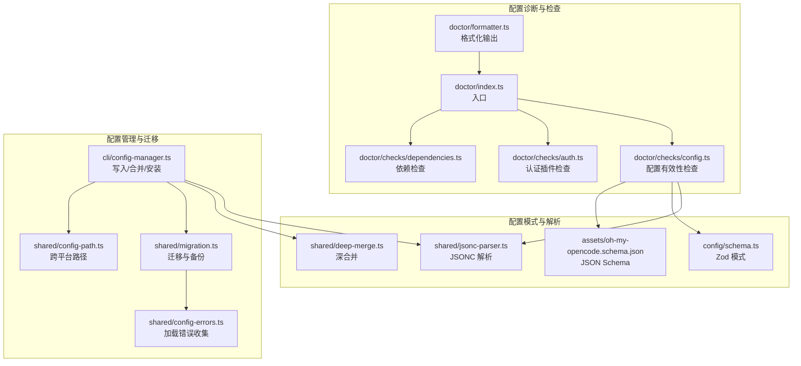
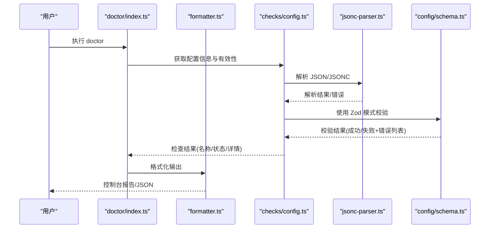
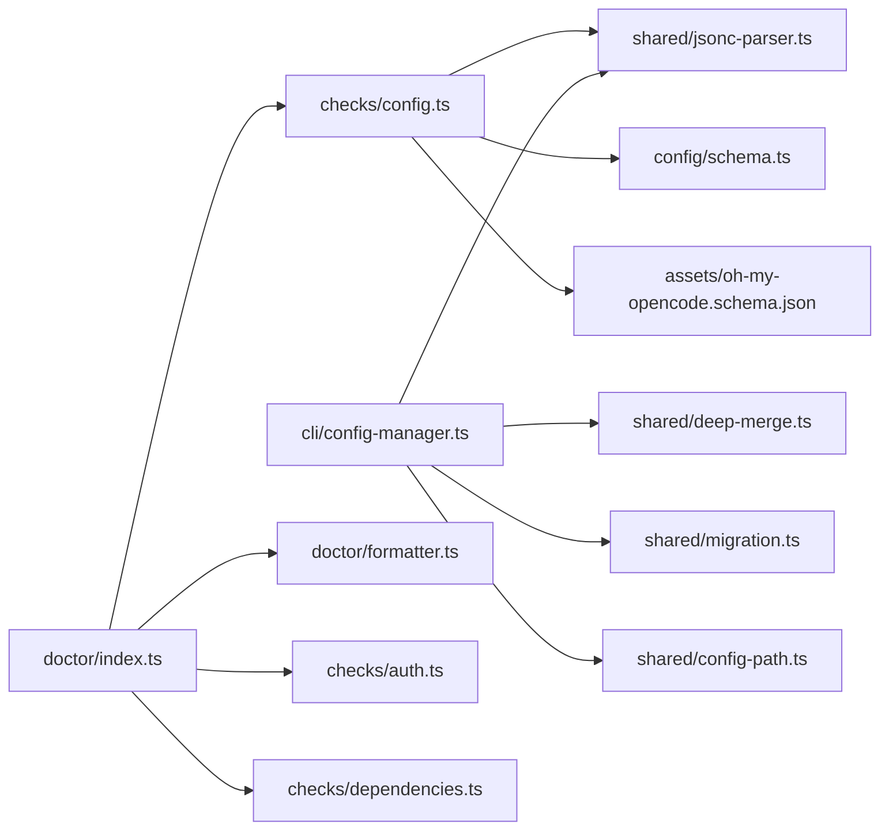
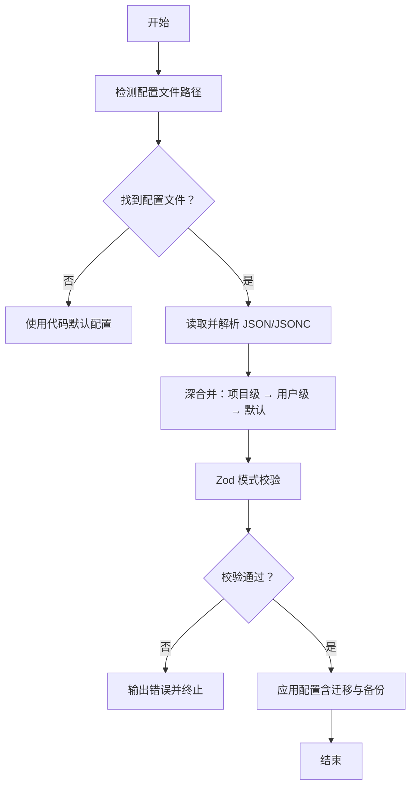

# 配置错误诊断

<cite>
**本文引用的文件**
- [oh-my-opencode.schema.json](file://assets/oh-my-opencode.schema.json)
- [config.ts](file://src/cli/doctor/checks/config.ts)
- [schema.ts](file://src/config/schema.ts)
- [config-errors.ts](file://src/shared/config-errors.ts)
- [config-manager.ts](file://src/cli/config-manager.ts)
- [migration.ts](file://src/shared/migration.ts)
- [deep-merge.ts](file://src/shared/deep-merge.ts)
- [jsonc-parser.ts](file://src/shared/jsonc-parser.ts)
- [config.test.ts](file://src/cli/doctor/checks/config.test.ts)
- [CONFIGURATION-GUIDE.md](file://CONFIGURATION-GUIDE.md)
- [index.ts](file://src/cli/doctor/index.ts)
- [formatter.ts](file://src/cli/doctor/formatter.ts)
- [auth.ts](file://src/cli/doctor/checks/auth.ts)
- [dependencies.ts](file://src/cli/doctor/checks/dependencies.ts)
- [config-path.ts](file://src/shared/config-path.ts)
</cite>

## 目录
1. [简介](#简介)
2. [项目结构](#项目结构)
3. [核心组件](#核心组件)
4. [架构总览](#架构总览)
5. [详细组件分析](#详细组件分析)
6. [依赖关系分析](#依赖关系分析)
7. [性能考量](#性能考量)
8. [故障排查指南](#故障排查指南)
9. [结论](#结论)
10. [附录](#附录)

## 简介
本指南面向 Oh My OpenCode 用户与维护者，聚焦于“配置错误”的系统化诊断与修复。内容涵盖：
- 配置文件格式错误的识别与修复
- 模型配置无效、代理设置冲突等常见问题
- 配置验证工具的使用方法与输出解读
- 配置文件结构详解与字段约束
- 配置优先级与继承规则
- 配置迁移与备份恢复最佳实践

## 项目结构
围绕配置诊断的关键模块包括：
- 配置验证与检查：CLI Doctor 的配置检查器、格式化输出
- 配置模式与校验：Zod Schema 定义与 JSON Schema
- 配置解析与合并：JSONC 解析、深合并策略
- 迁移与兼容：旧键到新键映射、自动迁移与备份
- 路径与环境：跨平台配置路径解析

**图表来源**
- [index.ts](file://src/cli/doctor/index.ts#L1-L12)
- [formatter.ts](file://src/cli/doctor/formatter.ts#L1-L141)
- [config.ts](file://src/cli/doctor/checks/config.ts#L1-L124)
- [auth.ts](file://src/cli/doctor/checks/auth.ts#L1-L116)
- [dependencies.ts](file://src/cli/doctor/checks/dependencies.ts#L1-L164)
- [schema.ts](file://src/config/schema.ts#L1-L384)
- [oh-my-opencode.schema.json](file://assets/oh-my-opencode.schema.json#L1-L200)
- [jsonc-parser.ts](file://src/shared/jsonc-parser.ts#L1-L67)
- [deep-merge.ts](file://src/shared/deep-merge.ts#L1-L54)
- [config-manager.ts](file://src/cli/config-manager.ts#L1-L731)
- [migration.ts](file://src/shared/migration.ts#L1-L167)
- [config-errors.ts](file://src/shared/config-errors.ts#L1-L19)
- [config-path.ts](file://src/shared/config-path.ts#L1-L48)

**章节来源**
- [index.ts](file://src/cli/doctor/index.ts#L1-L12)
- [formatter.ts](file://src/cli/doctor/formatter.ts#L1-L141)
- [config.ts](file://src/cli/doctor/checks/config.ts#L1-L124)
- [schema.ts](file://src/config/schema.ts#L1-L384)
- [oh-my-opencode.schema.json](file://assets/oh-my-opencode.schema.json#L1-L200)
- [jsonc-parser.ts](file://src/shared/jsonc-parser.ts#L1-L67)
- [deep-merge.ts](file://src/shared/deep-merge.ts#L1-L54)
- [config-manager.ts](file://src/cli/config-manager.ts#L1-L731)
- [migration.ts](file://src/shared/migration.ts#L1-L167)
- [config-errors.ts](file://src/shared/config-errors.ts#L1-L19)
- [config-path.ts](file://src/shared/config-path.ts#L1-L48)

## 核心组件
- 配置验证器：扫描项目与用户级配置，使用 Zod 模式与 JSON Schema 进行结构与类型校验，返回路径、格式、是否有效及错误明细。
- 配置模式：定义 agents、categories、hooks、skills 等字段的合法取值范围、必填与可选约束。
- 配置解析器：支持 JSONC（注释、尾随逗号），并提供安全解析与错误定位。
- 配置合并与写入：在生成或更新 oh-my-opencode.json 时进行深合并，避免覆盖不必要的字段。
- 迁移与备份：对旧版键名、钩子名、模型到类别的映射进行自动迁移，并在变更前备份原文件。
- 跨平台路径：统一解析用户与项目级配置文件位置，兼容 Windows 与类 Unix 系统。

**章节来源**
- [config.ts](file://src/cli/doctor/checks/config.ts#L13-L81)
- [schema.ts](file://src/config/schema.ts#L338-L358)
- [jsonc-parser.ts](file://src/shared/jsonc-parser.ts#L9-L41)
- [config-manager.ts](file://src/cli/config-manager.ts#L282-L307)
- [migration.ts](file://src/shared/migration.ts#L125-L166)
- [config-path.ts](file://src/shared/config-path.ts#L13-L47)

## 架构总览
下图展示从命令行到配置文件的端到端流程，以及 Doctor 如何对配置进行验证与报告。

**图表来源**
- [index.ts](file://src/cli/doctor/index.ts#L4-L7)
- [formatter.ts](file://src/cli/doctor/formatter.ts#L18-L35)
- [config.ts](file://src/cli/doctor/checks/config.ts#L49-L113)
- [jsonc-parser.ts](file://src/shared/jsonc-parser.ts#L9-L24)
- [schema.ts](file://src/config/schema.ts#L338-L358)

## 详细组件分析

### 组件一：配置验证器（doctor/checks/config.ts）
职责与行为：
- 自动发现配置文件：优先项目级 .opencode/oh-my-opencode.json，其次用户级 ~/.config/opencode/oh-my-opencode.json。
- 读取并解析：使用 JSONC 解析器，支持注释与尾随逗号；随后用 Zod 模式进行结构与类型校验。
- 输出：存在性、格式（json/jsonc）、有效性、错误路径与消息。

常见错误类型与定位：
- 文件不存在或为空：返回“未找到自定义配置”或“空文件”提示。
- JSON/JSONC 语法错误：抛出语法错误并给出偏移位置。
- 字段类型不符或枚举值非法：返回具体路径与错误描述，如 agents.oracle.model 类型不匹配。

修复建议：
- 使用 JSON Schema 或内置校验工具先行验证，再写入配置。
- 若为 JSONC，确保注释与尾随逗号符合规范。
- 对照 schema 的枚举与范围，修正类型与取值。

**章节来源**
- [config.ts](file://src/cli/doctor/checks/config.ts#L13-L113)
- [jsonc-parser.ts](file://src/shared/jsonc-parser.ts#L9-L24)
- [schema.ts](file://src/config/schema.ts#L338-L358)

### 组件二：配置模式与 JSON Schema（config/schema.ts 与 assets/oh-my-opencode.schema.json）
要点：
- Zod 模式定义了字段的类型、范围、可选性与默认行为。
- JSON Schema 提供外部工具与编辑器的智能提示与校验能力。
- 关键对象：agents（覆盖）、categories（模型与默认技能）、hooks/skills/commands/disabled_* 列表等。

常见模式错误：
- agents 中的键不在允许集合内（大小写、拼写差异）。
- categories 中的字段超出范围（如 temperature 超出 0..2）。
- tools 为对象时，值必须为布尔；颜色需为十六进制格式。
- disabled_* 数组项不在预定义枚举中。

修复建议：
- 使用 JSON Schema 校验器（如 VS Code 插件）在编辑阶段拦截错误。
- 严格遵循枚举值，避免大小写与拼写偏差。
- 对 tools、permissions 等复杂对象逐项核对类型。

**章节来源**
- [schema.ts](file://src/config/schema.ts#L109-L151)
- [schema.ts](file://src/config/schema.ts#L170-L186)
- [schema.ts](file://src/config/schema.ts#L338-L358)
- [oh-my-opencode.schema.json](file://assets/oh-my-opencode.schema.json#L10-L120)

### 组件三：配置解析与合并（shared/jsonc-parser.ts 与 shared/deep-merge.ts）
要点：
- JSONC 解析：支持注释、尾随逗号；错误会抛出带位置信息的异常。
- 深合并：递归合并对象，数组被替换而非拼接；undefined 不覆盖已存在值；限制最大深度防止栈溢出。

常见问题：
- 写入后被意外覆盖：确认合并策略与字段层级。
- 复杂对象合并导致数据丢失：检查是否误传数组或 undefined。

修复建议：
- 在合并前打印 diff，确认预期变化。
- 对大对象分步合并，避免一次性覆盖。

**章节来源**
- [jsonc-parser.ts](file://src/shared/jsonc-parser.ts#L9-L41)
- [deep-merge.ts](file://src/shared/deep-merge.ts#L23-L53)

### 组件四：配置写入与安装（cli/config-manager.ts）
要点：
- 自动检测与创建配置目录，写入 oh-my-opencode.json。
- 与 OpenCode 主配置（opencode.json/opencode.jsonc）联动，自动添加插件条目。
- 错误分类与友好提示：权限不足、磁盘空间、只读文件系统、超时等。

常见问题：
- 权限不足无法写入：提升权限或更换目录。
- 磁盘空间不足：清理空间后重试。
- 安装超时：手动执行安装命令或延长等待时间。

修复建议：
- 使用 doctor 检查依赖与认证状态，确保前置条件满足。
- 手动运行安装命令并观察详细错误输出。

**章节来源**
- [config-manager.ts](file://src/cli/config-manager.ts#L159-L170)
- [config-manager.ts](file://src/cli/config-manager.ts#L186-L213)
- [config-manager.ts](file://src/cli/config-manager.ts#L514-L564)

### 组件五：配置迁移与备份（shared/migration.ts）
要点：
- 旧键名到新键名映射（如 omo→Sisyphus、OmO→Sisyphus 等）。
- 钩子名兼容（如 anthropic-auto-compact→anthropic-context-window-limit-recovery）。
- 模型到类别的自动迁移（根据模型推断类别）。
- 写入前自动备份原文件，命名包含时间戳。

常见问题：
- 旧配置未迁移导致字段缺失或失效。
- 迁移后仍保留冗余字段。

修复建议：
- 执行迁移后对比新旧配置，删除冗余字段。
- 保留备份文件，必要时回滚。

**章节来源**
- [migration.ts](file://src/shared/migration.ts#L56-L104)
- [migration.ts](file://src/shared/migration.ts#L125-L166)

### 组件六：跨平台配置路径（shared/config-path.ts）
要点：
- Windows 优先 ~/.config（跨平台一致性），若不存在则回退到 %APPDATA%。
- 统一返回用户级与项目级配置文件路径。

常见问题：
- 路径解析错误导致找不到配置。
- 多个同名文件导致优先级混淆。

修复建议：
- 明确使用 doctor 检测当前实际生效的配置路径。
- 清理重复或废弃的配置文件。

**章节来源**
- [config-path.ts](file://src/shared/config-path.ts#L13-L47)

### 组件七：Doctor 报告与格式化（doctor/index.ts 与 doctor/formatter.ts）
要点：
- doctor 入口负责调度各检查项并汇总结果。
- 格式化器支持彩色控制台输出与 JSON 输出，便于自动化集成。
- 支持摘要统计、详细信息与帮助建议提取。

常见问题：
- 输出被截断或缺少细节。
- JSON 输出用于后续处理时缺少关键字段。

修复建议：
- 使用 --verbose 或 JSON 输出模式获取完整信息。
- 结合 doctor 的帮助建议进行修复。

**章节来源**
- [index.ts](file://src/cli/doctor/index.ts#L4-L7)
- [formatter.ts](file://src/cli/doctor/formatter.ts#L18-L35)
- [formatter.ts](file://src/cli/doctor/formatter.ts#L82-L84)

## 依赖关系分析

**图表来源**
- [config.ts](file://src/cli/doctor/checks/config.ts#L6-L7)
- [schema.ts](file://src/config/schema.ts#L1-L3)
- [oh-my-opencode.schema.json](file://assets/oh-my-opencode.schema.json#L1-L10)
- [config-manager.ts](file://src/cli/config-manager.ts#L2-L7)
- [deep-merge.ts](file://src/shared/deep-merge.ts#L1-L2)
- [migration.ts](file://src/shared/migration.ts#L1-L2)
- [config-path.ts](file://src/shared/config-path.ts#L1-L3)
- [index.ts](file://src/cli/doctor/index.ts#L1-L2)
- [formatter.ts](file://src/cli/doctor/formatter.ts#L1-L3)
- [auth.ts](file://src/cli/doctor/checks/auth.ts#L1-L6)
- [dependencies.ts](file://src/cli/doctor/checks/dependencies.ts#L1-L3)

**章节来源**
- [config.ts](file://src/cli/doctor/checks/config.ts#L1-L124)
- [schema.ts](file://src/config/schema.ts#L1-L384)
- [oh-my-opencode.schema.json](file://assets/oh-my-opencode.schema.json#L1-L200)
- [config-manager.ts](file://src/cli/config-manager.ts#L1-L731)
- [deep-merge.ts](file://src/shared/deep-merge.ts#L1-L54)
- [migration.ts](file://src/shared/migration.ts#L1-L167)
- [config-path.ts](file://src/shared/config-path.ts#L1-L48)
- [index.ts](file://src/cli/doctor/index.ts#L1-L12)
- [formatter.ts](file://src/cli/doctor/formatter.ts#L1-L141)
- [auth.ts](file://src/cli/doctor/checks/auth.ts#L1-L116)
- [dependencies.ts](file://src/cli/doctor/checks/dependencies.ts#L1-L164)

## 性能考量
- 验证流程为 I/O 密集型：主要耗时在于文件读取与 JSONC 解析。建议：
  - 缓存最近一次解析结果，避免重复读取同一文件。
  - 在 CI 中使用 JSON Schema 预校验，减少运行时开销。
- 深合并与迁移：对大型配置对象进行递归合并时注意深度限制，避免过深嵌套导致性能下降。
- Doctor 输出：在非交互场景使用 JSON 输出，减少格式化开销。

[本节为通用指导，无需特定文件来源]

## 故障排查指南

### 1) 配置文件格式错误
- 症状
  - doctor 报告“配置有验证错误”，并显示路径与错误信息。
  - JSONC 解析报错，提示语法错误与偏移位置。
- 诊断步骤
  - 使用 doctor 检查配置有效性，查看详细错误列表。
  - 使用 JSON Schema 工具（VS Code 插件或在线校验器）在本地快速定位。
- 修复方法
  - 修正类型不符或枚举值非法的字段。
  - 删除尾随逗号或注释中的语法错误。
  - 将 tools、permissions 等对象字段的值改为布尔或合法枚举。

**章节来源**
- [config.ts](file://src/cli/doctor/checks/config.ts#L27-L47)
- [jsonc-parser.ts](file://src/shared/jsonc-parser.ts#L9-L24)
- [schema.ts](file://src/config/schema.ts#L109-L151)

### 2) 模型配置无效
- 症状
  - agents 中的 model 字段不被识别或不符合格式。
- 诊断步骤
  - 对照 categories 中的模型定义与可用枚举。
  - 检查 disabled_mcps 是否误禁用了所需 MCP。
- 修复方法
  - 使用受支持的模型名称与提供商前缀。
  - 移除对 MCP 的误禁用。

**章节来源**
- [schema.ts](file://src/config/schema.ts#L170-L186)
- [schema.ts](file://src/config/schema.ts#L340-L341)

### 3) 代理设置冲突
- 症状
  - 不同代理（如 Claude、Gemini、Copilot）的模型或权限冲突。
- 诊断步骤
  - 使用 doctor 的认证检查与依赖检查，确认插件安装与可用性。
  - 检查 provider 配置与模型前缀是否一致。
- 修复方法
  - 安装对应认证插件并完成登录。
  - 使用推荐的模型前缀（如 antigravity- 前缀）以避免路由错误。

**章节来源**
- [auth.ts](file://src/cli/doctor/checks/auth.ts#L50-L89)
- [config-manager.ts](file://src/cli/config-manager.ts#L579-L606)

### 4) 配置优先级与继承
- 优先级（从高到低）
  - 项目级 .opencode/oh-my-opencode.json
  - 用户级 ~/.config/opencode/oh-my-opencode.json
  - 项目级 .opencode/oh-my-opencode.json
  - 代码默认配置（DEFAULT_CATEGORIES 等）
- 继承规则
  - categories 作为模板，agents 的 category 字段继承模型与默认技能。
  - tools、prompt_append 等可叠加默认配置。
- 修复建议
  - 仅在需要覆盖时设置字段，避免冗余配置。
  - 使用 categories 管理默认值，减少 agents 层重复。

**章节来源**
- [CONFIGURATION-GUIDE.md](file://CONFIGURATION-GUIDE.md#L150-L158)
- [schema.ts](file://src/config/schema.ts#L170-L186)
- [schema.ts](file://src/config/schema.ts#L109-L130)

### 5) 配置迁移与备份恢复
- 迁移流程
  - 自动迁移旧键名、钩子名与模型到类别的映射。
  - 写入前自动备份原文件，文件名包含时间戳。
- 恢复方法
  - 从备份文件恢复到目标路径。
  - 手动删除迁移后的冗余字段。
- 注意事项
  - 迁移后建议再次运行 doctor 验证配置。

**章节来源**
- [migration.ts](file://src/shared/migration.ts#L125-L166)
- [config-manager.ts](file://src/cli/config-manager.ts#L385-L430)

### 6) 常见配置错误示例与修正
- 示例 A：agents 中键名大小写错误
  - 错误：键名为 “Implementer” 而非 “implementer”
  - 修正：统一为小写键名或使用映射后的标准键
- 示例 B：tools 值为字符串而非布尔
  - 错误：tools.{tool} = "true"
  - 修正：tools.{tool} = true
- 示例 C：颜色格式非法
  - 错误：color = "#ffgg00"
  - 修正：color = "#FFGG00"（十六进制）

**章节来源**
- [schema.ts](file://src/config/schema.ts#L125-L128)
- [schema.ts](file://src/config/schema.ts#L121-L121)

### 7) 配置验证工具使用说明
- 命令行
  - 运行 doctor，查看彩色输出与摘要。
  - 使用 JSON 输出模式导出结果以便自动化处理。
- 测试参考
  - 可参考单元测试对 validateConfig、getConfigInfo、checkConfigValidity 的行为进行对照。

**章节来源**
- [index.ts](file://src/cli/doctor/index.ts#L4-L7)
- [formatter.ts](file://src/cli/doctor/formatter.ts#L82-L84)
- [config.test.ts](file://src/cli/doctor/checks/config.test.ts#L1-L104)

## 结论
通过 Doctor 的配置检查、Zod/JSON Schema 的双重校验、JSONC 解析与深合并策略、以及自动迁移与备份机制，Oh My OpenCode 提供了完善的配置错误诊断与修复能力。建议在日常使用中：
- 使用 doctor 定期巡检配置有效性
- 在编辑器中启用 JSON Schema 智能提示
- 遵循优先级与继承规则，尽量使用 categories 管理默认值
- 发生变更前先备份，迁移后进行二次验证

[本节为总结，无需特定文件来源]

## 附录

### A. 配置文件结构与字段速查
- 根对象字段
  - disabled_mcps、disabled_agents、disabled_skills、disabled_hooks、disabled_commands
  - agents（按 agent 名称覆盖）、categories（按类别覆盖）、skills（技能定义与来源）
  - claude_code、sisyphus_agent、experimental、notification、git_master、tdd_guard 等
- agents 覆盖字段
  - model、variant、category、skills、temperature、top_p、prompt、prompt_append、tools、disable、description、mode、color、permission
- categories 字段
  - model、variant、temperature、top_p、maxTokens、thinking、reasoningEffort、textVerbosity、tools、prompt_append、defaultSkills

**章节来源**
- [schema.ts](file://src/config/schema.ts#L338-L358)
- [schema.ts](file://src/config/schema.ts#L109-L151)
- [schema.ts](file://src/config/schema.ts#L170-L186)

### B. 优先级与继承规则图解

**图表来源**
- [config-manager.ts](file://src/cli/config-manager.ts#L385-L430)
- [deep-merge.ts](file://src/shared/deep-merge.ts#L23-L53)
- [schema.ts](file://src/config/schema.ts#L338-L358)