# 团队协作模式

<cite>
**本文引用的文件**
- [README.md](file://README.md)
- [orchestration-guide.md](file://docs/orchestration-guide.md)
- [orchestrator-sisyphus.ts](file://src/agents/orchestrator-sisyphus.ts)
- [dispatching-parallel-agents SKILL.md](file://src/features/builtin-skills/dispatching-parallel-agents/SKILL.md)
- [wave-parallel-execution SKILL.md](file://src/features/builtin-skills/wave-parallel-execution/SKILL.md)
- [receiving-code-review SKILL.md](file://src/features/builtin-skills/receiving-code-review/SKILL.md)
- [requesting-code-review SKILL.md](file://src/features/builtin-skills/requesting-code-review/SKILL.md)
- [creating-changes SKILL.md](file://src/features/builtin-skills/creating-changes/SKILL.md)
- [executing-plans SKILL.md](file://src/features/builtin-skills/executing-plans/SKILL.md)
- [subagent-driven-development SKILL.md](file://src/features/builtin-skills/subagent-driven-development/SKILL.md)
- [CONTRIBUTING.md](file://CONTRIBUTING.md)
- [manager.ts](file://src/features/background-agent/manager.ts)
- [storage.ts](file://src/features/boulder-state/storage.ts)
- [proposal.md](file://changes/multi-manus-planning-integration/proposal.md)
- [design.md](file://changes/multi-manus-planning-integration/design.md)
- [tasks.md](file://changes/multi-manus-planning-integration/tasks.md)
- [constants.ts](file://src/hooks/planning-flow-guide/constants.ts)
- [plan-progress-reader/index.ts](file://src/features/plan-progress-reader/index.ts)
- [plan-progress-reader/reader.ts](file://src/features/plan-progress-reader/reader.ts)
- [plan-reorganizer/index.ts](file://src/features/plan-reorganizer/index.ts)
- [plan-reorganizer/reorganize.ts](file://src/features/plan-reorganizer/reorganize.ts)
- [plan-update-reminder/index.ts](file://src/hooks/plan-update-reminder/index.ts)
- [plan-attention-refresher/index.ts](file://src/hooks/plan-attention-refresher/index.ts)
- [todo-continuation-enforcer.ts](file://src/hooks/todo-continuation-enforcer.ts)
- [schema.ts](file://src/config/schema.ts)
- [index.ts](file://src/index.ts)
</cite>

## 更新摘要
**所做更改**
- 新增 Manu Planning 方法论的深度集成章节
- 更新规划流程指南，包含 Metis-Prometheus-Momus 三阶段协作模式
- 新增 Manus 原则的执行技能增强
- 新增计划进度读取器、重组器和提醒钩子
- 更新团队协作工作流，整合文件驱动的计划管理模式
- 新增注意力刷新和强制提醒机制

## 目录
1. [引言](#引言)
2. [项目结构](#项目结构)
3. [核心组件](#核心组件)
4. [架构总览](#架构总览)
5. [详细组件分析](#详细组件分析)
6. [Manu Planning 方法论集成](#manu-planning-方法论集成)
7. [依赖分析](#依赖分析)
8. [性能考虑](#性能考虑)
9. [故障排查指南](#故障排查指南)
10. [结论](#结论)
11. [附录](#附录)

## 引言
本指南面向在团队环境中使用 Prometheus-Sisyphus 编排系统的工程师与技术负责人，目标是帮助团队建立"规划-执行-复盘"一体化的协作模式，明确角色分工、工作流与质量门禁，并将自动化与人工审查有机结合。通过 Oh My OpenCode 的内置代理、技能与后台任务系统，团队可以实现跨模块、跨任务的并行协作，同时保证可追溯、可审计与可复盘。

**更新** 本次更新重点整合了 Manu Planning 方法论，引入文件驱动的计划管理模式，通过 Manus 原则解决任务丢失、目标遗忘、状态不一致等核心问题，建立更加稳健的团队协作体系。

## 项目结构
围绕团队协作的关键能力，项目在以下层次组织：
- 顶层文档：README 提供安装、配置与特性概览；orchestration-guide 提供编排哲学与流程。
- 代理层：Sisyphus 作为总协调者，结合 Prometheus（规划）、Oracle（咨询）、Librarian/Explore（研究）等专家代理。
- 技能层：以"技能"为可组合的执行单元，覆盖并行派发、波次执行、代码评审、变更创建与执行等。
- 基础设施层：后台任务管理器负责并行子任务生命周期与通知；Boulder 状态存储用于跨会话的计划与进度追踪。
- **新增** Manu Planning 集成层：通过计划进度读取器、重组器和提醒钩子实现文件驱动的状态管理。

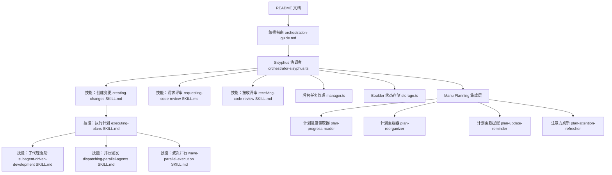

**图表来源**
- [README.md](file://README.md#L1-L1250)
- [orchestration-guide.md](file://docs/orchestration-guide.md#L1-L153)
- [orchestrator-sisyphus.ts](file://src/agents/orchestrator-sisyphus.ts#L1-L800)
- [creating-changes SKILL.md](file://src/features/builtin-skills/creating-changes/SKILL.md#L1-L172)
- [executing-plans SKILL.md](file://src/features/builtin-skills/executing-plans/SKILL.md#L1-L232)
- [subagent-driven-development SKILL.md](file://src/features/builtin-skills/subagent-driven-development/SKILL.md#L1-L319)
- [dispatching-parallel-agents SKILL.md](file://src/features/builtin-skills/dispatching-parallel-agents/SKILL.md#L1-L181)
- [wave-parallel-execution SKILL.md](file://src/features/builtin-skills/wave-parallel-execution/SKILL.md#L1-L396)
- [requesting-code-review SKILL.md](file://src/features/builtin-skills/requesting-code-review/SKILL.md#L1-L106)
- [receiving-code-review SKILL.md](file://src/features/builtin-skills/receiving-code-review/SKILL.md#L1-L202)
- [manager.ts](file://src/features/background-agent/manager.ts#L1-L800)
- [storage.ts](file://src/features/boulder-state/storage.ts#L1-L308)

**章节来源**
- [README.md](file://README.md#L1-L1250)
- [orchestration-guide.md](file://docs/orchestration-guide.md#L1-L153)

## 核心组件
- 角色与职责
  - Prometheus：纯策略规划者，只读访问，专注"如何做"，不直接编码。
  - Sisyphus：执行与协调者，负责委托、并行与质量门禁，确保任务闭环。
  - Oracle/Librarian/Explore：外部咨询与研究专家，提供架构审阅与参考资料。
  - Implementer：按任务粒度执行的子代理，遵循 TDD 与自检。
  - **新增** Metis：规划顾问，负责需求分析和隐藏问题识别。
  - **新增** Momus：规划评审员，负责规划质量评估和标准符合性检查。
- 技能与执行模式
  - 创建变更：从提案到设计与任务分解，形成可执行计划。
  - 执行计划：单会话内逐任务执行，两阶段评审（规范合规 → 代码质量）。
  - 子代理驱动：同会话内多任务流水线，自动评审与回路。
  - 并行派发：多问题域并行调查，隔离风险。
  - 波次并行：多波次并行执行，Git Worktree 隔离，串行合并。
  - **新增** Manus 原则：2-Action Rule、3-Strike Protocol 等最佳实践。
- 质量与评审
  - 请求评审：在关键节点触发评审，收集反馈并修正。
  - 接收评审：基于事实核查与技术正确性进行判断与实施。
  - **新增** 规划评审：Momus 对 Prometheus 规划进行质量评估。
- 基础设施
  - 后台任务管理：并发控制、会话生命周期、空闲检测与完成通知。
  - Boulder 状态：跨会话追踪计划、阶段与失败计数，保障连续性。
  - **新增** 计划状态管理：通过文件驱动的方式管理任务状态。

**章节来源**
- [orchestration-guide.md](file://docs/orchestration-guide.md#L66-L153)
- [orchestrator-sisyphus.ts](file://src/agents/orchestrator-sisyphus.ts#L134-L800)
- [creating-changes SKILL.md](file://src/features/builtin-skills/creating-changes/SKILL.md#L1-L172)
- [executing-plans SKILL.md](file://src/features/builtin-skills/executing-plans/SKILL.md#L1-L232)
- [subagent-driven-development SKILL.md](file://src/features/builtin-skills/subagent-driven-development/SKILL.md#L1-L319)
- [dispatching-parallel-agents SKILL.md](file://src/features/builtin-skills/dispatching-parallel-agents/SKILL.md#L1-L181)
- [wave-parallel-execution SKILL.md](file://src/features/builtin-skills/wave-parallel-execution/SKILL.md#L1-L396)
- [requesting-code-review SKILL.md](file://src/features/builtin-skills/requesting-code-review/SKILL.md#L1-L106)
- [receiving-code-review SKILL.md](file://src/features/builtin-skills/receiving-code-review/SKILL.md#L1-L202)
- [manager.ts](file://src/features/background-agent/manager.ts#L1-L800)
- [storage.ts](file://src/features/boulder-state/storage.ts#L1-L308)

## 架构总览
下图展示团队协作的端到端流程：从需求与提案开始，经由规划与设计，进入执行阶段（单任务或波次并行），并在关键节点进行评审与归档。**更新** 新增 Manu Planning 方法论的三层规划流程和文件驱动的状态管理。

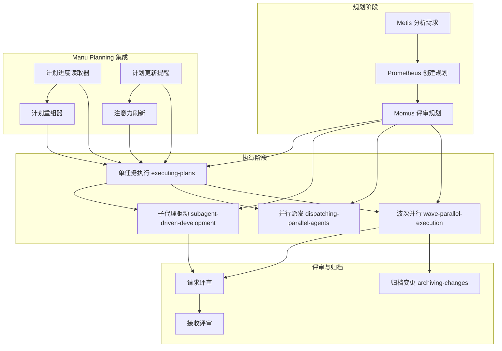

**图表来源**
- [orchestration-guide.md](file://docs/orchestration-guide.md#L24-L153)
- [creating-changes SKILL.md](file://src/features/builtin-skills/creating-changes/SKILL.md#L119-L158)
- [executing-plans SKILL.md](file://src/features/builtin-skills/executing-plans/SKILL.md#L1-L232)
- [subagent-driven-development SKILL.md](file://src/features/builtin-skills/subagent-driven-development/SKILL.md#L1-L319)
- [dispatching-parallel-agents SKILL.md](file://src/features/builtin-skills/dispatching-parallel-agents/SKILL.md#L1-L181)
- [wave-parallel-execution SKILL.md](file://src/features/builtin-skills/wave-parallel-execution/SKILL.md#L1-L396)
- [requesting-code-review SKILL.md](file://src/features/builtin-skills/requesting-code-review/SKILL.md#L1-L106)
- [receiving-code-review SKILL.md](file://src/features/builtin-skills/receiving-code-review/SKILL.md#L1-L202)

## 详细组件分析

### 角色与职责（Prometheus、Sisyphus、专家代理）
- Prometheus 专注于"如何做"，通过 Metis 咨询与 Momus 审校，产出可执行计划。
- Sisyphus 将计划转化为可追踪的 TODO 列表，委托给专家代理或 Implementer，并在每个环节进行项目级 QA。
- Oracle/Librarian/Explore 作为专家代理，分别承担架构审阅、外部资料检索与内部探索。
- **新增** Metis 作为规划顾问，负责识别隐藏需求、模糊性和 AI 失败点。
- **新增** Momus 作为规划评审员，评估规划的严谨性和标准符合性。

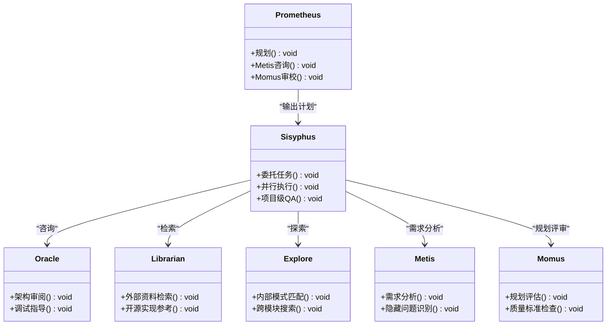

**图表来源**
- [orchestration-guide.md](file://docs/orchestration-guide.md#L66-L112)
- [orchestrator-sisyphus.ts](file://src/agents/orchestrator-sisyphus.ts#L134-L800)

**章节来源**
- [orchestration-guide.md](file://docs/orchestration-guide.md#L66-L112)
- [orchestrator-sisyphus.ts](file://src/agents/orchestrator-sisyphus.ts#L134-L800)

### 执行模式对比与选择
- 单任务执行（executing-plans）：适合中小规模、可串行的任务，强调"一次性完成"的稳定性。
- 子代理驱动（subagent-driven-development）：同会话内流水线式执行，自动两阶段评审，适合高复杂度与高一致性要求。
- 并行派发（dispatching-parallel-agents）：多问题域并行调查，适用于多源失败或相互独立的子任务。
- 波次并行（wave-parallel-execution）：多波次并行执行，Git Worktree 隔离，串行合并，适合大规模计划。
- **新增** Manus 原则：通过 2-Action Rule 和 3-Strike Protocol 确保执行质量和状态同步。

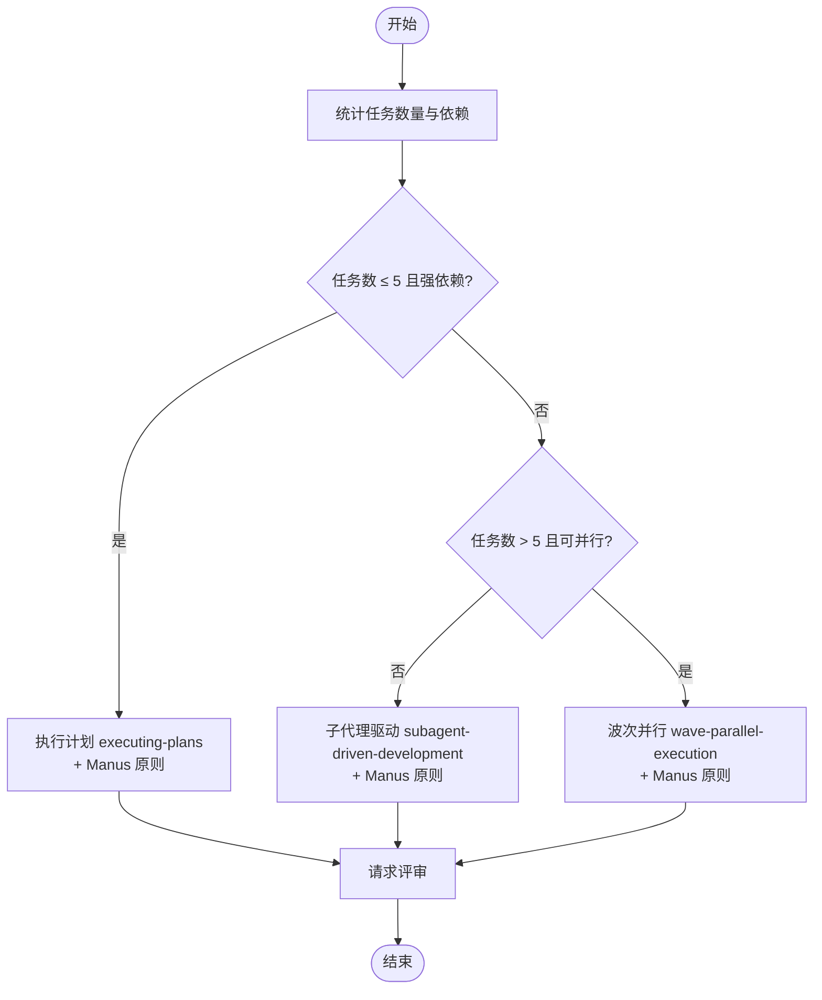

**图表来源**
- [creating-changes SKILL.md](file://src/features/builtin-skills/creating-changes/SKILL.md#L119-L158)
- [executing-plans SKILL.md](file://src/features/builtin-skills/executing-plans/SKILL.md#L1-L232)
- [subagent-driven-development SKILL.md](file://src/features/builtin-skills/subagent-driven-development/SKILL.md#L1-L319)
- [dispatching-parallel-agents SKILL.md](file://src/features/builtin-skills/dispatching-parallel-agents/SKILL.md#L1-L181)
- [wave-parallel-execution SKILL.md](file://src/features/builtin-skills/wave-parallel-execution/SKILL.md#L1-L396)

**章节来源**
- [creating-changes SKILL.md](file://src/features/builtin-skills/creating-changes/SKILL.md#L119-L158)
- [executing-plans SKILL.md](file://src/features/builtin-skills/executing-plans/SKILL.md#L1-L232)
- [subagent-driven-development SKILL.md](file://src/features/builtin-skills/subagent-driven-development/SKILL.md#L1-L319)
- [dispatching-parallel-agents SKILL.md](file://src/features/builtin-skills/dispatching-parallel-agents/SKILL.md#L1-L181)
- [wave-parallel-execution SKILL.md](file://src/features/builtin-skills/wave-parallel-execution/SKILL.md#L1-L396)

### 代码评审集成（请求与接收）
- 请求评审：在关键节点（任务完成、重大特性、合并前）触发评审，使用统一模板与基线提交范围。
- 接收评审：基于技术正确性与代码库现状进行判断，必要时进行回溯与修正，避免"表演式同意"。
- **新增** 规划评审：Momus 对 Prometheus 的规划进行质量评估，确保规划的严谨性和可行性。

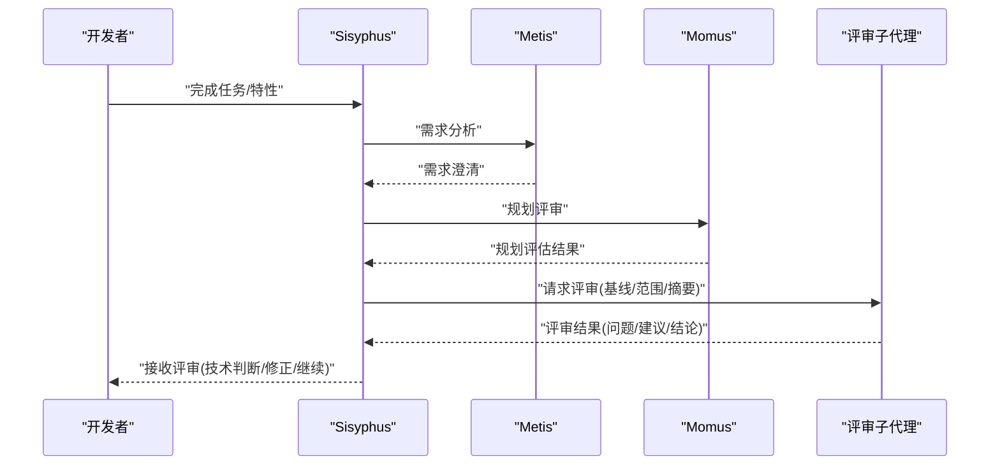

**图表来源**
- [requesting-code-review SKILL.md](file://src/features/builtin-skills/requesting-code-review/SKILL.md#L1-L106)
- [receiving-code-review SKILL.md](file://src/features/builtin-skills/receiving-code-review/SKILL.md#L1-L202)

**章节来源**
- [requesting-code-review SKILL.md](file://src/features/builtin-skills/requesting-code-review/SKILL.md#L1-L106)
- [receiving-code-review SKILL.md](file://src/features/builtin-skills/receiving-code-review/SKILL.md#L1-L202)

### 并行与隔离（并行派发与波次并行）
- 并行派发：将相互独立的问题域拆分为多个子任务并行调查，降低整体耗时。
- 波次并行：将任务按依赖分组为多个波次，每个波次在独立 Git Worktree 中执行，最后串行合并，避免冲突。
- **新增** Manus 原则：通过阶段管理和状态同步确保并行执行的一致性。

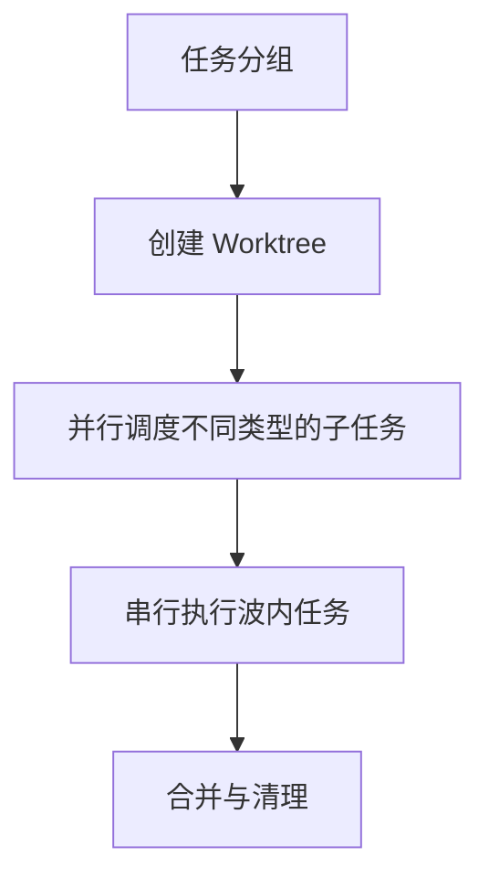

**图表来源**
- [dispatching-parallel-agents SKILL.md](file://src/features/builtin-skills/dispatching-parallel-agents/SKILL.md#L1-L181)
- [wave-parallel-execution SKILL.md](file://src/features/builtin-skills/wave-parallel-execution/SKILL.md#L1-L396)

**章节来源**
- [dispatching-parallel-agents SKILL.md](file://src/features/builtin-skills/dispatching-parallel-agents/SKILL.md#L1-L181)
- [wave-parallel-execution SKILL.md](file://src/features/builtin-skills/wave-parallel-execution/SKILL.md#L1-L396)

### 跨会话的计划与进度追踪（Boulder 状态）
- 通过 boulder.json 记录活动计划、阶段状态、失败计数与会话 ID，支持中断后恢复与跨会话连续执行。
- 提供计划进度解析与阶段切换接口，便于在不同执行模式之间安全过渡。
- **新增** 文件驱动的状态管理：通过 tasks.md 等文件持久化计划状态，解决上下文压缩导致的状态丢失问题。

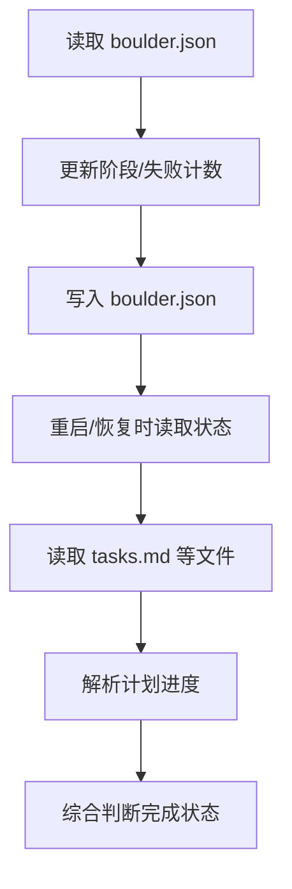

**图表来源**
- [storage.ts](file://src/features/boulder-state/storage.ts#L1-L308)

**章节来源**
- [storage.ts](file://src/features/boulder-state/storage.ts#L1-L308)

### 后台任务管理与通知
- 后台任务管理器负责并发控制、会话生命周期、空闲检测与完成通知，确保并行子任务稳定运行与及时反馈。
- 支持批量通知与父会话聚合，便于在大规模并行场景中保持可见性。
- **新增** Manu Planning 集成：通过钩子系统实现计划状态的自动管理和提醒。

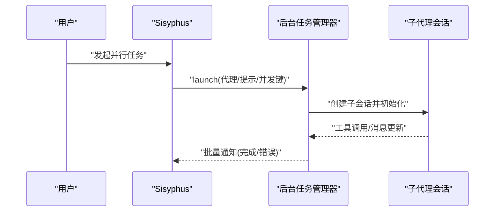

**图表来源**
- [manager.ts](file://src/features/background-agent/manager.ts#L1-L800)

**章节来源**
- [manager.ts](file://src/features/background-agent/manager.ts#L1-L800)

## Manu Planning 方法论集成

### 规划流程指南
**新增** Manu Planning 方法论的核心是 Metis-Prometheus-Momus 三层规划流程，确保规划的质量和可行性。

**图表来源**
- [constants.ts](file://src/hooks/planning-flow-guide/constants.ts#L1-L42)

### 计划进度读取器
**新增** plan-progress-reader 模块实现了文件驱动的计划状态读取，解决上下文压缩导致的状态丢失问题。

- **只读模式**：从 tasks.md 读取进度信息，不调用任何写入 API
- **综合解析**：支持 checkbox 和阶段两种状态表示方式
- **优先级判断**：boulder.phase → tasks.md → OpenCode todos 的短路逻辑

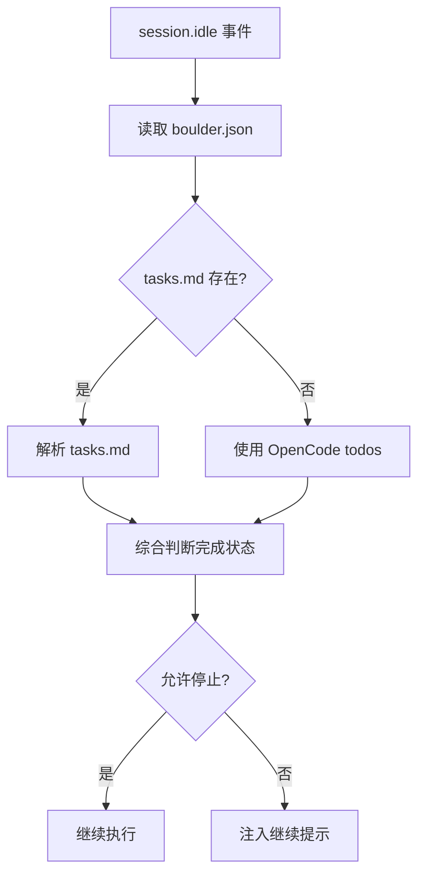

**图表来源**
- [plan-progress-reader/reader.ts](file://src/features/plan-progress-reader/reader.ts#L1-L200)

### 计划重组器
**新增** plan-reorganizer 模块实现了完成任务的自动重组，将已完成的阶段移动到文档底部。

- **阶段识别**：正确定位 Phase 边界和完成状态
- **自动重组**：将完成的 Phase 移动到 `## Completed Phases` 部分
- **标题降级**：统一使用 `###` 标题层级，保持文档结构清晰

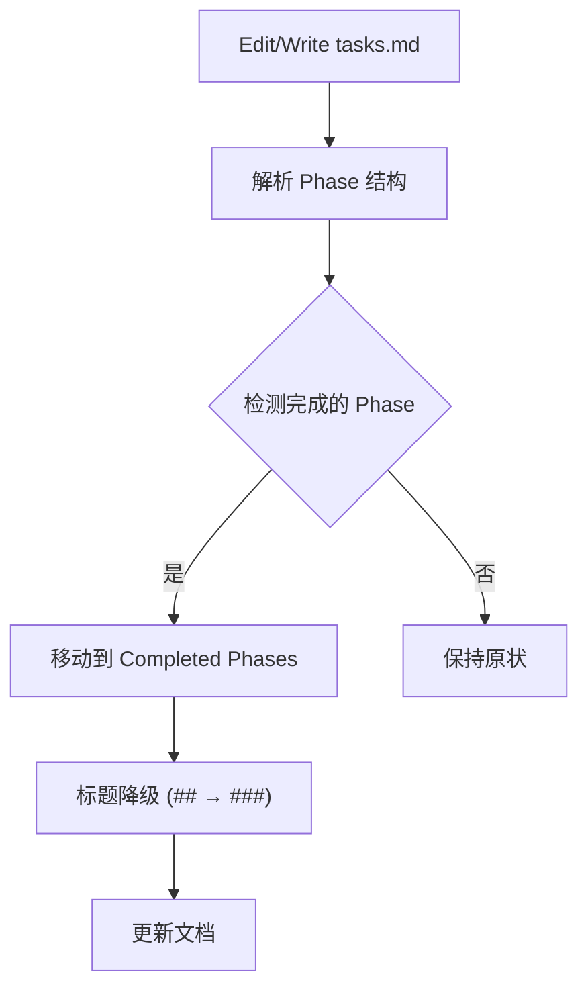

**图表来源**
- [plan-reorganizer/reorganize.ts](file://src/features/plan-reorganizer/reorganize.ts#L1-L150)

### 计划更新提醒
**新增** plan-update-reminder 钩子在代码变更时提醒更新计划状态，防止状态不一致。

- **智能检测**：通过 git diff 检测代码变更
- **渐进式提醒**：第1-2次提醒，第3次拒绝自动继续
- **条件激活**：仅在 boulder.json 存在时激活

### 注意力刷新
**新增** plan-attention-refresher 钩子实现 Manu Planning 的注意力操控原则，在工具执行前刷新任务状态到注意力窗口。

- **PreToolUse 事件**：在 Write|Edit|Bash|Read 工具执行前触发
- **状态刷新**：读取 tasks.md 前30行到工具输出
- **无阻塞执行**：不影响工具的正常执行流程

### Manus 原则执行技能增强
**更新** executing-plans 和 wave-parallel-execution 技能集成了 Manus 原则：

- **2-Action Rule**：每2次浏览操作后保存发现到 findings.md
- **3-Strike Protocol**：同一任务连续3次失败后停止尝试
- **Error Logging**：在 progress.md 中记录所有错误详情
- **File Updates**：在执行过程中定期更新 findings.md 和 progress.md

**章节来源**
- [proposal.md](file://changes/multi-manus-planning-integration/proposal.md#L1-L137)
- [design.md](file://changes/multi-manus-planning-integration/design.md#L1-L267)
- [tasks.md](file://changes/multi-manus-planning-integration/tasks.md#L1-L1037)
- [constants.ts](file://src/hooks/planning-flow-guide/constants.ts#L1-L42)
- [plan-progress-reader/index.ts](file://src/features/plan-progress-reader/index.ts#L1-L100)
- [plan-progress-reader/reader.ts](file://src/features/plan-progress-reader/reader.ts#L1-L200)
- [plan-reorganizer/index.ts](file://src/features/plan-reorganizer/index.ts#L1-L100)
- [plan-reorganizer/reorganize.ts](file://src/features/plan-reorganizer/reorganize.ts#L1-L150)
- [plan-update-reminder/index.ts](file://src/hooks/plan-update-reminder/index.ts#L1-L100)
- [plan-attention-refresher/index.ts](file://src/hooks/plan-attention-refresher/index.ts#L1-L100)
- [todo-continuation-enforcer.ts](file://src/hooks/todo-continuation-enforcer.ts#L1-L570)
- [schema.ts](file://src/config/schema.ts#L1-L200)
- [index.ts](file://src/index.ts#L1-L100)

## 依赖分析
- 组件耦合
  - Sisyphus 与技能层松耦合：通过技能接口与提示词实现功能扩展。
  - 技能与子代理：技能定义任务类型与执行策略，子代理负责具体实现。
  - 基础设施与业务：后台任务管理器与状态存储为执行模式提供基础设施支撑。
  - **新增** Manu Planning 集成：通过钩子系统与现有组件无缝集成。
- 外部依赖
  - OpenCode 插件生态与 MCP 服务器，用于工具与外部服务集成。
  - Git 工作流（Worktree）与版本控制，确保并行执行的隔离与可合并性。
  - **新增** 文件系统依赖：通过 tasks.md 等文件实现状态持久化。

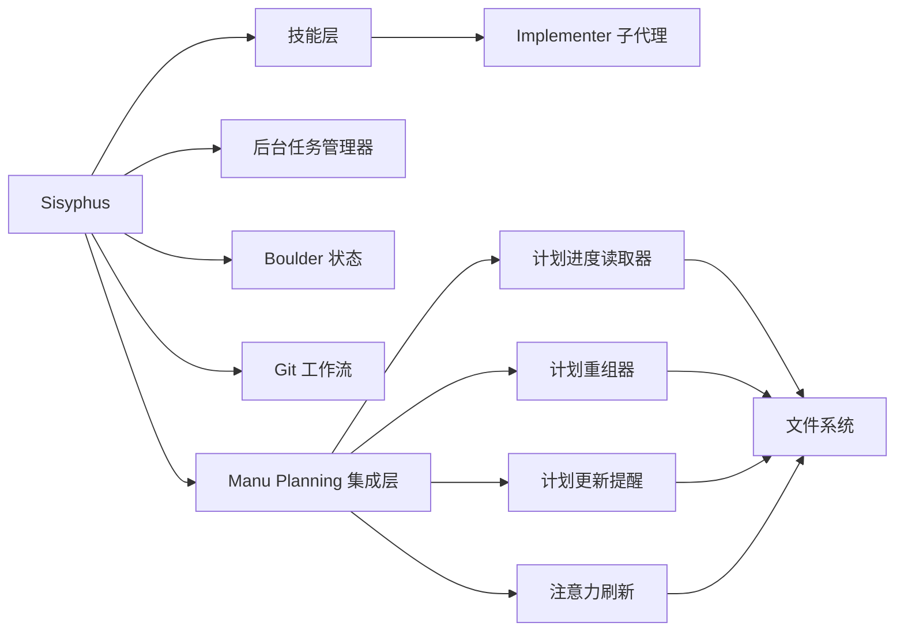

**图表来源**
- [executing-plans SKILL.md](file://src/features/builtin-skills/executing-plans/SKILL.md#L1-L232)
- [wave-parallel-execution SKILL.md](file://src/features/builtin-skills/wave-parallel-execution/SKILL.md#L1-L396)
- [manager.ts](file://src/features/background-agent/manager.ts#L1-L800)
- [storage.ts](file://src/features/boulder-state/storage.ts#L1-L308)

**章节来源**
- [executing-plans SKILL.md](file://src/features/builtin-skills/executing-plans/SKILL.md#L1-L232)
- [wave-parallel-execution SKILL.md](file://src/features/builtin-skills/wave-parallel-execution/SKILL.md#L1-L396)
- [manager.ts](file://src/features/background-agent/manager.ts#L1-L800)
- [storage.ts](file://src/features/boulder-state/storage.ts#L1-L308)

## 性能考虑
- 并行优先：在任务相互独立的前提下，优先采用并行派发或波次并行，缩短总耗时。
- 并发控制：后台任务管理器提供并发键与组控制，避免资源争用与超载。
- 上下文与诊断：项目级 LSP 诊断与构建/测试命令在每个委托后执行，尽早暴露问题。
- 会话压缩与通知：在空闲检测与输出验证基础上完成任务，减少无效占用。
- **新增** 文件系统优化：通过文件驱动的状态管理减少上下文压缩的影响。
- **新增** 钩子执行优化：采用异步非阻塞方式执行钩子，避免影响主流程性能。

## 故障排查指南
- 任务未完成或中断
  - 检查 boulder.json 阶段与失败计数，定位阻塞点。
  - 使用后台任务管理器查看运行中的子任务与通知队列。
  - **新增** 检查 tasks.md 文件是否存在和格式正确。
- 并行冲突
  - 波次并行模式下，确认 Worktree 是否正确创建与隔离。
  - 合并前运行各 Worktree 的测试，避免跨分支冲突。
- 评审分歧
  - 接收评审时，基于技术事实与代码库现状进行判断，必要时回溯与修正。
  - 请求评审时，明确基线与范围，确保评审聚焦。
  - **新增** 规划评审：Momus 评审不通过时，返回 Prometheus 重新规划。
- 会话空闲与输出缺失
  - 空闲事件需经过输出验证，避免过早标记完成。
  - 若出现无内容会话，检查工具调用与代理初始化。
  - **新增** 检查钩子配置和执行状态，确保 Manu Planning 功能正常。
- **新增** 状态不一致问题
  - 检查 plan-progress-reader 是否正确解析 tasks.md。
  - 验证 plan-reorganizer 是否正确重组完成的阶段。
  - 确认 todo-continuation-enforcer 的强制提醒逻辑。

**章节来源**
- [storage.ts](file://src/features/boulder-state/storage.ts#L1-L308)
- [manager.ts](file://src/features/background-agent/manager.ts#L1-L800)
- [receiving-code-review SKILL.md](file://src/features/builtin-skills/receiving-code-review/SKILL.md#L1-L202)
- [requesting-code-review SKILL.md](file://src/features/builtin-skills/requesting-code-review/SKILL.md#L1-L106)

## 结论
通过 Prometheus-Sisyphus 编排系统与 Manu Planning 方法论的深度集成，团队可以在"规划-执行-评审-归档"的闭环中实现高效协作。Sisyphus 作为总协调者，结合专家代理与多种执行技能，既能应对简单任务，也能处理复杂的并行与隔离场景。**更新** 新增的文件驱动状态管理和 Manus 原则确保了任务状态的持久化和执行质量，通过 Metis-Prometheus-Momus 三层规划流程建立了更加稳健的协作体系。将自动化与人工审查相结合，既提升效率，又保障质量与可追溯性。

## 附录
- 团队角色建议
  - 技术负责人：推动规划与评审流程，把控技术方向与质量门禁。
  - 高级工程师：作为 Prometheus 与 Oracle 的人类代表，参与关键决策与审校。
  - 开发工程师：作为 Sisyphus 的人类搭档，提供上下文、澄清需求与验收评审。
  - **新增** 规划顾问：负责 Metis 角色，识别隐藏需求和潜在问题。
  - **新增** 规划评审员：负责 Momus 角色，评估规划质量和标准符合性。
- 远程协作建议
  - 使用统一的评审模板与基线范围，减少沟通成本。
  - 在波次并行模式下，明确合并顺序与冲突处理策略。
  - 建立知识库与变更归档，沉淀最佳实践与教训。
  - **新增** 采用文件驱动的协作方式，确保远程团队的状态同步。
  - **新增** 遵循 Manus 原则，建立标准化的执行和状态管理流程。