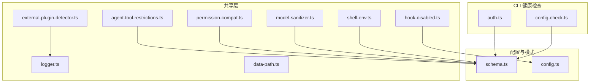
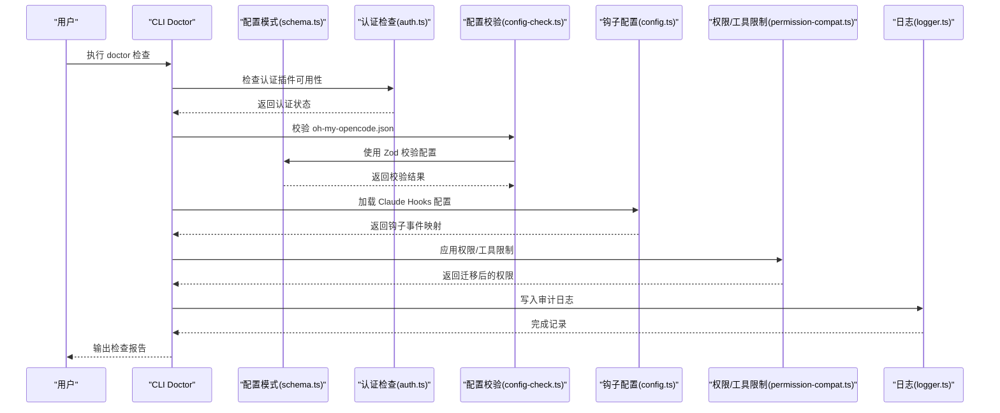
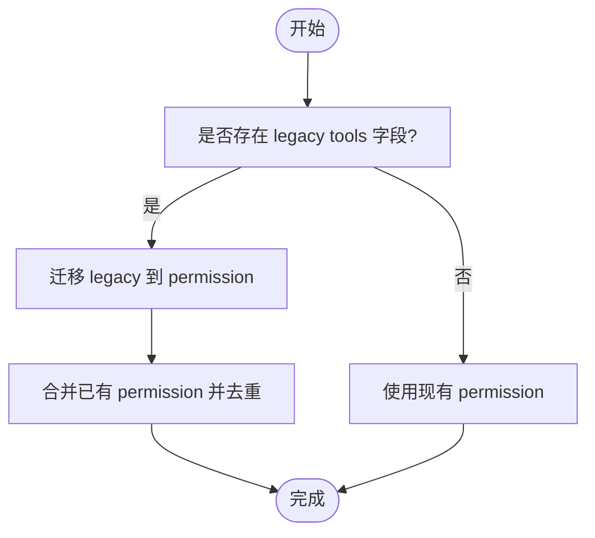
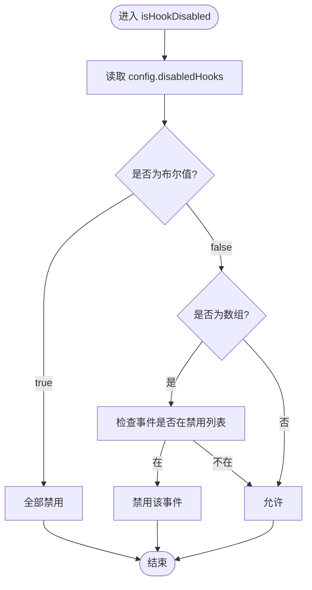
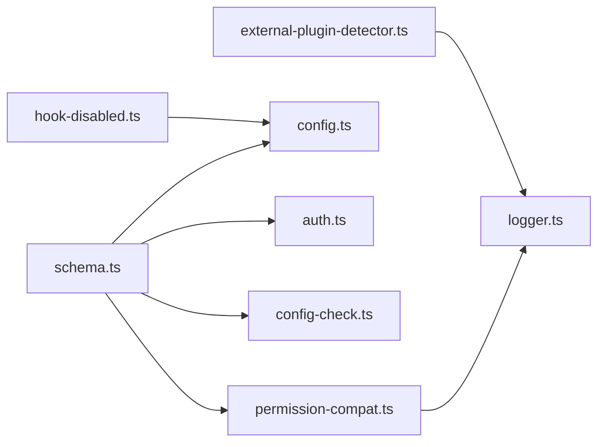

# 安全配置指南

<cite>
**本文引用的文件**
- [agent-tool-restrictions.ts](file://src/shared/agent-tool-restrictions.ts)
- [permission-compat.ts](file://src/shared/permission-compat.ts)
- [hook-disabled.ts](file://src/shared/hook-disabled.ts)
- [model-sanitizer.ts](file://src/shared/model-sanitizer.ts)
- [schema.ts](file://src/config/schema.ts)
- [config.ts](file://src/hooks/claude-code-hooks/config.ts)
- [logger.ts](file://src/shared/logger.ts)
- [auth.ts](file://src/cli/doctor/checks/auth.ts)
- [config-check.ts](file://src/cli/doctor/checks/config.ts)
- [shell-env.ts](file://src/shared/shell-env.ts)
- [external-plugin-detector.ts](file://src/shared/external-plugin-detector.ts)
- [data-path.ts](file://src/shared/data-path.ts)
- [CONFIGURATION-GUIDE.md](file://CONFIGURATION-GUIDE.md)
</cite>

## 目录
1. [简介](#简介)
2. [项目结构](#项目结构)
3. [核心组件](#核心组件)
4. [架构总览](#架构总览)
5. [详细组件分析](#详细组件分析)
6. [依赖关系分析](#依赖关系分析)
7. [性能考量](#性能考量)
8. [故障排查指南](#故障排查指南)
9. [结论](#结论)
10. [附录](#附录)

## 简介
本指南面向 Oh My OpenCode 的安全配置与运维，聚焦以下主题：
- 代理工具限制机制与权限控制策略
- 钩子禁用与访问控制
- 模型配置与敏感信息保护
- 权限兼容性与安全审计
- 威胁模型与风险评估
- 安全配置检查清单与常见漏洞防护
- 实际安全配置案例与应急响应流程

## 项目结构
围绕安全配置的关键模块分布如下：
- 权限与工具限制：共享层提供工具限制与权限格式迁移能力
- 配置校验与模式：Zod Schema 定义配置结构与默认值
- 钩子系统：Claude Hooks 配置加载与事件匹配
- 日志与审计：统一日志输出到临时目录
- 外部插件冲突检测：避免通知类插件冲突导致的崩溃
- 认证与配置健康检查：CLI Doctor 提供认证可用性与配置有效性检查

图表来源
- [agent-tool-restrictions.ts](file://src/shared/agent-tool-restrictions.ts#L1-L57)
- [permission-compat.ts](file://src/shared/permission-compat.ts#L1-L78)
- [hook-disabled.ts](file://src/shared/hook-disabled.ts#L1-L23)
- [model-sanitizer.ts](file://src/shared/model-sanitizer.ts#L1-L13)
- [schema.ts](file://src/config/schema.ts#L1-L384)
- [config.ts](file://src/hooks/claude-code-hooks/config.ts#L1-L104)
- [logger.ts](file://src/shared/logger.ts#L1-L21)
- [auth.ts](file://src/cli/doctor/checks/auth.ts#L1-L116)
- [config-check.ts](file://src/cli/doctor/checks/config.ts#L1-L124)

章节来源
- [schema.ts](file://src/config/schema.ts#L1-L384)
- [CONFIGURATION-GUIDE.md](file://CONFIGURATION-GUIDE.md#L1-L289)

## 核心组件
- 工具限制与权限格式
  - 旧版工具白/黑名单映射为新权限格式，支持“仅允许”和“默认拒绝”的策略
  - 用于将 legacy 的 tools 字段迁移到 permission 字段
- 钩子禁用控制
  - 支持按事件类型禁用钩子，或整体禁用
- 模型字段清洗
  - 对来自不同命令源的 model 字段进行清洗，避免注入与越权
- 配置模式与默认值
  - Zod Schema 定义了工具、钩子、代理、技能、类别等的合法取值范围
- 日志与审计
  - 将运行日志写入临时目录，便于审计与取证
- 外部插件冲突检测
  - 自动检测已知通知类外部插件，避免与内置通知冲突导致崩溃
- Shell 环境与变量注入
  - 提供跨平台的环境变量转义与命令前缀构建，降低注入风险

章节来源
- [permission-compat.ts](file://src/shared/permission-compat.ts#L1-L78)
- [hook-disabled.ts](file://src/shared/hook-disabled.ts#L1-L23)
- [model-sanitizer.ts](file://src/shared/model-sanitizer.ts#L1-L13)
- [schema.ts](file://src/config/schema.ts#L1-L384)
- [logger.ts](file://src/shared/logger.ts#L1-L21)
- [external-plugin-detector.ts](file://src/shared/external-plugin-detector.ts#L1-L133)
- [shell-env.ts](file://src/shared/shell-env.ts#L1-L112)

## 架构总览
下图展示安全相关组件之间的交互关系与数据流。

图表来源
- [auth.ts](file://src/cli/doctor/checks/auth.ts#L1-L116)
- [config-check.ts](file://src/cli/doctor/checks/config.ts#L1-L124)
- [schema.ts](file://src/config/schema.ts#L1-L384)
- [config.ts](file://src/hooks/claude-code-hooks/config.ts#L1-L104)
- [permission-compat.ts](file://src/shared/permission-compat.ts#L1-L78)
- [logger.ts](file://src/shared/logger.ts#L1-L21)

## 详细组件分析

### 代理工具限制与权限控制
- 旧版 tools 映射到新版 permission
  - “仅允许”策略：对未显式列出的工具默认拒绝
  - “默认拒绝 + 显式允许”策略：更严格的最小权限原则
- 代理工具限制表
  - 不同代理对工具的默认允许/拒绝列表，避免高危操作
- 迁移逻辑
  - 若同时存在 legacy tools 与 permission，优先保留现有 permission，并合并迁移

图表来源
- [permission-compat.ts](file://src/shared/permission-compat.ts#L46-L77)
- [agent-tool-restrictions.ts](file://src/shared/agent-tool-restrictions.ts#L15-L47)

章节来源
- [permission-compat.ts](file://src/shared/permission-compat.ts#L1-L78)
- [agent-tool-restrictions.ts](file://src/shared/agent-tool-restrictions.ts#L1-L57)

### 钩子禁用与访问控制
- 禁用策略
  - 整体禁用：当配置为布尔 true 时，所有钩子事件均被禁用
  - 按事件禁用：数组包含具体事件名时，仅对应事件被禁用
- 事件类型
  - 包括但不限于：todo-continuation-enforcer、context-window-monitor、session-recovery、session-notification、comment-checker、tool-output-truncator 等
- 与 Claude Hooks 配置的结合
  - 从多处 settings.json 合并钩子规则，最终生效的配置由合并逻辑决定

图表来源
- [hook-disabled.ts](file://src/shared/hook-disabled.ts#L1-L23)
- [config.ts](file://src/hooks/claude-code-hooks/config.ts#L46-L103)

章节来源
- [hook-disabled.ts](file://src/shared/hook-disabled.ts#L1-L23)
- [config.ts](file://src/hooks/claude-code-hooks/config.ts#L1-L104)

### 模型配置与敏感信息保护
- 模型字段清洗
  - 仅接受非空字符串，去除首尾空白；对特定命令源进行清洗
- 配置模式约束
  - 通过 Zod Schema 限定模型名称、温度、top_p、最大 token 等参数范围
- 最佳实践
  - 在配置中显式声明模型与推理参数，避免使用默认值带来的不确定性
  - 对外部输入的模型字段进行清洗与校验，防止注入与越权

章节来源
- [model-sanitizer.ts](file://src/shared/model-sanitizer.ts#L1-L13)
- [schema.ts](file://src/config/schema.ts#L170-L186)

### 权限兼容性与安全审计
- 权限格式兼容
  - 新版 permission 支持 ask/allow/deny 三态，兼容旧版 tools 的布尔映射
- 审计日志
  - 日志写入临时目录，包含时间戳与消息内容，便于追踪异常行为
- 外部插件冲突检测
  - 发现已知通知类外部插件时，自动禁用内置通知并输出警告，避免 Windows 平台资源竞争导致的崩溃

章节来源
- [permission-compat.ts](file://src/shared/permission-compat.ts#L1-L78)
- [logger.ts](file://src/shared/logger.ts#L1-L21)
- [external-plugin-detector.ts](file://src/shared/external-plugin-detector.ts#L1-L133)

### Shell 环境与变量注入安全
- 跨平台转义
  - 针对 Unix、PowerShell、cmd 提供不同的转义策略，防止注入与语法错误
- 环境变量前缀构建
  - 生成适合目标 shell 的命令前缀，避免变量污染与命令拼接错误

章节来源
- [shell-env.ts](file://src/shared/shell-env.ts#L1-L112)

## 依赖关系分析
- 组件耦合
  - 权限兼容模块依赖配置模式以进行迁移与校验
  - 钩子禁用模块依赖插件配置结构
  - 外部插件检测模块依赖日志模块进行告警记录
- 外部依赖
  - Zod 用于配置模式校验
  - Bun 文件系统用于读取 Claude Hooks 配置

图表来源
- [schema.ts](file://src/config/schema.ts#L1-L384)
- [permission-compat.ts](file://src/shared/permission-compat.ts#L1-L78)
- [config.ts](file://src/hooks/claude-code-hooks/config.ts#L1-L104)
- [auth.ts](file://src/cli/doctor/checks/auth.ts#L1-L116)
- [config-check.ts](file://src/cli/doctor/checks/config.ts#L1-L124)
- [logger.ts](file://src/shared/logger.ts#L1-L21)
- [external-plugin-detector.ts](file://src/shared/external-plugin-detector.ts#L1-L133)
- [hook-disabled.ts](file://src/shared/hook-disabled.ts#L1-L23)

## 性能考量
- 配置加载与合并
  - 钩子配置按顺序合并，避免重复事件与冗余规则
- 日志写入
  - 采用追加写入，避免频繁 IO；注意日志文件大小与清理策略
- Shell 转义
  - 转义与拼接逻辑简单高效，适用于大多数场景

## 故障排查指南
- 认证插件不可用
  - 使用 CLI Doctor 的认证检查，确认插件安装与可用性
- 配置无效或解析失败
  - 使用配置校验检查，定位具体字段与错误信息
- 钩子未生效或全部禁用
  - 检查 disabledHooks 的布尔/数组配置，确认事件名是否正确
- 外部通知插件冲突
  - 查看日志中的冲突告警，按提示调整插件或强制启用内置通知
- Shell 注入或命令失败
  - 检查环境变量转义与命令前缀构建，确保跨平台兼容

章节来源
- [auth.ts](file://src/cli/doctor/checks/auth.ts#L1-L116)
- [config-check.ts](file://src/cli/doctor/checks/config.ts#L1-L124)
- [hook-disabled.ts](file://src/shared/hook-disabled.ts#L1-L23)
- [external-plugin-detector.ts](file://src/shared/external-plugin-detector.ts#L1-L133)
- [logger.ts](file://src/shared/logger.ts#L1-L21)
- [shell-env.ts](file://src/shared/shell-env.ts#L1-L112)

## 结论
通过将权限与工具限制、钩子禁用、模型清洗、配置校验、日志审计与外部插件冲突检测有机结合，Oh My OpenCode 提供了可落地的安全配置框架。建议在生产环境中遵循最小权限原则、严格配置校验、启用审计日志，并定期进行安全巡检与应急演练。

## 附录

### 威胁模型与风险评估
- 威胁来源
  - 误配置导致的工具滥用（如 write/edit/task/delegate_task）
  - 钩子被恶意启用或篡改
  - 外部插件与内置功能冲突引发的系统不稳定
  - Shell 注入与命令拼接错误
- 风险等级
  - 高：工具滥用、钩子攻击、冲突导致崩溃
  - 中：配置不一致、日志泄露、Shell 注入
  - 低：默认配置偏差、UI 体验问题
- 评估方法
  - 使用 CLI Doctor 进行认证与配置检查
  - 审核 permission 与 tools 的一致性
  - 检查 disabledHooks 与 Claude Hooks 配置
  - 监控日志与外部插件冲突告警

### 安全配置检查清单
- 权限与工具限制
  - 是否使用新版 permission 并明确列出允许的工具
  - 是否对高危工具（write/edit/task/delegate_task/call_omo_agent）进行限制
- 钩子禁用
  - 是否按需禁用不必要的钩子事件
  - 是否整体禁用以降低风险
- 模型与参数
  - 是否显式设置模型与推理参数
  - 是否对模型字段进行清洗
- 配置校验
  - 是否通过 Zod 模式校验
  - 是否存在无效字段或类型错误
- 审计与日志
  - 是否启用日志并定期清理
  - 是否监控外部插件冲突告警
- Shell 注入防护
  - 是否使用跨平台转义与命令前缀构建

### 常见安全漏洞与防护
- 工具滥用
  - 防护：使用“仅允许”策略与最小权限原则
- 钩子攻击
  - 防护：禁用不需要的钩子事件，集中管理 Claude Hooks 配置
- 插件冲突
  - 防护：检测并禁用冲突插件，必要时强制启用内置通知
- Shell 注入
  - 防护：使用统一的转义与前缀构建函数
- 配置注入
  - 防护：严格使用 Zod 模式校验，避免信任外部输入

### 实际安全配置案例
- 场景一：仅允许特定工具
  - 使用“仅允许”策略，将未列出的工具统一拒绝
- 场景二：禁用高危钩子
  - 在 disabledHooks 中加入高风险事件，或整体禁用
- 场景三：模型字段清洗
  - 对来自外部的模型字段进行清洗，仅接受非空字符串
- 场景四：外部通知插件冲突
  - 检测到冲突后，自动禁用内置通知并输出告警

章节来源
- [permission-compat.ts](file://src/shared/permission-compat.ts#L29-L40)
- [hook-disabled.ts](file://src/shared/hook-disabled.ts#L1-L23)
- [model-sanitizer.ts](file://src/shared/model-sanitizer.ts#L1-L13)
- [external-plugin-detector.ts](file://src/shared/external-plugin-detector.ts#L96-L133)
- [CONFIGURATION-GUIDE.md](file://CONFIGURATION-GUIDE.md#L1-L289)

### 应急响应流程
- 发现异常
  - 检查日志文件位置与内容
  - 确认是否存在外部插件冲突告警
- 快速处置
  - 禁用相关钩子事件或整体禁用
  - 回滚最近的配置变更
- 根因分析
  - 使用 CLI Doctor 检查认证与配置
  - 审核 permission 与 tools 的一致性
- 复盘与加固
  - 更新最小权限策略
  - 强化配置校验与审计日志

章节来源
- [logger.ts](file://src/shared/logger.ts#L1-L21)
- [external-plugin-detector.ts](file://src/shared/external-plugin-detector.ts#L96-L133)
- [auth.ts](file://src/cli/doctor/checks/auth.ts#L1-L116)
- [config-check.ts](file://src/cli/doctor/checks/config.ts#L1-L124)