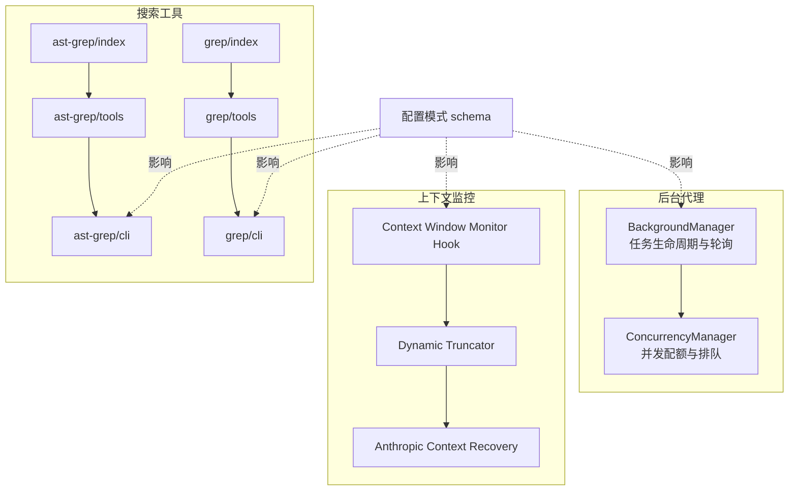
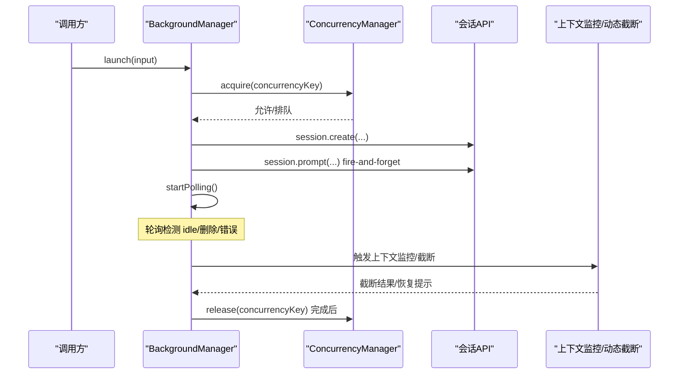
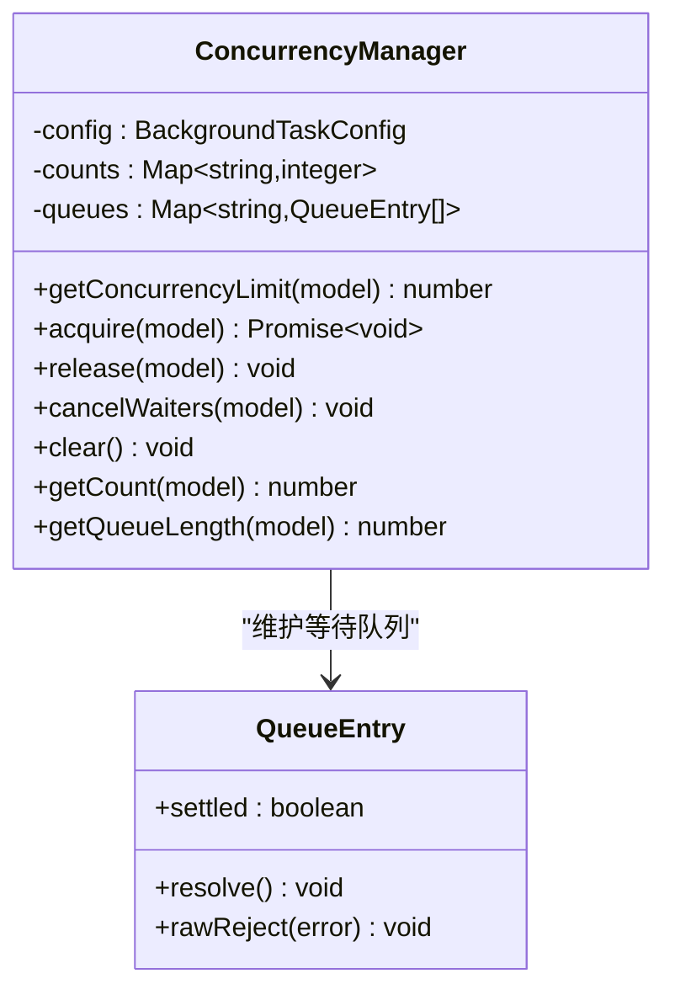
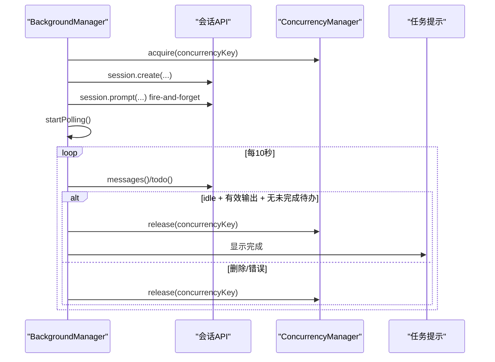
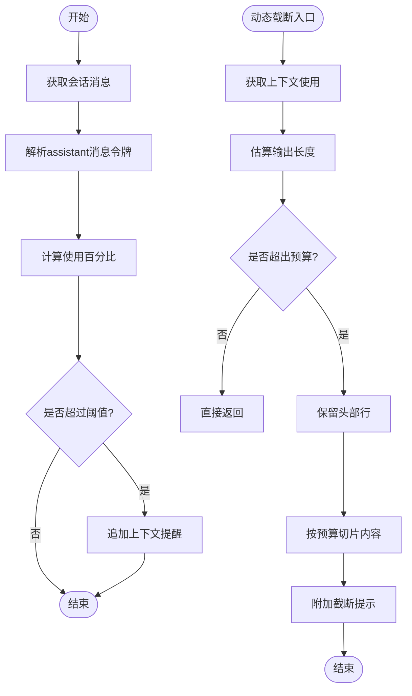
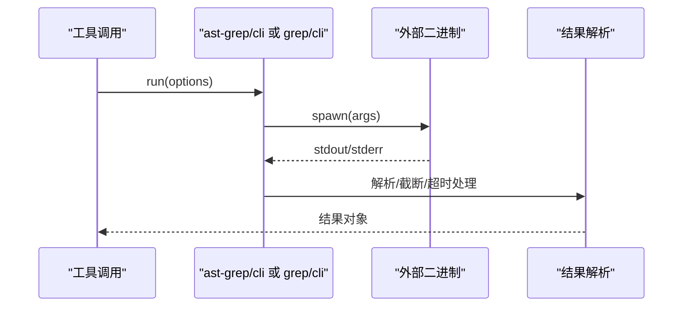
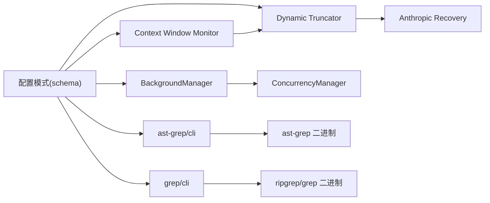

# 性能优化建议

<cite>
**本文引用的文件**
- [src/features/background-agent/concurrency.ts](file://src/features/background-agent/concurrency.ts)
- [src/features/background-agent/manager.ts](file://src/features/background-agent/manager.ts)
- [src/config/schema.ts](file://src/config/schema.ts)
- [src/hooks/context-window-monitor.ts](file://src/hooks/context-window-monitor.ts)
- [src/shared/dynamic-truncator.ts](file://src/shared/dynamic-truncator.ts)
- [src/hooks/anthropic-context-window-limit-recovery/index.ts](file://src/hooks/anthropic-context-window-limit-recovery/index.ts)
- [src/tools/ast-grep/index.ts](file://src/tools/ast-grep/index.ts)
- [src/tools/ast-grep/tools.ts](file://src/tools/ast-grep/tools.ts)
- [src/tools/ast-grep/cli.ts](file://src/tools/ast-grep/cli.ts)
- [src/tools/grep/index.ts](file://src/tools/grep/index.ts)
- [src/tools/grep/tools.ts](file://src/tools/grep/tools.ts)
- [src/tools/grep/cli.ts](file://src/tools/grep/cli.ts)
- [src/shared/logger.ts](file://src/shared/logger.ts)
- [package.json](file://package.json)
</cite>

## 目录
1. [简介](#简介)
2. [项目结构](#项目结构)
3. [核心组件](#核心组件)
4. [架构总览](#架构总览)
5. [详细组件分析](#详细组件分析)
6. [依赖关系分析](#依赖关系分析)
7. [性能考量与优化策略](#性能考量与优化策略)
8. [故障排查指南](#故障排查指南)
9. [结论](#结论)
10. [附录：配置参数与监控指标](#附录配置参数与监控指标)

## 简介
本指南面向 Oh My OpenCode 的性能优化需求，聚焦以下目标：
- 代理执行效率优化：并发控制、任务调度与资源使用。
- 上下文窗口监控与内存优化：避免上下文溢出、动态截断与回收。
- AST-Grep 与 Grep 工具的性能优化技巧：超时、输出限制、匹配上限与二进制可用性。
- 后台代理并发管理与任务调度优化：队列、限流、清理与稳定性保障。
- 配置参数调整建议与性能监控指标。
- 实战测试与基准方法。

## 项目结构
本项目采用按功能域分层组织，关键与性能相关模块如下：
- 后台代理与并发控制：features/background-agent
- 上下文监控与动态截断：hooks/context-window-monitor.ts、shared/dynamic-truncator.ts、hooks/anthropic-context-window-limit-recovery
- 搜索工具：tools/ast-grep、tools/grep
- 配置模式：config/schema.ts
- 日志：shared/logger.ts

图表来源
- [src/features/background-agent/manager.ts](file://src/features/background-agent/manager.ts#L52-L1166)
- [src/features/background-agent/concurrency.ts](file://src/features/background-agent/concurrency.ts#L15-L138)
- [src/hooks/context-window-monitor.ts](file://src/hooks/context-window-monitor.ts#L33-L99)
- [src/shared/dynamic-truncator.ts](file://src/shared/dynamic-truncator.ts#L105-L175)
- [src/hooks/anthropic-context-window-limit-recovery/index.ts](file://src/hooks/anthropic-context-window-limit-recovery/index.ts#L23-L147)
- [src/tools/ast-grep/index.ts](file://src/tools/ast-grep/index.ts#L1-L14)
- [src/tools/ast-grep/tools.ts](file://src/tools/ast-grep/tools.ts#L35-L110)
- [src/tools/ast-grep/cli.ts](file://src/tools/ast-grep/cli.ts#L64-L231)
- [src/tools/grep/index.ts](file://src/tools/grep/index.ts#L1-L4)
- [src/tools/grep/tools.ts](file://src/tools/grep/tools.ts#L5-L41)
- [src/tools/grep/cli.ts](file://src/tools/grep/cli.ts#L132-L230)
- [src/config/schema.ts](file://src/config/schema.ts#L297-L303)

章节来源
- [src/features/background-agent/manager.ts](file://src/features/background-agent/manager.ts#L52-L1166)
- [src/features/background-agent/concurrency.ts](file://src/features/background-agent/concurrency.ts#L15-L138)
- [src/config/schema.ts](file://src/config/schema.ts#L297-L303)

## 核心组件
- 并发控制器 ConcurrencyManager：基于模型或提供商标识的配额与排队，支持取消等待与清理。
- 后台任务管理器 BackgroundManager：任务生命周期、轮询、通知聚合、稳定性检测与完成判定。
- 上下文窗口监控与动态截断：基于会话消息统计与令牌估算，动态截断输出，必要时触发自动压缩。
- AST-Grep 与 Grep 工具：带超时、最大输出字节、最大匹配数等安全限制；支持后台初始化与二进制可用性检查。

章节来源
- [src/features/background-agent/concurrency.ts](file://src/features/background-agent/concurrency.ts#L15-L138)
- [src/features/background-agent/manager.ts](file://src/features/background-agent/manager.ts#L52-L1166)
- [src/hooks/context-window-monitor.ts](file://src/hooks/context-window-monitor.ts#L33-L99)
- [src/shared/dynamic-truncator.ts](file://src/shared/dynamic-truncator.ts#L105-L175)
- [src/tools/ast-grep/cli.ts](file://src/tools/ast-grep/cli.ts#L64-L231)
- [src/tools/grep/cli.ts](file://src/tools/grep/cli.ts#L132-L230)

## 架构总览
后台代理与上下文监控在运行期通过钩子与工具协同工作，配置模式决定并发与上下文行为边界。

图表来源
- [src/features/background-agent/manager.ts](file://src/features/background-agent/manager.ts#L79-L217)
- [src/features/background-agent/concurrency.ts](file://src/features/background-agent/concurrency.ts#L41-L94)
- [src/hooks/context-window-monitor.ts](file://src/hooks/context-window-monitor.ts#L36-L82)
- [src/shared/dynamic-truncator.ts](file://src/shared/dynamic-truncator.ts#L144-L175)

## 详细组件分析

### 组件一：后台代理并发管理（ConcurrencyManager）
- 设计要点
  - 基于模型名或提供商标识独立计数与队列，避免跨模型争抢。
  - 支持 0 表示无限制（返回 Infinity）。
  - 提供取消等待与全量清理，用于优雅关闭。
- 关键路径
  - 获取并发上限：优先模型级，其次提供商级，最后默认。
  - acquire：未达上限立即放行，否则入队等待。
  - release：优先交棒给等待者，否则释放计数。
  - cancelWaiters/clear：清理挂起等待，防止泄漏。

图表来源
- [src/features/background-agent/concurrency.ts](file://src/features/background-agent/concurrency.ts#L9-L138)

章节来源
- [src/features/background-agent/concurrency.ts](file://src/features/background-agent/concurrency.ts#L15-L138)

### 组件二：后台任务管理（BackgroundManager）
- 设计要点
  - 任务生命周期：launch/resume/complete/error。
  - 轮询策略：固定间隔轮询运行中任务，结合稳定性与空闲事件判定完成。
  - 通知聚合：按父会话聚合待通知任务，减少重复提示。
  - 并发回收：完成前释放并发槽位，避免泄漏。
  - 清理注册：进程信号与 beforeExit 注册统一清理。
- 关键路径
  - launch：创建子会话、记录任务、提示工具调用、启动轮询。
  - 事件处理：message.part.updated 计数工具调用；session.idle 校验输出与待办；session.deleted 标记取消并清理。
  - tryCompleteTask：原子化完成，先释放并发再通知。
  - resume：恢复并发配额与时间戳，重新 fire-and-forget prompt。

图表来源
- [src/features/background-agent/manager.ts](file://src/features/background-agent/manager.ts#L79-L217)
- [src/features/background-agent/manager.ts](file://src/features/background-agent/manager.ts#L444-L557)
- [src/features/background-agent/manager.ts](file://src/features/background-agent/manager.ts#L736-L764)

章节来源
- [src/features/background-agent/manager.ts](file://src/features/background-agent/manager.ts#L52-L1166)

### 组件三：上下文窗口监控与动态截断
- 上下文监控 Hook
  - 基于最近一次 assistant 消息的输入/缓存读取令牌，计算使用比例，超过阈值追加提醒。
- 动态截断
  - 估算输出长度，保留头部若干行，按剩余令牌预算截断内容，并给出移除行数提示。
- Anthropic 上下文回收
  - 解析令牌超限错误，触发自动压缩与提示，配合“会话空闲”事件尝试恢复。

图表来源
- [src/hooks/context-window-monitor.ts](file://src/hooks/context-window-monitor.ts#L36-L82)
- [src/shared/dynamic-truncator.ts](file://src/shared/dynamic-truncator.ts#L105-L175)
- [src/hooks/anthropic-context-window-limit-recovery/index.ts](file://src/hooks/anthropic-context-window-limit-recovery/index.ts#L27-L142)

章节来源
- [src/hooks/context-window-monitor.ts](file://src/hooks/context-window-monitor.ts#L33-L99)
- [src/shared/dynamic-truncator.ts](file://src/shared/dynamic-truncator.ts#L105-L175)
- [src/hooks/anthropic-context-window-limit-recovery/index.ts](file://src/hooks/anthropic-context-window-limit-recovery/index.ts#L23-L147)

### 组件四：AST-Grep 与 Grep 工具
- AST-Grep
  - 支持语言、路径、glob 过滤、上下文行数、替换与预览。
  - 内置超时、最大输出字节、最大匹配数限制；输出过大时尽力解析 JSON 片段。
  - 后台初始化二进制，失败时提供安装指引。
- Grep
  - rg/grep 双后端，内置安全标志与限制参数（深度、大小、数量、列数、超时、输出字节）。
  - 输出解析为文件-行-文本结构，支持计数模式。

图表来源
- [src/tools/ast-grep/tools.ts](file://src/tools/ast-grep/tools.ts#L49-L76)
- [src/tools/ast-grep/cli.ts](file://src/tools/ast-grep/cli.ts#L64-L231)
- [src/tools/grep/tools.ts](file://src/tools/grep/tools.ts#L23-L40)
- [src/tools/grep/cli.ts](file://src/tools/grep/cli.ts#L132-L230)

章节来源
- [src/tools/ast-grep/index.ts](file://src/tools/ast-grep/index.ts#L1-L14)
- [src/tools/ast-grep/tools.ts](file://src/tools/ast-grep/tools.ts#L35-L110)
- [src/tools/ast-grep/cli.ts](file://src/tools/ast-grep/cli.ts#L64-L231)
- [src/tools/grep/index.ts](file://src/tools/grep/index.ts#L1-L4)
- [src/tools/grep/tools.ts](file://src/tools/grep/tools.ts#L5-L41)
- [src/tools/grep/cli.ts](file://src/tools/grep/cli.ts#L132-L230)

## 依赖关系分析
- 配置对并发与上下文的影响
  - background_task.defaultConcurrency/providerConcurrency/modelConcurrency 控制并发上限。
  - context-window-monitor 与 dynamic-truncator 依赖会话消息接口与令牌估算。
- 外部二进制
  - ast-grep 使用 sg 二进制；grep 使用 rg 或 grep；均设置超时与输出限制。
- 日志
  - 统一写入临时目录日志文件，便于定位性能问题。

图表来源
- [src/config/schema.ts](file://src/config/schema.ts#L297-L303)
- [src/features/background-agent/manager.ts](file://src/features/background-agent/manager.ts#L63-L76)
- [src/hooks/context-window-monitor.ts](file://src/hooks/context-window-monitor.ts#L33-L99)
- [src/shared/dynamic-truncator.ts](file://src/shared/dynamic-truncator.ts#L105-L175)
- [src/tools/ast-grep/cli.ts](file://src/tools/ast-grep/cli.ts#L27-L55)
- [src/tools/grep/cli.ts](file://src/tools/grep/cli.ts#L132-L144)

章节来源
- [src/config/schema.ts](file://src/config/schema.ts#L297-L303)
- [src/shared/logger.ts](file://src/shared/logger.ts#L9-L21)

## 性能考量与优化策略

### 代理执行效率与并发控制
- 并发配额优先级
  - 模型级 > 提供商标识 > 默认值；0 表示无限制。
- 排队与交棒
  - acquire 达限时入队，release 优先交棒给等待者，避免空转。
- 任务生命周期
  - 完成前释放并发，确保资源尽快回流；异常/删除路径同样释放。
- 轮询与稳定性
  - 固定轮询间隔，结合最小运行时间与有效输出校验，避免过早完成。
- 清理与退出
  - 注册进程信号与 beforeExit，统一 cancelWaiters/clear，防止悬挂。

章节来源
- [src/features/background-agent/concurrency.ts](file://src/features/background-agent/concurrency.ts#L24-L94)
- [src/features/background-agent/manager.ts](file://src/features/background-agent/manager.ts#L18-L21)
- [src/features/background-agent/manager.ts](file://src/features/background-agent/manager.ts#L444-L557)
- [src/features/background-agent/manager.ts](file://src/features/background-agent/manager.ts#L736-L764)

### 上下文窗口监控与内存优化
- 阈值与提醒
  - 当使用比例超过阈值时追加提醒，降低盲目加速导致的溢出风险。
- 动态截断
  - 以头部行保留与预算令牌切片的方式截断输出，避免一次性大块内存拷贝。
- 自动回收
  - 捕获令牌超限错误，触发压缩与提示，提升长会话稳定性。

章节来源
- [src/hooks/context-window-monitor.ts](file://src/hooks/context-window-monitor.ts#L10-L82)
- [src/shared/dynamic-truncator.ts](file://src/shared/dynamic-truncator.ts#L144-L175)
- [src/hooks/anthropic-context-window-limit-recovery/index.ts](file://src/hooks/anthropic-context-window-limit-recovery/index.ts#L27-L142)

### AST-Grep 与 Grep 工具性能优化
- 超时与输出限制
  - 设置合理超时与最大输出字节数，避免长时间阻塞与内存暴涨。
- 匹配上限
  - 限制最大匹配数，防止大规模结果导致解析与展示成本过高。
- 后台初始化
  - 在首次使用前启动后台下载/查找二进制，减少首次调用延迟。
- 参数裁剪
  - 仅传入必要参数（如 paths/globs），缩小搜索范围。
- 后端选择
  - ripgrep（rg）通常更快，grep 作为备选；根据环境选择最优后端。

章节来源
- [src/tools/ast-grep/cli.ts](file://src/tools/ast-grep/cli.ts#L64-L231)
- [src/tools/grep/cli.ts](file://src/tools/grep/cli.ts#L132-L230)

### 后台代理并发管理与任务调度优化
- 分组并发
  - 使用 agent 作为并发组键，避免不同代理互相挤占。
- 批量通知
  - 按父会话聚合待通知任务，降低重复提示开销。
- 稳定性检测
  - 最小运行时间与有效输出校验，避免误判完成。
- 清理策略
  - 删除/错误/完成均释放并发，防止泄漏；退出时全量取消等待。

章节来源
- [src/features/background-agent/manager.ts](file://src/features/background-agent/manager.ts#L91-L93)
- [src/features/background-agent/manager.ts](file://src/features/background-agent/manager.ts#L559-L571)
- [src/features/background-agent/manager.ts](file://src/features/background-agent/manager.ts#L493-L527)
- [src/features/background-agent/manager.ts](file://src/features/background-agent/manager.ts#L547-L556)

### 配置参数调整建议
- 并发相关
  - defaultConcurrency：默认并发数，建议根据硬件与模型吞吐评估设置。
  - providerConcurrency：按提供商标识限流，避免单提供商过载。
  - modelConcurrency：针对特定模型精细控制。
- 上下文相关
  - context-window-monitor 阈值与动态截断预算可结合业务场景微调。
- 工具相关
  - ast-grep：合理设置 paths/globs，避免全局扫描；必要时开启上下文行数。
  - grep：限制 max-depth/max-filesize/max-count/max-columns，控制搜索范围与输出。

章节来源
- [src/config/schema.ts](file://src/config/schema.ts#L297-L303)

### 性能监控指标
- 并发
  - 并发槽占用率、队列长度、等待时延、取消等待次数。
- 任务
  - 任务平均运行时长、完成率、重试/取消/错误比例、轮询间隔命中率。
- 上下文
  - 使用比例、截断频率、自动回收触发次数、平均截断行数。
- 工具
  - ast-grep/grep 调用次数、平均耗时、超时/截断比例、最大输出字节数。

章节来源
- [src/features/background-agent/concurrency.ts](file://src/features/background-agent/concurrency.ts#L127-L136)
- [src/features/background-agent/manager.ts](file://src/features/background-agent/manager.ts#L659-L673)
- [src/shared/dynamic-truncator.ts](file://src/shared/dynamic-truncator.ts#L105-L142)
- [src/tools/ast-grep/cli.ts](file://src/tools/ast-grep/cli.ts#L103-L163)
- [src/tools/grep/cli.ts](file://src/tools/grep/cli.ts#L150-L193)

### 实际性能测试与基准方法
- 并发与队列
  - 场景：同时发起 N 个任务（N > defaultConcurrency），观察队列入队与交棒耗时。
  - 指标：队列长度、等待时间分布、完成时间。
- 任务稳定性
  - 场景：构造长时间运行且偶发空闲的任务，验证稳定性检测与完成判定。
  - 指标：误判完成率、最小运行时间达标率。
- 上下文截断
  - 场景：生成大输出，触发动态截断与自动回收。
  - 指标：截断频率、平均截断行数、回收触发次数。
- 工具基准
  - 场景：在相同数据集上对比 ast-grep 与 grep，调整 paths/globs/超时/输出限制。
  - 指标：平均耗时、超时/截断比例、结果一致性。

章节来源
- [src/features/background-agent/concurrency.test.ts](file://src/features/background-agent/concurrency.test.ts#L1-L419)
- [src/tools/ast-grep/cli.ts](file://src/tools/ast-grep/cli.ts#L64-L231)
- [src/tools/grep/cli.ts](file://src/tools/grep/cli.ts#L132-L230)

## 故障排查指南
- 并发泄漏
  - 症状：队列持续增长、任务迟迟不释放。
  - 排查：确认完成/错误/删除路径是否调用 release；检查清理注册是否生效。
- 超时与输出过大
  - 症状：ast-grep/grep 返回 truncated 或超时。
  - 排查：缩小搜索范围（paths/globs）、降低上下文行数、增加超时或放宽输出限制。
- 上下文溢出
  - 症状：出现令牌超限错误或自动回收提示。
  - 排查：启用上下文监控与动态截断；检查会话输出是否过大。
- 日志定位
  - 使用统一日志文件定位异常路径与耗时点。

章节来源
- [src/features/background-agent/manager.ts](file://src/features/background-agent/manager.ts#L736-L764)
- [src/tools/ast-grep/cli.ts](file://src/tools/ast-grep/cli.ts#L115-L163)
- [src/tools/grep/cli.ts](file://src/tools/grep/cli.ts#L158-L193)
- [src/shared/logger.ts](file://src/shared/logger.ts#L9-L21)

## 结论
通过合理的并发配额与排队、稳定的任务轮询与完成判定、动态上下文监控与截断，以及工具侧的安全限制与后台初始化，可以显著提升 Oh My OpenCode 的整体性能与稳定性。建议结合业务场景逐步调优配置参数，并建立完善的监控指标体系以持续观测与改进。

## 附录：配置参数与监控指标
- 并发配置（BackgroundTaskConfig）
  - defaultConcurrency：默认并发数
  - providerConcurrency：按提供商标识并发限制
  - modelConcurrency：按模型并发限制
  - staleTimeoutMs：空闲超时中断时间
- 上下文监控
  - 阈值：使用比例阈值
  - 动态截断：预算令牌、保留行数
- 工具安全参数
  - ast-grep：超时、最大输出字节、最大匹配数
  - grep：超时、最大输出字节、最大深度/文件大小/匹配数/列数

章节来源
- [src/config/schema.ts](file://src/config/schema.ts#L297-L303)
- [src/hooks/context-window-monitor.ts](file://src/hooks/context-window-monitor.ts#L10-L16)
- [src/shared/dynamic-truncator.ts](file://src/shared/dynamic-truncator.ts#L31-L35)
- [src/tools/ast-grep/cli.ts](file://src/tools/ast-grep/cli.ts#L96-L109)
- [src/tools/grep/cli.ts](file://src/tools/grep/cli.ts#L135-L156)