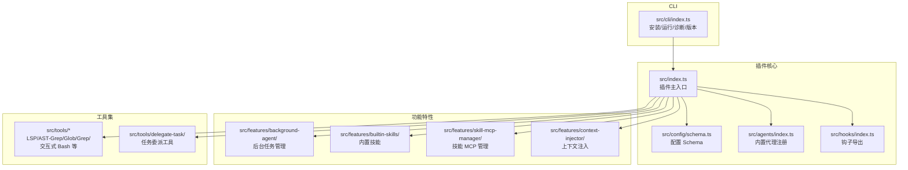
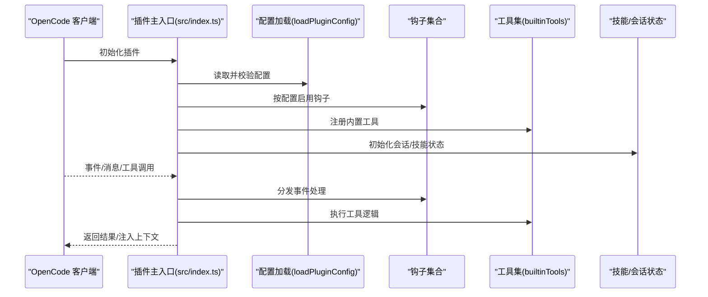
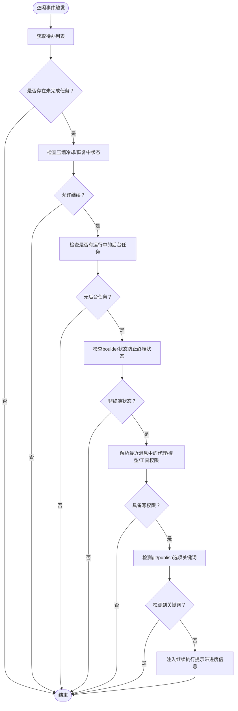
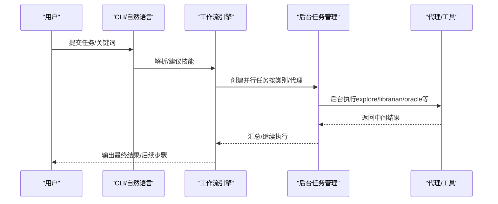
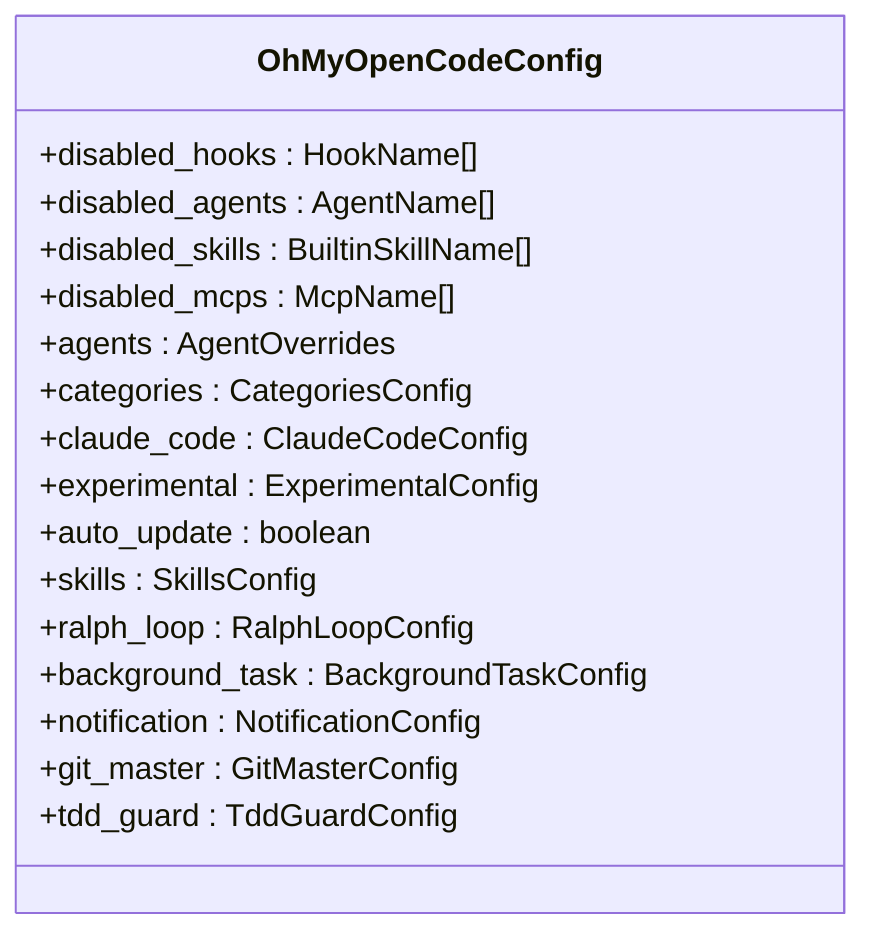
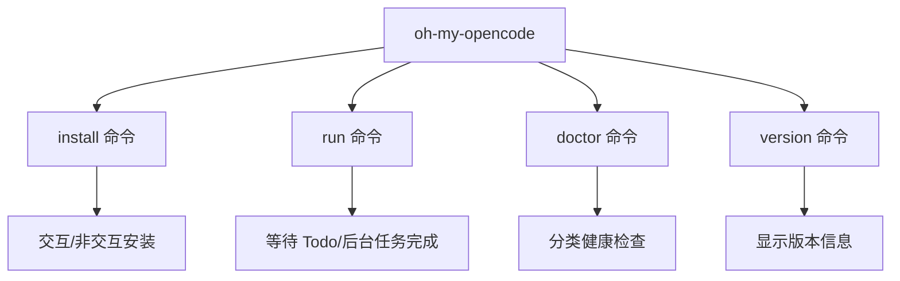
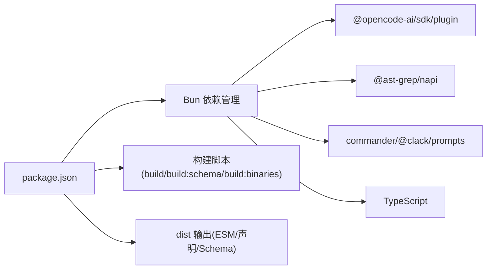
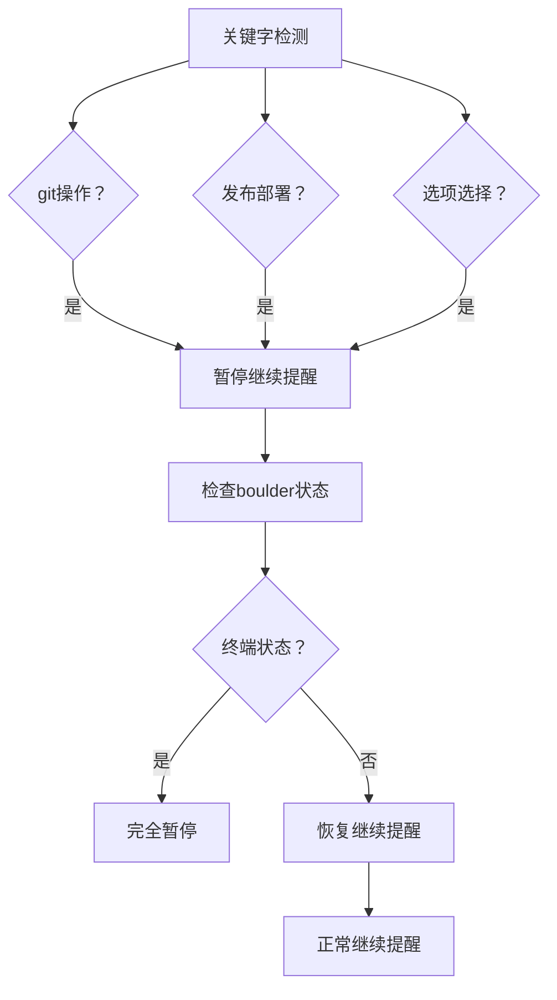

# 最佳实践

<cite>
**本文引用的文件**
- [README.md](file://README.md)
- [CONFIGURATION-GUIDE.md](file://CONFIGURATION-GUIDE.md)
- [USAGE-ENTRY.md](file://USAGE-ENTRY.md)
- [CONTRIBUTING.md](file://CONTRIBUTING.md)
- [package.json](file://package.json)
- [src/index.ts](file://src/index.ts)
- [src/config/schema.ts](file://src/config/schema.ts)
- [src/cli/index.ts](file://src/cli/index.ts)
- [src/agents/index.ts](file://src/agents/index.ts)
- [src/hooks/index.ts](file://src/hooks/index.ts)
- [src/hooks/todo-continuation-enforcer.ts](file://src/hooks/todo-continuation-enforcer.ts)
- [src/hooks/todo-continuation-enforcer.test.ts](file://src/hooks/todo-continuation-enforcer.test.ts)
- [src/hooks/keyword-detector/index.ts](file://src/hooks/keyword-detector/index.ts)
- [src/hooks/keyword-detector/constants.ts](file://src/hooks/keyword-detector/constants.ts)
- [src/features/background-agent/index.ts](file://src/features/background-agent/index.ts)
- [src/tools/delegate-task/index.ts](file://src/tools/delegate-task/index.ts)
- [src/features/builtin-skills/index.ts](file://src/features/builtin-skills/index.ts)
- [src/shared/logger.ts](file://src/shared/logger.ts)
- [src/features/boulder-state/storage.ts](file://src/features/boulder-state/storage.ts)
- [src/hooks/sisyphus-orchestrator/index.ts](file://src/hooks/sisyphus-orchestrator/index.ts)
- [docs/bugs/compaction-todo-continuation-race-condition.md](file://docs/bugs/compaction-todo-continuation-race-condition.md)
</cite>

## 目录
1. [引言](#引言)
2. [项目结构](#项目结构)
3. [核心组件](#核心组件)
4. [架构总览](#架构总览)
5. [详细组件分析](#详细组件分析)
6. [依赖关系分析](#依赖关系分析)
7. [性能考虑](#性能考虑)
8. [故障排查指南](#故障排查指南)
9. [结论](#结论)
10. [附录](#附录)

## 引言
本指南面向使用 Oh My OpenCode 的个人与团队，聚焦于性能优化、安全配置、团队协作模式、自动化工作流设计与实现、代理与工具的合理配置、大规模项目实践、监控与维护以及真实案例研究与成功经验。文档基于仓库源码与官方文档进行提炼，帮助你在 OpenCode 生态中构建稳定、高效且可扩展的智能开发流水线。

## 项目结构
项目采用模块化分层组织，围绕"插件主入口""钩子系统""工具集""内置技能""CLI"等维度展开，便于按需启用/禁用特性、扩展代理与工具、统一配置管理。

图表来源
- [src/index.ts](file://src/index.ts#L86-L606)
- [src/config/schema.ts](file://src/config/schema.ts#L338-L358)
- [src/agents/index.ts](file://src/agents/index.ts#L17-L32)
- [src/hooks/index.ts](file://src/hooks/index.ts#L1-L48)
- [src/cli/index.ts](file://src/cli/index.ts#L15-L146)

章节来源
- [CONTRIBUTING.md](file://CONTRIBUTING.md#L107-L124)
- [README.md](file://README.md#L168-L256)

## 核心组件
- 插件主入口：集中初始化钩子、工具、技能与状态管理，暴露统一的事件与工具接口。
- 配置体系：Zod Schema 驱动的强类型配置，支持全局/项目级覆盖与实验性开关。
- 钩子系统：围绕会话生命周期与工具执行周期的 21+ 钩子，覆盖上下文压缩、错误恢复、通知、关键词触发、并行执行等。
- 工具集：内置 LSP/AST-Grep/Glob/Grep/交互式 Bash/会话管理/任务委派等工具。
- 内置技能：Playwright、前端 UI/UX、Git Master 等技能，支持嵌入 MCP。
- CLI：安装、运行、诊断、版本查询等命令行能力。

章节来源
- [src/index.ts](file://src/index.ts#L86-L606)
- [src/config/schema.ts](file://src/config/schema.ts#L338-L358)
- [src/hooks/index.ts](file://src/hooks/index.ts#L1-L48)
- [src/tools/delegate-task/index.ts](file://src/tools/delegate-task/index.ts#L1-L4)
- [src/features/builtin-skills/index.ts](file://src/features/builtin-skills/index.ts#L1-L3)
- [src/cli/index.ts](file://src/cli/index.ts#L15-L146)

## 架构总览
下图展示插件加载、钩子装配、工具注册与事件流转的关键路径，体现"配置驱动 + 生命周期钩子 + 工具执行"的整体架构。

图表来源
- [src/index.ts](file://src/index.ts#L86-L606)
- [src/config/schema.ts](file://src/config/schema.ts#L338-L358)

## 详细组件分析

### 组件一：会话与任务持续执行（Todo 连续强制）
该钩子确保任务未完成时不中断，自动在空闲时注入继续指令，并结合后台任务、权限与上下文限制策略，避免误触发。**新增功能**包括：

- **Git操作决策检测**：检测merge、push、commit、rebase、squash等git操作关键词
- **发布/部署动作识别**：检测upload、publish、deploy、release、ship等发布部署关键词
- **选项选择场景处理**：检测"option 1/2/3/4"和中文"选项1/2/3/4"等选项选择场景
- **多语言支持**：英文和中文的关键词检测
- **boulder状态检查**：防止在终端状态下干扰Phase 3触发

**更新** 新增了git操作决策检测、发布部署动作识别、选项选择场景处理等关键字检测能力

图表来源
- [src/hooks/todo-continuation-enforcer.ts](file://src/hooks/todo-continuation-enforcer.ts#L310-L562)

章节来源
- [src/hooks/todo-continuation-enforcer.ts](file://src/hooks/todo-continuation-enforcer.ts#L1-L570)
- [src/hooks/todo-continuation-enforcer.test.ts](file://src/hooks/todo-continuation-enforcer.test.ts#L1-L877)

### 组件二：自动化工作流与并行执行
- 自然语言触发：关键词自动建议技能，简化上手成本。
- 关键词模式：ultrawork/ulw 启用最大性能模式，自动并行代理与后台任务。
- 波次并行执行：根据任务数量自动切换顺序或波次并行模式。
- 子任务委派：通过类别或直接代理进行后台并行执行，支持恢复与取消。

图表来源
- [USAGE-ENTRY.md](file://USAGE-ENTRY.md#L141-L188)
- [src/features/background-agent/index.ts](file://src/features/background-agent/index.ts#L1-L4)
- [src/tools/delegate-task/index.ts](file://src/tools/delegate-task/index.ts#L1-L4)

章节来源
- [USAGE-ENTRY.md](file://USAGE-ENTRY.md#L1-L201)

### 组件三：配置与兼容性（Schema 驱动）
- 配置优先级：项目级 > 全局级 > 代码默认，支持按环境/目录覆盖。
- Hook/Agent/Skill/MCP 级别开关：可按需禁用，避免冲突与资源浪费。
- Claude Code 兼容层：hooks/commands/skills/agents/plugins 可选择性启用/覆盖。

图表来源
- [src/config/schema.ts](file://src/config/schema.ts#L338-L358)

章节来源
- [CONFIGURATION-GUIDE.md](file://CONFIGURATION-GUIDE.md#L150-L158)
- [src/config/schema.ts](file://src/config/schema.ts#L64-L102)

### 组件四：CLI 与本地开发
- 安装：交互式/非交互式安装，支持多提供商订阅参数。
- 运行：等待 Todo/后台任务完成，适合批量任务。
- 诊断：按类别检查安装、配置、认证、依赖、工具、更新等健康状况。
- 版本：显示当前版本与最新版本信息。

图表来源
- [src/cli/index.ts](file://src/cli/index.ts#L22-L146)

章节来源
- [src/cli/index.ts](file://src/cli/index.ts#L1-L147)
- [CONTRIBUTING.md](file://CONTRIBUTING.md#L52-L106)

## 依赖关系分析
- 依赖管理：Bun 作为唯一包管理器；TypeScript 类型声明与构建脚本统一；可选二进制包按平台分发。
- 外部集成：@opencode-ai/sdk/plugin、@ast-grep/napi、@clack/prompts、picocolors 等。
- 构建产物：ESM + 类型声明 + JSON Schema + 平台二进制。

图表来源
- [package.json](file://package.json#L26-L36)

章节来源
- [package.json](file://package.json#L1-L93)
- [CONTRIBUTING.md](file://CONTRIBUTING.md#L126-L142)

## 性能考虑
- 上下文窗口管理与压缩
  - 在接近阈值时提醒并主动压缩，避免超限导致失败重试。
  - 压缩上下文注入关键信息，减少状态丢失。
- 工具输出截断与动态修剪
  - 对 Grep/Glob/LSP/AST-Grep 等工具输出进行动态截断，保持上下文头余量。
  - 可开启动态上下文修剪策略，去重、抑制写入、清理错误输出等。
- 并行与并发控制
  - 后台任务并发与模型并发可配置，默认并发与提供商标配可分别设置。
  - 波次并行执行在任务规模较大时自动启用，降低资源争用。
- 代理与工具权限
  - 严格检查写权限，避免无效注入与资源浪费。
- 日志与可观测性
  - 统一日志写入临时目录，便于定位问题；结合 CLI doctor 输出进行健康检查。

章节来源
- [src/hooks/todo-continuation-enforcer.ts](file://src/hooks/todo-continuation-enforcer.ts#L376-L388)
- [src/config/schema.ts](file://src/config/schema.ts#L205-L248)
- [src/config/schema.ts](file://src/config/schema.ts#L297-L303)
- [src/shared/logger.ts](file://src/shared/logger.ts#L1-L21)

## 故障排查指南
- 安装与认证
  - 使用 doctor 命令按类别检查安装、配置、认证、依赖、工具、更新。
  - 若外部通知插件冲突，会话通知钩子将被禁用以避免冲突。
- 会话错误恢复
  - 可恢复的错误将自动尝试恢复；主会话恢复后会继续提示"continue"。
- 关键词与钩子冲突
  - 关键词检测与 Claude Code 兼容钩子可能影响工具执行前后行为，必要时调整禁用项。
- 日志定位
  - 查看临时日志文件路径，结合事件与工具执行前后钩子定位问题。

章节来源
- [src/index.ts](file://src/index.ts#L104-L120)
- [src/index.ts](file://src/index.ts#L487-L511)
- [src/shared/logger.ts](file://src/shared/logger.ts#L1-L21)
- [src/cli/index.ts](file://src/cli/index.ts#L109-L137)

## 结论
通过配置驱动、钩子体系与工具集的协同，Oh My OpenCode 能够在个人与团队场景中实现高性能、高可靠与高扩展性的智能开发流水线。建议从最小可用配置起步，逐步启用并行、压缩与上下文注入等能力，并结合 CLI 诊断与日志进行持续优化与维护。

## 附录

### A. 安全配置指南
- 认证与提供商
  - 支持 Anthropic/Claude、Google Gemini（含 Antigravity OAuth）、GitHub Copilot（降级）等。
  - 优先级：原生提供商 > GitHub Copilot > 免费模型；可按订阅选择。
- 权限与工具限制
  - 通过 Agent 权限配置限制编辑/外部目录/网络访问等能力。
  - 工具执行前后钩子可对输入输出进行校验与截断，降低风险。
- 兼容性与插件覆盖
  - 可选择性禁用 Claude Code 兼容层部分功能，或对特定插件进行覆盖。

章节来源
- [README.md](file://README.md#L354-L453)
- [src/config/schema.ts](file://src/config/schema.ts#L10-L17)
- [src/config/schema.ts](file://src/config/schema.ts#L153-L161)

### B. 团队协作模式
- 角色分工
  - Sisyphus：总协调者，负责规划、委派与持续执行。
  - Oracle/Librarian/Explore：专项专家，分别负责架构/文档/探索。
  - 前端/文档/多模态工程师：面向产出质量与体验。
- 工作流
  - 自然语言触发 + 关键词建议 + 显式技能调用相结合。
  - 复杂任务启用 ultrawork 模式，自动并行与后台任务。
- 规划流
  - Metis → Prometheus → Momus 的三层规划与评审流程，适合大型任务。

章节来源
- [README.md](file://README.md#L531-L599)
- [USAGE-ENTRY.md](file://USAGE-ENTRY.md#L114-L136)

### C. 自动化工作流设计与实现
- 触发方式
  - 自然语言、关键词、显式技能调用。
- 并行策略
  - 小任务顺序执行；大任务自动波次并行。
- 任务委派
  - 基于类别或直接代理委派，支持后台执行与恢复。
- 持续执行
  - Todo 连续强制确保任务完成，避免中途退出。

章节来源
- [USAGE-ENTRY.md](file://USAGE-ENTRY.md#L1-L201)
- [src/features/background-agent/index.ts](file://src/features/background-agent/index.ts#L1-L4)
- [src/tools/delegate-task/index.ts](file://src/tools/delegate-task/index.ts#L1-L4)
- [src/hooks/todo-continuation-enforcer.ts](file://src/hooks/todo-continuation-enforcer.ts#L310-L562)

### D. 代理与工具配置建议
- 代理模型
  - 根据任务类型选择合适模型（如前端用 Gemini Pro，架构用 GPT-5.2，探索用 Grok/Gemini）。
- 工具选择
  - LSP/AST-Grep/Glob/Grep/look_at/interactive_bash 等工具按需启用。
- MCP 与技能
  - 内置技能与嵌入式 MCP 可直接使用；可通过配置禁用或覆盖。

章节来源
- [README.md](file://README.md#L567-L659)
- [src/agents/index.ts](file://src/agents/index.ts#L17-L32)
- [src/features/builtin-skills/index.ts](file://src/features/builtin-skills/index.ts#L1-L3)

### E. 大规模项目实践
- 配置优先级与覆盖
  - 项目级配置覆盖全局配置，避免全局污染。
- 并发与资源
  - 合理设置后台任务并发与模型并发，避免资源争用。
- 上下文与压缩
  - 主动压缩与动态修剪降低上下文压力，提升稳定性。
- 监控与日志
  - 使用 doctor 与日志文件进行持续监控与问题定位。

章节来源
- [CONFIGURATION-GUIDE.md](file://CONFIGURATION-GUIDE.md#L150-L158)
- [src/config/schema.ts](file://src/config/schema.ts#L297-L303)
- [src/config/schema.ts](file://src/config/schema.ts#L205-L248)
- [src/shared/logger.ts](file://src/shared/logger.ts#L1-L21)

### F. 监控与维护最佳实践
- 启用自动更新检查与启动提示，及时获知新版本与状态。
- 使用 doctor 命令定期巡检安装、配置、认证、依赖与工具状态。
- 利用日志文件定位异常，结合事件与工具钩子分析问题根因。
- 在存在外部通知插件时，避免重复通知冲突，必要时强制启用或禁用。

章节来源
- [src/index.ts](file://src/index.ts#L169-L175)
- [src/cli/index.ts](file://src/cli/index.ts#L109-L137)
- [src/index.ts](file://src/index.ts#L104-L120)

### G. 实际案例研究与成功经验
- 快速修复与重构：使用关键词触发系统化调试与 TDD，显著降低回归风险。
- 复杂功能开发：从头脑风暴到设计、执行、收尾与归档的完整闭环，ultrawork 模式保障持续执行。
- 前端与多模态：利用前端/UI/多模态代理与 Playwright 技能，快速交付高质量界面与自动化测试。

章节来源
- [USAGE-ENTRY.md](file://USAGE-ENTRY.md#L67-L111)
- [README.md](file://README.md#L73-L96)

### H. 关键字检测与智能决策支持
**新增功能**：系统现在具备更强大的关键字检测与智能决策支持能力，特别适用于复杂的开发工作流。

#### Git操作决策检测
- **检测范围**：merge、push、commit、rebase、squash、cherry-pick、checkout、branch、tag等git操作
- **多语言支持**：英文关键词 + 中文对应词汇（合并、推送、提交、变基等）
- **应用场景**：在AI提供git策略选项时，自动暂停Todo继续强制，避免打断用户决策流程

#### 发布部署动作识别
- **检测范围**：upload、publish、deploy、release、ship、npm publish等发布部署操作
- **应用场景**：当AI建议发布策略或部署方案时，系统会智能识别并暂停继续提醒

#### 选项选择场景处理
- **检测范围**：option 1/2/3/4 和 选项1/2/3/4、选择1/2/3/4
- **应用场景**：在Phase 3呈现多个选项时，系统会识别用户的选择场景并暂停继续提醒

#### 智能上下文感知
- **boulder状态检查**：防止在终端状态下（completed/awaiting_user）干扰Phase 3触发
- **事件优先级**：git/publish选项检测优先于Todo继续强制，确保用户决策完整性
- **多层防护**：结合abort检测、后台任务检查、权限验证等多重防护机制

**章节来源**
- [src/hooks/todo-continuation-enforcer.ts](file://src/hooks/todo-continuation-enforcer.ts#L58-L87)
- [src/hooks/todo-continuation-enforcer.ts](file://src/hooks/todo-continuation-enforcer.ts#L413-L429)
- [src/hooks/keyword-detector/index.ts](file://src/hooks/keyword-detector/index.ts#L1-L101)
- [src/hooks/keyword-detector/constants.ts](file://src/hooks/keyword-detector/constants.ts#L193-L276)
- [src/features/boulder-state/storage.ts](file://src/features/boulder-state/storage.ts#L198-L223)
- [src/hooks/sisyphus-orchestrator/index.ts](file://src/hooks/sisyphus-orchestrator/index.ts#L706-L710)