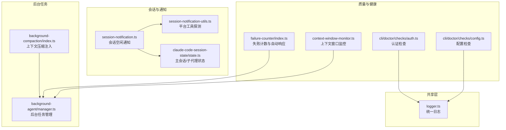
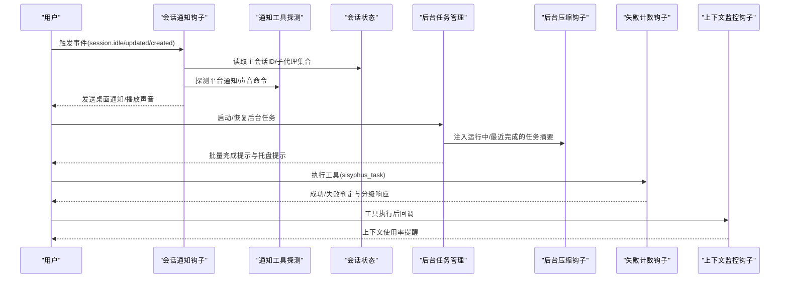
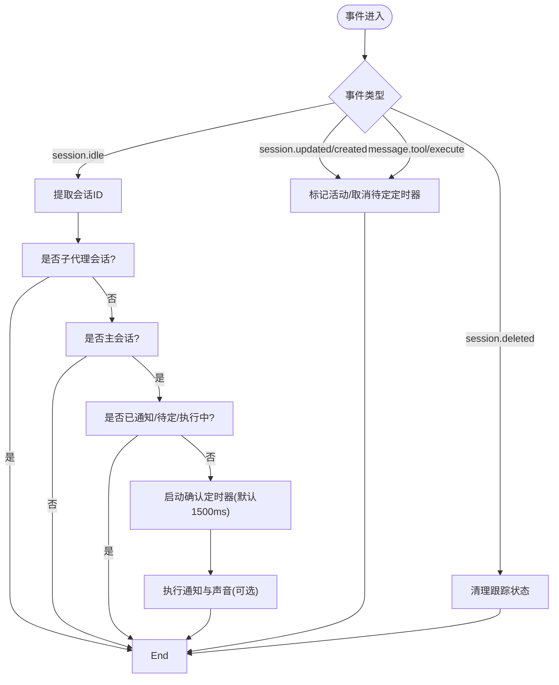
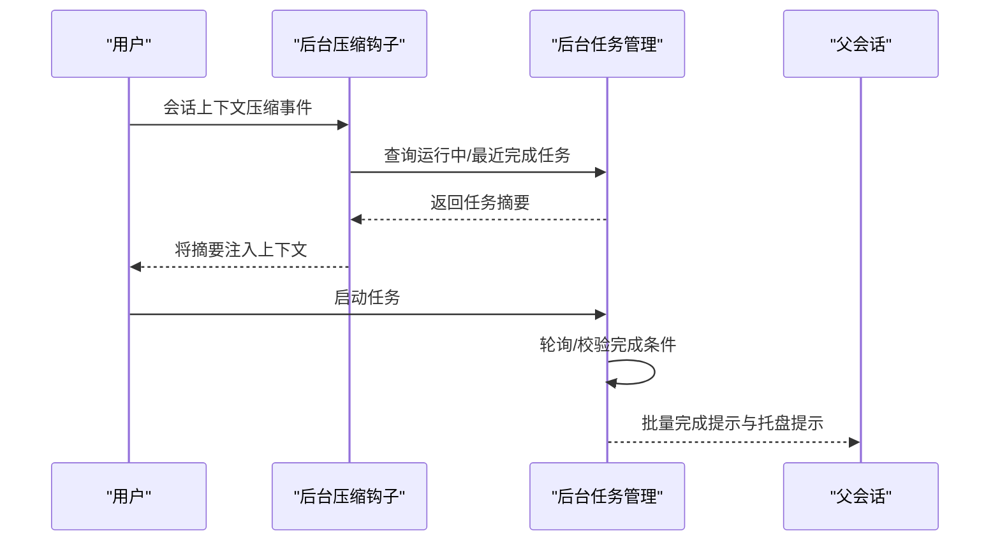
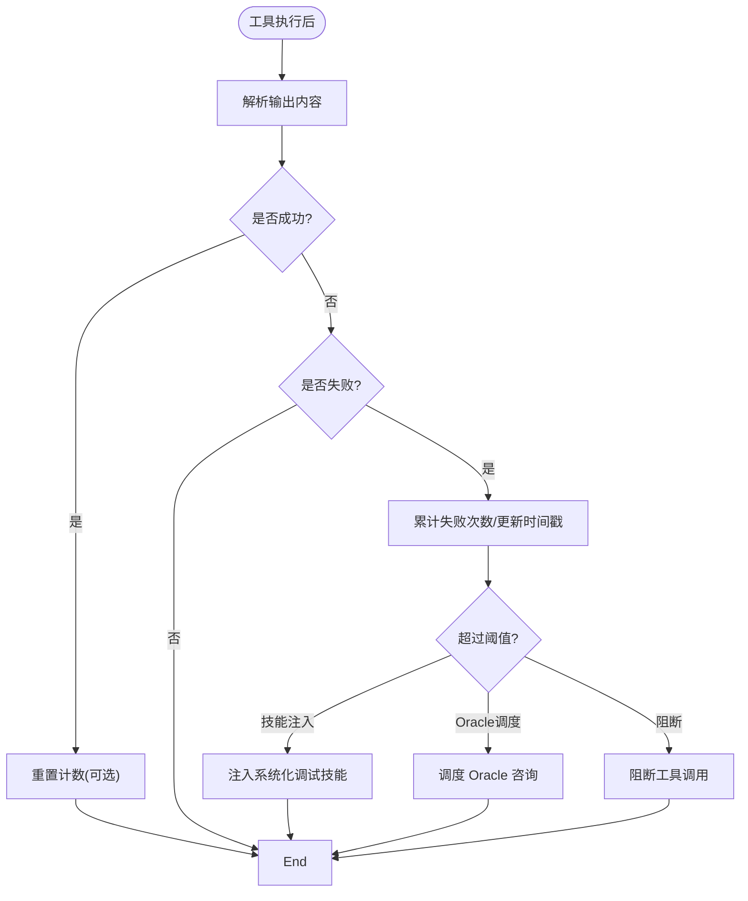
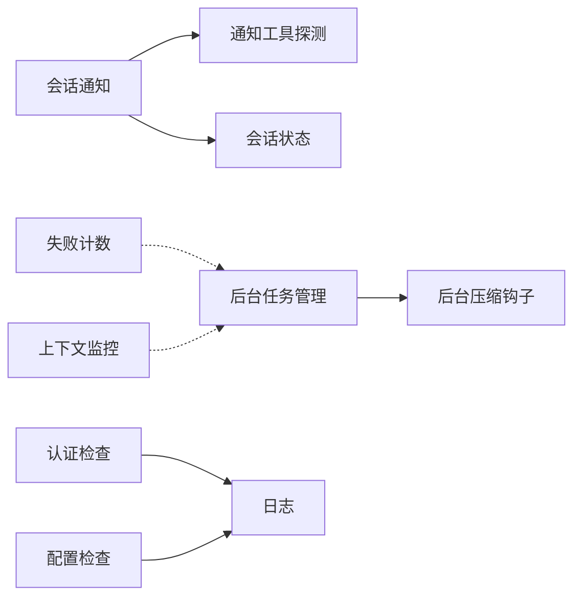

# 监控与维护

<cite>
**本文引用的文件**
- [src/shared/logger.ts](file://src/shared/logger.ts)
- [src/hooks/session-notification.ts](file://src/hooks/session-notification.ts)
- [src/hooks/session-notification-utils.ts](file://src/hooks/session-notification-utils.ts)
- [src/features/claude-code-session-state/state.ts](file://src/features/claude-code-session-state/state.ts)
- [src/hooks/background-compaction/index.ts](file://src/hooks/background-compaction/index.ts)
- [src/features/background-agent/manager.ts](file://src/features/background-agent/manager.ts)
- [src/hooks/failure-counter/index.ts](file://src/hooks/failure-counter/index.ts)
- [src/hooks/context-window-monitor.ts](file://src/hooks/context-window-monitor.ts)
- [src/cli/doctor/checks/auth.ts](file://src/cli/doctor/checks/auth.ts)
- [src/cli/doctor/checks/config.ts](file://src/cli/doctor/checks/config.ts)
</cite>

## 目录
1. [简介](#简介)
2. [项目结构](#项目结构)
3. [核心组件](#核心组件)
4. [架构总览](#架构总览)
5. [详细组件分析](#详细组件分析)
6. [依赖关系分析](#依赖关系分析)
7. [性能考量](#性能考量)
8. [故障排查指南](#故障排查指南)
9. [结论](#结论)
10. [附录](#附录)

## 简介
本指南面向 Oh My OpenCode 的运维与开发团队，提供系统监控与维护的完整方案。内容覆盖：
- 监控指标与健康检查方法
- 会话通知与日志记录最佳实践
- 后台压缩与清理策略
- 诊断工具使用与故障排查
- 性能监控与异常告警配置
- 定期维护与系统优化流程
- 实际监控案例与运维经验
- 运维体系与应急预案建设

## 项目结构
围绕监控与维护的关键模块主要分布在以下位置：
- 共享日志：统一的日志写入与路径暴露
- 会话通知：跨平台桌面通知与声音提醒
- 后台任务：后台代理管理、上下文压缩注入、完成通知
- 失败计数：对特定工具的连续失败进行分级响应
- 上下文窗口监控：基于实际输入令牌使用率的提醒
- 健康检查：认证与配置的 CLI 自检

**图表来源**
- [src/shared/logger.ts](file://src/shared/logger.ts#L1-L21)
- [src/hooks/session-notification.ts](file://src/hooks/session-notification.ts#L1-L331)
- [src/hooks/session-notification-utils.ts](file://src/hooks/session-notification-utils.ts#L1-L141)
- [src/features/claude-code-session-state/state.ts](file://src/features/claude-code-session-state/state.ts#L1-L38)
- [src/hooks/background-compaction/index.ts](file://src/hooks/background-compaction/index.ts#L1-L86)
- [src/features/background-agent/manager.ts](file://src/features/background-agent/manager.ts#L1-L800)
- [src/hooks/failure-counter/index.ts](file://src/hooks/failure-counter/index.ts#L1-L338)
- [src/hooks/context-window-monitor.ts](file://src/hooks/context-window-monitor.ts#L1-L100)
- [src/cli/doctor/checks/auth.ts](file://src/cli/doctor/checks/auth.ts#L1-L116)
- [src/cli/doctor/checks/config.ts](file://src/cli/doctor/checks/config.ts#L1-L124)

**章节来源**
- [src/shared/logger.ts](file://src/shared/logger.ts#L1-L21)
- [src/hooks/session-notification.ts](file://src/hooks/session-notification.ts#L1-L331)
- [src/hooks/session-notification-utils.ts](file://src/hooks/session-notification-utils.ts#L1-L141)
- [src/features/claude-code-session-state/state.ts](file://src/features/claude-code-session-state/state.ts#L1-L38)
- [src/hooks/background-compaction/index.ts](file://src/hooks/background-compaction/index.ts#L1-L86)
- [src/features/background-agent/manager.ts](file://src/features/background-agent/manager.ts#L1-L800)
- [src/hooks/failure-counter/index.ts](file://src/hooks/failure-counter/index.ts#L1-L338)
- [src/hooks/context-window-monitor.ts](file://src/hooks/context-window-monitor.ts#L1-L100)
- [src/cli/doctor/checks/auth.ts](file://src/cli/doctor/checks/auth.ts#L1-L116)
- [src/cli/doctor/checks/config.ts](file://src/cli/doctor/checks/config.ts#L1-L124)

## 核心组件
- 统一日志：将运行日志写入临时目录文件，便于集中收集与分析
- 会话通知：在会话空闲时按平台发送桌面通知与可选声音，支持待办未完成跳过
- 后台任务：创建/恢复/轮询后台任务，完成时向父会话批量提示与托盘提示
- 失败计数：对 sisyphus_task 连续失败进行分级处理（注入技能、调度 Oracle、阻断）
- 上下文窗口监控：基于最后一条助手消息的实际输入令牌使用率进行阈值提醒
- 健康检查：CLI doctor 认证与配置检查，输出安装/配置状态

**章节来源**
- [src/shared/logger.ts](file://src/shared/logger.ts#L1-L21)
- [src/hooks/session-notification.ts](file://src/hooks/session-notification.ts#L1-L331)
- [src/features/background-agent/manager.ts](file://src/features/background-agent/manager.ts#L1-L800)
- [src/hooks/failure-counter/index.ts](file://src/hooks/failure-counter/index.ts#L1-L338)
- [src/hooks/context-window-monitor.ts](file://src/hooks/context-window-monitor.ts#L1-L100)
- [src/cli/doctor/checks/auth.ts](file://src/cli/doctor/checks/auth.ts#L1-L116)
- [src/cli/doctor/checks/config.ts](file://src/cli/doctor/checks/config.ts#L1-L124)

## 架构总览
下图展示监控与维护相关组件之间的交互关系与数据流。

**图表来源**
- [src/hooks/session-notification.ts](file://src/hooks/session-notification.ts#L260-L331)
- [src/hooks/session-notification-utils.ts](file://src/hooks/session-notification-utils.ts#L129-L141)
- [src/features/claude-code-session-state/state.ts](file://src/features/claude-code-session-state/state.ts#L1-L38)
- [src/features/background-agent/manager.ts](file://src/features/background-agent/manager.ts#L461-L557)
- [src/hooks/background-compaction/index.ts](file://src/hooks/background-compaction/index.ts#L20-L84)
- [src/hooks/failure-counter/index.ts](file://src/hooks/failure-counter/index.ts#L124-L284)
- [src/hooks/context-window-monitor.ts](file://src/hooks/context-window-monitor.ts#L33-L99)

## 详细组件分析

### 会话通知与日志记录
- 功能要点
  - 平台探测与通知：根据操作系统选择通知/声音命令，避免无可用工具时报错
  - 空闲确认延迟：默认 1500ms，降低误触发概率
  - 待办检查：若存在未完成待办则跳过通知
  - 主会话过滤：仅对主会话触发，忽略子代理会话
  - 内存清理：限制跟踪会话数量，防止内存膨胀
  - 日志记录：统一写入临时目录日志文件，便于问题定位
- 最佳实践
  - 在 CI 或无人值守环境禁用声音与弹窗，或通过配置项关闭
  - 结合“待办检查”确保不会打断正在进行的工作
  - 对于多会话场景，正确设置主会话 ID，避免误触发
  - 定期清理旧会话跟踪，保持内存占用稳定

**图表来源**
- [src/hooks/session-notification.ts](file://src/hooks/session-notification.ts#L260-L331)
- [src/features/claude-code-session-state/state.ts](file://src/features/claude-code-session-state/state.ts#L1-L38)

**章节来源**
- [src/hooks/session-notification.ts](file://src/hooks/session-notification.ts#L1-L331)
- [src/hooks/session-notification-utils.ts](file://src/hooks/session-notification-utils.ts#L1-L141)
- [src/features/claude-code-session-state/state.ts](file://src/features/claude-code-session-state/state.ts#L1-L38)
- [src/shared/logger.ts](file://src/shared/logger.ts#L1-L21)

### 后台压缩与清理
- 功能要点
  - 上下文压缩注入：在会话上下文压缩前，将运行中与最近完成的后台任务摘要注入，避免丢失任务状态感知
  - 任务生命周期：创建、轮询、完成、错误、取消；完成时释放并发槽位并触发通知
  - 批量通知：按父会话聚合后台任务完成，减少重复提示
  - 清理策略：定期清理已完成任务、父会话待定队列、进程退出清理
- 最佳实践
  - 合理设置并发组，避免热点代理导致排队
  - 对长时间运行任务设置超时与稳定性判断，防止僵尸任务
  - 使用“最近完成任务”保留窗口，便于回溯与检索

**图表来源**
- [src/hooks/background-compaction/index.ts](file://src/hooks/background-compaction/index.ts#L19-L84)
- [src/features/background-agent/manager.ts](file://src/features/background-agent/manager.ts#L461-L557)
- [src/features/background-agent/manager.ts](file://src/features/background-agent/manager.ts#L766-L800)

**章节来源**
- [src/hooks/background-compaction/index.ts](file://src/hooks/background-compaction/index.ts#L1-L86)
- [src/features/background-agent/manager.ts](file://src/features/background-agent/manager.ts#L1-L800)

### 失败计数与异常告警
- 功能要点
  - 连续失败统计：对指定工具输出进行成功/失败模式匹配，统计会话内连续失败次数
  - 分级响应：第 1 次注入系统化调试技能；第 2 次调度 Oracle；第 3 次阻断工具调用
  - 窗口与重置：失败时间窗外重置；支持用户指令重置
- 最佳实践
  - 明确监控工具范围，避免误报
  - 在阻断期间引导用户介入，提供明确的重置步骤
  - 结合日志与上下文监控，快速定位失败根因

**图表来源**
- [src/hooks/failure-counter/index.ts](file://src/hooks/failure-counter/index.ts#L124-L284)

**章节来源**
- [src/hooks/failure-counter/index.ts](file://src/hooks/failure-counter/index.ts#L1-L338)

### 上下文窗口监控
- 功能要点
  - 基于最后一条助手消息的实际输入令牌与缓存读取计算使用率
  - 达到阈值（默认 70%）时在输出末尾追加提醒与上下文状态
  - 会话删除时清理提醒状态，避免重复提醒
- 最佳实践
  - 在高上下文模型场景下适当调整阈值
  - 结合后台压缩钩子，减少冗余上下文，提高使用率控制效果

**章节来源**
- [src/hooks/context-window-monitor.ts](file://src/hooks/context-window-monitor.ts#L1-L100)

### 健康检查与诊断
- 认证检查：检测认证插件是否安装、配置是否可用
- 配置检查：验证用户或项目级配置文件格式与结构有效性
- 最佳实践
  - 定期运行 doctor 命令，提前发现认证缺失与配置错误
  - 将健康检查纳入 CI 步骤，保证部署一致性

**章节来源**
- [src/cli/doctor/checks/auth.ts](file://src/cli/doctor/checks/auth.ts#L1-L116)
- [src/cli/doctor/checks/config.ts](file://src/cli/doctor/checks/config.ts#L1-L124)

## 依赖关系分析
- 会话通知依赖平台工具探测与会话状态，避免在不支持的平台上产生异常
- 后台任务管理依赖客户端 API 与并发控制器，完成时通过钩子与托盘管理器进行通知
- 失败计数与上下文监控作为钩子独立运行，不直接耦合核心业务逻辑
- 健康检查通过 CLI 子模块提供，与运行时监控解耦

**图表来源**
- [src/hooks/session-notification.ts](file://src/hooks/session-notification.ts#L1-L331)
- [src/hooks/session-notification-utils.ts](file://src/hooks/session-notification-utils.ts#L1-L141)
- [src/features/claude-code-session-state/state.ts](file://src/features/claude-code-session-state/state.ts#L1-L38)
- [src/features/background-agent/manager.ts](file://src/features/background-agent/manager.ts#L1-L800)
- [src/hooks/background-compaction/index.ts](file://src/hooks/background-compaction/index.ts#L1-L86)
- [src/hooks/failure-counter/index.ts](file://src/hooks/failure-counter/index.ts#L1-L338)
- [src/hooks/context-window-monitor.ts](file://src/hooks/context-window-monitor.ts#L1-L100)
- [src/cli/doctor/checks/auth.ts](file://src/cli/doctor/checks/auth.ts#L1-L116)
- [src/cli/doctor/checks/config.ts](file://src/cli/doctor/checks/config.ts#L1-L124)
- [src/shared/logger.ts](file://src/shared/logger.ts#L1-L21)

## 性能考量
- 通知与声音探测采用惰性初始化与缓存，避免重复查找
- 会话通知使用定时器与版本号机制，防止竞态与重复执行
- 后台任务轮询间隔与并发控制平衡吞吐与资源占用
- 上下文监控仅在工具执行后触发，开销极低
- 建议在高负载场景下：
  - 适度延长空闲确认延迟，减少误触发
  - 控制后台任务并发组，避免热点代理争用
  - 启用后台压缩钩子，降低上下文体积

[本节为通用指导，无需列出具体文件来源]

## 故障排查指南
- 无法收到通知
  - 检查平台工具是否存在（macOS 的 osascript/afplay、Linux 的 notify-send/paplay/aplay、Windows 的 powershell）
  - 确认会话为主会话且非子代理
  - 查看日志文件定位错误
- 通知频繁误触发
  - 提升空闲确认延迟或启用“待办检查”
  - 确保会话有活动时及时调用“标记活动”逻辑
- 后台任务未完成或卡住
  - 检查任务是否满足“最小稳定时间”与“有效输出”条件
  - 查看任务状态与错误信息，必要时重启或取消
- 连续失败导致阻断
  - 使用重置命令清除阻断状态，重新评估失败原因
  - 引导用户介入，避免自动流程继续失败
- 上下文使用率过高
  - 启用后台压缩钩子，减少冗余上下文
  - 调整阈值或优化提示词长度

**章节来源**
- [src/hooks/session-notification-utils.ts](file://src/hooks/session-notification-utils.ts#L1-L141)
- [src/hooks/session-notification.ts](file://src/hooks/session-notification.ts#L1-L331)
- [src/features/background-agent/manager.ts](file://src/features/background-agent/manager.ts#L461-L557)
- [src/hooks/failure-counter/index.ts](file://src/hooks/failure-counter/index.ts#L286-L334)
- [src/hooks/context-window-monitor.ts](file://src/hooks/context-window-monitor.ts#L1-L100)
- [src/shared/logger.ts](file://src/shared/logger.ts#L1-L21)

## 结论
通过统一日志、会话通知、后台任务管理、失败计数与上下文监控等能力，Oh My OpenCode 形成了可观测、可维护、可扩展的运行时体系。结合 CLI 健康检查与定期维护流程，可显著提升系统稳定性与用户体验。建议将上述监控与维护实践纳入标准运维手册，并在 CI 中集成健康检查，确保部署一致性与早期问题发现。

[本节为总结性内容，无需列出具体文件来源]

## 附录

### 监控指标与健康检查清单
- 会话通知
  - 是否支持平台通知/声音
  - 空闲确认延迟是否合理
  - 是否正确过滤主会话
- 后台任务
  - 运行中/最近完成任务数量
  - 并发槽位释放情况
  - 完成通知是否按父会话聚合
- 失败计数
  - 失败次数统计与时间窗
  - 分级响应是否生效
- 上下文监控
  - 实际使用率是否超过阈值
  - 提醒是否按会话去重
- 健康检查
  - 认证插件是否安装
  - 配置文件格式与结构是否有效

**章节来源**
- [src/hooks/session-notification.ts](file://src/hooks/session-notification.ts#L1-L331)
- [src/features/background-agent/manager.ts](file://src/features/background-agent/manager.ts#L1-L800)
- [src/hooks/failure-counter/index.ts](file://src/hooks/failure-counter/index.ts#L1-L338)
- [src/hooks/context-window-monitor.ts](file://src/hooks/context-window-monitor.ts#L1-L100)
- [src/cli/doctor/checks/auth.ts](file://src/cli/doctor/checks/auth.ts#L1-L116)
- [src/cli/doctor/checks/config.ts](file://src/cli/doctor/checks/config.ts#L1-L124)