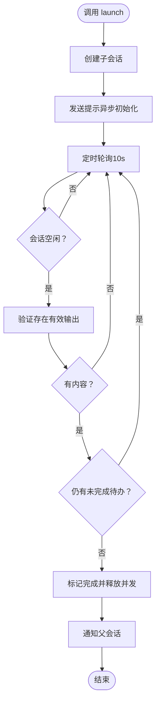
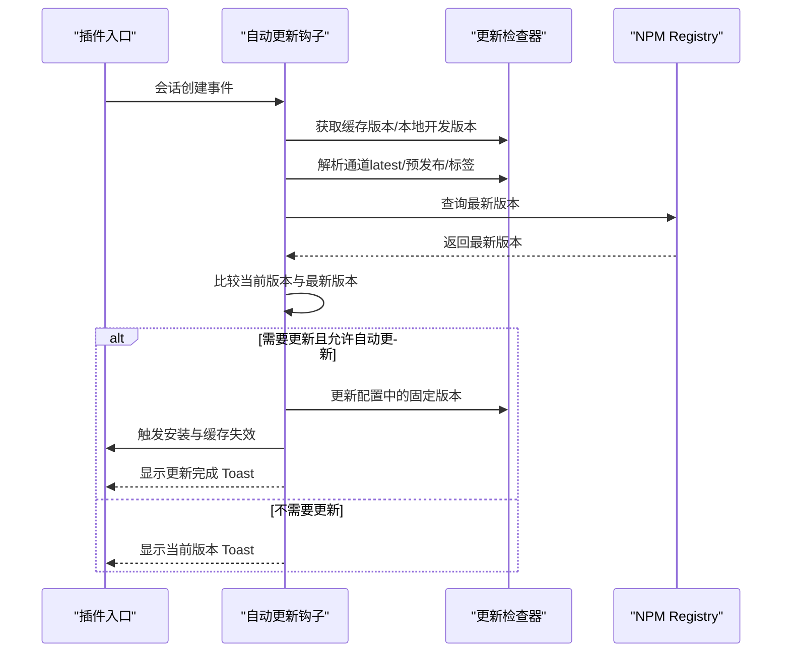
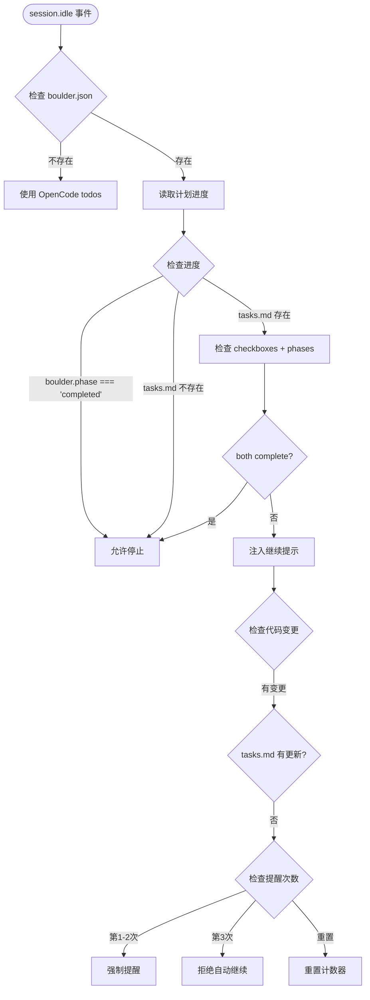
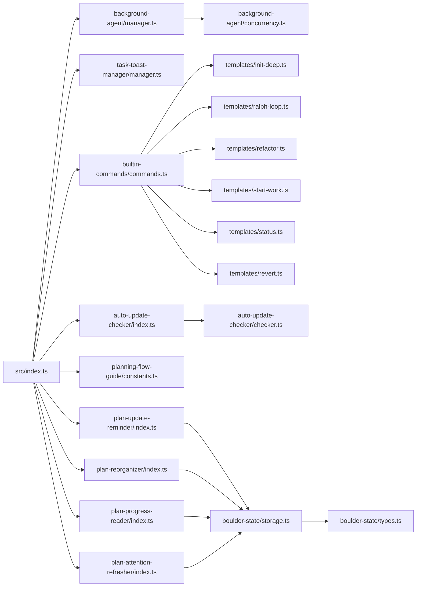

# 自动化工作流设计

<cite>
**本文引用的文件**
- [README.md](file://README.md)
- [package.json](file://package.json)
- [src/index.ts](file://src/index.ts)
- [src/cli/index.ts](file://src/cli/index.ts)
- [src/features/background-agent/manager.ts](file://src/features/background-agent/manager.ts)
- [src/features/background-agent/concurrency.ts](file://src/features/background-agent/concurrency.ts)
- [src/features/task-toast-manager/manager.ts](file://src/features/task-toast-manager/manager.ts)
- [src/features/builtin-commands/commands.ts](file://src/features/builtin-commands/commands.ts)
- [src/features/builtin-commands/templates/init-deep.ts](file://src/features/builtin-commands/templates/init-deep.ts)
- [src/features/builtin-commands/templates/ralph-loop.ts](file://src/features/builtin-commands/templates/ralph-loop.ts)
- [src/features/builtin-commands/templates/refactor.ts](file://src/features/builtin-commands/templates/refactor.ts)
- [src/features/builtin-commands/templates/start-work.ts](file://src/features/builtin-commands/templates/start-work.ts)
- [src/features/builtin-commands/templates/status.ts](file://src/features/builtin-commands/templates/status.ts)
- [src/features/builtin-commands/templates/revert.ts](file://src/features/builtin-commands/templates/revert.ts)
- [src/hooks/auto-update-checker/index.ts](file://src/hooks/auto-update-checker/index.ts)
- [src/hooks/auto-update-checker/checker.ts](file://src/hooks/auto-update-checker/checker.ts)
- [src/hooks/planning-flow-guide/constants.ts](file://src/hooks/planning-flow-guide/constants.ts)
- [src/hooks/plan-update-reminder/index.ts](file://src/hooks/plan-update-reminder/index.ts)
- [src/features/plan-reorganizer/index.ts](file://src/features/plan-reorganizer/index.ts)
- [src/features/plan-reorganizer/reorganize.ts](file://src/features/plan-reorganizer/reorganize.ts)
- [src/features/plan-progress-reader/index.ts](file://src/features/plan-progress-reader/index.ts)
- [src/features/plan-progress-reader/reader.ts](file://src/features/plan-progress-reader/reader.ts)
- [src/hooks/plan-attention-refresher/index.ts](file://src/hooks/plan-attention-refresher/index.ts)
- [src/features/boulder-state/types.ts](file://src/features/boulder-state/types.ts)
- [src/features/boulder-state/storage.ts](file://src/features/boulder-state/storage.ts)
- [src/hooks/todo-continuation-enforcer.ts](file://src/hooks/todo-continuation-enforcer.ts)
- [src/features/builtin-skills/executing-plans/SKILL.md](file://src/features/builtin-skills/executing-plans/SKILL.md)
- [changes/multi-manus-planning-integration/design.md](file://changes/multi-manus-planning-integration/design.md)
- [changes/multi-manus-planning-integration/proposal.md](file://changes/multi-manus-planning-integration/proposal.md)
- [changes/multi-manus-planning-integration/tasks.md](file://changes/multi-manus-planning-integration/tasks.md)
</cite>

## 更新摘要
**所做更改**
- 新增 Manu Planning 自动化流程集成章节
- 更新工作流管理机制，集成新的钩子和模块
- 增强 todo-continuation-enforcer 的完成检测逻辑
- 新增 plan-progress-reader 读取模块
- 新增 plan-reorganizer 文档重组功能
- 新增 plan-update-reminder 状态提醒钩子
- 新增 plan-attention-refresher 注意力刷新钩子
- 更新 boulder-state 类型定义，支持 TaskPhaseInfo
- 增强执行技能，集成 Manus 原则

## 目录
1. [引言](#引言)
2. [项目结构](#项目结构)
3. [核心组件](#核心组件)
4. [架构总览](#架构总览)
5. [详细组件分析](#详细组件分析)
6. [Manu Planning 自动化流程集成](#manu-planning-自动化流程集成)
7. [工作流管理机制](#工作流管理机制)
8. [依赖关系分析](#依赖关系分析)
9. [性能考量](#性能考量)
10. [故障排查指南](#故障排查指南)
11. [结论](#结论)
12. [附录](#附录)

## 引言
本指南面向希望在 Oh My OpenCode 生态中设计与落地"自动化工作流"的工程师与技术作者。文档聚焦以下主题：
- 如何设计与实现自动化任务流程（含后台代理、并发控制、状态追踪与通知）
- 后台代理管理器的使用与配置方法
- 任务提示管理与通知系统最佳实践
- 自动更新检查与版本管理的自动化策略
- 内置命令的自动化集成方法
- 在 CI/CD 中的自动化工作流设计思路
- **新增：Manu Planning 自动化流程集成**
- **新增：工作流管理机制的增强**
- 实际自动化案例与配置示例
- 稳定性监控与维护建议

## 项目结构
该仓库采用模块化分层组织，核心入口为插件主文件，围绕"钩子（hooks）""工具（tools）""特性（features）""CLI"等维度构建。关键目录与职责概览：
- src/index.ts：插件入口，注册所有钩子、工具与特性，协调后台代理与通知
- src/features/background-agent：后台代理生命周期管理、并发控制、事件处理
- src/features/task-toast-manager：任务状态可视化与通知聚合
- src/features/builtin-commands：内置命令定义与模板，支持自动化执行与状态管理
- src/hooks/auto-update-checker：自动更新检查与版本管理
- src/hooks/planning-flow-guide：规划流程指导钩子
- src/hooks/plan-update-reminder：计划更新提醒钩子
- src/features/plan-reorganizer：计划文档重组模块
- src/features/plan-progress-reader：计划进度读取模块
- src/hooks/plan-attention-refresher：注意力刷新钩子
- src/features/boulder-state： Boulder 状态管理，支持任务阶段信息
- src/cli/index.ts：命令行入口，提供安装、运行、诊断、版本查询等能力
- package.json：构建脚本、二进制打包与依赖声明

```mermaid
graph TB
subgraph "插件入口"
IDX["src/index.ts"]
end
subgraph "后台代理"
BM["manager.ts<br/>后台任务管理"]
CM["concurrency.ts<br/>并发控制器"]
end
subgraph "通知与可视化"
TTM["task-toast-manager/manager.ts<br/>任务吐司管理器"]
end
subgraph "内置命令"
BC["builtin-commands/commands.ts<br/>命令定义"]
T_INIT["templates/init-deep.ts"]
T_RALPH["templates/ralph-loop.ts"]
T_REFACTOR["templates/refactor.ts"]
T_START["templates/start-work.ts"]
T_STATUS["templates/status.ts"]
T_REVERT["templates/revert.ts"]
end
subgraph "自动更新"
AU_IDX["hooks/auto-update-checker/index.ts"]
AU_CHK["hooks/auto-update-checker/checker.ts"]
end
subgraph "规划流程钩子"
PFG["planning-flow-guide/constants.ts<br/>规划流程指导"]
PUR["plan-update-reminder/index.ts<br/>计划更新提醒"]
PAR["plan-reorganizer/index.ts<br/>计划重组模块"]
PPR["plan-progress-reader/index.ts<br/>进度读取模块"]
PAR2["plan-attention-refresher/index.ts<br/>注意力刷新"]
end
subgraph "Boulder 状态管理"
BS_TYPES["boulder-state/types.ts<br/>类型定义"]
BS_STORAGE["boulder-state/storage.ts<br/>状态存储"]
end
subgraph "CLI"
CLI["src/cli/index.ts"]
end
IDX --> BM
IDX --> TTM
IDX --> BC
IDX --> AU_IDX
IDX --> PFG
IDX --> PUR
IDX --> PAR
IDX --> PPR
IDX --> PAR2
CLI --> IDX
BM --> CM
BC --> T_INIT
BC --> T_RALPH
BC --> T_REFACTOR
BC --> T_START
BC --> T_STATUS
BC --> T_REVERT
AU_IDX --> AU_CHK
PFG --> BS_STORAGE
PUR --> BS_STORAGE
PAR --> BS_STORAGE
PPR --> BS_STORAGE
PAR2 --> BS_STORAGE
BS_STORAGE --> BS_TYPES
```

**图表来源**
- [src/index.ts](file://src/index.ts#L92-L200)
- [src/features/background-agent/manager.ts](file://src/features/background-agent/manager.ts#L52-L800)
- [src/features/background-agent/concurrency.ts](file://src/features/background-agent/concurrency.ts#L15-L138)
- [src/features/task-toast-manager/manager.ts](file://src/features/task-toast-manager/manager.ts#L7-L215)
- [src/features/builtin-commands/commands.ts](file://src/features/builtin-commands/commands.ts#L10-L109)
- [src/features/builtin-commands/templates/init-deep.ts](file://src/features/builtin-commands/templates/init-deep.ts#L1-L301)
- [src/features/builtin-commands/templates/ralph-loop.ts](file://src/features/builtin-commands/templates/ralph-loop.ts#L1-L39)
- [src/features/builtin-commands/templates/refactor.ts](file://src/features/builtin-commands/templates/refactor.ts#L1-L620)
- [src/features/builtin-commands/templates/start-work.ts](file://src/features/builtin-commands/templates/start-work.ts#L1-L79)
- [src/features/builtin-commands/templates/status.ts](file://src/features/builtin-commands/templates/status.ts#L1-L73)
- [src/features/builtin-commands/templates/revert.ts](file://src/features/builtin-commands/templates/revert.ts#L1-L119)
- [src/hooks/auto-update-checker/index.ts](file://src/hooks/auto-update-checker/index.ts#L46-L261)
- [src/hooks/auto-update-checker/checker.ts](file://src/hooks/auto-update-checker/checker.ts#L1-L285)
- [src/hooks/planning-flow-guide/constants.ts](file://src/hooks/planning-flow-guide/constants.ts#L1-L42)
- [src/hooks/plan-update-reminder/index.ts](file://src/hooks/plan-update-reminder/index.ts#L1-L73)
- [src/features/plan-reorganizer/index.ts](file://src/features/plan-reorganizer/index.ts#L1-L9)
- [src/features/plan-progress-reader/index.ts](file://src/features/plan-progress-reader/index.ts#L1-L10)
- [src/hooks/plan-attention-refresher/index.ts](file://src/hooks/plan-attention-refresher/index.ts#L1-L140)
- [src/features/boulder-state/types.ts](file://src/features/boulder-state/types.ts#L1-L131)
- [src/features/boulder-state/storage.ts](file://src/features/boulder-state/storage.ts#L1-L200)
- [src/cli/index.ts](file://src/cli/index.ts#L1-L147)

**章节来源**
- [README.md](file://README.md#L1-L1250)
- [package.json](file://package.json#L1-L93)
- [src/index.ts](file://src/index.ts#L92-L200)
- [src/cli/index.ts](file://src/cli/index.ts#L1-L147)

## 核心组件
- 插件入口与钩子装配：在插件入口集中初始化钩子、工具与特性，并在会话事件、消息事件、工具执行前后注入自动化逻辑。
- 后台代理管理器：负责后台任务的创建、轮询、完成判定、并发控制与父会话通知。
- 任务吐司管理器：统一展示任务列表、排队与完成通知，支持并发信息与模型回退提示。
- 内置命令与模板：提供可直接触发的自动化流程（如初始化知识库、自循环开发、重构、开始工作、状态查询、回滚）。
- 自动更新检查：在会话创建时进行版本检查，支持本地开发模式识别、通道解析、自动更新与重启提示。
- **新增：Manu Planning 集成**：通过多个专用钩子和模块实现 Manus 原则的自动化集成，包括计划更新提醒、文档重组、进度读取和注意力刷新。

**章节来源**
- [src/index.ts](file://src/index.ts#L92-L200)
- [src/features/background-agent/manager.ts](file://src/features/background-agent/manager.ts#L52-L800)
- [src/features/task-toast-manager/manager.ts](file://src/features/task-toast-manager/manager.ts#L7-L215)
- [src/features/builtin-commands/commands.ts](file://src/features/builtin-commands/commands.ts#L10-L109)
- [src/hooks/auto-update-checker/index.ts](file://src/hooks/auto-update-checker/index.ts#L46-L261)
- [src/hooks/planning-flow-guide/constants.ts](file://src/hooks/planning-flow-guide/constants.ts#L1-L42)
- [src/hooks/plan-update-reminder/index.ts](file://src/hooks/plan-update-reminder/index.ts#L1-L73)
- [src/features/plan-reorganizer/reorganize.ts](file://src/features/plan-reorganizer/reorganize.ts#L1-L241)
- [src/features/plan-progress-reader/reader.ts](file://src/features/plan-progress-reader/reader.ts#L1-L171)
- [src/hooks/plan-attention-refresher/index.ts](file://src/hooks/plan-attention-refresher/index.ts#L1-L140)

## 架构总览
下图展示了自动化工作流的关键交互：插件入口作为中枢，后台代理管理器与任务吐司管理器协同工作；内置命令通过模板驱动自动化流程；自动更新钩子在会话创建时触发版本检查与更新策略；**新增的 Manu Planning 集成模块**通过多个钩子实现完整的自动化工作流管理。

```mermaid
sequenceDiagram
participant User as "用户"
participant CLI as "CLI 命令"
participant Plugin as "插件入口(src/index.ts)"
participant BG as "后台代理管理器"
participant TTM as "任务吐司管理器"
participant AU as "自动更新钩子"
participant PFG as "规划流程指导"
participant PUR as "计划更新提醒"
participant PAR as "计划重组"
participant PPR as "进度读取"
User->>CLI : 触发命令如 run/install/doctor
CLI->>Plugin : 初始化并加载配置
Plugin->>AU : 会话创建事件触发更新检查
Plugin->>PFG : 规划流程指导
Plugin->>BG : 注册后台任务/并发控制
Plugin->>TTM : 初始化任务吐司管理器
User->>Plugin : 执行内置命令如 /init-deep /refactor
Plugin->>BG : 启动后台任务explore/librarian 等
Plugin->>PUR : 代码变更后提醒更新 tasks.md
Plugin->>PAR : 编辑 tasks.md 后重组文档
Plugin->>PPR : 读取计划进度信息
BG-->>TTM : 推送任务状态运行/排队/完成
BG-->>Plugin : 通知父会话任务完成
Plugin-->>User : 展示启动/更新/完成通知
```

**图表来源**
- [src/index.ts](file://src/index.ts#L92-L200)
- [src/features/background-agent/manager.ts](file://src/features/background-agent/manager.ts#L52-L800)
- [src/features/task-toast-manager/manager.ts](file://src/features/task-toast-manager/manager.ts#L7-L215)
- [src/hooks/auto-update-checker/index.ts](file://src/hooks/auto-update-checker/index.ts#L46-L261)
- [src/hooks/planning-flow-guide/constants.ts](file://src/hooks/planning-flow-guide/constants.ts#L1-L42)
- [src/hooks/plan-update-reminder/index.ts](file://src/hooks/plan-update-reminder/index.ts#L1-L73)
- [src/features/plan-reorganizer/reorganize.ts](file://src/features/plan-reorganizer/reorganize.ts#L1-L241)
- [src/features/plan-progress-reader/reader.ts](file://src/features/plan-progress-reader/reader.ts#L1-L171)
- [src/cli/index.ts](file://src/cli/index.ts#L1-L147)

## 详细组件分析

### 后台代理管理器（BackgroundManager）
- 职责：创建/恢复后台会话、跟踪任务进度、检测空闲与完成条件、并发控制、父会话通知与清理。
- 关键机制：
  - 会话空闲检测：最小运行时间门限与有效输出校验，避免过早完成。
  - 待办事项强制：任务完成前确保无未完成待办。
  - 并发控制：基于模型或提供商的配额队列，支持无限并发标记。
  - 通知聚合：按父会话批量推送完成通知，支持任务吐司展示。
- 典型流程：launch -> prompt -> 轮询 -> 验证输出 -> 完成/错误 -> 释放并发 -> 通知父会话。



**图表来源**
- [src/features/background-agent/manager.ts](file://src/features/background-agent/manager.ts#L461-L557)
- [src/features/background-agent/manager.ts](file://src/features/background-agent/manager.ts#L577-L631)
- [src/features/background-agent/manager.ts](file://src/features/background-agent/manager.ts#L736-L764)

**章节来源**
- [src/features/background-agent/manager.ts](file://src/features/background-agent/manager.ts#L52-L800)
- [src/features/background-agent/concurrency.ts](file://src/features/background-agent/concurrency.ts#L15-L138)

### 任务吐司管理器（TaskToastManager）
- 职责：统一展示任务列表、排队与完成通知；聚合并发信息与模型回退提示；支持动态刷新。
- 特性：
  - 运行中/排队任务排序与统计
  - 模型回退提示（继承/系统默认）
  - 动态 Toast 刷新，避免频繁闪烁
- 使用场景：后台任务启动、完成、并发变化时的可视化反馈。

**章节来源**
- [src/features/task-toast-manager/manager.ts](file://src/features/task-toast-manager/manager.ts#L7-L215)

### 内置命令与模板（Builtin Commands）
- 命令清单与模板：
  - init-deep：生成/更新分层 AGENTS.md，支持深度与增量模式
  - ralph-loop / ulw-loop：自循环开发，支持最大迭代与完成承诺
  - refactor：智能重构，包含意图确认、代码映射、测试评估、计划生成、确定性执行与最终验证
  - start-work：从变更计划启动 Sisyphus 工作流
  - status：显示当前变更执行状态（任务进度、分支、最近提交）
  - revert：按任务/阶段/变更级别回滚
- 集成方式：命令定义与模板由插件加载，可在会话中直接调用，配合后台代理与任务管理器实现自动化闭环。

**章节来源**
- [src/features/builtin-commands/commands.ts](file://src/features/builtin-commands/commands.ts#L10-L109)
- [src/features/builtin-commands/templates/init-deep.ts](file://src/features/builtin-commands/templates/init-deep.ts#L1-L301)
- [src/features/builtin-commands/templates/ralph-loop.ts](file://src/features/builtin-commands/templates/ralph-loop.ts#L1-L39)
- [src/features/builtin-commands/templates/refactor.ts](file://src/features/builtin-commands/templates/refactor.ts#L1-L620)
- [src/features/builtin-commands/templates/start-work.ts](file://src/features/builtin-commands/templates/start-work.ts#L1-L79)
- [src/features/builtin-commands/templates/status.ts](file://src/features/builtin-commands/templates/status.ts#L1-L73)
- [src/features/builtin-commands/templates/revert.ts](file://src/features/builtin-commands/templates/revert.ts#L1-L119)

### 自动更新检查与版本管理（Auto Update Checker）
- 功能要点：
  - 本地开发模式识别与跳过更新检查
  - 通道解析（latest/预发布/分发标签）
  - 最新版本获取与比较
  - 自动更新策略：可配置是否自动替换固定版本、执行安装、缓存失效与重启提示
  - 启动时展示版本与更新提示，支持带旋转动画的 Toast
- 适用场景：在会话创建时自动检查版本并在合适时机提示或应用更新。



**图表来源**
- [src/hooks/auto-update-checker/index.ts](file://src/hooks/auto-update-checker/index.ts#L46-L261)
- [src/hooks/auto-update-checker/checker.ts](file://src/hooks/auto-update-checker/checker.ts#L255-L285)

**章节来源**
- [src/hooks/auto-update-checker/index.ts](file://src/hooks/auto-update-checker/index.ts#L46-L261)
- [src/hooks/auto-update-checker/checker.ts](file://src/hooks/auto-update-checker/checker.ts#L1-L285)

### CLI 与自动化集成
- CLI 提供安装、运行、版本查询、健康检查等命令，便于在自动化脚本中直接调用。
- 运行命令支持超时控制与后台任务完成强制，适合在 CI/CD 中作为"一次性任务"执行。

**章节来源**
- [src/cli/index.ts](file://src/cli/index.ts#L1-L147)

## Manu Planning 自动化流程集成

### 规划流程指导钩子（Planning Flow Guide）
- 职责：指导用户按照推荐的规划流程顺序执行 Metis → Prometheus → Momus 三个阶段。
- 关键机制：
  - 定义推荐的规划流程顺序
  - 识别各阶段的代理名称模式
  - 提供非标准流程转换的警告信息
  - 为每个阶段提供指导信息

**章节来源**
- [src/hooks/planning-flow-guide/constants.ts](file://src/hooks/planning-flow-guide/constants.ts#L1-L42)

### 计划更新提醒钩子（Plan Update Reminder）
- 职责：在代码文件变更后提醒代理更新 tasks.md 计划状态。
- 关键机制：
  - 仅在 Edit 或 Write 工具执行后触发
  - 排除 Markdown 文件（包括 tasks.md）
  - 检查 boulder.json 是否存在且有活动计划
  - 追加提醒信息到工具输出

**章节来源**
- [src/hooks/plan-update-reminder/index.ts](file://src/hooks/plan-update-reminder/index.ts#L1-L73)

### 计划重组模块（Plan Reorganizer）
- 职责：将完成的阶段移动到 tasks.md 文档底部，保持活动工作可见。
- 关键机制：
  - 解析 tasks.md 中的所有阶段及其边界
  - 检测完成的阶段（所有复选框都是 [x]）
  - 将完成的阶段移动到 "## Completed Phases" 部分
  - 标题降级规则：将 ## Phase 移动后改为 ### Phase

**章节来源**
- [src/features/plan-reorganizer/index.ts](file://src/features/plan-reorganizer/index.ts#L1-L9)
- [src/features/plan-reorganizer/reorganize.ts](file://src/features/plan-reorganizer/reorganize.ts#L1-L241)

### 计划进度读取模块（Plan Progress Reader）
- 职责：只读解析 tasks.md 进度信息，实现"文件是真相来源"的设计理念。
- 关键机制：
  - 从 boulder.json 读取活动计划路径
  - 解析 tasks.md 中的复选框和阶段信息
  - 返回结构化的进度数据，包括详细信息
  - 只读操作，不调用任何 OpenCode API

**章节来源**
- [src/features/plan-progress-reader/index.ts](file://src/features/plan-progress-reader/index.ts#L1-L10)
- [src/features/plan-progress-reader/reader.ts](file://src/features/plan-progress-reader/reader.ts#L1-L171)

### 注意力刷新钩子（Plan Attention Refresher）
- 职责：在主要工具操作前将 tasks.md 内容刷新到代理的注意力窗口。
- 关键机制：
  - 在 tool.execute.before 事件触发
  - 仅在特定工具（write, edit, bash, read）执行前触发
  - 检查 boulder.json 是否存在且有活动计划
  - 读取 tasks.md 前 30 行并添加到工具输出

**章节来源**
- [src/hooks/plan-attention-refresher/index.ts](file://src/hooks/plan-attention-refresher/index.ts#L1-L140)

### 增强的 Boulder 状态管理
- 新增 TaskPhaseInfo 类型：区分工作流阶段状态和任务计划阶段状态
- 增强 getPlanProgress()：支持 Manus 风格的阶段语法解析
- 完成检测优先级：boulder.phase === "completed" > tasks.md > OpenCode todos

**章节来源**
- [src/features/boulder-state/types.ts](file://src/features/boulder-state/types.ts#L1-L131)
- [src/features/boulder-state/storage.ts](file://src/features/boulder-state/storage.ts#L140-L200)

## 工作流管理机制

### 增强的完成检测逻辑
todo-continuation-enforcer 现在集成了多种完成检测机制：



**图表来源**
- [src/hooks/todo-continuation-enforcer.ts](file://src/hooks/todo-continuation-enforcer.ts#L320-L420)

### Manus 原则集成
- **文件更新原则**：在研究、发现或浏览器操作后更新 findings.md，在完成每个任务/阶段后更新 progress.md
- **2-Action Rule**：每 2 次视图/浏览器操作后，将发现保存到 findings.md
- **3-Strike Protocol**：同一任务连续 3 次失败后停止尝试，记录失败并在 progress.md 中文档化
- **错误日志**：在 progress.md 中记录所有错误，包括尝试内容、失败原因、错误信息和尝试的潜在解决方案

**章节来源**
- [src/features/builtin-skills/executing-plans/SKILL.md](file://src/features/builtin-skills/executing-plans/SKILL.md#L686-L720)

## 依赖关系分析
- 插件入口依赖各特性模块（后台代理、任务吐司、内置命令、自动更新钩子），并通过工具集扩展能力。
- 后台代理管理器依赖并发控制器以实现资源配额与排队。
- 任务吐司管理器依赖插件客户端的 TUI 能力进行可视化展示。
- 自动更新钩子依赖配置加载与安装流程，确保更新后缓存与配置一致性。
- **新增：Manu Planning 集成模块**：plan-update-reminder 依赖 boulder-state，plan-reorganizer 依赖 boulder-state，plan-progress-reader 依赖 boulder-state，plan-attention-refresher 依赖 boulder-state。



**图表来源**
- [src/index.ts](file://src/index.ts#L92-L200)
- [src/features/background-agent/manager.ts](file://src/features/background-agent/manager.ts#L52-L800)
- [src/features/background-agent/concurrency.ts](file://src/features/background-agent/concurrency.ts#L15-L138)
- [src/features/task-toast-manager/manager.ts](file://src/features/task-toast-manager/manager.ts#L7-L215)
- [src/features/builtin-commands/commands.ts](file://src/features/builtin-commands/commands.ts#L10-L109)
- [src/features/builtin-commands/templates/init-deep.ts](file://src/features/builtin-commands/templates/init-deep.ts#L1-L301)
- [src/features/builtin-commands/templates/ralph-loop.ts](file://src/features/builtin-commands/templates/ralph-loop.ts#L1-L39)
- [src/features/builtin-commands/templates/refactor.ts](file://src/features/builtin-commands/templates/refactor.ts#L1-L620)
- [src/features/builtin-commands/templates/start-work.ts](file://src/features/builtin-commands/templates/start-work.ts#L1-L79)
- [src/features/builtin-commands/templates/status.ts](file://src/features/builtin-commands/templates/status.ts#L1-L73)
- [src/features/builtin-commands/templates/revert.ts](file://src/features/builtin-commands/templates/revert.ts#L1-L119)
- [src/hooks/auto-update-checker/index.ts](file://src/hooks/auto-update-checker/index.ts#L46-L261)
- [src/hooks/auto-update-checker/checker.ts](file://src/hooks/auto-update-checker/checker.ts#L1-L285)
- [src/hooks/planning-flow-guide/constants.ts](file://src/hooks/planning-flow-guide/constants.ts#L1-L42)
- [src/hooks/plan-update-reminder/index.ts](file://src/hooks/plan-update-reminder/index.ts#L1-L73)
- [src/features/plan-reorganizer/index.ts](file://src/features/plan-reorganizer/index.ts#L1-L9)
- [src/features/plan-progress-reader/index.ts](file://src/features/plan-progress-reader/index.ts#L1-L10)
- [src/hooks/plan-attention-refresher/index.ts](file://src/hooks/plan-attention-refresher/index.ts#L1-L140)
- [src/features/boulder-state/types.ts](file://src/features/boulder-state/types.ts#L1-L131)
- [src/features/boulder-state/storage.ts](file://src/features/boulder-state/storage.ts#L1-L200)

**章节来源**
- [src/index.ts](file://src/index.ts#L92-L200)

## 性能考量
- 并发控制：通过并发控制器限制模型/提供商的并发数，避免资源争抢；支持无限并发标记用于高吞吐场景。
- 轮询节流：后台任务轮询间隔为 10 秒，兼顾实时性与性能。
- 输出校验：在完成判定前进行有效输出校验，减少无效完成与重试开销。
- 通知聚合：按父会话批量通知，降低 UI 刷新频率与系统负载。
- 自动更新：仅在会话创建时触发一次检查，避免频繁网络请求。
- **新增：文件 I/O 优化**：plan-reorganizer 仅在检测到变更时才写入文件，避免不必要的磁盘操作。
- **新增：缓存机制**：plan-attention-refresher 使用会话级缓存避免频繁读取文件。

**章节来源**
- [src/features/background-agent/concurrency.ts](file://src/features/background-agent/concurrency.ts#L15-L138)
- [src/features/background-agent/manager.ts](file://src/features/background-agent/manager.ts#L659-L673)
- [src/features/background-agent/manager.ts](file://src/features/background-agent/manager.ts#L577-L631)
- [src/features/task-toast-manager/manager.ts](file://src/features/task-toast-manager/manager.ts#L150-L171)
- [src/hooks/auto-update-checker/index.ts](file://src/hooks/auto-update-checker/index.ts#L62-L96)
- [src/features/plan-reorganizer/reorganize.ts](file://src/features/plan-reorganizer/reorganize.ts#L230-L240)
- [src/hooks/plan-attention-refresher/index.ts](file://src/hooks/plan-attention-refresher/index.ts#L55-L66)

## 故障排查指南
- 后台任务未完成：
  - 检查是否存在未完成待办与空闲事件触发时机
  - 确认会话存在有效输出（文本/推理/工具结果）
  - 查看并发是否被占满导致排队
- 通知缺失：
  - 确认任务吐司管理器已初始化并与插件客户端关联
  - 检查父会话批量通知集合是否清空
- 自动更新失败：
  - 检查本地开发模式识别与通道解析
  - 确认安装流程与缓存失效是否成功
  - 查看配置加载错误提示与清理
- CLI 问题：
  - 使用 doctor 命令进行分类诊断（安装、配置、认证、依赖、工具、更新）
- **新增：Manu Planning 集成问题**：
  - 检查 boulder.json 是否正确创建和更新
  - 确认 tasks.md 文件格式是否符合 Manus 语法要求
  - 验证钩子是否正确注册和启用
  - 检查文件权限和路径配置

**章节来源**
- [src/features/background-agent/manager.ts](file://src/features/background-agent/manager.ts#L444-L557)
- [src/features/task-toast-manager/manager.ts](file://src/features/task-toast-manager/manager.ts#L150-L200)
- [src/hooks/auto-update-checker/index.ts](file://src/hooks/auto-update-checker/index.ts#L170-L188)
- [src/cli/index.ts](file://src/cli/index.ts#L108-L137)
- [src/hooks/plan-update-reminder/index.ts](file://src/hooks/plan-update-reminder/index.ts#L54-L58)
- [src/features/plan-reorganizer/reorganize.ts](file://src/features/plan-reorganizer/reorganize.ts#L145-L148)
- [src/features/plan-progress-reader/reader.ts](file://src/features/plan-progress-reader/reader.ts#L141-L146)

## 结论
通过将"后台代理管理器""任务吐司管理器""内置命令模板""自动更新钩子""**Manu Planning 集成模块**"与"CLI"有机整合，Oh My OpenCode 提供了可扩展、可观测、可维护的自动化工作流框架。**新增的 Manu Planning 集成通过多个专用钩子实现了完整的自动化工作流管理，包括计划更新提醒、文档重组、进度读取和注意力刷新，显著提升了复杂任务的执行效率和可靠性。**遵循并发控制、输出校验、通知聚合和文件真相来源的原则，可在复杂任务与 CI/CD 场景中稳定运行。

## 附录

### 自动化工作流设计步骤
- 明确目标：定义自动化任务的输入、期望输出与验收标准
- 选择工具：根据任务类型选择合适的内置命令模板（如 init-deep/refactor/ralph-loop）
- 启动后台代理：通过后台代理管理器创建子会话，设置并发与工具限制
- 跟踪状态：利用任务吐司管理器查看运行/排队/完成状态
- 完成判定：等待空闲事件与待办清空，确保有效输出
- 更新与通知：在会话创建时触发自动更新检查，必要时提示或应用更新
- 回滚与审计：提供按任务/阶段/变更级别的回滚能力
- **新增：Manu Planning 集成**：使用计划更新提醒、文档重组、进度读取和注意力刷新钩子实现自动化工作流管理

**章节来源**
- [src/features/builtin-commands/commands.ts](file://src/features/builtin-commands/commands.ts#L10-L109)
- [src/features/background-agent/manager.ts](file://src/features/background-agent/manager.ts#L461-L557)
- [src/features/task-toast-manager/manager.ts](file://src/features/task-toast-manager/manager.ts#L150-L200)
- [src/hooks/auto-update-checker/index.ts](file://src/hooks/auto-update-checker/index.ts#L62-L96)
- [src/hooks/plan-update-reminder/index.ts](file://src/hooks/plan-update-reminder/index.ts#L1-L73)
- [src/features/plan-reorganizer/reorganize.ts](file://src/features/plan-reorganizer/reorganize.ts#L1-L241)
- [src/features/plan-progress-reader/reader.ts](file://src/features/plan-progress-reader/reader.ts#L1-L171)
- [src/hooks/plan-attention-refresher/index.ts](file://src/hooks/plan-attention-refresher/index.ts#L1-L140)

### CI/CD 自动化工作流设计
- 安装与配置：
  - 使用 CLI 的安装命令进行非交互式安装，指定订阅与提供商参数
  - 在 CI 环境中设置认证与环境变量，避免交互提示
- 任务执行：
  - 使用 run 命令执行一次性任务，设置超时与代理参数
  - 将后台代理与任务吐司结合，输出任务进度与完成状态
- 版本与更新：
  - 在流水线开始时触发自动更新检查，确保使用最新版本
  - 对于固定版本场景，启用自动替换并缓存失效
- 健康检查：
  - 使用 doctor 命令进行阶段性诊断，输出 JSON 便于流水线解析
- **新增：Manu Planning 集成**：
  - 在 CI 环境中配置 boulder.json 和 tasks.md 文件
  - 确保计划更新提醒和文档重组钩子正常工作
  - 验证进度读取模块能够正确解析计划状态

**章节来源**
- [src/cli/index.ts](file://src/cli/index.ts#L22-L106)
- [src/hooks/auto-update-checker/index.ts](file://src/hooks/auto-update-checker/index.ts#L99-L158)
- [src/features/boulder-state/storage.ts](file://src/features/boulder-state/storage.ts#L1-L200)

### 实际自动化案例与配置示例
- 初始化分层知识库（init-deep）
  - 使用模板中的发现、评分、生成、审查四阶段流程，结合后台代理并行探索
  - 参考路径：[init-deep 模板](file://src/features/builtin-commands/templates/init-deep.ts#L1-L301)
- 自循环开发（ralph-loop / ulw-loop）
  - 通过命令模板定义循环规则与最大迭代次数，支持取消与完成承诺
  - 参考路径：[ralph-loop 模板](file://src/features/builtin-commands/templates/ralph-loop.ts#L1-L39)
- 智能重构（refactor）
  - 从意图确认到代码映射、测试评估、计划生成、确定性执行与最终验证
  - 参考路径：[refactor 模板](file://src/features/builtin-commands/templates/refactor.ts#L1-L620)
- 开始工作（start-work）
  - 从变更计划读取与状态恢复，进入 Sisyphus 工作流
  - 参考路径：[start-work 模板](file://src/features/builtin-commands/templates/start-work.ts#L1-L79)
- 状态查询（status）
  - 统计任务进度、分支与最近提交，辅助决策与审计
  - 参考路径：[status 模板](file://src/features/builtin-commands/templates/status.ts#L1-L73)
- 回滚（revert）
  - 支持任务/阶段/变更三个粒度的回滚与冲突处理
  - 参考路径：[revert 模板](file://src/features/builtin-commands/templates/revert.ts#L1-L119)
- **新增：Manu Planning 自动化工作流**
  - 使用 plan-update-reminder 钩子在代码变更后提醒更新 tasks.md
  - 通过 plan-reorganizer 模块自动将完成的阶段移动到文档底部
  - 利用 plan-progress-reader 模块只读解析计划进度信息
  - 通过 plan-attention-refresher 钩子在工具执行前刷新计划上下文

**章节来源**
- [src/features/builtin-commands/templates/init-deep.ts](file://src/features/builtin-commands/templates/init-deep.ts#L1-L301)
- [src/features/builtin-commands/templates/ralph-loop.ts](file://src/features/builtin-commands/templates/ralph-loop.ts#L1-L39)
- [src/features/builtin-commands/templates/refactor.ts](file://src/features/builtin-commands/templates/refactor.ts#L1-L620)
- [src/features/builtin-commands/templates/start-work.ts](file://src/features/builtin-commands/templates/start-work.ts#L1-L79)
- [src/features/builtin-commands/templates/status.ts](file://src/features/builtin-commands/templates/status.ts#L1-L73)
- [src/features/builtin-commands/templates/revert.ts](file://src/features/builtin-commands/templates/revert.ts#L1-L119)
- [src/hooks/plan-update-reminder/index.ts](file://src/hooks/plan-update-reminder/index.ts#L1-L73)
- [src/features/plan-reorganizer/reorganize.ts](file://src/features/plan-reorganizer/reorganize.ts#L1-L241)
- [src/features/plan-progress-reader/reader.ts](file://src/features/plan-progress-reader/reader.ts#L1-L171)
- [src/hooks/plan-attention-refresher/index.ts](file://src/hooks/plan-attention-refresher/index.ts#L1-L140)

### Manu Planning 集成配置示例

#### 基本配置
```json
{
  "disabled_hooks": ["plan-reorganizer", "plan-update-reminder", "plan-attention-refresher"],
  "checkbox_enforcement": {
    "enabled": true
  }
}
```

#### 执行技能增强
在 executing-plans 和 wave-parallel-execution 技能中集成 Manus 原则：

- **findings.md 更新**：在研究、发现或浏览器操作后及时更新
- **progress.md 更新**：完成每个任务/阶段后记录所有错误
- **2-Action Rule**：每 2 次视图/浏览器操作后保存发现
- **3-Strike Protocol**：连续 3 次失败后停止并记录
- **错误日志**：记录所有错误的详细信息

**章节来源**
- [src/features/builtin-skills/executing-plans/SKILL.md](file://src/features/builtin-skills/executing-plans/SKILL.md#L686-L720)
- [changes/multi-manus-planning-integration/design.md](file://changes/multi-manus-planning-integration/design.md#L1-L267)
- [changes/multi-manus-planning-integration/proposal.md](file://changes/multi-manus-planning-integration/proposal.md#L1-L137)
- [changes/multi-manus-planning-integration/tasks.md](file://changes/multi-manus-planning-integration/tasks.md#L1-L1037)