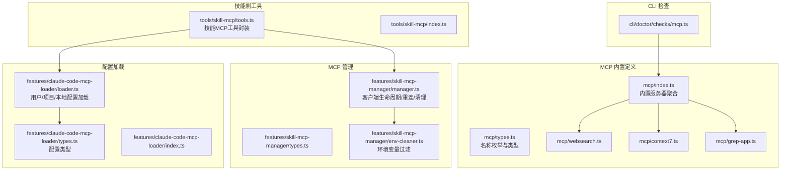
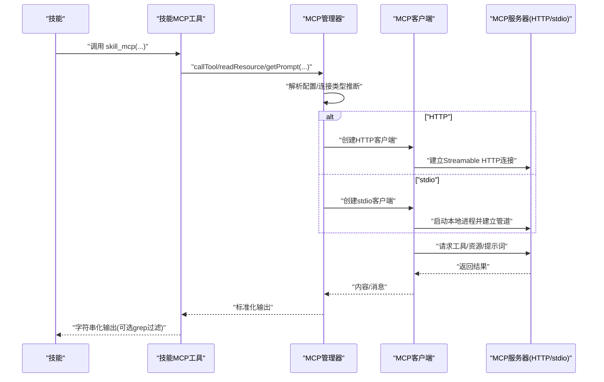
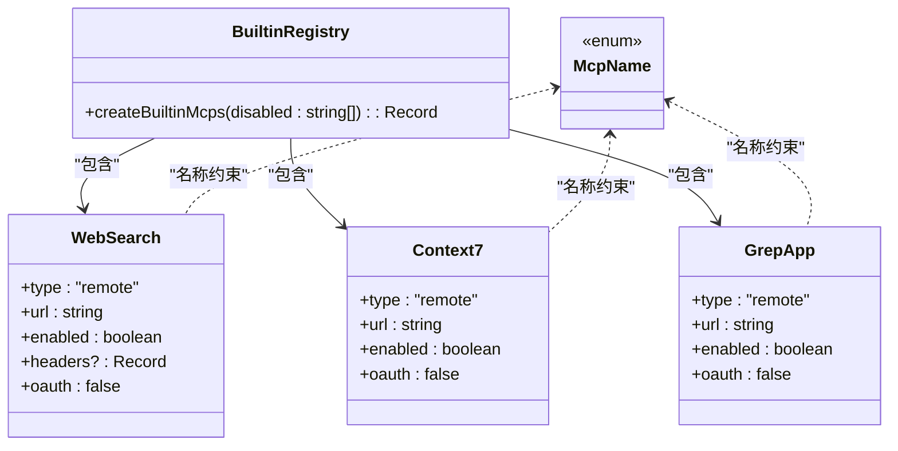
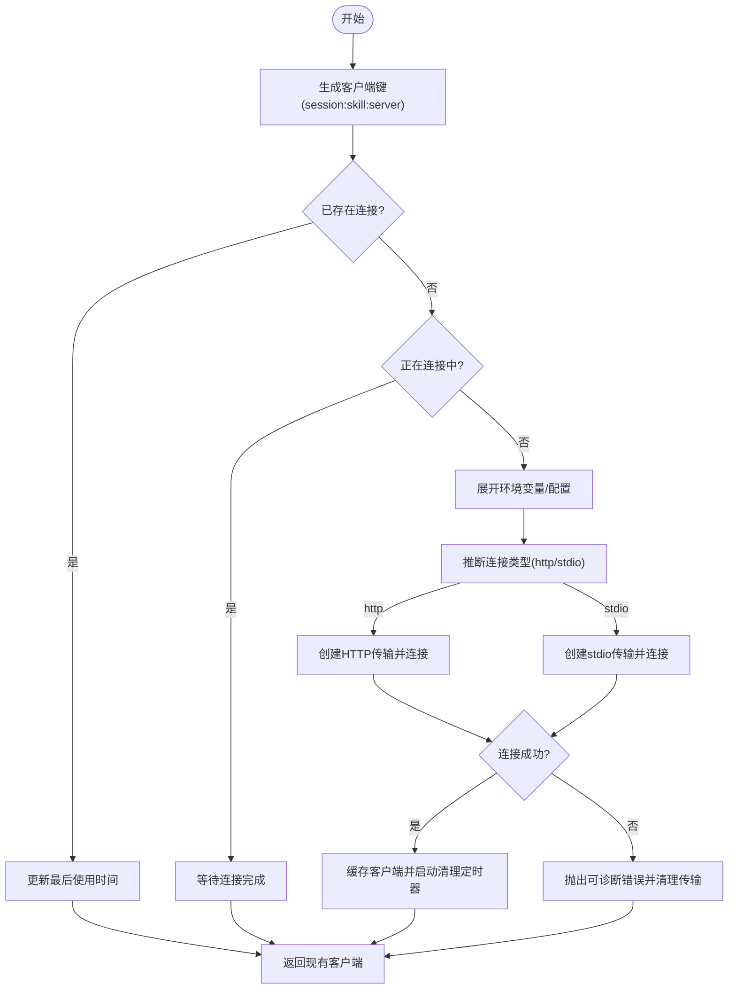
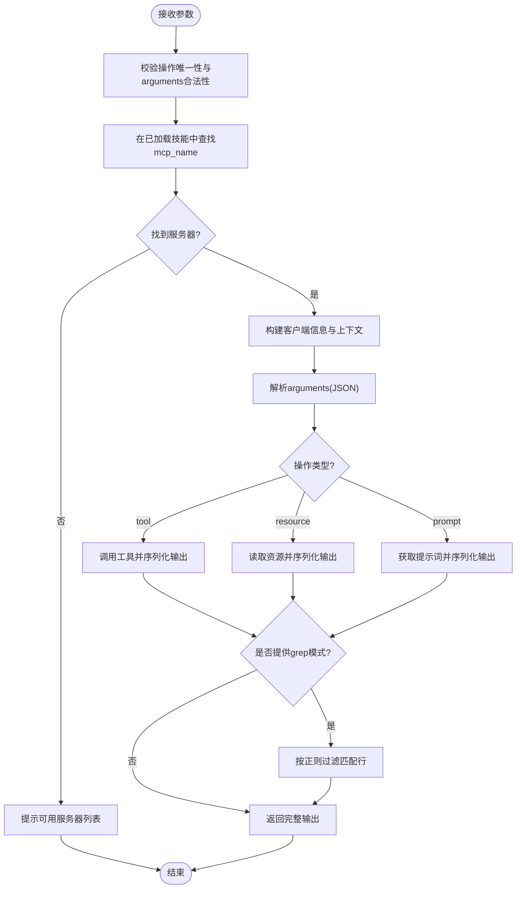
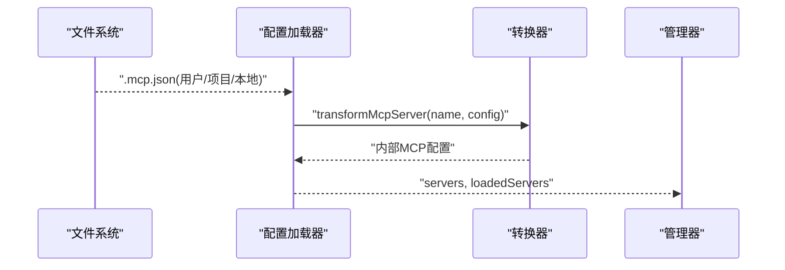
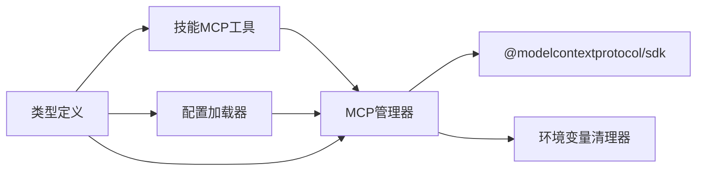

# MCP 协议支持

<cite>
**本文引用的文件**
- [src/mcp/index.ts](file://src/mcp/index.ts)
- [src/mcp/types.ts](file://src/mcp/types.ts)
- [src/mcp/websearch.ts](file://src/mcp/websearch.ts)
- [src/mcp/context7.ts](file://src/mcp/context7.ts)
- [src/mcp/grep-app.ts](file://src/mcp/grep-app.ts)
- [src/features/skill-mcp-manager/index.ts](file://src/features/skill-mcp-manager/index.ts)
- [src/features/skill-mcp-manager/manager.ts](file://src/features/skill-mcp-manager/manager.ts)
- [src/features/skill-mcp-manager/types.ts](file://src/features/skill-mcp-manager/types.ts)
- [src/features/skill-mcp-manager/env-cleaner.ts](file://src/features/skill-mcp-manager/env-cleaner.ts)
- [src/tools/skill-mcp/index.ts](file://src/tools/skill-mcp/index.ts)
- [src/tools/skill-mcp/tools.ts](file://src/tools/skill-mcp/tools.ts)
- [src/features/claude-code-mcp-loader/index.ts](file://src/features/claude-code-mcp-loader/index.ts)
- [src/features/claude-code-mcp-loader/loader.ts](file://src/features/claude-code-mcp-loader/loader.ts)
- [src/features/claude-code-mcp-loader/types.ts](file://src/features/claude-code-mcp-loader/types.ts)
- [src/cli/doctor/checks/mcp.ts](file://src/cli/doctor/checks/mcp.ts)
</cite>

## 目录
1. [简介](#简介)
2. [项目结构](#项目结构)
3. [核心组件](#核心组件)
4. [架构总览](#架构总览)
5. [详细组件分析](#详细组件分析)
6. [依赖关系分析](#依赖关系分析)
7. [性能考虑](#性能考虑)
8. [故障排查指南](#故障排查指南)
9. [结论](#结论)
10. [附录](#附录)

## 简介
本文件系统性阐述 Oh My OpenCode 对 MCP（模型上下文协议）的支持与实现，涵盖 MCP 服务器的发现、连接与管理机制，技能加载、工具注册与消息传递流程，以及与传统工具调用的差异与优势。文档还提供跨平台工具扩展思路、配置与调试技巧、性能优化策略，并给出使用示例与集成指南。

## 项目结构
围绕 MCP 的实现主要分布在以下模块：
- 内置 MCP 服务器定义与类型约束：src/mcp/*
- MCP 管理器：src/features/skill-mcp-manager/*
- 技能侧 MCP 工具封装：src/tools/skill-mcp/*
- Claude Code 风格 MCP 配置加载与转换：src/features/claude-code-mcp-loader/*
- CLI 健康检查：src/cli/doctor/checks/mcp.ts

图表来源
- [src/mcp/index.ts](file://src/mcp/index.ts#L1-L33)
- [src/mcp/types.ts](file://src/mcp/types.ts#L1-L10)
- [src/mcp/websearch.ts](file://src/mcp/websearch.ts#L1-L11)
- [src/mcp/context7.ts](file://src/mcp/context7.ts#L1-L7)
- [src/mcp/grep-app.ts](file://src/mcp/grep-app.ts#L1-L7)
- [src/tools/skill-mcp/tools.ts](file://src/tools/skill-mcp/tools.ts#L1-L173)
- [src/features/skill-mcp-manager/manager.ts](file://src/features/skill-mcp-manager/manager.ts#L1-L521)
- [src/features/skill-mcp-manager/env-cleaner.ts](file://src/features/skill-mcp-manager/env-cleaner.ts#L1-L28)
- [src/features/claude-code-mcp-loader/loader.ts](file://src/features/claude-code-mcp-loader/loader.ts#L1-L114)
- [src/features/claude-code-mcp-loader/types.ts](file://src/features/claude-code-mcp-loader/types.ts#L1-L43)
- [src/cli/doctor/checks/mcp.ts](file://src/cli/doctor/checks/mcp.ts#L1-L129)

章节来源
- [src/mcp/index.ts](file://src/mcp/index.ts#L1-L33)
- [src/mcp/types.ts](file://src/mcp/types.ts#L1-L10)
- [src/mcp/websearch.ts](file://src/mcp/websearch.ts#L1-L11)
- [src/mcp/context7.ts](file://src/mcp/context7.ts#L1-L7)
- [src/mcp/grep-app.ts](file://src/mcp/grep-app.ts#L1-L7)
- [src/features/skill-mcp-manager/manager.ts](file://src/features/skill-mcp-manager/manager.ts#L1-L521)
- [src/tools/skill-mcp/tools.ts](file://src/tools/skill-mcp/tools.ts#L1-L173)
- [src/features/claude-code-mcp-loader/loader.ts](file://src/features/claude-code-mcp-loader/loader.ts#L1-L114)
- [src/features/claude-code-mcp-loader/types.ts](file://src/features/claude-code-mcp-loader/types.ts#L1-L43)
- [src/cli/doctor/checks/mcp.ts](file://src/cli/doctor/checks/mcp.ts#L1-L129)

## 核心组件
- 内置 MCP 服务器集合与类型约束：提供 websearch、context7、grep_app 三类远程服务器的默认配置与名称枚举。
- MCP 管理器：负责 MCP 客户端的创建、连接、重连、空闲清理、资源管理与操作封装（列出工具/资源/提示词、调用工具、读取资源、获取提示词）。
- 技能侧 MCP 工具：将 MCP 操作封装为可被技能使用的工具，支持按服务器名选择、参数校验、输出过滤等。
- 配置加载器：从用户、项目、本地三个作用域加载 Claude Code 风格的 .mcp.json 并转换为内部格式。
- 环境变量清理器：过滤可能破坏 MCP 进程的包管理器环境变量，提升跨平台稳定性。
- CLI 健康检查：检测内置与用户自定义 MCP 服务器配置状态。

章节来源
- [src/mcp/index.ts](file://src/mcp/index.ts#L1-L33)
- [src/mcp/types.ts](file://src/mcp/types.ts#L1-L10)
- [src/features/skill-mcp-manager/manager.ts](file://src/features/skill-mcp-manager/manager.ts#L1-L521)
- [src/tools/skill-mcp/tools.ts](file://src/tools/skill-mcp/tools.ts#L1-L173)
- [src/features/claude-code-mcp-loader/loader.ts](file://src/features/claude-code-mcp-loader/loader.ts#L1-L114)
- [src/features/skill-mcp-manager/env-cleaner.ts](file://src/features/skill-mcp-manager/env-cleaner.ts#L1-L28)
- [src/cli/doctor/checks/mcp.ts](file://src/cli/doctor/checks/mcp.ts#L1-L129)

## 架构总览
下图展示 MCP 在 OpenCode 中的整体交互路径：技能通过工具调用 MCP 管理器，管理器根据配置选择 HTTP 或 stdio 连接方式，建立 MCP 客户端后执行工具/资源/提示词操作。

图表来源
- [src/tools/skill-mcp/tools.ts](file://src/tools/skill-mcp/tools.ts#L107-L173)
- [src/features/skill-mcp-manager/manager.ts](file://src/features/skill-mcp-manager/manager.ts#L142-L317)
- [src/features/skill-mcp-manager/env-cleaner.ts](file://src/features/skill-mcp-manager/env-cleaner.ts#L10-L27)

## 详细组件分析

### 内置 MCP 服务器与类型
- 名称枚举：通过 Zod 构建 McpNameSchema，限定内置服务器名称集合。
- 内置服务器：websearch、context7、grep_app 以远程 HTTP 方式提供服务，部分带认证头或禁用 OAuth。
- 聚合导出：createBuiltinMcps 支持按名称禁用内置服务器，返回可直接使用的配置对象。

图表来源
- [src/mcp/types.ts](file://src/mcp/types.ts#L1-L10)
- [src/mcp/websearch.ts](file://src/mcp/websearch.ts#L1-L11)
- [src/mcp/context7.ts](file://src/mcp/context7.ts#L1-L7)
- [src/mcp/grep-app.ts](file://src/mcp/grep-app.ts#L1-L7)
- [src/mcp/index.ts](file://src/mcp/index.ts#L16-L32)

章节来源
- [src/mcp/types.ts](file://src/mcp/types.ts#L1-L10)
- [src/mcp/websearch.ts](file://src/mcp/websearch.ts#L1-L11)
- [src/mcp/context7.ts](file://src/mcp/context7.ts#L1-L7)
- [src/mcp/grep-app.ts](file://src/mcp/grep-app.ts#L1-L7)
- [src/mcp/index.ts](file://src/mcp/index.ts#L1-L33)

### MCP 管理器：连接、重连与生命周期
- 连接类型推断：优先依据配置字段 type，其次根据是否存在 url/command 推断 http/stdio。
- HTTP 客户端：基于 StreamableHTTPClientTransport，支持可选请求头；失败时关闭传输并抛出可诊断错误。
- stdio 客户端：基于 StdioClientTransport，合并环境变量（过滤包管理器变量），失败时关闭传输并抛出可诊断错误。
- 客户端复用：按会话+技能+服务器名生成键，避免重复连接；并发连接采用 pending 队列去重。
- 重连与容错：对“未连接”类错误进行最多三次重连尝试；失败则清理旧连接并重试。
- 清理策略：SIGINT/SIGTERM/SIGBREAK 处理；空闲超时（默认 5 分钟）自动关闭闲置客户端；支持按会话断开与全局断开。

图表来源
- [src/features/skill-mcp-manager/manager.ts](file://src/features/skill-mcp-manager/manager.ts#L112-L174)
- [src/features/skill-mcp-manager/manager.ts](file://src/features/skill-mcp-manager/manager.ts#L180-L317)
- [src/features/skill-mcp-manager/env-cleaner.ts](file://src/features/skill-mcp-manager/env-cleaner.ts#L10-L27)

章节来源
- [src/features/skill-mcp-manager/manager.ts](file://src/features/skill-mcp-manager/manager.ts#L1-L521)
- [src/features/skill-mcp-manager/env-cleaner.ts](file://src/features/skill-mcp-manager/env-cleaner.ts#L1-L28)

### 技能侧 MCP 工具：参数校验与调用编排
- 参数校验：确保仅提供一个操作（tool/resource/prompt），且 arguments 为合法 JSON 对象。
- 服务器定位：遍历已加载技能，查找匹配的 mcp_name，若未找到则提示可用列表。
- 执行流程：根据操作类型调用管理器对应方法（callTool/readResource/getPrompt），并将结果字符串化；支持正则过滤输出行。
- 错误处理：对缺失/多余参数、无效 JSON、找不到服务器等情况抛出明确错误信息。

图表来源
- [src/tools/skill-mcp/tools.ts](file://src/tools/skill-mcp/tools.ts#L15-L91)
- [src/tools/skill-mcp/tools.ts](file://src/tools/skill-mcp/tools.ts#L120-L173)

章节来源
- [src/tools/skill-mcp/tools.ts](file://src/tools/skill-mcp/tools.ts#L1-L173)

### 配置加载与转换：Claude Code 风格
- 配置路径：用户目录 ~/.claude/.mcp.json、项目根 .mcp.json、项目根 .claude/.mcp.json。
- 加载与合并：逐个文件读取并合并，跳过禁用项；记录每个服务器的来源作用域。
- 类型与转换：将 Claude Code 风格配置转换为内部统一格式，便于管理器直接使用。

图表来源
- [src/features/claude-code-mcp-loader/loader.ts](file://src/features/claude-code-mcp-loader/loader.ts#L69-L103)
- [src/features/claude-code-mcp-loader/types.ts](file://src/features/claude-code-mcp-loader/types.ts#L13-L42)

章节来源
- [src/features/claude-code-mcp-loader/loader.ts](file://src/features/claude-code-mcp-loader/loader.ts#L1-L114)
- [src/features/claude-code-mcp-loader/types.ts](file://src/features/claude-code-mcp-loader/types.ts#L1-L43)

### CLI 健康检查：内置与用户服务器
- 内置服务器：扫描内置名称集合，报告启用状态。
- 用户服务器：读取多个位置的 .mcp.json，统计有效/无效配置数量并给出详情。
- 结果分类：通过/跳过/警告，便于快速定位问题。

章节来源
- [src/cli/doctor/checks/mcp.ts](file://src/cli/doctor/checks/mcp.ts#L1-L129)

## 依赖关系分析
- 组件内聚与耦合
  - MCP 管理器与传输层解耦：通过 Client 抽象屏蔽 HTTP/stdio 差异。
  - 技能侧工具与管理器松耦合：通过接口传入 manager 实例与查询函数。
  - 配置加载器与管理器弱耦合：仅传递转换后的服务器配置。
- 外部依赖
  - @modelcontextprotocol/sdk 提供 MCP 客户端与传输实现。
  - Zod 用于类型与名称约束。
  - Bun/fs 用于文件读写与路径拼接。

图表来源
- [src/tools/skill-mcp/tools.ts](file://src/tools/skill-mcp/tools.ts#L1-L10)
- [src/features/skill-mcp-manager/manager.ts](file://src/features/skill-mcp-manager/manager.ts#L1-L10)
- [src/features/skill-mcp-manager/env-cleaner.ts](file://src/features/skill-mcp-manager/env-cleaner.ts#L1-L28)
- [src/features/claude-code-mcp-loader/types.ts](file://src/features/claude-code-mcp-loader/types.ts#L1-L43)

章节来源
- [src/tools/skill-mcp/tools.ts](file://src/tools/skill-mcp/tools.ts#L1-L10)
- [src/features/skill-mcp-manager/manager.ts](file://src/features/skill-mcp-manager/manager.ts#L1-L10)
- [src/features/skill-mcp-manager/env-cleaner.ts](file://src/features/skill-mcp-manager/env-cleaner.ts#L1-L28)
- [src/features/claude-code-mcp-loader/types.ts](file://src/features/claude-code-mcp-loader/types.ts#L1-L43)

## 性能考虑
- 连接复用与去重：通过键值缓存与 pending 队列避免重复连接，降低进程/网络开销。
- 空闲回收：定期清理长时间未使用的客户端，释放资源。
- 重连退避：对瞬时“未连接”错误进行有限次数重试，减少失败传播。
- 输出过滤：在工具层提供 grep 过滤，减少下游处理负担。
- 环境变量清理：避免包管理器环境变量导致的进程异常与重启，间接提升稳定性。

章节来源
- [src/features/skill-mcp-manager/manager.ts](file://src/features/skill-mcp-manager/manager.ts#L60-L110)
- [src/features/skill-mcp-manager/manager.ts](file://src/features/skill-mcp-manager/manager.ts#L355-L383)
- [src/features/skill-mcp-manager/env-cleaner.ts](file://src/features/skill-mcp-manager/env-cleaner.ts#L1-L28)
- [src/tools/skill-mcp/tools.ts](file://src/tools/skill-mcp/tools.ts#L93-L105)

## 故障排查指南
- 连接失败
  - HTTP：检查 URL 是否正确、服务器是否运行、是否需要认证头；参考错误信息中的提示。
  - stdio：确认命令存在于 PATH、参数正确、服务器包已安装。
- “未连接”错误
  - 管理器会自动清理旧连接并重试；若多次失败，检查服务器健康状态与网络。
- 环境变量问题
  - 使用清理器合并环境变量，避免包管理器相关变量干扰；可在配置中补充自定义 env。
- 配置问题
  - 使用 doctor 检查内置与用户服务器配置；关注无效格式与禁用项。
- 输出不符合预期
  - 使用 grep 参数进行行级过滤；核对 arguments 的 JSON 结构。

章节来源
- [src/features/skill-mcp-manager/manager.ts](file://src/features/skill-mcp-manager/manager.ts#L148-L167)
- [src/features/skill-mcp-manager/manager.ts](file://src/features/skill-mcp-manager/manager.ts#L186-L237)
- [src/features/skill-mcp-manager/manager.ts](file://src/features/skill-mcp-manager/manager.ts#L261-L304)
- [src/features/skill-mcp-manager/env-cleaner.ts](file://src/features/skill-mcp-manager/env-cleaner.ts#L10-L27)
- [src/cli/doctor/checks/mcp.ts](file://src/cli/doctor/checks/mcp.ts#L78-L109)

## 结论
OpenCode 通过内置 MCP 服务器、统一的配置加载与转换、健壮的客户端管理器与工具封装，实现了对 MCP 的完整支持。相较传统工具调用，MCP 提供了标准化的协议、更丰富的资源/提示词能力、更强的跨平台与可扩展性。结合重连、清理与环境变量治理等机制，系统在稳定性与性能上具备良好表现。

## 附录

### MCP 与传统工具调用的差异与优势
- 协议标准化：MCP 提供统一的工具、资源、提示词抽象，便于跨服务器互操作。
- 资源与提示词：除工具调用外，还可读取资源与获取提示词，增强上下文能力。
- 可扩展性：通过配置加载器可灵活接入多来源服务器，支持远端与本地进程两种连接方式。
- 跨平台：stdio 连接在不同平台均可运行本地服务器；HTTP 连接便于云端部署与分发。

### MCP 服务器配置要点
- 远程服务器：提供 url 与可选 headers；必要时设置 oauth: false。
- 本地服务器：提供 command 与 args；可合并自定义 env。
- 禁用项：在配置中添加 disabled 字段以排除特定服务器。

章节来源
- [src/mcp/websearch.ts](file://src/mcp/websearch.ts#L1-L11)
- [src/features/claude-code-mcp-loader/types.ts](file://src/features/claude-code-mcp-loader/types.ts#L3-L11)
- [src/features/claude-code-mcp-loader/loader.ts](file://src/features/claude-code-mcp-loader/loader.ts#L79-L82)

### 使用示例与集成指南
- 示例一：调用工具
  - 选择服务器：确保技能配置中存在目标服务器名称。
  - 调用格式：指定 mcp_name、tool_name 与 arguments（JSON 字符串）。
  - 输出：返回 JSON 序列化结果，可选使用 grep 过滤。
- 示例二：读取资源
  - 指定 mcp_name 与 resource_name（URI），返回资源内容。
- 示例三：获取提示词
  - 指定 mcp_name 与 prompt_name，传入字符串化参数，返回消息数组。
- 集成步骤
  - 加载技能以暴露 mcpConfig。
  - 通过技能侧工具发起调用。
  - 如需自定义服务器，准备 .mcp.json 并放置于用户/项目/本地路径之一。

章节来源
- [src/tools/skill-mcp/tools.ts](file://src/tools/skill-mcp/tools.ts#L120-L173)
- [src/features/claude-code-mcp-loader/loader.ts](file://src/features/claude-code-mcp-loader/loader.ts#L18-L27)