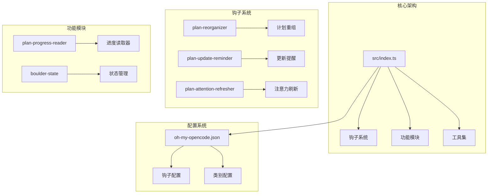
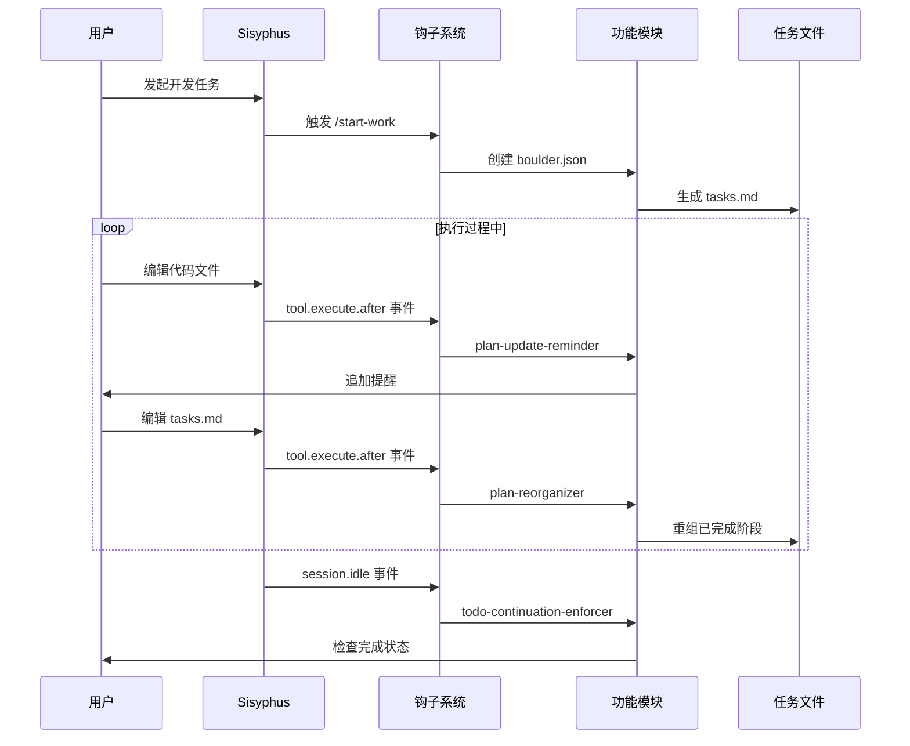
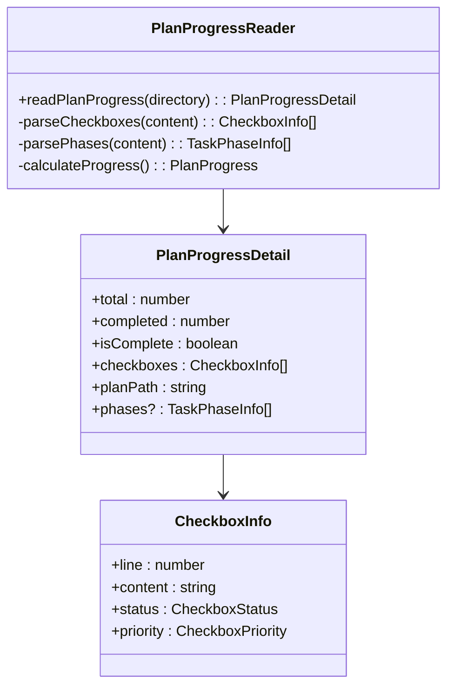
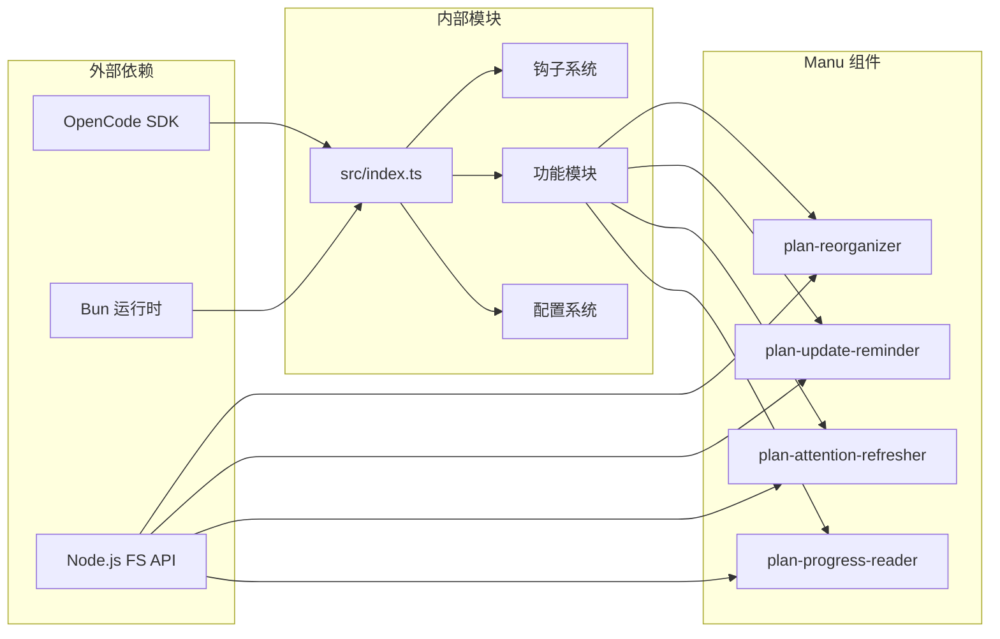

# Manu 规划方法论

<cite>
**本文档引用的文件**
- [README.md](file://README.md)
- [USAGE-ENTRY.md](file://USAGE-ENTRY.md)
- [CONFIGURATION-GUIDE.md](file://CONFIGURATION-GUIDE.md)
- [orchestration-guide.md](file://docs/orchestration-guide.md)
- [UPDATE-PLAN.md](file://docs/UPDATE-PLAN.md)
- [design.md](file://changes/multi-manus-planning-integration/design.md)
- [proposal.md](file://changes/multi-manus-planning-integration/proposal.md)
- [tasks.md](file://changes/multi-manus-planning-integration/tasks.md)
- [src/index.ts](file://src/index.ts)
- [src/hooks/index.ts](file://src/hooks/index.ts)
- [src/hooks/plan-reorganizer/index.ts](file://src/hooks/plan-reorganizer/index.ts)
- [src/hooks/plan-update-reminder/index.ts](file://src/hooks/plan-update-reminder/index.ts)
- [src/hooks/plan-attention-refresher/index.ts](file://src/hooks/plan-attention-refresher/index.ts)
- [src/features/plan-progress-reader/index.ts](file://src/features/plan-progress-reader/index.ts)
</cite>

## 目录
1. [简介](#简介)
2. [项目结构](#项目结构)
3. [核心组件](#核心组件)
4. [架构概览](#架构概览)
5. [详细组件分析](#详细组件分析)
6. [依赖关系分析](#依赖关系分析)
7. [性能考虑](#性能考虑)
8. [故障排除指南](#故障排除指南)
9. [结论](#结论)

## 简介

Manu 规划方法论是 Oh My OpenCode 项目中引入的一套基于 planning-with-files 的规划实践体系。该方法论旨在解决传统 AI 开发工作流中的核心痛点：任务丢失、目标遗忘、进度不同步等问题。

该方法论的核心理念是"文件即真相来源"，通过将 Manus 原则深度整合到现有的 Sisyphus 工作流中，实现了更加可靠和可持续的开发协作模式。

## 项目结构

Oh My OpenCode 采用模块化架构设计，将 Manu 规划方法论的相关功能组织在以下核心模块中：



**图表来源**
- [src/index.ts](file://src/index.ts#L92-L630)
- [src/hooks/index.ts](file://src/hooks/index.ts#L1-L57)

**章节来源**
- [src/index.ts](file://src/index.ts#L92-L630)
- [src/hooks/index.ts](file://src/hooks/index.ts#L1-L57)

## 核心组件

### 1. 计划重组器 (Plan Reorganizer)

计划重组器是 Manu 方法论的核心组件之一，负责在编辑 tasks.md 文件后自动重组已完成的阶段。

**核心功能：**
- 自动检测已完成的 Phase（所有 checkbox 都是 [x]）
- 将完成的 Phase 移动到文档底部的 "## Completed Phases" 部分
- 统一标题层级，保持文档结构清晰

**实现机制：**
- 监听 Edit/Write 工具执行事件
- 匹配 tasks.md 和 task_plan.md 文件
- 静默执行，不影响工具返回

### 2. 计划更新提醒器 (Plan Update Reminder)

该组件在代码文件变更后提醒开发者更新计划状态，确保计划与实际工作保持同步。

**触发条件：**
- 仅对非 Markdown 文件（包括代码文件）触发
- 需要 boulder.json 存在且 active_plan 有效
- 自动追加提醒消息到工具输出

**设计理念：**
- 实施 Manus 的"2-Action Rule"：每两次查看/浏览器操作后保存发现
- 防止信息在长上下文中丢失

### 3. 注意力刷新器 (Plan Attention Refresher)

基于 planning-with-files 的"注意力操控"原则，该组件在工具执行前自动刷新计划上下文。

**实现特点：**
- 监听 Write、Edit、Bash、Read 工具执行前事件
- 读取 tasks.md 前 30 行内容
- 避免频繁刷新，设置 60 秒间隔限制
- 以结构化格式预置到工具输出中

**章节来源**
- [src/hooks/plan-reorganizer/index.ts](file://src/hooks/plan-reorganizer/index.ts#L1-L74)
- [src/hooks/plan-update-reminder/index.ts](file://src/hooks/plan-update-reminder/index.ts#L1-L73)
- [src/hooks/plan-attention-refresher/index.ts](file://src/hooks/plan-attention-refresher/index.ts#L1-L140)

## 架构概览

Manu 规划方法论的架构设计遵循"增强而非替换"的原则，通过钩子系统无缝集成到现有工作流中：



**图表来源**
- [design.md](file://changes/multi-manus-planning-integration/design.md#L18-L90)
- [src/index.ts](file://src/index.ts#L454-L535)

## 详细组件分析

### 计划进度读取器 (Plan Progress Reader)

作为"文件即真相来源"理念的具体实现，计划进度读取器提供了只读的进度分析能力：



**图表来源**
- [src/features/plan-progress-reader/index.ts](file://src/features/plan-progress-reader/index.ts#L1-L10)

**实现特点：**
- 仅读取 tasks.md 文件，不进行任何写入操作
- 支持两种进度检测方式：checkboxes + phases
- 提供详细的优先级识别（high/medium/low）

### todo-continuation-enforcer 增强

该组件通过集成计划进度读取器，实现了更加智能的任务完成检测：

```mermaid
flowchart TD
A[session.idle 事件] --> B{检查 boulder.json}
B --> |不存在| C[使用传统 todos]
B --> |存在| D[读取 tasks.md]
D --> E{解析进度信息}
E --> F{boulder.phase === "completed"}
F --> |是| G[允许停止]
F --> |否| H{tasks.md 存在}
H --> |否| I[允许停止]
H --> |是| J{综合检查}
J --> K{checkboxes + phases 完成}
K --> |是| G
K --> |否| L[注入继续提示]
L --> M{连续未更新次数}
M --> |<3| N[强制提醒]
M --> |>=3| O[拒绝自动继续]
```

**图表来源**
- [tasks.md](file://changes/multi-manus-planning-integration/tasks.md#L334-L365)

**章节来源**
- [tasks.md](file://changes/multi-manus-planning-integration/tasks.md#L318-L365)

### Manus 原则集成

Manu 规划方法论将六个核心原则融入到现有工作流中：

| 原则 | 实现方式 | 触发机制 |
|------|----------|----------|
| 2-Action Rule | plan-update-reminder | 代码文件变更后 |
| 3-Strike Protocol | todo-continuation-enforcer | 连续未更新检测 |
| Attention Manipulation | plan-attention-refresher | 工具执行前刷新 |
| File is Source of Truth | plan-progress-reader | 只读进度分析 |
| Completed Tasks to Bottom | plan-reorganizer | tasks.md 编辑后 |
| Findings/Progress Tracking | 各技能集成 | 执行过程记录 |

**章节来源**
- [proposal.md](file://changes/multi-manus-planning-integration/proposal.md#L25-L36)
- [design.md](file://changes/multi-manus-planning-integration/design.md#L9-L15)

## 依赖关系分析

Manu 规划方法论的依赖关系体现了模块化设计的优势：



**图表来源**
- [src/index.ts](file://src/index.ts#L92-L630)

**依赖特点：**
- 最小化外部依赖，主要依赖 OpenCode SDK 和 Node.js 原生 API
- 模块间松耦合，通过接口和事件通信
- 支持动态禁用，通过配置系统控制功能开关

**章节来源**
- [src/index.ts](file://src/index.ts#L92-L630)

## 性能考虑

### 1. 轻量级钩子设计

Manu 方法论的钩子系统采用轻量级设计，确保最小的性能开销：

- **异步执行**：所有钩子都支持异步处理，不阻塞主流程
- **条件触发**：仅在必要时触发，避免不必要的计算
- **缓存机制**：对频繁访问的数据进行缓存

### 2. 文件操作优化

- **延迟读取**：只在需要时读取文件内容
- **增量处理**：仅处理发生变化的部分
- **错误隔离**：单个文件操作失败不影响整体流程

### 3. 内存管理

- **会话隔离**：每个会话维护独立的状态
- **定时清理**：定期清理过期的会话数据
- **资源监控**：监控文件句柄和内存使用情况

## 故障排除指南

### 常见问题及解决方案

| 问题类型 | 症状 | 可能原因 | 解决方案 |
|----------|------|----------|----------|
| 钩子不生效 | 计划重组未触发 | boulder.json 不存在 | 确保 /start-work 已执行 |
| 进度检测错误 | 任务状态显示不正确 | tasks.md 格式错误 | 检查 Markdown 语法 |
| 性能问题 | 系统响应缓慢 | 钩子过多或文件过大 | 检查 disabled_hooks 配置 |
| 文件权限 | 无法读取 tasks.md | 文件权限不足 | 检查文件访问权限 |

### 调试技巧

1. **启用详细日志**：通过配置系统启用调试模式
2. **检查钩子状态**：确认相关钩子已正确注册
3. **验证文件路径**：确保 tasks.md 路径正确
4. **监控系统资源**：观察内存和 CPU 使用情况

**章节来源**
- [CONFIGURATION-GUIDE.md](file://CONFIGURATION-GUIDE.md#L150-L158)

## 结论

Manu 规划方法论代表了 AI 辅助开发工作流的重要进步。通过将 planning-with-files 的最佳实践与 Oh My OpenCode 的现有架构深度整合，实现了：

1. **可靠性提升**：通过"文件即真相来源"确保进度数据的持久性和一致性
2. **效率优化**：自动化的工作流减少了手动管理工作量
3. **可扩展性**：模块化设计支持功能的灵活扩展和定制
4. **用户体验**：智能的提醒和辅助功能提升了开发体验

该方法论的成功实施证明了在复杂 AI 工作流中引入结构化规划的重要性，为未来的开发协作提供了新的思路和实践框架。