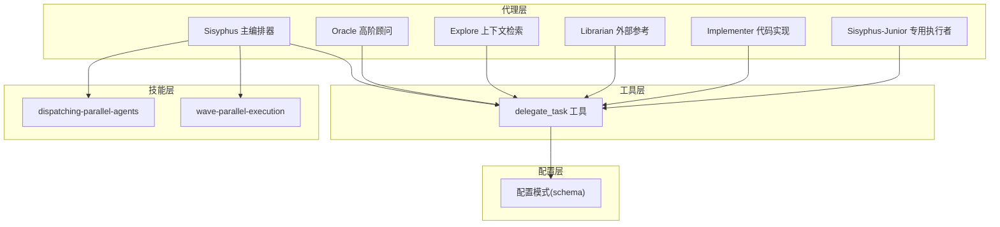
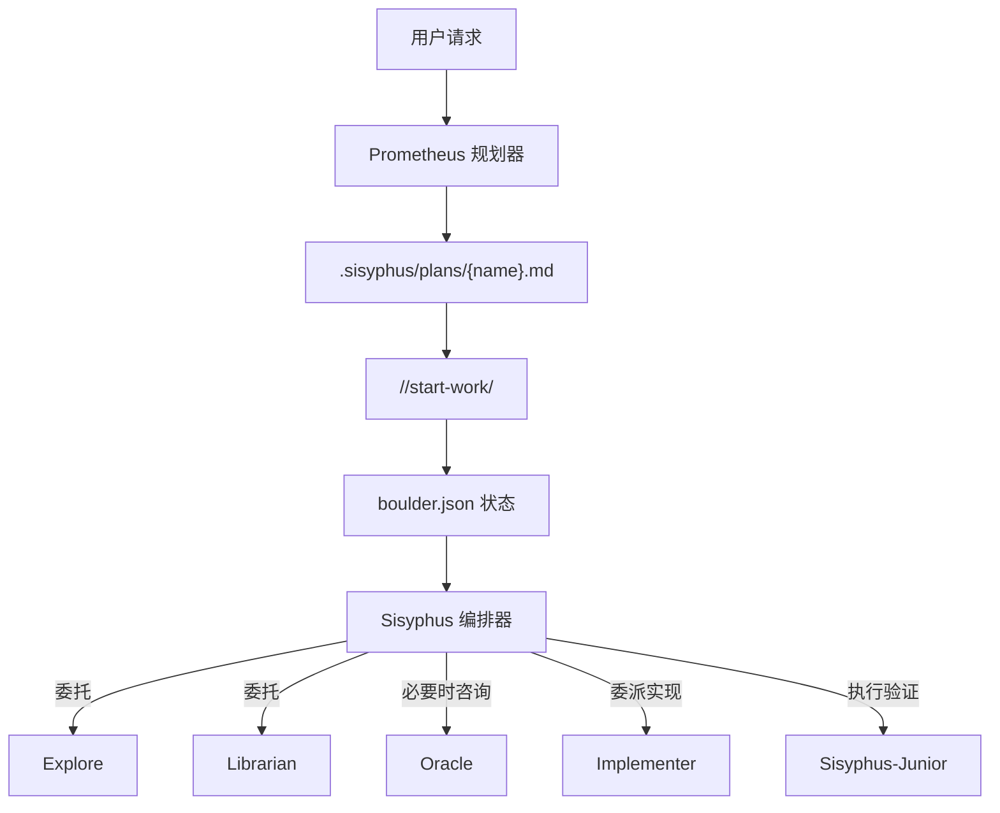
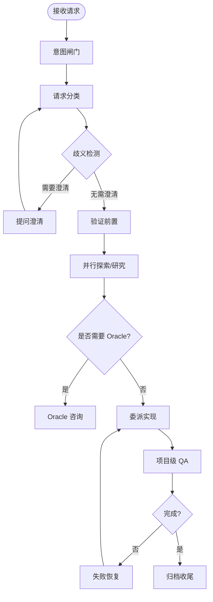
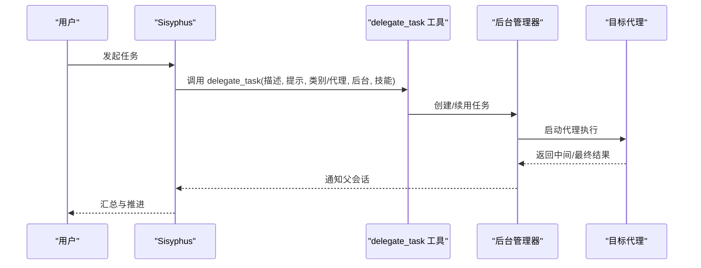
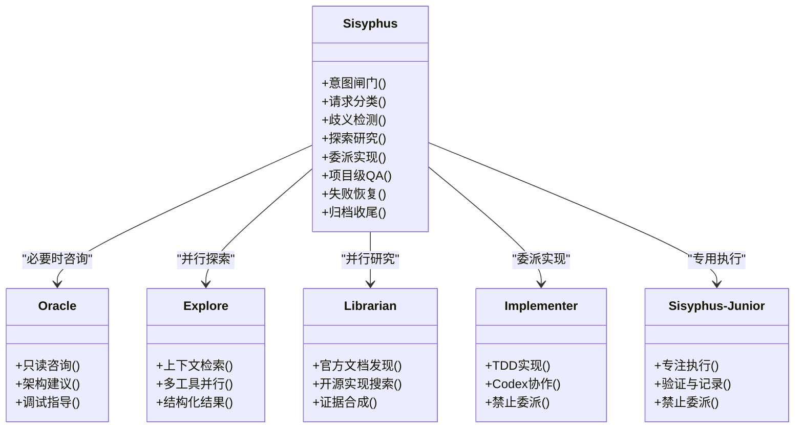
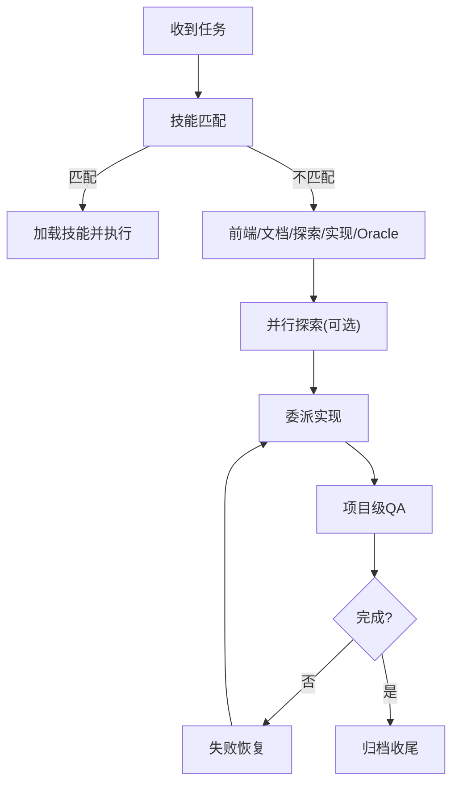
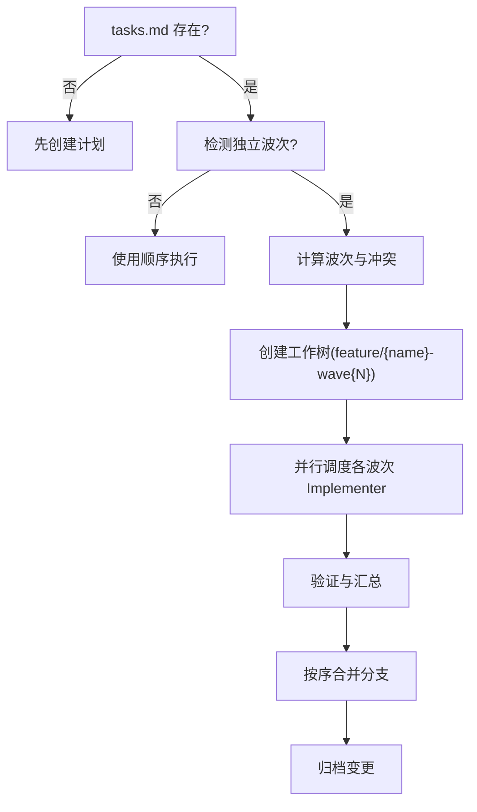
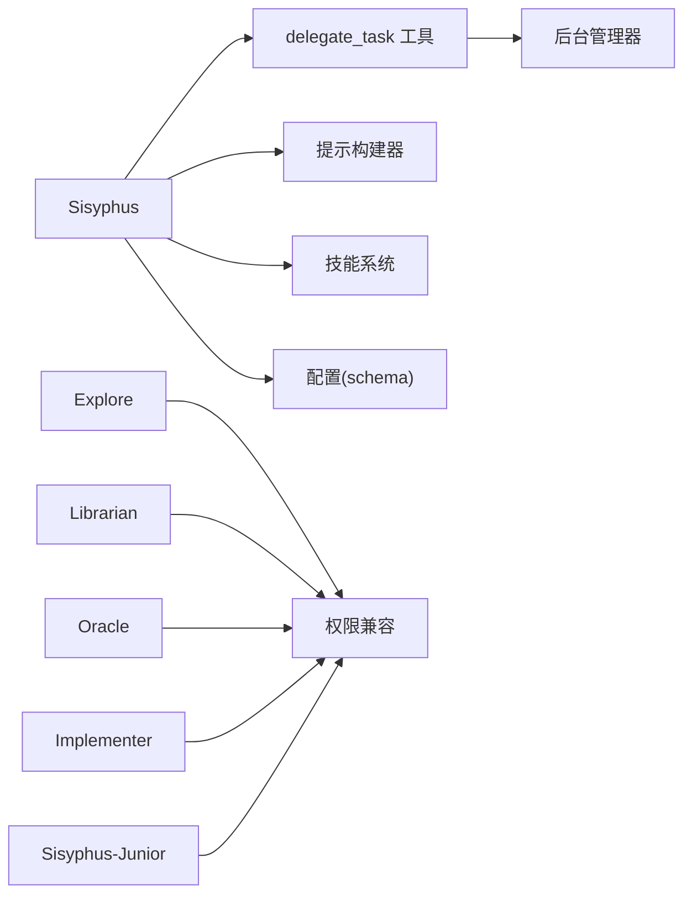

# 代理编排原理

<cite>
**本文引用的文件**
- [src/agents/orchestrator-sisyphus.ts](file://src/agents/orchestrator-sisyphus.ts)
- [src/agents/sisyphus.ts](file://src/agents/sisyphus.ts)
- [src/agents/sisyphus-prompt-builder.ts](file://src/agents/sisyphus-prompt-builder.ts)
- [src/agents/types.ts](file://src/agents/types.ts)
- [src/agents/index.ts](file://src/agents/index.ts)
- [src/agents/oracle.ts](file://src/agents/oracle.ts)
- [src/agents/explore.ts](file://src/agents/explore.ts)
- [src/agents/librarian.ts](file://src/agents/librarian.ts)
- [src/agents/implementer.ts](file://src/agents/implementer.ts)
- [src/agents/sisyphus-junior.ts](file://src/agents/sisyphus-junior.ts)
- [src/tools/delegate-task/tools.ts](file://src/tools/delegate-task/tools.ts)
- [src/tools/delegate-task/types.ts](file://src/tools/delegate-task/types.ts)
- [src/features/builtin-skills/dispatching-parallel-agents/SKILL.md](file://src/features/builtin-skills/dispatching-parallel-agents/SKILL.md)
- [src/features/builtin-skills/wave-parallel-execution/SKILL.md](file://src/features/builtin-skills/wave-parallel-execution/SKILL.md)
- [src/config/schema.ts](file://src/config/schema.ts)
- [docs/orchestration-guide.md](file://docs/orchestration-guide.md)
</cite>

## 目录
1. [引言](#引言)
2. [项目结构](#项目结构)
3. [核心组件](#核心组件)
4. [架构总览](#架构总览)
5. [详细组件分析](#详细组件分析)
6. [依赖分析](#依赖分析)
7. [性能考量](#性能考量)
8. [故障排查指南](#故障排查指南)
9. [结论](#结论)
10. [附录](#附录)

## 引言
本文件系统性阐述 Oh My OpenCode 的代理编排原理，聚焦 Sisyphus 编排器的设计理念与工作机制。Sisyphus 将“规划”与“执行”分离，通过多代理协同、任务分配策略与执行流程控制，实现高吞吐、可追踪、可恢复的自动化开发流水线。文档覆盖不同专业代理（Oracle、Librarian、Explore、Implementer 等）的功能定位与协作模式，解释代理间通信机制、状态同步与错误恢复策略，并提供配置选项、性能调优与故障排查指南及实战案例。

## 项目结构
- 代理层：内置代理定义与动态提示构建器，负责角色职责与行为约束。
- 工具层：委托任务工具 delegate_task，统一代理间通信与任务生命周期管理。
- 技能层：内置技能（如并行调度、波次并行执行等），驱动复杂执行模式。
- 配置层：类别配置与代理覆盖配置，支持按领域定制代理能力与权限。
- 文档与指南：编排总览与使用指南，提供最佳实践与命令入口。

**图表来源**
- [src/agents/sisyphus.ts](file://src/agents/sisyphus.ts#L1-L800)
- [src/agents/orchestrator-sisyphus.ts](file://src/agents/orchestrator-sisyphus.ts#L1-L800)
- [src/agents/sisyphus-prompt-builder.ts](file://src/agents/sisyphus-prompt-builder.ts#L1-L360)
- [src/tools/delegate-task/tools.ts](file://src/tools/delegate-task/tools.ts#L118-L200)
- [src/features/builtin-skills/dispatching-parallel-agents/SKILL.md](file://src/features/builtin-skills/dispatching-parallel-agents/SKILL.md#L1-L181)
- [src/features/builtin-skills/wave-parallel-execution/SKILL.md](file://src/features/builtin-skills/wave-parallel-execution/SKILL.md#L1-L396)
- [src/config/schema.ts](file://src/config/schema.ts#L163-L200)

**章节来源**
- [src/agents/index.ts](file://src/agents/index.ts#L1-L37)
- [docs/orchestration-guide.md](file://docs/orchestration-guide.md#L1-L153)

## 核心组件
- Sisyphus 主编排器：负责意图识别、请求分类、歧义检测、探索研究、实施与验证、失败恢复与收尾归档。强调“先规划、后执行”，并以 todo 管理贯穿全流程。
- Sisyphus-Junior 专用执行者：面向单一任务的专注执行者，禁止再次委派，严格遵循任务清单与验证标准。
- Oracle 高阶顾问：只读型高智商顾问，用于架构决策、复杂调试与疑难问题诊断。
- Explore 上下文检索：多工具并行的代码库内部检索专家，强调绝对路径与可操作结果。
- Librarian 外部参考：官方文档发现、开源实现搜索与证据合成，强调永久链接与可复现证据。
- Implementer 代码实现：严格遵循 TDD 与 Codex 协作的实现代理，承担非可视化、非文档类任务。
- delegate_task 工具：统一的代理间通信与任务生命周期管理入口，支持后台并行、会话续用与技能注入。
- 动态提示构建器：基于可用代理、工具与技能，自动生成行为指令、工具选择表、委托矩阵与硬性约束。
- 类别配置与代理覆盖：通过 CategoryConfig 与 AgentOverrideConfig，按领域定制模型、温度、思维预算、默认技能与工具权限。

**章节来源**
- [src/agents/sisyphus.ts](file://src/agents/sisyphus.ts#L1-L800)
- [src/agents/orchestrator-sisyphus.ts](file://src/agents/orchestrator-sisyphus.ts#L1-L800)
- [src/agents/sisyphus-prompt-builder.ts](file://src/agents/sisyphus-prompt-builder.ts#L1-L360)
- [src/agents/oracle.ts](file://src/agents/oracle.ts#L1-L126)
- [src/agents/explore.ts](file://src/agents/explore.ts#L1-L126)
- [src/agents/librarian.ts](file://src/agents/librarian.ts#L1-L330)
- [src/agents/implementer.ts](file://src/agents/implementer.ts#L1-L153)
- [src/agents/sisyphus-junior.ts](file://src/agents/sisyphus-junior.ts#L1-L196)
- [src/tools/delegate-task/tools.ts](file://src/tools/delegate-task/tools.ts#L118-L200)
- [src/config/schema.ts](file://src/config/schema.ts#L163-L200)

## 架构总览
Sisyphus 将“规划”与“执行”解耦：Prometheus 负责访谈与生成计划；Sisyphus 读取计划并以多代理协同方式执行。执行阶段通过 delegate_task 统一调度 Explore/Librarian 并行探索、Oracle 辅助决策、Implementer 专注实现，并以 todo 管理与验证门禁确保质量与可追溯性。

**图表来源**
- [docs/orchestration-guide.md](file://docs/orchestration-guide.md#L37-L127)

**章节来源**
- [docs/orchestration-guide.md](file://docs/orchestration-guide.md#L1-L153)

## 详细组件分析

### Sisyphus 编排器：设计理念与工作机制
- 设计理念
  - 分离规划与执行：Prometheus 生成完美计划，Sisyphus 严格执行。
  - 多代理协调：按任务域选择合适代理，避免重复劳动与越权操作。
  - 并行优先：探索与研究默认后台并行，最大化吞吐。
  - todo 驱动：所有非平凡任务必须先建 todo，实时跟踪进度。
- 核心流程
  - 意图闸门：识别外部库引用、多模块涉及、GitHub 工单等触发条件。
  - 请求分类：平凡、显式、探索性、开放性、GitHub 工单、模糊等类型。
  - 歧义检测：多方案差异显著或缺失关键信息时必须提问澄清。
  - 验证前置：确认搜索范围、工具/代理可用性与执行策略。
  - 探索研究：Explore/Librarian 并行，背景收集，必要时 Oracle 辅助。
  - 实施阶段：前端变更硬委托给前端工程师，文档任务硬委托给文档写手，其余交 Implementer 或 Oracle。
  - 质量保证：每次委派后进行项目级 QA（LSP、构建、测试、交叉核查）。
  - 失败恢复：连续三次失败回滚到最近工作状态并咨询 Oracle。
  - 收尾归档：Archiver 执行 Git 策略与归档，Sisyphus 最终确认。

**图表来源**
- [src/agents/orchestrator-sisyphus.ts](file://src/agents/orchestrator-sisyphus.ts#L154-L640)

**章节来源**
- [src/agents/orchestrator-sisyphus.ts](file://src/agents/orchestrator-sisyphus.ts#L134-L800)

### 代理间通信机制与状态同步
- 通信入口：delegate_task 工具
  - 参数：描述、提示、类别/代理、后台运行、会话续用、技能数组。
  - 互斥：类别与代理互斥（除续用外），后台参数必填。
  - 技能注入：技能内容与类别附加内容合并，增强代理行为。
- 会话续用：通过 resume 传入上一次会话 ID，保持上下文完整，节省 token 并维持连续性。
- 状态同步：父会话通过后台管理器通知子任务完成，支持并发槽位释放与错误传播。

**图表来源**
- [src/tools/delegate-task/tools.ts](file://src/tools/delegate-task/tools.ts#L118-L200)
- [src/tools/delegate-task/types.ts](file://src/tools/delegate-task/types.ts#L1-L9)

**章节来源**
- [src/tools/delegate-task/tools.ts](file://src/tools/delegate-task/tools.ts#L118-L200)
- [src/tools/delegate-task/types.ts](file://src/tools/delegate-task/types.ts#L1-L9)

### 不同专业代理的功能定位与协作模式
- Oracle（顾问）
  - 适用：架构设计、复杂调试、多系统权衡、安全/性能问题。
  - 约束：只读咨询，昂贵模型，需明确理由并先行动后宣告。
- Explore（内部检索）
  - 适用：多角度搜索、不熟悉模块、跨层模式发现。
  - 约束：只读，要求绝对路径、可操作结果与结构化输出。
- Librarian（外部参考）
  - 适用：库/框架使用、最佳实践、历史与上下文查询。
  - 约束：必须提供永久链接证据，按类型分步执行。
- Implementer（实现）
  - 适用：非可视化、非文档类实现任务。
  - 约束：禁止再次委派，严格 TDD 与 Codex 协作，禁止类型错误抑制。
- Sisyphus-Junior（专用执行者）
  - 适用：按计划执行单一任务，无委派权，专注验证与记录。

**图表来源**
- [src/agents/oracle.ts](file://src/agents/oracle.ts#L1-L126)
- [src/agents/explore.ts](file://src/agents/explore.ts#L1-L126)
- [src/agents/librarian.ts](file://src/agents/librarian.ts#L1-L330)
- [src/agents/implementer.ts](file://src/agents/implementer.ts#L1-L153)
- [src/agents/sisyphus-junior.ts](file://src/agents/sisyphus-junior.ts#L1-L196)

**章节来源**
- [src/agents/oracle.ts](file://src/agents/oracle.ts#L1-L126)
- [src/agents/explore.ts](file://src/agents/explore.ts#L1-L126)
- [src/agents/librarian.ts](file://src/agents/librarian.ts#L1-L330)
- [src/agents/implementer.ts](file://src/agents/implementer.ts#L1-L153)
- [src/agents/sisyphus-junior.ts](file://src/agents/sisyphus-junior.ts#L1-L196)

### 任务分配策略与执行流程控制
- 任务分配策略
  - 技能匹配优先：先扫描技能触发，再按域选择类别或代理。
  - 前端硬委托：任何前端视觉变更一律委托前端工程师。
  - 文档硬委托：文档类任务一律委托文档写手。
  - 复杂问题咨询 Oracle：架构、调试、多系统权衡。
  - 并行探索：Explore/Librarian 默认后台并行，收集后再决策。
- 执行流程控制
  - todo 管理：多步骤任务必须先建 todo，逐项 in_progress/completed。
  - 项目级 QA：每次委派后运行 LSP、构建、测试与交叉核查。
  - 失败恢复：连续三次失败回滚并咨询 Oracle，必要时向用户求助。
  - 收尾归档：Archiver 执行 Git 策略与归档，Sisyphus 最终确认。

**图表来源**
- [src/agents/sisyphus.ts](file://src/agents/sisyphus.ts#L190-L482)
- [src/agents/orchestrator-sisyphus.ts](file://src/agents/orchestrator-sisyphus.ts#L484-L640)

**章节来源**
- [src/agents/sisyphus.ts](file://src/agents/sisyphus.ts#L190-L482)
- [src/agents/orchestrator-sisyphus.ts](file://src/agents/orchestrator-sisyphus.ts#L484-L640)

### 并行调度与波次并行执行
- 并行调度（dispatching-parallel-agents）
  - 适用：多个相互独立的失败域，可并行调查与修复。
  - 模式：每个失败域一个代理，同时启动，汇总后集成。
- 波次并行执行（wave-parallel-execution）
  - 适用：tasks.md 中存在多个可并行的波次，波次间串行、波次内串行。
  - 流程：解析依赖→分波→创建工作树→并行调度→验证→合并清理。

**图表来源**
- [src/features/builtin-skills/wave-parallel-execution/SKILL.md](file://src/features/builtin-skills/wave-parallel-execution/SKILL.md#L53-L396)
- [src/features/builtin-skills/dispatching-parallel-agents/SKILL.md](file://src/features/builtin-skills/dispatching-parallel-agents/SKILL.md#L14-L81)

**章节来源**
- [src/features/builtin-skills/wave-parallel-execution/SKILL.md](file://src/features/builtin-skills/wave-parallel-execution/SKILL.md#L1-L396)
- [src/features/builtin-skills/dispatching-parallel-agents/SKILL.md](file://src/features/builtin-skills/dispatching-parallel-agents/SKILL.md#L1-L181)

### 动态提示构建与行为约束
- 动态提示构建器
  - 关键触发：外部库引用、多模块涉及、GitHub 工单等。
  - 工具与技能选择：优先技能，其次直接工具，最后代理。
  - 探索与文献检索：区分内部上下文检索与外部参考检索。
  - 委托矩阵：按域映射到具体代理。
  - 硬性约束与反模式：类型安全、错误处理、前端视觉变更、调试策略等。
- 行为约束
  - 前端视觉变更零容忍委托。
  - 严禁类型错误抑制、未授权提交、推测未知代码。
  - 严禁一次性批量完成多个 todo。

**章节来源**
- [src/agents/sisyphus-prompt-builder.ts](file://src/agents/sisyphus-prompt-builder.ts#L60-L360)
- [src/agents/orchestrator-sisyphus.ts](file://src/agents/orchestrator-sisyphus.ts#L642-L798)

## 依赖分析
- 组件耦合
  - Sisyphus 依赖 delegate_task 工具进行统一调度；依赖动态提示构建器生成行为指令；依赖技能层驱动复杂执行模式。
  - Explore/Librarian/Oracle/Implementer/Sisyphus-Junior 作为子代理，受权限兼容模块约束。
  - 配置层通过 CategoryConfig 与 AgentOverrideConfig 影响代理模型、温度、思维预算与工具权限。
- 外部依赖与集成点
  - 背景管理器：任务生命周期、并发槽位、错误传播与父会话通知。
  - 技能加载：内置技能与插件技能合并，注入系统内容。
  - Hook 与命令：/start-work、@plan 等命令触发执行阶段。

**图表来源**
- [src/agents/sisyphus.ts](file://src/agents/sisyphus.ts#L1-L800)
- [src/agents/sisyphus-prompt-builder.ts](file://src/agents/sisyphus-prompt-builder.ts#L1-L360)
- [src/tools/delegate-task/tools.ts](file://src/tools/delegate-task/tools.ts#L1-L200)
- [src/config/schema.ts](file://src/config/schema.ts#L163-L200)

**章节来源**
- [src/agents/sisyphus.ts](file://src/agents/sisyphus.ts#L1-L800)
- [src/agents/sisyphus-prompt-builder.ts](file://src/agents/sisyphus-prompt-builder.ts#L1-L360)
- [src/tools/delegate-task/tools.ts](file://src/tools/delegate-task/tools.ts#L1-L200)
- [src/config/schema.ts](file://src/config/schema.ts#L163-L200)

## 性能考量
- 并行优先：探索与研究默认后台并行，减少等待时间。
- 会话续用：通过 resume 保持上下文，避免重复检索与思考。
- 波次并行：在任务具备独立性前提下，最大化并行度，缩短总时长。
- 任务粒度：波次内任务数量控制在 2-5 个，避免代理迷失。
- 资源释放：委派完成后及时取消后台任务，避免资源泄漏。
- 模型与预算：合理设置模型、温度与思维预算，平衡成本与质量。

[本节为通用指导，无需特定文件引用]

## 故障排查指南
- 常见问题与对策
  - 代理未找到：检查 opencode.json 或插件注册，确保代理已启用。
  - 技能未生效：确认技能名称正确且可加载，检查技能内容与类别附加内容合并。
  - 任务阻塞：查看后台任务状态与错误消息，必要时重试或降级为顺序执行。
  - 并发冲突：检查并发槽位与任务键，避免重复注册。
  - 会话续用失败：确认 session ID 正确且父会话存在。
- 回滚与恢复
  - 连续三次失败：立即回滚到最近工作状态，咨询 Oracle 并记录尝试与失败原因。
  - 无限循环：当同一 todo 列表被调用超过阈值时，诊断并报告状态，请求人工干预。
- 验证门禁
  - 每次委派后必须执行项目级 QA（LSP、构建、测试、交叉核查），确保无回归。

**章节来源**
- [src/agents/orchestrator-sisyphus.ts](file://src/agents/orchestrator-sisyphus.ts#L1525-L1535)
- [src/features/background-agent/manager.ts](file://src/features/background-agent/manager.ts#L198-L217)

## 结论
Sisyphus 编排器通过“规划-执行”分离、多代理协同与严格的流程控制，实现了高可靠、可追踪与可扩展的自动化开发体系。借助 delegate_task 统一通信、动态提示构建与技能驱动的执行模式，系统在复杂任务中仍能保持高效与稳定。结合类别配置与代理覆盖，用户可在不同领域定制代理能力与权限，进一步提升生产力与一致性。

[本节为总结性内容，无需特定文件引用]

## 附录

### 配置选项与最佳实践
- 代理覆盖配置（AgentOverrideConfig）
  - 支持指定模型、温度、top_p、工具权限、描述、颜色、模式与 prompt 追加。
  - 可通过 category 继承类别默认设置，简化配置。
- 类别配置（CategoryConfig）
  - 支持模型、温度、top_p、最大 token、思维预算、推理强度、工具白名单与默认技能。
- 使用建议
  - 为前端工程与架构设计分别配置不同温度与默认技能。
  - 限制危险工具权限，确保只读顾问与专用执行者的边界清晰。
  - 在大规模并行场景下，优先采用波次并行执行以降低冲突风险。

**章节来源**
- [src/config/schema.ts](file://src/config/schema.ts#L109-L151)
- [src/config/schema.ts](file://src/config/schema.ts#L170-L186)

### 实战案例：设计与优化代理编排策略
- 案例一：多模块重构
  - 触发：多模块涉及、复杂架构设计。
  - 策略：先 Oracle 咨询架构，再 Explore 并行探索，Librarian 搜索最佳实践，Implementer 逐步实现，Sisyphus 每次委派后进行项目级 QA。
  - 优化：将实现任务拆分为多个波次，波次间串行依赖、波次内并行执行，缩短总时长。
- 案例二：测试失败并行修复
  - 触发：多个独立测试文件失败。
  - 策略：dispatching-parallel-agents 并行调度，每个失败域一个代理，汇总后集成。
  - 优化：为每个代理提供明确输出格式与约束，减少集成冲突。

**章节来源**
- [src/features/builtin-skills/dispatching-parallel-agents/SKILL.md](file://src/features/builtin-skills/dispatching-parallel-agents/SKILL.md#L1-L181)
- [src/features/builtin-skills/wave-parallel-execution/SKILL.md](file://src/features/builtin-skills/wave-parallel-execution/SKILL.md#L1-L396)