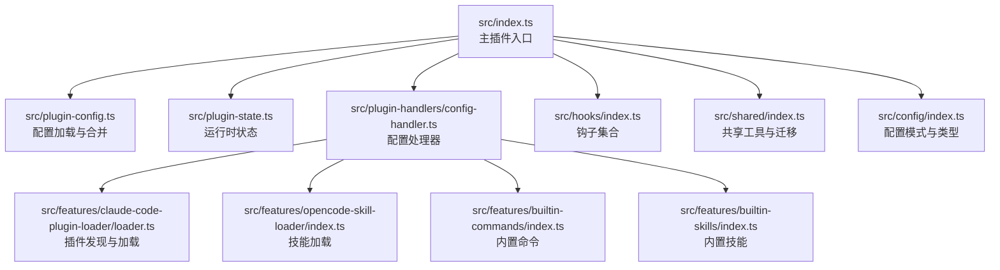
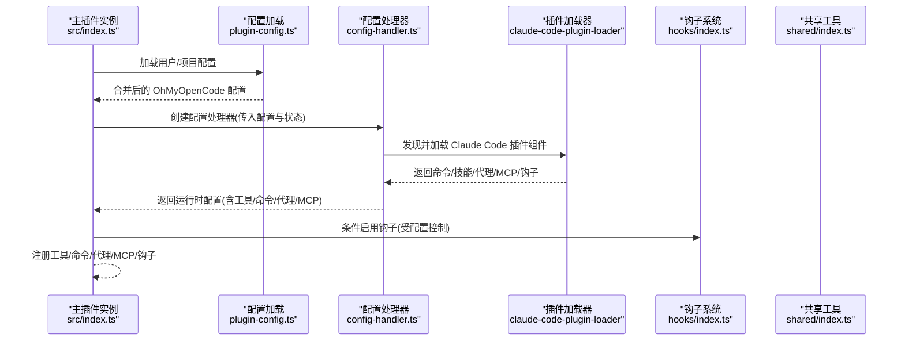
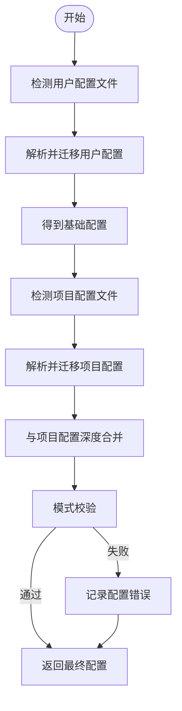
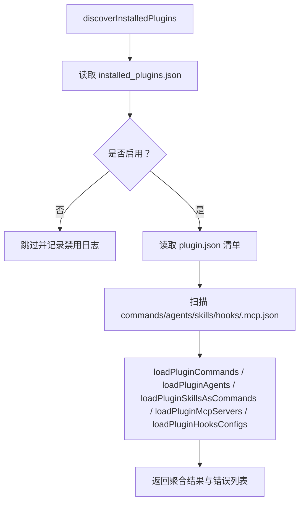
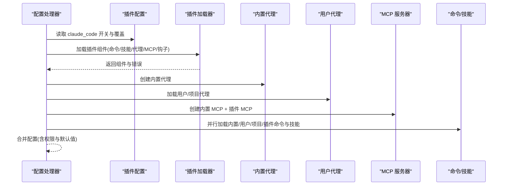
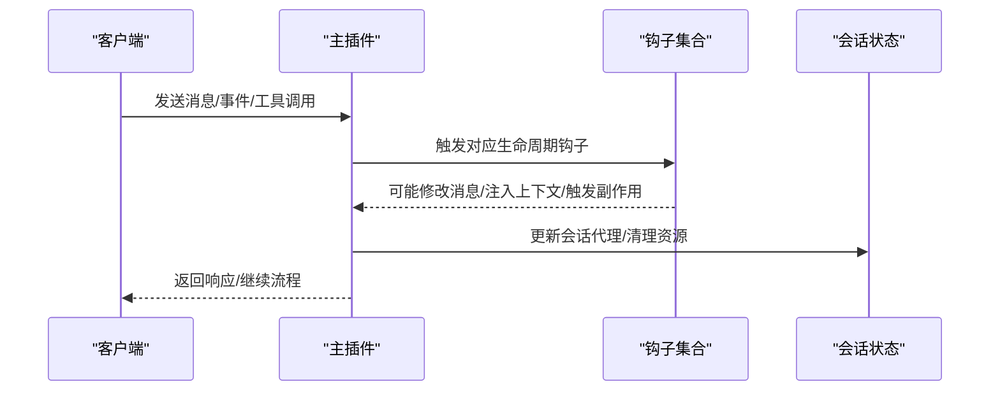
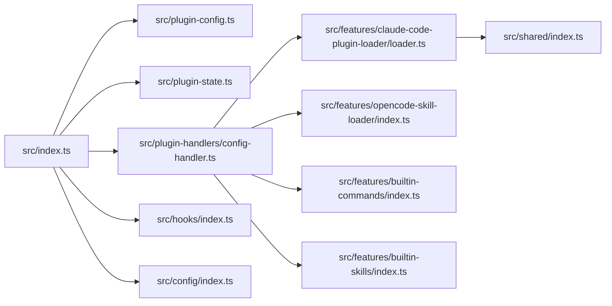

# 插件系统架构

<cite>
**本文引用的文件**
- [src/index.ts](file://src/index.ts)
- [src/plugin-config.ts](file://src/plugin-config.ts)
- [src/plugin-state.ts](file://src/plugin-state.ts)
- [src/plugin-handlers/index.ts](file://src/plugin-handlers/index.ts)
- [src/plugin-handlers/config-handler.ts](file://src/plugin-handlers/config-handler.ts)
- [src/features/claude-code-plugin-loader/index.ts](file://src/features/claude-code-plugin-loader/index.ts)
- [src/features/claude-code-plugin-loader/loader.ts](file://src/features/claude-code-plugin-loader/loader.ts)
- [src/features/claude-code-plugin-loader/types.ts](file://src/features/claude-code-plugin-loader/types.ts)
- [src/features/opencode-skill-loader/index.ts](file://src/features/opencode-skill-loader/index.ts)
- [src/features/builtin-commands/index.ts](file://src/features/builtin-commands/index.ts)
- [src/features/builtin-skills/index.ts](file://src/features/builtin-skills/index.ts)
- [src/hooks/index.ts](file://src/hooks/index.ts)
- [src/shared/index.ts](file://src/shared/index.ts)
- [src/config/index.ts](file://src/config/index.ts)
</cite>

## 目录
1. [简介](#简介)
2. [项目结构](#项目结构)
3. [核心组件](#核心组件)
4. [架构总览](#架构总览)
5. [组件详解](#组件详解)
6. [依赖关系分析](#依赖关系分析)
7. [性能考量](#性能考量)
8. [故障排查指南](#故障排查指南)
9. [结论](#结论)
10. [附录：最佳实践与示例路径](#附录最佳实践与示例路径)

## 简介
本文件系统性阐述 Oh My OpenCode 的插件系统架构，重点解析 OpenCode 插件 SDK 的工作原理，涵盖以下主题：
- 插件生命周期管理：从插件发现、加载到注册的完整流程
- 配置加载机制：用户级与项目级配置的合并策略与优先级
- 状态管理：模型上下文缓存等运行时状态的维护
- 初始化流程：插件实例创建、钩子装配与工具/命令/技能/代理/ MCP 服务器的注册
- 工具注册机制：内置工具与插件扩展工具的统一注册
- 钩子系统集成：事件驱动的钩子链路与条件启用
- 插件配置层次结构：OhMyOpenCode 配置与 Claude Code 插件生态的协同
- 动态加载能力：并行加载与按需启用
- 最佳实践、性能优化与错误处理策略
- 自定义插件开发与扩展现有功能的示例路径

## 项目结构
该插件系统围绕一个主入口插件导出，通过配置处理器与插件加载器实现对 Claude Code 插件生态的兼容与扩展，并在运行期注入大量钩子与工具。

**图表来源**
- [src/index.ts](file://src/index.ts#L86-L606)
- [src/plugin-config.ts](file://src/plugin-config.ts#L93-L135)
- [src/plugin-handlers/config-handler.ts](file://src/plugin-handlers/config-handler.ts#L44-L381)
- [src/features/claude-code-plugin-loader/loader.ts](file://src/features/claude-code-plugin-loader/loader.ts#L464-L486)
- [src/features/opencode-skill-loader/index.ts](file://src/features/opencode-skill-loader/index.ts#L1-L5)
- [src/features/builtin-commands/index.ts](file://src/features/builtin-commands/index.ts#L1-L3)
- [src/features/builtin-skills/index.ts](file://src/features/builtin-skills/index.ts#L1-L3)
- [src/hooks/index.ts](file://src/hooks/index.ts#L1-L48)
- [src/shared/index.ts](file://src/shared/index.ts#L1-L29)
- [src/config/index.ts](file://src/config/index.ts#L1-L27)

**章节来源**
- [src/index.ts](file://src/index.ts#L86-L606)
- [src/plugin-config.ts](file://src/plugin-config.ts#L1-L136)
- [src/plugin-state.ts](file://src/plugin-state.ts#L1-L31)
- [src/plugin-handlers/config-handler.ts](file://src/plugin-handlers/config-handler.ts#L1-L382)
- [src/features/claude-code-plugin-loader/loader.ts](file://src/features/claude-code-plugin-loader/loader.ts#L1-L487)
- [src/features/opencode-skill-loader/index.ts](file://src/features/opencode-skill-loader/index.ts#L1-L5)
- [src/features/builtin-commands/index.ts](file://src/features/builtin-commands/index.ts#L1-L3)
- [src/features/builtin-skills/index.ts](file://src/features/builtin-skills/index.ts#L1-L3)
- [src/hooks/index.ts](file://src/hooks/index.ts#L1-L48)
- [src/shared/index.ts](file://src/shared/index.ts#L1-L29)
- [src/config/index.ts](file://src/config/index.ts#L1-L27)

## 核心组件
- 主插件入口：负责生命周期初始化、钩子装配、工具注册、事件分发与配置处理器绑定
- 配置系统：支持用户级与项目级配置的检测、解析、校验与合并
- 插件加载器：兼容 Claude Code 插件格式，动态发现并加载命令、技能、代理、MCP 与钩子
- 配置处理器：将插件配置与加载结果整合进运行时配置对象
- 运行时状态：模型上下文限制缓存等轻量状态
- 钩子系统：围绕消息、事件、工具执行前后等生命周期节点的可插拔扩展
- 共享模块：文件解析、环境变量展开、权限兼容、迁移工具等

**章节来源**
- [src/index.ts](file://src/index.ts#L86-L606)
- [src/plugin-config.ts](file://src/plugin-config.ts#L1-L136)
- [src/plugin-state.ts](file://src/plugin-state.ts#L1-L31)
- [src/plugin-handlers/config-handler.ts](file://src/plugin-handlers/config-handler.ts#L44-L381)
- [src/features/claude-code-plugin-loader/loader.ts](file://src/features/claude-code-plugin-loader/loader.ts#L147-L216)
- [src/hooks/index.ts](file://src/hooks/index.ts#L1-L48)
- [src/shared/index.ts](file://src/shared/index.ts#L1-L29)

## 架构总览
下图展示了插件系统从启动到运行的关键交互：

**图表来源**
- [src/index.ts](file://src/index.ts#L86-L328)
- [src/plugin-config.ts](file://src/plugin-config.ts#L93-L135)
- [src/plugin-handlers/config-handler.ts](file://src/plugin-handlers/config-handler.ts#L44-L381)
- [src/features/claude-code-plugin-loader/loader.ts](file://src/features/claude-code-plugin-loader/loader.ts#L464-L486)
- [src/hooks/index.ts](file://src/hooks/index.ts#L1-L48)
- [src/shared/index.ts](file://src/shared/index.ts#L1-L29)

## 组件详解

### 配置加载与合并（用户级与项目级）
- 用户级配置：位于用户配置目录下的特定文件，优先使用 .jsonc 并进行迁移
- 项目级配置：位于项目根目录隐藏目录中，同样支持 .jsonc
- 合并策略：基础配置来自用户级，项目级覆盖；数组字段去重合并，对象字段深度合并
- 校验与错误记录：使用模式校验，失败时记录错误而不中断启动

**图表来源**
- [src/plugin-config.ts](file://src/plugin-config.ts#L14-L91)
- [src/plugin-config.ts](file://src/plugin-config.ts#L93-L135)

**章节来源**
- [src/plugin-config.ts](file://src/plugin-config.ts#L1-L136)

### 插件发现与动态加载（Claude Code 生态）
- 插件数据库：读取安装数据库以定位已安装插件
- 设置与覆盖：读取 Claude 设置决定启用状态，支持外部覆盖
- Manifest 解析：读取插件清单，推断名称与版本
- 组件发现：扫描命令、代理、技能、钩子与 MCP 配置目录
- 命令与技能包装：为插件命令与技能生成 OpenCode 兼容定义
- MCP 变换：解析路径占位符、环境变量并转换为运行时配置
- 错误收集：对加载失败的插件记录错误以便诊断

**图表来源**
- [src/features/claude-code-plugin-loader/loader.ts](file://src/features/claude-code-plugin-loader/loader.ts#L147-L216)
- [src/features/claude-code-plugin-loader/loader.ts](file://src/features/claude-code-plugin-loader/loader.ts#L218-L328)
- [src/features/claude-code-plugin-loader/loader.ts](file://src/features/claude-code-plugin-loader/loader.ts#L390-L428)
- [src/features/claude-code-plugin-loader/loader.ts](file://src/features/claude-code-plugin-loader/loader.ts#L430-L452)
- [src/features/claude-code-plugin-loader/loader.ts](file://src/features/claude-code-plugin-loader/loader.ts#L464-L486)

**章节来源**
- [src/features/claude-code-plugin-loader/loader.ts](file://src/features/claude-code-plugin-loader/loader.ts#L1-L487)
- [src/features/claude-code-plugin-loader/types.ts](file://src/features/claude-code-plugin-loader/types.ts#L1-L211)

### 配置处理器（整合插件与内置资源）
- 模型上下文缓存：根据 Claude Beta 头部与显式配置填充缓存
- 插件组件加载：按开关决定是否加载插件命令、技能、代理、MCP 与钩子
- 内置与用户资源：加载内置代理、命令、技能与 MCP，并与插件组件合并
- 权限迁移：对插件代理应用权限迁移以兼容 OpenCode 系统
- 默认代理与 Sisyphus 集成：根据配置决定默认代理与构建/规划代理的注入
- 工具与权限：统一设置工具默认权限与代理权限

**图表来源**
- [src/plugin-handlers/config-handler.ts](file://src/plugin-handlers/config-handler.ts#L44-L381)
- [src/features/claude-code-plugin-loader/loader.ts](file://src/features/claude-code-plugin-loader/loader.ts#L464-L486)

**章节来源**
- [src/plugin-handlers/config-handler.ts](file://src/plugin-handlers/config-handler.ts#L1-L382)

### 生命周期与钩子集成
- 生命周期钩子：在消息、事件、工具执行前后触发，支持条件启用
- 通知冲突检测：检测外部通知插件，避免冲突
- 会话状态：维护主会话 ID、代理选择与游标复位
- 背景任务：后台管理器与通知钩子联动
- 首条消息变体：基于配置对首条消息进行变体覆盖或应用

**图表来源**
- [src/index.ts](file://src/index.ts#L343-L604)
- [src/hooks/index.ts](file://src/hooks/index.ts#L1-L48)

**章节来源**
- [src/index.ts](file://src/index.ts#L86-L606)
- [src/hooks/index.ts](file://src/hooks/index.ts#L1-L48)

### 工具注册机制
- 内置工具：由工具模块统一导出
- 插件扩展：通过配置处理器将插件命令/技能包装为工具
- 会话与 MCP：技能 MCP 管理器按会话连接/断开
- Slash 命令：将命令与技能统一注册为可执行入口

**章节来源**
- [src/index.ts](file://src/index.ts#L265-L318)
- [src/plugin-handlers/config-handler.ts](file://src/plugin-handlers/config-handler.ts#L328-L379)

### 运行时状态管理
- 模型上下文缓存：按提供方/模型键缓存上下文限制，支持 Claude Beta 特性
- 状态创建与查询：提供创建函数与查询接口

**章节来源**
- [src/plugin-state.ts](file://src/plugin-state.ts#L1-L31)
- [src/plugin-handlers/config-handler.ts](file://src/plugin-handlers/config-handler.ts#L44-L76)

## 依赖关系分析
- 主入口依赖配置加载、状态、配置处理器与钩子集合
- 配置处理器依赖插件加载器与内置资源加载器
- 插件加载器依赖共享工具（文件解析、环境变量展开、路径解析）
- 钩子系统独立于插件加载，但受配置控制启用与否

**图表来源**
- [src/index.ts](file://src/index.ts#L86-L328)
- [src/plugin-config.ts](file://src/plugin-config.ts#L1-L136)
- [src/plugin-state.ts](file://src/plugin-state.ts#L1-L31)
- [src/plugin-handlers/config-handler.ts](file://src/plugin-handlers/config-handler.ts#L1-L382)
- [src/features/claude-code-plugin-loader/loader.ts](file://src/features/claude-code-plugin-loader/loader.ts#L1-L487)
- [src/features/opencode-skill-loader/index.ts](file://src/features/opencode-skill-loader/index.ts#L1-L5)
- [src/features/builtin-commands/index.ts](file://src/features/builtin-commands/index.ts#L1-L3)
- [src/features/builtin-skills/index.ts](file://src/features/builtin-skills/index.ts#L1-L3)
- [src/hooks/index.ts](file://src/hooks/index.ts#L1-L48)
- [src/shared/index.ts](file://src/shared/index.ts#L1-L29)
- [src/config/index.ts](file://src/config/index.ts#L1-L27)

**章节来源**
- [src/index.ts](file://src/index.ts#L86-L606)
- [src/plugin-handlers/config-handler.ts](file://src/plugin-handlers/config-handler.ts#L44-L381)
- [src/features/claude-code-plugin-loader/loader.ts](file://src/features/claude-code-plugin-loader/loader.ts#L1-L487)

## 性能考量
- 并行加载：命令、技能、代理、MCP 与钩子配置采用并发加载，显著缩短启动时间
- 条件启用：通过配置开关控制插件与钩子加载，避免不必要的资源占用
- 缓存策略：模型上下文限制缓存减少重复计算
- 路径与环境展开：在加载阶段完成，避免运行期重复解析

[本节为通用指导，无需列出具体文件来源]

## 故障排查指南
- 配置加载错误：检查用户/项目配置文件格式与校验错误，查看错误记录
- 插件加载失败：关注插件发现与加载阶段的日志，确认插件安装路径与清单存在
- 钩子冲突：注意外部通知插件检测与冲突提示，必要时强制启用或禁用
- 权限问题：核对代理权限迁移与工具默认权限设置

**章节来源**
- [src/plugin-config.ts](file://src/plugin-config.ts#L27-L46)
- [src/features/claude-code-plugin-loader/loader.ts](file://src/features/claude-code-plugin-loader/loader.ts#L170-L177)
- [src/index.ts](file://src/index.ts#L104-L120)

## 结论
Oh My OpenCode 的插件系统通过“配置驱动 + 插件生态 + 钩子扩展”的组合，实现了高度可扩展且可控的运行时行为。其设计强调：
- 分层配置与合并策略确保用户与项目需求的平衡
- 并行加载与条件启用提升启动性能
- 插件加载器对 Claude Code 生态的兼容，扩大了可用组件范围
- 钩子系统提供细粒度的生命周期扩展点
- 状态管理与工具注册机制保证运行期一致性与可观测性

[本节为总结性内容，无需列出具体文件来源]

## 附录：最佳实践与示例路径

### 最佳实践
- 配置优先级：用户级作为基线，项目级进行增量覆盖；谨慎使用数组去重合并
- 插件启用策略：通过配置开关与覆盖精确控制插件组件的启用
- 钩子启用策略：仅启用必要的钩子，避免冲突与性能损耗
- 权限迁移：插件代理应经过权限迁移，确保与 OpenCode 系统一致
- 错误隔离：插件加载错误不影响主流程，但应记录并告警

### 性能优化策略
- 使用并发加载：命令、技能、代理、MCP 与钩子配置尽量并行
- 缓存热点数据：模型上下文限制等可缓存
- 减少无效扫描：仅在需要时扫描插件目录

### 错误处理机制
- 配置校验失败：记录错误并返回空配置，避免崩溃
- 插件加载异常：记录失败项与原因，继续其他组件加载
- 钩子冲突检测：检测外部通知插件，避免重复通知

### 示例路径（用于创建自定义插件与扩展现有功能）
- 自定义插件命令：参考插件命令加载逻辑，将 Markdown 文件放置于插件的 commands 目录，遵循前言元数据规范
  - 示例路径：[插件命令加载](file://src/features/claude-code-plugin-loader/loader.ts#L218-L269)
- 自定义插件技能：参考插件技能加载逻辑，将技能目录放置于插件的 skills 目录，包含 SKILL.md
  - 示例路径：[插件技能加载](file://src/features/claude-code-plugin-loader/loader.ts#L271-L328)
- 自定义插件代理：参考插件代理加载逻辑，将 Markdown 文件放置于插件的 agents 目录
  - 示例路径：[插件代理加载](file://src/features/claude-code-plugin-loader/loader.ts#L343-L388)
- 自定义插件 MCP 服务器：参考插件 MCP 配置加载与变换逻辑，使用 .mcp.json 并支持环境变量展开
  - 示例路径：[插件 MCP 加载](file://src/features/claude-code-plugin-loader/loader.ts#L390-L428)
- 自定义插件钩子：参考插件钩子配置加载逻辑，使用 hooks.json
  - 示例路径：[插件钩子加载](file://src/features/claude-code-plugin-loader/loader.ts#L430-L452)
- 扩展内置命令与技能：通过内置命令与技能加载器进行扩展
  - 示例路径：[内置命令](file://src/features/builtin-commands/index.ts#L1-L3)、[内置技能](file://src/features/builtin-skills/index.ts#L1-L3)
- 配置层次与优先级：参考配置加载与合并逻辑
  - 示例路径：[配置加载与合并](file://src/plugin-config.ts#L93-L135)
- 运行时状态与模型上下文缓存：参考状态创建与查询
  - 示例路径：[模型缓存状态](file://src/plugin-state.ts#L1-L31)

**章节来源**
- [src/features/claude-code-plugin-loader/loader.ts](file://src/features/claude-code-plugin-loader/loader.ts#L218-L452)
- [src/features/builtin-commands/index.ts](file://src/features/builtin-commands/index.ts#L1-L3)
- [src/features/builtin-skills/index.ts](file://src/features/builtin-skills/index.ts#L1-L3)
- [src/plugin-config.ts](file://src/plugin-config.ts#L93-L135)
- [src/plugin-state.ts](file://src/plugin-state.ts#L1-L31)