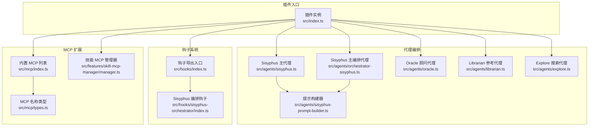
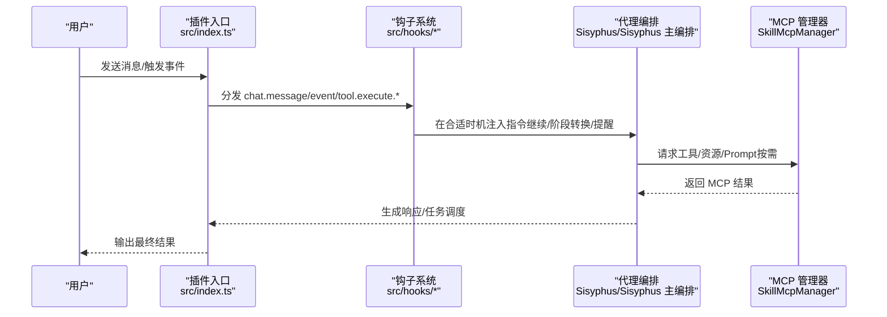
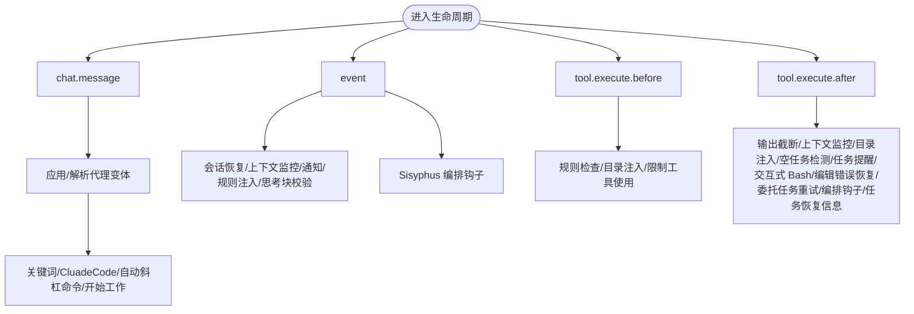
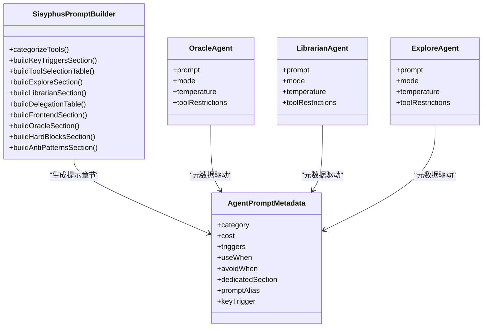
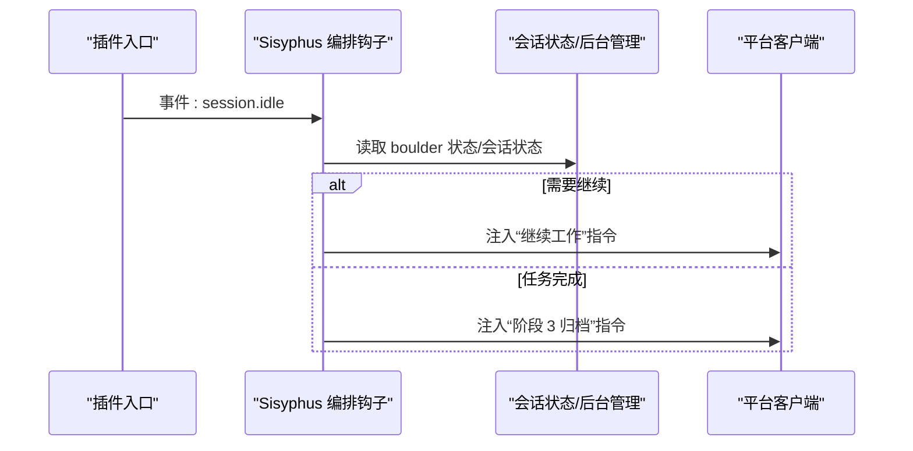
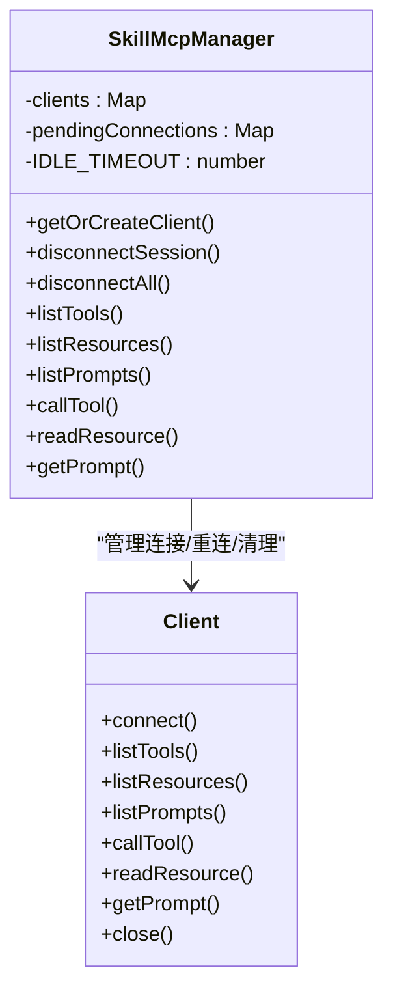
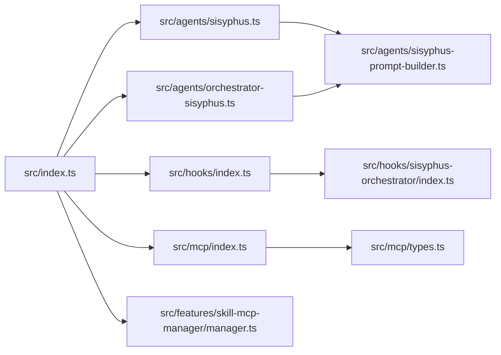

# 核心概念

<cite>
**本文引用的文件**
- [src/index.ts](file://src/index.ts)
- [src/agents/orchestrator-sisyphus.ts](file://src/agents/orchestrator-sisyphus.ts)
- [src/agents/sisyphus.ts](file://src/agents/sisyphus.ts)
- [src/agents/sisyphus-prompt-builder.ts](file://src/agents/sisyphus-prompt-builder.ts)
- [src/agents/types.ts](file://src/agents/types.ts)
- [src/agents/oracle.ts](file://src/agents/oracle.ts)
- [src/agents/librarian.ts](file://src/agents/librarian.ts)
- [src/agents/explore.ts](file://src/agents/explore.ts)
- [src/hooks/index.ts](file://src/hooks/index.ts)
- [src/hooks/sisyphus-orchestrator/index.ts](file://src/hooks/sisyphus-orchestrator/index.ts)
- [src/mcp/index.ts](file://src/mcp/index.ts)
- [src/mcp/types.ts](file://src/mcp/types.ts)
- [src/features/skill-mcp-manager/manager.ts](file://src/features/skill-mcp-manager/manager.ts)
- [src/tools/skill-mcp/index.ts](file://src/tools/skill-mcp/index.ts)
</cite>

## 目录
1. [引言](#引言)
2. [项目结构](#项目结构)
3. [核心组件](#核心组件)
4. [架构总览](#架构总览)
5. [详细组件分析](#详细组件分析)
6. [依赖关系分析](#依赖关系分析)
7. [性能考量](#性能考量)
8. [故障排查指南](#故障排查指南)
9. [结论](#结论)

## 引言
本文件面向开发者与技术读者，系统化阐述 Oh My OpenCode 的核心概念：插件系统、代理编排机制、钩子系统、Sisyphus 编排器、专业代理（Oracle、Librarian、Explore 等）的角色定位，以及 MCP 协议在工具扩展中的作用。文档通过分层讲解与可视化图表，帮助读者快速理解整体设计思路与技术决策。

## 项目结构
Oh My OpenCode 将“插件入口”“代理编排”“钩子系统”“MCP 扩展”等模块清晰分层组织：
- 插件入口：统一注册工具、钩子与配置处理器，暴露给平台调用
- 代理体系：内置 Sisyphus 主编排代理与多个专业子代理（Oracle、Librarian、Explore 等）
- 钩子系统：围绕事件流注入行为（如会话恢复、上下文监控、自动更新、任务提醒等）
- MCP 管理：抽象本地/远程 MCP 服务器连接，提供工具/资源/Prompt 列表与调用能力

**图表来源**
- [src/index.ts](file://src/index.ts#L86-L606)
- [src/agents/sisyphus.ts](file://src/agents/sisyphus.ts#L1-L800)
- [src/agents/orchestrator-sisyphus.ts](file://src/agents/orchestrator-sisyphus.ts#L1-L800)
- [src/agents/oracle.ts](file://src/agents/oracle.ts#L1-L126)
- [src/agents/librarian.ts](file://src/agents/librarian.ts#L1-L330)
- [src/agents/explore.ts](file://src/agents/explore.ts#L1-L126)
- [src/agents/sisyphus-prompt-builder.ts](file://src/agents/sisyphus-prompt-builder.ts#L1-L360)
- [src/hooks/index.ts](file://src/hooks/index.ts#L1-L48)
- [src/hooks/sisyphus-orchestrator/index.ts](file://src/hooks/sisyphus-orchestrator/index.ts#L1-L800)
- [src/mcp/index.ts](file://src/mcp/index.ts#L1-L33)
- [src/mcp/types.ts](file://src/mcp/types.ts#L1-L10)
- [src/features/skill-mcp-manager/manager.ts](file://src/features/skill-mcp-manager/manager.ts#L60-L521)

**章节来源**
- [src/index.ts](file://src/index.ts#L86-L606)

## 核心组件
- 插件入口与生命周期
  - 注册工具集（内置工具、后台工具、look_at、delegate_task、skill、skill_mcp、slashcommand、interactive_bash）
  - 注册钩子集合（上下文窗口监控、会话恢复、通知、关键词检测、规则注入、自动更新、任务提醒、交互式 Bash、Ralph 循环、Sisyphus 编排、TDD Guard 等）
  - 统一处理 chat.message、event、tool.execute.before/after 等生命周期钩子
- 代理编排
  - Sisyphus 主代理与“主编排代理”协同，基于可用代理/工具/技能动态生成提示，指导任务拆解、并行执行与完成归档
  - 专业代理：Oracle（架构/调试顾问）、Librarian（外部参考检索）、Explore（内部模式搜索）
- 钩子系统
  - 事件驱动扩展点，覆盖消息、工具执行前后、会话状态变化等
  - Sisyphus 编排钩子在空闲态自动注入“继续工作”或“阶段转换”指令，保障计划持续推进
- MCP 协议与工具扩展
  - 内置 websearch/context7/grep_app MCP 服务
  - 抽象本地 stdio 与远程 HTTP 连接，统一管理客户端生命周期与重连策略
  - 提供工具/资源/Prompt 列表与调用能力，支持技能级 MCP 工具

**章节来源**
- [src/index.ts](file://src/index.ts#L86-L606)
- [src/agents/sisyphus.ts](file://src/agents/sisyphus.ts#L1-L800)
- [src/agents/orchestrator-sisyphus.ts](file://src/agents/orchestrator-sisyphus.ts#L1-L800)
- [src/agents/oracle.ts](file://src/agents/oracle.ts#L1-L126)
- [src/agents/librarian.ts](file://src/agents/librarian.ts#L1-L330)
- [src/agents/explore.ts](file://src/agents/explore.ts#L1-L126)
- [src/hooks/index.ts](file://src/hooks/index.ts#L1-L48)
- [src/hooks/sisyphus-orchestrator/index.ts](file://src/hooks/sisyphus-orchestrator/index.ts#L1-L800)
- [src/mcp/index.ts](file://src/mcp/index.ts#L1-L33)
- [src/mcp/types.ts](file://src/mcp/types.ts#L1-L10)
- [src/features/skill-mcp-manager/manager.ts](file://src/features/skill-mcp-manager/manager.ts#L60-L521)

## 架构总览
下图展示插件入口如何串联代理、钩子与 MCP 管理器，并在事件流中注入编排逻辑：

**图表来源**
- [src/index.ts](file://src/index.ts#L343-L604)
- [src/hooks/sisyphus-orchestrator/index.ts](file://src/hooks/sisyphus-orchestrator/index.ts#L631-L793)
- [src/features/skill-mcp-manager/manager.ts](file://src/features/skill-mcp-manager/manager.ts#L385-L445)

## 详细组件分析

### 插件系统与生命周期
- 工具注册
  - 合并内置工具与后台工具，统一暴露给平台调用
  - 注入 call_omo_agent、look_at、delegate_task、skill、skill_mcp、slashcommand、interactive_bash
- 生命周期钩子
  - chat.message：根据首条消息变体策略与代理配置，调整输出消息风格
  - event：集中处理会话创建/删除、错误恢复、通知、上下文窗口监控、规则注入、思考块校验、Sisyphus 编排等
  - tool.execute.before/after：在工具调用前后注入规则检查、输出截断、上下文监控、目录注入、任务提醒、编辑错误恢复、委托任务重试等

**图表来源**
- [src/index.ts](file://src/index.ts#L343-L604)

**章节来源**
- [src/index.ts](file://src/index.ts#L86-L606)

### 代理编排与 Sisyphus 编排器
- Sisyphus 主代理
  - 动态提示构建：基于可用代理、工具、技能生成“关键触发”“工具与代理选择”“探索/参考/前端/Oracle 使用边界”等章节
  - 行为规范：技能纪律、意图门、歧义检测、验证前行动、失败恢复、任务管理、沟通风格、硬性约束与反模式
- Sisyphus 主编排代理（Orchestrator Sisyphus）
  - 全流程编排：从意图识别、探索研究、并行执行到验证归档
  - 委托决策矩阵：结合类别/代理/技能三要素，明确何时委托 Explore/Librarian/Oracle/前端工程师/文档作者等
  - 并行执行与背景结果收集：默认并行，完成后统一收口
  - GitHub 工作流：从调查到实现再到 PR 的完整闭环
- 专业代理
  - Oracle：昂贵但高质量的架构/调试顾问，仅在必要时咨询
  - Librarian：外部文档/开源实现检索，提供可复现的永久链接证据
  - Explore：内部模式搜索，多工具并行，结构化返回

**图表来源**
- [src/agents/sisyphus-prompt-builder.ts](file://src/agents/sisyphus-prompt-builder.ts#L1-L360)
- [src/agents/types.ts](file://src/agents/types.ts#L1-L87)
- [src/agents/oracle.ts](file://src/agents/oracle.ts#L1-L126)
- [src/agents/librarian.ts](file://src/agents/librarian.ts#L1-L330)
- [src/agents/explore.ts](file://src/agents/explore.ts#L1-L126)

**章节来源**
- [src/agents/sisyphus.ts](file://src/agents/sisyphus.ts#L1-L800)
- [src/agents/orchestrator-sisyphus.ts](file://src/agents/orchestrator-sisyphus.ts#L1-L800)
- [src/agents/sisyphus-prompt-builder.ts](file://src/agents/sisyphus-prompt-builder.ts#L1-L360)
- [src/agents/types.ts](file://src/agents/types.ts#L1-L87)
- [src/agents/oracle.ts](file://src/agents/oracle.ts#L1-L126)
- [src/agents/librarian.ts](file://src/agents/librarian.ts#L1-L330)
- [src/agents/explore.ts](file://src/agents/explore.ts#L1-L126)

### 钩子系统与事件驱动扩展
- 钩子导出入口
  - 汇总所有钩子工厂函数，按需启用/禁用
- Sisyphus 编排钩子
  - 在 session.idle 时判断是否需要继续推进（boulder 状态、是否为 orchestrator-sisyphus 最后一个调用者、是否有后台任务等）
  - 自动注入“继续工作”或“阶段 3 归档”指令，避免重复触发
  - 对上下文压缩冷却期进行保护，防止与压缩钩子冲突

**图表来源**
- [src/hooks/sisyphus-orchestrator/index.ts](file://src/hooks/sisyphus-orchestrator/index.ts#L631-L793)

**章节来源**
- [src/hooks/index.ts](file://src/hooks/index.ts#L1-L48)
- [src/hooks/sisyphus-orchestrator/index.ts](file://src/hooks/sisyphus-orchestrator/index.ts#L1-L800)

### MCP 协议与工具扩展
- 内置 MCP 服务
  - websearch/context7/grep_app 作为内置 MCP 服务，统一通过 createBuiltinMcps 过滤禁用项
- MCP 名称类型
  - 使用 Zod 枚举约束 MCP 名称，确保类型安全
- 技能 MCP 管理器
  - 支持本地 stdio 与远程 HTTP(SSE) 连接
  - 统一客户端生命周期管理（连接、重连、空闲清理）
  - 提供 listTools/listResources/listPrompts/callTool/readResource/getPrompt 等能力

**图表来源**
- [src/features/skill-mcp-manager/manager.ts](file://src/features/skill-mcp-manager/manager.ts#L60-L521)
- [src/mcp/index.ts](file://src/mcp/index.ts#L1-L33)
- [src/mcp/types.ts](file://src/mcp/types.ts#L1-L10)

**章节来源**
- [src/mcp/index.ts](file://src/mcp/index.ts#L1-L33)
- [src/mcp/types.ts](file://src/mcp/types.ts#L1-L10)
- [src/features/skill-mcp-manager/manager.ts](file://src/features/skill-mcp-manager/manager.ts#L60-L521)
- [src/tools/skill-mcp/index.ts](file://src/tools/skill-mcp/index.ts#L1-L4)

## 依赖关系分析
- 插件入口对代理、钩子、MCP 管理器存在直接依赖；代理依赖提示构建器；钩子依赖会话状态与后台管理；MCP 管理器依赖 SDK 传输层
- 关键耦合点
  - 代理提示构建器：集中维护“关键触发/工具选择/代理使用边界”，降低提示硬编码耦合
  - Sisyphus 编排钩子：与 boulder 状态、会话状态、后台任务强关联，避免重复触发与资源浪费
  - MCP 管理器：统一连接与重连策略，避免进程泄漏与资源占用

**图表来源**
- [src/index.ts](file://src/index.ts#L86-L606)
- [src/agents/sisyphus.ts](file://src/agents/sisyphus.ts#L1-L800)
- [src/agents/orchestrator-sisyphus.ts](file://src/agents/orchestrator-sisyphus.ts#L1-L800)
- [src/agents/sisyphus-prompt-builder.ts](file://src/agents/sisyphus-prompt-builder.ts#L1-L360)
- [src/hooks/index.ts](file://src/hooks/index.ts#L1-L48)
- [src/hooks/sisyphus-orchestrator/index.ts](file://src/hooks/sisyphus-orchestrator/index.ts#L1-L800)
- [src/mcp/index.ts](file://src/mcp/index.ts#L1-L33)
- [src/mcp/types.ts](file://src/mcp/types.ts#L1-L10)
- [src/features/skill-mcp-manager/manager.ts](file://src/features/skill-mcp-manager/manager.ts#L60-L521)

**章节来源**
- [src/index.ts](file://src/index.ts#L86-L606)

## 性能考量
- 并行执行优先：Sisyphus 默认并行启动 Explore/Librarian 等背景任务，减少等待时间
- 背景任务回收：在最终回答前统一取消后台任务，避免资源浪费
- MCP 连接池与空闲清理：统一管理客户端生命周期，避免进程泄漏与内存占用
- 上下文窗口监控与输出截断：在工具执行前后进行上下文评估与输出裁剪，降低超限风险
- 会话恢复与错误回退：对可恢复错误进行自动恢复，减少人工干预

[本节为通用指导，不直接分析具体文件]

## 故障排查指南
- 会话错误与中断
  - 识别 Abort/Error 类型，避免在中断后立即注入继续指令
  - 对上下文长度限制错误进行压缩冷却保护，防止频繁提醒
- 编排钩子误触发
  - 检查是否为 orchestrator-sisyphus 最后一次调用者，避免非编排代理导致的误判
  - 校验后台任务状态，确保无运行中任务时再注入继续/归档指令
- MCP 连接问题
  - 检查连接类型（stdio/http），确认命令/URL 正确
  - 观察重连策略与空闲清理定时器，避免因长时间无使用导致的连接失效

**章节来源**
- [src/hooks/sisyphus-orchestrator/index.ts](file://src/hooks/sisyphus-orchestrator/index.ts#L533-L552)
- [src/features/skill-mcp-manager/manager.ts](file://src/features/skill-mcp-manager/manager.ts#L355-L383)

## 结论
Oh My OpenCode 以“插件入口 + 代理编排 + 钩子系统 + MCP 扩展”为核心架构，通过事件驱动与工具扩展实现高度可配置的 AI 开发辅助系统。Sisyphus 与专业代理各司其职，Sisyphus 编排钩子保障计划持续推进，MCP 管理器提供稳定可靠的外部能力接入。该设计在保证可扩展性的同时，兼顾了性能与稳定性，适合复杂工程场景下的持续交付与协作。