# 钩子系统机制

<cite>
**本文引用的文件**
- [src/hooks/index.ts](file://src/hooks/index.ts)
- [src/hooks/context-window-monitor.ts](file://src/hooks/context-window-monitor.ts)
- [src/hooks/session-recovery/index.ts](file://src/hooks/session-recovery/index.ts)
- [src/hooks/auto-update-checker/index.ts](file://src/hooks/auto-update-checker/index.ts)
- [src/hooks/claude-code-hooks/index.ts](file://src/hooks/claude-code-hooks/index.ts)
- [src/hooks/claude-code-hooks/types.ts](file://src/hooks/claude-code-hooks/types.ts)
- [src/hooks/claude-code-hooks/config.ts](file://src/hooks/claude-code-hooks/config.ts)
- [src/hooks/claude-code-hooks/pre-tool-use.ts](file://src/hooks/claude-code-hooks/pre-tool-use.ts)
- [src/hooks/claude-code-hooks/post-tool-use.ts](file://src/hooks/claude-code-hooks/post-tool-use.ts)
- [src/hooks/claude-code-hooks/user-prompt-submit.ts](file://src/hooks/claude-code-hooks/user-prompt-submit.ts)
- [src/hooks/claude-code-hooks/config-loader.ts](file://src/hooks/claude-code-hooks/config-loader.ts)
- [src/hooks/claude-code-hooks/transcript.ts](file://src/hooks/claude-code-hooks/transcript.ts)
- [src/hooks/claude-code-hooks/tool-input-cache.ts](file://src/hooks/claude-code-hooks/tool-input-cache.ts)
- [src/shared/hook-disabled.ts](file://src/shared/hook-disabled.ts)
- [src/shared/index.ts](file://src/shared/index.ts)
- [src/hooks/phase-flow-enforcer/index.ts](file://src/hooks/phase-flow-enforcer/index.ts)
- [src/hooks/phase-flow-enforcer/constants.ts](file://src/hooks/phase-flow-enforcer/constants.ts)
- [src/hooks/lsp-diagnostics-enforcer/index.ts](file://src/hooks/lsp-diagnostics-enforcer/index.ts)
- [src/hooks/lsp-diagnostics-enforcer/constants.ts](file://src/hooks/lsp-diagnostics-enforcer/constants.ts)
- [src/hooks/subagent-verification/index.ts](file://src/hooks/subagent-verification/index.ts)
- [src/hooks/subagent-verification/constants.ts](file://src/hooks/subagent-verification/constants.ts)
- [src/hooks/plan-attention-refresher/index.ts](file://src/hooks/plan-attention-refresher/index.ts)
- [src/hooks/plan-update-reminder/index.ts](file://src/hooks/plan-update-reminder/index.ts)
- [src/hooks/codebase-assessment/index.ts](file://src/hooks/codebase-assessment/index.ts)
- [src/hooks/codebase-assessment/constants.ts](file://src/hooks/codebase-assessment/constants.ts)
- [src/hooks/codebase-assessment/collector.ts](file://src/hooks/codebase-assessment/collector.ts)
</cite>

## 更新摘要
**所做更改**
- 新增 Manu Planning 相关钩子系统集成，包括 phase-flow-enforcer、lsp-diagnostics-enforcer、subagent-verification、plan-attention-refresher、plan-update-reminder、codebase-assessment 六个核心钩子
- 扩展钩子系统功能范围，覆盖开发流程管控、质量保证、注意力管理和代码库评估等关键领域
- 增强钩子分类体系，区分 PreToolUse、PostToolUse、Session 级别的不同执行时机

## 目录
1. [简介](#简介)
2. [项目结构](#项目结构)
3. [核心组件](#核心组件)
4. [架构总览](#架构总览)
5. [详细组件分析](#详细组件分析)
6. [Manu Planning 钩子系统](#manu-planning-钩子系统)
7. [依赖关系分析](#依赖关系分析)
8. [性能考量](#性能考量)
9. [故障排查指南](#故障排查指南)
10. [结论](#结论)
11. [附录：钩子开发与最佳实践](#附录钩子开发与最佳实践)

## 简介
本文件系统性阐述 Oh My OpenCode 的钩子（Hook）系统机制，围绕事件驱动架构展开，重点说明钩子的注册、触发与执行流程；覆盖上下文监控、会话恢复、自动更新检查、Claude Code 钩子桥接等能力；并新增 Manu Planning 相关的六个核心钩子系统，包括相位流程强制器、LSP 诊断强制器、子代理验证器、计划注意力刷新器、计划更新提醒器和代码库评估器。文档详细描述不同类型钩子的功能特性，解释钩子的生命周期管理、优先级排序和依赖关系处理，并提供钩子开发指南、最佳实践和性能考虑。

## 项目结构
钩子系统主要位于 src/hooks 目录下，按功能拆分为多个子模块，并通过统一入口导出。Claude Code 钩子体系以"事件名映射 + 命令执行"的方式实现，配置来源于用户/项目设置与扩展配置，支持按工具名或通配符匹配钩子命令。新增的 Manu Planning 钩子系统进一步完善了开发流程管控能力。

```mermaid
graph TB
subgraph "钩子入口"
HIdx["hooks/index.ts"]
end
subgraph "通用钩子"
CWM["context-window-monitor.ts"]
SR["session-recovery/index.ts"]
AUC["auto-update-checker/index.ts"]
end
subgraph "Claude Code 钩子"
CCIdx["claude-code-hooks/index.ts"]
CCTypes["claude-code-hooks/types.ts"]
CCConf["claude-code-hooks/config.ts"]
CCPref["claude-code-hooks/pre-tool-use.ts"]
CCPost["claude-code-hooks/post-tool-use.ts"]
CCUser["claude-code-hooks/user-prompt-submit.ts"]
CCConfLoader["claude-code-hooks/config-loader.ts"]
CCTrans["claude-code-hooks/transcript.ts"]
CCToolCache["claude-code-hooks/tool-input-cache.ts"]
end
subgraph "Manu Planning 钩子"
PFE["phase-flow-enforcer/index.ts"]
LDE["lsp-diagnostics-enforcer/index.ts"]
SAV["subagent-verification/index.ts"]
PAR["plan-attention-refresher/index.ts"]
PUR["plan-update-reminder/index.ts"]
CA["codebase-assessment/index.ts"]
end
subgraph "共享工具"
SHookDis["shared/hook-disabled.ts"]
SIdx["shared/index.ts"]
end
HIdx --> CWM
HIdx --> SR
HIdx --> AUC
HIdx --> CCIdx
HIdx --> PFE
HIdx --> LDE
HIdx --> SAV
HIdx --> PAR
HIdx --> PUR
HIdx --> CA
CCIdx --> CCTypes
CCIdx --> CCConf
CCIdx --> CCPref
CCIdx --> CCPost
CCIdx --> CCUser
CCIdx --> CCConfLoader
CCIdx --> CCTrans
CCIdx --> CCToolCache
CCIdx --> SHookDis
CCIdx --> SIdx
```

**图表来源**
- [src/hooks/index.ts](file://src/hooks/index.ts#L1-L48)
- [src/hooks/context-window-monitor.ts](file://src/hooks/context-window-monitor.ts#L1-L100)
- [src/hooks/session-recovery/index.ts](file://src/hooks/session-recovery/index.ts#L1-L433)
- [src/hooks/auto-update-checker/index.ts](file://src/hooks/auto-update-checker/index.ts#L1-L261)
- [src/hooks/claude-code-hooks/index.ts](file://src/hooks/claude-code-hooks/index.ts#L1-L402)
- [src/hooks/phase-flow-enforcer/index.ts](file://src/hooks/phase-flow-enforcer/index.ts#L1-L105)
- [src/hooks/lsp-diagnostics-enforcer/index.ts](file://src/hooks/lsp-diagnostics-enforcer/index.ts#L1-L96)
- [src/hooks/subagent-verification/index.ts](file://src/hooks/subagent-verification/index.ts#L1-L56)
- [src/hooks/plan-attention-refresher/index.ts](file://src/hooks/plan-attention-refresher/index.ts#L1-L140)
- [src/hooks/plan-update-reminder/index.ts](file://src/hooks/plan-update-reminder/index.ts#L1-L73)
- [src/hooks/codebase-assessment/index.ts](file://src/hooks/codebase-assessment/index.ts#L1-L95)

## 核心组件
- 通用钩子集合：提供上下文监控、会话恢复、自动更新检查、通知与引导等基础能力。
- Claude Code 钩子桥接：将 OpenCode 的事件模型映射到 Claude Code 的 Hook 概念，支持 PreToolUse、PostToolUse、UserPromptSubmit、Stop、PreCompact 五类事件，通过外部命令执行实现可插拔逻辑。
- Manu Planning 钩子系统：新增六个专门针对 Manu Planning 工作流的钩子，包括相位流程强制、LSP 诊断强制、子代理验证、计划注意力刷新、计划更新提醒和代码库评估。
- 配置与禁用控制：支持从多处加载配置，按事件类型与命令模式禁用特定钩子。
- 工具链辅助：输入缓存、转录记录、会话状态跟踪、中断/错误状态管理等。

**章节来源**
- [src/hooks/index.ts](file://src/hooks/index.ts#L1-L48)
- [src/hooks/phase-flow-enforcer/index.ts](file://src/hooks/phase-flow-enforcer/index.ts#L1-L105)
- [src/hooks/lsp-diagnostics-enforcer/index.ts](file://src/hooks/lsp-diagnostics-enforcer/index.ts#L1-L96)
- [src/hooks/subagent-verification/index.ts](file://src/hooks/subagent-verification/index.ts#L1-L56)
- [src/hooks/plan-attention-refresher/index.ts](file://src/hooks/plan-attention-refresher/index.ts#L1-L140)
- [src/hooks/plan-update-reminder/index.ts](file://src/hooks/plan-update-reminder/index.ts#L1-L73)
- [src/hooks/codebase-assessment/index.ts](file://src/hooks/codebase-assessment/index.ts#L1-L95)

## 架构总览
钩子系统采用"事件驱动 + 外部命令执行"的双层架构：
- 事件驱动层：由 OpenCode 插件框架触发事件（如 session.created、tool.execute.before/after、event 等），钩子函数根据事件类型进行响应。
- 执行层：Claude Code 钩子通过配置匹配器定位外部命令，将标准化输入序列化后传递给外部脚本，读取其标准输出的 JSON 结果，决定是否阻断、修改输入/输出或注入消息。
- Manu Planning 层：新增的六个钩子专门处理开发流程管控，包括相位验证、质量保证、注意力管理和代码库适应。

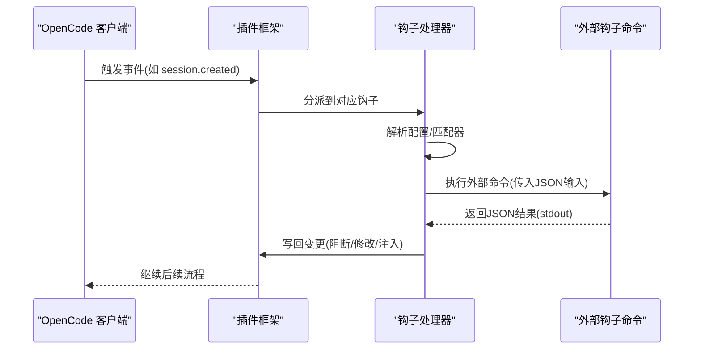

**图表来源**
- [src/hooks/claude-code-hooks/index.ts](file://src/hooks/claude-code-hooks/index.ts#L42-L96)
- [src/hooks/phase-flow-enforcer/index.ts](file://src/hooks/phase-flow-enforcer/index.ts#L14-L104)

## 详细组件分析

### 上下文监控钩子（Context Window Monitor）
职责：在工具执行后检查会话中最近一次助手消息的令牌使用情况，当达到阈值时向输出追加提醒信息，并在会话删除时清理状态。

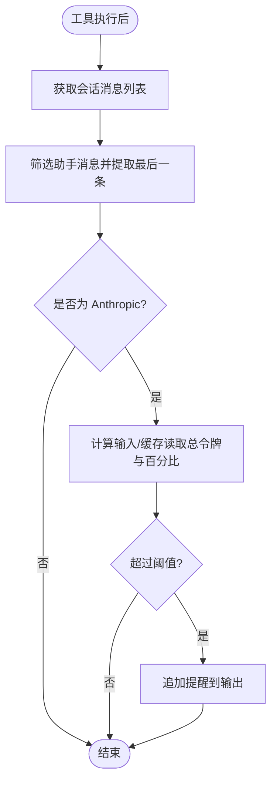

**图表来源**
- [src/hooks/context-window-monitor.ts](file://src/hooks/context-window-monitor.ts#L36-L98)

**章节来源**
- [src/hooks/context-window-monitor.ts](file://src/hooks/context-window-monitor.ts#L1-L100)

### 会话恢复钩子（Session Recovery）
职责：在助手消息失败时识别错误类型并尝试修复，支持"缺少工具结果""思考块顺序""禁用思考违规"等场景；可选自动继续任务；提供回调通知。

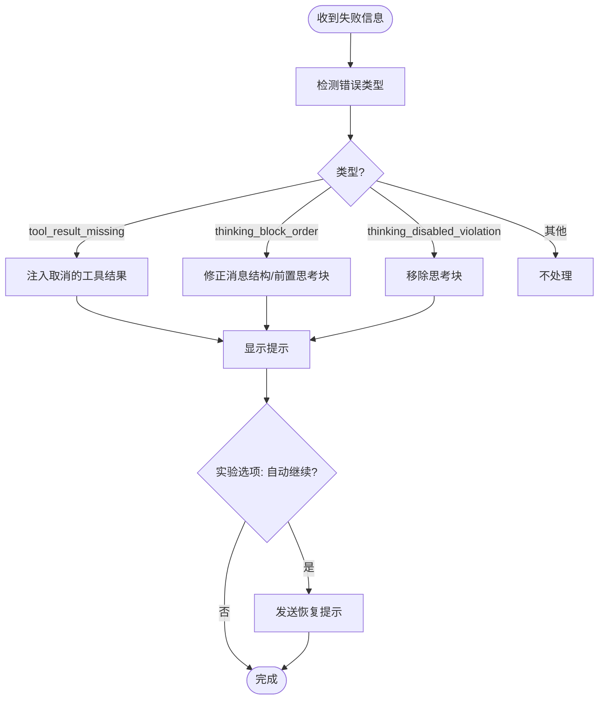

**图表来源**
- [src/hooks/session-recovery/index.ts](file://src/hooks/session-recovery/index.ts#L125-L432)

**章节来源**
- [src/hooks/session-recovery/index.ts](file://src/hooks/session-recovery/index.ts#L1-L433)

### 自动更新检查钩子（Auto Update Checker）
职责：在会话创建时进行版本检查，支持本地开发模式、通道解析、后台更新安装与通知；可配置是否自动更新。

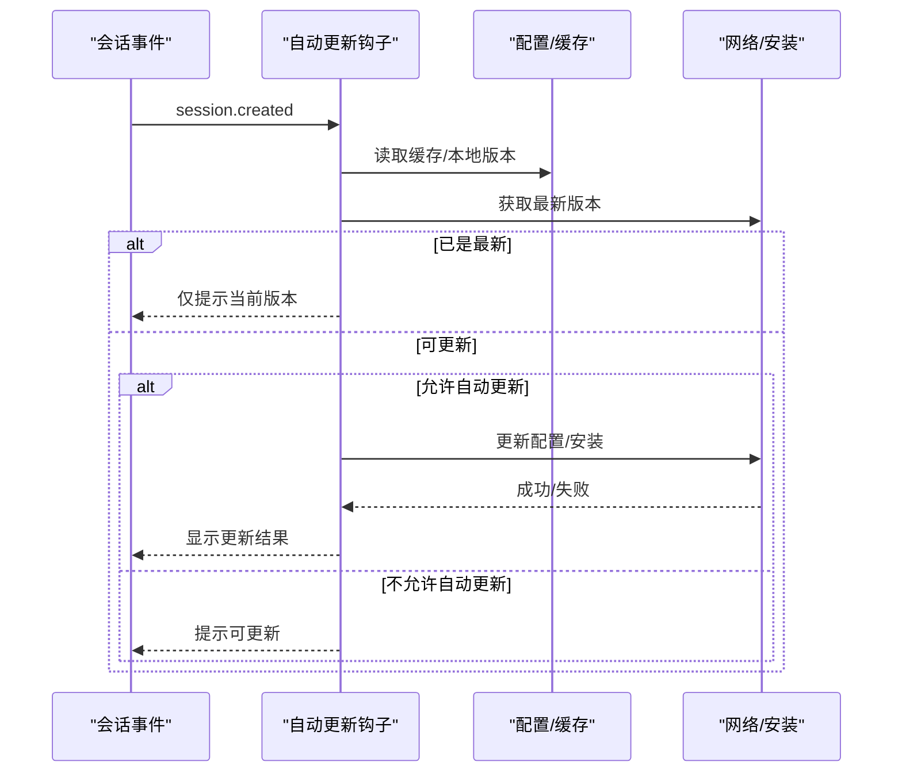

**图表来源**
- [src/hooks/auto-update-checker/index.ts](file://src/hooks/auto-update-checker/index.ts#L63-L158)

**章节来源**
- [src/hooks/auto-update-checker/index.ts](file://src/hooks/auto-update-checker/index.ts#L1-L261)

### Claude Code 钩子桥接（Claude Code Hooks）
职责：将 OpenCode 事件映射为 Claude Code 钩子概念，支持 PreToolUse、PostToolUse、UserPromptSubmit、Stop、PreCompact；通过配置加载与命令执行实现可插拔逻辑。

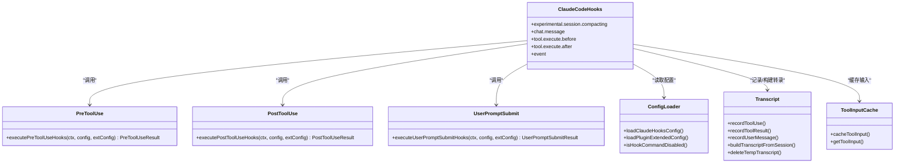

**图表来源**
- [src/hooks/claude-code-hooks/index.ts](file://src/hooks/claude-code-hooks/index.ts#L36-L401)
- [src/hooks/claude-code-hooks/pre-tool-use.ts](file://src/hooks/claude-code-hooks/pre-tool-use.ts#L46-L172)
- [src/hooks/claude-code-hooks/post-tool-use.ts](file://src/hooks/claude-code-hooks/post-tool-use.ts#L44-L199)
- [src/hooks/claude-code-hooks/user-prompt-submit.ts](file://src/hooks/claude-code-hooks/user-prompt-submit.ts#L35-L117)

**章节来源**
- [src/hooks/claude-code-hooks/index.ts](file://src/hooks/claude-code-hooks/index.ts#L1-L402)
- [src/hooks/claude-code-hooks/types.ts](file://src/hooks/claude-code-hooks/types.ts#L1-L205)
- [src/hooks/claude-code-hooks/config.ts](file://src/hooks/claude-code-hooks/config.ts#L1-L104)
- [src/hooks/claude-code-hooks/config-loader.ts](file://src/hooks/claude-code-hooks/config-loader.ts#L1-L108)
- [src/hooks/claude-code-hooks/transcript.ts](file://src/hooks/claude-code-hooks/transcript.ts#L1-L253)
- [src/hooks/claude-code-hooks/tool-input-cache.ts](file://src/hooks/claude-code-hooks/tool-input-cache.ts#L1-L48)

## Manu Planning 钩子系统

### 相位流程强制器（Phase Flow Enforcer）
职责：监控 Boulder 状态更新，防止代理跳过开发工作流中的相位。强制正确的推进顺序：idle → planning → reviewing → executing → awaiting_user → completed。

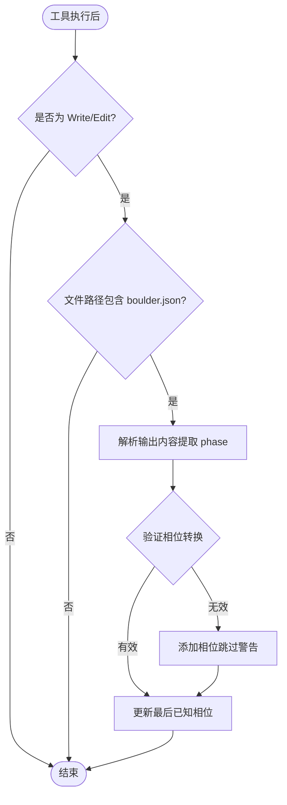

**图表来源**
- [src/hooks/phase-flow-enforcer/index.ts](file://src/hooks/phase-flow-enforcer/index.ts#L14-L104)
- [src/hooks/phase-flow-enforcer/constants.ts](file://src/hooks/phase-flow-enforcer/constants.ts#L30-L54)

**章节来源**
- [src/hooks/phase-flow-enforcer/index.ts](file://src/hooks/phase-flow-enforcer/index.ts#L1-L105)
- [src/hooks/phase-flow-enforcer/constants.ts](file://src/hooks/phase-flow-enforcer/constants.ts#L1-L54)

### LSP 诊断强制器（LSP Diagnostics Enforcer）
职责：跟踪文件修改并在任务标记完成前强制运行 LSP 诊断。确保在项目级别运行诊断以捕获级联类型错误。

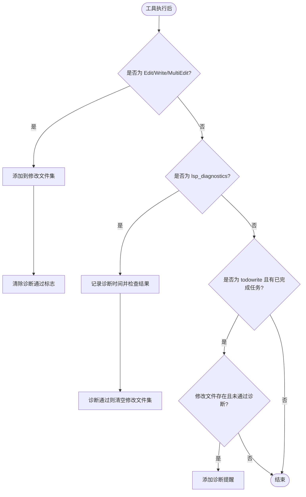

**图表来源**
- [src/hooks/lsp-diagnostics-enforcer/index.ts](file://src/hooks/lsp-diagnostics-enforcer/index.ts#L38-L95)

**章节来源**
- [src/hooks/lsp-diagnostics-enforcer/index.ts](file://src/hooks/lsp-diagnostics-enforcer/index.ts#L1-L96)
- [src/hooks/lsp-diagnostics-enforcer/constants.ts](file://src/hooks/lsp-diagnostics-enforcer/constants.ts#L1-L32)

### 子代理验证器（Subagent Verification）
职责：在委托任务完成后注入验证提醒，强制执行"子代理会说谎"原则，要求协调器独立验证所有委派工作。

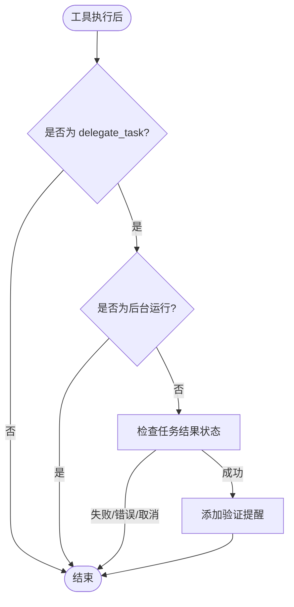

**图表来源**
- [src/hooks/subagent-verification/index.ts](file://src/hooks/subagent-verification/index.ts#L14-L55)

**章节来源**
- [src/hooks/subagent-verification/index.ts](file://src/hooks/subagent-verification/index.ts#L1-L56)
- [src/hooks/subagent-verification/constants.ts](file://src/hooks/subagent-verification/constants.ts#L1-L33)

### 计划注意力刷新器（Plan Attention Refresher）
职责：在主要工具操作前将任务文件预览注入代理的注意力窗口，实现"注意力操控"原理。

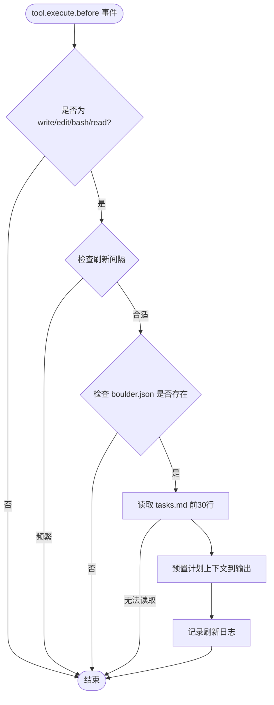

**图表来源**
- [src/hooks/plan-attention-refresher/index.ts](file://src/hooks/plan-attention-refresher/index.ts#L68-L139)

**章节来源**
- [src/hooks/plan-attention-refresher/index.ts](file://src/hooks/plan-attention-refresher/index.ts#L1-L140)

### 计划更新提醒器（Plan Update Reminder）
职责：在代码文件修改后提醒代理更新任务文件，保持计划文件与工作同步。

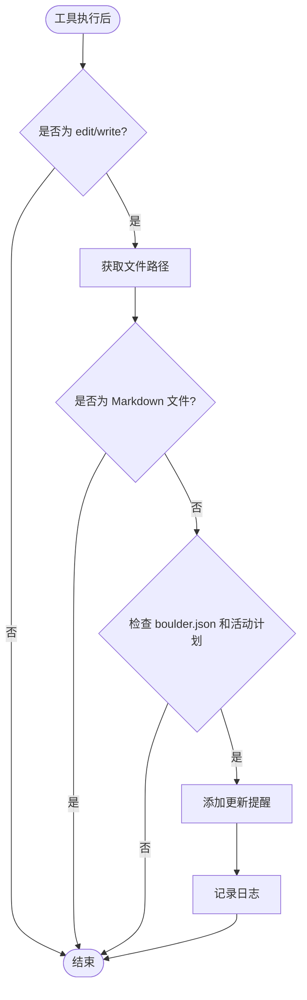

**图表来源**
- [src/hooks/plan-update-reminder/index.ts](file://src/hooks/plan-update-reminder/index.ts#L28-L72)

**章节来源**
- [src/hooks/plan-update-reminder/index.ts](file://src/hooks/plan-update-reminder/index.ts#L1-L73)

### 代码库评估器（Codebase Assessment）
职责：在会话开始时收集项目配置信息，在上下文中注入评估结果，使代理能够根据代码库状态调整行为。

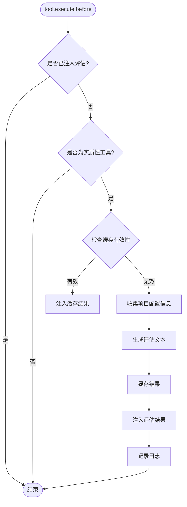

**图表来源**
- [src/hooks/codebase-assessment/index.ts](file://src/hooks/codebase-assessment/index.ts#L21-L94)

**章节来源**
- [src/hooks/codebase-assessment/index.ts](file://src/hooks/codebase-assessment/index.ts#L1-L95)
- [src/hooks/codebase-assessment/constants.ts](file://src/hooks/codebase-assessment/constants.ts#L1-L73)
- [src/hooks/codebase-assessment/collector.ts](file://src/hooks/codebase-assessment/collector.ts#L1-L111)

## 依赖关系分析
- 钩子入口集中导出所有可用钩子工厂方法，便于插件侧统一注册。
- Claude Code 钩子依赖共享工具（命令执行、命名转换、模式匹配、日志等）与配置加载器。
- Manu Planning 钩子系统依赖 Boulder 状态管理、文件系统操作和项目配置收集。
- 会话恢复钩子依赖存储工具（消息查询、部分替换/注入）与客户端 API。
- 自动更新钩子依赖配置错误收集、包缓存失效与安装流程。

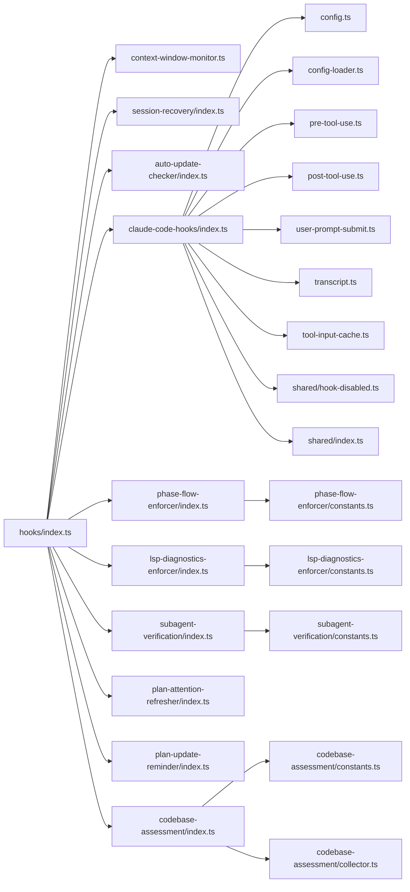

**图表来源**
- [src/hooks/index.ts](file://src/hooks/index.ts#L1-L48)
- [src/hooks/phase-flow-enforcer/index.ts](file://src/hooks/phase-flow-enforcer/index.ts#L1-L105)
- [src/hooks/lsp-diagnostics-enforcer/index.ts](file://src/hooks/lsp-diagnostics-enforcer/index.ts#L1-L96)
- [src/hooks/subagent-verification/index.ts](file://src/hooks/subagent-verification/index.ts#L1-L56)
- [src/hooks/codebase-assessment/index.ts](file://src/hooks/codebase-assessment/index.ts#L1-L95)

**章节来源**
- [src/hooks/index.ts](file://src/hooks/index.ts#L1-L48)
- [src/shared/index.ts](file://src/shared/index.ts#L1-L29)

## 性能考量
- Claude Code 钩子执行为外部命令调用，应避免频繁/重型操作；必要时使用输入缓存与转录文件复用。
- Manu Planning 钩子系统引入了新的性能考虑：相位流程强制器使用正则表达式解析 JSON 输出，LSP 诊断强制器维护会话状态映射，代码库评估器使用缓存机制。
- 会话恢复钩子对消息列表进行多次扫描与写入，应在错误发生时尽早短路。
- 自动更新检查在后台异步执行，注意并发与重试策略，避免阻塞主流程。
- 日志与提示需节流，避免在高频事件中产生过多 UI 干扰。

## 故障排查指南
- Claude Code 钩子命令返回非零退出码：检查命令是否存在、权限与环境；查看标准错误输出。
- PreToolUse 返回阻断：确认原因字符串与决策字段；检查外部命令是否正确输出 JSON。
- PostToolUse 返回警告：关注附加上下文与抑制输出标志；必要时调整命令输出格式。
- 会话恢复失败：确认错误类型识别是否正确；检查消息存储与部分替换逻辑。
- 自动更新未生效：检查通道解析、配置路径与安装流程；查看缓存失效与包目录权限。
- Manu Planning 钩子问题：
  - 相位流程强制器：检查 boulder.json 文件路径和 JSON 解析正则表达式
  - LSP 诊断强制器：验证工具名称匹配和诊断结果判断逻辑
  - 子代理验证器：确认委托任务工具名称和结果状态检查
  - 计划注意力刷新器：检查文件路径拼接和 boulder.json 状态读取
  - 计划更新提醒器：验证文件扩展名排除规则
  - 代码库评估器：检查配置文件检测和状态缓存机制

**章节来源**
- [src/hooks/claude-code-hooks/pre-tool-use.ts](file://src/hooks/claude-code-hooks/pre-tool-use.ts#L96-L172)
- [src/hooks/claude-code-hooks/post-tool-use.ts](file://src/hooks/claude-code-hooks/post-tool-use.ts#L117-L199)
- [src/hooks/session-recovery/index.ts](file://src/hooks/session-recovery/index.ts#L394-L424)
- [src/hooks/auto-update-checker/index.ts](file://src/hooks/auto-update-checker/index.ts#L160-L168)
- [src/hooks/phase-flow-enforcer/index.ts](file://src/hooks/phase-flow-enforcer/index.ts#L42-L80)
- [src/hooks/lsp-diagnostics-enforcer/index.ts](file://src/hooks/lsp-diagnostics-enforcer/index.ts#L64-L92)
- [src/hooks/subagent-verification/index.ts](file://src/hooks/subagent-verification/index.ts#L40-L53)
- [src/hooks/plan-attention-refresher/index.ts](file://src/hooks/plan-attention-refresher/index.ts#L99-L136)
- [src/hooks/plan-update-reminder/index.ts](file://src/hooks/plan-update-reminder/index.ts#L54-L69)
- [src/hooks/codebase-assessment/index.ts](file://src/hooks/codebase-assessment/index.ts#L50-L91)

## 结论
Oh My OpenCode 的钩子系统通过事件驱动与外部命令执行相结合，实现了高度可扩展的插件化能力。Claude Code 钩子桥接提供了与外部生态一致的扩展点，配合灵活的配置与禁用机制，既能满足安全控制需求，又保持了强大的可定制性。新增的 Manu Planning 钩子系统进一步完善了开发流程管控能力，包括相位验证、质量保证、注意力管理和代码库适应等关键功能，显著提升了复杂项目的开发效率和质量保证水平。

## 附录：钩子开发与最佳实践

### 生命周期与触发时机
- 事件驱动：根据 OpenCode 事件（如 session.created、tool.execute.before/after、event）触发钩子。
- Claude Code 映射：将 OpenCode 事件映射到 PreToolUse、PostToolUse、UserPromptSubmit、Stop、PreCompact 等钩子事件。
- Manu Planning 钩子：区分 PreToolUse（工具执行前）、PostToolUse（工具执行后）和 Session 级别事件的触发时机。
- 状态管理：维护会话级状态（如中断/错误标记、首次消息标记、处理中集合）以避免重复处理与竞态。

**章节来源**
- [src/hooks/claude-code-hooks/index.ts](file://src/hooks/claude-code-hooks/index.ts#L314-L399)
- [src/hooks/phase-flow-enforcer/index.ts](file://src/hooks/phase-flow-enforcer/index.ts#L14-L104)
- [src/hooks/plan-attention-refresher/index.ts](file://src/hooks/plan-attention-refresher/index.ts#L68-L139)

### 优先级与依赖处理
- 匹配器优先：按配置中的匹配器顺序执行，先匹配者优先；支持通配符与正则。
- 依赖顺序：PreToolUse 在工具调用前执行，PostToolUse 在工具调用后执行；UserPromptSubmit 在消息发送前注入。
- 中断与阻断：若 PreToolUse 决策为阻断，则跳过工具执行；PostToolUse 可警告但通常不阻断。
- Manu Planning 依赖：相位流程强制器依赖 Boulder 状态，LSP 诊断强制器依赖文件修改跟踪，代码库评估器依赖项目配置收集。

**章节来源**
- [src/hooks/claude-code-hooks/config.ts](file://src/hooks/claude-code-hooks/config.ts#L20-L44)
- [src/hooks/phase-flow-enforcer/constants.ts](file://src/hooks/phase-flow-enforcer/constants.ts#L30-L38)
- [src/hooks/lsp-diagnostics-enforcer/constants.ts](file://src/hooks/lsp-diagnostics-enforcer/constants.ts#L25-L31)
- [src/hooks/codebase-assessment/constants.ts](file://src/hooks/codebase-assessment/constants.ts#L54-L72)

### 配置与禁用
- 配置来源：Claude 设置文件、用户/项目扩展配置合并；支持按事件类型与命令模式禁用。
- 禁用策略：可通过数组精确匹配命令正则，或整体禁用某类钩子。
- Manu Planning 配置：支持单独配置每个钩子的启用状态和行为参数。

**章节来源**
- [src/hooks/claude-code-hooks/config.ts](file://src/hooks/claude-code-hooks/config.ts#L46-L103)
- [src/hooks/claude-code-hooks/config-loader.ts](file://src/hooks/claude-code-hooks/config-loader.ts#L55-L107)
- [src/shared/hook-disabled.ts](file://src/shared/hook-disabled.ts#L3-L22)

### 开发步骤示例（创建自定义钩子）
- 设计事件：确定触发事件（如 tool.execute.before/after 或自定义 event）。
- 编写钩子：实现对应处理器函数，读取输入参数，必要时调用客户端 API。
- 注册钩子：在钩子入口导出工厂方法，供插件侧注册。
- 测试验证：构造事件场景，验证钩子行为与副作用（UI 提示、消息注入、会话状态变更）。
- Manu Planning 钩子开发：参考现有钩子的实现模式，注意状态管理和性能优化。

**章节来源**
- [src/hooks/index.ts](file://src/hooks/index.ts#L1-L48)
- [src/hooks/context-window-monitor.ts](file://src/hooks/context-window-monitor.ts#L33-L98)
- [src/hooks/phase-flow-enforcer/index.ts](file://src/hooks/phase-flow-enforcer/index.ts#L14-L104)
- [src/hooks/lsp-diagnostics-enforcer/index.ts](file://src/hooks/lsp-diagnostics-enforcer/index.ts#L38-L95)
- [src/hooks/codebase-assessment/index.ts](file://src/hooks/codebase-assessment/index.ts#L21-L94)