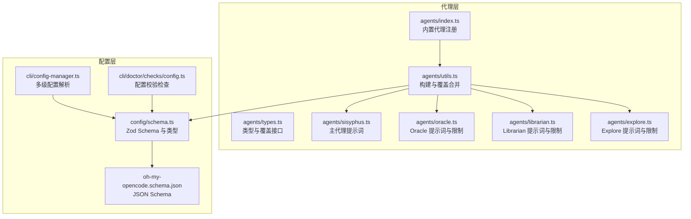
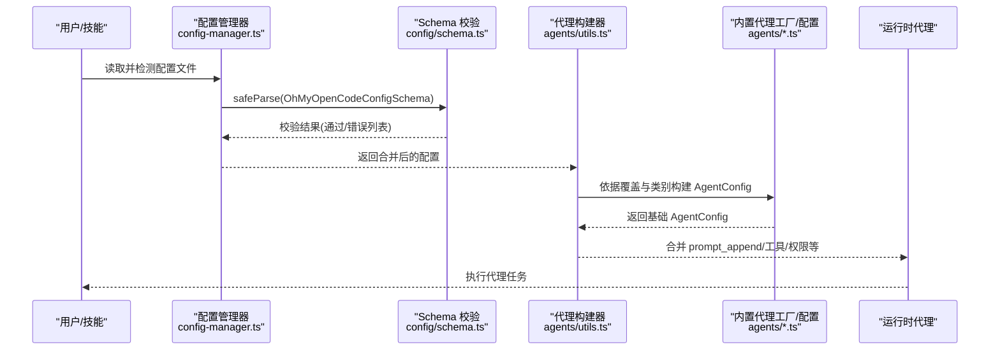
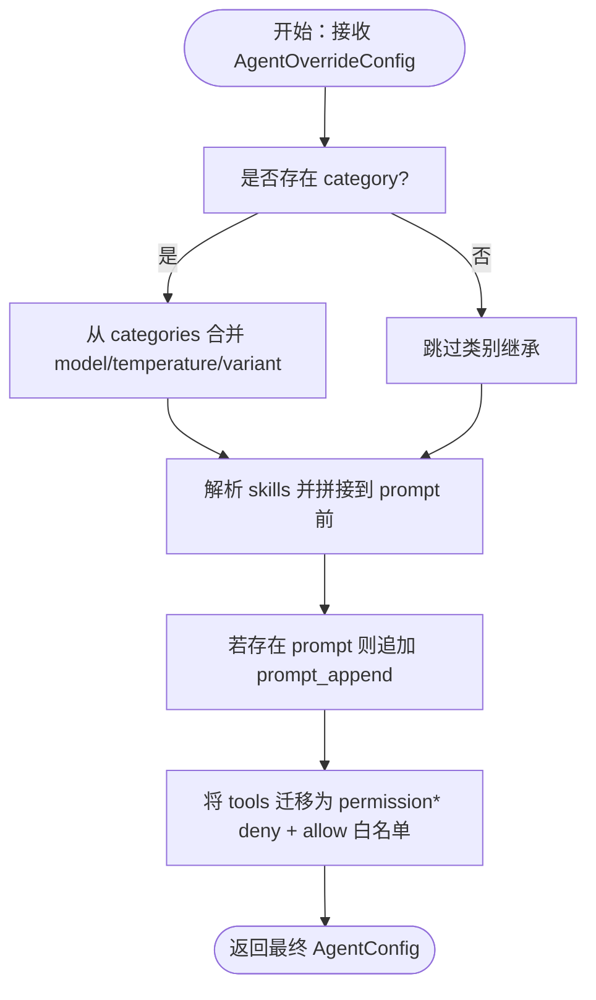
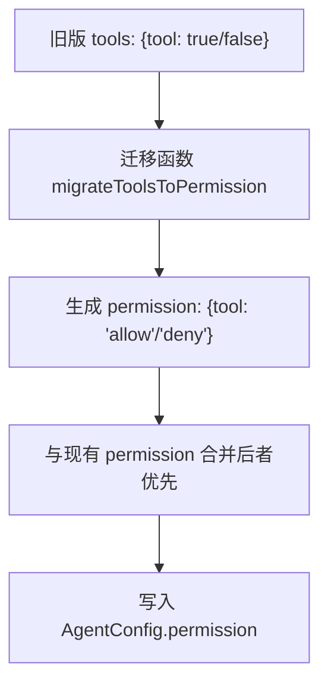
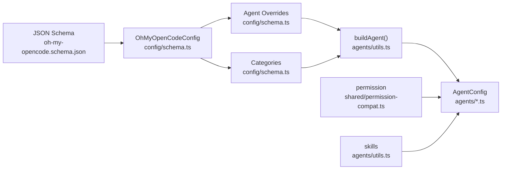

# 代理配置

<cite>
**本文引用的文件**
- [src/agents/index.ts](file://src/agents/index.ts)
- [src/agents/types.ts](file://src/agents/types.ts)
- [src/agents/utils.ts](file://src/agents/utils.ts)
- [src/agents/sisyphus.ts](file://src/agents/sisyphus.ts)
- [src/agents/oracle.ts](file://src/agents/oracle.ts)
- [src/agents/librarian.ts](file://src/agents/librarian.ts)
- [src/agents/explore.ts](file://src/agents/explore.ts)
- [src/config/schema.ts](file://src/config/schema.ts)
- [assets/oh-my-opencode.schema.json](file://assets/oh-my-opencode.schema.json)
- [CONFIGURATION-GUIDE.md](file://CONFIGURATION-GUIDE.md)
- [AGENTS.md](file://AGENTS.md)
- [src/shared/permission-compat.ts](file://src/shared/permission-compat.ts)
- [src/cli/doctor/checks/config.ts](file://src/cli/doctor/checks/config.ts)
- [src/cli/config-manager.ts](file://src/cli/config-manager.ts)
</cite>

## 目录
1. [简介](#简介)
2. [项目结构](#项目结构)
3. [核心组件](#核心组件)
4. [架构总览](#架构总览)
5. [详细组件分析](#详细组件分析)
6. [依赖关系分析](#依赖关系分析)
7. [性能考量](#性能考量)
8. [故障排除指南](#故障排除指南)
9. [结论](#结论)
10. [附录](#附录)

## 简介
本文件面向 Oh My OpenCode 的使用者与维护者，系统化阐述“代理配置”的设计与实践，重点覆盖：
- 内置代理的配置选项与行为差异（Sisyphus、Oracle、Librarian、Explore 等）
- 代理覆盖配置的使用方法（模型继承、技能注入、工具启用、权限控制）
- 代理模式（subagent、primary、all）的语义与适用场景
- 完整示例与最佳实践
- 调试与故障排除方法

## 项目结构
围绕代理配置的关键目录与文件：
- 代理定义与工厂：src/agents/*.ts
- 代理覆盖与构建：src/agents/utils.ts
- 配置 Schema 与类型：src/config/schema.ts、assets/oh-my-opencode.schema.json
- 配置校验与诊断：src/cli/doctor/checks/config.ts、src/cli/config-manager.ts
- 使用指南与示例：CONFIGURATION-GUIDE.md、AGENTS.md

**图表来源**
- [src/agents/index.ts](file://src/agents/index.ts#L17-L32)
- [src/agents/utils.ts](file://src/agents/utils.ts#L25-L40)
- [src/agents/types.ts](file://src/agents/types.ts#L81-L87)
- [src/config/schema.ts](file://src/config/schema.ts#L109-L151)
- [assets/oh-my-opencode.schema.json](file://assets/oh-my-opencode.schema.json#L102-L161)
- [src/cli/config-manager.ts](file://src/cli/config-manager.ts#L159-L170)
- [src/cli/doctor/checks/config.ts](file://src/cli/doctor/checks/config.ts#L27-L47)

**章节来源**
- [src/agents/index.ts](file://src/agents/index.ts#L17-L32)
- [src/agents/utils.ts](file://src/agents/utils.ts#L141-L224)
- [src/config/schema.ts](file://src/config/schema.ts#L338-L358)
- [assets/oh-my-opencode.schema.json](file://assets/oh-my-opencode.schema.json#L102-L161)
- [src/cli/config-manager.ts](file://src/cli/config-manager.ts#L159-L170)
- [src/cli/doctor/checks/config.ts](file://src/cli/doctor/checks/config.ts#L83-L113)

## 核心组件
- 内置代理注册表：集中导出所有内置代理的工厂或配置对象，供上层统一构建。
- 代理覆盖接口：支持对模型、温度、工具、技能、提示词追加、模式、颜色、权限等进行覆盖。
- 类别配置：通过 categories 为代理提供模型、变体、温度、工具集、默认技能等继承来源。
- 权限系统：基于 permission 字段的“允许/拒绝/询问”策略，兼容旧版 tools 格式迁移。

**章节来源**
- [src/agents/index.ts](file://src/agents/index.ts#L17-L32)
- [src/agents/types.ts](file://src/agents/types.ts#L81-L87)
- [src/config/schema.ts](file://src/config/schema.ts#L170-L186)
- [src/shared/permission-compat.ts](file://src/shared/permission-compat.ts#L15-L40)

## 架构总览
下图展示了从配置到代理构建与运行的整体流程：

**图表来源**
- [src/cli/config-manager.ts](file://src/cli/config-manager.ts#L159-L170)
- [src/config/schema.ts](file://src/config/schema.ts#L338-L358)
- [src/agents/utils.ts](file://src/agents/utils.ts#L141-L224)
- [src/agents/index.ts](file://src/agents/index.ts#L17-L32)

## 详细组件分析

### 内置代理与提示词元数据
- Sisyphus：主协调代理，负责请求分类、技能优先级、委托规划等。
- Oracle：只读咨询专家，高推理能力，适合复杂架构与硬调试。
- Librarian：多仓库搜索与文档发现，提供官方文档定位与示例查找。
- Explore：上下文 grep 专家，用于快速定位代码位置与交叉验证。

这些代理在各自模块中定义了默认模型、提示词与工具限制，并通过元数据描述其使用场景与触发条件。

**章节来源**
- [src/agents/sisyphus.ts](file://src/agents/sisyphus.ts#L19-L101)
- [src/agents/oracle.ts](file://src/agents/oracle.ts#L100-L126)
- [src/agents/librarian.ts](file://src/agents/librarian.ts#L24-L200)
- [src/agents/explore.ts](file://src/agents/explore.ts#L27-L126)

### 代理覆盖配置详解
- 支持字段
  - 模型与变体：model、variant
  - 类别继承：category（从 categories 获取默认模型/温度/工具/默认技能）
  - 技能注入：skills（数组，构建时解析并拼接到 prompt 前）
  - 温度与采样：temperature、top_p
  - 提示词定制：prompt、prompt_append（追加到现有提示词末尾）
  - 工具控制：tools（记录工具名到布尔值），将被转换为 permission
  - 禁用与描述：disable、description
  - 模式：mode（subagent、primary、all）
  - 颜色：color（十六进制）
  - 权限：permission（edit、bash、webfetch、doom_loop、external_directory）
- 合并与继承规则
  - 若代理未显式设置 model，则从其 category 配置继承
  - 若代理未显式设置 temperature/variant，则从 category 继承
  - skills 注入：构建时解析技能内容并前置到 prompt
  - prompt_append：仅当存在原 prompt 时才追加
  - tools 记录将被迁移为 permission（* 默认 deny，再叠加 allow）

**图表来源**
- [src/agents/utils.ts](file://src/agents/utils.ts#L63-L99)
- [src/agents/utils.ts](file://src/agents/utils.ts#L127-L139)
- [src/shared/permission-compat.ts](file://src/shared/permission-compat.ts#L46-L77)

**章节来源**
- [src/agents/utils.ts](file://src/agents/utils.ts#L63-L99)
- [src/agents/utils.ts](file://src/agents/utils.ts#L127-L139)
- [src/shared/permission-compat.ts](file://src/shared/permission-compat.ts#L15-L40)

### 代理模式（subagent、primary、all）
- subagent：作为子代理被主代理调度，通常不直接暴露给用户命令，强调只读或受限操作。
- primary：作为主代理直接响应用户请求，具备更强的决策与执行能力。
- all：在某些场景下允许同时启用多种模式的行为组合（具体取决于上层编排）。

在内置代理中，Oracle、Librarian、Explore 明确以 subagent 模式运行，强调“按需调用、避免越权”。

**章节来源**
- [src/agents/oracle.ts](file://src/agents/oracle.ts#L111-L116)
- [src/agents/librarian.ts](file://src/agents/librarian.ts#L36-L42)
- [src/agents/explore.ts](file://src/agents/explore.ts#L39-L45)

### 权限控制（permission）
- 新格式：permission 对象，键为工具名，值为“ask/allow/deny”
- 支持分组粒度：bash 可接受对象形式，按路径/正则匹配
- 迁移策略：若旧版 tools 存在，将自动迁移为 permission；新旧混合时，permission 会覆盖同名项

**图表来源**
- [src/shared/permission-compat.ts](file://src/shared/permission-compat.ts#L46-L77)

**章节来源**
- [src/shared/permission-compat.ts](file://src/shared/permission-compat.ts#L15-L40)
- [src/config/schema.ts](file://src/config/schema.ts#L11-L17)

### 类别配置（categories）
- 作用：为代理提供统一的模型、变体、温度、工具集、默认技能等继承来源
- 构建时：若代理声明 category，且该类别存在，则自动填充缺失字段
- 默认类别集合：visual-engineering、ultrabrain、artistry、quick、most-capable、writing、general

**章节来源**
- [src/config/schema.ts](file://src/config/schema.ts#L170-L186)
- [src/agents/utils.ts](file://src/agents/utils.ts#L70-L88)

### 内置代理清单与默认模型
- Sisyphus、oracle、librarian、explore、implementer、archiver、frontend-ui-ux-engineer、document-writer、multimodal-looker、Metis (Plan Consultant)、Momus (Plan Reviewer)、Prometheus (Planner)、orchestrator-sisyphus

**章节来源**
- [src/agents/index.ts](file://src/agents/index.ts#L17-L32)
- [AGENTS.md](file://AGENTS.md#L104-L118)

## 依赖关系分析
- 代理构建依赖于：
  - 类别配置（categories）提供默认值
  - 覆盖配置（agents.*）提供定制值
  - 权限系统（permission）约束工具访问
  - 技能解析（skills）动态拼接提示词
- 配置层：
  - Zod Schema 保证配置合法性
  - JSON Schema 提供 IDE 补全与静态校验
  - CLI doctor 校验配置有效性并输出错误明细

**图表来源**
- [src/config/schema.ts](file://src/config/schema.ts#L338-L358)
- [src/agents/utils.ts](file://src/agents/utils.ts#L63-L99)
- [src/shared/permission-compat.ts](file://src/shared/permission-compat.ts#L15-L40)
- [assets/oh-my-opencode.schema.json](file://assets/oh-my-opencode.schema.json#L102-L161)

**章节来源**
- [src/config/schema.ts](file://src/config/schema.ts#L338-L358)
- [src/agents/utils.ts](file://src/agents/utils.ts#L63-L99)
- [assets/oh-my-opencode.schema.json](file://assets/oh-my-opencode.schema.json#L102-L161)

## 性能考量
- 代理模式选择：subagent 适合后台并行与只读检索，减少主线程阻塞
- 技能注入：仅在必要时加载，避免重复解析
- 工具白名单：通过 permission 精准放行，降低无效工具调用开销
- 类别继承：统一模型与工具集，减少重复配置带来的解析成本

[本节为通用建议，无需列出具体文件来源]

## 故障排除指南
- 配置校验失败
  - 使用 doctor 检查：定位配置文件路径、格式与错误详情
  - 常见原因：语法错误、字段类型不符、枚举值不在允许集合内
- 权限导致的工具不可用
  - 检查 permission 是否将目标工具设为 deny 或 ask
  - 使用 allowlist 精准放行所需工具
- 代理未按预期继承类别配置
  - 确认 agent.override 中是否设置了 model/temperature/variant 覆盖
  - 确认 category 名称正确且存在于 categories 中
- 提示词未生效
  - 确认 prompt_append 是否与已有 prompt 共存
  - 确认 skills 是否正确解析并前置到 prompt 前

**章节来源**
- [src/cli/doctor/checks/config.ts](file://src/cli/doctor/checks/config.ts#L83-L113)
- [src/cli/config-manager.ts](file://src/cli/config-manager.ts#L186-L200)
- [src/shared/permission-compat.ts](file://src/shared/permission-compat.ts#L15-L40)
- [src/agents/utils.ts](file://src/agents/utils.ts#L127-L139)

## 结论
通过“类别继承 + 代理覆盖 + 权限控制 + 技能注入”的组合，Oh My OpenCode 的代理配置体系实现了高度灵活与可控的代理行为定制。遵循本文的配置与调试方法，可在不同任务场景下稳定地选择与组合代理，提升开发效率与质量。

[本节为总结性内容，无需列出具体文件来源]

## 附录

### 代理覆盖配置字段速览
- model、variant、category、skills、temperature、top_p、prompt、prompt_append、tools、disable、description、mode、color、permission

**章节来源**
- [src/config/schema.ts](file://src/config/schema.ts#L109-L130)

### 完整示例参考
- 全局与项目级配置示例、Planning Agents 与 Categories 混合配置、配置优先级说明

**章节来源**
- [CONFIGURATION-GUIDE.md](file://CONFIGURATION-GUIDE.md#L161-L284)