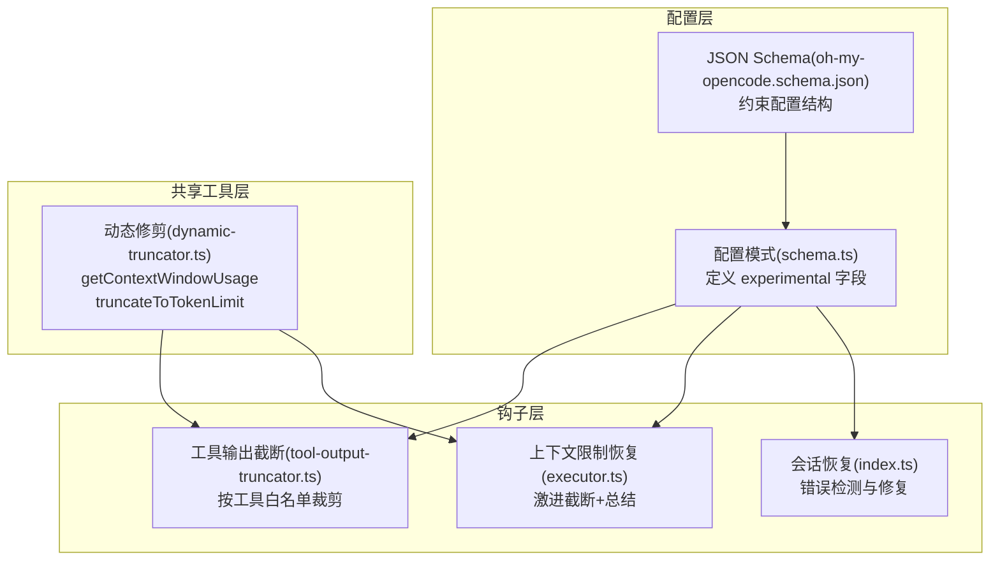
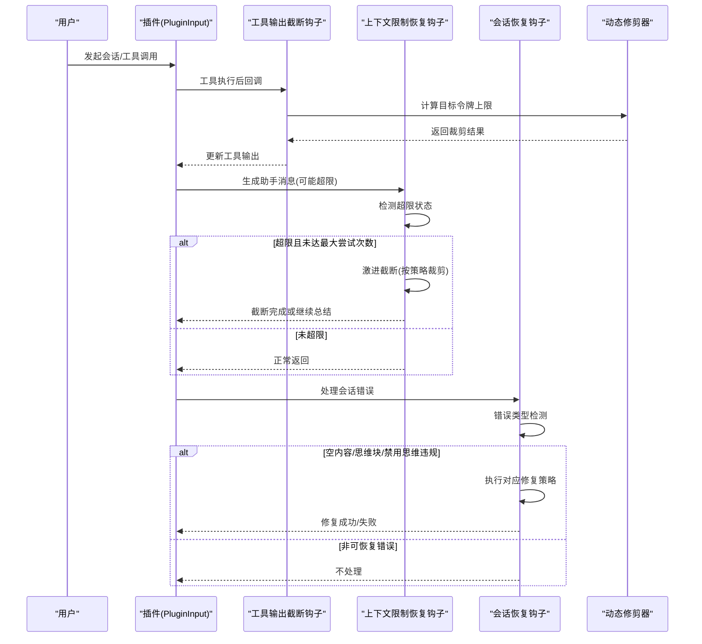
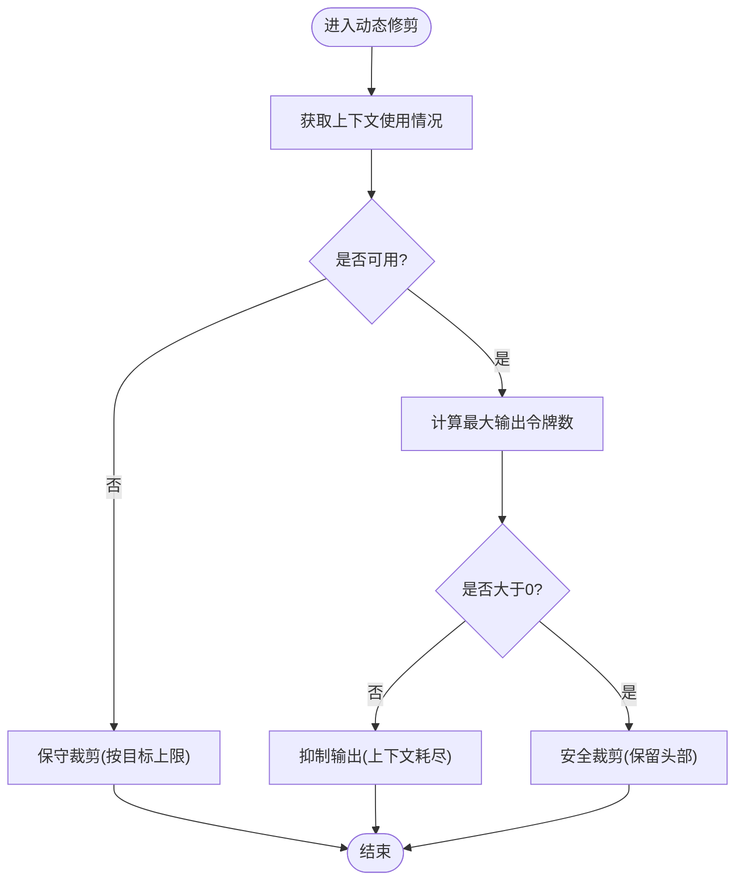
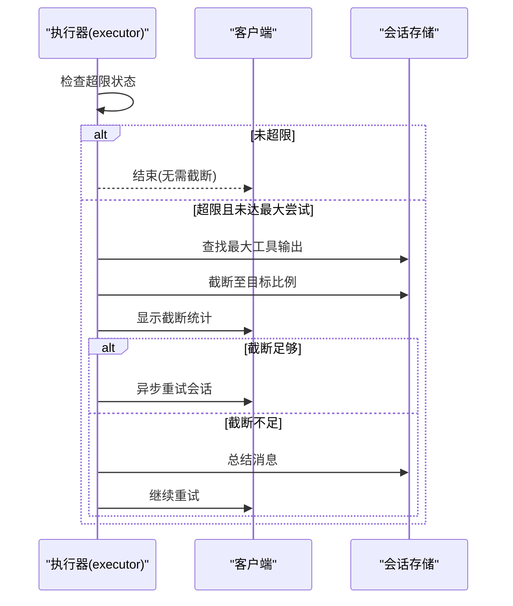
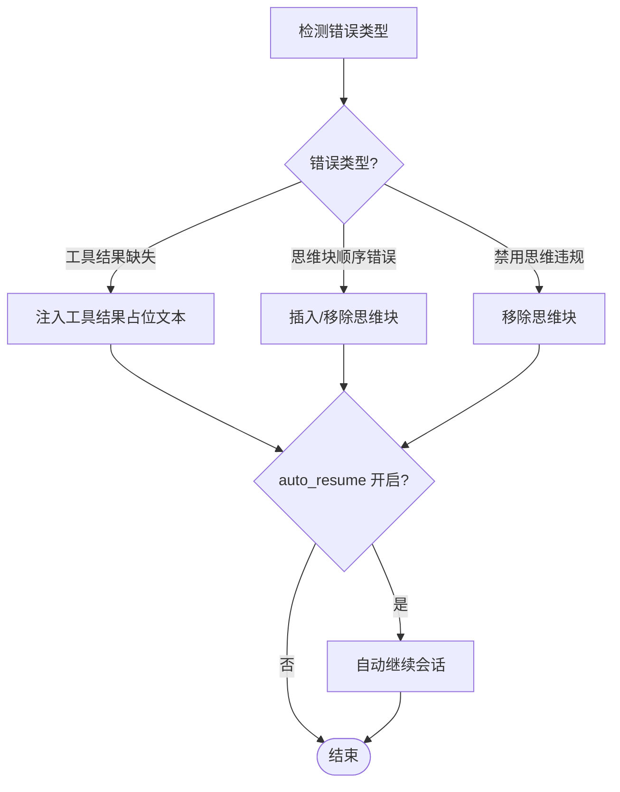
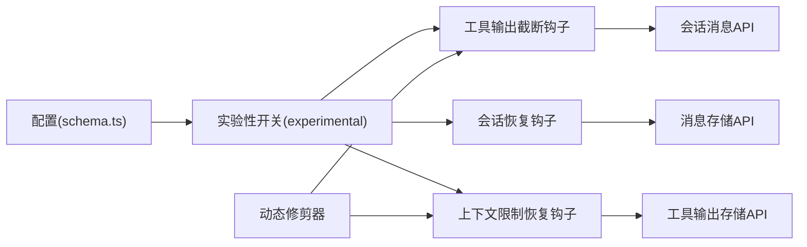

# 实验性功能配置

<cite>
**本文档引用的文件**
- [src/config/schema.ts](file://src/config/schema.ts)
- [src/shared/dynamic-truncator.ts](file://src/shared/dynamic-truncator.ts)
- [src/hooks/anthropic-context-window-limit-recovery/executor.ts](file://src/hooks/anthropic-context-window-limit-recovery/executor.ts)
- [src/hooks/anthropic-context-window-limit-recovery/types.ts](file://src/hooks/anthropic-context-window-limit-recovery/types.ts)
- [src/hooks/session-recovery/index.ts](file://src/hooks/session-recovery/index.ts)
- [src/hooks/tool-output-truncator.ts](file://src/hooks/tool-output-truncator.ts)
- [assets/oh-my-opencode.schema.json](file://assets/oh-my-opencode.schema.json)
- [CONFIGURATION-GUIDE.md](file://CONFIGURATION-GUIDE.md)
</cite>

## 目录
1. [简介](#简介)
2. [项目结构](#项目结构)
3. [核心组件](#核心组件)
4. [架构概览](#架构概览)
5. [详细组件分析](#详细组件分析)
6. [依赖关系分析](#依赖关系分析)
7. [性能考量](#性能考量)
8. [故障排除指南](#故障排除指南)
9. [结论](#结论)
10. [附录](#附录)

## 简介
本文件面向 Oh My OpenCode 的实验性功能配置，系统性阐述以下能力：
- 动态上下文修剪：基于会话上下文窗口使用情况，智能裁剪输出内容，避免超出模型上下文限制
- 激进截断：在超限情况下，按策略对工具输出进行强制裁剪，确保会话继续进行
- 自动恢复：针对会话错误（如空内容消息、思维块顺序错误、禁用思维违规等）进行自动化修复与恢复

文档将从配置入口、工作机制、参数说明、使用示例、风险评估、性能影响及反馈渠道等方面进行全面说明。

## 项目结构
实验性功能主要分布在配置模式、共享工具与多个钩子模块中：
- 配置模式层：定义实验性配置项及其校验规则
- 共享工具层：提供动态上下文修剪的核心算法
- 钩子层：实现自动恢复与激进截断的业务逻辑

**图表来源**
- [src/config/schema.ts](file://src/config/schema.ts#L241-L248)
- [src/shared/dynamic-truncator.ts](file://src/shared/dynamic-truncator.ts#L105-L175)
- [src/hooks/tool-output-truncator.ts](file://src/hooks/tool-output-truncator.ts#L33-L61)
- [src/hooks/anthropic-context-window-limit-recovery/executor.ts](file://src/hooks/anthropic-context-window-limit-recovery/executor.ts#L258-L358)
- [src/hooks/session-recovery/index.ts](file://src/hooks/session-recovery/index.ts#L321-L432)
- [assets/oh-my-opencode.schema.json](file://assets/oh-my-opencode.schema.json#L1-L200)

**章节来源**
- [src/config/schema.ts](file://src/config/schema.ts#L241-L248)
- [assets/oh-my-opencode.schema.json](file://assets/oh-my-opencode.schema.json#L1-L200)

## 核心组件
- 实验性配置模式：在主配置中新增 experimental 字段，支持以下子项：
  - aggressive_truncation：是否启用激进截断
  - auto_resume：是否在恢复后自动继续会话
  - truncate_all_tool_outputs：是否对所有工具输出进行裁剪（默认仅对白名单工具裁剪）
  - dynamic_context_pruning：动态上下文修剪的细粒度配置
- 动态上下文修剪：根据当前会话的上下文使用量，计算最大允许输出令牌数，并进行安全裁剪
- 工具输出截断钩子：在工具执行后阶段，对匹配的工具输出进行令牌限制裁剪
- 上下文限制恢复钩子：当出现上下文超限时，尝试激进截断；若仍超限则进行总结并重试
- 会话恢复钩子：检测并修复多种会话错误，包括空内容消息、思维块顺序错误、禁用思维违规等

**章节来源**
- [src/config/schema.ts](file://src/config/schema.ts#L241-L248)
- [src/shared/dynamic-truncator.ts](file://src/shared/dynamic-truncator.ts#L105-L175)
- [src/hooks/tool-output-truncator.ts](file://src/hooks/tool-output-truncator.ts#L33-L61)
- [src/hooks/anthropic-context-window-limit-recovery/executor.ts](file://src/hooks/anthropic-context-window-limit-recovery/executor.ts#L258-L358)
- [src/hooks/session-recovery/index.ts](file://src/hooks/session-recovery/index.ts#L321-L432)

## 架构概览
实验性功能的运行链路如下：

**图表来源**
- [src/hooks/tool-output-truncator.ts](file://src/hooks/tool-output-truncator.ts#L33-L61)
- [src/shared/dynamic-truncator.ts](file://src/shared/dynamic-truncator.ts#L144-L175)
- [src/hooks/anthropic-context-window-limit-recovery/executor.ts](file://src/hooks/anthropic-context-window-limit-recovery/executor.ts#L258-L358)
- [src/hooks/session-recovery/index.ts](file://src/hooks/session-recovery/index.ts#L321-L432)

## 详细组件分析

### 动态上下文修剪
- 作用机制
  - 通过查询会话消息统计，获取已用令牌与剩余令牌
  - 基于剩余令牌与目标上限，计算最大允许输出令牌数
  - 对输出文本进行行级保留与令牌估算，确保头部信息不被裁剪
- 关键接口
  - getContextWindowUsage：获取会话上下文使用情况
  - truncateToTokenLimit：按令牌上限进行安全裁剪
  - dynamicTruncate：结合上下文使用情况的动态裁剪
- 配置参数
  - targetMaxTokens：目标最大令牌数（默认值见实现）
  - preserveHeaderLines：保留的头部行数（默认值见实现）
  - contextWindowLimit：上下文窗口上限（环境变量控制）

**图表来源**
- [src/shared/dynamic-truncator.ts](file://src/shared/dynamic-truncator.ts#L105-L175)

**章节来源**
- [src/shared/dynamic-truncator.ts](file://src/shared/dynamic-truncator.ts#L105-L175)

### 激进截断
- 作用机制
  - 在检测到上下文超限时，按预设目标比例持续裁剪工具输出
  - 统计裁剪数量与字节数，提供可视化反馈
  - 若裁剪后仍超限，则进行总结并重试
- 关键配置
  - TRUNCATE_CONFIG：最大尝试次数、最小输出大小、目标令牌比例、字符/令牌估算
  - aggressive_truncation：开关（通过 experimental.aggressive_truncation 控制）
- 运行流程
  - 检测超限状态
  - 尝试激进截断
  - 若足够则重试会话；否则进入总结阶段

**图表来源**
- [src/hooks/anthropic-context-window-limit-recovery/executor.ts](file://src/hooks/anthropic-context-window-limit-recovery/executor.ts#L258-L358)
- [src/hooks/anthropic-context-window-limit-recovery/types.ts](file://src/hooks/anthropic-context-window-limit-recovery/types.ts#L30-L42)

**章节来源**
- [src/hooks/anthropic-context-window-limit-recovery/executor.ts](file://src/hooks/anthropic-context-window-limit-recovery/executor.ts#L258-L358)
- [src/hooks/anthropic-context-window-limit-recovery/types.ts](file://src/hooks/anthropic-context-window-limit-recovery/types.ts#L30-L42)

### 自动恢复
- 作用机制
  - 检测并分类会话错误类型（工具结果缺失、思维块顺序错误、禁用思维违规）
  - 针对不同错误执行修复策略（注入占位文本、移除思维块、补充思维块等）
  - 支持在修复成功后自动继续会话（auto_resume）
- 关键配置
  - auto_resume：修复后自动继续会话
  - experimental 字段：统一承载实验性开关
- 错误类型与修复策略
  - 工具结果缺失：注入“用户取消”类的工具结果
  - 思维块顺序错误：在目标消息前插入思维块或移除孤立思维
  - 禁用思维违规：移除包含思维内容的消息部分

**图表来源**
- [src/hooks/session-recovery/index.ts](file://src/hooks/session-recovery/index.ts#L321-L432)

**章节来源**
- [src/hooks/session-recovery/index.ts](file://src/hooks/session-recovery/index.ts#L321-L432)

### 工具输出截断钩子
- 作用机制
  - 在工具执行后阶段，对匹配的工具输出进行令牌限制裁剪
  - 支持按工具白名单裁剪，默认仅对特定工具裁剪
  - 可通过 experimental.truncate_all_tool_outputs 开启全量裁剪
- 工具白名单
  - grep、Grep、safe_grep、glob、Glob、safe_glob、lsp_diagnostics、ast_grep_search、interactive_bash、Interactive_bash、skill_mcp、webfetch、WebFetch
- 默认令牌上限
  - 一般工具：50,000 令牌（约 200k 字符）
  - webfetch：10,000 令牌（约 40k 字符）

**章节来源**
- [src/hooks/tool-output-truncator.ts](file://src/hooks/tool-output-truncator.ts#L33-L61)

## 依赖关系分析
- 配置依赖
  - experimental 字段由配置模式定义，JSON Schema 提供结构约束
  - 钩子模块通过 experimental 参数读取配置
- 工具依赖
  - 动态修剪器依赖会话消息 API 获取上下文使用情况
  - 激进截断依赖工具输出存储与会话管理 API
  - 会话恢复依赖消息存储与部分修复 API
- 耦合与内聚
  - 钩子模块与配置解耦，通过参数传递实验性开关
  - 动态修剪器作为纯函数工具，便于复用与测试

**图表来源**
- [src/config/schema.ts](file://src/config/schema.ts#L241-L248)
- [src/shared/dynamic-truncator.ts](file://src/shared/dynamic-truncator.ts#L105-L175)
- [src/hooks/tool-output-truncator.ts](file://src/hooks/tool-output-truncator.ts#L33-L61)
- [src/hooks/anthropic-context-window-limit-recovery/executor.ts](file://src/hooks/anthropic-context-window-limit-recovery/executor.ts#L258-L358)
- [src/hooks/session-recovery/index.ts](file://src/hooks/session-recovery/index.ts#L321-L432)

**章节来源**
- [src/config/schema.ts](file://src/config/schema.ts#L241-L248)
- [src/shared/dynamic-truncator.ts](file://src/shared/dynamic-truncator.ts#L105-L175)

## 性能考量
- 动态上下文修剪
  - 优点：按实际使用情况裁剪，避免固定阈值导致的过度或不足
  - 成本：每次裁剪需进行行级遍历与令牌估算，复杂度与输出长度线性相关
  - 建议：对长输出场景谨慎使用，必要时设置合理的头部保留行数
- 激进截断
  - 优点：在超限时快速降低上下文压力，提高会话成功率
  - 成本：多次尝试与总结可能增加延迟；对工具输出的破坏性裁剪可能丢失信息
  - 建议：配合工具白名单使用，避免对关键输出进行激进裁剪
- 自动恢复
  - 优点：减少人工干预，提升会话鲁棒性
  - 成本：错误检测与修复需要额外的存储访问与 API 调用
  - 建议：开启 auto_resume 时注意会话状态一致性，避免重复操作
- 工具输出截断钩子
  - 优点：在工具层面控制输出规模，防止大输出拖垮上下文
  - 成本：对每个匹配工具执行一次裁剪逻辑
  - 建议：默认仅对白名单工具裁剪，避免对所有工具造成性能负担

[本节为通用性能讨论，无需具体文件分析]

## 故障排除指南
- 动态上下文修剪无效
  - 检查会话消息 API 是否可用（getContextWindowUsage 返回 null 时采用保守裁剪）
  - 确认环境变量 ANTHROPIC_1M_CONTEXT 或 VERTEX_ANTHROPIC_1M_CONTEXT 设置
- 激进截断未生效
  - 确认 experimental.aggressive_truncation 已启用
  - 检查 TRUNCATE_CONFIG 的最大尝试次数与目标比例是否合理
  - 观察截断日志与 TUI 提示，确认是否达到最大尝试次数
- 自动恢复失败
  - 检查错误类型检测逻辑，确认是否属于可恢复范围
  - 对于空内容错误，确认存储中是否存在空文本部分
  - 若达到最大恢复尝试次数，系统会提示启动新会话
- 工具输出截断未触发
  - 确认工具名称是否在白名单中
  - 检查 experimental.truncate_all_tool_outputs 是否开启以覆盖白名单

**章节来源**
- [src/shared/dynamic-truncator.ts](file://src/shared/dynamic-truncator.ts#L105-L175)
- [src/hooks/anthropic-context-window-limit-recovery/executor.ts](file://src/hooks/anthropic-context-window-limit-recovery/executor.ts#L258-L358)
- [src/hooks/session-recovery/index.ts](file://src/hooks/session-recovery/index.ts#L321-L432)
- [src/hooks/tool-output-truncator.ts](file://src/hooks/tool-output-truncator.ts#L33-L61)

## 结论
实验性功能通过“动态上下文修剪 + 激进截断 + 自动恢复”的组合，显著提升了会话在高负载与异常情况下的稳定性与可用性。建议在生产环境中谨慎启用，并结合监控与日志进行持续评估。对于关键工作流，优先使用工具白名单裁剪与可控的激进截断策略，避免对核心输出造成不可逆影响。

[本节为总结性内容，无需具体文件分析]

## 附录

### 配置示例与参数说明
- 配置入口
  - 在主配置中添加 experimental 字段，包含以下子项：
    - aggressive_truncation：是否启用激进截断
    - auto_resume：是否在恢复后自动继续会话
    - truncate_all_tool_outputs：是否对所有工具输出进行裁剪
    - dynamic_context_pruning：动态上下文修剪的细粒度配置
- JSON Schema 约束
  - experimental 字段由配置模式定义，JSON Schema 提供结构约束
- 使用建议
  - 初次启用建议关闭 auto_resume，观察修复效果后再开启
  - 对 webfetch 等易产生大输出的工具，优先使用默认的更严格令牌限制
  - 结合日志与 TUI 提示，逐步调整激进截断的目标比例与尝试次数

**章节来源**
- [src/config/schema.ts](file://src/config/schema.ts#L241-L248)
- [assets/oh-my-opencode.schema.json](file://assets/oh-my-opencode.schema.json#L1-L200)

### 实验性功能使用示例
- 启用动态上下文修剪
  - 在配置中设置 experimental.dynamic_context_pruning.enabled=true
  - 可选：调整 notification、turn_protection、protected_tools、strategies 等子配置
- 启用激进截断
  - 在配置中设置 experimental.aggressive_truncation=true
  - 观察 TUI 提示与日志，确认截断策略生效
- 启用自动恢复
  - 在配置中设置 experimental.auto_resume=true
  - 当发生可恢复错误时，系统将自动修复并继续会话
- 工具输出截断
  - 默认仅对白名单工具裁剪；如需全量裁剪，设置 experimental.truncate_all_tool_outputs=true

**章节来源**
- [src/config/schema.ts](file://src/config/schema.ts#L241-L248)
- [src/hooks/tool-output-truncator.ts](file://src/hooks/tool-output-truncator.ts#L33-L61)
- [src/hooks/session-recovery/index.ts](file://src/hooks/session-recovery/index.ts#L321-L432)

### 风险评估与稳定性考虑
- 风险点
  - 激进截断可能导致工具输出信息丢失，影响后续推理质量
  - 自动恢复可能掩盖底层问题，掩盖配置或数据异常
  - 动态修剪可能对长输出的头部内容进行保护，但对中间内容的完整性无保障
- 稳定性建议
  - 在非关键任务中先启用实验性功能，积累数据后再推广
  - 结合日志与告警，监控截断频率与恢复成功率
  - 对关键工具输出保留备份或采用增量更新策略

[本节为通用指导，无需具体文件分析]

### 反馈收集与问题报告
- 日志与提示
  - 动态修剪与激进截断均会在控制台输出日志与 TUI 提示
  - 会话恢复钩子会在修复前后显示 Toast 提示
- 问题报告
  - 请附带：
    - 配置片段（含 experimental 相关字段）
    - 会话 ID 与时间戳
    - 错误类型与日志片段
    - 复现步骤与期望行为
- 反馈渠道
  - 通过项目文档中提供的问题报告模板提交

**章节来源**
- [src/hooks/anthropic-context-window-limit-recovery/executor.ts](file://src/hooks/anthropic-context-window-limit-recovery/executor.ts#L258-L358)
- [src/hooks/session-recovery/index.ts](file://src/hooks/session-recovery/index.ts#L321-L432)