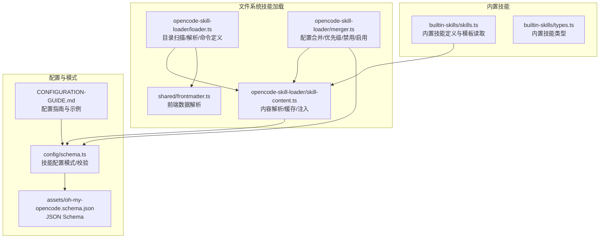
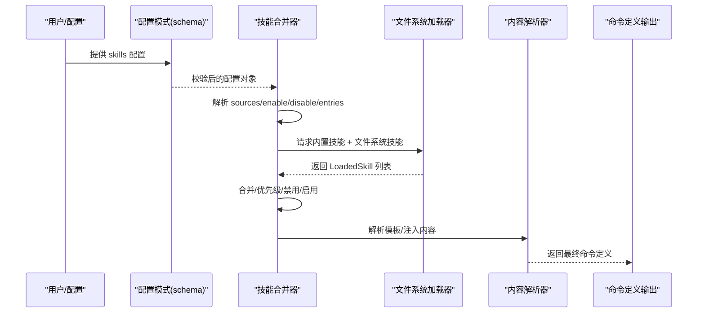
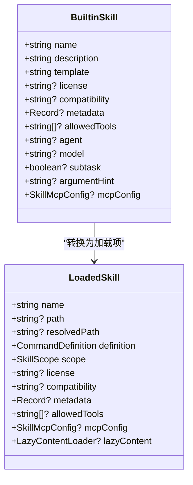
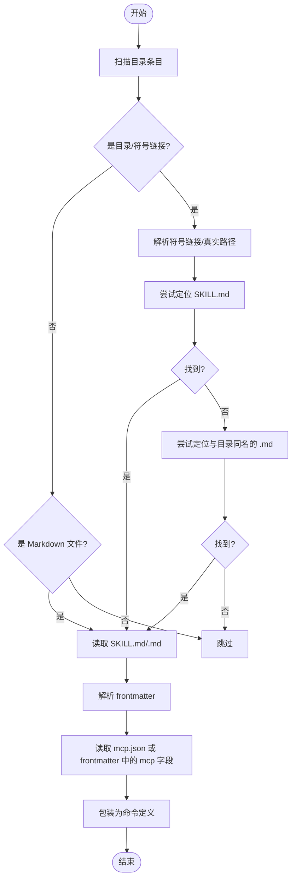
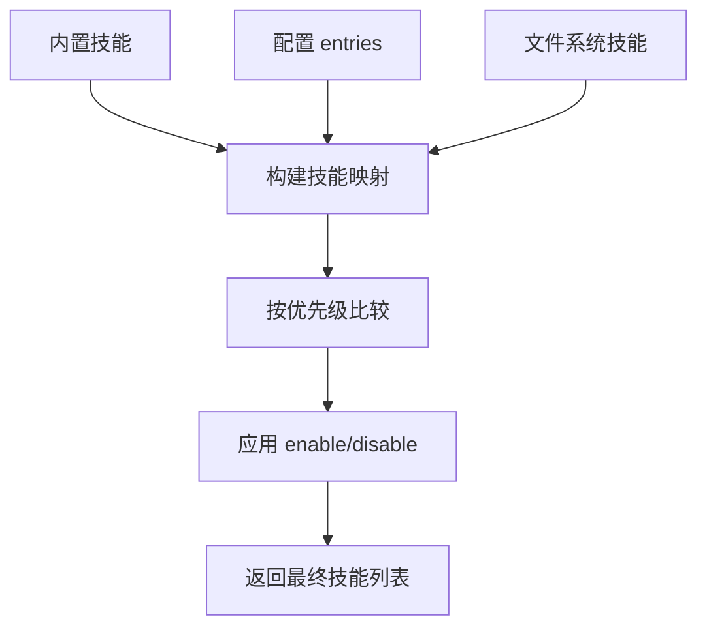
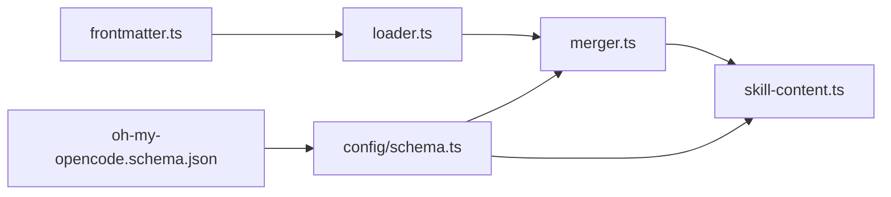

# 技能配置

<cite>
**本文引用的文件**
- [src/features/builtin-skills/skills.ts](file://src/features/builtin-skills/skills.ts)
- [src/features/builtin-skills/index.ts](file://src/features/builtin-skills/index.ts)
- [src/features/builtin-skills/types.ts](file://src/features/builtin-skills/types.ts)
- [src/features/builtin-skills/writing-skills/SKILL.md](file://src/features/builtin-skills/writing-skills/SKILL.md)
- [src/features/builtin-skills/git-master/SKILL.md](file://src/features/builtin-skills/git-master/SKILL.md)
- [src/features/builtin-skills/frontend-ui-ux/SKILL.md](file://src/features/builtin-skills/frontend-ui-ux/SKILL.md)
- [src/features/opencode-skill-loader/loader.ts](file://src/features/opencode-skill-loader/loader.ts)
- [src/features/opencode-skill-loader/types.ts](file://src/features/opencode-skill-loader/types.ts)
- [src/features/opencode-skill-loader/merger.ts](file://src/features/opencode-skill-loader/merger.ts)
- [src/features/opencode-skill-loader/skill-content.ts](file://src/features/opencode-skill-loader/skill-content.ts)
- [src/shared/frontmatter.ts](file://src/shared/frontmatter.ts)
- [src/config/schema.ts](file://src/config/schema.ts)
- [assets/oh-my-opencode.schema.json](file://assets/oh-my-opencode.schema.json)
- [CONFIGURATION-GUIDE.md](file://CONFIGURATION-GUIDE.md)
</cite>

## 目录
1. [简介](#简介)
2. [项目结构](#项目结构)
3. [核心组件](#核心组件)
4. [架构总览](#架构总览)
5. [详细组件分析](#详细组件分析)
6. [依赖关系分析](#依赖关系分析)
7. [性能考量](#性能考量)
8. [故障排查指南](#故障排查指南)
9. [结论](#结论)
10. [附录](#附录)

## 简介
本文件面向 Oh My OpenCode 的“技能配置”主题，系统性阐述技能的定义、来源与加载机制，涵盖内置技能与自定义技能的配置选项、模板系统与参数传递、技能来源的文件路径与递归/全局匹配策略、验证规则与错误处理，以及最佳实践与性能优化建议。读者无需深入技术背景即可理解如何启用、禁用与自定义技能，同时为高级用户提供扩展与调试参考。

## 项目结构
技能系统由“内置技能定义”“文件系统技能发现与合并”“配置驱动的技能注入”三部分组成，并通过统一的命令定义接口对外暴露。

**图表来源**
- [src/features/builtin-skills/skills.ts](file://src/features/builtin-skills/skills.ts#L1-L120)
- [src/features/opencode-skill-loader/loader.ts](file://src/features/opencode-skill-loader/loader.ts#L1-L120)
- [src/features/opencode-skill-loader/merger.ts](file://src/features/opencode-skill-loader/merger.ts#L1-L120)
- [src/features/opencode-skill-loader/skill-content.ts](file://src/features/opencode-skill-loader/skill-content.ts#L1-L120)
- [src/shared/frontmatter.ts](file://src/shared/frontmatter.ts#L1-L32)
- [src/config/schema.ts](file://src/config/schema.ts#L250-L287)
- [assets/oh-my-opencode.schema.json](file://assets/oh-my-opencode.schema.json#L1-L200)
- [CONFIGURATION-GUIDE.md](file://CONFIGURATION-GUIDE.md#L160-L289)

**章节来源**
- [src/features/builtin-skills/skills.ts](file://src/features/builtin-skills/skills.ts#L1-L120)
- [src/features/opencode-skill-loader/loader.ts](file://src/features/opencode-skill-loader/loader.ts#L1-L120)
- [src/features/opencode-skill-loader/merger.ts](file://src/features/opencode-skill-loader/merger.ts#L1-L120)
- [src/features/opencode-skill-loader/skill-content.ts](file://src/features/opencode-skill-loader/skill-content.ts#L1-L120)
- [src/shared/frontmatter.ts](file://src/shared/frontmatter.ts#L1-L32)
- [src/config/schema.ts](file://src/config/schema.ts#L250-L287)
- [assets/oh-my-opencode.schema.json](file://assets/oh-my-opencode.schema.json#L1-L200)
- [CONFIGURATION-GUIDE.md](file://CONFIGURATION-GUIDE.md#L160-L289)

## 核心组件
- 内置技能定义与模板读取：集中于内置技能模块，支持从打包资源或源码目录读取 SKILL.md 并解析模板。
- 文件系统技能加载器：负责扫描用户/项目/全局技能目录，解析 frontmatter 与 mcp.json，生成命令定义。
- 技能合并器：根据配置对内置与文件系统技能进行合并、优先级判定、启用/禁用过滤。
- 技能内容解析器：提供缓存、模板注入（如 Git Master 提示）、异步解析等能力。
- 配置模式与校验：通过 Zod 模式与 JSON Schema 对技能配置进行强类型约束与校验。

**章节来源**
- [src/features/builtin-skills/skills.ts](file://src/features/builtin-skills/skills.ts#L1-L120)
- [src/features/opencode-skill-loader/loader.ts](file://src/features/opencode-skill-loader/loader.ts#L1-L120)
- [src/features/opencode-skill-loader/merger.ts](file://src/features/opencode-skill-loader/merger.ts#L1-L120)
- [src/features/opencode-skill-loader/skill-content.ts](file://src/features/opencode-skill-loader/skill-content.ts#L1-L120)
- [src/config/schema.ts](file://src/config/schema.ts#L250-L287)

## 架构总览
技能配置的运行时流程如下：

**图表来源**
- [src/config/schema.ts](file://src/config/schema.ts#L250-L287)
- [src/features/opencode-skill-loader/merger.ts](file://src/features/opencode-skill-loader/merger.ts#L187-L267)
- [src/features/opencode-skill-loader/loader.ts](file://src/features/opencode-skill-loader/loader.ts#L205-L234)
- [src/features/opencode-skill-loader/skill-content.ts](file://src/features/opencode-skill-loader/skill-content.ts#L120-L173)

## 详细组件分析

### 内置技能与模板系统
- 内置技能通过集中定义文件导出，每个内置技能包含名称、描述、模板、可选的 MCP 配置与元数据。
- 模板读取支持从打包资源或源码目录读取 SKILL.md，并解析 frontmatter 作为元数据，正文作为模板体。
- 模板包裹了“技能指令”与“用户请求”的占位，便于在运行时注入参数。

**图表来源**
- [src/features/builtin-skills/types.ts](file://src/features/builtin-skills/types.ts#L3-L16)
- [src/features/opencode-skill-loader/types.ts](file://src/features/opencode-skill-loader/types.ts#L26-L38)

**章节来源**
- [src/features/builtin-skills/skills.ts](file://src/features/builtin-skills/skills.ts#L1-L120)
- [src/features/builtin-skills/types.ts](file://src/features/builtin-skills/types.ts#L1-L17)

### 文件系统技能加载与来源
- 支持多来源目录：
  - 用户级：Claude Code 配置目录下的 skills
  - 项目级：当前工作目录下 .claude/skills
  - 全局级：用户主目录 ~/.config/opencode/skill
  - 项目级（OpenCode）：项目根目录 .opencode/skill
- 加载逻辑：
  - 扫描目录条目，识别目录或符号链接，尝试定位 SKILL.md 或与目录同名的 .md 文件。
  - 解析 frontmatter 获取元数据，支持从 mcp.json 读取 MCP 配置。
  - 将内容包装为命令定义，包含模板、模型、代理、子任务标记、参数提示等。

**图表来源**
- [src/features/opencode-skill-loader/loader.ts](file://src/features/opencode-skill-loader/loader.ts#L124-L166)
- [src/features/opencode-skill-loader/loader.ts](file://src/features/opencode-skill-loader/loader.ts#L58-L122)

**章节来源**
- [src/features/opencode-skill-loader/loader.ts](file://src/features/opencode-skill-loader/loader.ts#L124-L166)
- [src/features/opencode-skill-loader/loader.ts](file://src/features/opencode-skill-loader/loader.ts#L58-L122)

### 技能来源配置：路径、递归与全局匹配
- 配置模式支持两种形式：
  - 数组：仅列出要启用的技能名称
  - 对象：包含 sources、enable、disable 与具体技能条目
- 条目支持：
  - disable：禁用该技能
  - from：从文件路径加载模板（支持 ~、绝对路径）
  - template：内联模板
  - 其他字段：描述、模型、代理、子任务、参数提示、许可证、兼容性、元数据、允许工具等
- 递归与全局匹配：
  - 在配置中可通过 sources 数组中的对象形式提供 path、recursive、glob 字段，实现递归搜索与通配匹配（由上层加载器按需实现）。

**章节来源**
- [src/config/schema.ts](file://src/config/schema.ts#L250-L287)
- [src/features/opencode-skill-loader/merger.ts](file://src/features/opencode-skill-loader/merger.ts#L137-L153)
- [src/features/opencode-skill-loader/merger.ts](file://src/features/opencode-skill-loader/merger.ts#L74-L135)

### 技能模板系统与参数传递
- 模板包装：
  - 所有技能模板会被包装为“技能指令”与“用户请求”两段，便于注入上下文与参数。
  - 包装中会声明“基础目录”，使技能内的文件引用（@path）相对该目录解析。
- 参数注入：
  - 用户请求段包含 $ARGUMENTS 占位，用于在运行时注入实际参数。
- 特定技能注入：
  - Git Master 技能支持注入提交尾注与 co-authored-by 提示，依据配置开关动态插入。

**章节来源**
- [src/features/opencode-skill-loader/loader.ts](file://src/features/opencode-skill-loader/loader.ts#L76-L104)
- [src/features/opencode-skill-loader/skill-content.ts](file://src/features/opencode-skill-loader/skill-content.ts#L62-L118)

### 技能合并与优先级
- 优先级顺序（从高到低）：builtin < config < user < opencode < project < opencode-project
- 合并策略：
  - 若配置条目为布尔值 true/false 或显式 disable，则按禁用/保留处理
  - 若条目未提供 template/from，则与现有定义进行元数据与 allowed-tools 合并
  - 文件系统技能若优先级更高则覆盖内置定义
  - enable 列表仅保留指定技能；disable 列表移除指定技能

**图表来源**
- [src/features/opencode-skill-loader/merger.ts](file://src/features/opencode-skill-loader/merger.ts#L196-L267)

**章节来源**
- [src/features/opencode-skill-loader/merger.ts](file://src/features/opencode-skill-loader/merger.ts#L12-L19)
- [src/features/opencode-skill-loader/merger.ts](file://src/features/opencode-skill-loader/merger.ts#L196-L267)

### 技能配置验证与错误处理
- 类型验证：
  - 使用 Zod 模式定义技能配置结构，确保字段类型与取值范围正确
  - JSON Schema 提供编辑器与 IDE 的智能提示与校验
- 错误处理：
  - frontmatter 解析失败时返回空数据并标记解析错误
  - 文件不存在或读取异常时返回空结果，避免中断整体流程
  - 合并阶段忽略无效条目，保证健壮性

**章节来源**
- [src/config/schema.ts](file://src/config/schema.ts#L250-L287)
- [assets/oh-my-opencode.schema.json](file://assets/oh-my-opencode.schema.json#L1-L200)
- [src/shared/frontmatter.ts](file://src/shared/frontmatter.ts#L23-L31)
- [src/features/opencode-skill-loader/loader.ts](file://src/features/opencode-skill-loader/loader.ts#L119-L122)

### 完整示例与最佳实践
- 示例参考：
  - 配置指南中提供了混合配置示例，包含 agents、categories、disabled_mcps、disabled_skills 等字段
- 最佳实践：
  - 使用 frontmatter 统一管理技能元数据（名称、描述、模型、代理、子任务、参数提示等）
  - 将复杂技能拆分为多个小技能，便于复用与测试
  - 通过 categories.defaultSkills 为不同类别注入默认技能
  - 使用 allowed-tools 控制工具访问权限，提升安全性
  - 对于需要外部 MCP 的技能，优先在 SKILL.md frontmatter 或 mcp.json 中声明配置

**章节来源**
- [CONFIGURATION-GUIDE.md](file://CONFIGURATION-GUIDE.md#L160-L289)

## 依赖关系分析
- 内置技能依赖 frontmatter 解析与模板缓存
- 文件系统加载器依赖 frontmatter 解析、文件工具与 MCP 配置解析
- 合并器依赖深度合并与优先级映射
- 配置模式与 JSON Schema 提供强类型约束与校验

**图表来源**
- [src/shared/frontmatter.ts](file://src/shared/frontmatter.ts#L1-L32)
- [src/features/opencode-skill-loader/loader.ts](file://src/features/opencode-skill-loader/loader.ts#L1-L26)
- [src/features/opencode-skill-loader/merger.ts](file://src/features/opencode-skill-loader/merger.ts#L1-L11)
- [src/features/opencode-skill-loader/skill-content.ts](file://src/features/opencode-skill-loader/skill-content.ts#L1-L6)
- [src/config/schema.ts](file://src/config/schema.ts#L250-L287)
- [assets/oh-my-opencode.schema.json](file://assets/oh-my-opencode.schema.json#L1-L200)

**章节来源**
- [src/shared/frontmatter.ts](file://src/shared/frontmatter.ts#L1-L32)
- [src/features/opencode-skill-loader/loader.ts](file://src/features/opencode-skill-loader/loader.ts#L1-L26)
- [src/features/opencode-skill-loader/merger.ts](file://src/features/opencode-skill-loader/merger.ts#L1-L11)
- [src/features/opencode-skill-loader/skill-content.ts](file://src/features/opencode-skill-loader/skill-content.ts#L1-L6)
- [src/config/schema.ts](file://src/config/schema.ts#L250-L287)
- [assets/oh-my-opencode.schema.json](file://assets/oh-my-opencode.schema.json#L1-L200)

## 性能考量
- 缓存策略：内置技能模板采用 Map 缓存，减少重复读取
- 异步加载：文件系统扫描与内容读取采用 Promise 并行，缩短启动时间
- 模板延迟加载：保持 LazyContentLoader 接口以兼容未来惰性加载
- 合并去重：允许工具列表使用集合去重，避免重复开销

**章节来源**
- [src/features/builtin-skills/skills.ts](file://src/features/builtin-skills/skills.ts#L9-L30)
- [src/features/opencode-skill-loader/loader.ts](file://src/features/opencode-skill-loader/loader.ts#L205-L234)
- [src/features/opencode-skill-loader/merger.ts](file://src/features/opencode-skill-loader/merger.ts#L160-L162)

## 故障排查指南
- frontmatter 解析失败：检查 YAML 语法与 JSON_SCHEMA 限制，避免使用不安全标签
- 文件不存在或不可读：确认路径是否正确（支持 ~、绝对路径），检查权限
- MCP 配置缺失：在 SKILL.md frontmatter 或 mcp.json 中补充 mcpServers 或 mcp 字段
- 技能未生效：检查 enable/disable 列表、优先级覆盖与 scope 冲突
- 参数注入无效：确认模板是否被正确包装，$ARGUMENTS 是否存在于用户请求段

**章节来源**
- [src/shared/frontmatter.ts](file://src/shared/frontmatter.ts#L23-L31)
- [src/features/opencode-skill-loader/loader.ts](file://src/features/opencode-skill-loader/loader.ts#L13-L26)
- [src/features/opencode-skill-loader/loader.ts](file://src/features/opencode-skill-loader/loader.ts#L28-L51)
- [src/features/opencode-skill-loader/merger.ts](file://src/features/opencode-skill-loader/merger.ts#L253-L255)

## 结论
Oh My OpenCode 的技能配置体系通过“内置技能 + 文件系统技能 + 配置合并”的组合，实现了灵活、可扩展且强类型的技能管理。借助统一的命令定义接口与严格的配置模式，用户可以轻松启用、禁用与自定义技能，同时通过模板系统与参数注入机制实现强大的上下文适配。遵循本文提供的最佳实践与排错建议，可在保证稳定性的同时最大化发挥技能系统的价值。

## 附录
- 内置技能示例文件：
  - [writing-skills/SKILL.md](file://src/features/builtin-skills/writing-skills/SKILL.md#L1-L109)
  - [git-master/SKILL.md](file://src/features/builtin-skills/git-master/SKILL.md#L1-L120)
  - [frontend-ui-ux/SKILL.md](file://src/features/builtin-skills/frontend-ui-ux/SKILL.md#L1-L79)
- 配置参考：
  - [CONFIGURATION-GUIDE.md](file://CONFIGURATION-GUIDE.md#L160-L289)
  - [oh-my-opencode.schema.json](file://assets/oh-my-opencode.schema.json#L1-L200)