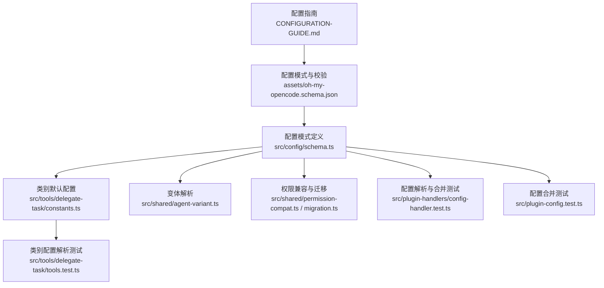
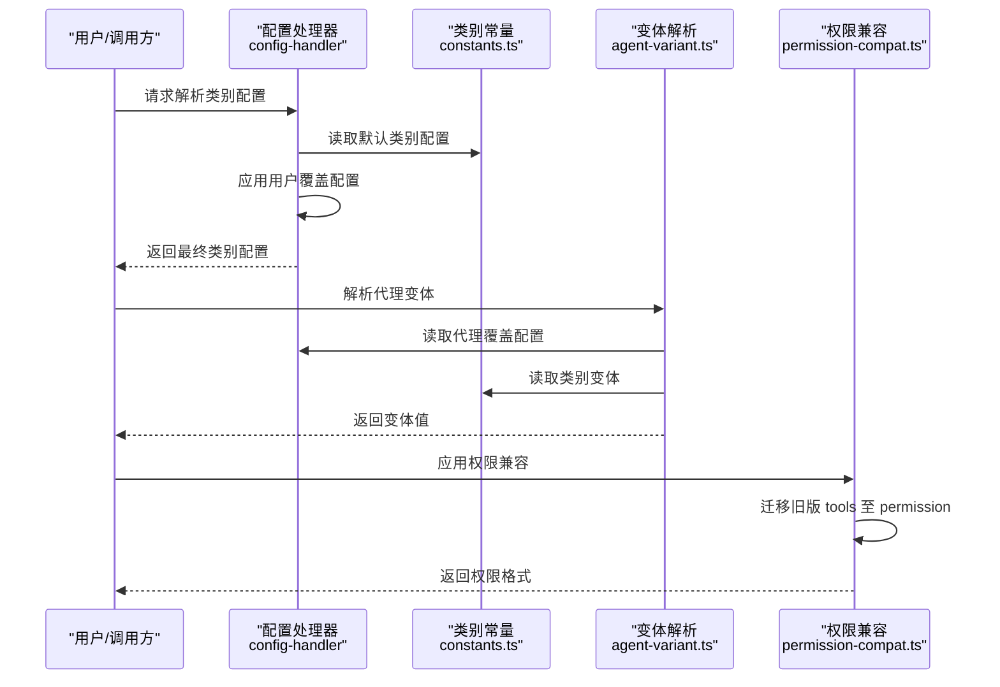
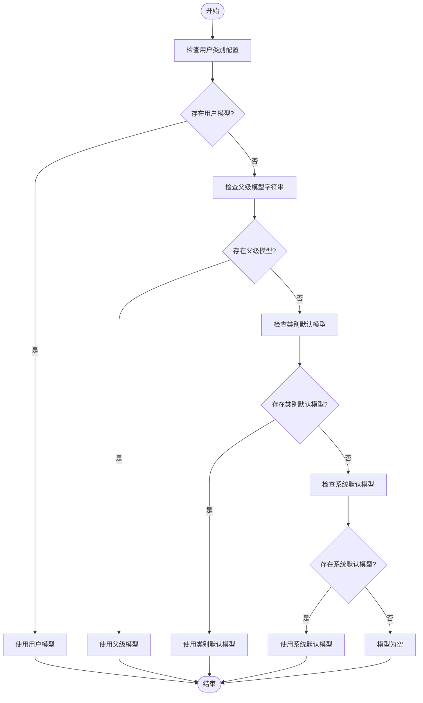
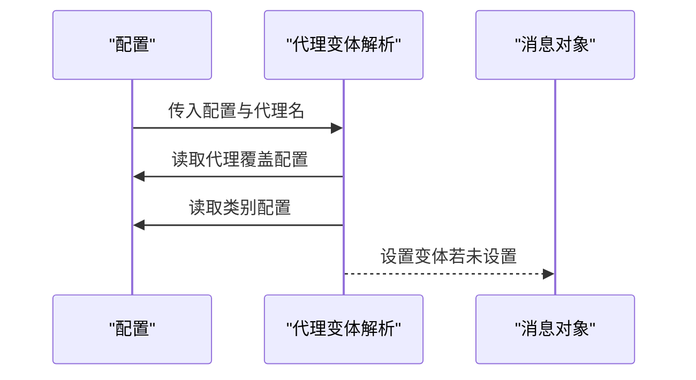
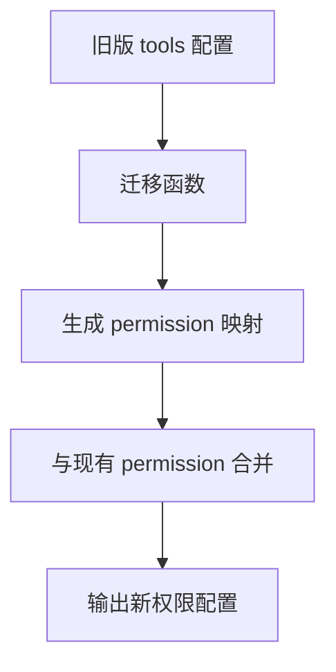
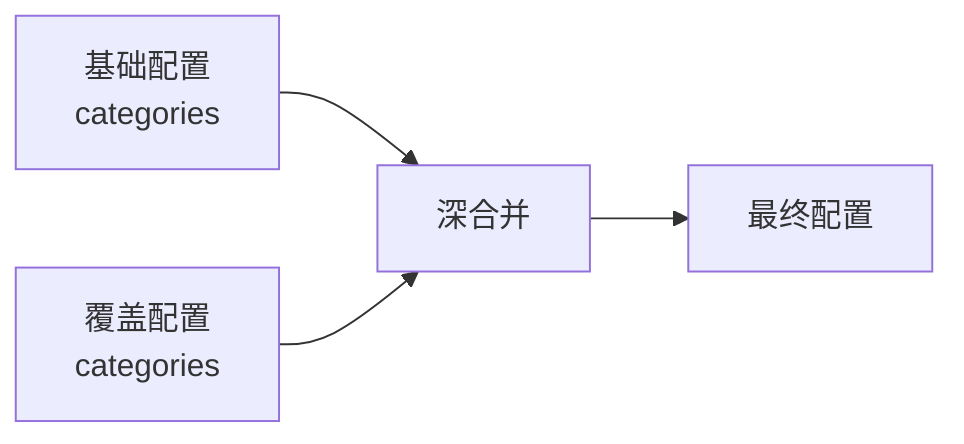
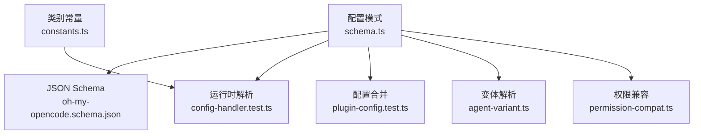

# 模型配置

<cite>
**本文引用的文件**
- [CONFIGURATION-GUIDE.md](file://CONFIGURATION-GUIDE.md)
- [oh-my-opencode.schema.json](file://assets/oh-my-opencode.schema.json)
- [schema.ts](file://src/config/schema.ts)
- [constants.ts](file://src/tools/delegate-task/constants.ts)
- [agent-variant.ts](file://src/shared/agent-variant.ts)
- [permission-compat.ts](file://src/shared/permission-compat.ts)
- [migration.ts](file://src/shared/migration.ts)
- [config-handler.test.ts](file://src/plugin-handlers/config-handler.test.ts)
- [tools.test.ts](file://src/tools/delegate-task/tools.test.ts)
- [plugin-config.test.ts](file://src/plugin-config.test.ts)
</cite>

## 目录
1. [简介](#简介)
2. [项目结构](#项目结构)
3. [核心组件](#核心组件)
4. [架构总览](#架构总览)
5. [详细组件分析](#详细组件分析)
6. [依赖关系分析](#依赖关系分析)
7. [性能考量](#性能考量)
8. [故障排查指南](#故障排查指南)
9. [结论](#结论)
10. [附录](#附录)

## 简介
本章节面向 Oh My OpenCode 的模型配置体系，系统性说明支持的 AI 模型类型与配置项（模型名称、变体、温度、top_p 等），模型配置的继承机制（从类别配置继承模型设置），不同模型的配置示例与性能对比，以及模型权限控制机制（访问权限、工具限制与安全考虑）。同时提供模型切换的最佳实践与性能优化建议。

## 项目结构
围绕模型配置的关键文件分布如下：
- 配置指南与示例：CONFIGURATION-GUIDE.md
- 配置模式与校验：assets/oh-my-opencode.schema.json、src/config/schema.ts
- 类别默认配置与提示词：src/tools/delegate-task/constants.ts
- 变体解析与应用：src/shared/agent-variant.ts
- 权限兼容与迁移：src/shared/permission-compat.ts、src/shared/migration.ts
- 配置解析与合并测试：src/plugin-handlers/config-handler.test.ts、src/tools/delegate-task/tools.test.ts、src/plugin-config.test.ts

**图表来源**
- [CONFIGURATION-GUIDE.md](file://CONFIGURATION-GUIDE.md#L1-L289)
- [oh-my-opencode.schema.json](file://assets/oh-my-opencode.schema.json#L1-L2739)
- [schema.ts](file://src/config/schema.ts#L1-L384)
- [constants.ts](file://src/tools/delegate-task/constants.ts#L246-L340)
- [agent-variant.ts](file://src/shared/agent-variant.ts#L1-L41)
- [permission-compat.ts](file://src/shared/permission-compat.ts#L1-L77)
- [migration.ts](file://src/shared/migration.ts#L86-L128)
- [config-handler.test.ts](file://src/plugin-handlers/config-handler.test.ts#L1-L104)
- [tools.test.ts](file://src/tools/delegate-task/tools.test.ts#L884-L987)
- [plugin-config.test.ts](file://src/plugin-config.test.ts#L1-L41)

**章节来源**
- [CONFIGURATION-GUIDE.md](file://CONFIGURATION-GUIDE.md#L1-L289)
- [oh-my-opencode.schema.json](file://assets/oh-my-opencode.schema.json#L1-L2739)
- [schema.ts](file://src/config/schema.ts#L1-L384)
- [constants.ts](file://src/tools/delegate-task/constants.ts#L246-L340)
- [agent-variant.ts](file://src/shared/agent-variant.ts#L1-L41)
- [permission-compat.ts](file://src/shared/permission-compat.ts#L1-L77)
- [migration.ts](file://src/shared/migration.ts#L86-L128)
- [config-handler.test.ts](file://src/plugin-handlers/config-handler.test.ts#L1-L104)
- [tools.test.ts](file://src/tools/delegate-task/tools.test.ts#L884-L987)
- [plugin-config.test.ts](file://src/plugin-config.test.ts#L1-L41)

## 核心组件
- 模型配置项
  - 模型名称：字符串，形如 "provider/name"，用于标识具体模型。
  - 变体：字符串，用于在消息层应用模型变体。
  - 温度：数值，范围 0~2，默认值由类别或默认值决定。
  - top_p：数值，范围 0~1，默认值由类别或默认值决定。
  - 最大生成长度：数值，用于限制输出长度。
  - 思维模式：对象，包含开启/关闭状态与预算 token 数。
  - 推理强度与文本冗余度：枚举，用于控制输出风格与深度。
  - 工具白名单：键值对，按工具名控制允许/拒绝。
  - 提示词追加：字符串，附加到类别默认提示词后。
  - 默认技能：数组，类别默认注入的技能列表。
- 权限控制
  - 编辑、Bash、Web 获取、循环执行、外部目录访问等权限，支持“询问/允许/拒绝”三种策略。
  - 支持通配符 "*" 进行默认拒绝，并显式允许特定工具。
  - 兼容旧版 tools 格式并自动迁移至新 permission 格式。

**章节来源**
- [schema.ts](file://src/config/schema.ts#L109-L130)
- [schema.ts](file://src/config/schema.ts#L170-L186)
- [schema.ts](file://src/config/schema.ts#L11-L17)
- [permission-compat.ts](file://src/shared/permission-compat.ts#L1-L77)
- [oh-my-opencode.schema.json](file://assets/oh-my-opencode.schema.json#L102-L510)

## 架构总览
模型配置的运行时解析与应用流程如下：

**图表来源**
- [config-handler.test.ts](file://src/plugin-handlers/config-handler.test.ts#L1-L104)
- [constants.ts](file://src/tools/delegate-task/constants.ts#L246-L340)
- [agent-variant.ts](file://src/shared/agent-variant.ts#L1-L41)
- [permission-compat.ts](file://src/shared/permission-compat.ts#L1-L77)

## 详细组件分析

### 类别配置与继承机制
- 默认类别与模型
  - 内置类别包括 visual-engineering、ultrabrain、artistry、quick、most-capable、writing、general。
  - 每个类别有默认模型、温度、默认技能等。
- 继承与覆盖顺序
  - 用户类别配置优先于默认类别配置。
  - 若类别未指定模型，则回退到父级传入的模型字符串（如存在）。
  - 若仍无模型，则使用系统默认模型；若仍无，则模型为空。
- 测试验证
  - 测试覆盖了默认模型、父级模型继承、用户覆盖、系统默认回退等场景。

**图表来源**
- [tools.test.ts](file://src/tools/delegate-task/tools.test.ts#L884-L987)

**章节来源**
- [constants.ts](file://src/tools/delegate-task/constants.ts#L246-L340)
- [tools.test.ts](file://src/tools/delegate-task/tools.test.ts#L884-L987)
- [config-handler.test.ts](file://src/plugin-handlers/config-handler.test.ts#L1-L104)

### 模型变体解析与应用
- 变体来源
  - 代理覆盖配置中可指定变体。
  - 若未指定，将从类别配置中继承变体。
- 应用时机
  - 在消息发送前，若消息未设置变体，则自动应用解析到的变体。

**图表来源**
- [agent-variant.ts](file://src/shared/agent-variant.ts#L1-L41)

**章节来源**
- [agent-variant.ts](file://src/shared/agent-variant.ts#L1-L41)

### 权限控制与工具限制
- 权限维度
  - 编辑、Bash、Web 获取、循环执行、外部目录访问。
- 控制策略
  - “询问/允许/拒绝”，支持通配符 "*" 默认拒绝并显式允许特定工具。
- 兼容迁移
  - 将旧版 tools 布尔配置转换为 permission 格式，避免破坏既有配置。

**图表来源**
- [permission-compat.ts](file://src/shared/permission-compat.ts#L46-L77)

**章节来源**
- [permission-compat.ts](file://src/shared/permission-compat.ts#L1-L77)

### 配置合并与优先级
- 合并策略
  - categories 字段进行深合并，保留双方各自独立的键值。
- 优先级
  - 项目级 > 全局级 > 项目级 .opencode > 代码默认。

**图表来源**
- [plugin-config.test.ts](file://src/plugin-config.test.ts#L1-L41)
- [CONFIGURATION-GUIDE.md](file://CONFIGURATION-GUIDE.md#L150-L158)

**章节来源**
- [plugin-config.test.ts](file://src/plugin-config.test.ts#L1-L41)
- [CONFIGURATION-GUIDE.md](file://CONFIGURATION-GUIDE.md#L150-L158)

### 模型配置示例与性能对比
- 示例来源
  - 全局配置示例、推荐配置示例、类别覆盖示例。
- 模型与类别对应
  - 不同类别默认绑定不同模型，如 visual-engineering 默认 Gemini Pro Preview，ultrabrain 默认 GPT-5.2，writing 默认 Claude Sonnet 4.5 等。
- 性能与稳定性
  - 不同模型在推理强度、响应速度、上下文窗口等方面存在差异，应结合任务复杂度与稳定性需求选择。

**章节来源**
- [CONFIGURATION-GUIDE.md](file://CONFIGURATION-GUIDE.md#L161-L289)
- [constants.ts](file://src/tools/delegate-task/constants.ts#L246-L340)

## 依赖关系分析
- 模式定义依赖
  - 配置模式定义位于 schema.ts，被 JSON Schema 文件与运行时解析共同使用。
- 运行时依赖
  - 类别默认配置与提示词常量为类别解析提供数据源。
  - 变体解析与权限兼容模块为消息与权限处理提供支撑。
- 测试验证
  - 多处测试覆盖配置解析、合并、迁移等关键路径。

**图表来源**
- [schema.ts](file://src/config/schema.ts#L1-L384)
- [oh-my-opencode.schema.json](file://assets/oh-my-opencode.schema.json#L1-L2739)
- [config-handler.test.ts](file://src/plugin-handlers/config-handler.test.ts#L1-L104)
- [plugin-config.test.ts](file://src/plugin-config.test.ts#L1-L41)
- [agent-variant.ts](file://src/shared/agent-variant.ts#L1-L41)
- [permission-compat.ts](file://src/shared/permission-compat.ts#L1-L77)
- [constants.ts](file://src/tools/delegate-task/constants.ts#L246-L340)

**章节来源**
- [schema.ts](file://src/config/schema.ts#L1-L384)
- [oh-my-opencode.schema.json](file://assets/oh-my-opencode.schema.json#L1-L2739)
- [config-handler.test.ts](file://src/plugin-handlers/config-handler.test.ts#L1-L104)
- [plugin-config.test.ts](file://src/plugin-config.test.ts#L1-L41)
- [agent-variant.ts](file://src/shared/agent-variant.ts#L1-L41)
- [permission-compat.ts](file://src/shared/permission-compat.ts#L1-L77)
- [constants.ts](file://src/tools/delegate-task/constants.ts#L246-L340)

## 性能考量
- 生成参数调优
  - 温度与 top_p 影响输出多样性与稳定性，建议根据任务类型调整。
  - 最大生成长度限制有助于控制成本与延迟。
- 上下文与提示词
  - 类别提示词追加与默认技能可提升任务针对性，减少无效输出。
- 变体与工具限制
  - 合理设置变体与工具白名单，避免不必要的资源消耗与风险暴露。
- 配置合并与缓存
  - 深合并策略减少重复配置，提升加载效率。

[本节为通用指导，无需列出具体文件来源]

## 故障排查指南
- 配置加载错误
  - 使用错误收集器记录与查询配置加载错误，定位文件路径与错误信息。
- 权限冲突
  - 检查 permission 与 tools 的迁移是否正确，确保通配符与显式规则一致。
- 模型未生效
  - 确认类别覆盖是否正确，检查继承链（用户 > 父级 > 默认 > 系统）。
- 配置合并异常
  - 验证 categories 是否按预期深合并，避免键值被意外覆盖。

**章节来源**
- [config-handler.test.ts](file://src/plugin-handlers/config-handler.test.ts#L1-L104)
- [tools.test.ts](file://src/tools/delegate-task/tools.test.ts#L884-L987)
- [permission-compat.ts](file://src/shared/permission-compat.ts#L1-L77)
- [plugin-config.test.ts](file://src/plugin-config.test.ts#L1-L41)

## 结论
Oh My OpenCode 的模型配置体系通过“类别默认 + 用户覆盖 + 继承回退”的机制，提供了灵活且可控的模型选择能力；配合变体解析与权限兼容，既保证了易用性，也兼顾了安全性与可维护性。建议在实际使用中结合任务特性合理设置温度、top_p、工具白名单与类别提示词，并遵循深合并与优先级原则，以获得更稳定与高效的模型行为。

[本节为总结性内容，无需列出具体文件来源]

## 附录
- 关键配置字段速览
  - 模型名称、变体、温度、top_p、最大生成长度、思维模式、推理强度、文本冗余度、工具白名单、提示词追加、默认技能、权限策略。
- 建议最佳实践
  - 为高频任务选择稳定模型，为创意类任务适度提高温度。
  - 使用类别覆盖而非直接修改代理配置，便于统一管理。
  - 通过权限白名单最小化工具暴露面，降低安全风险。
  - 定期清理冗余配置，保持深合并后的简洁性。

[本节为补充性内容，无需列出具体文件来源]