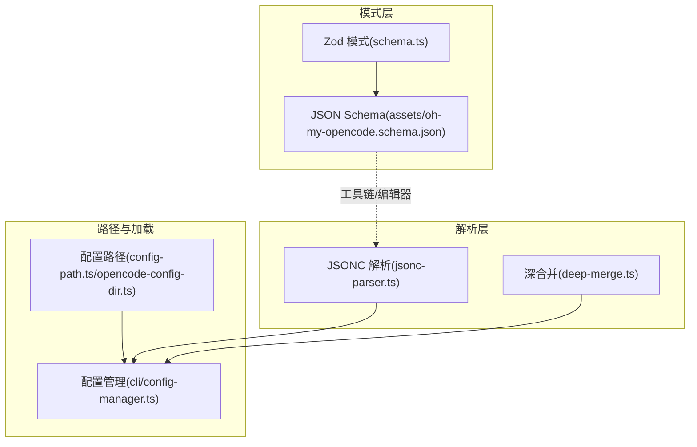
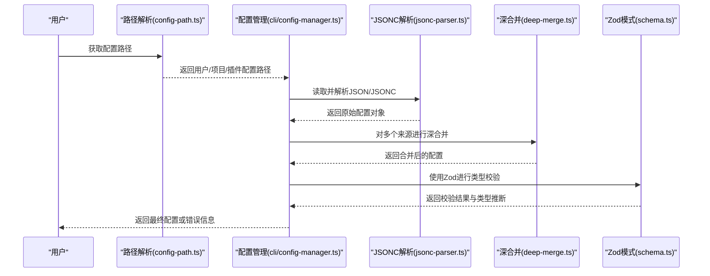
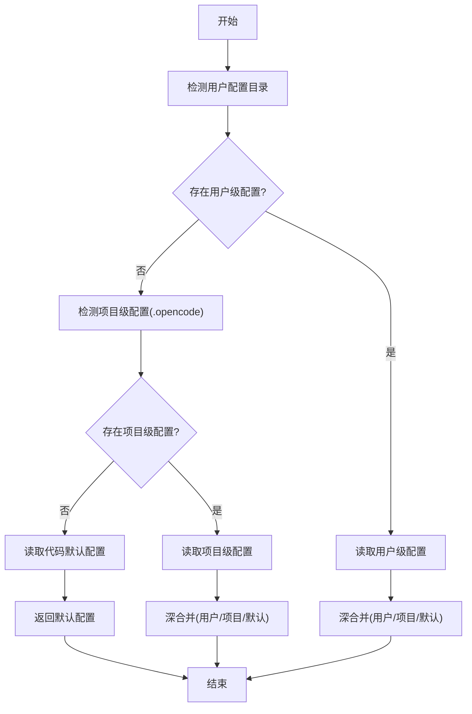
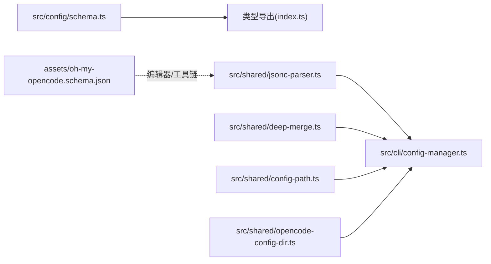

# 配置文件结构

<cite>
**本文引用的文件**
- [assets/oh-my-opencode.schema.json](file://assets/oh-my-opencode.schema.json)
- [src/config/schema.ts](file://src/config/schema.ts)
- [src/config/index.ts](file://src/config/index.ts)
- [src/config/schema.test.ts](file://src/config/schema.test.ts)
- [src/cli/config-manager.ts](file://src/cli/config-manager.ts)
- [src/shared/config-path.ts](file://src/shared/config-path.ts)
- [src/shared/jsonc-parser.ts](file://src/shared/jsonc-parser.ts)
- [src/shared/deep-merge.ts](file://src/shared/deep-merge.ts)
- [src/shared/opencode-config-dir.ts](file://src/shared/opencode-config-dir.ts)
- [CONFIGURATION-GUIDE.md](file://CONFIGURATION-GUIDE.md)
</cite>

## 目录
1. [简介](#简介)
2. [项目结构](#项目结构)
3. [核心组件](#核心组件)
4. [架构总览](#架构总览)
5. [详细组件分析](#详细组件分析)
6. [依赖关系分析](#依赖关系分析)
7. [性能考量](#性能考量)
8. [故障排查指南](#故障排查指南)
9. [结论](#结论)
10. [附录](#附录)

## 简介
本文件系统性阐述 Oh My OpenCode 的配置文件结构与加载机制，涵盖：
- 配置文件的层次结构（根对象、嵌套对象、数组配置）
- 类型安全与验证机制（Zod 模式与 JSON Schema）
- 加载顺序与优先级规则及冲突处理
- 完整配置示例与最佳实践
- 常见错误与排障建议

## 项目结构
配置系统由“模式定义”“解析与合并”“路径与加载”三部分组成：
- 模式定义：使用 Zod 定义强类型模式，并生成 JSON Schema 供工具链与编辑器支持
- 解析与合并：支持 JSON/JSONC，提供深合并策略与错误提示
- 路径与加载：统一管理用户级、项目级与插件生成的配置位置

图表来源
- [src/config/schema.ts](file://src/config/schema.ts#L1-L384)
- [assets/oh-my-opencode.schema.json](file://assets/oh-my-opencode.schema.json#L1-L2739)
- [src/shared/jsonc-parser.ts](file://src/shared/jsonc-parser.ts#L1-L67)
- [src/shared/deep-merge.ts](file://src/shared/deep-merge.ts#L1-L54)
- [src/shared/config-path.ts](file://src/shared/config-path.ts#L1-L48)
- [src/shared/opencode-config-dir.ts](file://src/shared/opencode-config-dir.ts#L1-L143)
- [src/cli/config-manager.ts](file://src/cli/config-manager.ts#L1-L731)

章节来源
- [src/config/schema.ts](file://src/config/schema.ts#L1-L384)
- [assets/oh-my-opencode.schema.json](file://assets/oh-my-opencode.schema.json#L1-L2739)
- [src/shared/jsonc-parser.ts](file://src/shared/jsonc-parser.ts#L1-L67)
- [src/shared/deep-merge.ts](file://src/shared/deep-merge.ts#L1-L54)
- [src/shared/config-path.ts](file://src/shared/config-path.ts#L1-L48)
- [src/shared/opencode-config-dir.ts](file://src/shared/opencode-config-dir.ts#L1-L143)
- [src/cli/config-manager.ts](file://src/cli/config-manager.ts#L1-L731)

## 核心组件
- 根配置对象：包含禁用项、代理与分类覆盖、技能、实验特性等顶层字段
- 嵌套配置对象：如 agents、categories、experimental 等
- 数组配置：如 disabled_mcps/disabled_agents/disabled_skills/disabled_hooks/disabled_commands
- 类型安全：Zod 模式提供运行时校验与编译期类型推断；JSON Schema 提供编辑器与工具链支持
- 加载与合并：按优先级读取多处配置并进行深合并

章节来源
- [src/config/schema.ts](file://src/config/schema.ts#L338-L358)
- [src/config/index.ts](file://src/config/index.ts#L1-L27)
- [assets/oh-my-opencode.schema.json](file://assets/oh-my-opencode.schema.json#L1-L2739)

## 架构总览
配置加载与验证的整体流程如下：

图表来源
- [src/shared/config-path.ts](file://src/shared/config-path.ts#L1-L48)
- [src/shared/opencode-config-dir.ts](file://src/shared/opencode-config-dir.ts#L101-L111)
- [src/cli/config-manager.ts](file://src/cli/config-manager.ts#L181-L213)
- [src/shared/jsonc-parser.ts](file://src/shared/jsonc-parser.ts#L9-L24)
- [src/shared/deep-merge.ts](file://src/shared/deep-merge.ts#L23-L53)
- [src/config/schema.ts](file://src/config/schema.ts#L338-L358)

## 详细组件分析

### 1) 根配置对象与字段层次
- 根对象字段概览（节选）：
  - 禁用项：disabled_mcps、disabled_agents、disabled_skills、disabled_hooks、disabled_commands
  - 覆盖层：agents、categories、skills
  - 功能开关：claude_code、sisyphus_agent、experimental、auto_update、notification、git_master、tdd_guard
  - 特性配置：ralph_loop、background_task、comment_checker
- agents：键为代理名（含内置与可覆盖代理），值为代理覆盖配置对象
- categories：键为分类名（含内置分类名），值为分类配置对象
- skills：支持数组或对象形式，可声明 sources、enable/disable 等

章节来源
- [src/config/schema.ts](file://src/config/schema.ts#L338-L358)
- [src/config/schema.ts](file://src/config/schema.ts#L109-L151)
- [src/config/schema.ts](file://src/config/schema.ts#L170-L186)
- [src/config/schema.ts](file://src/config/schema.ts#L279-L286)

### 2) 代理覆盖配置（AgentOverrideConfig）
- 支持字段：model（已弃用）、variant、category、skills、temperature、top_p、prompt、prompt_append、tools、disable、description、mode、color、permission
- 重要约束：
  - color 使用十六进制正则校验
  - temperature/top_p 有数值范围限制
  - permission 支持字符串枚举与对象形式（bash 权限可为字符串或记录）

章节来源
- [src/config/schema.ts](file://src/config/schema.ts#L109-L130)
- [src/config/schema.ts](file://src/config/schema.ts#L16-L17)
- [src/config/schema.ts](file://src/config/schema.ts#L6-L9)

### 3) 分类配置（CategoryConfig）
- 字段：model（必填）、variant、temperature、top_p、maxTokens、thinking（含 type/budgetTokens）、reasoningEffort、textVerbosity、tools、prompt_append、defaultSkills
- 内置分类名枚举：visual-engineering、ultrabrain、artistry、quick、most-capable、writing、general

章节来源
- [src/config/schema.ts](file://src/config/schema.ts#L170-L186)
- [src/config/schema.ts](file://src/config/schema.ts#L188-L196)

### 4) 技能配置（SkillsConfig）
- 支持两种形态：
  - 字符串数组：简化的启用/禁用列表
  - 对象形态：包含 sources、enable、disable 等元数据字段
- 单个技能条目可为布尔或技能定义对象（描述、模板、来源、模型、代理、子任务、工具白名单等）

章节来源
- [src/config/schema.ts](file://src/config/schema.ts#L279-L286)
- [src/config/schema.ts](file://src/config/schema.ts#L259-L272)

### 5) 实验与特性配置
- experimental：aggressive_truncation、auto_resume、truncate_all_tool_outputs、dynamic_context_pruning
- ralph_loop：enabled、default_max_iterations、state_dir
- background_task：defaultConcurrency、providerConcurrency、modelConcurrency、staleTimeoutMs
- notification：force_enable
- git_master：commit_footer、include_co_authored_by
- tdd_guard：enabled、risk_tier_enabled、min_enforce_tier、ignore_patterns、reject_empty_tests、reject_missing_assertions、reject_trivial_assertions、inject_skill_on_block

章节来源
- [src/config/schema.ts](file://src/config/schema.ts#L241-L248)
- [src/config/schema.ts](file://src/config/schema.ts#L288-L295)
- [src/config/schema.ts](file://src/config/schema.ts#L297-L303)
- [src/config/schema.ts](file://src/config/schema.ts#L305-L308)
- [src/config/schema.ts](file://src/config/schema.ts#L310-L315)
- [src/config/schema.ts](file://src/config/schema.ts#L319-L336)

### 6) JSON Schema 与 Zod 模式的对应关系
- JSON Schema 位于 assets/oh-my-opencode.schema.json，用于编辑器与工具链
- Zod 模式位于 src/config/schema.ts，提供运行时校验与类型推断
- 两者在字段命名、类型、约束上保持一致，确保“编写一次，双重保障”

章节来源
- [assets/oh-my-opencode.schema.json](file://assets/oh-my-opencode.schema.json#L1-L2739)
- [src/config/schema.ts](file://src/config/schema.ts#L1-L384)

### 7) 配置加载顺序与优先级
- 优先级从高到低：
  1) 项目级 oh-my-opencode.json（项目覆盖全局）
  2) 用户级 oh-my-opencode.json（用户全局）
  3) 项目级 .opencode/oh-my-opencode.json（项目特定）
  4) 代码默认配置（常量默认值）
- 加载来源与路径：
  - 用户级：跨平台优先 ~/.config/opencode/oh-my-opencode.json，Windows 兼容 %APPDATA%/opencode/oh-my-opencode.json
  - 项目级：工作目录下的 .opencode/oh-my-opencode.json
  - 插件生成：CLI 在用户配置目录生成/合并 oh-my-opencode.json

图表来源
- [src/shared/config-path.ts](file://src/shared/config-path.ts#L13-L40)
- [src/shared/opencode-config-dir.ts](file://src/shared/opencode-config-dir.ts#L101-L111)
- [src/cli/config-manager.ts](file://src/cli/config-manager.ts#L282-L307)

章节来源
- [CONFIGURATION-GUIDE.md](file://CONFIGURATION-GUIDE.md#L150-L158)
- [src/shared/config-path.ts](file://src/shared/config-path.ts#L1-L48)
- [src/shared/opencode-config-dir.ts](file://src/shared/opencode-config-dir.ts#L1-L143)
- [src/cli/config-manager.ts](file://src/cli/config-manager.ts#L282-L307)

### 8) 配置解析与合并
- 解析：支持 JSON/JSONC，允许尾随逗号与注释；空文件/仅空白内容会报错
- 合并：深合并策略，对象递归合并、数组替换、undefined 不覆盖
- 错误处理：针对权限、文件不存在、磁盘空间不足、只读文件系统等场景给出明确提示

章节来源
- [src/cli/config-manager.ts](file://src/cli/config-manager.ts#L181-L213)
- [src/shared/jsonc-parser.ts](file://src/shared/jsonc-parser.ts#L9-L24)
- [src/shared/deep-merge.ts](file://src/shared/deep-merge.ts#L23-L53)

### 9) 验证机制与类型安全
- Zod 模式提供：
  - 运行时类型校验与错误收集
  - 编译期类型推断（OhMyOpenCodeConfig 等）
- JSON Schema 提供：
  - 编辑器智能提示与校验
  - 外部工具链集成（如 VS Code 插件）

章节来源
- [src/config/schema.ts](file://src/config/schema.ts#L338-L382)
- [assets/oh-my-opencode.schema.json](file://assets/oh-my-opencode.schema.json#L1-L2739)

### 10) 完整配置示例与最佳实践
- 示例参考：CONFIGURATION-GUIDE.md 提供了多种配置组合示例（规划代理、分类覆盖、混合配置等）
- 最佳实践：
  - 优先使用 categories 统一管理模型与默认技能，再通过 agents 对个别代理微调
  - 使用 tools 与 permission 精细化控制代理能力
  - 将敏感或环境相关配置放入项目级 .opencode/oh-my-opencode.json
  - 使用 JSONC 注释说明用途，便于团队协作
  - 定期清理 disabled_* 列表，避免过时禁用项影响维护成本

章节来源
- [CONFIGURATION-GUIDE.md](file://CONFIGURATION-GUIDE.md#L161-L289)

## 依赖关系分析
- 模式层依赖：Zod 模式导出类型给上层使用
- 解析层依赖：JSONC 解析器为配置管理提供基础能力
- 路径层依赖：统一配置路径，避免硬编码
- 配置管理依赖：路径、解析、合并、模式共同构成配置生命周期

图表来源
- [src/config/schema.ts](file://src/config/schema.ts#L1-L384)
- [src/config/index.ts](file://src/config/index.ts#L1-L27)
- [src/shared/jsonc-parser.ts](file://src/shared/jsonc-parser.ts#L1-L67)
- [src/shared/deep-merge.ts](file://src/shared/deep-merge.ts#L1-L54)
- [src/shared/config-path.ts](file://src/shared/config-path.ts#L1-L48)
- [src/shared/opencode-config-dir.ts](file://src/shared/opencode-config-dir.ts#L1-L143)
- [assets/oh-my-opencode.schema.json](file://assets/oh-my-opencode.schema.json#L1-L2739)

章节来源
- [src/config/index.ts](file://src/config/index.ts#L1-L27)
- [src/cli/config-manager.ts](file://src/cli/config-manager.ts#L1-L731)

## 性能考量
- 解析与合并复杂度：深合并为 O(n+m) 级别（n、m 为对象键数），数组替换为 O(k)（k 为数组长度）
- I/O 开销：读取多个配置文件的开销较小，主要瓶颈在磁盘与解析
- 建议：
  - 控制配置层级深度，避免过深嵌套导致合并成本上升
  - 合理拆分项目级与用户级配置，减少单文件体积
  - 使用 JSONC 注释时注意文件大小与解析时间

## 故障排查指南
- 常见错误与定位：
  - 权限不足：无法创建/写入配置目录或文件
  - 文件不存在：路径拼写错误或未初始化
  - JSON 语法错误：缺少逗号、括号不匹配、非法字符
  - 磁盘空间不足：无法写入新配置
  - 只读文件系统：配置目录挂载为只读
- 排查步骤：
  - 确认配置路径是否正确（用户级/项目级）
  - 检查 JSON/JSONC 语法与注释合法性
  - 查看合并后配置是否符合预期（优先级与覆盖关系）
  - 使用单元测试中的模式用例作为参考，逐项比对字段类型与约束

章节来源
- [src/cli/config-manager.ts](file://src/cli/config-manager.ts#L64-L98)
- [src/shared/jsonc-parser.ts](file://src/shared/jsonc-parser.ts#L9-L24)
- [src/config/schema.test.ts](file://src/config/schema.test.ts#L1-L445)

## 结论
Oh My OpenCode 的配置系统以 Zod 模式为核心，结合 JSON Schema 与严格的加载/合并策略，实现了类型安全、可维护且可扩展的配置体系。通过清晰的优先级与覆盖规则，用户可在不同层级灵活定制代理、分类与功能行为，同时借助工具链获得良好的开发体验。

## 附录

### A. 配置字段速查（根对象）
- 禁用项：disabled_mcps、disabled_agents、disabled_skills、disabled_hooks、disabled_commands
- 覆盖层：agents、categories、skills
- 功能开关：claude_code、sisyphus_agent、experimental、auto_update、notification、git_master、tdd_guard
- 特性配置：ralph_loop、background_task、comment_checker

章节来源
- [src/config/schema.ts](file://src/config/schema.ts#L338-L358)

### B. 配置加载顺序与优先级（摘要）
- 1) 项目级 oh-my-opencode.json（项目覆盖全局）
- 2) 用户级 oh-my-opencode.json（用户全局）
- 3) 项目级 .opencode/oh-my-opencode.json（项目特定）
- 4) 代码默认配置（常量默认值）

章节来源
- [CONFIGURATION-GUIDE.md](file://CONFIGURATION-GUIDE.md#L150-L158)