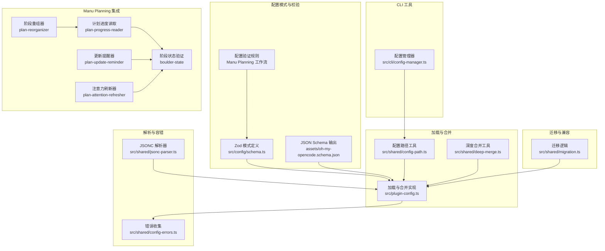
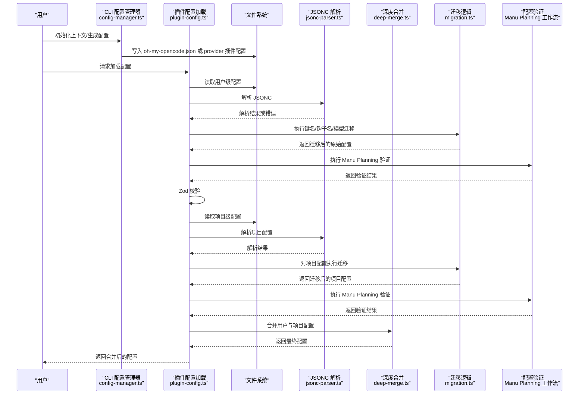
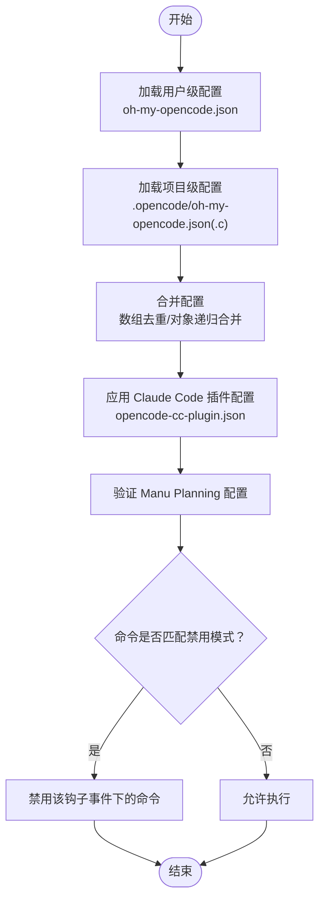
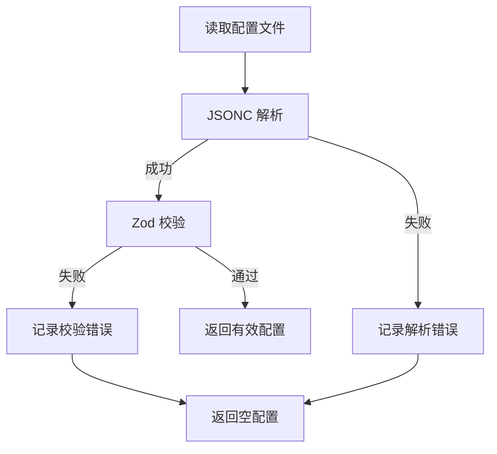
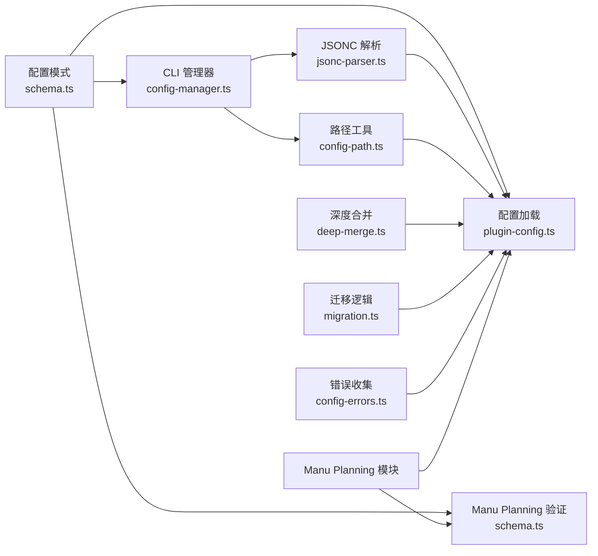

# 配置管理

<cite>
**本文引用的文件**
- [src/config/index.ts](file://src/config/index.ts)
- [src/config/schema.ts](file://src/config/schema.ts)
- [assets/oh-my-opencode.schema.json](file://assets/oh-my-opencode.schema.json)
- [src/plugin-config.ts](file://src/plugin-config.ts)
- [src/shared/config-path.ts](file://src/shared/config-path.ts)
- [src/shared/jsonc-parser.ts](file://src/shared/jsonc-parser.ts)
- [src/shared/deep-merge.ts](file://src/shared/deep-merge.ts)
- [src/shared/migration.ts](file://src/shared/migration.ts)
- [src/shared/config-errors.ts](file://src/shared/config-errors.ts)
- [src/cli/config-manager.ts](file://src/cli/config-manager.ts)
- [CONFIGURATION-GUIDE.md](file://CONFIGURATION-GUIDE.md)
- [src/hooks/claude-code-hooks/config-loader.ts](file://src/hooks/claude-code-hooks/config-loader.ts)
- [src/features/claude-code-plugin-loader/loader.ts](file://src/features/claude-code-plugin-loader/loader.ts)
- [src/features/skill-mcp-manager/env-cleaner.ts](file://src/features/skill-mcp-manager/env-cleaner.ts)
- [src/features/builtin-skills/skills.ts](file://src/features/builtin-skills/skills.ts)
- [changes/multi-manus-planning-integration/design.md](file://changes/multi-manus-planning-integration/design.md)
- [changes/multi-manus-planning-integration/tasks.md](file://changes/multi-manus-planning-integration/tasks.md)
- [src/config/schema.test.ts](file://src/config/schema.test.ts)
- [src/hooks/plan-reorganizer/index.ts](file://src/hooks/plan-reorganizer/index.ts)
- [src/hooks/plan-update-reminder/index.ts](file://src/hooks/plan-update-reminder/index.ts)
- [src/hooks/plan-attention-refresher/index.ts](file://src/hooks/plan-attention-refresher/index.ts)
- [src/features/plan-progress-reader/index.ts](file://src/features/plan-progress-reader/index.ts)
- [src/features/boulder-state/storage.ts](file://src/features/boulder-state/storage.ts)
- [src/features/boulder-state/types.ts](file://src/features/boulder-state/types.ts)
</cite>

## 更新摘要
**所做更改**
- 扩展配置验证规则以支持复杂的 Manu Planning 工作流
- 新增 checkbox_enforcement 配置项和验证逻辑
- 更新钩子配置模式以包含新的 plan-reorganizer、plan-update-reminder、plan-attention-refresher 钩子
- 增强计划进度读取和阶段状态验证机制
- 添加 Manus 原则相关的配置验证和错误处理

## 目录
1. [简介](#简介)
2. [项目结构](#项目结构)
3. [核心组件](#核心组件)
4. [架构总览](#架构总览)
5. [详细组件分析](#详细组件分析)
6. [依赖分析](#依赖分析)
7. [性能考虑](#性能考虑)
8. [故障排查指南](#故障排查指南)
9. [结论](#结论)
10. [附录](#附录)

## 简介
本文件系统性阐述 Oh My OpenCode 的配置管理体系，涵盖配置文件结构与层次、优先级规则、模型与代理配置、钩子与技能配置、验证与错误处理、环境变量使用、平台差异以及迁移指南。特别针对复杂的 Manu Planning 工作流，新增了配置验证规则和验证逻辑，确保配置变更的可追溯与可恢复。

## 项目结构
配置管理涉及以下关键模块：
- 配置模式与校验：基于 Zod 的模式定义与 JSON Schema 输出，确保配置合法与可预测
- 配置加载与合并：按优先级从用户与项目目录加载配置，进行深度合并
- 解析与容错：支持 JSONC（含注释），并提供安全解析与错误收集
- 迁移与兼容：对旧版键名、钩子名与模型到类别的映射进行自动迁移
- 平台路径：跨平台确定用户配置目录与项目配置路径
- CLI 工具链：生成 oh-my-opencode.json、写入 provider 与插件配置、检测安装状态等
- **新增**：Manu Planning 工作流配置验证与阶段状态管理



**图表来源**
- [src/config/schema.ts](file://src/config/schema.ts#L65-L110)
- [src/config/schema.ts](file://src/config/schema.ts#L346-L372)
- [src/plugin-config.ts](file://src/plugin-config.ts#L93-L135)
- [src/features/plan-progress-reader/index.ts](file://src/features/plan-progress-reader/index.ts#L1-L10)
- [src/hooks/plan-reorganizer/index.ts](file://src/hooks/plan-reorganizer/index.ts#L1-L74)
- [src/hooks/plan-update-reminder/index.ts](file://src/hooks/plan-update-reminder/index.ts#L1-L73)
- [src/hooks/plan-attention-refresher/index.ts](file://src/hooks/plan-attention-refresher/index.ts#L1-L140)
- [src/features/boulder-state/storage.ts](file://src/features/boulder-state/storage.ts#L178-L200)

**章节来源**
- [src/config/index.ts](file://src/config/index.ts#L1-L27)
- [src/config/schema.ts](file://src/config/schema.ts#L338-L399)
- [assets/oh-my-opencode.schema.json](file://assets/oh-my-opencode.schema.json#L1-L800)
- [src/plugin-config.ts](file://src/plugin-config.ts#L93-L135)
- [src/shared/config-path.ts](file://src/shared/config-path.ts#L1-L48)
- [src/shared/jsonc-parser.ts](file://src/shared/jsonc-parser.ts#L9-L41)
- [src/shared/deep-merge.ts](file://src/shared/deep-merge.ts#L23-L53)
- [src/shared/migration.ts](file://src/shared/migration.ts#L125-L166)
- [src/shared/config-errors.ts](file://src/shared/config-errors.ts#L1-L19)
- [src/cli/config-manager.ts](file://src/cli/config-manager.ts#L1-L731)

## 核心组件
- 配置模式与类型导出：统一暴露 OhMyOpenCodeConfig 及其子类型，便于上层消费
- 加载与合并：按用户级 → 项目级 → 默认值的顺序加载并合并，支持数组去重与对象递归合并
- 解析与校验：先 JSONC 解析，再 Zod 校验；失败时记录错误并返回空配置
- 迁移与兼容：自动修正旧键名、钩子名与模型到类别的映射，必要时备份并写回
- 平台路径：跨平台确定用户配置目录，优先 ~/.config，Windows 下兼容 %APPDATA%
- CLI 支持：生成 oh-my-opencode.json、写入 provider 与插件配置、检测安装状态与版本
- **新增**：Manu Planning 配置验证与阶段状态管理，包括 checkbox_enforcement 配置项

**章节来源**
- [src/config/index.ts](file://src/config/index.ts#L1-L27)
- [src/plugin-config.ts](file://src/plugin-config.ts#L93-L135)
- [src/shared/config-path.ts](file://src/shared/config-path.ts#L13-L40)
- [src/shared/jsonc-parser.ts](file://src/shared/jsonc-parser.ts#L9-L41)
- [src/shared/migration.ts](file://src/shared/migration.ts#L125-L166)
- [src/cli/config-manager.ts](file://src/cli/config-manager.ts#L309-L430)

## 架构总览
配置加载与应用的端到端流程如下：



**图表来源**
- [src/cli/config-manager.ts](file://src/cli/config-manager.ts#L309-L430)
- [src/plugin-config.ts](file://src/plugin-config.ts#L93-L135)
- [src/shared/jsonc-parser.ts](file://src/shared/jsonc-parser.ts#L9-L41)
- [src/shared/deep-merge.ts](file://src/shared/deep-merge.ts#L23-L53)
- [src/shared/migration.ts](file://src/shared/migration.ts#L125-L166)
- [src/config/schema.ts](file://src/config/schema.ts#L346-L372)

## 详细组件分析

### 配置优先级与层次
- 层次顺序（从高到低）
  1) 项目级配置：.opencode/oh-my-opencode.json(.c)
  2) 用户级配置：~/.config/opencode/oh-my-opencode.json(.c)
  3) 默认配置：代码中的默认值（如类别默认模型）
- 优先级体现
  - 项目级覆盖用户级
  - 用户级覆盖默认值
  - 数组字段采用去重合并（如禁用列表）
  - 对象字段递归深度合并（如 agents、categories）

**章节来源**
- [CONFIGURATION-GUIDE.md](file://CONFIGURATION-GUIDE.md#L150-L158)
- [src/plugin-config.ts](file://src/plugin-config.ts#L50-L91)
- [src/shared/deep-merge.ts](file://src/shared/deep-merge.ts#L23-L53)

### 模型与代理配置
- 类别配置（Categories）
  - 关键字段：model、variant、temperature、top_p、maxTokens、thinking、reasoningEffort、textVerbosity、tools、prompt_append、defaultSkills
  - 用途：为代理继承默认参数，支持按类别注入默认技能
- 代理覆盖（Agent Overrides）
  - 关键字段：model、variant、category、skills、temperature、top_p、prompt、prompt_append、tools、disable、description、mode、color、permission
  - 用途：针对具体代理微调参数、权限与行为
- 类别到代理的继承
  - 通过 category 字段，代理可继承对应类别的默认设置
- 模式与类型导出
  - 统一导出 OhMyOpenCodeConfig、AgentOverrideConfig、CategoriesConfig 等类型

```mermaid
classDiagram
class OhMyOpenCodeConfig {
+disabled_mcps : string[]
+disabled_agents : string[]
+disabled_skills : string[]
+disabled_hooks : string[]
+disabled_commands : string[]
+agents : AgentOverrides
+categories : CategoriesConfig
+experimental : ExperimentalConfig
+skills : SkillsConfig
+claude_code : ClaudeCodeConfig
+sisyphus_agent : SisyphusAgentConfig
+comment_checker : CommentCheckerConfig
+ralph_loop : RalphLoopConfig
+background_task : BackgroundTaskConfig
+notification : NotificationConfig
+git_master : GitMasterConfig
+tdd_guard : TddGuardConfig
+checkbox_enforcement : CheckboxEnforcementConfig
}
class AgentOverrides {
+build : AgentOverrideConfig
+plan : AgentOverrideConfig
+Sisyphus : AgentOverrideConfig
+Sisyphus-Junior : AgentOverrideConfig
+OpenCode-Builder : AgentOverrideConfig
+Prometheus(Planner) : AgentOverrideConfig
+Metis(Plan Consultant) : AgentOverrideConfig
+Momus(Plan Reviewer) : AgentOverrideConfig
+oracle : AgentOverrideConfig
+librarian : AgentOverrideConfig
+explore : AgentOverrideConfig
+implementer : AgentOverrideConfig
+archiver : AgentOverrideConfig
+frontend-ui-ux-engineer : AgentOverrideConfig
+document-writer : AgentOverrideConfig
+multimodal-looker : AgentOverrideConfig
+orchestrator-sisyphus : AgentOverrideConfig
}
class CategoryConfig {
+model : string
+variant : string
+temperature : number
+top_p : number
+maxTokens : number
+thinking : {type, budgetTokens}
+reasoningEffort : "low"|"medium"|"high"
+textVerbosity : "low"|"medium"|"high"
+tools : map<string,bool>
+prompt_append : string
+defaultSkills : string[]
}
OhMyOpenCodeConfig --> AgentOverrides
OhMyOpenCodeConfig --> CategoryConfig
```

**图表来源**
- [src/config/schema.ts](file://src/config/schema.ts#L170-L186)
- [src/config/schema.ts](file://src/config/schema.ts#L109-L151)
- [src/config/schema.ts](file://src/config/schema.ts#L338-L358)

**章节来源**
- [src/config/schema.ts](file://src/config/schema.ts#L109-L186)
- [src/config/schema.ts](file://src/config/schema.ts#L338-L399)
- [src/config/index.ts](file://src/config/index.ts#L1-L27)

### 代理配置选项详解
- 模型与变体：model、variant
- 温度与采样：temperature、top_p
- 提示词扩展：prompt、prompt_append
- 工具开关：tools（键值对）
- 行为控制：disable、mode、color
- 权限控制：edit、bash、webfetch、doom_loop、external_directory
- 技能注入：skills、category（继承类别默认技能）

**章节来源**
- [src/config/schema.ts](file://src/config/schema.ts#L109-L130)
- [src/config/schema.ts](file://src/config/schema.ts#L170-L186)

### 钩子配置管理
- 禁用钩子
  - 在 oh-my-opencode.json 中通过 disabled_hooks 列表禁用
  - 在 Claude Code 插件中通过 opencode-cc-plugin.json 的 disabledHooks 结构按事件类型过滤命令
- 命令级禁用匹配
  - 支持正则表达式模式匹配，精确控制特定命令是否被禁用
- 禁用判定
  - 支持布尔、数组与结构化配置三种形式
- **新增**：Manu Planning 工作流钩子
  - plan-reorganizer：编辑 tasks.md 后自动重组完成的阶段
  - plan-update-reminder：代码文件变更后提醒更新 tasks.md
  - plan-attention-refresher：工具执行前刷新计划上下文



**图表来源**
- [src/plugin-config.ts](file://src/plugin-config.ts#L50-L91)
- [src/hooks/claude-code-hooks/config-loader.ts](file://src/hooks/claude-code-hooks/config-loader.ts#L7-L107)
- [src/config/schema.ts](file://src/config/schema.ts#L65-L110)

**章节来源**
- [src/hooks/claude-code-hooks/config-loader.ts](file://src/hooks/claude-code-hooks/config-loader.ts#L1-L107)
- [src/shared/migration.ts](file://src/shared/migration.ts#L41-L84)
- [src/config/schema.ts](file://src/config/schema.ts#L65-L110)

### 技能配置方法
- 技能来源
  - 数组：直接列出内置或已发现的技能名称
  - 记录：键为技能名，值为布尔或技能定义对象
  - sources：支持 path、recursive、glob 三要素，用于扫描外部技能
  - enable/disable：显式启用/禁用某些技能
- 技能定义
  - description、template、from、model、agent、subtask、argument-hint、license、compatibility、metadata、allowed-tools、disable
- MCP 服务器与技能
  - 技能可声明 MCP 服务器能力，由加载器解析并命名空间化注册

**章节来源**
- [src/config/schema.ts](file://src/config/schema.ts#L250-L286)
- [src/config/schema.ts](file://src/config/schema.ts#L259-L272)
- [src/features/claude-code-plugin-loader/loader.ts](file://src/features/claude-code-plugin-loader/loader.ts#L392-L428)

### 代理与类别继承关系
- 类别到代理的继承
  - 通过 category 字段，代理继承类别的 model、tools、prompt_append、defaultSkills 等
- 代理覆盖优先
  - 若代理显式设置了某字段，则覆盖类别默认值
- 典型场景
  - 使用 sisyphus_task({ category: "visual" }) 时，自动创建 Sisyphus-Junior-visual 并继承 categories.visual

**章节来源**
- [CONFIGURATION-GUIDE.md](file://CONFIGURATION-GUIDE.md#L1-L289)
- [src/shared/migration.ts](file://src/shared/migration.ts#L47-L54)

### 配置验证机制与错误处理
- 解析阶段
  - JSONC 解析：支持注释与尾随逗号，错误会抛出语法异常
  - 安全解析：返回错误列表，不抛异常
- 校验阶段
  - Zod 校验：对原始配置进行强类型校验，失败时记录错误详情
- 错误收集
  - 统一收集加载错误，便于诊断与报告
- CLI 错误提示
  - 针对权限、文件不存在、磁盘满、只读文件系统等常见错误给出明确建议
- **新增**：Manu Planning 验证规则
  - checkbox_enforcement 配置验证
  - 阶段状态解析验证
  - 计划文件存在性验证



**图表来源**
- [src/shared/jsonc-parser.ts](file://src/shared/jsonc-parser.ts#L9-L41)
- [src/plugin-config.ts](file://src/plugin-config.ts#L14-L48)
- [src/shared/config-errors.ts](file://src/shared/config-errors.ts#L1-L19)
- [src/cli/config-manager.ts](file://src/cli/config-manager.ts#L74-L98)

**章节来源**
- [src/shared/jsonc-parser.ts](file://src/shared/jsonc-parser.ts#L9-L41)
- [src/plugin-config.ts](file://src/plugin-config.ts#L14-L48)
- [src/shared/config-errors.ts](file://src/shared/config-errors.ts#L1-L19)
- [src/cli/config-manager.ts](file://src/cli/config-manager.ts#L74-L98)

### 环境变量使用与平台差异
- 环境变量展开
  - 在 Claude Code 插件 MCP 配置加载时，对字符串、数组与对象递归进行环境变量替换
- 环境清理
  - 为 MCP 环境创建"干净"副本，过滤掉 NPM_CONFIG_* 等潜在风险变量
- 平台差异
  - 用户配置目录：Linux/macOS 使用 XDG_CONFIG_HOME 或 ~/.config；Windows 优先 ~/.config，其次 %APPDATA%
  - CLI 二进制检测：opencode 与 opencode-desktop，自动识别可用版本

**章节来源**
- [src/features/claude-code-plugin-loader/loader.ts](file://src/features/claude-code-plugin-loader/loader.ts#L392-L428)
- [src/features/skill-mcp-manager/env-cleaner.ts](file://src/features/skill-mcp-manager/env-cleaner.ts#L1-L152)
- [src/shared/config-path.ts](file://src/shared/config-path.ts#L13-L40)
- [src/cli/config-manager.ts](file://src/cli/config-manager.ts#L437-L466)

### 迁移指南
- 旧键名迁移
  - 代理名映射：如 omo → Sisyphus、prometheus → Prometheus(Planner) 等
  - 钩子名映射：如 anthropic-auto-compact → anthropic-context-window-limit-recovery
- 模型到类别的迁移
  - 将旧的 agents.model 映射到 categories.{category}，并在需要时删除冗余代理配置
- 自动写回与备份
  - 迁移后自动备份原文件并写回新格式，便于回滚

**章节来源**
- [src/shared/migration.ts](file://src/shared/migration.ts#L4-L84)
- [src/shared/migration.ts](file://src/shared/migration.ts#L125-L166)

### Manu Planning 工作流配置验证

**更新** 新增复杂的 Manu Planning 工作流配置验证规则，包括新的配置项和验证逻辑

#### 新增配置项：checkbox_enforcement
- 配置结构
  - enabled: boolean（默认：true）
  - 用途：控制是否启用 checkbox 更新强制验证
- 验证规则
  - 必须为布尔值
  - 默认启用，可显式禁用

#### 钩子配置扩展
- 新增钩子名称验证
  - plan-reorganizer：编辑 tasks.md 后重组完成阶段
  - plan-update-reminder：代码变更后提醒更新计划
  - plan-attention-refresher：工具执行前刷新计划上下文

#### 阶段状态验证
- 阶段状态解析
  - 支持反引号语法：`complete`、`in_progress`、`pending`
  - 支持 Status 行语法：`**Status:** complete`
  - 优先级：反引号语法 > Status 行 > 默认 pending
- 边界识别规则
  - Phase 标题匹配：`/^#{2,3}\s+Phase\s+\d+:/i`
  - 结束条件：下一个同级或更高级标题、`---` 分隔线、文件末尾
  - 大小写不敏感

#### 完成状态综合判定
- 短路优先级（最高到最低）
  1) boulder.phase === "completed" → 立即允许停止
  2) boulder.json 不存在或 active_plan 无效 → 回退到 OpenCode todos
  3) tasks.md 存在 → 以 tasks.md 为准（忽略 OpenCode todos）
     - 所有 checkboxes 都是 [x] 或 [-] 且
     - 所有 phases 都是 complete
  4) tasks.md 不存在但 boulder.json 存在 → 允许停止

#### 强制提醒与拒绝停止机制
- 状态追踪
  - lastCodeDiffHash：上次检测到代码变更的 git diff hash
  - lastTasksMtime：上次 tasks.md 的 mtime
  - reminderCount：连续未更新的提醒次数
- 逻辑规则
  - 第 1-2 次：注入强制提醒
  - 第 3 次：拒绝自动继续
  - tasks.md 更新后重置计数器

**章节来源**
- [src/config/schema.ts](file://src/config/schema.ts#L346-L372)
- [src/config/schema.ts](file://src/config/schema.ts#L65-L110)
- [src/features/boulder-state/storage.ts](file://src/features/boulder-state/storage.ts#L144-L161)
- [src/features/boulder-state/storage.ts](file://src/features/boulder-state/storage.ts#L178-L200)
- [src/hooks/plan-reorganizer/index.ts](file://src/hooks/plan-reorganizer/index.ts#L14-L25)
- [src/hooks/plan-update-reminder/index.ts](file://src/hooks/plan-update-reminder/index.ts#L14-L26)
- [src/hooks/plan-attention-refresher/index.ts](file://src/hooks/plan-attention-refresher/index.ts#L25-L35)

### 完整配置示例与最佳实践
- 示例位置
  - CONFIGURATION-GUIDE.md 提供了多种配置组合示例（规划代理、类别覆盖、混合配置）
- 最佳实践
  - 优先使用类别配置集中管理模型与默认技能，代理仅做差异化覆盖
  - 使用 JSONC 注释说明用途，便于团队协作
  - 通过 disabled_mcps/disabled_hooks 控制功能范围，避免不必要的资源消耗
  - 在 Windows 上统一使用 ~/.config 作为用户配置目录，减少跨平台差异
- **新增**：Manu Planning 最佳实践
  - 启用 checkbox_enforcement 以确保计划状态同步
  - 使用 tasks.md 作为真相来源，避免 todos 与计划文件状态不一致
  - 定期使用 plan-reorganizer 保持文档结构清晰
  - 在代码变更后及时更新 tasks.md

**章节来源**
- [CONFIGURATION-GUIDE.md](file://CONFIGURATION-GUIDE.md#L161-L289)
- [changes/multi-manus-planning-integration/design.md](file://changes/multi-manus-planning-integration/design.md#L1-L267)
- [changes/multi-manus-planning-integration/tasks.md](file://changes/multi-manus-planning-integration/tasks.md#L1-L800)

## 依赖分析
配置系统内部依赖关系如下：



**图表来源**
- [src/config/schema.ts](file://src/config/schema.ts#L338-L399)
- [src/plugin-config.ts](file://src/plugin-config.ts#L93-L135)
- [src/cli/config-manager.ts](file://src/cli/config-manager.ts#L1-L731)
- [src/shared/jsonc-parser.ts](file://src/shared/jsonc-parser.ts#L9-L41)
- [src/shared/config-path.ts](file://src/shared/config-path.ts#L1-L48)
- [src/shared/deep-merge.ts](file://src/shared/deep-merge.ts#L23-L53)
- [src/shared/migration.ts](file://src/shared/migration.ts#L125-L166)
- [src/shared/config-errors.ts](file://src/shared/config-errors.ts#L1-L19)

**章节来源**
- [src/plugin-config.ts](file://src/plugin-config.ts#L93-L135)
- [src/cli/config-manager.ts](file://src/cli/config-manager.ts#L1-L731)

## 性能考虑
- 解析与校验
  - JSONC 解析与 Zod 校验均为内存操作，配置体量较大时建议拆分至项目级配置
  - **新增**：Manu Planning 验证增加额外的文件系统访问和解析开销
- 合并策略
  - 对象递归合并与数组去重均采用浅拷贝+遍历，复杂度与字段数量线性相关
- 文件 I/O
  - 仅在首次加载时读取文件，后续复用缓存结果；CLI 写入采用原子备份与写回，避免并发冲突
  - **新增**：计划文件读取和阶段状态解析可能增加 I/O 操作

## 故障排查指南
- 常见错误与建议
  - 权限不足：检查文件所有者与权限，尝试提升权限或更换目录
  - 文件不存在：确认配置路径正确，或使用 CLI 生成默认配置
  - 磁盘空间不足：清理空间后重试
  - 只读文件系统：切换到可写目录
  - **新增**：Manu Planning 相关错误
    - 计划文件解析失败：检查 tasks.md 格式是否符合 Manus 原则
    - 阶段状态验证失败：确认阶段语法格式正确
    - 钩子执行失败：检查钩子配置和文件路径
- 诊断步骤
  - 使用 doctor 检查配置有效性
  - 查看配置加载错误列表，定位具体路径与错误信息
  - 检查迁移日志，确认是否发生自动迁移与备份
  - **新增**：Manu Planning 诊断
    - 检查 boulder.json 是否存在且格式正确
    - 验证 tasks.md 文件结构和阶段语法
    - 确认钩子注册和执行状态
- 相关实现
  - 错误格式化与建议：权限、文件不存在、语法错误、磁盘空间、只读文件系统
  - 错误收集与清空：统一存储与查询

**章节来源**
- [src/cli/config-manager.ts](file://src/cli/config-manager.ts#L74-L98)
- [src/shared/config-errors.ts](file://src/shared/config-errors.ts#L1-L19)
- [src/features/boulder-state/storage.ts](file://src/features/boulder-state/storage.ts#L144-L161)

## 结论
Oh My OpenCode 的配置管理以清晰的层次与严格的校验为核心，结合自动迁移与跨平台路径适配，既保证了灵活性又降低了维护成本。通过类别继承与代理覆盖的组合，用户可在全局与项目级精细控制模型、技能与行为；借助钩子与技能的灵活配置，系统可按需扩展与裁剪功能。

**更新** 新增的 Manu Planning 工作流配置验证规则进一步增强了系统的复杂工作流管理能力，通过严格的配置验证和阶段状态管理，确保复杂的计划执行过程得到有效的监督和控制。新增的 checkbox_enforcement 配置项、阶段状态解析机制和强制提醒系统，为用户提供了一个更加完善和可靠的计划管理解决方案。

建议在团队内统一遵循类别优先、代理覆盖最小化的原则，并充分利用 JSONC 注释与迁移备份机制，确保配置的可维护性与可追溯性。对于 Manu Planning 工作流，建议启用 checkbox_enforcement 并定期使用相关钩子来维护计划文件的准确性和完整性。

## 附录
- JSON Schema 参考：assets/oh-my-opencode.schema.json
- 配置示例参考：CONFIGURATION-GUIDE.md
- 内置技能清单：src/features/builtin-skills/skills.ts
- **新增**：Manu Planning 设计文档：changes/multi-manus-planning-integration/design.md
- **新增**：Manu Planning 任务文档：changes/multi-manus-planning-integration/tasks.md
- **新增**：配置验证测试：src/config/schema.test.ts