# 钩子配置

<cite>
**本文引用的文件**
- [src/hooks/index.ts](file://src/hooks/index.ts)
- [src/hooks/context-window-monitor.ts](file://src/hooks/context-window-monitor.ts)
- [src/hooks/session-recovery/index.ts](file://src/hooks/session-recovery/index.ts)
- [src/hooks/auto-update-checker/index.ts](file://src/hooks/auto-update-checker/index.ts)
- [src/hooks/claude-code-hooks/index.ts](file://src/hooks/claude-code-hooks/index.ts)
- [src/hooks/claude-code-hooks/types.ts](file://src/hooks/claude-code-hooks/types.ts)
- [src/hooks/claude-code-hooks/config.ts](file://src/hooks/claude-code-hooks/config.ts)
- [src/hooks/claude-code-hooks/pre-tool-use.ts](file://src/hooks/claude-code-hooks/pre-tool-use.ts)
- [src/hooks/claude-code-hooks/post-tool-use.ts](file://src/hooks/claude-code-hooks/post-tool-use.ts)
- [src/hooks/claude-code-hooks/user-prompt-submit.ts](file://src/hooks/claude-code-hooks/user-prompt-submit.ts)
- [src/hooks/claude-code-hooks/config-loader.ts](file://src/hooks/claude-code-hooks/config-loader.ts)
- [src/hooks/claude-code-hooks/plugin-config.ts](file://src/hooks/claude-code-hooks/plugin-config.ts)
- [src/shared/hook-disabled.ts](file://src/shared/hook-disabled.ts)
- [src/hooks/agent-usage-reminder/index.ts](file://src/hooks/agent-usage-reminder/index.ts)
- [src/hooks/agent-skill-reminder/index.ts](file://src/hooks/agent-skill-reminder/index.ts)
- [src/hooks/keyword-detector/index.ts](file://src/hooks/keyword-detector/index.ts)
- [src/hooks/non-interactive-env/index.ts](file://src/hooks/non-interactive-env/index.ts)
- [src/hooks/interactive-bash-session/index.ts](file://src/hooks/interactive-bash-session/index.ts)
- [src/hooks/thinking-block-validator/index.ts](file://src/hooks/thinking-block-validator/index.ts)
- [src/hooks/ralph-loop/index.ts](file://src/hooks/ralph-loop/index.ts)
- [src/hooks/auto-slash-command/index.ts](file://src/hooks/auto-slash-command/index.ts)
- [src/hooks/edit-error-recovery/index.ts](file://src/hooks/edit-error-recovery/index.ts)
- [src/hooks/prometheus-md-only/index.ts](file://src/hooks/prometheus-md-only/index.ts)
- [src/shared/pattern-matcher.ts](file://src/shared/pattern-matcher.ts)
</cite>

## 更新摘要
**变更内容**
- 新增了12个激活钩子，扩展了钩子配置系统的功能范围
- 修改了配置模式以支持新的钩子类别和参数
- 增强了钩子的执行时机和优先级机制
- 完善了钩子配置的性能影响分析和优化建议

## 目录
1. [简介](#简介)
2. [项目结构](#项目结构)
3. [核心组件](#核心组件)
4. [架构总览](#架构总览)
5. [详细组件分析](#详细组件分析)
6. [依赖关系分析](#依赖关系分析)
7. [性能考量](#性能考量)
8. [故障排除指南](#故障排除指南)
9. [结论](#结论)
10. [附录：钩子配置示例与最佳实践](#附录钩子配置示例与最佳实践)

## 简介
本文件系统性梳理 Oh My OpenCode 的钩子体系，覆盖上下文监控、会话恢复、自动更新检查、Claude Code 钩子生态（预工具调用、后工具调用、用户提示提交、停止时机、预压缩注入）等能力。文档重点说明：
- 可用钩子类型与功能边界
- 启用/禁用机制与配置项
- 执行时机与优先级策略
- 性能影响与优化建议
- 故障排除与调试方法
- 实战示例与最佳实践

**更新** 新增了12个激活钩子，包括代理使用提醒、代理技能提醒、关键词检测、非交互环境保护、交互式 Bash 会话管理、思维块验证器、Ralph 循环控制、自动斜杠命令、编辑错误恢复、Prometheus 只读保护等。

## 项目结构
钩子模块集中于 src/hooks 下，按功能拆分独立目录；Claude Code 钩子生态位于 src/hooks/claude-code-hooks，配套类型、配置加载与执行器。

```mermaid
graph TB
subgraph "钩子入口"
HIdx["hooks/index.ts<br/>导出所有钩子工厂函数"]
end
subgraph "通用钩子"
CWM["context-window-monitor.ts<br/>上下文窗口监控"]
SR["session-recovery/index.ts<br/>会话恢复"]
AUC["auto-update-checker/index.ts<br/>自动更新检查"]
ARU["agent-usage-reminder/index.ts<br/>代理使用提醒"]
ASR["agent-skill-reminder/index.ts<br/>代理技能提醒"]
KD["keyword-detector/index.ts<br/>关键词检测"]
NIE["non-interactive-env/index.ts<br/>非交互环境保护"]
IBS["interactive-bash-session/index.ts<br/>交互式Bash会话"]
TBV["thinking-block-validator/index.ts<br/>思维块验证器"]
RL["ralph-loop/index.ts<br/>Ralph循环控制"]
ASC["auto-slash-command/index.ts<br/>自动斜杠命令"]
EER["edit-error-recovery/index.ts<br/>编辑错误恢复"]
PMO["prometheus-md-only/index.ts<br/>Prometheus只读保护"]
end
subgraph "Claude Code 钩子生态"
CCIdx["claude-code-hooks/index.ts<br/>事件桥接与状态管理"]
CCTypes["claude-code-hooks/types.ts<br/>类型与事件枚举"]
CCConf["claude-code-hooks/config.ts<br/>读取 Claude settings.json"]
CCPre["claude-code-hooks/pre-tool-use.ts<br/>PreToolUse 执行器"]
CCPst["claude-code-hooks/post-tool-use.ts<br/>PostToolUse 执行器"]
CCUsr["claude-code-hooks/user-prompt-submit.ts<br/>UserPromptSubmit 执行器"]
CCExt["claude-code-hooks/config-loader.ts<br/>扩展配置加载与禁用规则"]
CCDef["claude-code-hooks/plugin-config.ts<br/>插件默认执行参数"]
end
HIdx --> CWM
HIdx --> SR
HIdx --> AUC
HIdx --> ARU
HIdx --> ASR
HIdx --> KD
HIdx --> NIE
HIdx --> IBS
HIdx --> TBV
HIdx --> RL
HIdx --> ASC
HIdx --> EER
HIdx --> PMO
HIdx --> CCIdx
CCIdx --> CCTypes
CCIdx --> CCConf
CCIdx --> CCPre
CCIdx --> CCPst
CCIdx --> CCUsr
CCIdx --> CCExt
CCIdx --> CCDef
```

**图表来源**
- [src/hooks/index.ts](file://src/hooks/index.ts#L1-L73)
- [src/hooks/context-window-monitor.ts](file://src/hooks/context-window-monitor.ts#L1-L100)
- [src/hooks/session-recovery/index.ts](file://src/hooks/session-recovery/index.ts#L1-L433)
- [src/hooks/auto-update-checker/index.ts](file://src/hooks/auto-update-checker/index.ts#L1-L261)
- [src/hooks/claude-code-hooks/index.ts](file://src/hooks/claude-code-hooks/index.ts#L1-L402)
- [src/hooks/claude-code-hooks/types.ts](file://src/hooks/claude-code-hooks/types.ts#L1-L205)
- [src/hooks/claude-code-hooks/config.ts](file://src/hooks/claude-code-hooks/config.ts#L1-L104)
- [src/hooks/claude-code-hooks/pre-tool-use.ts](file://src/hooks/claude-code-hooks/pre-tool-use.ts#L1-L173)
- [src/hooks/claude-code-hooks/post-tool-use.ts](file://src/hooks/claude-code-hooks/post-tool-use.ts#L1-L200)
- [src/hooks/claude-code-hooks/user-prompt-submit.ts](file://src/hooks/claude-code-hooks/user-prompt-submit.ts#L1-L118)
- [src/hooks/claude-code-hooks/config-loader.ts](file://src/hooks/claude-code-hooks/config-loader.ts#L1-L108)
- [src/hooks/claude-code-hooks/plugin-config.ts](file://src/hooks/claude-code-hooks/plugin-config.ts#L1-L13)
- [src/hooks/agent-usage-reminder/index.ts](file://src/hooks/agent-usage-reminder/index.ts#L1-L110)
- [src/hooks/agent-skill-reminder/index.ts](file://src/hooks/agent-skill-reminder/index.ts#L1-L140)
- [src/hooks/keyword-detector/index.ts](file://src/hooks/keyword-detector/index.ts#L1-L101)
- [src/hooks/non-interactive-env/index.ts](file://src/hooks/non-interactive-env/index.ts#L1-L64)
- [src/hooks/interactive-bash-session/index.ts](file://src/hooks/interactive-bash-session/index.ts#L1-L263)
- [src/hooks/thinking-block-validator/index.ts](file://src/hooks/thinking-block-validator/index.ts#L1-L172)
- [src/hooks/ralph-loop/index.ts](file://src/hooks/ralph-loop/index.ts#L1-L418)
- [src/hooks/auto-slash-command/index.ts](file://src/hooks/auto-slash-command/index.ts#L1-L90)
- [src/hooks/edit-error-recovery/index.ts](file://src/hooks/edit-error-recovery/index.ts#L1-L58)
- [src/hooks/prometheus-md-only/index.ts](file://src/hooks/prometheus-md-only/index.ts#L1-L137)

**章节来源**
- [src/hooks/index.ts](file://src/hooks/index.ts#L1-L73)

## 核心组件
- 上下文窗口监控：在工具执行后根据最后一条助手消息的输入令牌使用量，计算占比并在阈值触发时注入提醒。
- 会话恢复：检测并修复"缺少工具结果""思考块顺序错误""禁用思考违规"等错误，必要时自动续写或中断后恢复。
- 自动更新检查：在会话创建后异步检查最新版本，支持本地开发模式、通道识别、自动安装与通知。
- Claude Code 钩子：统一桥接 Claude Code 事件到 OpenCode 插件事件，支持 PreToolUse/PostToolUse/UserPromptSubmit/Stop/PreCompact，并可从 Claude settings.json 与扩展配置中加载规则与禁用列表。
- 代理使用提醒：跟踪用户是否使用了代理工具，如果没有则在后续工具调用时注入提醒消息。
- 代理技能提醒：当用户直接切换到具有默认技能的代理时，注入技能提醒内容。
- 关键词检测：检测用户提示中的关键词，自动激活相应的模式和注入上下文。
- 非交互环境保护：防止在非交互环境中执行可能挂起的交互式命令。
- 交互式 Bash 会话管理：管理 tmux 会话的生命周期，自动清理和提醒。
- 思维块验证器：在发送到 API 前验证和修复消息结构，防止思维块错误。
- Ralph 循环控制：实现任务循环执行，确保完成承诺并自动推进。
- 自动斜杠命令：自动检测和执行斜杠命令，提高工作效率。
- 编辑错误恢复：检测编辑工具的常见错误并注入恢复提醒。
- Prometheus 只读保护：限制 Prometheus 代理只能读取和生成规划文件。

**章节来源**
- [src/hooks/context-window-monitor.ts](file://src/hooks/context-window-monitor.ts#L1-L100)
- [src/hooks/session-recovery/index.ts](file://src/hooks/session-recovery/index.ts#L1-L433)
- [src/hooks/auto-update-checker/index.ts](file://src/hooks/auto-update-checker/index.ts#L1-L261)
- [src/hooks/claude-code-hooks/index.ts](file://src/hooks/claude-code-hooks/index.ts#L1-L402)
- [src/hooks/agent-usage-reminder/index.ts](file://src/hooks/agent-usage-reminder/index.ts#L1-L110)
- [src/hooks/agent-skill-reminder/index.ts](file://src/hooks/agent-skill-reminder/index.ts#L1-L140)
- [src/hooks/keyword-detector/index.ts](file://src/hooks/keyword-detector/index.ts#L1-L101)
- [src/hooks/non-interactive-env/index.ts](file://src/hooks/non-interactive-env/index.ts#L1-L64)
- [src/hooks/interactive-bash-session/index.ts](file://src/hooks/interactive-bash-session/index.ts#L1-L263)
- [src/hooks/thinking-block-validator/index.ts](file://src/hooks/thinking-block-validator/index.ts#L1-L172)
- [src/hooks/ralph-loop/index.ts](file://src/hooks/ralph-loop/index.ts#L1-L418)
- [src/hooks/auto-slash-command/index.ts](file://src/hooks/auto-slash-command/index.ts#L1-L90)
- [src/hooks/edit-error-recovery/index.ts](file://src/hooks/edit-error-recovery/index.ts#L1-L58)
- [src/hooks/prometheus-md-only/index.ts](file://src/hooks/prometheus-md-only/index.ts#L1-L137)

## 架构总览
下图展示 Claude Code 钩子在 OpenCode 中的事件桥接与执行链路。

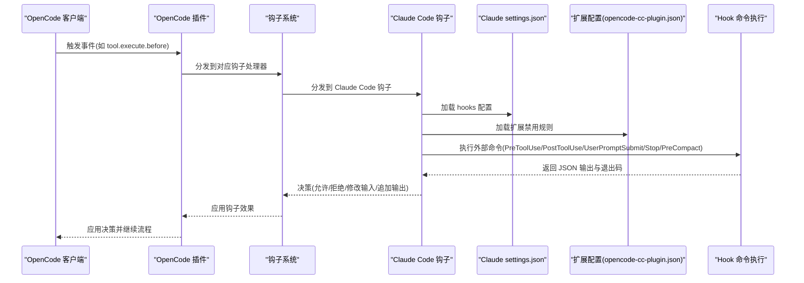

**图表来源**
- [src/hooks/claude-code-hooks/index.ts](file://src/hooks/claude-code-hooks/index.ts#L1-L402)
- [src/hooks/claude-code-hooks/config.ts](file://src/hooks/claude-code-hooks/config.ts#L1-L104)
- [src/hooks/claude-code-hooks/config-loader.ts](file://src/hooks/claude-code-hooks/config-loader.ts#L1-L108)
- [src/hooks/claude-code-hooks/pre-tool-use.ts](file://src/hooks/claude-code-hooks/pre-tool-use.ts#L1-L173)
- [src/hooks/claude-code-hooks/post-tool-use.ts](file://src/hooks/claude-code-hooks/post-tool-use.ts#L1-L200)
- [src/hooks/claude-code-hooks/user-prompt-submit.ts](file://src/hooks/claude-code-hooks/user-prompt-submit.ts#L1-L118)

## 详细组件分析

### 上下文监控钩子
- 功能要点
  - 在工具执行后查询会话消息，提取最后一条助手消息的输入令牌与缓存读取令牌之和。
  - 对比实际限制（可选 1M 或 200K），当超过阈值（70%）时向输出追加系统指令与上下文状态摘要。
  - 通过会话删除事件清理内存中的已提醒集合，避免重复提示。
- 关键实现位置
  - 工具执行后处理与阈值判断：[src/hooks/context-window-monitor.ts](file://src/hooks/context-window-monitor.ts#L36-L82)
  - 会话事件清理：[src/hooks/context-window-monitor.ts](file://src/hooks/context-window-monitor.ts#L84-L93)
- 配置与行为
  - 通过环境变量切换 1M 上下文显示限制与实际限制。
  - 提示文本与百分比计算在工具输出末尾追加。

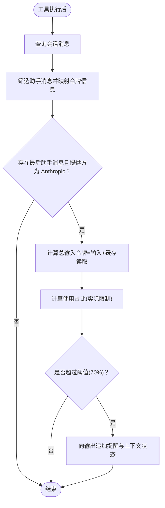

**图表来源**
- [src/hooks/context-window-monitor.ts](file://src/hooks/context-window-monitor.ts#L36-L82)

**章节来源**
- [src/hooks/context-window-monitor.ts](file://src/hooks/context-window-monitor.ts#L1-L100)

### 会话恢复钩子
- 功能要点
  - 检测错误类型（缺少工具结果、思考块顺序、禁用思考违规、空内容消息）。
  - 针对不同错误类型执行修复策略（注入工具结果、前置思考块、剥离思考块、填充占位文本）。
  - 支持实验性自动续写（在修复成功后自动发送一条继续任务的消息）。
  - 提供回调注册：中断开始/完成回调。
- 关键实现位置
  - 错误类型检测与路由：[src/hooks/session-recovery/index.ts](file://src/hooks/session-recovery/index.ts#L125-L149)
  - 修复策略（工具结果缺失/思考块顺序/禁用思考违规/空内容）：[src/hooks/session-recovery/index.ts](file://src/hooks/session-recovery/index.ts#L155-L307)
  - 自动续写与回调：[src/hooks/session-recovery/index.ts](file://src/hooks/session-recovery/index.ts#L394-L424)

**图表来源**
- [src/hooks/session-recovery/index.ts](file://src/hooks/session-recovery/index.ts#L125-L424)

**章节来源**
- [src/hooks/session-recovery/index.ts](file://src/hooks/session-recovery/index.ts#L1-L433)

### 自动更新检查钩子
- 功能要点
  - 在会话创建事件后延迟执行，区分本地开发模式与发布模式。
  - 解析 pinned 版本/通道（预发布/标签），获取最新版本并决定是否自动更新。
  - 通过 TUI 展示启动提示、更新可用提示、自动更新成功提示。
  - 失败时回退为仅通知。
- 关键实现位置
  - 事件监听与启动逻辑：[src/hooks/auto-update-checker/index.ts](file://src/hooks/auto-update-checker/index.ts#L63-L96)
  - 通道识别与版本解析：[src/hooks/auto-update-checker/index.ts](file://src/hooks/auto-update-checker/index.ts#L26-L44)
  - 后台检查与自动更新流程：[src/hooks/auto-update-checker/index.ts](file://src/hooks/auto-update-checker/index.ts#L99-L158)
  - Toast 展示与日志记录：[src/hooks/auto-update-checker/index.ts](file://src/hooks/auto-update-checker/index.ts#L190-L256)

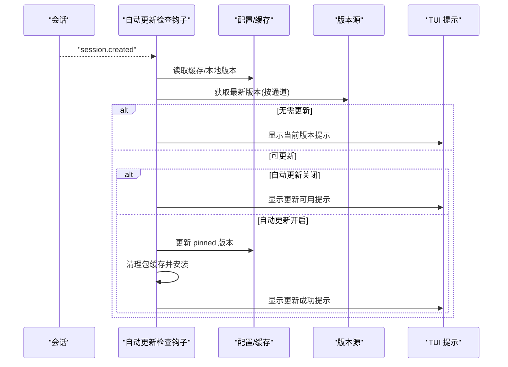

**图表来源**
- [src/hooks/auto-update-checker/index.ts](file://src/hooks/auto-update-checker/index.ts#L63-L158)

**章节来源**
- [src/hooks/auto-update-checker/index.ts](file://src/hooks/auto-update-checker/index.ts#L1-L261)

### Claude Code 钩子生态
- 事件桥接与状态管理
  - 统一暴露 OpenCode 插件事件，映射到 Claude Code 钩子概念（PreToolUse/PostToolUse/UserPromptSubmit/Stop/PreCompact）。
  - 维护会话中断/错误状态，避免在异常状态下执行某些钩子。
- 配置加载与禁用
  - 从 Claude settings.json 读取 hooks 配置，合并多路径配置。
  - 通过扩展配置 opencode-cc-plugin.json 提供按正则禁用具体命令的能力。
- 执行器
  - PreToolUse：在工具调用前执行，支持拒绝/询问/允许三种决策，可修改输入。
  - PostToolUse：在工具调用后执行，支持阻断、附加上下文、警告消息。
  - UserPromptSubmit：在用户提交提示时注入额外消息片段。
  - Stop：在会话空闲时根据状态决定是否阻断或注入提示。
  - PreCompact：在上下文压缩前注入额外上下文。

**图表来源**
- [src/hooks/claude-code-hooks/index.ts](file://src/hooks/claude-code-hooks/index.ts#L1-L402)
- [src/hooks/claude-code-hooks/pre-tool-use.ts](file://src/hooks/claude-code-hooks/pre-tool-use.ts#L1-L173)
- [src/hooks/claude-code-hooks/post-tool-use.ts](file://src/hooks/claude-code-hooks/post-tool-use.ts#L1-L200)
- [src/hooks/claude-code-hooks/user-prompt-submit.ts](file://src/hooks/claude-code-hooks/user-prompt-submit.ts#L1-L118)

**章节来源**
- [src/hooks/claude-code-hooks/index.ts](file://src/hooks/claude-code-hooks/index.ts#L1-L402)
- [src/hooks/claude-code-hooks/types.ts](file://src/hooks/claude-code-hooks/types.ts#L1-L205)
- [src/hooks/claude-code-hooks/config.ts](file://src/hooks/claude-code-hooks/config.ts#L1-L104)
- [src/hooks/claude-code-hooks/config-loader.ts](file://src/hooks/claude-code-hooks/config-loader.ts#L1-L108)
- [src/hooks/claude-code-hooks/pre-tool-use.ts](file://src/hooks/claude-code-hooks/pre-tool-use.ts#L1-L173)
- [src/hooks/claude-code-hooks/post-tool-use.ts](file://src/hooks/claude-code-hooks/post-tool-use.ts#L1-L200)
- [src/hooks/claude-code-hooks/user-prompt-submit.ts](file://src/hooks/claude-code-hooks/user-prompt-submit.ts#L1-L118)
- [src/hooks/claude-code-hooks/plugin-config.ts](file://src/hooks/claude-code-hooks/plugin-config.ts#L1-L13)

### 代理使用提醒钩子
- 功能要点
  - 跟踪用户在会话中是否使用了代理工具。
  - 如果用户没有使用代理工具而直接调用了目标工具，则在工具执行后注入提醒消息。
  - 管理会话状态的持久化和清理。
- 关键实现位置
  - 工具执行后处理：[src/hooks/agent-usage-reminder/index.ts](file://src/hooks/agent-usage-reminder/index.ts#L58-L84)
  - 事件处理器（会话删除/压缩）：[src/hooks/agent-usage-reminder/index.ts](file://src/hooks/agent-usage-reminder/index.ts#L86-L103)

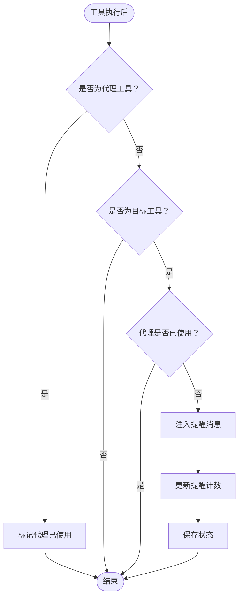

**图表来源**
- [src/hooks/agent-usage-reminder/index.ts](file://src/hooks/agent-usage-reminder/index.ts#L58-L84)

**章节来源**
- [src/hooks/agent-usage-reminder/index.ts](file://src/hooks/agent-usage-reminder/index.ts#L1-L110)

### 代理技能提醒钩子
- 功能要点
  - 当用户直接切换到具有默认技能的代理时，生成技能提醒内容。
  - 通过上下文收集器将提醒内容注入到会话中。
  - 避免在系统指令消息中注入提醒。
  - 管理会话级别的提醒状态。
- 关键实现位置
  - 代理技能提醒生成：[src/hooks/agent-skill-reminder/index.ts](file://src/hooks/agent-skill-reminder/index.ts#L85-L108)
  - 事件处理器（会话清理）：[src/hooks/agent-skill-reminder/index.ts](file://src/hooks/agent-skill-reminder/index.ts#L114-L137)

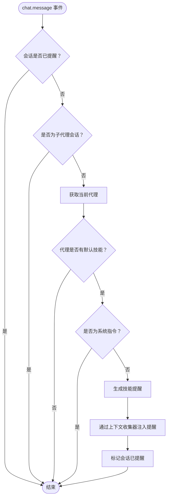

**图表来源**
- [src/hooks/agent-skill-reminder/index.ts](file://src/hooks/agent-skill-reminder/index.ts#L39-L108)

**章节来源**
- [src/hooks/agent-skill-reminder/index.ts](file://src/hooks/agent-skill-reminder/index.ts#L1-L140)

### 关键词检测钩子
- 功能要点
  - 检测用户提示中的关键词，自动激活相应的模式。
  - 过滤掉系统指令和背景任务会话中的关键词。
  - 根据关键词类型注入相应的上下文内容。
  - 显示 TUI 提示通知。
- 关键实现位置
  - 关键词检测与注入：[src/hooks/keyword-detector/index.ts](file://src/hooks/keyword-detector/index.ts#L25-L98)
  - 事件处理器（会话清理）：[src/hooks/keyword-detector/index.ts](file://src/hooks/keyword-detector/index.ts#L114-L137)

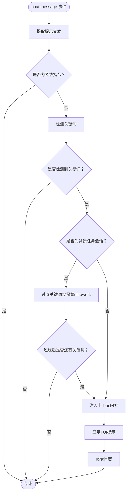

**图表来源**
- [src/hooks/keyword-detector/index.ts](file://src/hooks/keyword-detector/index.ts#L14-L98)

**章节来源**
- [src/hooks/keyword-detector/index.ts](file://src/hooks/keyword-detector/index.ts#L1-L101)

### 非交互环境保护钩子
- 功能要点
  - 检测在非交互环境中执行的交互式命令。
  - 对于被禁止的命令显示警告消息。
  - 为 git 命令自动添加非交互环境变量前缀。
- 关键实现位置
  - 工具执行前处理：[src/hooks/non-interactive-env/index.ts](file://src/hooks/non-interactive-env/index.ts#L25-L61)

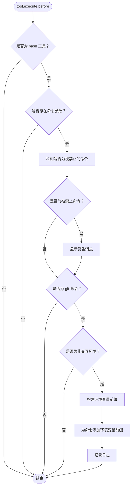

**图表来源**
- [src/hooks/non-interactive-env/index.ts](file://src/hooks/non-interactive-env/index.ts#L25-L61)

**章节来源**
- [src/hooks/non-interactive-env/index.ts](file://src/hooks/non-interactive-env/index.ts#L1-L64)

### 交互式 Bash 会话钩子
- 功能要点
  - 管理 tmux 会话的生命周期，跟踪活动会话。
  - 自动清理会话资源，包括 kill-server 和 kill-session 操作。
  - 为会话操作生成提醒消息。
  - 管理会话状态的持久化和清理。
- 关键实现位置
  - 工具执行后处理：[src/hooks/interactive-bash-session/index.ts](file://src/hooks/interactive-bash-session/index.ts#L183-L240)
  - 事件处理器（会话删除）：[src/hooks/interactive-bash-session/index.ts](file://src/hooks/interactive-bash-session/index.ts#L242-L256)

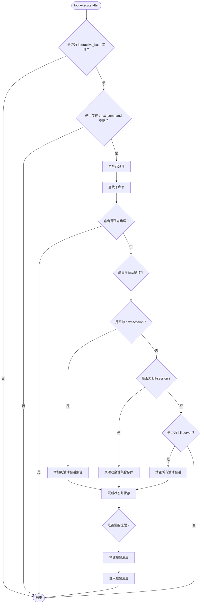

**图表来源**
- [src/hooks/interactive-bash-session/index.ts](file://src/hooks/interactive-bash-session/index.ts#L183-L240)

**章节来源**
- [src/hooks/interactive-bash-session/index.ts](file://src/hooks/interactive-bash-session/index.ts#L1-L263)

### 思维块验证器钩子
- 功能要点
  - 在消息转换为模型格式之前验证助手消息的结构。
  - 预防"期望 thinking/redacted_thinking 但发现 tool_use"错误。
  - 为没有思维块的助手消息自动添加思维块。
  - 支持扩展思维模型的检测。
- 关键实现位置
  - 消息转换处理：[src/hooks/thinking-block-validator/index.ts](file://src/hooks/thinking-block-validator/index.ts#L135-L170)

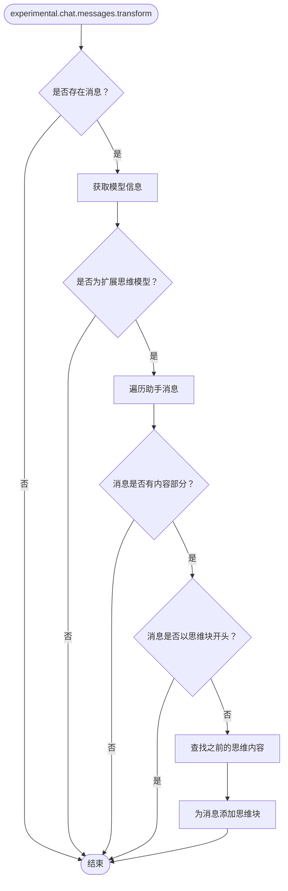

**图表来源**
- [src/hooks/thinking-block-validator/index.ts](file://src/hooks/thinking-block-validator/index.ts#L135-L170)

**章节来源**
- [src/hooks/thinking-block-validator/index.ts](file://src/hooks/thinking-block-validator/index.ts#L1-L172)

### Ralph 循环钩子
- 功能要点
  - 实现任务循环执行，确保完成承诺并自动推进。
  - 检测完成承诺的存在，自动清理循环状态。
  - 管理循环迭代次数和最大迭代限制。
  - 提供循环启动、取消和状态查询功能。
- 关键实现位置
  - 事件处理器（会话空闲）：[src/hooks/ralph-loop/index.ts](file://src/hooks/ralph-loop/index.ts#L195-L409)
  - 循环启动和管理：[src/hooks/ralph-loop/index.ts](file://src/hooks/ralph-loop/index.ts#L150-L193)

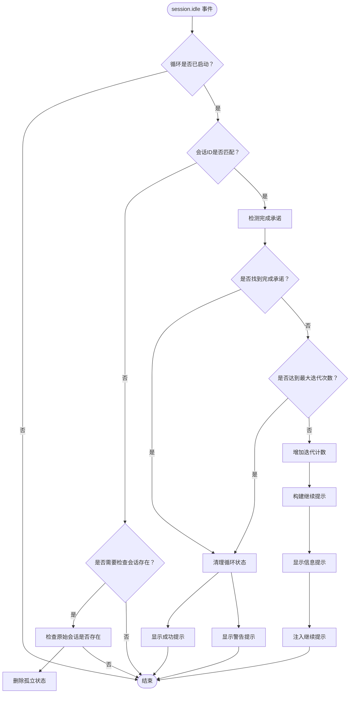

**图表来源**
- [src/hooks/ralph-loop/index.ts](file://src/hooks/ralph-loop/index.ts#L195-L409)

**章节来源**
- [src/hooks/ralph-loop/index.ts](file://src/hooks/ralph-loop/index.ts#L1-L418)

### 自动斜杠命令钩子
- 功能要点
  - 自动检测用户提示中的斜杠命令格式。
  - 执行对应的技能命令并替换消息内容。
  - 防止重复处理同一命令。
  - 支持技能加载和命令执行。
- 关键实现位置
  - 斜杠命令检测与执行：[src/hooks/auto-slash-command/index.ts](file://src/hooks/auto-slash-command/index.ts#L34-L87)

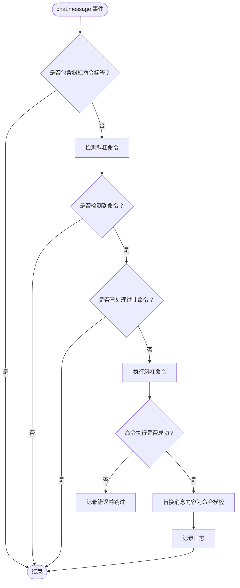

**图表来源**
- [src/hooks/auto-slash-command/index.ts](file://src/hooks/auto-slash-command/index.ts#L34-L87)

**章节来源**
- [src/hooks/auto-slash-command/index.ts](file://src/hooks/auto-slash-command/index.ts#L1-L90)

### 编辑错误恢复钩子
- 功能要点
  - 检测编辑工具的常见错误模式。
  - 注入紧急恢复提醒，强制立即纠正错误。
  - 提供明确的三步纠正指导。
- 关键实现位置
  - 工具执行后处理：[src/hooks/edit-error-recovery/index.ts](file://src/hooks/edit-error-recovery/index.ts#L41-L55)

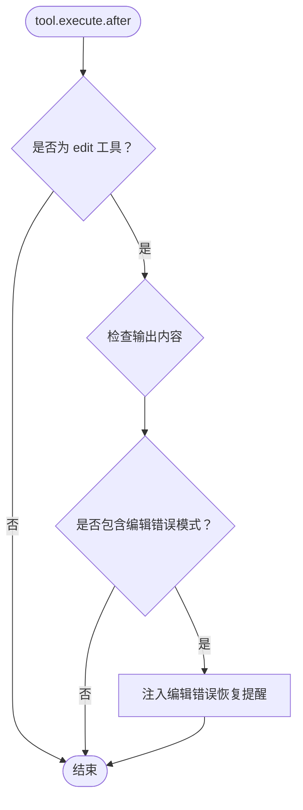

**图表来源**
- [src/hooks/edit-error-recovery/index.ts](file://src/hooks/edit-error-recovery/index.ts#L41-L55)

**章节来源**
- [src/hooks/edit-error-recovery/index.ts](file://src/hooks/edit-error-recovery/index.ts#L1-L58)

### Prometheus 只读保护钩子
- 功能要点
  - 限制 Prometheus 代理只能读取和生成规划文件。
  - 验证文件路径的安全性和合法性。
  - 拦截对非规划文件的写入操作。
  - 为任务工具注入只读警告。
- 关键实现位置
  - 文件路径验证：[src/hooks/prometheus-md-only/index.ts](file://src/hooks/prometheus-md-only/index.ts#L21-L49)
  - 工具执行前处理：[src/hooks/prometheus-md-only/index.ts](file://src/hooks/prometheus-md-only/index.ts#L79-L134)

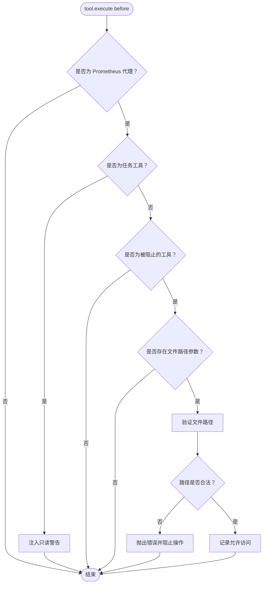

**图表来源**
- [src/hooks/prometheus-md-only/index.ts](file://src/hooks/prometheus-md-only/index.ts#L79-L134)

**章节来源**
- [src/hooks/prometheus-md-only/index.ts](file://src/hooks/prometheus-md-only/index.ts#L1-L137)

## 依赖关系分析
- 入口导出
  - hooks/index.ts 统一导出所有钩子工厂函数，便于上层按需启用。
- Claude Code 钩子内部依赖
  - 类型定义与事件枚举：types.ts
  - 配置加载：config.ts（读取 Claude settings.json）
  - 扩展配置与禁用规则：config-loader.ts（合并用户/项目配置）
  - 执行器：pre-tool-use.ts、post-tool-use.ts、user-prompt-submit.ts
  - 插件默认参数：plugin-config.ts
  - 禁用开关：shared/hook-disabled.ts
- 通用钩子依赖
  - 模式匹配：shared/pattern-matcher.ts
  - 会话状态管理：features/claude-code-session-state
  - 上下文注入：features/context-injector
- 事件桥接
  - claude-code-hooks/index.ts 将 OpenCode 插件事件映射到 Claude Code 钩子生命周期。

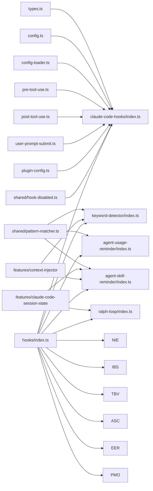

**图表来源**
- [src/hooks/index.ts](file://src/hooks/index.ts#L1-L73)
- [src/hooks/claude-code-hooks/types.ts](file://src/hooks/claude-code-hooks/types.ts#L1-L205)
- [src/hooks/claude-code-hooks/config.ts](file://src/hooks/claude-code-hooks/config.ts#L1-L104)
- [src/hooks/claude-code-hooks/config-loader.ts](file://src/hooks/claude-code-hooks/config-loader.ts#L1-L108)
- [src/hooks/claude-code-hooks/pre-tool-use.ts](file://src/hooks/claude-code-hooks/pre-tool-use.ts#L1-L173)
- [src/hooks/claude-code-hooks/post-tool-use.ts](file://src/hooks/claude-code-hooks/post-tool-use.ts#L1-L200)
- [src/hooks/claude-code-hooks/user-prompt-submit.ts](file://src/hooks/claude-code-hooks/user-prompt-submit.ts#L1-L118)
- [src/hooks/claude-code-hooks/plugin-config.ts](file://src/hooks/claude-code-hooks/plugin-config.ts#L1-L13)
- [src/shared/hook-disabled.ts](file://src/shared/hook-disabled.ts#L1-L23)
- [src/shared/pattern-matcher.ts](file://src/shared/pattern-matcher.ts#L1-L29)

**章节来源**
- [src/hooks/index.ts](file://src/hooks/index.ts#L1-L73)
- [src/shared/hook-disabled.ts](file://src/shared/hook-disabled.ts#L1-L23)
- [src/shared/pattern-matcher.ts](file://src/shared/pattern-matcher.ts#L1-L29)

## 性能考量
- Claude Code 钩子
  - 外部命令执行成本：每次钩子执行都会 spawn 外部命令，建议：
    - 使用最小化命令体积与依赖，避免复杂 shell 初始化。
    - 通过扩展配置按正则禁用不必要的命令，减少执行次数。
    - 合理设置超时与重试策略（由执行器负责），避免阻塞主流程。
- 新增钩子性能优化
  - 代理使用提醒和代理技能提醒：使用内存状态存储，避免频繁文件 I/O。
  - 关键词检测：使用缓存的正则表达式，避免重复编译。
  - 非交互环境保护：预先编译禁止命令的正则表达式。
  - 交互式 Bash 会话：使用内存状态跟踪会话，定期清理过期状态。
  - 思维块验证器：只在扩展思维模型时进行验证，避免不必要的处理。
  - Ralph 循环：使用状态文件持久化，避免重复计算。
  - 自动斜杠命令：使用会话级别的去重集合，防止重复处理。
  - 编辑错误恢复：简单的字符串匹配，性能开销极小。
  - Prometheus 只读保护：路径验证使用绝对路径解析，避免路径遍历攻击。
- 会话恢复
  - 修复操作涉及多次 API 查询与消息遍历，建议：
      - 仅在出现可识别错误时触发，避免无谓扫描。
      - 实验性自动续写仅在修复成功后触发，降低额外请求。
- 上下文监控
  - 仅在工具执行后触发一次查询，成本较低；阈值控制避免频繁提示。
- 自动更新检查
  - 异步执行，延迟 0ms 启动，避免阻塞首次交互。
  - 本地开发模式跳过网络请求，仅展示提示。

## 故障排除指南
- Claude Code 钩子未生效
  - 检查插件配置：确认插件参数中传入了 Claude Code 钩子工厂函数。
  - 检查禁用规则：扩展配置中是否存在针对该事件的正则禁用项。
  - 检查命令返回码与输出：PreToolUse/PostToolUse 的退出码与 JSON 输出决定是否允许/阻断/修改。
- 新增钩子问题排查
  - 代理使用提醒：检查代理工具列表和目标工具列表配置。
  - 代理技能提醒：确认代理默认技能配置和会话状态管理。
  - 关键词检测：验证关键词检测器配置和上下文收集器设置。
  - 非交互环境保护：检查禁止命令列表和 shell 检测逻辑。
  - 交互式 Bash 会话：确认 tmux 命令解析和会话状态持久化。
  - 思维块验证器：检查模型检测逻辑和消息结构验证。
  - Ralph 循环：验证循环状态文件和完成承诺检测。
  - 自动斜杠命令：检查命令检测器和技能加载配置。
  - 编辑错误恢复：确认错误模式匹配和提醒注入。
  - Prometheus 只读保护：验证文件路径安全检查和工具拦截。
- 会话恢复失败
  - 查看错误类型检测是否正确（工具结果缺失/思考块顺序/禁用思考违规/空内容）。
  - 确认会话消息 ID 是否匹配，修复策略是否成功写入。
  - 如启用自动续写，确认最后一条用户消息是否存在。
- 上下文监控无提示
  - 确认最后助手消息提供方为 Anthropic，且存在令牌统计。
  - 检查阈值与显示限制配置（环境变量）。
- 自动更新检查无响应
  - 确认会话创建事件是否触发。
  - 检查通道识别与版本解析是否成功。
  - 若自动更新失败，查看安装日志并回退为通知。

**章节来源**
- [src/hooks/claude-code-hooks/config-loader.ts](file://src/hooks/claude-code-hooks/config-loader.ts#L93-L107)
- [src/hooks/claude-code-hooks/pre-tool-use.ts](file://src/hooks/claude-code-hooks/pre-tool-use.ts#L96-L116)
- [src/hooks/claude-code-hooks/post-tool-use.ts](file://src/hooks/claude-code-hooks/post-tool-use.ts#L124-L142)
- [src/hooks/session-recovery/index.ts](file://src/hooks/session-recovery/index.ts#L125-L149)
- [src/hooks/context-window-monitor.ts](file://src/hooks/context-window-monitor.ts#L65-L78)
- [src/hooks/auto-update-checker/index.ts](file://src/hooks/auto-update-checker/index.ts#L104-L158)
- [src/hooks/agent-usage-reminder/index.ts](file://src/hooks/agent-usage-reminder/index.ts#L58-L84)
- [src/hooks/agent-skill-reminder/index.ts](file://src/hooks/agent-skill-reminder/index.ts#L85-L108)
- [src/hooks/keyword-detector/index.ts](file://src/hooks/keyword-detector/index.ts#L25-L98)
- [src/hooks/non-interactive-env/index.ts](file://src/hooks/non-interactive-env/index.ts#L25-L61)
- [src/hooks/interactive-bash-session/index.ts](file://src/hooks/interactive-bash-session/index.ts#L183-L240)
- [src/hooks/thinking-block-validator/index.ts](file://src/hooks/thinking-block-validator/index.ts#L135-L170)
- [src/hooks/ralph-loop/index.ts](file://src/hooks/ralph-loop/index.ts#L195-L409)
- [src/hooks/auto-slash-command/index.ts](file://src/hooks/auto-slash-command/index.ts#L34-L87)
- [src/hooks/edit-error-recovery/index.ts](file://src/hooks/edit-error-recovery/index.ts#L41-L55)
- [src/hooks/prometheus-md-only/index.ts](file://src/hooks/prometheus-md-only/index.ts#L79-L134)

## 结论
Oh My OpenCode 的钩子体系以"事件桥接 + 配置驱动 + 外部命令扩展"的方式，实现了对 Claude Code 生命周期的细粒度控制与增强。通过合理的禁用策略、阈值控制与异步执行，既能保证安全性与可控性，又能尽量降低对用户体验的影响。

**更新** 新增的12个激活钩子进一步增强了系统的智能化和自动化能力，包括代理使用监控、关键词驱动的模式切换、非交互环境保护、会话生命周期管理、思维结构验证、循环执行控制、命令自动化、错误恢复和权限保护等。这些钩子通过统一的配置接口和执行机制，为不同的使用场景提供了灵活的解决方案。

建议在生产环境中结合业务场景按需启用，并持续关注外部命令的执行成本与稳定性。对于高频使用的钩子，建议优化其性能表现，对于关键业务钩子，建议加强错误处理和监控告警。

## 附录：钩子配置示例与最佳实践
- 启用/禁用钩子
  - 在插件参数中传入 Claude Code 钩子工厂函数，并通过插件配置对象控制禁用范围。
  - 禁用开关支持：
    - 全局禁用：布尔 true
    - 指定事件禁用：字符串数组
  - 示例参考：
    - 禁用开关判定逻辑：[src/shared/hook-disabled.ts](file://src/shared/hook-disabled.ts#L3-L22)
- Claude settings.json 配置
  - hooks 字段支持多个事件类型，每个事件可配置匹配器与命令列表。
  - 匹配器支持 pattern/matcher 字段，最终统一归一化为 matcher。
  - 示例参考：
    - 配置加载与合并：[src/hooks/claude-code-hooks/config.ts](file://src/hooks/claude-code-hooks/config.ts#L81-L103)
- 扩展配置（opencode-cc-plugin.json）
  - 支持 disabledHooks，按事件类型提供正则列表，命中即禁用对应命令。
  - 用户配置与项目配置合并，后者覆盖前者。
  - 示例参考：
    - 配置加载与合并：[src/hooks/claude-code-hooks/config-loader.ts](file://src/hooks/claude-code-hooks/config-loader.ts#L55-L74)
    - 正则匹配禁用：[src/hooks/claude-code-hooks/config-loader.ts](file://src/hooks/claude-code-hooks/config-loader.ts#L93-L107)
- 执行时机与优先级
  - Claude Code 钩子事件顺序（从 OpenCode 插件角度）：
    - experimental.session.compacting（预压缩上下文注入）
    - chat.message（用户提示提交）
    - tool.execute.before（工具调用前）
    - tool.execute.after（工具调用后）
    - event（session.error/session.deleted/session.idle 等）
  - 新增钩子的执行时机：
    - 代理相关钩子：在工具执行前后触发
    - 关键词检测钩子：在 chat.message 事件中触发
    - 非交互环境钩子：在 tool.execute.before 事件中触发
    - 交互式 Bash 钩子：在 tool.execute.after 事件中触发
    - 思维块验证器：在 experimental.chat.messages.transform 事件中触发
    - Ralph 循环钩子：在 session.idle 事件中触发
    - 自动斜杠命令钩子：在 chat.message 事件中触发
    - 编辑错误恢复钩子：在 tool.execute.after 事件中触发
    - Prometheus 只读保护钩子：在 tool.execute.before 事件中触发
  - 示例参考：
    - 事件桥接与状态维护：[src/hooks/claude-code-hooks/index.ts](file://src/hooks/claude-code-hooks/index.ts#L42-L399)
- 性能优化建议
  - 减少外部命令数量与复杂度，优先使用轻量脚本。
  - 使用扩展配置按正则批量禁用非关键命令。
  - 将高开销钩子（如需要构建完整对话转录）仅在必要时启用。
  - 对自动更新检查与上下文监控采用异步与阈值控制，避免阻塞主流程。
  - 新增钩子优化：
    - 使用内存状态存储替代频繁的文件 I/O
    - 缓存正则表达式和模式匹配结果
    - 预编译常用的正则表达式
    - 实施会话级别的去重机制
    - 仅在必要时进行路径验证和文件检查
- 实战示例（步骤说明）
  - 在插件初始化时调用相应工厂函数创建钩子实例，并传入插件上下文。
  - 在 Claude settings.json 中为特定事件配置匹配器与命令。
  - 在用户/项目配置中添加 disabledHooks，按需禁用指定命令。
  - 通过 TUI 与日志观察钩子执行效果，逐步调整配置。
  - 对于新增钩子，根据具体需求配置相应的参数和行为。
  - 监控钩子的性能指标，及时调整配置以优化执行效率。

**章节来源**
- [src/shared/hook-disabled.ts](file://src/shared/hook-disabled.ts#L1-L23)
- [src/hooks/claude-code-hooks/config.ts](file://src/hooks/claude-code-hooks/config.ts#L1-L104)
- [src/hooks/claude-code-hooks/config-loader.ts](file://src/hooks/claude-code-hooks/config-loader.ts#L1-L108)
- [src/hooks/claude-code-hooks/index.ts](file://src/hooks/claude-code-hooks/index.ts#L1-L402)
- [src/shared/pattern-matcher.ts](file://src/shared/pattern-matcher.ts#L1-L29)