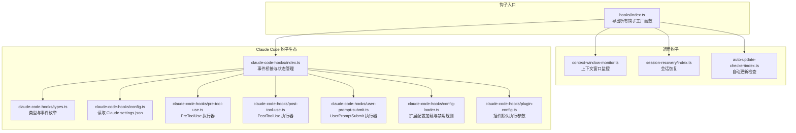
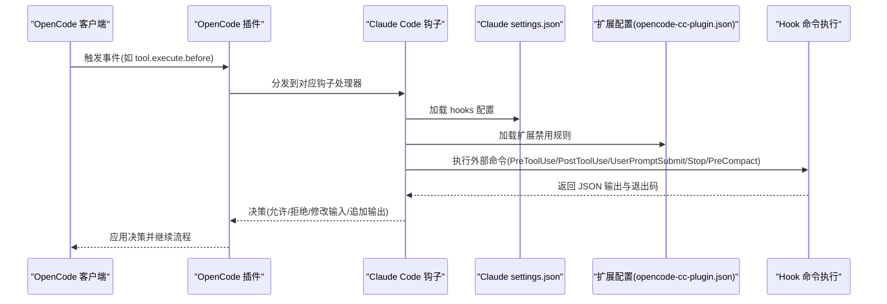
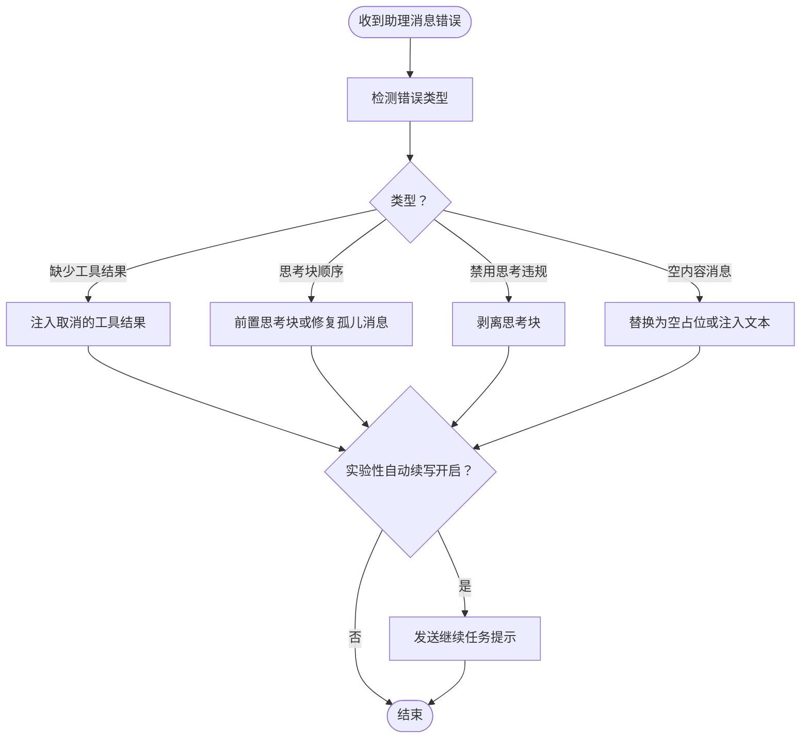
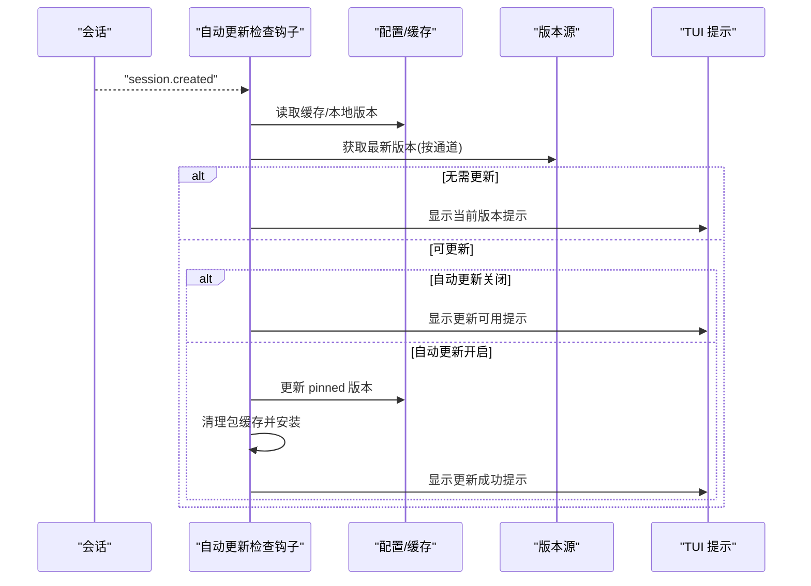
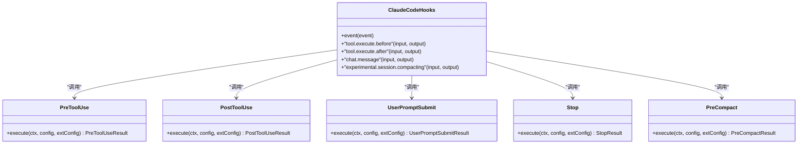
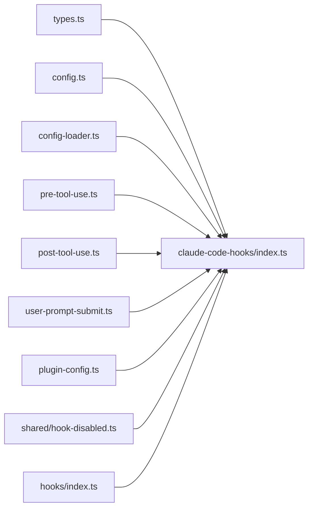

# 钩子配置

<cite>
**本文引用的文件**
- [src/hooks/index.ts](file://src/hooks/index.ts)
- [src/hooks/context-window-monitor.ts](file://src/hooks/context-window-monitor.ts)
- [src/hooks/session-recovery/index.ts](file://src/hooks/session-recovery/index.ts)
- [src/hooks/auto-update-checker/index.ts](file://src/hooks/auto-update-checker/index.ts)
- [src/hooks/claude-code-hooks/index.ts](file://src/hooks/claude-code-hooks/index.ts)
- [src/hooks/claude-code-hooks/types.ts](file://src/hooks/claude-code-hooks/types.ts)
- [src/hooks/claude-code-hooks/config.ts](file://src/hooks/claude-code-hooks/config.ts)
- [src/hooks/claude-code-hooks/pre-tool-use.ts](file://src/hooks/claude-code-hooks/pre-tool-use.ts)
- [src/hooks/claude-code-hooks/post-tool-use.ts](file://src/hooks/claude-code-hooks/post-tool-use.ts)
- [src/hooks/claude-code-hooks/user-prompt-submit.ts](file://src/hooks/claude-code-hooks/user-prompt-submit.ts)
- [src/hooks/claude-code-hooks/config-loader.ts](file://src/hooks/claude-code-hooks/config-loader.ts)
- [src/hooks/claude-code-hooks/plugin-config.ts](file://src/hooks/claude-code-hooks/plugin-config.ts)
- [src/shared/hook-disabled.ts](file://src/shared/hook-disabled.ts)
</cite>

## 目录
1. [简介](#简介)
2. [项目结构](#项目结构)
3. [核心组件](#核心组件)
4. [架构总览](#架构总览)
5. [详细组件分析](#详细组件分析)
6. [依赖关系分析](#依赖关系分析)
7. [性能考量](#性能考量)
8. [故障排除指南](#故障排除指南)
9. [结论](#结论)
10. [附录：钩子配置示例与最佳实践](#附录钩子配置示例与最佳实践)

## 简介
本文件系统性梳理 Oh My OpenCode 的钩子体系，覆盖上下文监控、会话恢复、自动更新检查、Claude Code 钩子生态（预工具调用、后工具调用、用户提示提交、停止时机、预压缩注入）等能力。文档重点说明：
- 可用钩子类型与功能边界
- 启用/禁用机制与配置项
- 执行时机与优先级策略
- 性能影响与优化建议
- 故障排除与调试方法
- 实战示例与最佳实践

## 项目结构
钩子模块集中于 src/hooks 下，按功能拆分独立目录；Claude Code 钩子生态位于 src/hooks/claude-code-hooks，配套类型、配置加载与执行器。

**图表来源**
- [src/hooks/index.ts](file://src/hooks/index.ts#L1-L48)
- [src/hooks/context-window-monitor.ts](file://src/hooks/context-window-monitor.ts#L1-L100)
- [src/hooks/session-recovery/index.ts](file://src/hooks/session-recovery/index.ts#L1-L433)
- [src/hooks/auto-update-checker/index.ts](file://src/hooks/auto-update-checker/index.ts#L1-L261)
- [src/hooks/claude-code-hooks/index.ts](file://src/hooks/claude-code-hooks/index.ts#L1-L402)
- [src/hooks/claude-code-hooks/types.ts](file://src/hooks/claude-code-hooks/types.ts#L1-L205)
- [src/hooks/claude-code-hooks/config.ts](file://src/hooks/claude-code-hooks/config.ts#L1-L104)
- [src/hooks/claude-code-hooks/pre-tool-use.ts](file://src/hooks/claude-code-hooks/pre-tool-use.ts#L1-L173)
- [src/hooks/claude-code-hooks/post-tool-use.ts](file://src/hooks/claude-code-hooks/post-tool-use.ts#L1-L200)
- [src/hooks/claude-code-hooks/user-prompt-submit.ts](file://src/hooks/claude-code-hooks/user-prompt-submit.ts#L1-L118)
- [src/hooks/claude-code-hooks/config-loader.ts](file://src/hooks/claude-code-hooks/config-loader.ts#L1-L108)
- [src/hooks/claude-code-hooks/plugin-config.ts](file://src/hooks/claude-code-hooks/plugin-config.ts#L1-L13)

**章节来源**
- [src/hooks/index.ts](file://src/hooks/index.ts#L1-L48)

## 核心组件
- 上下文窗口监控：在工具执行后根据最后一条助手消息的输入令牌使用量，计算占比并在阈值触发时注入提醒。
- 会话恢复：检测并修复“缺少工具结果”“思考块顺序错误”“禁用思考违规”等错误，必要时自动续写或中断后恢复。
- 自动更新检查：在会话创建后异步检查最新版本，支持本地开发模式、通道识别、自动安装与通知。
- Claude Code 钩子：统一桥接 Claude Code 事件到 OpenCode 插件事件，支持 PreToolUse/PostToolUse/UserPromptSubmit/Stop/PreCompact，并可从 Claude settings.json 与扩展配置中加载规则与禁用列表。

**章节来源**
- [src/hooks/context-window-monitor.ts](file://src/hooks/context-window-monitor.ts#L1-L100)
- [src/hooks/session-recovery/index.ts](file://src/hooks/session-recovery/index.ts#L1-L433)
- [src/hooks/auto-update-checker/index.ts](file://src/hooks/auto-update-checker/index.ts#L1-L261)
- [src/hooks/claude-code-hooks/index.ts](file://src/hooks/claude-code-hooks/index.ts#L1-L402)

## 架构总览
下图展示 Claude Code 钩子在 OpenCode 中的事件桥接与执行链路。

**图表来源**
- [src/hooks/claude-code-hooks/index.ts](file://src/hooks/claude-code-hooks/index.ts#L1-L402)
- [src/hooks/claude-code-hooks/config.ts](file://src/hooks/claude-code-hooks/config.ts#L1-L104)
- [src/hooks/claude-code-hooks/config-loader.ts](file://src/hooks/claude-code-hooks/config-loader.ts#L1-L108)
- [src/hooks/claude-code-hooks/pre-tool-use.ts](file://src/hooks/claude-code-hooks/pre-tool-use.ts#L1-L173)
- [src/hooks/claude-code-hooks/post-tool-use.ts](file://src/hooks/claude-code-hooks/post-tool-use.ts#L1-L200)
- [src/hooks/claude-code-hooks/user-prompt-submit.ts](file://src/hooks/claude-code-hooks/user-prompt-submit.ts#L1-L118)

## 详细组件分析

### 上下文监控钩子
- 功能要点
  - 在工具执行后查询会话消息，提取最后一条助手消息的输入令牌与缓存读取令牌之和。
  - 对比实际限制（可选 1M 或 200K），当超过阈值（70%）时向输出追加系统指令与上下文状态摘要。
  - 通过会话删除事件清理内存中的已提醒集合，避免重复提示。
- 关键实现位置
  - 工具执行后处理与阈值判断：[src/hooks/context-window-monitor.ts](file://src/hooks/context-window-monitor.ts#L36-L82)
  - 会话事件清理：[src/hooks/context-window-monitor.ts](file://src/hooks/context-window-monitor.ts#L84-L93)
- 配置与行为
  - 通过环境变量切换 1M 上下文显示限制与实际限制。
  - 提示文本与百分比计算在工具输出末尾追加。

**图表来源**
- [src/hooks/context-window-monitor.ts](file://src/hooks/context-window-monitor.ts#L36-L82)

**章节来源**
- [src/hooks/context-window-monitor.ts](file://src/hooks/context-window-monitor.ts#L1-L100)

### 会话恢复钩子
- 功能要点
  - 检测错误类型（缺少工具结果、思考块顺序、禁用思考违规、空内容消息）。
  - 针对不同错误类型执行修复策略（注入工具结果、前置思考块、剥离思考块、填充占位文本）。
  - 支持实验性自动续写（在修复成功后自动发送一条继续任务的消息）。
  - 提供回调注册：中断开始/完成回调。
- 关键实现位置
  - 错误类型检测与路由：[src/hooks/session-recovery/index.ts](file://src/hooks/session-recovery/index.ts#L125-L149)
  - 修复策略（工具结果缺失/思考块顺序/禁用思考违规/空内容）：[src/hooks/session-recovery/index.ts](file://src/hooks/session-recovery/index.ts#L155-L307)
  - 自动续写与回调：[src/hooks/session-recovery/index.ts](file://src/hooks/session-recovery/index.ts#L394-L424)

**图表来源**
- [src/hooks/session-recovery/index.ts](file://src/hooks/session-recovery/index.ts#L125-L424)

**章节来源**
- [src/hooks/session-recovery/index.ts](file://src/hooks/session-recovery/index.ts#L1-L433)

### 自动更新检查钩子
- 功能要点
  - 在会话创建事件后延迟执行，区分本地开发模式与发布模式。
  - 解析 pinned 版本/通道（预发布/标签），获取最新版本并决定是否自动更新。
  - 通过 TUI 展示启动提示、更新可用提示、自动更新成功提示。
  - 失败时回退为仅通知。
- 关键实现位置
  - 事件监听与启动逻辑：[src/hooks/auto-update-checker/index.ts](file://src/hooks/auto-update-checker/index.ts#L63-L96)
  - 通道识别与版本解析：[src/hooks/auto-update-checker/index.ts](file://src/hooks/auto-update-checker/index.ts#L26-L44)
  - 后台检查与自动更新流程：[src/hooks/auto-update-checker/index.ts](file://src/hooks/auto-update-checker/index.ts#L99-L158)
  - Toast 展示与日志记录：[src/hooks/auto-update-checker/index.ts](file://src/hooks/auto-update-checker/index.ts#L190-L256)

**图表来源**
- [src/hooks/auto-update-checker/index.ts](file://src/hooks/auto-update-checker/index.ts#L63-L158)

**章节来源**
- [src/hooks/auto-update-checker/index.ts](file://src/hooks/auto-update-checker/index.ts#L1-L261)

### Claude Code 钩子生态
- 事件桥接与状态管理
  - 统一暴露 OpenCode 插件事件，映射到 Claude Code 钩子概念（PreToolUse/PostToolUse/UserPromptSubmit/Stop/PreCompact）。
  - 维护会话中断/错误状态，避免在异常状态下执行某些钩子。
- 配置加载与禁用
  - 从 Claude settings.json 读取 hooks 配置，合并多路径配置。
  - 通过扩展配置 opencode-cc-plugin.json 提供按正则禁用具体命令的能力。
- 执行器
  - PreToolUse：在工具调用前执行，支持拒绝/询问/允许三种决策，可修改输入。
  - PostToolUse：在工具调用后执行，支持阻断、附加上下文、警告消息。
  - UserPromptSubmit：在用户提交提示时注入额外消息片段。
  - Stop：在会话空闲时根据状态决定是否阻断或注入提示。
  - PreCompact：在上下文压缩前注入额外上下文。

**图表来源**
- [src/hooks/claude-code-hooks/index.ts](file://src/hooks/claude-code-hooks/index.ts#L1-L402)
- [src/hooks/claude-code-hooks/pre-tool-use.ts](file://src/hooks/claude-code-hooks/pre-tool-use.ts#L1-L173)
- [src/hooks/claude-code-hooks/post-tool-use.ts](file://src/hooks/claude-code-hooks/post-tool-use.ts#L1-L200)
- [src/hooks/claude-code-hooks/user-prompt-submit.ts](file://src/hooks/claude-code-hooks/user-prompt-submit.ts#L1-L118)

**章节来源**
- [src/hooks/claude-code-hooks/index.ts](file://src/hooks/claude-code-hooks/index.ts#L1-L402)
- [src/hooks/claude-code-hooks/types.ts](file://src/hooks/claude-code-hooks/types.ts#L1-L205)
- [src/hooks/claude-code-hooks/config.ts](file://src/hooks/claude-code-hooks/config.ts#L1-L104)
- [src/hooks/claude-code-hooks/config-loader.ts](file://src/hooks/claude-code-hooks/config-loader.ts#L1-L108)
- [src/hooks/claude-code-hooks/pre-tool-use.ts](file://src/hooks/claude-code-hooks/pre-tool-use.ts#L1-L173)
- [src/hooks/claude-code-hooks/post-tool-use.ts](file://src/hooks/claude-code-hooks/post-tool-use.ts#L1-L200)
- [src/hooks/claude-code-hooks/user-prompt-submit.ts](file://src/hooks/claude-code-hooks/user-prompt-submit.ts#L1-L118)
- [src/hooks/claude-code-hooks/plugin-config.ts](file://src/hooks/claude-code-hooks/plugin-config.ts#L1-L13)

## 依赖关系分析
- 入口导出
  - hooks/index.ts 统一导出所有钩子工厂函数，便于上层按需启用。
- Claude Code 钩子内部依赖
  - 类型定义与事件枚举：types.ts
  - 配置加载：config.ts（读取 Claude settings.json）
  - 扩展配置与禁用规则：config-loader.ts（合并用户/项目配置）
  - 执行器：pre-tool-use.ts、post-tool-use.ts、user-prompt-submit.ts
  - 插件默认参数：plugin-config.ts
  - 禁用开关：shared/hook-disabled.ts
- 事件桥接
  - claude-code-hooks/index.ts 将 OpenCode 插件事件映射到 Claude Code 钩子生命周期。

**图表来源**
- [src/hooks/index.ts](file://src/hooks/index.ts#L1-L48)
- [src/hooks/claude-code-hooks/types.ts](file://src/hooks/claude-code-hooks/types.ts#L1-L205)
- [src/hooks/claude-code-hooks/config.ts](file://src/hooks/claude-code-hooks/config.ts#L1-L104)
- [src/hooks/claude-code-hooks/config-loader.ts](file://src/hooks/claude-code-hooks/config-loader.ts#L1-L108)
- [src/hooks/claude-code-hooks/pre-tool-use.ts](file://src/hooks/claude-code-hooks/pre-tool-use.ts#L1-L173)
- [src/hooks/claude-code-hooks/post-tool-use.ts](file://src/hooks/claude-code-hooks/post-tool-use.ts#L1-L200)
- [src/hooks/claude-code-hooks/user-prompt-submit.ts](file://src/hooks/claude-code-hooks/user-prompt-submit.ts#L1-L118)
- [src/hooks/claude-code-hooks/plugin-config.ts](file://src/hooks/claude-code-hooks/plugin-config.ts#L1-L13)
- [src/shared/hook-disabled.ts](file://src/shared/hook-disabled.ts#L1-L23)

**章节来源**
- [src/hooks/index.ts](file://src/hooks/index.ts#L1-L48)
- [src/shared/hook-disabled.ts](file://src/shared/hook-disabled.ts#L1-L23)

## 性能考量
- Claude Code 钩子
  - 外部命令执行成本：每次钩子执行都会 spawn 外部命令，建议：
    - 使用最小化命令体积与依赖，避免复杂 shell 初始化。
    - 通过扩展配置按正则禁用不必要的命令，减少执行次数。
    - 合理设置超时与重试策略（由执行器负责），避免阻塞主流程。
  - 会话恢复
    - 修复操作涉及多次 API 查询与消息遍历，建议：
      - 仅在出现可识别错误时触发，避免无谓扫描。
      - 实验性自动续写仅在修复成功后触发，降低额外请求。
  - 上下文监控
    - 仅在工具执行后触发一次查询，成本较低；阈值控制避免频繁提示。
  - 自动更新检查
    - 异步执行，延迟 0ms 启动，避免阻塞首次交互。
    - 本地开发模式跳过网络请求，仅展示提示。

[本节为通用性能建议，不直接分析具体文件]

## 故障排除指南
- Claude Code 钩子未生效
  - 检查插件配置：确认插件参数中传入了 Claude Code 钩子工厂函数。
  - 检查禁用规则：扩展配置中是否存在针对该事件的正则禁用项。
  - 检查命令返回码与输出：PreToolUse/PostToolUse 的退出码与 JSON 输出决定是否允许/阻断/修改。
- 会话恢复失败
  - 查看错误类型检测是否正确（工具结果缺失/思考块顺序/禁用思考违规/空内容）。
  - 确认会话消息 ID 是否匹配，修复策略是否成功写入。
  - 如启用自动续写，确认最后一条用户消息是否存在。
- 上下文监控无提示
  - 确认最后助手消息提供方为 Anthropic，且存在令牌统计。
  - 检查阈值与显示限制配置（环境变量）。
- 自动更新检查无响应
  - 确认会话创建事件是否触发。
  - 检查通道识别与版本解析是否成功。
  - 若自动更新失败，查看安装日志并回退为通知。

**章节来源**
- [src/hooks/claude-code-hooks/config-loader.ts](file://src/hooks/claude-code-hooks/config-loader.ts#L93-L107)
- [src/hooks/claude-code-hooks/pre-tool-use.ts](file://src/hooks/claude-code-hooks/pre-tool-use.ts#L96-L116)
- [src/hooks/claude-code-hooks/post-tool-use.ts](file://src/hooks/claude-code-hooks/post-tool-use.ts#L124-L142)
- [src/hooks/session-recovery/index.ts](file://src/hooks/session-recovery/index.ts#L125-L149)
- [src/hooks/context-window-monitor.ts](file://src/hooks/context-window-monitor.ts#L65-L78)
- [src/hooks/auto-update-checker/index.ts](file://src/hooks/auto-update-checker/index.ts#L104-L158)

## 结论
Oh My OpenCode 的钩子体系以“事件桥接 + 配置驱动 + 外部命令扩展”的方式，实现了对 Claude Code 生命周期的细粒度控制与增强。通过合理的禁用策略、阈值控制与异步执行，既能保证安全性与可控性，又能尽量降低对用户体验的影响。建议在生产环境中结合业务场景按需启用，并持续关注外部命令的执行成本与稳定性。

[本节为总结性内容，不直接分析具体文件]

## 附录：钩子配置示例与最佳实践
- 启用/禁用钩子
  - 在插件参数中传入 Claude Code 钩子工厂函数，并通过插件配置对象控制禁用范围。
  - 禁用开关支持：
    - 全局禁用：布尔 true
    - 指定事件禁用：字符串数组
  - 示例参考：
    - 禁用开关判定逻辑：[src/shared/hook-disabled.ts](file://src/shared/hook-disabled.ts#L3-L22)
- Claude settings.json 配置
  - hooks 字段支持多个事件类型，每个事件可配置匹配器与命令列表。
  - 匹配器支持 pattern/matcher 字段，最终统一归一化为 matcher。
  - 示例参考：
    - 配置加载与合并：[src/hooks/claude-code-hooks/config.ts](file://src/hooks/claude-code-hooks/config.ts#L81-L103)
- 扩展配置（opencode-cc-plugin.json）
  - 支持 disabledHooks，按事件类型提供正则列表，命中即禁用对应命令。
  - 用户配置与项目配置合并，后者覆盖前者。
  - 示例参考：
    - 配置加载与合并：[src/hooks/claude-code-hooks/config-loader.ts](file://src/hooks/claude-code-hooks/config-loader.ts#L55-L74)
    - 正则匹配禁用：[src/hooks/claude-code-hooks/config-loader.ts](file://src/hooks/claude-code-hooks/config-loader.ts#L93-L107)
- 执行时机与优先级
  - Claude Code 钩子事件顺序（从 OpenCode 插件角度）：
    - experimental.session.compacting（预压缩上下文注入）
    - chat.message（用户提示提交）
    - tool.execute.before（工具调用前）
    - tool.execute.after（工具调用后）
    - event（session.error/session.deleted/session.idle 等）
  - 示例参考：
    - 事件桥接与状态维护：[src/hooks/claude-code-hooks/index.ts](file://src/hooks/claude-code-hooks/index.ts#L42-L399)
- 性能优化建议
  - 减少外部命令数量与复杂度，优先使用轻量脚本。
  - 使用扩展配置按正则批量禁用非关键命令。
  - 将高开销钩子（如需要构建完整对话转录）仅在必要时启用。
  - 对自动更新检查与上下文监控采用异步与阈值控制，避免阻塞主流程。
- 实战示例（步骤说明）
  - 在插件初始化时调用相应工厂函数创建钩子实例，并传入插件上下文。
  - 在 Claude settings.json 中为特定事件配置匹配器与命令。
  - 在用户/项目配置中添加 disabledHooks，按需禁用指定命令。
  - 通过 TUI 与日志观察钩子执行效果，逐步调整配置。

**章节来源**
- [src/shared/hook-disabled.ts](file://src/shared/hook-disabled.ts#L1-L23)
- [src/hooks/claude-code-hooks/config.ts](file://src/hooks/claude-code-hooks/config.ts#L1-L104)
- [src/hooks/claude-code-hooks/config-loader.ts](file://src/hooks/claude-code-hooks/config-loader.ts#L1-L108)
- [src/hooks/claude-code-hooks/index.ts](file://src/hooks/claude-code-hooks/index.ts#L1-L402)