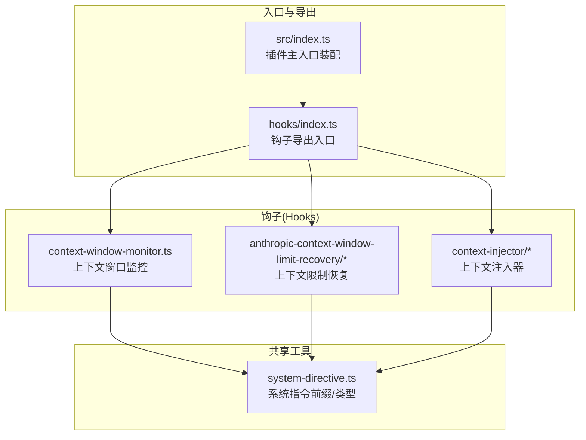
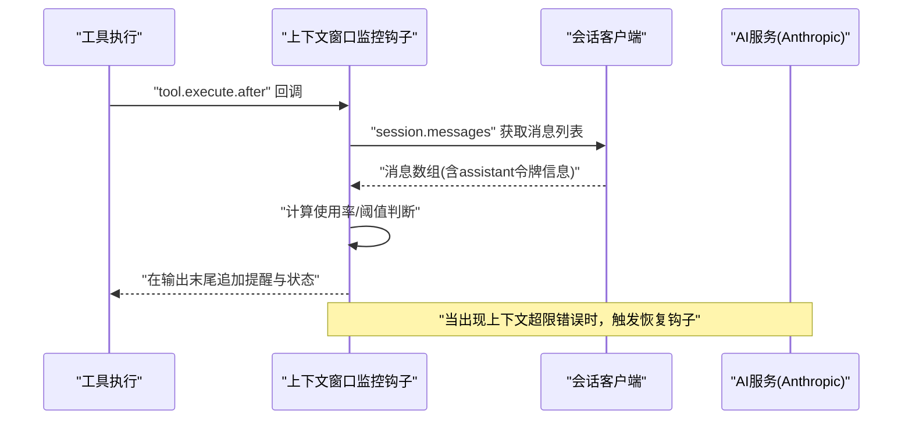
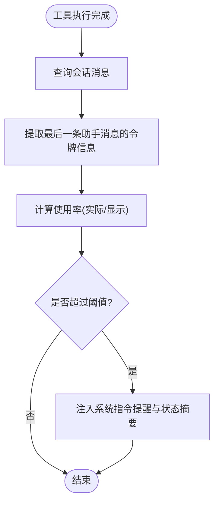
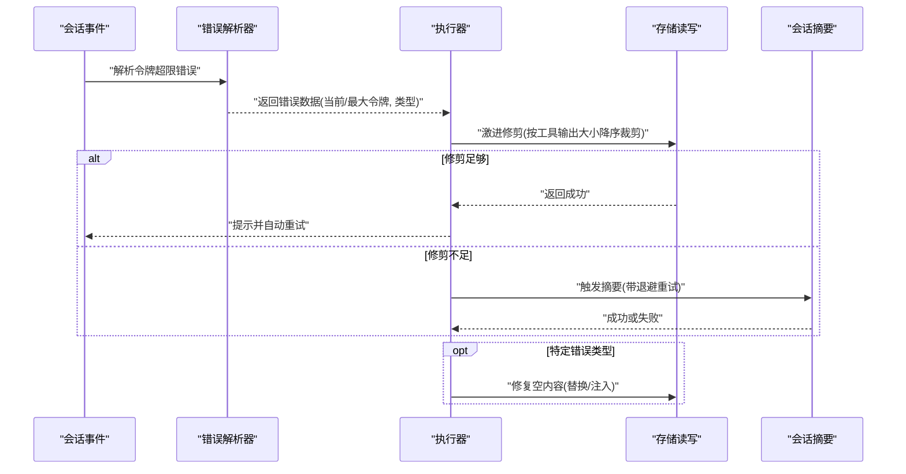
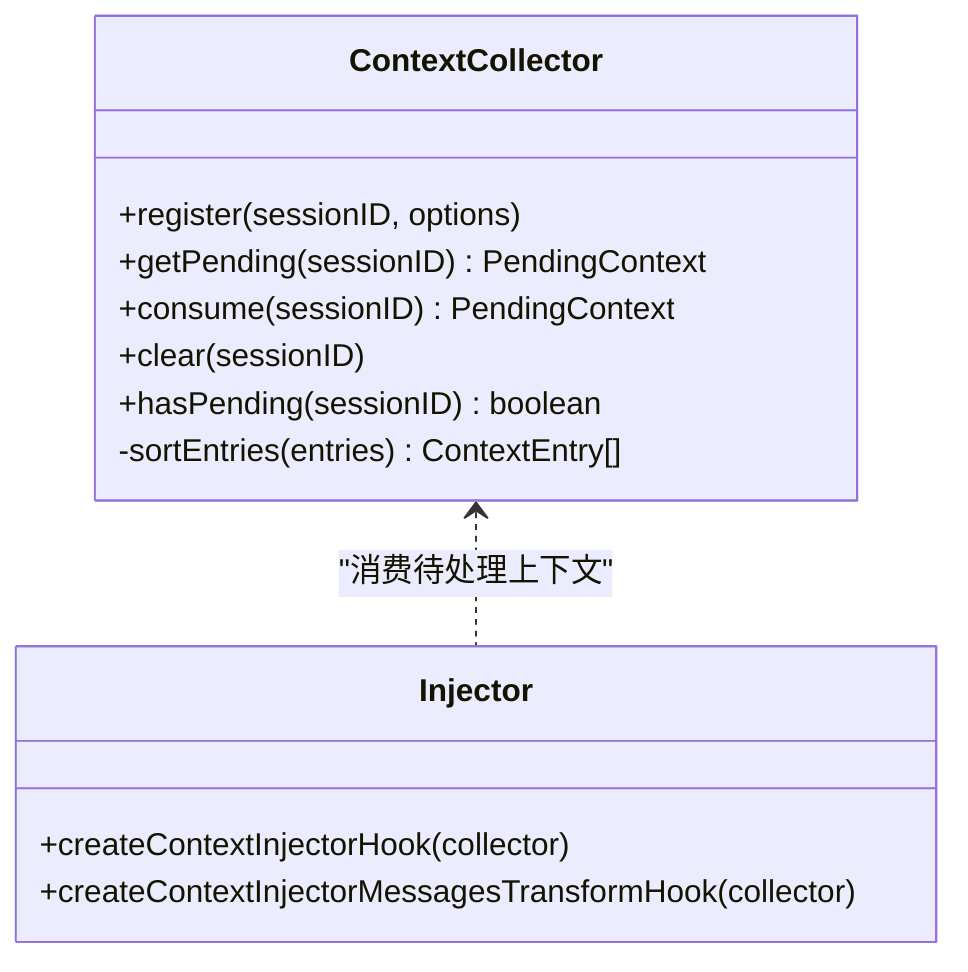
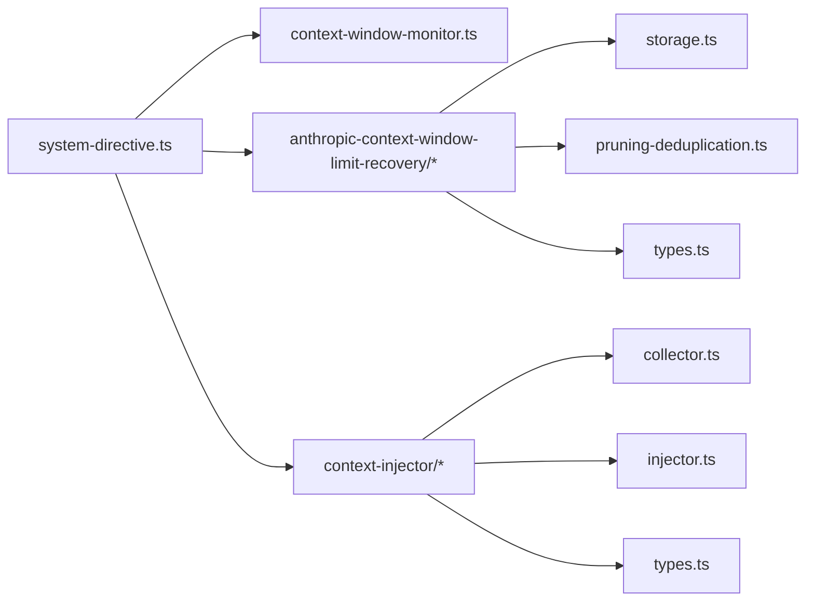

# 上下文监控钩子

<cite>
**本文引用的文件**
- [src/hooks/context-window-monitor.ts](file://src/hooks/context-window-monitor.ts)
- [src/shared/system-directive.ts](file://src/shared/system-directive.ts)
- [src/features/context-injector/index.ts](file://src/features/context-injector/index.ts)
- [src/features/context-injector/collector.ts](file://src/features/context-injector/collector.ts)
- [src/features/context-injector/injector.ts](file://src/features/context-injector/injector.ts)
- [src/features/context-injector/types.ts](file://src/features/context-injector/types.ts)
- [src/hooks/anthropic-context-window-limit-recovery/index.ts](file://src/hooks/anthropic-context-window-limit-recovery/index.ts)
- [src/hooks/anthropic-context-window-limit-recovery/executor.ts](file://src/hooks/anthropic-context-window-limit-recovery/executor.ts)
- [src/hooks/anthropic-context-window-limit-recovery/parser.ts](file://src/hooks/anthropic-context-window-limit-recovery/parser.ts)
- [src/hooks/anthropic-context-window-limit-recovery/storage.ts](file://src/hooks/anthropic-context-window-limit-recovery/storage.ts)
- [src/hooks/anthropic-context-window-limit-recovery/pruning-deduplication.ts](file://src/hooks/anthropic-context-window-limit-recovery/pruning-deduplication.ts)
- [src/hooks/anthropic-context-window-limit-recovery/pruning-types.ts](file://src/hooks/anthropic-context-window-limit-recovery/pruning-types.ts)
- [src/hooks/anthropic-context-window-limit-recovery/types.ts](file://src/hooks/anthropic-context-window-limit-recovery/types.ts)
- [src/hooks/index.ts](file://src/hooks/index.ts)
- [src/index.ts](file://src/index.ts)
</cite>

## 目录
1. [简介](#简介)
2. [项目结构](#项目结构)
3. [核心组件](#核心组件)
4. [架构总览](#架构总览)
5. [组件详解](#组件详解)
6. [依赖关系分析](#依赖关系分析)
7. [性能考量](#性能考量)
8. [故障排查指南](#故障排查指南)
9. [结论](#结论)
10. [附录：配置与参数说明](#附录配置与参数说明)

## 简介
本文件面向 Oh My OpenCode 的上下文监控与恢复体系，系统性阐述以下能力：
- 上下文窗口监控钩子的工作原理与实现机制（基于会话消息统计与阈值提醒）。
- Anthropic 上下文窗口限制恢复钩子的功能特性（错误解析、上下文修剪、去重、摘要与重试恢复策略）。
- 上下文注入器的工作流程（内容收集、排序合并、注入时机与策略）。

文档同时提供配置项与参数说明、使用示例与性能优化建议，帮助开发者在不同模型与场景下稳定运行。

## 项目结构
围绕上下文监控与恢复，相关代码分布在 hooks 与 features 两大模块中，并通过统一的系统指令前缀进行内部消息识别与过滤。

图表来源
- [src/hooks/context-window-monitor.ts](file://src/hooks/context-window-monitor.ts#L1-L100)
- [src/hooks/anthropic-context-window-limit-recovery/index.ts](file://src/hooks/anthropic-context-window-limit-recovery/index.ts#L1-L152)
- [src/features/context-injector/index.ts](file://src/features/context-injector/index.ts#L1-L15)
- [src/shared/system-directive.ts](file://src/shared/system-directive.ts#L1-L41)
- [src/hooks/index.ts](file://src/hooks/index.ts#L1-L48)
- [src/index.ts](file://src/index.ts#L160-L194)

章节来源
- [src/hooks/index.ts](file://src/hooks/index.ts#L1-L48)
- [src/index.ts](file://src/index.ts#L160-L194)

## 核心组件
- 上下文窗口监控钩子：在工具执行后读取会话消息，计算当前输入令牌占比，超过阈值时向输出追加系统提醒与状态摘要。
- Anthropic 上下文限制恢复钩子：监听会话错误事件，解析令牌超限错误，执行“激进修剪-摘要-重试”的三阶段恢复流程；支持去重与空内容修复。
- 上下文注入器：集中收集多源上下文，按优先级与时间排序合并，支持在消息变换或聊天消息阶段注入到用户最后一条消息中。

章节来源
- [src/hooks/context-window-monitor.ts](file://src/hooks/context-window-monitor.ts#L33-L99)
- [src/hooks/anthropic-context-window-limit-recovery/index.ts](file://src/hooks/anthropic-context-window-limit-recovery/index.ts#L23-L147)
- [src/features/context-injector/collector.ts](file://src/features/context-injector/collector.ts#L17-L83)
- [src/features/context-injector/injector.ts](file://src/features/context-injector/injector.ts#L53-L167)

## 架构总览
上下文监控与恢复的整体交互如下：

图表来源
- [src/hooks/context-window-monitor.ts](file://src/hooks/context-window-monitor.ts#L36-L82)

章节来源
- [src/hooks/context-window-monitor.ts](file://src/hooks/context-window-monitor.ts#L33-L99)

## 组件详解

### 上下文窗口监控钩子
- 触发点：工具执行完成后，读取最近一次助手消息的输入令牌与缓存读取令牌，结合显示上限与实际上限计算使用百分比。
- 阈值与提醒：当使用比例超过阈值时，注入系统指令前缀的提醒消息与当前使用/剩余百分比、令牌数摘要。
- 环境变量：可通过特定环境变量启用 1M 上下文模式，从而切换实际与显示上限。
- 会话清理：监听会话删除事件，清理已提醒集合，避免重复提醒。

图表来源
- [src/hooks/context-window-monitor.ts](file://src/hooks/context-window-monitor.ts#L44-L82)
- [src/shared/system-directive.ts](file://src/shared/system-directive.ts#L15-L17)

章节来源
- [src/hooks/context-window-monitor.ts](file://src/hooks/context-window-monitor.ts#L33-L99)
- [src/shared/system-directive.ts](file://src/shared/system-directive.ts#L1-L41)

### Anthropic 上下文限制恢复钩子
- 错误解析：从多种错误来源（字符串、对象、嵌套 JSON、响应体等）抽取当前令牌、最大令牌、请求 ID、错误类型与消息索引。
- 恢复流程：
  - 阶段一：激进修剪（Aggressive Truncation）。根据目标比例与字符/令牌估算，按输出大小降序裁剪工具结果，直至满足阈值或达到最大尝试次数。
  - 阶段二：摘要（Summarize）。若修剪不足，触发会话摘要；失败则指数退避重试，最多若干次。
  - 阶段三：空内容修复（针对特定错误类型）。对空文本部分进行替换或注入占位文本，最多三次。
- 去重与保护：可对重复工具调用签名进行去重，保留最后一次调用，其余标记为修剪以节省上下文。
- 状态管理：维护会话级的待压缩集合、错误数据、重试/修剪状态、空内容尝试计数与压缩进行中集合。

图表来源
- [src/hooks/anthropic-context-window-limit-recovery/index.ts](file://src/hooks/anthropic-context-window-limit-recovery/index.ts#L27-L142)
- [src/hooks/anthropic-context-window-limit-recovery/executor.ts](file://src/hooks/anthropic-context-window-limit-recovery/executor.ts#L258-L485)
- [src/hooks/anthropic-context-window-limit-recovery/parser.ts](file://src/hooks/anthropic-context-window-limit-recovery/parser.ts#L76-L201)
- [src/hooks/anthropic-context-window-limit-recovery/storage.ts](file://src/hooks/anthropic-context-window-limit-recovery/storage.ts#L184-L250)
- [src/hooks/anthropic-context-window-limit-recovery/pruning-deduplication.ts](file://src/hooks/anthropic-context-window-limit-recovery/pruning-deduplication.ts#L82-L170)

章节来源
- [src/hooks/anthropic-context-window-limit-recovery/index.ts](file://src/hooks/anthropic-context-window-limit-recovery/index.ts#L23-L147)
- [src/hooks/anthropic-context-window-limit-recovery/executor.ts](file://src/hooks/anthropic-context-window-limit-recovery/executor.ts#L258-L485)
- [src/hooks/anthropic-context-window-limit-recovery/parser.ts](file://src/hooks/anthropic-context-window-limit-recovery/parser.ts#L1-L202)
- [src/hooks/anthropic-context-window-limit-recovery/storage.ts](file://src/hooks/anthropic-context-window-limit-recovery/storage.ts#L1-L251)
- [src/hooks/anthropic-context-window-limit-recovery/pruning-deduplication.ts](file://src/hooks/anthropic-context-window-limit-recovery/pruning-deduplication.ts#L1-L185)
- [src/hooks/anthropic-context-window-limit-recovery/pruning-types.ts](file://src/hooks/anthropic-context-window-limit-recovery/pruning-types.ts#L1-L45)
- [src/hooks/anthropic-context-window-limit-recovery/types.ts](file://src/hooks/anthropic-context-window-limit-recovery/types.ts#L1-L43)

### 上下文注入器
- 收集与合并：多源上下文注册时携带唯一 id、来源、内容、优先级与时间戳；按优先级与时间排序后合并，使用分隔符拼接。
- 注入策略：
  - 消息变换钩子：在“实验性”消息变换阶段，定位最后一条用户消息，若存在文本部件，则在该部件前插入合成文本部件（用于隐藏注入内容），实现“预挂载”。
  - 聊天消息钩子：在 chat.message 输出阶段，若存在文本部件，将合并后的上下文前置到原始文本之前。
- 会话状态：注入后清空对应会话的待处理上下文，避免重复注入。

图表来源
- [src/features/context-injector/collector.ts](file://src/features/context-injector/collector.ts#L17-L83)
- [src/features/context-injector/injector.ts](file://src/features/context-injector/injector.ts#L53-L167)
- [src/features/context-injector/types.ts](file://src/features/context-injector/types.ts#L1-L92)

章节来源
- [src/features/context-injector/collector.ts](file://src/features/context-injector/collector.ts#L1-L86)
- [src/features/context-injector/injector.ts](file://src/features/context-injector/injector.ts#L1-L168)
- [src/features/context-injector/types.ts](file://src/features/context-injector/types.ts#L1-L92)

## 依赖关系分析
- 上下文监控钩子依赖系统指令工具生成统一前缀，确保内部消息可被识别与过滤。
- 恢复钩子依赖错误解析器、存储层（读取/写入工具输出）、会话摘要与重试配置。
- 注入器依赖上下文收集器与会话状态（主会话 ID），在消息变换与聊天消息阶段注入。

图表来源
- [src/shared/system-directive.ts](file://src/shared/system-directive.ts#L1-L41)
- [src/hooks/context-window-monitor.ts](file://src/hooks/context-window-monitor.ts#L1-L100)
- [src/hooks/anthropic-context-window-limit-recovery/storage.ts](file://src/hooks/anthropic-context-window-limit-recovery/storage.ts#L1-L251)
- [src/hooks/anthropic-context-window-limit-recovery/pruning-deduplication.ts](file://src/hooks/anthropic-context-window-limit-recovery/pruning-deduplication.ts#L1-L185)
- [src/features/context-injector/collector.ts](file://src/features/context-injector/collector.ts#L1-L86)
- [src/features/context-injector/injector.ts](file://src/features/context-injector/injector.ts#L1-L168)
- [src/features/context-injector/types.ts](file://src/features/context-injector/types.ts#L1-L92)

章节来源
- [src/hooks/anthropic-context-window-limit-recovery/types.ts](file://src/hooks/anthropic-context-window-limit-recovery/types.ts#L1-L43)
- [src/features/context-injector/index.ts](file://src/features/context-injector/index.ts#L1-L15)

## 性能考量
- 上下文监控钩子
  - 仅在工具执行后触发一次消息查询，复杂度与消息数量线性相关；建议在长会话中避免频繁触发不必要的工具执行。
  - 使用显示上限进行百分比展示，实际上限由环境变量控制，减少误报。
- Anthropic 上下文限制恢复钩子
  - 激进修剪按输出大小降序裁剪，尽量保留关键工具结果；合理设置目标比例与字符/令牌估算，平衡恢复效果与信息完整性。
  - 摘要与重试采用指数退避，避免频繁轮询；超过最大尝试次数后停止，防止雪崩。
  - 去重可显著节省上下文，但需注意保护关键工具不被误删。
- 上下文注入器
  - 合并操作为 O(n log n)（排序）+ O(m)（拼接），其中 n 为条目数，m 为合并后长度；建议控制单次注入上下文总量，避免影响后续推理。
  - 在消息变换阶段注入可减少对最终输出的二次修改成本。

[本节为通用性能建议，无需具体文件分析]

## 故障排查指南
- 上下文监控未生效
  - 检查会话是否存在助手消息且 providerID 为 Anthropic；确认工具执行后钩子回调是否触发。
  - 确认会话删除事件是否正确清理提醒集合，避免重复提醒。
- 恢复钩子未触发或无效
  - 确认错误事件类型与属性是否正确传递；检查错误解析器是否能从响应体或嵌套字段中提取令牌信息。
  - 若为“非空内容”错误，检查空消息修复逻辑是否成功替换或注入占位文本。
  - 查看日志中的会话状态（待压缩、重试/修剪状态、摘要尝试次数）以定位问题阶段。
- 注入器未注入
  - 确认最后一条用户消息存在文本部件；检查注入策略（消息变换 vs 聊天消息）是否匹配当前流程。
  - 检查会话 ID 是否正确提取（消息 info 或主会话 ID）。

章节来源
- [src/hooks/context-window-monitor.ts](file://src/hooks/context-window-monitor.ts#L84-L93)
- [src/hooks/anthropic-context-window-limit-recovery/index.ts](file://src/hooks/anthropic-context-window-limit-recovery/index.ts#L27-L142)
- [src/hooks/anthropic-context-window-limit-recovery/executor.ts](file://src/hooks/anthropic-context-window-limit-recovery/executor.ts#L171-L256)
- [src/features/context-injector/injector.ts](file://src/features/context-injector/injector.ts#L82-L167)

## 结论
Oh My OpenCode 的上下文监控与恢复体系通过“监控-解析-修剪-摘要-重试-注入”的闭环，有效应对 Anthropic 上下文窗口限制带来的会话中断风险；同时通过系统指令前缀与多策略注入，确保内部消息与外部输出清晰分离。合理配置阈值、修剪策略与恢复算法，可在保证任务完整性的同时提升稳定性与用户体验。

[本节为总结性内容，无需具体文件分析]

## 附录：配置与参数说明

- 上下文监控钩子
  - 环境变量
    - ANTHROPIC_1M_CONTEXT / VERTEX_ANTHROPIC_1M_CONTEXT：启用 1M 上下文模式，切换实际与显示上限。
  - 阈值
    - 使用率阈值：超过该比例时触发提醒。
  - 提醒内容
    - 包含系统指令前缀与当前使用/剩余百分比、令牌数摘要。

- Anthropic 上下文限制恢复钩子
  - 错误解析
    - 支持从字符串、对象、嵌套 JSON、响应体等多种来源提取令牌信息与错误类型。
  - 激进修剪
    - 最大尝试次数、最小输出尺寸、目标令牌比例、字符/令牌估算系数。
  - 摘要与重试
    - 最大重试次数、初始延迟、退避因子、最大延迟。
  - 空内容修复
    - 最大尝试次数（默认 3 次），针对“非空内容”错误类型。
  - 去重
    - 可配置启用与受保护工具列表，按工具签名去重，保留最后一次调用。

- 上下文注入器
  - 数据模型
    - 来源类型、优先级、条目结构、合并结果与注入策略。
  - 注入策略
    - 消息变换阶段（预挂载）、聊天消息阶段（前置文本）。
  - 会话状态
    - 待处理上下文、消费后清空，避免重复注入。

章节来源
- [src/hooks/context-window-monitor.ts](file://src/hooks/context-window-monitor.ts#L4-L16)
- [src/hooks/anthropic-context-window-limit-recovery/types.ts](file://src/hooks/anthropic-context-window-limit-recovery/types.ts#L30-L43)
- [src/hooks/anthropic-context-window-limit-recovery/parser.ts](file://src/hooks/anthropic-context-window-limit-recovery/parser.ts#L12-L75)
- [src/features/context-injector/types.ts](file://src/features/context-injector/types.ts#L1-L92)
- [src/features/context-injector/injector.ts](file://src/features/context-injector/injector.ts#L82-L167)