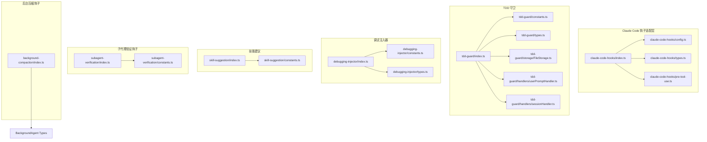
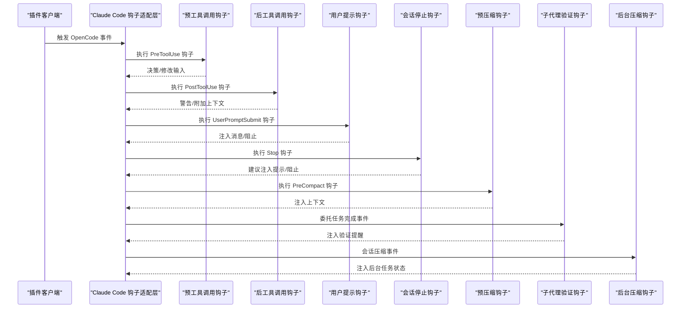
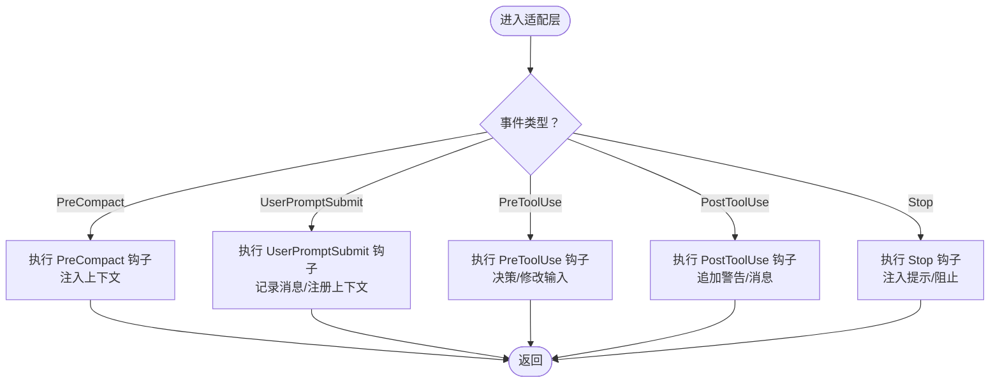
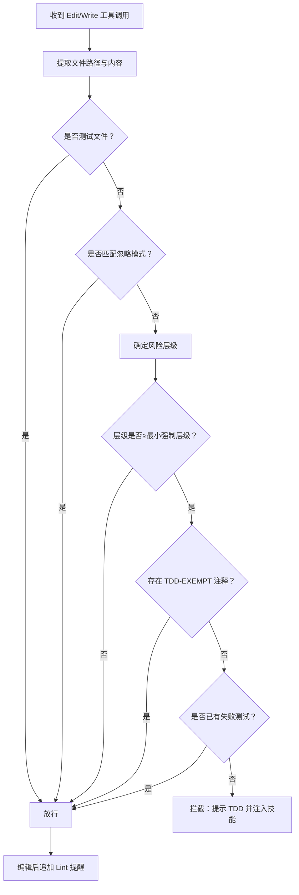
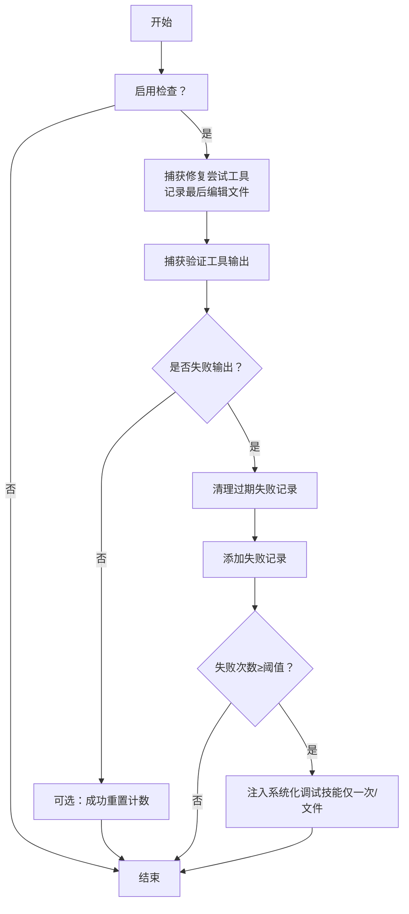
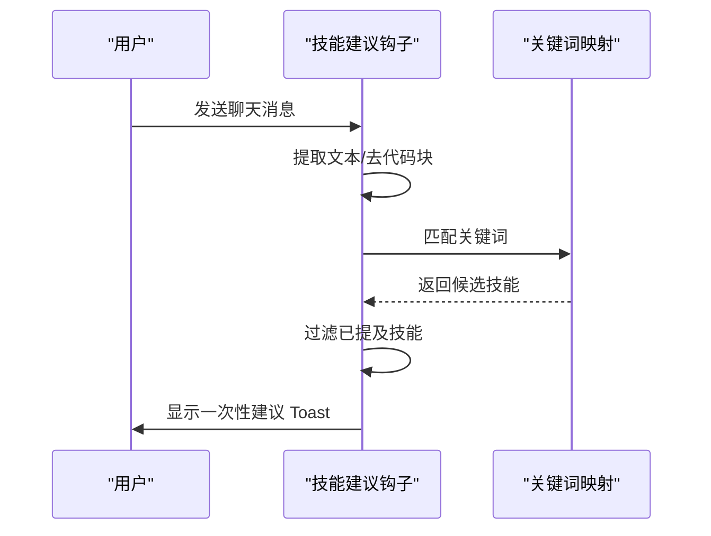
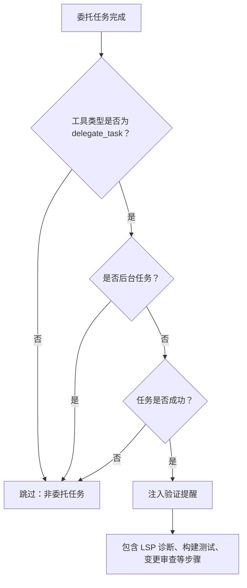
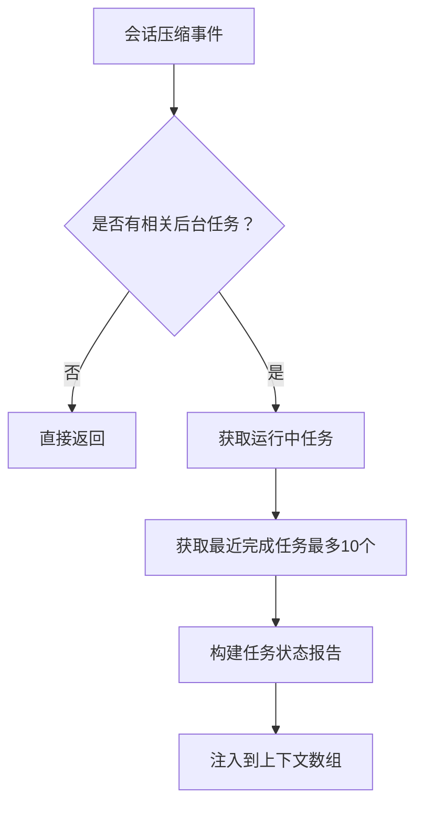
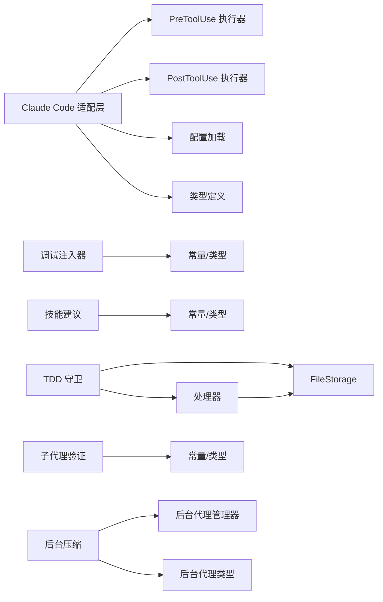

# 专用功能钩子

<cite>
**本文引用的文件**
- [src/hooks/claude-code-hooks/index.ts](file://src/hooks/claude-code-hooks/index.ts)
- [src/hooks/claude-code-hooks/config.ts](file://src/hooks/claude-code-hooks/config.ts)
- [src/hooks/claude-code-hooks/types.ts](file://src/hooks/claude-code-hooks/types.ts)
- [src/hooks/claude-code-hooks/pre-tool-use.ts](file://src/hooks/claude-code-hooks/pre-tool-use.ts)
- [src/hooks/tdd-guard/index.ts](file://src/hooks/tdd-guard/index.ts)
- [src/hooks/tdd-guard/constants.ts](file://src/hooks/tdd-guard/constants.ts)
- [src/hooks/tdd-guard/types.ts](file://src/hooks/tdd-guard/types.ts)
- [src/hooks/tdd-guard/storage/FileStorage.ts](file://src/hooks/tdd-guard/storage/FileStorage.ts)
- [src/hooks/tdd-guard/handlers/userPromptHandler.ts](file://src/hooks/tdd-guard/handlers/userPromptHandler.ts)
- [src/hooks/tdd-guard/handlers/sessionHandler.ts](file://src/hooks/tdd-guard/handlers/sessionHandler.ts)
- [src/hooks/debugging-injector/index.ts](file://src/hooks/debugging-injector/index.ts)
- [src/hooks/debugging-injector/constants.ts](file://src/hooks/debugging-injector/constants.ts)
- [src/hooks/debugging-injector/types.ts](file://src/hooks/debugging-injector/types.ts)
- [src/hooks/skill-suggestion/index.ts](file://src/hooks/skill-suggestion/index.ts)
- [src/hooks/skill-suggestion/constants.ts](file://src/hooks/skill-suggestion/constants.ts)
- [src/hooks/subagent-verification/index.ts](file://src/hooks/subagent-verification/index.ts)
- [src/hooks/subagent-verification/constants.ts](file://src/hooks/subagent-verification/constants.ts)
- [src/hooks/background-compaction/index.ts](file://src/hooks/background-compaction/index.ts)
- [src/features/background-agent/types.ts](file://src/features/background-agent/types.ts)
- [src/features/background-agent/manager.ts](file://src/features/background-agent/manager.ts)
- [src/hooks/index.ts](file://src/hooks/index.ts)
</cite>

## 更新摘要
**所做更改**
- 新增了两个专用功能钩子：子代理验证钩子（subagent-verification）和后台压缩钩子（background-compaction）
- 增强了类型安全性，引入了专门的接口类型（CompactingInput、CompactingOutput）
- 改进了后台任务管理的类型安全性和接口设计
- 更新了钩子索引文件以包含新钩子的导出

## 目录
1. [简介](#简介)
2. [项目结构](#项目结构)
3. [核心组件](#核心组件)
4. [架构总览](#架构总览)
5. [详细组件分析](#详细组件分析)
6. [依赖关系分析](#依赖关系分析)
7. [性能考量](#性能考量)
8. [故障排查指南](#故障排查指南)
9. [结论](#结论)
10. [附录](#附录)

## 简介
本文件面向 Oh My OpenCode 的专用功能钩子，系统性阐述以下五类钩子的设计与实现：
- Claude Code 钩子：统一桥接 OpenCode 插件事件与 Claude Code 钩子规范，支持预工具调用、后工具调用、用户提示提交、会话停止、预压缩等生命周期钩子。
- TDD 守卫钩子：基于风险分级与规则引擎，强制执行测试驱动开发（TDD），在编辑高风险文件时进行拦截与引导，并对后续修改行为进行质量提醒。
- 调试注入器：通过连续失败检测与模式识别，在多次修复尝试失败后自动注入系统化调试技能，帮助开发者遵循"根因调查优先"的流程。
- 技能建议钩子：基于关键词检测与已提及过滤，向用户建议合适的内置技能，提升工作流效率。
- **新增** 子代理验证钩子：强制执行"子代理会说谎"原则，确保委托给子代理的任务完成后，编排器必须独立验证工作成果。
- **新增** 后台压缩钩子：在会话上下文压缩时保留后台任务状态信息，防止代理丢失对委托工作的认知。

同时，文档提供各钩子的配置方法与典型使用场景，便于在实际开发中落地应用。

## 项目结构
专用功能钩子主要位于 src/hooks 下，按功能域划分模块：
- claude-code-hooks：Claude Code 钩子适配层，负责事件映射、配置加载、工具输入缓存与转录记录。
- tdd-guard：TDD 强制执行与风险评估，包含常量、类型、存储与处理器。
- debugging-injector：调试失败检测与技能注入。
- skill-suggestion：关键词驱动的技能建议。
- **新增** subagent-verification：子代理验证钩子，确保委托任务的独立验证。
- **新增** background-compaction：后台任务压缩钩子，保护后台任务状态。

**图表来源**
- [src/hooks/claude-code-hooks/index.ts](file://src/hooks/claude-code-hooks/index.ts#L1-L402)
- [src/hooks/claude-code-hooks/config.ts](file://src/hooks/claude-code-hooks/config.ts#L1-L104)
- [src/hooks/claude-code-hooks/types.ts](file://src/hooks/claude-code-hooks/types.ts#L1-L205)
- [src/hooks/claude-code-hooks/pre-tool-use.ts](file://src/hooks/claude-code-hooks/pre-tool-use.ts#L1-L173)
- [src/hooks/tdd-guard/index.ts](file://src/hooks/tdd-guard/index.ts#L1-L296)
- [src/hooks/tdd-guard/constants.ts](file://src/hooks/tdd-guard/constants.ts#L1-L121)
- [src/hooks/tdd-guard/types.ts](file://src/hooks/tdd-guard/types.ts#L1-L59)
- [src/hooks/tdd-guard/storage/FileStorage.ts](file://src/hooks/tdd-guard/storage/FileStorage.ts#L1-L143)
- [src/hooks/tdd-guard/handlers/userPromptHandler.ts](file://src/hooks/tdd-guard/handlers/userPromptHandler.ts#L1-L99)
- [src/hooks/tdd-guard/handlers/sessionHandler.ts](file://src/hooks/tdd-guard/handlers/sessionHandler.ts#L1-L87)
- [src/hooks/debugging-injector/index.ts](file://src/hooks/debugging-injector/index.ts#L1-L224)
- [src/hooks/debugging-injector/constants.ts](file://src/hooks/debugging-injector/constants.ts#L1-L43)
- [src/hooks/debugging-injector/types.ts](file://src/hooks/debugging-injector/types.ts#L1-L32)
- [src/hooks/skill-suggestion/index.ts](file://src/hooks/skill-suggestion/index.ts#L1-L140)
- [src/hooks/skill-suggestion/constants.ts](file://src/hooks/skill-suggestion/constants.ts#L1-L75)
- [src/hooks/subagent-verification/index.ts](file://src/hooks/subagent-verification/index.ts#L1-L57)
- [src/hooks/subagent-verification/constants.ts](file://src/hooks/subagent-verification/constants.ts#L1-L44)
- [src/hooks/background-compaction/index.ts](file://src/hooks/background-compaction/index.ts#L1-L86)

**章节来源**
- [src/hooks/claude-code-hooks/index.ts](file://src/hooks/claude-code-hooks/index.ts#L1-L402)
- [src/hooks/claude-code-hooks/config.ts](file://src/hooks/claude-code-hooks/config.ts#L1-L104)
- [src/hooks/claude-code-hooks/types.ts](file://src/hooks/claude-code-hooks/types.ts#L1-L205)
- [src/hooks/claude-code-hooks/pre-tool-use.ts](file://src/hooks/claude-code-hooks/pre-tool-use.ts#L1-L173)
- [src/hooks/tdd-guard/index.ts](file://src/hooks/tdd-guard/index.ts#L1-L296)
- [src/hooks/tdd-guard/constants.ts](file://src/hooks/tdd-guard/constants.ts#L1-L121)
- [src/hooks/tdd-guard/types.ts](file://src/hooks/tdd-guard/types.ts#L1-L59)
- [src/hooks/tdd-guard/storage/FileStorage.ts](file://src/hooks/tdd-guard/storage/FileStorage.ts#L1-L143)
- [src/hooks/tdd-guard/handlers/userPromptHandler.ts](file://src/hooks/tdd-guard/handlers/userPromptHandler.ts#L1-L99)
- [src/hooks/tdd-guard/handlers/sessionHandler.ts](file://src/hooks/tdd-guard/handlers/sessionHandler.ts#L1-L87)
- [src/hooks/debugging-injector/index.ts](file://src/hooks/debugging-injector/index.ts#L1-L224)
- [src/hooks/debugging-injector/constants.ts](file://src/hooks/debugging-injector/constants.ts#L1-L43)
- [src/hooks/debugging-injector/types.ts](file://src/hooks/debugging-injector/types.ts#L1-L32)
- [src/hooks/skill-suggestion/index.ts](file://src/hooks/skill-suggestion/index.ts#L1-L140)
- [src/hooks/skill-suggestion/constants.ts](file://src/hooks/skill-suggestion/constants.ts#L1-L75)
- [src/hooks/subagent-verification/index.ts](file://src/hooks/subagent-verification/index.ts#L1-L57)
- [src/hooks/subagent-verification/constants.ts](file://src/hooks/subagent-verification/constants.ts#L1-L44)
- [src/hooks/background-compaction/index.ts](file://src/hooks/background-compaction/index.ts#L1-L86)

## 核心组件
- Claude Code 钩子适配层：将 OpenCode 插件事件映射到 Claude Code 钩子规范，支持 PreToolUse、PostToolUse、UserPromptSubmit、Stop、PreCompact 等事件；负责配置加载、工具输入缓存、转录记录与消息注入。
- TDD 守卫钩子：根据文件风险等级与规则，拦截编辑高风险文件的行为，必要时注入 TDD 技能并给出后续修改提醒。
- 调试注入器：统计同一文件的连续失败次数，达到阈值后注入系统化调试技能，避免无效的随机修复。
- 技能建议钩子：从用户提示中提取关键词，结合已提及过滤，非阻塞地建议合适的内置技能。
- **新增** 子代理验证钩子：强制执行"子代理会说谎"原则，确保委托给子代理的任务完成后，编排器必须独立验证工作成果，防止盲目信任子代理的声明。
- **新增** 后台压缩钩子：在会话上下文压缩时，将运行中和最近完成的后台任务信息注入到上下文中，防止代理在上下文压缩过程中丢失对委托工作的认知。

**章节来源**
- [src/hooks/claude-code-hooks/index.ts](file://src/hooks/claude-code-hooks/index.ts#L36-L402)
- [src/hooks/tdd-guard/index.ts](file://src/hooks/tdd-guard/index.ts#L92-L296)
- [src/hooks/debugging-injector/index.ts](file://src/hooks/debugging-injector/index.ts#L104-L224)
- [src/hooks/skill-suggestion/index.ts](file://src/hooks/skill-suggestion/index.ts#L60-L140)
- [src/hooks/subagent-verification/index.ts](file://src/hooks/subagent-verification/index.ts#L7-L57)
- [src/hooks/background-compaction/index.ts](file://src/hooks/background-compaction/index.ts#L12-L86)

## 架构总览
下图展示 Claude Code 钩子适配层如何桥接 OpenCode 插件事件与 Claude Code 钩子规范，并与各专用钩子协作：

**图表来源**
- [src/hooks/claude-code-hooks/index.ts](file://src/hooks/claude-code-hooks/index.ts#L42-L399)
- [src/hooks/claude-code-hooks/pre-tool-use.ts](file://src/hooks/claude-code-hooks/pre-tool-use.ts#L46-L173)
- [src/hooks/claude-code-hooks/config.ts](file://src/hooks/claude-code-hooks/config.ts#L81-L104)
- [src/hooks/claude-code-hooks/types.ts](file://src/hooks/claude-code-hooks/types.ts#L6-L29)
- [src/hooks/subagent-verification/index.ts](file://src/hooks/subagent-verification/index.ts#L14-L57)
- [src/hooks/background-compaction/index.ts](file://src/hooks/background-compaction/index.ts#L19-L86)

## 详细组件分析

### Claude Code 钩子适配层
- 事件映射与控制流
  - experimental.session.compacting → PreCompact：在会话压缩前注入上下文。
  - chat.message → UserPromptSubmit：记录用户消息，执行钩子，必要时注册上下文收集器以合成消息注入。
  - tool.execute.before → PreToolUse：记录工具调用与输入，执行钩子决策，支持拒绝、询问或修改输入。
  - tool.execute.after → PostToolUse：记录工具结果，执行钩子，可追加警告/消息并显示 Toast。
  - event → Stop：在会话空闲时执行 Stop 钩子，支持注入提示或阻止。
- 配置与扩展
  - 通过 loadClaudeHooksConfig 从多路径 settings.json 合并钩子配置，支持匹配器与命令列表。
  - 通过 loadPluginExtendedConfig 支持插件级禁用命令与扩展配置。
- 工具输入缓存与转录
  - 缓存工具输入用于后处理与转录记录，确保工具输出被正确归档。

**图表来源**
- [src/hooks/claude-code-hooks/index.ts](file://src/hooks/claude-code-hooks/index.ts#L42-L399)

**章节来源**
- [src/hooks/claude-code-hooks/index.ts](file://src/hooks/claude-code-hooks/index.ts#L36-L402)
- [src/hooks/claude-code-hooks/config.ts](file://src/hooks/claude-code-hooks/config.ts#L81-L104)
- [src/hooks/claude-code-hooks/types.ts](file://src/hooks/claude-code-hooks/types.ts#L201-L205)
- [src/hooks/claude-code-hooks/pre-tool-use.ts](file://src/hooks/claude-code-hooks/pre-tool-use.ts#L46-L173)

### TDD 守卫钩子
- 功能特性
  - 风险分级：根据文件路径与语言特征分为 Tier 0-3，不同层级对应不同的 TDD 要求与豁免能力。
  - 编辑拦截：当编辑 Tier 2/3 文件且无失败测试时，拦截编辑并提示 TDD 流程；Tier 2 可通过注释豁免（Tier 3 不允许）。
  - 技能注入：被拦截时自动注入 TDD 技能内容，指导 RED-GREEN-REFACTOR 流程。
  - 后续提醒：编辑成功后追加 lint 与测试运行提醒，促进持续质量保障。
  - 用户指令：支持 /tdd on/off 控制钩子启用状态，状态持久化于存储。
- 实现要点
  - 风险评估：通过文件路径正则与语言特定测试文件模式判断风险层级。
  - 豁免检查：扫描内容中的 TDD-EXEMPT 注释，Tier 2 允许豁免。
  - 存储与状态：使用 FileStorage 在项目根目录下的 .tdd-guard 持久化配置与临时数据；会话开始时清理临时数据。
  - 处理器：UserPromptHandler 处理 /tdd 命令；SessionHandler 管理会话生命周期初始化。

**图表来源**
- [src/hooks/tdd-guard/index.ts](file://src/hooks/tdd-guard/index.ts#L142-L280)
- [src/hooks/tdd-guard/constants.ts](file://src/hooks/tdd-guard/constants.ts#L12-L121)
- [src/hooks/tdd-guard/storage/FileStorage.ts](file://src/hooks/tdd-guard/storage/FileStorage.ts#L29-L143)
- [src/hooks/tdd-guard/handlers/userPromptHandler.ts](file://src/hooks/tdd-guard/handlers/userPromptHandler.ts#L21-L99)
- [src/hooks/tdd-guard/handlers/sessionHandler.ts](file://src/hooks/tdd-guard/handlers/sessionHandler.ts#L21-L87)

**章节来源**
- [src/hooks/tdd-guard/index.ts](file://src/hooks/tdd-guard/index.ts#L92-L296)
- [src/hooks/tdd-guard/constants.ts](file://src/hooks/tdd-guard/constants.ts#L12-L121)
- [src/hooks/tdd-guard/types.ts](file://src/hooks/tdd-guard/types.ts#L16-L59)
- [src/hooks/tdd-guard/storage/FileStorage.ts](file://src/hooks/tdd-guard/storage/FileStorage.ts#L29-L143)
- [src/hooks/tdd-guard/handlers/userPromptHandler.ts](file://src/hooks/tdd-guard/handlers/userPromptHandler.ts#L21-L99)
- [src/hooks/tdd-guard/handlers/sessionHandler.ts](file://src/hooks/tdd-guard/handlers/sessionHandler.ts#L21-L87)

### 调试注入器
- 功能特性
  - 连续失败检测：跟踪同一文件在时间窗口内的失败次数，超过阈值（默认≥2）触发注入。
  - 工具识别：将 edit/write 识别为修复尝试，将 bash/lsp_diagnostics 识别为验证工具。
  - 技能注入：一次性注入系统化调试技能，强调"先根因调查再修复"的流程。
  - 成功重置：在成功修复后可选择重置失败计数，避免重复注入。
- 实现要点
  - 失败模式：通过正则匹配错误输出中的关键字，识别失败。
  - 时间窗口：默认 30 分钟，过期记录自动清理。
  - 状态管理：按会话维护 Map/Set 记录失败与已注入文件集合。

**图表来源**
- [src/hooks/debugging-injector/index.ts](file://src/hooks/debugging-injector/index.ts#L104-L224)
- [src/hooks/debugging-injector/constants.ts](file://src/hooks/debugging-injector/constants.ts#L10-L43)
- [src/hooks/debugging-injector/types.ts](file://src/hooks/debugging-injector/types.ts#L26-L32)

**章节来源**
- [src/hooks/debugging-injector/index.ts](file://src/hooks/debugging-injector/index.ts#L104-L224)
- [src/hooks/debugging-injector/constants.ts](file://src/hooks/debugging-injector/constants.ts#L10-L43)
- [src/hooks/debugging-injector/types.ts](file://src/hooks/debugging-injector/types.ts#L7-L32)

### 技能建议钩子
- 功能特性
  - 关键词检测：从用户提示中提取文本，移除代码块后基于正则匹配触发关键词。
  - 已提及过滤：避免对已在提示中明确提及的技能进行重复建议。
  - 非阻塞提示：仅在主会话展示一次性建议，通过 Toast 展示建议说明。
- 实现要点
  - 建议映射：内置多组技能与关键词映射，覆盖创意设计、调试、Git、前端、TDD、设计文档、端到端测试等场景。
  - 会话隔离：仅在主会话触发建议，避免子代理会话噪声。

**图表来源**
- [src/hooks/skill-suggestion/index.ts](file://src/hooks/skill-suggestion/index.ts#L60-L140)
- [src/hooks/skill-suggestion/constants.ts](file://src/hooks/skill-suggestion/constants.ts#L7-L75)

**章节来源**
- [src/hooks/skill-suggestion/index.ts](file://src/hooks/skill-suggestion/index.ts#L60-L140)
- [src/hooks/skill-suggestion/constants.ts](file://src/hooks/skill-suggestion/constants.ts#L1-L75)

### 子代理验证钩子
- 功能特性
  - 强制验证：确保委托给子代理的任务完成后，编排器必须独立验证工作成果。
  - "子代理会说谎"原则：防止盲目信任子代理的声明，要求独立验证所有委托工作。
  - 任务状态检查：仅对成功的委托任务注入验证提醒，跳过失败、错误或取消的任务。
  - 后台任务过滤：自动跳过后台异步任务，因为这些任务会在完成后单独通知。
  - 验证清单：提供完整的验证步骤清单，包括 LSP 诊断、构建测试和变更文件审查。
- 实现要点
  - 类型安全：使用专门的接口类型确保输入输出的安全访问。
  - 事件监听：监听 tool.execute.after 事件，专门处理 delegate_task 工具调用。
  - 条件注入：只有在任务成功完成且不是后台任务时才注入验证提醒。
  - 日志记录：详细的日志记录帮助调试和监控验证过程。

**图表来源**
- [src/hooks/subagent-verification/index.ts](file://src/hooks/subagent-verification/index.ts#L14-L57)
- [src/hooks/subagent-verification/constants.ts](file://src/hooks/subagent-verification/constants.ts#L9-L44)

**章节来源**
- [src/hooks/subagent-verification/index.ts](file://src/hooks/subagent-verification/index.ts#L7-L57)
- [src/hooks/subagent-verification/constants.ts](file://src/hooks/subagent-verification/constants.ts#L1-L44)

### 后台压缩钩子
- 功能特性
  - 上下文保护：在会话上下文压缩时保护后台任务状态信息。
  - 运行中任务追踪：显示当前正在运行的后台任务及其运行时间。
  - 最近完成任务：显示最近完成的后台任务（最多10个），包括状态和描述。
  - 结果检索：提供 `background_output(task_id="<id>")` 语法用于检索任务结果。
  - 会话关联：仅显示与当前会话相关的后台任务，防止信息泄露。
- 实现要点
  - 类型安全：使用 CompactingInput 和 CompactingOutput 接口确保参数类型安全。
  - 状态过滤：通过 parentSessionID 过滤只属于当前会话的后台任务。
  - 时间计算：计算运行中任务的运行时间，提供秒级精度的时间信息。
  - 状态可视化：使用表情符号直观表示任务状态（✅ completed, ❌ error, ⏱️ other）。
  - 早期退出：如果没有相关任务需要保护，直接返回以避免不必要的处理。

**图表来源**
- [src/hooks/background-compaction/index.ts](file://src/hooks/background-compaction/index.ts#L19-L86)
- [src/features/background-agent/types.ts](file://src/features/background-agent/types.ts#L15-L42)

**章节来源**
- [src/hooks/background-compaction/index.ts](file://src/hooks/background-compaction/index.ts#L12-L86)
- [src/features/background-agent/types.ts](file://src/features/background-agent/types.ts#L1-L65)
- [src/features/background-agent/manager.ts](file://src/features/background-agent/manager.ts#L718-L730)

## 依赖关系分析
- 组件耦合
  - Claude Code 钩子适配层依赖共享工具（如配置加载、命令执行、日志）与上下文注入器接口。
  - TDD 守卫钩子内部包含处理器与存储模块，形成清晰的职责分离。
  - 调试注入器与技能建议钩子均为独立模块，不相互依赖。
  - **新增** 子代理验证钩子依赖插件输入类型和常量定义，确保类型安全。
  - **新增** 后台压缩钩子依赖后台代理管理器和类型定义，提供类型安全的接口。
- 外部依赖
  - 文件系统：TDD 守卫使用文件存储持久化配置与临时数据。
  - 插件客户端：各钩子通过插件客户端进行消息注入与 Toast 提示。
  - **新增** 后台代理系统：后台压缩钩子依赖完整的后台代理基础设施。

**图表来源**
- [src/hooks/claude-code-hooks/index.ts](file://src/hooks/claude-code-hooks/index.ts#L1-L402)
- [src/hooks/claude-code-hooks/pre-tool-use.ts](file://src/hooks/claude-code-hooks/pre-tool-use.ts#L1-L173)
- [src/hooks/tdd-guard/index.ts](file://src/hooks/tdd-guard/index.ts#L1-L296)
- [src/hooks/tdd-guard/storage/FileStorage.ts](file://src/hooks/tdd-guard/storage/FileStorage.ts#L1-L143)
- [src/hooks/debugging-injector/index.ts](file://src/hooks/debugging-injector/index.ts#L1-L224)
- [src/hooks/skill-suggestion/index.ts](file://src/hooks/skill-suggestion/index.ts#L1-L140)
- [src/hooks/subagent-verification/index.ts](file://src/hooks/subagent-verification/index.ts#L1-L57)
- [src/hooks/background-compaction/index.ts](file://src/hooks/background-compaction/index.ts#L1-L86)
- [src/features/background-agent/types.ts](file://src/features/background-agent/types.ts#L1-L65)

**章节来源**
- [src/hooks/claude-code-hooks/index.ts](file://src/hooks/claude-code-hooks/index.ts#L1-L402)
- [src/hooks/tdd-guard/index.ts](file://src/hooks/tdd-guard/index.ts#L1-L296)
- [src/hooks/debugging-injector/index.ts](file://src/hooks/debugging-injector/index.ts#L1-L224)
- [src/hooks/skill-suggestion/index.ts](file://src/hooks/skill-suggestion/index.ts#L1-L140)
- [src/hooks/subagent-verification/index.ts](file://src/hooks/subagent-verification/index.ts#L1-L57)
- [src/hooks/background-compaction/index.ts](file://src/hooks/background-compaction/index.ts#L1-L86)

## 性能考量
- 钩子执行成本
  - Claude Code 适配层在关键事件上仅做必要计算（如文本拼接、JSON 解析），避免重型操作。
  - TDD 守卫与调试注入器均采用轻量正则匹配与内存 Map/Set 结构，时间复杂度低。
  - **新增** 子代理验证钩子使用简单的字符串比较和正则匹配，性能开销极小。
  - **新增** 后台压缩钩子使用高效的数组过滤和映射操作，时间复杂度为 O(n)。
- I/O 与持久化
  - TDD 守卫使用文件存储，建议在项目根目录下集中管理，减少频繁 I/O。
- 并发与会话隔离
  - 各钩子按会话 ID 维护状态，避免跨会话干扰；在会话结束时清理状态，降低内存占用。
  - **新增** 后台压缩钩子通过 parentSessionID 精确过滤任务，避免不必要的遍历。

## 故障排查指南
- Claude Code 钩子
  - 钩子未生效：确认插件配置中未禁用相应事件；检查 settings.json 中的钩子匹配器与命令是否正确。
  - 输入解析错误：todowrite 参数需为数组格式，否则会抛出解析错误；请修正参数格式。
  - 输出注入异常：若注入消息未出现，检查上下文收集器注册逻辑与会话中断状态。
- TDD 守卫
  - /tdd on/off 无效：确认 UserPromptHandler 正确读写持久化配置；检查会话生命周期事件是否触发。
  - 豁免注释未生效：确认注释格式符合 EXEMPTION_PATTERNS；Tier 3 文件不可豁免。
  - 风险层级误判：核对文件路径与语言特定测试文件模式；必要时调整忽略模式。
- 调试注入器
  - 多次失败仍不注入：检查失败模式正则是否覆盖实际输出；确认时间窗口设置是否合理。
  - 成功后未重置：确认 reset_on_success 配置；检查 lastEditedFile 是否正确更新。
- 技能建议
  - 建议重复出现：确认会话内已建议集合是否正确维护；检查主会话 ID 判定逻辑。
  - 关键词未命中：调整关键词正则或建议映射；注意代码块会被移除，避免误判。
- **新增** 子代理验证钩子
  - 验证提醒未注入：确认任务确实成功完成且不是后台任务；检查 delegate_task 工具调用是否正确。
  - 验证提醒重复出现：确认输出缓冲区没有被其他钩子修改；检查任务状态是否正确。
  - 类型错误：如果遇到 TypeScript 错误，检查输入输出类型的兼容性。
- **新增** 后台压缩钩子
  - 任务状态未显示：确认后台代理管理器正常运行；检查 parentSessionID 是否正确。
  - 上下文未更新：确认 CompactingInput 和 CompactingOutput 接口的使用是否正确。
  - 性能问题：大量后台任务可能导致处理时间增加，考虑优化任务数量。

**章节来源**
- [src/hooks/claude-code-hooks/index.ts](file://src/hooks/claude-code-hooks/index.ts#L170-L312)
- [src/hooks/tdd-guard/index.ts](file://src/hooks/tdd-guard/index.ts#L111-L280)
- [src/hooks/debugging-injector/index.ts](file://src/hooks/debugging-injector/index.ts#L122-L224)
- [src/hooks/skill-suggestion/index.ts](file://src/hooks/skill-suggestion/index.ts#L64-L140)
- [src/hooks/subagent-verification/index.ts](file://src/hooks/subagent-verification/index.ts#L14-L57)
- [src/hooks/background-compaction/index.ts](file://src/hooks/background-compaction/index.ts#L19-L86)

## 结论
Oh My OpenCode 的专用功能钩子围绕"安全、可控、高效"的目标设计：
- Claude Code 钩子适配层提供了统一的事件桥接与配置管理，确保与 Claude Code 生态兼容。
- TDD 守卫通过风险分级与规则引擎，有效约束高风险文件的修改行为，并提供引导与提醒。
- 调试注入器以失败检测为核心，避免无效修复，推动系统化调试流程。
- 技能建议钩子以关键词驱动，提升工作流的智能化与可发现性。
- **新增** 子代理验证钩子强制执行"子代理会说谎"原则，确保委托任务的独立验证，防止盲目信任。
- **新增** 后台压缩钩子在上下文压缩时保护后台任务状态，防止代理丢失对委托工作的认知。

这些钩子既可独立使用，也可组合部署，满足不同场景下的质量与效率需求。

## 附录

### 配置方法与使用场景

- Claude Code 钩子
  - 配置位置：支持从 Claude 配置目录与项目 .claude 目录加载 settings.json，合并 hooks 字段。
  - 使用场景：在工具调用前后进行权限控制、输出增强与上下文注入；在用户提交提示时进行消息注入与阻断；在会话停止时进行安全检查与提示注入；在会话压缩前注入上下文。
  - 关键点：通过匹配器与命令列表组织钩子；PreToolUse 可拒绝、询问或修改输入；PostToolUse 可追加警告与消息；Stop 可注入提示或阻止。

- TDD 守卫
  - 配置项：enabled、risk_tier_enabled、min_enforce_tier、ignore_patterns、reject_empty_tests、reject_missing_assertions、reject_trivial_assertions、inject_skill_on_block。
  - 使用场景：在编辑高风险文件（Tier 2/3）前强制执行 TDD；Tier 2 可通过注释豁免；Tier 3 必须有失败测试。
  - 关键点：/tdd on/off 控制钩子启用；会话开始时清理临时数据；编辑后追加 lint 与测试提醒。

- 调试注入器
  - 配置项：enabled、failure_threshold、inject_skill_on_threshold、reset_on_success、failure_window_ms。
  - 使用场景：在多次修复失败后自动注入系统化调试技能，避免无效尝试。
  - 关键点：默认阈值 2，时间窗口 30 分钟；成功后可重置失败计数；仅注入一次/文件。

- 技能建议
  - 配置项：内置关键词映射与已提及过滤规则。
  - 使用场景：在主会话中对用户提示进行关键词检测，非阻塞地建议合适技能。
  - 关键点：建议一次性展示；避免对已提及技能重复建议。

- **新增** 子代理验证钩子
  - 配置项：无需特殊配置，自动启用。
  - 使用场景：在委托给子代理的任务完成后，自动注入验证提醒，确保独立验证工作成果。
  - 关键点：仅对成功的委托任务注入验证提醒；自动跳过后台异步任务；强制执行"子代理会说谎"原则。

- **新增** 后台压缩钩子
  - 配置项：无需特殊配置，自动启用。
  - 使用场景：在会话上下文压缩时，保护后台任务状态信息，防止代理丢失对委托工作的认知。
  - 关键点：仅显示与当前会话相关的后台任务；提供任务状态可视化；包含结果检索语法。

**章节来源**
- [src/hooks/claude-code-hooks/config.ts](file://src/hooks/claude-code-hooks/config.ts#L46-L104)
- [src/hooks/claude-code-hooks/types.ts](file://src/hooks/claude-code-hooks/types.ts#L23-L29)
- [src/hooks/tdd-guard/constants.ts](file://src/hooks/tdd-guard/constants.ts#L12-L21)
- [src/hooks/debugging-injector/constants.ts](file://src/hooks/debugging-injector/constants.ts#L10-L16)
- [src/hooks/skill-suggestion/constants.ts](file://src/hooks/skill-suggestion/constants.ts#L7-L75)
- [src/hooks/subagent-verification/constants.ts](file://src/hooks/subagent-verification/constants.ts#L9-L44)
- [src/hooks/background-compaction/index.ts](file://src/hooks/background-compaction/index.ts#L19-L86)
- [src/features/background-agent/types.ts](file://src/features/background-agent/types.ts#L15-L42)
- [src/hooks/index.ts](file://src/hooks/index.ts#L59-L63)