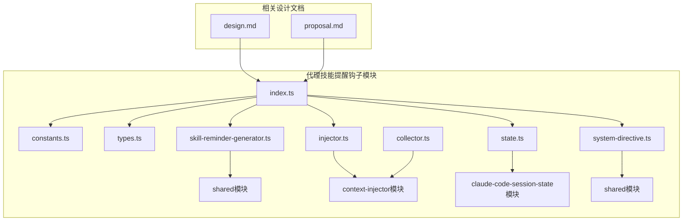
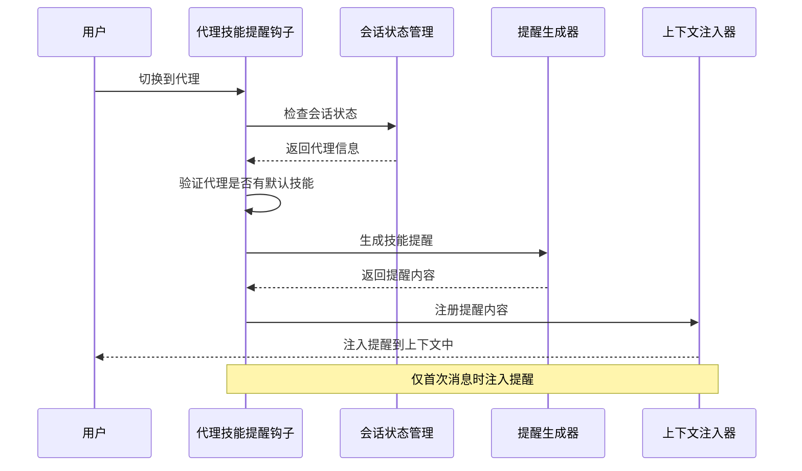
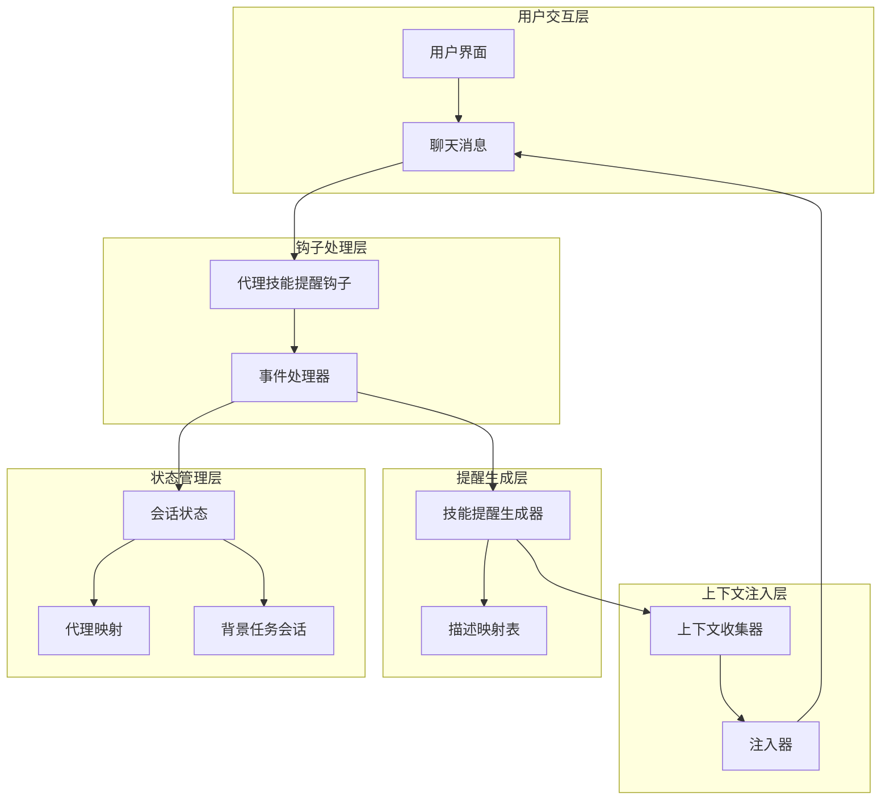
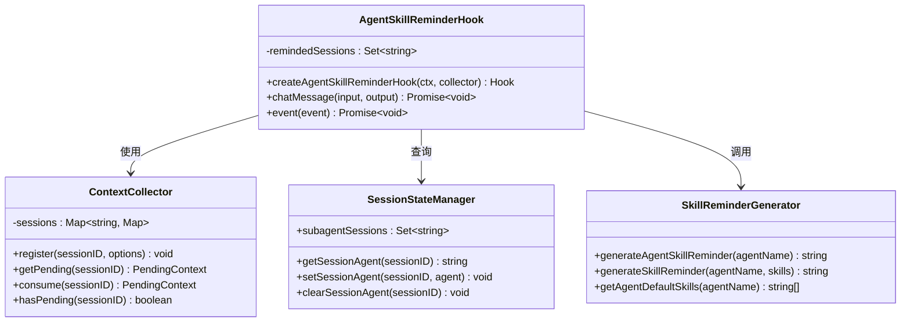
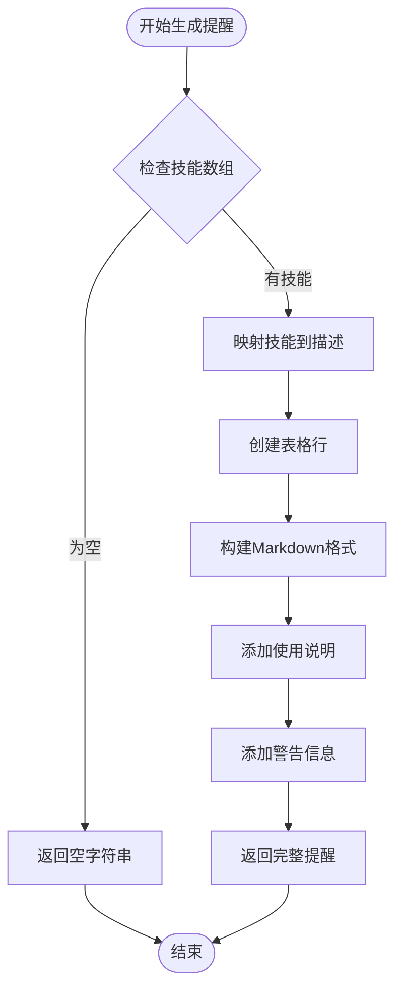
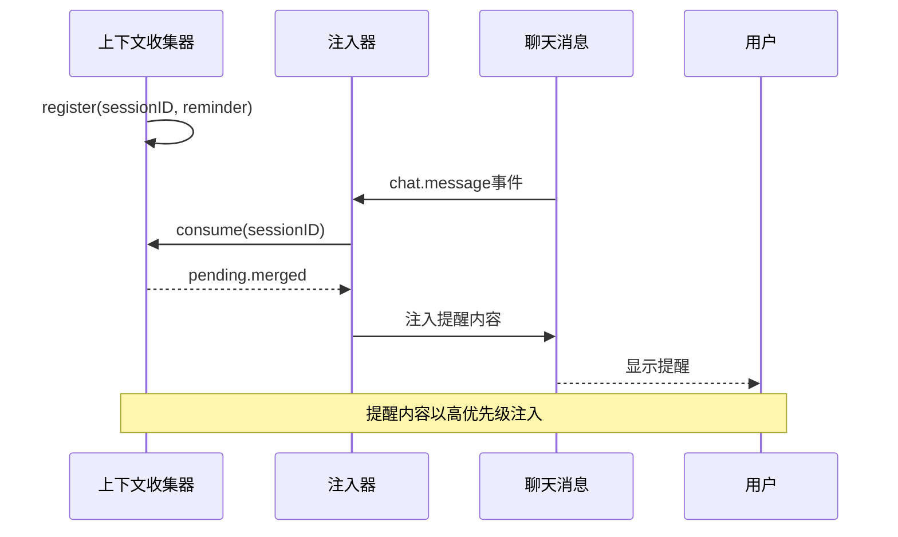
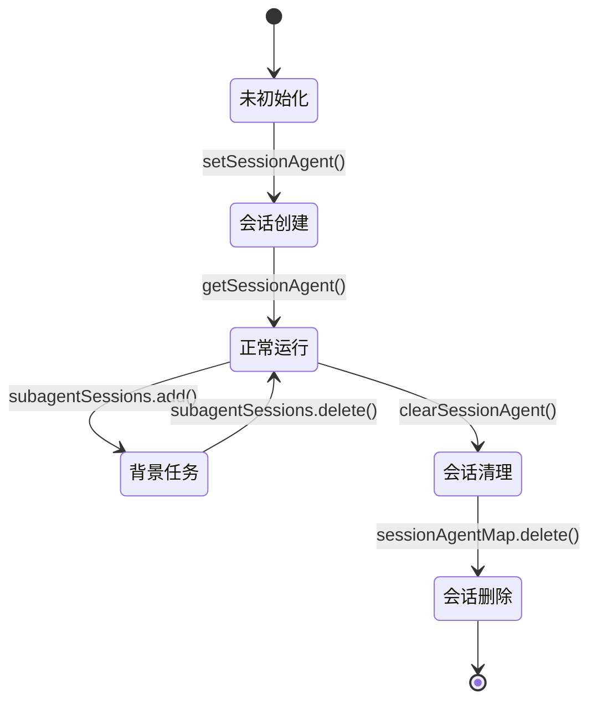
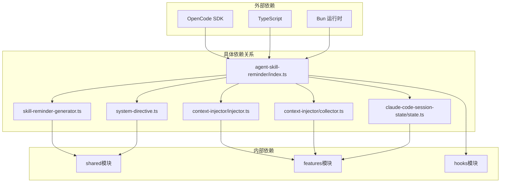

# 代理技能提醒钩子

<cite>
**本文档引用的文件**
- [src/hooks/agent-skill-reminder/index.ts](file://src/hooks/agent-skill-reminder/index.ts)
- [src/hooks/agent-skill-reminder/constants.ts](file://src/hooks/agent-skill-reminder/constants.ts)
- [src/hooks/agent-skill-reminder/types.ts](file://src/hooks/agent-skill-reminder/types.ts)
- [src/shared/skill-reminder-generator.ts](file://src/shared/skill-reminder-generator.ts)
- [src/features/context-injector/injector.ts](file://src/features/context-injector/injector.ts)
- [src/features/context-injector/collector.ts](file://src/features/context-injector/collector.ts)
- [src/features/claude-code-session-state/state.ts](file://src/features/claude-code-session-state/state.ts)
- [src/shared/system-directive.ts](file://src/shared/system-directive.ts)
- [changes/skill-reminder-system/design.md](file://changes/skill-reminder-system/design.md)
- [changes/skill-reminder-system/proposal.md](file://changes/skill-reminder-system/proposal.md)
</cite>

## 目录
1. [简介](#简介)
2. [项目结构](#项目结构)
3. [核心组件](#核心组件)
4. [架构概览](#架构概览)
5. [详细组件分析](#详细组件分析)
6. [依赖关系分析](#依赖关系分析)
7. [性能考虑](#性能考虑)
8. [故障排除指南](#故障排除指南)
9. [结论](#结论)

## 简介

代理技能提醒钩子（Agent Skill Reminder Hook）是 OpenCode 项目中的一个重要功能模块，旨在解决用户直接切换代理时绕过技能注入的问题。该系统实现了"提醒优于注入"的设计理念，通过智能检测用户会话状态，在合适的时机提供技能使用提醒，而不是直接注入完整的技能内容。

该钩子主要解决以下核心问题：
- 用户直接从界面切换到具有默认技能的代理时，技能内容被绕过
- 现有完整内容注入消耗大量上下文空间
- 缺乏技能工作流的连续性保障机制
- 执行模式选择缺乏用户确认

## 项目结构

代理技能提醒钩子位于 `src/hooks/agent-skill-reminder/` 目录下，包含以下核心文件：

**图表来源**
- [src/hooks/agent-skill-reminder/index.ts](file://src/hooks/agent-skill-reminder/index.ts#L1-L140)
- [src/hooks/agent-skill-reminder/constants.ts](file://src/hooks/agent-skill-reminder/constants.ts#L1-L18)
- [src/shared/skill-reminder-generator.ts](file://src/shared/skill-reminder-generator.ts#L1-L112)

**章节来源**
- [src/hooks/agent-skill-reminder/index.ts](file://src/hooks/agent-skill-reminder/index.ts#L1-L140)
- [src/hooks/agent-skill-reminder/constants.ts](file://src/hooks/agent-skill-reminder/constants.ts#L1-L18)
- [src/hooks/agent-skill-reminder/types.ts](file://src/hooks/agent-skill-reminder/types.ts#L1-L21)

## 核心组件

### 主要功能组件

代理技能提醒钩子由以下几个核心组件构成：

1. **主钩子处理器** (`index.ts`) - 核心业务逻辑处理
2. **常量配置** (`constants.ts`) - 定义具有默认技能的代理列表
3. **类型定义** (`types.ts`) - TypeScript 类型安全支持
4. **提醒生成器** (`skill-reminder-generator.ts`) - 统一的提醒内容生成
5. **上下文注入器** (`injector.ts`) - 处理提醒内容的注入
6. **会话状态管理** (`state.ts`) - 管理代理会话状态

### 设计决策

该系统采用了"提醒优于注入"的设计理念，这一决策基于以下考虑：

- **上下文效率**：避免注入完整的技能文档，减少 token 消耗
- **LLM 自主性**：让语言模型自主决定何时调用特定技能
- **工作流连续性**：通过提醒确保技能调用的连续性和完整性
- **用户体验**：提供及时、准确的技能使用指导

**章节来源**
- [src/shared/skill-reminder-generator.ts](file://src/shared/skill-reminder-generator.ts#L1-L112)
- [changes/skill-reminder-system/design.md](file://changes/skill-reminder-system/design.md#L66-L82)

## 架构概览

代理技能提醒钩子采用事件驱动的架构模式，通过监听聊天消息事件来触发技能提醒逻辑：

**图表来源**
- [src/hooks/agent-skill-reminder/index.ts](file://src/hooks/agent-skill-reminder/index.ts#L32-L139)
- [src/shared/skill-reminder-generator.ts](file://src/shared/skill-reminder-generator.ts#L85-L94)

### 系统架构层次

**图表来源**
- [src/features/claude-code-session-state/state.ts](file://src/features/claude-code-session-state/state.ts#L1-L38)
- [src/shared/skill-reminder-generator.ts](file://src/shared/skill-reminder-generator.ts#L14-L42)
- [src/features/context-injector/collector.ts](file://src/features/context-injector/collector.ts#L17-L83)

## 详细组件分析

### 主钩子处理器分析

主钩子处理器是整个系统的核心，负责协调各个组件的工作：

**图表来源**
- [src/hooks/agent-skill-reminder/index.ts](file://src/hooks/agent-skill-reminder/index.ts#L32-L139)
- [src/features/context-injector/collector.ts](file://src/features/context-injector/collector.ts#L17-L83)
- [src/features/claude-code-session-state/state.ts](file://src/features/claude-code-session-state/state.ts#L19-L37)

#### 核心处理流程

钩子处理器的核心逻辑遵循以下流程：

1. **会话状态检查**：验证会话是否已经接收过提醒
2. **背景任务过滤**：跳过后台代理任务会话
3. **代理信息获取**：获取当前会话的代理信息
4. **默认技能验证**：检查代理是否具有默认技能
5. **系统指令过滤**：跳过系统生成的消息
6. **提醒生成**：为代理生成技能提醒
7. **上下文注入**：将提醒注入到上下文中

**章节来源**
- [src/hooks/agent-skill-reminder/index.ts](file://src/hooks/agent-skill-reminder/index.ts#L40-L109)

### 技能提醒生成器

技能提醒生成器负责创建格式化的提醒内容，确保用户能够清楚地了解可用的技能：

**图表来源**
- [src/shared/skill-reminder-generator.ts](file://src/shared/skill-reminder-generator.ts#L58-L94)

#### 技能描述映射

系统维护了一个技能描述映射表，为每个技能提供清晰的使用指导：

| 技能名称 | 描述 | 使用场景 |
|---------|------|----------|
| brainstorming | 在创建任何计划之前探索用户意图、需求和设计 | 需求澄清阶段 |
| creating-changes | 在头脑风暴完成后编写 design.md 和 tasks.md | 计划制定阶段 |
| dispatching-parallel-agents | 当面对2个或更多独立任务时使用 | 并行处理场景 |
| codex-mcp-collaboration | 在分析、原型设计和变更后审查中强制Codex MCP协作 | 代码质量保证 |
| verification-before-completion | 在移交前验证交付物是否符合验收标准 | 质量控制阶段 |
| finishing-a-development-branch | 引导开发工作的完成并提供合并/PR/清理选项 | 项目收尾阶段 |

**章节来源**
- [src/shared/skill-reminder-generator.ts](file://src/shared/skill-reminder-generator.ts#L14-L42)

### 上下文注入机制

上下文注入器负责将提醒内容正确地插入到用户的聊天消息中：

**图表来源**
- [src/features/context-injector/injector.ts](file://src/features/context-injector/injector.ts#L17-L68)
- [src/features/context-injector/collector.ts](file://src/features/context-injector/collector.ts#L20-L65)

#### 注入策略

上下文注入采用以下策略确保提醒的有效性：

1. **优先级排序**：提醒内容以高优先级插入
2. **时间戳控制**：按时间顺序处理多个提醒
3. **内容合并**：将多个提醒内容合并为单一文本
4. **位置优化**：将提醒插入到用户消息的开头

**章节来源**
- [src/features/context-injector/injector.ts](file://src/features/context-injector/injector.ts#L17-L68)
- [src/features/context-injector/collector.ts](file://src/features/context-injector/collector.ts#L76-L82)

### 会话状态管理

会话状态管理器负责跟踪代理会话的状态，确保提醒逻辑的正确执行：

**图表来源**
- [src/features/claude-code-session-state/state.ts](file://src/features/claude-code-session-state/state.ts#L19-L37)

#### 状态跟踪机制

系统通过多种机制跟踪会话状态：

1. **会话ID集合**：跟踪已接收提醒的会话
2. **代理映射**：维护会话到代理的映射关系
3. **背景任务标识**：区分普通会话和后台任务会话
4. **事件清理**：在会话删除或压缩时清理状态

**章节来源**
- [src/features/claude-code-session-state/state.ts](file://src/features/claude-code-session-state/state.ts#L1-L38)

## 依赖关系分析

代理技能提醒钩子与其他系统组件存在密切的依赖关系：

**图表来源**
- [src/hooks/agent-skill-reminder/index.ts](file://src/hooks/agent-skill-reminder/index.ts#L12-L24)
- [src/shared/skill-reminder-generator.ts](file://src/shared/skill-reminder-generator.ts#L12)

### 关键依赖组件

1. **OpenCode SDK**：提供插件输入输出接口
2. **共享模块**：提供通用工具函数和类型定义
3. **特性模块**：提供特定功能的实现
4. **钩子模块**：组织和管理各种钩子功能

### 循环依赖检查

经过分析，该模块不存在循环依赖问题：
- 主钩子模块仅依赖共享和特性模块
- 共享模块不依赖钩子模块
- 特性模块提供状态管理，不依赖钩子模块

**章节来源**
- [src/hooks/agent-skill-reminder/index.ts](file://src/hooks/agent-skill-reminder/index.ts#L12-L24)

## 性能考虑

代理技能提醒钩子在设计时充分考虑了性能优化：

### 上下文效率优化

1. **提醒替代注入**：使用简短的提醒文本替代完整的技能文档
2. **条件注入**：仅在必要时进行上下文注入
3. **会话去重**：避免重复提醒同一会话

### 内存管理

1. **会话状态清理**：在会话删除时自动清理内存
2. **优先级队列**：高效的提醒内容排序机制
3. **时间戳控制**：按时间顺序处理多个提醒

### 处理效率

1. **异步处理**：所有钩子操作都是异步的
2. **事件驱动**：基于事件触发，避免轮询开销
3. **缓存机制**：代理默认技能的缓存访问

## 故障排除指南

### 常见问题及解决方案

#### 问题1：提醒没有显示

**可能原因**：
- 代理不在默认技能列表中
- 会话已经被提醒过
- 消息是系统指令

**解决方案**：
1. 检查代理名称是否在 `AGENTS_WITH_DEFAULT_SKILLS` 列表中
2. 确认会话ID是否正确传递
3. 验证消息内容不是系统指令

#### 问题2：提醒重复出现

**可能原因**：
- 会话状态没有正确清理
- 多个钩子同时注册提醒

**解决方案**：
1. 检查会话删除事件处理
2. 确认 `remindedSessions` 集合的清理逻辑

#### 问题3：上下文注入失败

**可能原因**：
- 上下文收集器没有内容
- 文本部分不存在
- 会话ID获取失败

**解决方案**：
1. 验证 `collector.hasPending(sessionID)` 返回值
2. 检查 `injectPendingContext` 函数的执行结果
3. 确认会话ID的正确性

### 调试技巧

1. **日志分析**：利用 `log` 函数查看详细的执行信息
2. **状态检查**：监控 `remindedSessions` 和 `subagentSessions` 集合
3. **事件追踪**：监听 `session.deleted` 和 `session.compacted` 事件

**章节来源**
- [src/hooks/agent-skill-reminder/index.ts](file://src/hooks/agent-skill-reminder/index.ts#L78-L83)
- [src/hooks/agent-skill-reminder/index.ts](file://src/hooks/agent-skill-reminder/index.ts#L121-L136)

## 结论

代理技能提醒钩子成功实现了"提醒优于注入"的设计理念，有效解决了用户直接切换代理时的技能注入问题。该系统具有以下优势：

1. **高效性**：显著减少了上下文消耗，提高了系统响应速度
2. **灵活性**：允许语言模型自主决定技能调用时机
3. **可维护性**：清晰的模块化设计便于维护和扩展
4. **用户体验**：提供了及时、准确的技能使用指导

通过智能的状态管理和事件驱动的架构，该系统能够在不影响用户体验的前提下，确保技能工作流的连续性和完整性。未来可以进一步优化提醒内容的个性化和智能化，为用户提供更加精准的技能指导。