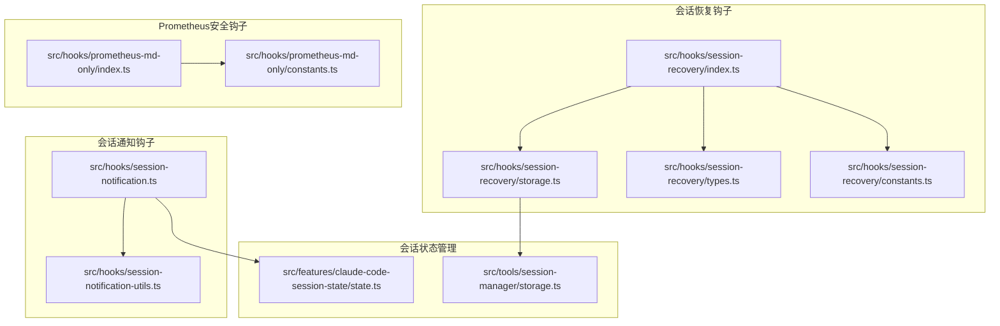
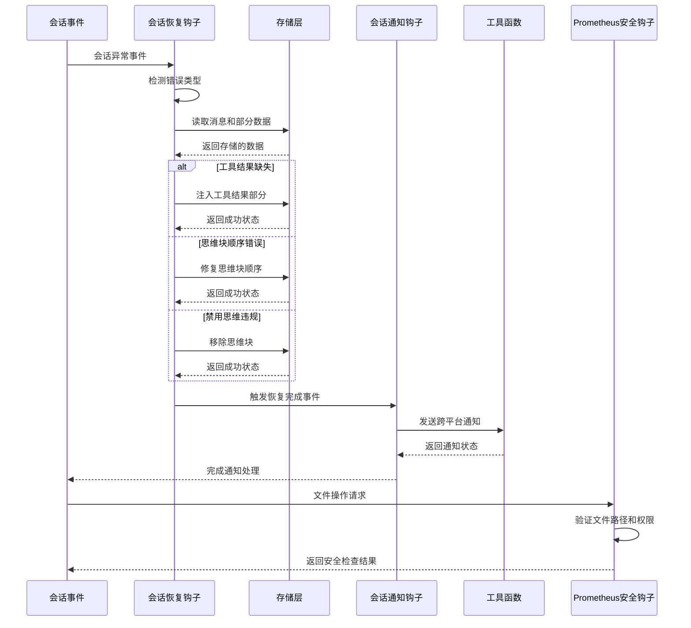
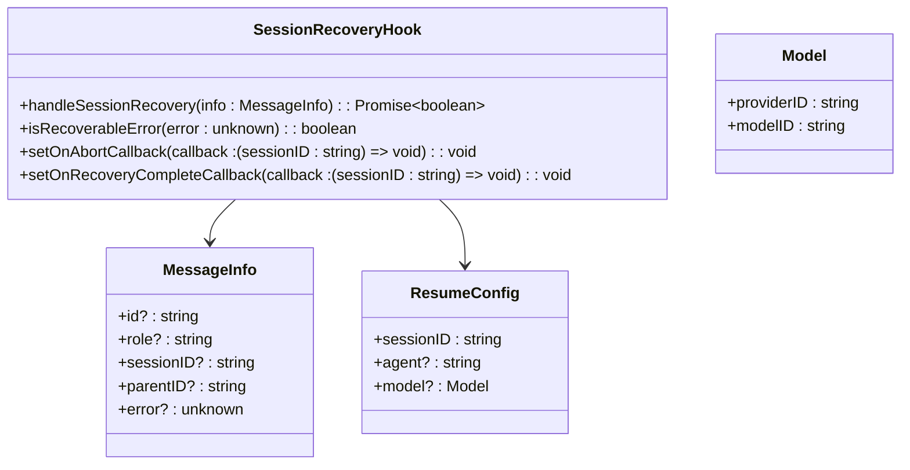
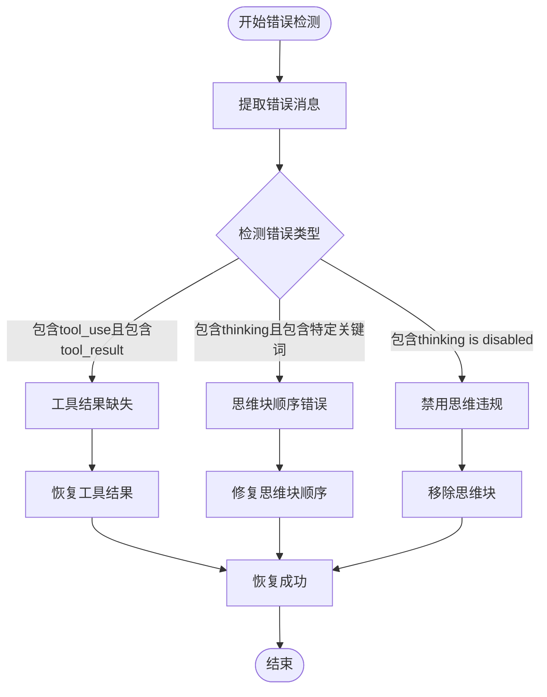
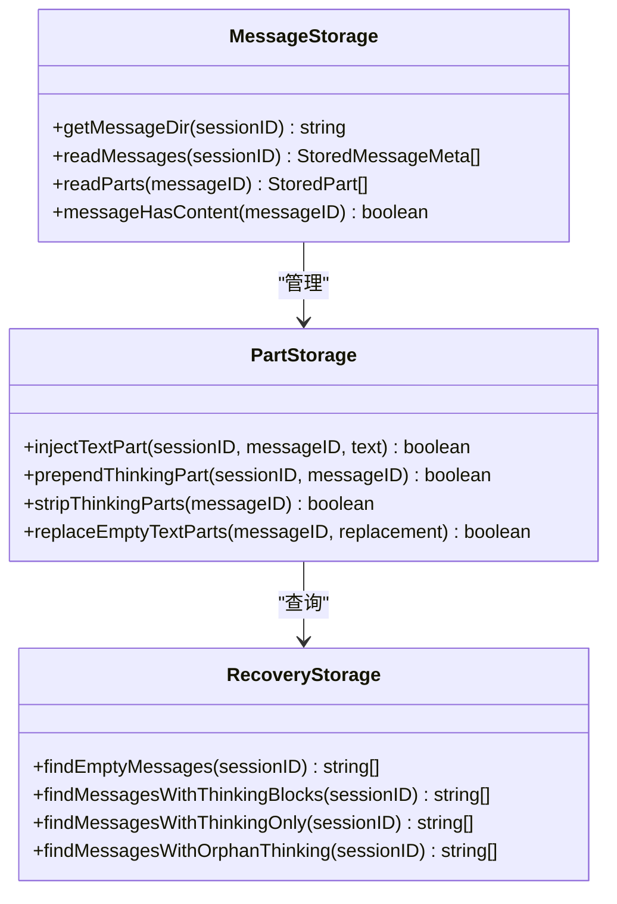
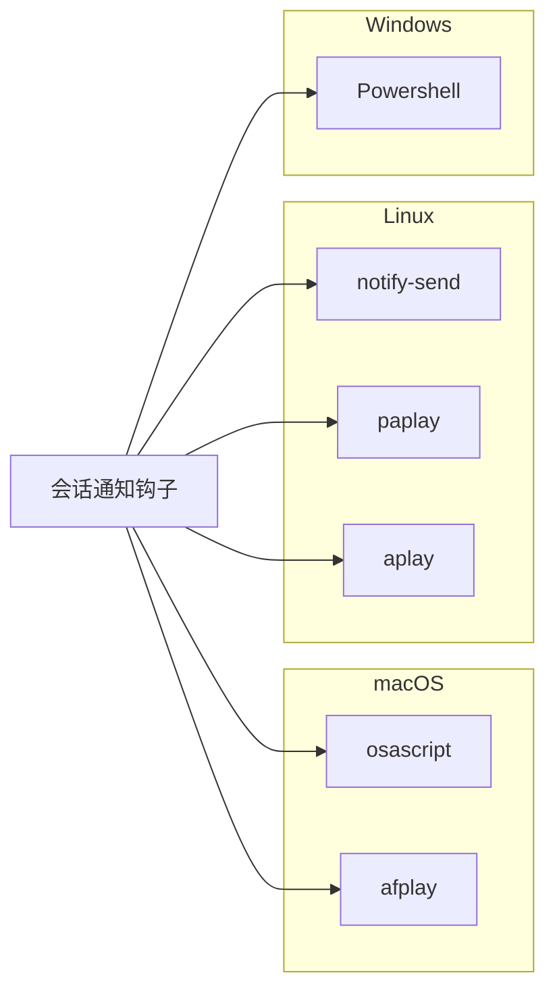
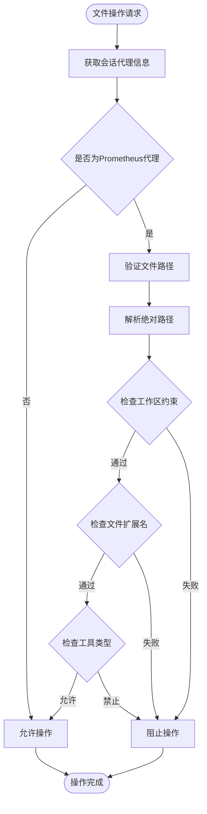
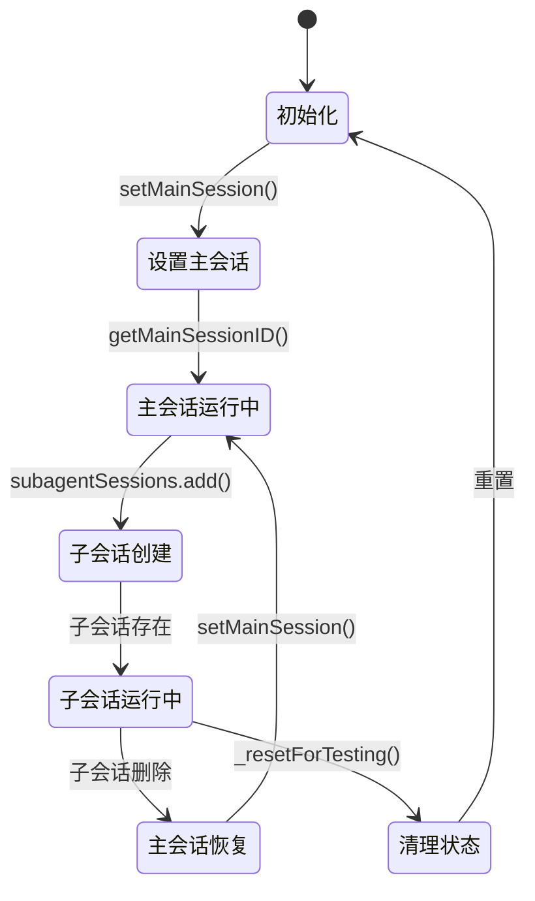
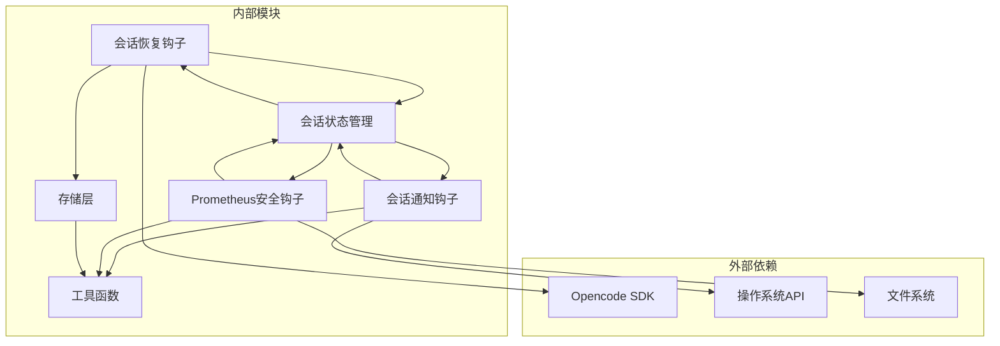

# 会话管理钩子

<cite>
**本文档引用的文件**
- [src/hooks/session-recovery/index.ts](file://src/hooks/session-recovery/index.ts)
- [src/hooks/session-recovery/storage.ts](file://src/hooks/session-recovery/storage.ts)
- [src/hooks/session-recovery/types.ts](file://src/hooks/session-recovery/types.ts)
- [src/hooks/session-recovery/constants.ts](file://src/hooks/session-recovery/constants.ts)
- [src/hooks/session-notification.ts](file://src/hooks/session-notification.ts)
- [src/hooks/session-notification-utils.ts](file://src/hooks/session-notification-utils.ts)
- [src/features/claude-code-session-state/state.ts](file://src/features/claude-code-session-state/state.ts)
- [src/tools/session-manager/storage.ts](file://src/tools/session-manager/storage.ts)
- [src/hooks/session-recovery/index.test.ts](file://src/hooks/session-recovery/index.test.ts)
- [src/hooks/session-notification.test.ts](file://src/hooks/session-notification.test.ts)
- [src/hooks/prometheus-md-only/index.ts](file://src/hooks/prometheus-md-only/index.ts)
- [src/hooks/prometheus-md-only/constants.ts](file://src/hooks/prometheus-md-only/constants.ts)
</cite>

## 更新摘要
**变更内容**
- 更新了会话恢复钩子的类型签名和接口定义
- 改进了参数处理机制和错误检测逻辑
- 优化了prometheus-md-only钩子的目录结构兼容性
- 增强了跨平台路径验证和文件写入安全检查

## 目录
1. [简介](#简介)
2. [项目结构](#项目结构)
3. [核心组件](#核心组件)
4. [架构概览](#架构概览)
5. [详细组件分析](#详细组件分析)
6. [依赖关系分析](#依赖关系分析)
7. [性能考虑](#性能考虑)
8. [故障排除指南](#故障排除指南)
9. [结论](#结论)

## 简介

Oh My OpenCode 的会话管理钩子系统提供了完整的会话生命周期管理能力，包括会话恢复、状态管理和通知机制。该系统通过两个主要钩子模块实现了智能的会话异常处理和用户通知功能。

会话管理钩子系统的核心目标是：
- 自动检测和恢复会话中的异常状态
- 提供跨平台的通知机制
- 维护会话状态的一致性和完整性
- 支持复杂的会话场景（主会话、子代理会话等）

**更新** 系统现已支持更完善的类型签名和参数处理机制，增强了跨平台兼容性和安全性。

## 项目结构

会话管理钩子系统主要分布在以下目录中：

**图表来源**
- [src/hooks/session-recovery/index.ts](file://src/hooks/session-recovery/index.ts#L1-L50)
- [src/hooks/session-notification.ts](file://src/hooks/session-notification.ts#L1-L30)
- [src/features/claude-code-session-state/state.ts](file://src/features/claude-code-session-state/state.ts#L1-L20)
- [src/hooks/prometheus-md-only/index.ts](file://src/hooks/prometheus-md-only/index.ts#L1-L10)

**章节来源**
- [src/hooks/session-recovery/index.ts](file://src/hooks/session-recovery/index.ts#L1-L50)
- [src/hooks/session-notification.ts](file://src/hooks/session-notification.ts#L1-L30)
- [src/hooks/prometheus-md-only/index.ts](file://src/hooks/prometheus-md-only/index.ts#L1-L10)

## 核心组件

会话管理钩子系统由四个核心组件构成：

### 1. 会话恢复钩子 (Session Recovery Hook)
负责自动检测和恢复会话中的各种异常状态，包括工具结果缺失、思维块顺序错误、禁用思维违规等情况。

### 2. 会话通知钩子 (Session Notification Hook)
提供跨平台的会话状态通知功能，支持桌面通知和声音提醒。

### 3. 会话状态管理
维护会话的全局状态信息，包括主会话标识、子代理会话集合等。

### 4. Prometheus安全钩子
提供文件写入安全检查，确保Prometheus规划器只能访问和修改指定目录的Markdown文件。

**更新** 新增了Prometheus安全钩子，增强了文件操作的安全性。

**章节来源**
- [src/hooks/session-recovery/index.ts](file://src/hooks/session-recovery/index.ts#L314-L432)
- [src/hooks/session-notification.ts](file://src/hooks/session-notification.ts#L142-L330)
- [src/features/claude-code-session-state/state.ts](file://src/features/claude-code-session-state/state.ts#L1-L38)
- [src/hooks/prometheus-md-only/index.ts](file://src/hooks/prometheus-md-only/index.ts#L77-L136)

## 架构概览

会话管理钩子系统采用事件驱动的架构模式，通过监听会话事件来执行相应的处理逻辑：

**图表来源**
- [src/hooks/session-recovery/index.ts](file://src/hooks/session-recovery/index.ts#L339-L424)
- [src/hooks/session-notification.ts](file://src/hooks/session-notification.ts#L206-L258)
- [src/hooks/prometheus-md-only/index.ts](file://src/hooks/prometheus-md-only/index.ts#L114-L126)

## 详细组件分析

### 会话恢复钩子分析

#### 类型签名和接口改进

会话恢复钩子现在使用更完善的类型系统：

**图表来源**
- [src/hooks/session-recovery/index.ts](file://src/hooks/session-recovery/index.ts#L20-L38)
- [src/hooks/session-recovery/index.ts](file://src/hooks/session-recovery/index.ts#L314-L319)
- [src/hooks/session-recovery/types.ts](file://src/hooks/session-recovery/types.ts#L65-L99)

#### 错误检测机制

会话恢复钩子实现了智能的错误检测系统，能够识别三种主要的会话异常类型：

**图表来源**
- [src/hooks/session-recovery/index.ts](file://src/hooks/session-recovery/index.ts#L125-L149)

#### 恢复策略实现

每种错误类型都有专门的恢复策略：

1. **工具结果缺失恢复**
   - 从API部分或文件系统读取工具调用信息
   - 为每个工具调用注入取消的工具结果
   - 使用标准的工具结果格式

2. **思维块顺序错误修复**
   - 从之前的助手消息中提取思维内容
   - 在消息开头插入适当的思维块
   - 支持从先前的推理中继承内容

3. **禁用思维违规处理**
   - 识别包含思维块的消息
   - 移除所有思维类型的部分内容
   - 保持其他内容不变

**章节来源**
- [src/hooks/session-recovery/index.ts](file://src/hooks/session-recovery/index.ts#L155-L307)

#### 存储层设计

会话恢复钩子使用两级存储结构来管理会话数据：

**图表来源**
- [src/hooks/session-recovery/storage.ts](file://src/hooks/session-recovery/storage.ts#L30-L94)
- [src/hooks/session-recovery/storage.ts](file://src/hooks/session-recovery/storage.ts#L121-L182)

**章节来源**
- [src/hooks/session-recovery/storage.ts](file://src/hooks/session-recovery/storage.ts#L1-L391)

### 会话通知钩子分析

#### 跨平台通知机制

会话通知钩子实现了完整的跨平台通知系统，支持 macOS、Linux 和 Windows：

**图表来源**
- [src/hooks/session-notification.ts](file://src/hooks/session-notification.ts#L55-L129)
- [src/hooks/session-notification-utils.ts](file://src/hooks/session-notification-utils.ts#L129-L140)

#### 通知触发条件

通知系统具有智能的触发和去重机制：

1. **空闲确认延迟**：默认1500ms，确保会话真正空闲
2. **活动检测**：监听会话活动事件来取消待处理的通知
3. **子会话过滤**：仅通知主会话，忽略子代理会话
4. **重复保护**：防止同一会话的重复通知

**章节来源**
- [src/hooks/session-notification.ts](file://src/hooks/session-notification.ts#L142-L330)

#### 配置选项

会话通知钩子支持丰富的配置选项：

| 配置项 | 类型 | 默认值 | 描述 |
|--------|------|--------|------|
| title | string | "OpenCode" | 通知标题 |
| message | string | "Agent is ready for input" | 通知消息 |
| playSound | boolean | false | 是否播放声音 |
| soundPath | string | 平台默认路径 | 声音文件路径 |
| idleConfirmationDelay | number | 1500 | 空闲确认延迟(ms) |
| skipIfIncompleteTodos | boolean | true | 有未完成任务时跳过通知 |
| maxTrackedSessions | number | 100 | 最大跟踪会话数 |

**章节来源**
- [src/hooks/session-notification.ts](file://src/hooks/session-notification.ts#L21-L32)

### Prometheus安全钩子分析

#### 目录结构兼容性改进

Prometheus安全钩子提供了增强的文件操作安全检查：

**图表来源**
- [src/hooks/prometheus-md-only/index.ts](file://src/hooks/prometheus-md-only/index.ts#L114-L126)

#### 路径验证机制

改进的路径验证系统支持多种平台特性：

1. **跨平台路径解析**：使用 `resolve/relative` 替代字符串匹配
2. **混合分隔符支持**：处理 Windows 反斜杠和 Unix 斜杠
3. **大小写不敏感匹配**：支持不同大小写的文件扩展名
4. **工作区约束检查**：防止路径逃逸到工作区根目录之外
5. **嵌套路径支持**：支持多级目录结构如 `changes/name/tasks.md`

**章节来源**
- [src/hooks/prometheus-md-only/index.ts](file://src/hooks/prometheus-md-only/index.ts#L21-L49)

#### 安全配置

Prometheus安全钩子的配置选项：

| 配置项 | 类型 | 默认值 | 描述 |
|--------|------|--------|------|
| PROMETHEUS_AGENTS | string[] | ["Prometheus (Planner)"] | 允许的安全代理列表 |
| ALLOWED_EXTENSIONS | string[] | [".md"] | 允许的文件扩展名 |
| ALLOWED_PATH_PREFIXES | string[] | ["changes"] | 允许的路径前缀 |
| BLOCKED_TOOLS | string[] | ["Write", "Edit", "write", "edit"] | 禁止的工具列表 |

**章节来源**
- [src/hooks/prometheus-md-only/constants.ts](file://src/hooks/prometheus-md-only/constants.ts#L5-L11)

### 会话状态管理

#### 主会话和子会话管理

系统通过全局状态管理器维护会话关系：

**图表来源**
- [src/features/claude-code-session-state/state.ts](file://src/features/claude-code-session-state/state.ts#L1-L38)

**章节来源**
- [src/features/claude-code-session-state/state.ts](file://src/features/claude-code-session-state/state.ts#L1-L38)

## 依赖关系分析

会话管理钩子系统具有清晰的依赖层次结构：

**图表来源**
- [src/hooks/session-recovery/index.ts](file://src/hooks/session-recovery/index.ts#L1-L25)
- [src/hooks/session-notification.ts](file://src/hooks/session-notification.ts#L1-L15)
- [src/hooks/prometheus-md-only/index.ts](file://src/hooks/prometheus-md-only/index.ts#L1-L10)

**章节来源**
- [src/hooks/session-recovery/index.ts](file://src/hooks/session-recovery/index.ts#L1-L25)
- [src/hooks/session-notification.ts](file://src/hooks/session-notification.ts#L1-L15)
- [src/hooks/prometheus-md-only/index.ts](file://src/hooks/prometheus-md-only/index.ts#L1-L10)

## 性能考虑

会话管理钩子系统在设计时充分考虑了性能优化：

### 存储访问优化
- 使用内存缓存减少文件系统访问
- 批量操作避免频繁的文件I/O
- 异步操作不阻塞主线程

### 内存管理
- 限制跟踪的会话数量（默认100个）
- 及时清理过期的会话状态
- 使用Set和Map进行高效的数据查找

### 并发控制
- 防止重复的恢复操作
- 使用版本号机制处理竞态条件
- 合理的超时和重试机制

### 安全检查优化
- 缓存命令路径查找结果
- 异步预检平台支持
- 避免重复的文件系统检查

## 故障排除指南

### 常见问题及解决方案

#### 会话恢复失败
**症状**：会话异常但无法自动恢复
**可能原因**：
1. 存储文件损坏或缺失
2. 权限不足导致文件写入失败
3. SDK连接异常

**解决步骤**：
1. 检查存储目录权限
2. 验证SDK连接状态
3. 查看详细的错误日志

#### 通知不显示
**症状**：会话空闲但没有收到通知
**可能原因**：
1. 子会话被过滤
2. 有未完成的任务
3. 系统通知权限未授权

**解决步骤**：
1. 确认当前会话为主会话
2. 检查任务完成状态
3. 授权系统通知权限

#### Prometheus文件操作被拒绝
**症状**：Prometheus尝试修改文件但被阻止
**可能原因**：
1. 文件路径不在允许的目录范围内
2. 文件扩展名不在允许列表中
3. 使用了被禁止的工具

**解决步骤**：
1. 确认文件位于 `changes/` 目录下
2. 检查文件扩展名为 `.md`
3. 使用 `/start-work` 命令执行计划

#### 性能问题
**症状**：系统响应缓慢
**可能原因**：
1. 追踪的会话过多
2. 存储访问频繁
3. 并发操作冲突

**解决步骤**：
1. 调整maxTrackedSessions配置
2. 检查存储访问频率
3. 优化并发操作

**章节来源**
- [src/hooks/session-recovery/index.test.ts](file://src/hooks/session-recovery/index.test.ts#L1-L204)
- [src/hooks/session-notification.test.ts](file://src/hooks/session-notification.test.ts#L1-L362)

## 结论

Oh My OpenCode 的会话管理钩子系统提供了完整而强大的会话生命周期管理能力。通过智能的错误检测、灵活的恢复策略和跨平台的通知机制，该系统能够有效提升用户的开发体验。

### 主要优势
- **自动化程度高**：能够自动检测和恢复多种会话异常
- **跨平台兼容**：支持macOS、Linux和Windows平台
- **可扩展性强**：模块化设计便于功能扩展
- **性能优化**：合理的内存管理和并发控制
- **安全性增强**：新增Prometheus安全钩子，防止意外文件修改

### 未来改进方向
- 增加更多的错误类型支持
- 提供更详细的诊断信息
- 优化存储性能
- 增强用户自定义能力
- 扩展安全检查范围

该系统为复杂开发场景下的会话管理提供了可靠的基础设施，是Oh My OpenCode项目的重要组成部分。