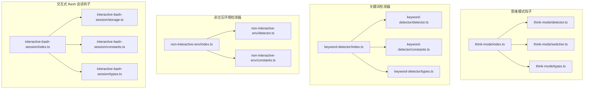
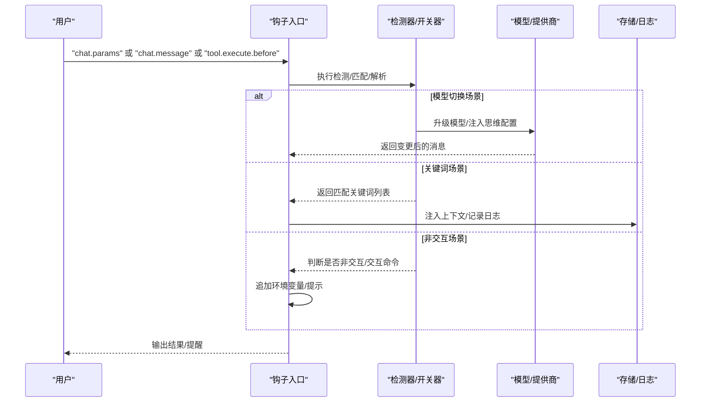
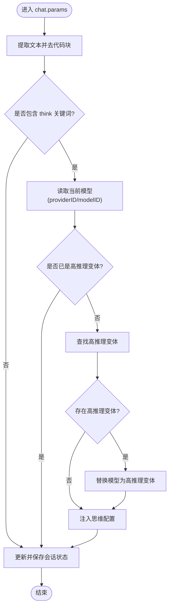
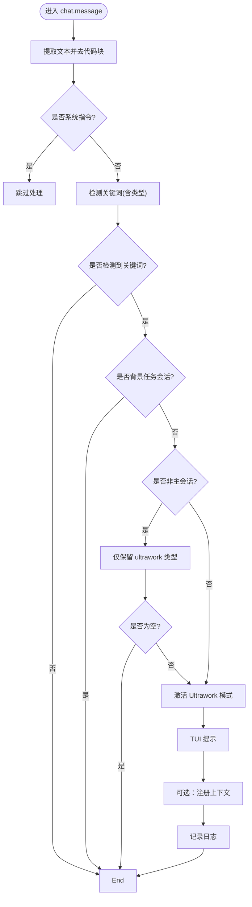
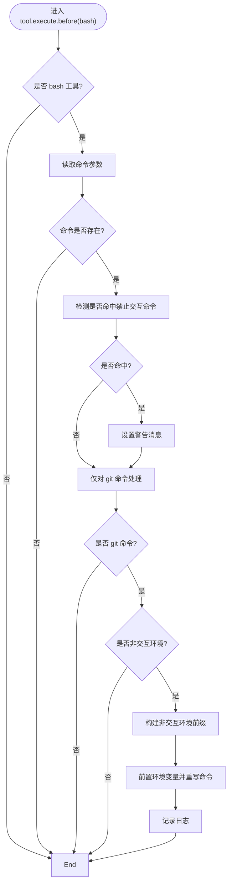
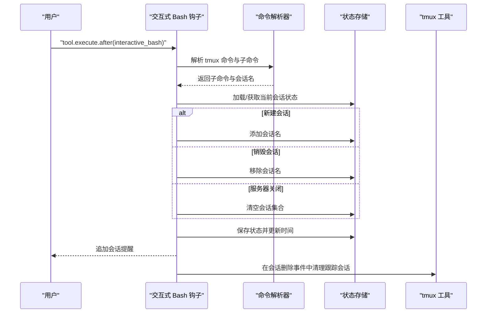
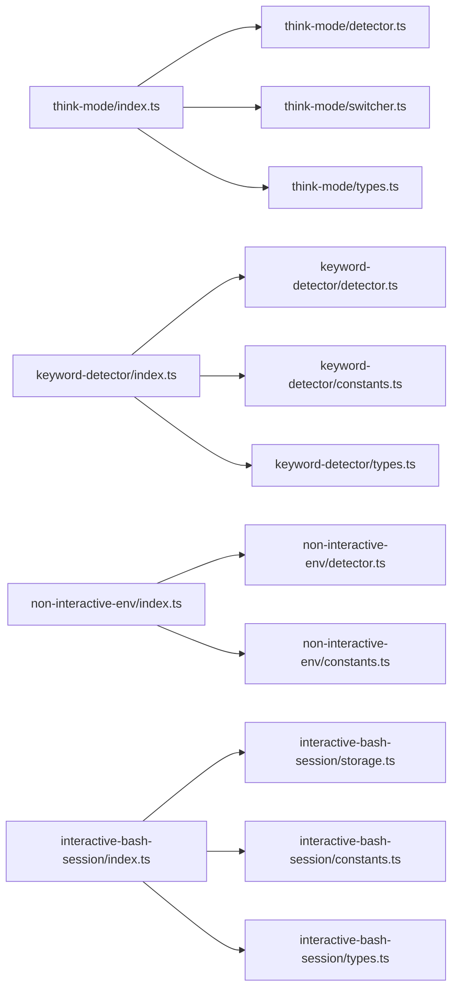

# 实用工具钩子

<cite>
**本文引用的文件**
- [src/hooks/think-mode/index.ts](file://src/hooks/think-mode/index.ts)
- [src/hooks/think-mode/detector.ts](file://src/hooks/think-mode/detector.ts)
- [src/hooks/think-mode/switcher.ts](file://src/hooks/think-mode/switcher.ts)
- [src/hooks/think-mode/types.ts](file://src/hooks/think-mode/types.ts)
- [src/hooks/keyword-detector/index.ts](file://src/hooks/keyword-detector/index.ts)
- [src/hooks/keyword-detector/detector.ts](file://src/hooks/keyword-detector/detector.ts)
- [src/hooks/keyword-detector/constants.ts](file://src/hooks/keyword-detector/constants.ts)
- [src/hooks/keyword-detector/types.ts](file://src/hooks/keyword-detector/types.ts)
- [src/hooks/non-interactive-env/index.ts](file://src/hooks/non-interactive-env/index.ts)
- [src/hooks/non-interactive-env/detector.ts](file://src/hooks/non-interactive-env/detector.ts)
- [src/hooks/non-interactive-env/constants.ts](file://src/hooks/non-interactive-env/constants.ts)
- [src/hooks/interactive-bash-session/index.ts](file://src/hooks/interactive-bash-session/index.ts)
- [src/hooks/interactive-bash-session/storage.ts](file://src/hooks/interactive-bash-session/storage.ts)
- [src/hooks/interactive-bash-session/constants.ts](file://src/hooks/interactive-bash-session/constants.ts)
- [src/hooks/interactive-bash-session/types.ts](file://src/hooks/interactive-bash-session/types.ts)
</cite>

## 目录
1. [简介](#简介)
2. [项目结构](#项目结构)
3. [核心组件](#核心组件)
4. [架构总览](#架构总览)
5. [详细组件分析](#详细组件分析)
6. [依赖关系分析](#依赖关系分析)
7. [性能考量](#性能考量)
8. [故障排查指南](#故障排查指南)
9. [结论](#结论)
10. [附录：配置与使用场景](#附录配置与使用场景)

## 简介
本文件系统性梳理 Oh My OpenCode 中“实用工具钩子”的实现与工作机制，重点覆盖以下能力：
- 思维模式钩子：关键词触发、模型切换与思维配置注入、会话状态管理与清理
- 关键词检测器：多语言关键词匹配、模式识别、响应触发与上下文注入
- 非交互环境检测器：环境识别、交互命令拦截与非交互适配策略
- 交互式 Bash 会话钩子：tmux 会话管理、命令解析与状态跟踪、会话提醒与清理

## 项目结构
这些钩子以“按功能域分层”的方式组织在 src/hooks 下，每个钩子模块包含入口、检测/开关逻辑、类型定义与常量等文件，便于独立扩展与测试。

图表来源
- [src/hooks/think-mode/index.ts](file://src/hooks/think-mode/index.ts#L1-L90)
- [src/hooks/think-mode/detector.ts](file://src/hooks/think-mode/detector.ts#L1-L58)
- [src/hooks/think-mode/switcher.ts](file://src/hooks/think-mode/switcher.ts#L1-L223)
- [src/hooks/think-mode/types.ts](file://src/hooks/think-mode/types.ts#L1-L22)
- [src/hooks/keyword-detector/index.ts](file://src/hooks/keyword-detector/index.ts#L1-L101)
- [src/hooks/keyword-detector/detector.ts](file://src/hooks/keyword-detector/detector.ts#L1-L53)
- [src/hooks/keyword-detector/constants.ts](file://src/hooks/keyword-detector/constants.ts#L1-L276)
- [src/hooks/keyword-detector/types.ts](file://src/hooks/keyword-detector/types.ts#L1-L5)
- [src/hooks/non-interactive-env/index.ts](file://src/hooks/non-interactive-env/index.ts#L1-L64)
- [src/hooks/non-interactive-env/detector.ts](file://src/hooks/non-interactive-env/detector.ts#L1-L20)
- [src/hooks/non-interactive-env/constants.ts](file://src/hooks/non-interactive-env/constants.ts#L1-L71)
- [src/hooks/interactive-bash-session/index.ts](file://src/hooks/interactive-bash-session/index.ts#L1-L263)
- [src/hooks/interactive-bash-session/storage.ts](file://src/hooks/interactive-bash-session/storage.ts#L1-L60)
- [src/hooks/interactive-bash-session/constants.ts](file://src/hooks/interactive-bash-session/constants.ts#L1-L16)
- [src/hooks/interactive-bash-session/types.ts](file://src/hooks/interactive-bash-session/types.ts#L1-L12)

章节来源
- [src/hooks/think-mode/index.ts](file://src/hooks/think-mode/index.ts#L1-L90)
- [src/hooks/keyword-detector/index.ts](file://src/hooks/keyword-detector/index.ts#L1-L101)
- [src/hooks/non-interactive-env/index.ts](file://src/hooks/non-interactive-env/index.ts#L1-L64)
- [src/hooks/interactive-bash-session/index.ts](file://src/hooks/interactive-bash-session/index.ts#L1-L263)

## 核心组件
- 思维模式钩子：在聊天参数阶段检测“think”类关键词，必要时将模型升级到高推理变体并注入对应提供商的思维配置；同时维护每会话的状态并在会话删除事件中清理。
- 关键词检测器：在消息阶段对用户输入进行关键词匹配，支持多语言；根据会话主从关系与关键词类型决定是否提升到“ultrawork”模式并注入上下文；可向上下文收集器注册关键词信息。
- 非交互环境检测器：在工具执行前拦截 bash 命令，识别交互式命令并给出警告；对 git 命令在非交互环境中自动前置非交互环境变量，避免阻塞。
- 交互式 Bash 会话钩子：解析 tmux 命令，跟踪 omo- 前缀会话的创建/销毁/服务器关闭；持久化状态并在工具输出后追加会话提醒；在会话删除事件中清理所有跟踪会话。

章节来源
- [src/hooks/think-mode/index.ts](file://src/hooks/think-mode/index.ts#L16-L89)
- [src/hooks/keyword-detector/index.ts](file://src/hooks/keyword-detector/index.ts#L12-L100)
- [src/hooks/non-interactive-env/index.ts](file://src/hooks/non-interactive-env/index.ts#L23-L63)
- [src/hooks/interactive-bash-session/index.ts](file://src/hooks/interactive-bash-session/index.ts#L149-L262)

## 架构总览
下图展示钩子在生命周期事件中的调用关系与数据流：

图表来源
- [src/hooks/think-mode/index.ts](file://src/hooks/think-mode/index.ts#L18-L78)
- [src/hooks/think-mode/detector.ts](file://src/hooks/think-mode/detector.ts#L45-L57)
- [src/hooks/think-mode/switcher.ts](file://src/hooks/think-mode/switcher.ts#L164-L222)
- [src/hooks/keyword-detector/index.ts](file://src/hooks/keyword-detector/index.ts#L25-L98)
- [src/hooks/non-interactive-env/index.ts](file://src/hooks/non-interactive-env/index.ts#L25-L61)

## 详细组件分析

### 思维模式钩子（Think Mode）
- 触发条件：在聊天参数阶段提取文本，去除代码块后检测“think/ultrathink”等关键词。
- 切换机制：
  - 若当前模型已是高推理变体则跳过。
  - 否则查找高推理变体映射并替换模型引用。
  - 根据提供商与模型能力注入对应的思维配置（如 Anthropic 的 thinking、Google 的 thinkingLevel、OpenAI 的 reasoning_effort 等）。
- 状态管理：以 Map 维护每会话的请求标记、模型是否已切换、是否已注入思维配置；在会话删除事件中清理。
- 复杂度：检测与映射均为线性扫描，整体 O(n)；Map 访问为均摊 O(1)。

图表来源
- [src/hooks/think-mode/index.ts](file://src/hooks/think-mode/index.ts#L18-L78)
- [src/hooks/think-mode/detector.ts](file://src/hooks/think-mode/detector.ts#L45-L57)
- [src/hooks/think-mode/switcher.ts](file://src/hooks/think-mode/switcher.ts#L164-L222)

章节来源
- [src/hooks/think-mode/index.ts](file://src/hooks/think-mode/index.ts#L16-L89)
- [src/hooks/think-mode/detector.ts](file://src/hooks/think-mode/detector.ts#L1-L58)
- [src/hooks/think-mode/switcher.ts](file://src/hooks/think-mode/switcher.ts#L1-L223)
- [src/hooks/think-mode/types.ts](file://src/hooks/think-mode/types.ts#L1-L22)

### 关键词检测器（Keyword Detector）
- 匹配策略：对文本去除代码块后，使用一组正则表达式匹配多语言关键词（ultrawork/search/analyze/brainstorm/consult-metis），支持动态消息生成。
- 响应触发：
  - 当检测到 ultrawork 且当前会话为主会话或非主会话仅保留 ultrawork 时，提升到最大精度（message.variant=max），并通过 TUI 弹出成功提示。
  - 可选地通过上下文收集器注册关键词，用于后续注入或统计。
- 会话过滤：背景任务会话（subagent）跳过关键词注入，避免误触发 Prometheus 限制；非主会话仅允许 ultrawork 类关键词生效。

图表来源
- [src/hooks/keyword-detector/index.ts](file://src/hooks/keyword-detector/index.ts#L14-L98)
- [src/hooks/keyword-detector/detector.ts](file://src/hooks/keyword-detector/detector.ts#L26-L43)
- [src/hooks/keyword-detector/constants.ts](file://src/hooks/keyword-detector/constants.ts#L193-L275)

章节来源
- [src/hooks/keyword-detector/index.ts](file://src/hooks/keyword-detector/index.ts#L1-L101)
- [src/hooks/keyword-detector/detector.ts](file://src/hooks/keyword-detector/detector.ts#L1-L53)
- [src/hooks/keyword-detector/constants.ts](file://src/hooks/keyword-detector/constants.ts#L1-L276)
- [src/hooks/keyword-detector/types.ts](file://src/hooks/keyword-detector/types.ts#L1-L5)

### 非交互环境检测器（Non-Interactive Env）
- 环境识别：通过环境变量与 TTY 判断是否处于 CI/GitHub Actions/非交互运行等场景。
- 命令拦截：拦截 bash 工具调用，若命令属于交互式（如编辑器、分页器、REPL、交互式 git 模式），则提示可能挂起。
- 适配策略：对 git 命令在非交互环境下自动前置一组非交互环境变量（如禁用编辑器、分页器、交互式提示等），避免阻塞。

图表来源
- [src/hooks/non-interactive-env/index.ts](file://src/hooks/non-interactive-env/index.ts#L25-L61)
- [src/hooks/non-interactive-env/detector.ts](file://src/hooks/non-interactive-env/detector.ts#L1-L19)
- [src/hooks/non-interactive-env/constants.ts](file://src/hooks/non-interactive-env/constants.ts#L3-L70)

章节来源
- [src/hooks/non-interactive-env/index.ts](file://src/hooks/non-interactive-env/index.ts#L1-L64)
- [src/hooks/non-interactive-env/detector.ts](file://src/hooks/non-interactive-env/detector.ts#L1-L20)
- [src/hooks/non-interactive-env/constants.ts](file://src/hooks/non-interactive-env/constants.ts#L1-L71)

### 交互式 Bash 会话钩子（Interactive Bash Session）
- 命令解析：对 tmux 命令进行分词与子命令识别，支持全局选项跳过与标志位提取（-s/-t 等），并规范化会话名（去除窗口/面板后缀）。
- 会话管理：跟踪 omo- 前缀会话集合，支持新建、销毁与服务器关闭三种操作；变更后持久化状态并更新时间戳。
- 状态跟踪：在工具执行后追加“活动会话”提醒；在会话删除事件中清理所有跟踪会话并清除本地持久化文件。
- 存储：以会话 ID 为文件名的 JSON 文件存储，字段包含会话集合与更新时间。

图表来源
- [src/hooks/interactive-bash-session/index.ts](file://src/hooks/interactive-bash-session/index.ts#L183-L240)
- [src/hooks/interactive-bash-session/index.ts](file://src/hooks/interactive-bash-session/index.ts#L242-L256)
- [src/hooks/interactive-bash-session/storage.ts](file://src/hooks/interactive-bash-session/storage.ts#L19-L52)
- [src/hooks/interactive-bash-session/constants.ts](file://src/hooks/interactive-bash-session/constants.ts#L10-L15)

章节来源
- [src/hooks/interactive-bash-session/index.ts](file://src/hooks/interactive-bash-session/index.ts#L1-L263)
- [src/hooks/interactive-bash-session/storage.ts](file://src/hooks/interactive-bash-session/storage.ts#L1-L60)
- [src/hooks/interactive-bash-session/constants.ts](file://src/hooks/interactive-bash-session/constants.ts#L1-L16)
- [src/hooks/interactive-bash-session/types.ts](file://src/hooks/interactive-bash-session/types.ts#L1-L12)

## 依赖关系分析
- 思维模式钩子内部依赖检测器与开关器模块，类型定义集中于 types.ts。
- 关键词检测器依赖常量中的关键词规则与消息模板，同时与会话状态模块协作。
- 非交互环境钩子依赖环境识别与常量中的环境变量与命令模式。
- 交互式 Bash 会话钩子依赖存储模块进行状态持久化。

图表来源
- [src/hooks/think-mode/index.ts](file://src/hooks/think-mode/index.ts#L1-L9)
- [src/hooks/keyword-detector/index.ts](file://src/hooks/keyword-detector/index.ts#L1-L10)
- [src/hooks/non-interactive-env/index.ts](file://src/hooks/non-interactive-env/index.ts#L1-L8)
- [src/hooks/interactive-bash-session/index.ts](file://src/hooks/interactive-bash-session/index.ts#L1-L8)

章节来源
- [src/hooks/think-mode/index.ts](file://src/hooks/think-mode/index.ts#L1-L9)
- [src/hooks/keyword-detector/index.ts](file://src/hooks/keyword-detector/index.ts#L1-L10)
- [src/hooks/non-interactive-env/index.ts](file://src/hooks/non-interactive-env/index.ts#L1-L8)
- [src/hooks/interactive-bash-session/index.ts](file://src/hooks/interactive-bash-session/index.ts#L1-L8)

## 性能考量
- 正则匹配与数组扫描：关键词与 think 关键词检测均为线性扫描，复杂度 O(n)；正则数量有限，实际开销较小。
- 字符串预处理：去代码块与文本拼接操作为线性，对长文本需注意内存占用。
- 模型映射与提供商解析：哈希表查找与集合判定为均摊 O(1)，性能稳定。
- I/O 操作：交互式 Bash 会话状态读写为磁盘 I/O，建议控制写频率（变更时才写）。

## 故障排查指南
- 思维模式未生效
  - 检查输入是否包含 think/ultrathink 关键词且未被代码块包裹。
  - 确认当前模型是否已是高推理变体或提供商是否在支持列表中。
  - 查看日志中模型切换与配置注入记录。
- 关键词未触发
  - 确认消息非系统指令；检查是否在背景任务会话中；非主会话仅保留 ultrawork 生效。
  - 核对关键词正则是否覆盖目标语言与形态。
- 非交互环境仍出现交互等待
  - 检查环境变量是否正确设置；确认命令是否命中禁止交互命令。
  - 对 git 命令确保前置了非交互环境变量。
- 交互式 Bash 会话残留
  - 检查工具输出是否包含错误前缀；确认会话名称是否以 omo- 开头。
  - 在会话删除事件后检查持久化文件是否清理。

章节来源
- [src/hooks/think-mode/index.ts](file://src/hooks/think-mode/index.ts#L60-L75)
- [src/hooks/keyword-detector/index.ts](file://src/hooks/keyword-detector/index.ts#L40-L59)
- [src/hooks/non-interactive-env/index.ts](file://src/hooks/non-interactive-env/index.ts#L38-L55)
- [src/hooks/interactive-bash-session/index.ts](file://src/hooks/interactive-bash-session/index.ts#L169-L181)

## 结论
上述四个实用工具钩子分别针对“推理增强”、“意图识别与模式注入”、“非交互环境适配”与“交互式会话管理”提供了细粒度的自动化能力。它们通过轻量的检测与映射、稳定的事件驱动与状态持久化，在不侵入业务流程的前提下提升了系统的可靠性与可用性。

## 附录：配置与使用场景
- 思维模式钩子
  - 触发条件：用户输入包含 think/ultrathink 等关键词。
  - 适用场景：需要更强推理能力的任务（如复杂分析、架构设计）。
  - 关键配置点：提供商别名解析、模型 ID 归一化、高推理变体映射、思维配置注入。
- 关键词检测器
  - 触发条件：检测到 ultrawork/search/analyze/brainstorm/consult-metis 等关键词。
  - 适用场景：需要特定工作流引导的对话（如最大化代理利用、并行搜索、深度分析、设计先于实现）。
  - 关键配置点：关键词正则与消息模板、动态消息生成函数、会话过滤规则。
- 非交互环境检测器
  - 触发条件：在非交互环境中执行 bash 工具。
  - 适用场景：CI/CD、容器内脚本、远程无终端环境。
  - 关键配置点：禁止交互命令清单、非交互环境变量集、shell 类型与前缀构建。
- 交互式 Bash 会话钩子
  - 触发条件：执行 interactive_bash 工具并传入 tmux 命令。
  - 适用场景：本地 tmux 会话管理与提醒、跨进程会话追踪。
  - 关键配置点：会话前缀、存储目录、命令解析规则、事件清理策略。

章节来源
- [src/hooks/think-mode/switcher.ts](file://src/hooks/think-mode/switcher.ts#L86-L114)
- [src/hooks/think-mode/switcher.ts](file://src/hooks/think-mode/switcher.ts#L118-L154)
- [src/hooks/keyword-detector/constants.ts](file://src/hooks/keyword-detector/constants.ts#L193-L275)
- [src/hooks/non-interactive-env/constants.ts](file://src/hooks/non-interactive-env/constants.ts#L3-L70)
- [src/hooks/interactive-bash-session/constants.ts](file://src/hooks/interactive-bash-session/constants.ts#L4-L8)