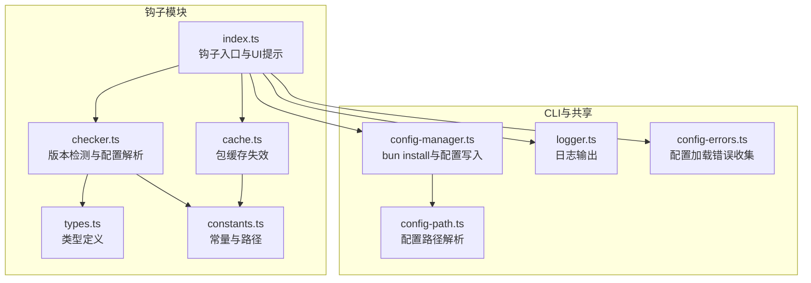
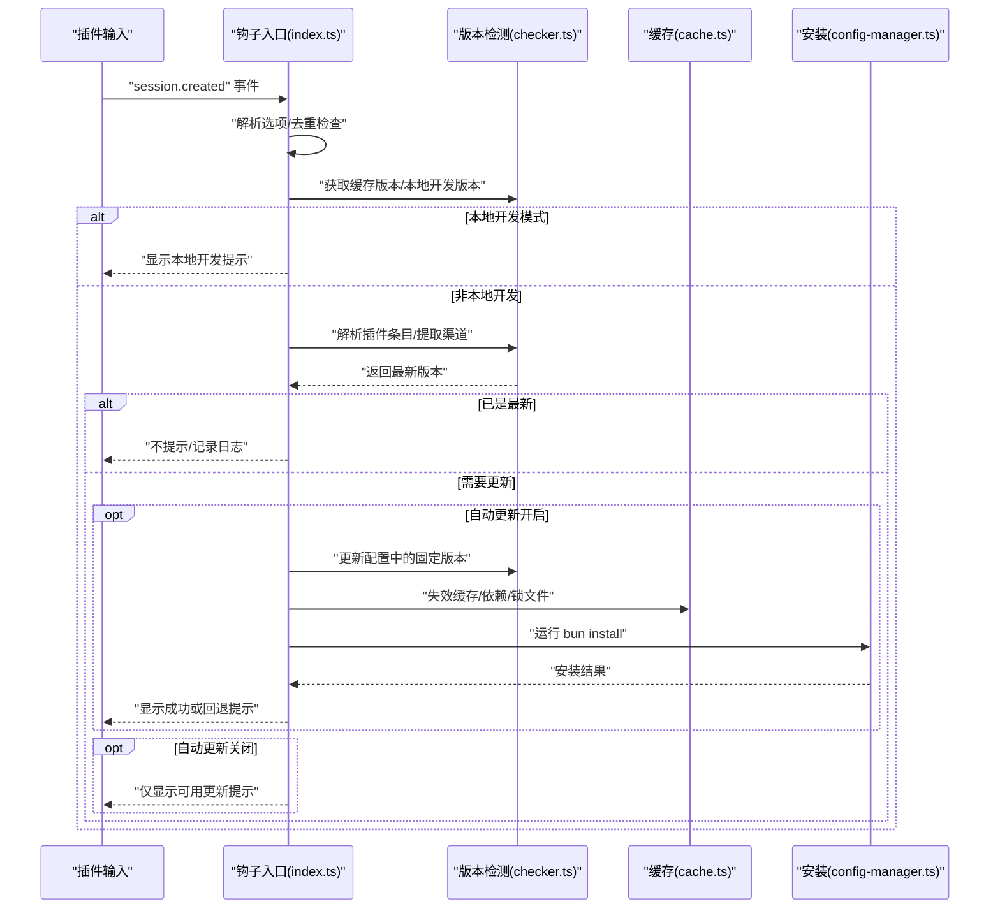
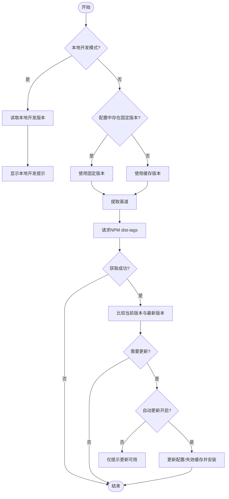
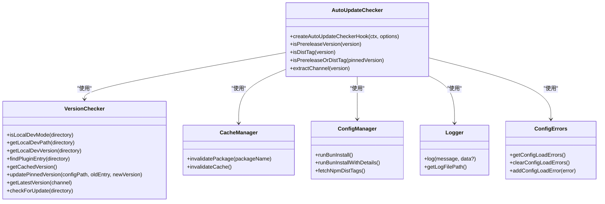
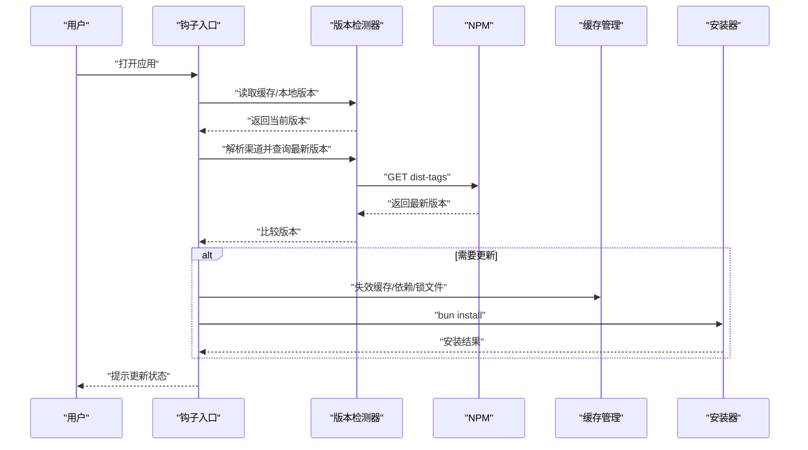

# 更新管理钩子

<cite>
**本文引用的文件**
- [src/hooks/auto-update-checker/index.ts](file://src/hooks/auto-update-checker/index.ts)
- [src/hooks/auto-update-checker/checker.ts](file://src/hooks/auto-update-checker/checker.ts)
- [src/hooks/auto-update-checker/cache.ts](file://src/hooks/auto-update-checker/cache.ts)
- [src/hooks/auto-update-checker/types.ts](file://src/hooks/auto-update-checker/types.ts)
- [src/hooks/auto-update-checker/constants.ts](file://src/hooks/auto-update-checker/constants.ts)
- [src/hooks/auto-update-checker/index.test.ts](file://src/hooks/auto-update-checker/index.test.ts)
- [src/hooks/auto-update-checker/checker.test.ts](file://src/hooks/auto-update-checker/checker.test.ts)
- [src/cli/config-manager.ts](file://src/cli/config-manager.ts)
- [src/shared/logger.ts](file://src/shared/logger.ts)
- [src/shared/config-errors.ts](file://src/shared/config-errors.ts)
- [src/shared/config-path.ts](file://src/shared/config-path.ts)
- [package.json](file://package.json)
</cite>

## 目录
1. [简介](#简介)
2. [项目结构](#项目结构)
3. [核心组件](#核心组件)
4. [架构总览](#架构总览)
5. [组件详解](#组件详解)
6. [依赖关系分析](#依赖关系分析)
7. [性能与可靠性](#性能与可靠性)
8. [故障排查指南](#故障排查指南)
9. [结论](#结论)
10. [附录](#附录)

## 简介
本文件面向 Oh My OpenCode 的自动更新管理钩子，系统性阐述其工作原理、实现机制与最佳实践。内容覆盖版本比较策略、更新检测流程、缓存与配置管理、钩子配置项与触发条件、以及从版本获取到安装应用的完整流程。同时提供调试方法与常见问题解决方案，帮助开发者与运维人员快速定位与解决问题。

## 项目结构
自动更新钩子位于 hooks 子目录中，围绕“钩子入口”“版本检测器”“缓存清理”“常量与类型”展开；与之协同的还有 CLI 配置管理器（负责运行安装）、日志与配置错误收集等共享模块。

图表来源
- [src/hooks/auto-update-checker/index.ts](file://src/hooks/auto-update-checker/index.ts#L1-L261)
- [src/hooks/auto-update-checker/checker.ts](file://src/hooks/auto-update-checker/checker.ts#L1-L285)
- [src/hooks/auto-update-checker/cache.ts](file://src/hooks/auto-update-checker/cache.ts#L1-L94)
- [src/hooks/auto-update-checker/types.ts](file://src/hooks/auto-update-checker/types.ts#L1-L30)
- [src/hooks/auto-update-checker/constants.ts](file://src/hooks/auto-update-checker/constants.ts#L1-L65)
- [src/cli/config-manager.ts](file://src/cli/config-manager.ts#L1-L731)
- [src/shared/logger.ts](file://src/shared/logger.ts#L1-L21)
- [src/shared/config-errors.ts](file://src/shared/config-errors.ts#L1-L19)
- [src/shared/config-path.ts](file://src/shared/config-path.ts#L1-L48)

章节来源
- [src/hooks/auto-update-checker/index.ts](file://src/hooks/auto-update-checker/index.ts#L1-L261)
- [src/hooks/auto-update-checker/checker.ts](file://src/hooks/auto-update-checker/checker.ts#L1-L285)
- [src/hooks/auto-update-checker/cache.ts](file://src/hooks/auto-update-checker/cache.ts#L1-L94)
- [src/hooks/auto-update-checker/types.ts](file://src/hooks/auto-update-checker/types.ts#L1-L30)
- [src/hooks/auto-update-checker/constants.ts](file://src/hooks/auto-update-checker/constants.ts#L1-L65)
- [src/cli/config-manager.ts](file://src/cli/config-manager.ts#L1-L731)
- [src/shared/logger.ts](file://src/shared/logger.ts#L1-L21)
- [src/shared/config-errors.ts](file://src/shared/config-errors.ts#L1-L19)
- [src/shared/config-path.ts](file://src/shared/config-path.ts#L1-L48)

## 核心组件
- 钩子入口：在会话创建事件上触发，负责显示启动提示、检测本地开发模式、执行后台更新检查、处理通知与安装。
- 版本检测器：解析配置、定位插件条目、提取当前版本、查询 NPM 分发标签、判断是否需要更新。
- 缓存管理：清理本地缓存中的包与依赖，确保安装新版本时不受旧缓存影响。
- CLI 安装器：调用 bun install 执行安装，带超时控制与错误处理。
- 日志与错误：统一记录日志到临时文件，集中收集配置加载错误并在启动时提示。

章节来源
- [src/hooks/auto-update-checker/index.ts](file://src/hooks/auto-update-checker/index.ts#L46-L97)
- [src/hooks/auto-update-checker/checker.ts](file://src/hooks/auto-update-checker/checker.ts#L255-L284)
- [src/hooks/auto-update-checker/cache.ts](file://src/hooks/auto-update-checker/cache.ts#L49-L87)
- [src/cli/config-manager.ts](file://src/cli/config-manager.ts#L514-L564)
- [src/shared/logger.ts](file://src/shared/logger.ts#L9-L20)
- [src/shared/config-errors.ts](file://src/shared/config-errors.ts#L8-L18)

## 架构总览
自动更新钩子采用“事件驱动 + 异步检查 + 安全安装”的设计，通过 NPM 分发标签识别渠道，支持稳定版与预发布通道，具备可配置的自动更新开关与 Sisyphus 提示风格。

图表来源
- [src/hooks/auto-update-checker/index.ts](file://src/hooks/auto-update-checker/index.ts#L63-L158)
- [src/hooks/auto-update-checker/checker.ts](file://src/hooks/auto-update-checker/checker.ts#L104-L158)
- [src/hooks/auto-update-checker/cache.ts](file://src/hooks/auto-update-checker/cache.ts#L49-L87)
- [src/cli/config-manager.ts](file://src/cli/config-manager.ts#L514-L564)

## 组件详解

### 钩子入口与触发条件
- 触发事件：仅在“会话创建”事件上执行一次，避免重复检查。
- 去重保护：使用内部标志防止同一进程内重复执行。
- 子进程场景：若父会话 ID 存在，则跳过检查（避免子会话重复）。
- 启动提示：根据选项决定是否显示启动提示；本地开发模式下显示特殊提示。
- 后台检查：延迟执行以避免阻塞主流程；捕获异常并记录日志。

章节来源
- [src/hooks/auto-update-checker/index.ts](file://src/hooks/auto-update-checker/index.ts#L63-L96)
- [src/hooks/auto-update-checker/index.ts](file://src/hooks/auto-update-checker/index.ts#L170-L188)

### 版本检测策略与渠道识别
- 本地开发模式：优先从配置中查找 file:// 条目，定位本地包根目录并读取版本。
- 固定版本解析：支持直接名称或 “包名@版本” 形式；区分是否 pinned。
- 渠道识别：支持 dist-tag（如 beta/next/canary）与语义化预发布标识（alpha/beta/rc），默认回退到 latest。
- 最新版本获取：访问 NPM dist-tags 接口，按指定渠道返回对应版本号，带超时控制。

图表来源
- [src/hooks/auto-update-checker/checker.ts](file://src/hooks/auto-update-checker/checker.ts#L104-L158)
- [src/hooks/auto-update-checker/checker.ts](file://src/hooks/auto-update-checker/checker.ts#L234-L253)
- [src/hooks/auto-update-checker/index.ts](file://src/hooks/auto-update-checker/index.ts#L117-L129)

章节来源
- [src/hooks/auto-update-checker/checker.ts](file://src/hooks/auto-update-checker/checker.ts#L18-L117)
- [src/hooks/auto-update-checker/checker.ts](file://src/hooks/auto-update-checker/checker.ts#L119-L150)
- [src/hooks/auto-update-checker/checker.ts](file://src/hooks/auto-update-checker/checker.ts#L234-L284)
- [src/hooks/auto-update-checker/index.ts](file://src/hooks/auto-update-checker/index.ts#L26-L44)

### 缓存与配置管理
- 包级失效：删除 node_modules 中的包目录、移除 package.json 中的依赖、清理 bun.lock 中的相关条目。
- 配置更新：在配置文件的 plugin 数组范围内进行字符串替换，保留注释与格式。
- 配置路径：跨平台兼容，Windows 优先 ~/.config，再回退到 %APPDATA%；Linux/macOS 使用 XDG 或 ~./config。

章节来源
- [src/hooks/auto-update-checker/cache.ts](file://src/hooks/auto-update-checker/cache.ts#L49-L87)
- [src/hooks/auto-update-checker/checker.ts](file://src/hooks/auto-update-checker/checker.ts#L176-L232)
- [src/hooks/auto-update-checker/constants.ts](file://src/hooks/auto-update-checker/constants.ts#L35-L64)
- [src/shared/config-path.ts](file://src/shared/config-path.ts#L13-L47)

### 安装流程与错误处理
- 安装执行：在配置目录下运行 bun install，带超时控制（默认 60 秒）。
- 错误分类：权限不足、磁盘空间不足、只读文件系统、语法错误、超时等，给出明确建议。
- 失败回退：安装失败时回退为仅提示，不中断主流程。

章节来源
- [src/cli/config-manager.ts](file://src/cli/config-manager.ts#L514-L564)
- [src/cli/config-manager.ts](file://src/cli/config-manager.ts#L74-L98)

### 用户提示与交互
- 启动提示：显示当前版本与动态旋转图标，营造“加载中”的体验。
- 更新提示：区分“仅提示可用”与“自动更新完成”两种状态，提供重启建议。
- 本地开发提示：根据是否启用 Sisyphus 模式显示不同文案。

章节来源
- [src/hooks/auto-update-checker/index.ts](file://src/hooks/auto-update-checker/index.ts#L49-L58)
- [src/hooks/auto-update-checker/index.ts](file://src/hooks/auto-update-checker/index.ts#L190-L256)

### 配置选项与触发条件
- 配置项
  - showStartupToast：是否显示启动提示
  - isSisyphusEnabled：是否启用 Sisyphus 风格提示
  - autoUpdate：是否自动更新并安装
- 触发条件
  - 事件：session.created
  - 去重：单次执行
  - 上下文：非子会话（存在 parentID 则跳过）
  - 时机：延时执行，避免阻塞

章节来源
- [src/hooks/auto-update-checker/index.ts](file://src/hooks/auto-update-checker/index.ts#L46-L96)
- [src/hooks/auto-update-checker/types.ts](file://src/hooks/auto-update-checker/types.ts#L25-L29)

## 依赖关系分析

图表来源
- [src/hooks/auto-update-checker/index.ts](file://src/hooks/auto-update-checker/index.ts#L1-L261)
- [src/hooks/auto-update-checker/checker.ts](file://src/hooks/auto-update-checker/checker.ts#L1-L285)
- [src/hooks/auto-update-checker/cache.ts](file://src/hooks/auto-update-checker/cache.ts#L1-L94)
- [src/cli/config-manager.ts](file://src/cli/config-manager.ts#L514-L564)
- [src/shared/logger.ts](file://src/shared/logger.ts#L9-L20)
- [src/shared/config-errors.ts](file://src/shared/config-errors.ts#L8-L18)

章节来源
- [src/hooks/auto-update-checker/index.ts](file://src/hooks/auto-update-checker/index.ts#L1-L261)
- [src/hooks/auto-update-checker/checker.ts](file://src/hooks/auto-update-checker/checker.ts#L1-L285)
- [src/hooks/auto-update-checker/cache.ts](file://src/hooks/auto-update-checker/cache.ts#L1-L94)
- [src/cli/config-manager.ts](file://src/cli/config-manager.ts#L1-L731)
- [src/shared/logger.ts](file://src/shared/logger.ts#L1-L21)
- [src/shared/config-errors.ts](file://src/shared/config-errors.ts#L1-L19)

## 性能与可靠性
- 网络策略
  - NPM 请求超时：5 秒，避免阻塞 UI。
  - 安装超时：60 秒，超时后终止进程并提示手动安装。
- 并发与去重
  - 单次会话内仅执行一次检查，避免重复网络与 IO。
- 缓存清理
  - 通过失效包、依赖与锁文件，确保安装新版本时不受旧缓存污染。
- 错误隔离
  - UI 提示与日志记录分离，不影响主流程继续执行。

章节来源
- [src/hooks/auto-update-checker/constants.ts](file://src/hooks/auto-update-checker/constants.ts#L6-L7)
- [src/cli/config-manager.ts](file://src/cli/config-manager.ts#L521-L546)
- [src/hooks/auto-update-checker/index.ts](file://src/hooks/auto-update-checker/index.ts#L99-L158)

## 故障排查指南
- 无法获取最新版本
  - 检查网络连通性与超时设置；查看日志文件定位失败原因。
  - 参考：[NPM 请求超时](file://src/hooks/auto-update-checker/constants.ts#L6-L7)、[getLatestVersion](file://src/hooks/auto-update-checker/checker.ts#L234-L253)
- 安装失败
  - 查看安装超时与错误信息；确认 bun 是否正确安装与可执行。
  - 参考：[runBunInstall](file://src/cli/config-manager.ts#L514-L564)
- 配置更新未生效
  - 确认配置文件路径与格式；检查 plugin 数组范围内的替换是否成功。
  - 参考：[updatePinnedVersion](file://src/hooks/auto-update-checker/checker.ts#L181-L232)、[配置路径解析](file://src/shared/config-path.ts#L13-L47)
- 本地开发模式未被识别
  - 检查配置中是否存在 file:// 条目；确认包名匹配。
  - 参考：[getLocalDevPath](file://src/hooks/auto-update-checker/checker.ts#L57-L80)、[getLocalDevVersion](file://src/hooks/auto-update-checker/checker.ts#L104-L117)
- 日志定位
  - 日志文件位于临时目录，便于收集与分析。
  - 参考：[日志工具](file://src/shared/logger.ts#L9-L20)

章节来源
- [src/hooks/auto-update-checker/checker.ts](file://src/hooks/auto-update-checker/checker.ts#L181-L232)
- [src/cli/config-manager.ts](file://src/cli/config-manager.ts#L514-L564)
- [src/shared/logger.ts](file://src/shared/logger.ts#L9-L20)
- [src/shared/config-path.ts](file://src/shared/config-path.ts#L13-L47)

## 结论
该自动更新钩子以简洁可靠的事件驱动模型实现了“渠道识别—版本比较—缓存失效—安全安装—用户提示”的闭环。通过可配置的选项与健壮的错误处理，既保证了用户体验，又兼顾了生产环境的稳定性。建议在 CI/CD 中结合测试用例与日志监控，持续验证更新流程的正确性与性能表现。

## 附录

### 关键流程时序图（版本检查）

图表来源
- [src/hooks/auto-update-checker/index.ts](file://src/hooks/auto-update-checker/index.ts#L99-L158)
- [src/hooks/auto-update-checker/checker.ts](file://src/hooks/auto-update-checker/checker.ts#L234-L253)
- [src/hooks/auto-update-checker/cache.ts](file://src/hooks/auto-update-checker/cache.ts#L49-L87)
- [src/cli/config-manager.ts](file://src/cli/config-manager.ts#L514-L564)

### 测试要点
- 渠道识别：覆盖预发布与 dist-tag 场景。
- 网络请求：验证默认/latest 与指定渠道行为。
- 参考：
  - [extractChannel 测试](file://src/hooks/auto-update-checker/index.test.ts#L154-L253)
  - [getLatestVersion 测试](file://src/hooks/auto-update-checker/checker.test.ts#L5-L23)