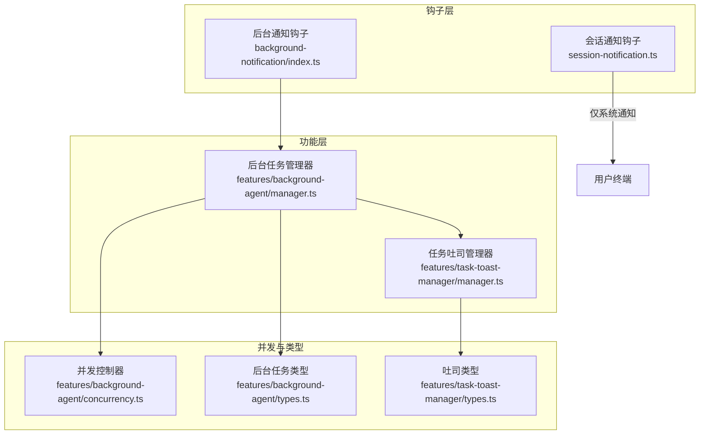
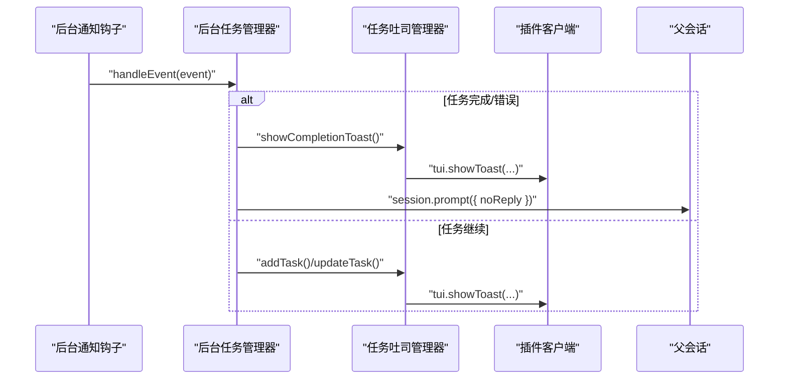
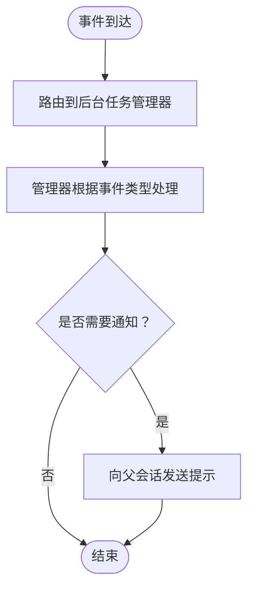
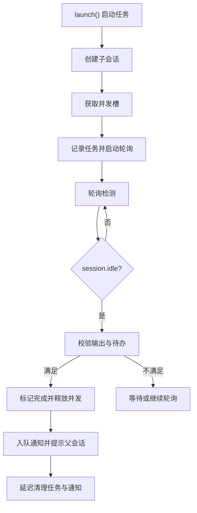
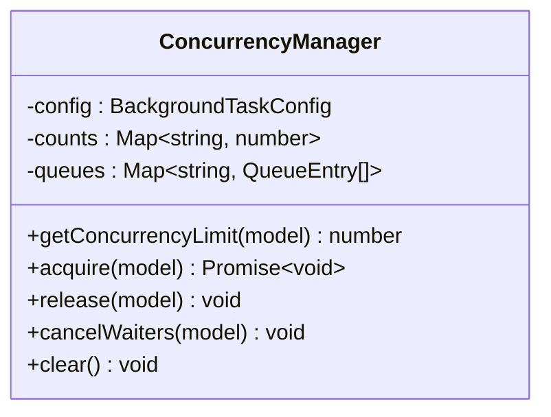
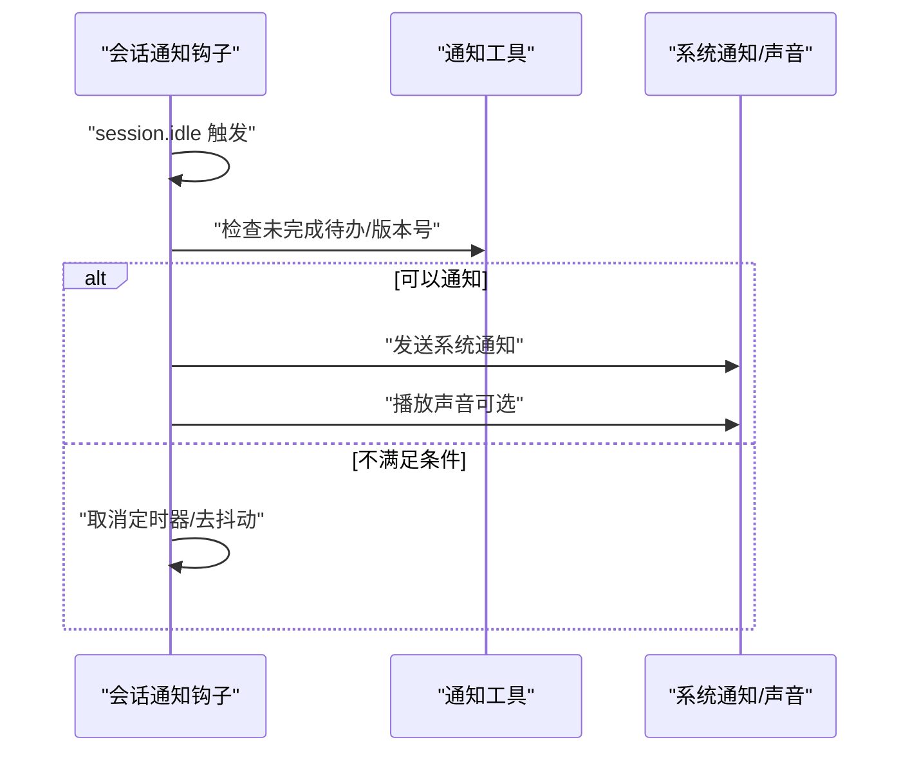
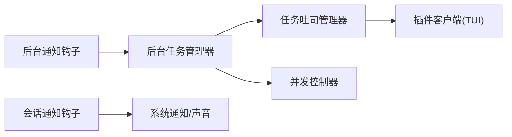

# 通知管理钩子

<cite>
**本文引用的文件**
- [src/hooks/background-notification/index.ts](file://src/hooks/background-notification/index.ts)
- [src/hooks/background-notification/types.ts](file://src/hooks/background-notification/types.ts)
- [src/features/task-toast-manager/index.ts](file://src/features/task-toast-manager/index.ts)
- [src/features/task-toast-manager/manager.ts](file://src/features/task-toast-manager/manager.ts)
- [src/features/task-toast-manager/types.ts](file://src/features/task-toast-manager/types.ts)
- [src/features/task-toast-manager/manager.test.ts](file://src/features/task-toast-manager/manager.test.ts)
- [src/features/background-agent/manager.ts](file://src/features/background-agent/manager.ts)
- [src/features/background-agent/types.ts](file://src/features/background-agent/types.ts)
- [src/features/background-agent/concurrency.ts](file://src/features/background-agent/concurrency.ts)
- [src/hooks/session-notification.ts](file://src/hooks/session-notification.ts)
- [src/hooks/session-notification-utils.ts](file://src/hooks/session-notification-utils.ts)
- [src/hooks/index.ts](file://src/hooks/index.ts)
</cite>

## 目录
1. [简介](#简介)
2. [项目结构](#项目结构)
3. [核心组件](#核心组件)
4. [架构总览](#架构总览)
5. [组件详解](#组件详解)
6. [依赖关系分析](#依赖关系分析)
7. [性能与可扩展性](#性能与可扩展性)
8. [故障排查指南](#故障排查指南)
9. [结论](#结论)
10. [附录：配置与自定义](#附录配置与自定义)

## 简介
本文件面向 Oh My OpenCode 的通知管理钩子，系统性阐述后台通知钩子的实现机制与通知策略；深入解析任务吐司管理器（TaskToastManager）的功能特性，包括通知显示、生命周期管理与用户交互；解释通知的分类与优先级管理（不同任务类型与状态的通知处理策略与显示规则）；提供通知配置选项与自定义方法（样式定制、触发条件与用户体验优化）；并给出调试技巧与性能考量。

## 项目结构
通知系统由三部分组成：
- 后台通知钩子：接收事件并路由到后台任务管理器，负责任务完成/错误等状态的最终通知分发。
- 任务吐司管理器：集中管理运行中/排队中的任务列表，向 TUI 展示聚合式任务状态提示。
- 会话级通知钩子：在会话空闲时进行跨平台系统通知与声音提醒，避免干扰子代理会话。



图表来源
- [src/hooks/background-notification/index.ts](file://src/hooks/background-notification/index.ts#L1-L29)
- [src/features/background-agent/manager.ts](file://src/features/background-agent/manager.ts#L1-L120)
- [src/features/task-toast-manager/manager.ts](file://src/features/task-toast-manager/manager.ts#L1-L60)
- [src/features/background-agent/concurrency.ts](file://src/features/background-agent/concurrency.ts#L1-L40)
- [src/features/background-agent/types.ts](file://src/features/background-agent/types.ts#L1-L42)
- [src/features/task-toast-manager/types.ts](file://src/features/task-toast-manager/types.ts#L1-L25)
- [src/hooks/session-notification.ts](file://src/hooks/session-notification.ts#L1-L60)

章节来源
- [src/hooks/background-notification/index.ts](file://src/hooks/background-notification/index.ts#L1-L29)
- [src/features/background-agent/manager.ts](file://src/features/background-agent/manager.ts#L1-L120)
- [src/features/task-toast-manager/manager.ts](file://src/features/task-toast-manager/manager.ts#L1-L60)
- [src/features/background-agent/concurrency.ts](file://src/features/background-agent/concurrency.ts#L1-L40)
- [src/features/background-agent/types.ts](file://src/features/background-agent/types.ts#L1-L42)
- [src/features/task-toast-manager/types.ts](file://src/features/task-toast-manager/types.ts#L1-L25)
- [src/hooks/session-notification.ts](file://src/hooks/session-notification.ts#L1-L60)

## 核心组件
- 后台通知钩子：接收事件并调用后台任务管理器的事件处理器，用于完成/错误/删除等状态的统一通知。
- 任务吐司管理器：维护任务映射、构建聚合消息、调用客户端 TUI 显示提示，并支持并发限制展示。
- 后台任务管理器：负责任务生命周期、稳定性检测、超时清理、批量通知队列与父会话提示发送。
- 并发控制器：按模型/提供商/默认维度控制并发上限，支持排队与释放。
- 会话通知钩子：在主会话空闲时进行系统级通知与声音播放，支持跨平台适配与去抖动。

章节来源
- [src/hooks/background-notification/index.ts](file://src/hooks/background-notification/index.ts#L12-L26)
- [src/features/task-toast-manager/manager.ts](file://src/features/task-toast-manager/manager.ts#L7-L60)
- [src/features/background-agent/manager.ts](file://src/features/background-agent/manager.ts#L52-L120)
- [src/features/background-agent/concurrency.ts](file://src/features/background-agent/concurrency.ts#L15-L40)
- [src/hooks/session-notification.ts](file://src/hooks/session-notification.ts#L142-L160)

## 架构总览
后台通知钩子作为事件入口，将事件交由后台任务管理器处理；管理器在任务完成或异常时，通过 TUI 吐司与会话提示两种路径进行通知。任务吐司管理器负责聚合任务状态并在 TUI 中展示；后台任务管理器负责最终向父会话发送提示（prompt），并清理内存与并发槽位。



图表来源
- [src/hooks/background-notification/index.ts](file://src/hooks/background-notification/index.ts#L18-L26)
- [src/features/background-agent/manager.ts](file://src/features/background-agent/manager.ts#L766-L890)
- [src/features/task-toast-manager/manager.ts](file://src/features/task-toast-manager/manager.ts#L176-L200)

章节来源
- [src/hooks/background-notification/index.ts](file://src/hooks/background-notification/index.ts#L12-L26)
- [src/features/background-agent/manager.ts](file://src/features/background-agent/manager.ts#L461-L557)
- [src/features/task-toast-manager/manager.ts](file://src/features/task-toast-manager/manager.ts#L150-L200)

## 组件详解

### 后台通知钩子
- 职责：接收事件输入，直接路由给后台任务管理器的事件处理器，不再自行生成通知内容。
- 设计要点：事件类型驱动管理器内部逻辑（如 message.part.updated、session.idle、session.deleted 等），确保通知时机与状态一致。
- 可扩展点：通过配置项可自定义通知格式化函数（当前类型定义存在，具体实现需结合业务场景）。



图表来源
- [src/hooks/background-notification/index.ts](file://src/hooks/background-notification/index.ts#L18-L26)
- [src/features/background-agent/manager.ts](file://src/features/background-agent/manager.ts#L461-L557)

章节来源
- [src/hooks/background-notification/index.ts](file://src/hooks/background-notification/index.ts#L12-L26)
- [src/hooks/background-notification/types.ts](file://src/hooks/background-notification/types.ts#L1-L6)

### 任务吐司管理器
- 功能特性
  - 任务追踪：以 Map 存储任务，支持新增、更新状态、移除完成/失败任务。
  - 聚合提示：构建“运行中/排队中”列表，展示持续时间、技能标签、并发限制等信息。
  - 模型回退提示：当模型回退至 inherited 或 system-default 时，显示警告行。
  - 生命周期管理：自动计算持续时间、根据运行/排队数量动态调整显示时长。
  - 完成提示：任务完成后弹出成功提示，并统计剩余运行/排队任务数。
- 用户交互
  - 通过客户端 TUI 的 showToast 接口展示信息，具备标题、消息体、变体与持续时间。
  - 支持并发管理器注入，展示当前总任务数与并发上限。
- 测试验证
  - 覆盖技能标签、并发信息、模型回退提示、用户自定义模型等场景。

```mermaid
classDiagram
class TaskToastManager {
-tasks : Map~string, TrackedTask~
-client : OpencodeClient
-concurrencyManager : ConcurrencyManager
+setConcurrencyManager(manager)
+addTask(task)
+updateTask(id, status)
+removeTask(id)
+getRunningTasks() TrackedTask[]
+getQueuedTasks() TrackedTask[]
+showCompletionToast(task)
}
class TrackedTask {
+id : string
+description : string
+agent : string
+status : TaskStatus
+startedAt : Date
+isBackground : boolean
+skills? : string[]
+modelInfo? : ModelFallbackInfo
}
class TaskStatus {
<<enumeration>>
"running"
"queued"
"completed"
"error"
}
class ModelFallbackInfo {
+model : string
+type : "user-defined"|"inherited"|"category-default"|"system-default"
}
TaskToastManager --> TrackedTask : "管理"
TaskToastManager --> ModelFallbackInfo : "读取模型信息"
```

图表来源
- [src/features/task-toast-manager/manager.ts](file://src/features/task-toast-manager/manager.ts#L7-L60)
- [src/features/task-toast-manager/types.ts](file://src/features/task-toast-manager/types.ts#L1-L25)

章节来源
- [src/features/task-toast-manager/manager.ts](file://src/features/task-toast-manager/manager.ts#L21-L200)
- [src/features/task-toast-manager/types.ts](file://src/features/task-toast-manager/types.ts#L1-L25)
- [src/features/task-toast-manager/index.ts](file://src/features/task-toast-manager/index.ts#L1-L3)
- [src/features/task-toast-manager/manager.test.ts](file://src/features/task-toast-manager/manager.test.ts#L1-L250)

### 后台任务管理器
- 任务生命周期
  - 启动：创建子会话、分配并发槽、记录任务、启动轮询、添加到父会话待通知队列。
  - 运行：跟踪工具调用次数、稳定状态检测、空闲事件处理、待办检查。
  - 结束：原子标记完成、释放并发槽、入队通知、向父会话发送提示、延迟清理。
- 通知策略
  - 批量通知：按父会话聚合待通知任务，全部完成后一次性提示。
  - 稳定性与完整性：在 session.idle 时校验是否存在有效输出与未完成待办，避免误判。
  - 错误处理：捕获 prompt 异常，标记错误状态、释放并发槽、入队通知并提示。
- 清理与并发
  - 轮询：每 10 秒轮询一次，超时清理（30 分钟）。
  - 并发：使用并发控制器按模型/提供商/默认维度限制并发，支持排队与释放。



图表来源
- [src/features/background-agent/manager.ts](file://src/features/background-agent/manager.ts#L79-L217)
- [src/features/background-agent/manager.ts](file://src/features/background-agent/manager.ts#L461-L557)
- [src/features/background-agent/manager.ts](file://src/features/background-agent/manager.ts#L736-L890)

章节来源
- [src/features/background-agent/manager.ts](file://src/features/background-agent/manager.ts#L79-L217)
- [src/features/background-agent/manager.ts](file://src/features/background-agent/manager.ts#L461-L557)
- [src/features/background-agent/manager.ts](file://src/features/background-agent/manager.ts#L736-L890)
- [src/features/background-agent/types.ts](file://src/features/background-agent/types.ts#L15-L42)

### 并发控制器
- 限流策略：按模型、提供商、默认顺序查找并发上限，0 表示无限制。
- 队列机制：当达到上限时进入等待队列，释放时优先交接给下一个等待者。
- 清理：支持取消等待者与清空状态，用于进程退出与资源回收。



图表来源
- [src/features/background-agent/concurrency.ts](file://src/features/background-agent/concurrency.ts#L15-L138)

章节来源
- [src/features/background-agent/concurrency.ts](file://src/features/background-agent/concurrency.ts#L24-L138)

### 会话通知钩子（系统级）
- 触发条件：仅对主会话（非子代理）在空闲一段时间后触发，且可选跳过未完成待办。
- 跨平台：根据系统选择最佳通知与声音方案（macOS、Linux、Windows）。
- 去抖动：使用版本号与定时器避免竞态与重复执行。
- 配置项：标题、消息、是否播放声音、声音路径、空闲确认延迟、跳过未完成待办、最大跟踪会话数。



图表来源
- [src/hooks/session-notification.ts](file://src/hooks/session-notification.ts#L260-L330)
- [src/hooks/session-notification-utils.ts](file://src/hooks/session-notification-utils.ts#L1-L141)

章节来源
- [src/hooks/session-notification.ts](file://src/hooks/session-notification.ts#L21-L331)
- [src/hooks/session-notification-utils.ts](file://src/hooks/session-notification-utils.ts#L1-L141)

## 依赖关系分析
- 后台通知钩子依赖后台任务管理器的事件处理能力，不直接生成通知内容。
- 任务吐司管理器依赖客户端 TUI 的 showToast 接口，同时可选依赖并发控制器以展示并发状态。
- 后台任务管理器依赖任务吐司管理器进行完成提示，并在完成/错误时通过父会话提示用户。
- 并发控制器被后台任务管理器用于并发控制，避免资源争用。
- 会话通知钩子独立于后台任务系统，仅基于会话事件进行系统级通知。



图表来源
- [src/hooks/background-notification/index.ts](file://src/hooks/background-notification/index.ts#L1-L29)
- [src/features/background-agent/manager.ts](file://src/features/background-agent/manager.ts#L1-L120)
- [src/features/task-toast-manager/manager.ts](file://src/features/task-toast-manager/manager.ts#L1-L60)
- [src/features/background-agent/concurrency.ts](file://src/features/background-agent/concurrency.ts#L1-L40)
- [src/hooks/session-notification.ts](file://src/hooks/session-notification.ts#L1-L60)

章节来源
- [src/hooks/index.ts](file://src/hooks/index.ts#L1-L48)
- [src/hooks/background-notification/index.ts](file://src/hooks/background-notification/index.ts#L1-L29)
- [src/features/background-agent/manager.ts](file://src/features/background-agent/manager.ts#L1-L120)
- [src/features/task-toast-manager/manager.ts](file://src/features/task-toast-manager/manager.ts#L1-L60)
- [src/features/background-agent/concurrency.ts](file://src/features/background-agent/concurrency.ts#L1-L40)
- [src/hooks/session-notification.ts](file://src/hooks/session-notification.ts#L1-L60)

## 性能与可扩展性
- 轮询与清理
  - 后台任务管理器每 10 秒轮询一次，超时清理（30 分钟）避免内存泄漏。
  - 通知队列与待处理任务集合在清理时同步过滤，保持数据一致性。
- 并发控制
  - 通过并发控制器限制高负载场景下的资源占用，支持排队与交接，减少饥饿。
- 吐司提示
  - 根据运行/排队数量动态调整显示时长，避免频繁打扰。
  - 聚合消息减少 TUI 刷新频率，提升用户体验。
- 会话通知
  - 使用版本号与定时器去抖动，避免重复通知与竞态。
  - 跨平台命令预发现，减少运行时查找开销。

章节来源
- [src/features/background-agent/manager.ts](file://src/features/background-agent/manager.ts#L659-L703)
- [src/features/background-agent/manager.ts](file://src/features/background-agent/manager.ts#L913-L946)
- [src/features/background-agent/concurrency.ts](file://src/features/background-agent/concurrency.ts#L41-L94)
- [src/features/task-toast-manager/manager.ts](file://src/features/task-toast-manager/manager.ts#L150-L171)
- [src/hooks/session-notification.ts](file://src/hooks/session-notification.ts#L190-L200)

## 故障排查指南
- 后台任务未完成通知
  - 检查后台任务管理器的事件处理分支（如 session.idle、session.deleted）是否正确触发。
  - 确认稳定性校验与待办检查逻辑未阻塞完成流程。
- 吐司未显示
  - 确认客户端存在 tui.showToast 接口，且未被禁用。
  - 检查并发控制器是否返回了空信息（Infinity 无限制时不会显示）。
- 会话通知无效
  - 确认当前平台可用的通知/声音命令已找到（工具模块会缓存结果）。
  - 检查是否为子代理会话（仅主会话触发）以及去抖动版本号是否被更新。
- 并发阻塞
  - 查看并发队列长度与等待者状态，必要时调用取消等待者或清理状态。
- 日志定位
  - 后台任务管理器在关键路径（启动、完成、错误、清理）均输出日志，便于定位问题。

章节来源
- [src/features/background-agent/manager.ts](file://src/features/background-agent/manager.ts#L461-L557)
- [src/features/background-agent/manager.ts](file://src/features/background-agent/manager.ts#L766-L890)
- [src/features/task-toast-manager/manager.ts](file://src/features/task-toast-manager/manager.ts#L150-L171)
- [src/hooks/session-notification.ts](file://src/hooks/session-notification.ts#L260-L330)
- [src/features/background-agent/concurrency.ts](file://src/features/background-agent/concurrency.ts#L99-L122)

## 结论
Oh My OpenCode 的通知系统采用“事件路由 + 聚合提示 + 系统通知”的分层设计：后台通知钩子负责事件入口与路由；后台任务管理器承担生命周期与通知编排；任务吐司管理器提供直观的 TUI 提示；并发控制器保障资源安全；会话通知钩子补充系统级反馈。该体系兼顾了实时性、可读性与可扩展性，适合在复杂多 Agent 场景下稳定运行。

## 附录：配置与自定义
- 后台通知钩子配置
  - 类型定义包含 formatNotification 回调，可用于自定义通知文本格式（需结合业务实现）。
- 任务吐司管理器
  - 通过初始化时注入并发控制器，展示“运行/排队/上限”等信息。
  - 支持模型回退提示（inherited/system-default）与技能标签展示。
- 会话通知钩子
  - 支持标题、消息、声音开关与路径、空闲确认延迟、跳过未完成待办、最大跟踪会话数等配置。
  - 跨平台自动适配，必要时可手动指定命令路径。
- 钩子导出
  - 在 hooks 索引中导出后台通知钩子，便于外部注册与使用。

章节来源
- [src/hooks/background-notification/types.ts](file://src/hooks/background-notification/types.ts#L1-L6)
- [src/features/task-toast-manager/manager.ts](file://src/features/task-toast-manager/manager.ts#L176-L200)
- [src/hooks/session-notification.ts](file://src/hooks/session-notification.ts#L21-L331)
- [src/hooks/index.ts](file://src/hooks/index.ts#L16-L16)