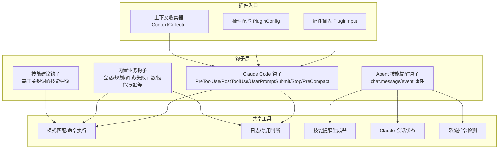
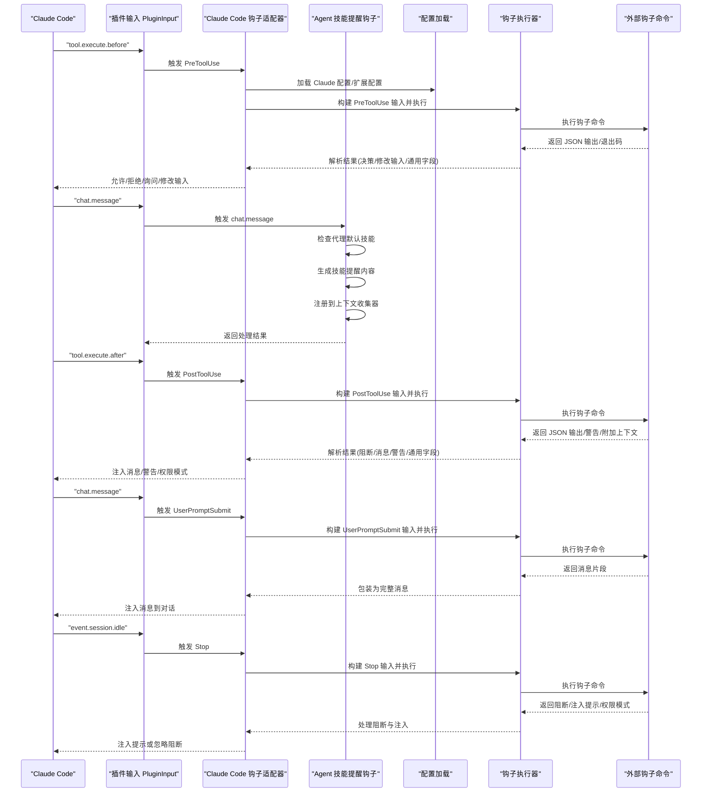
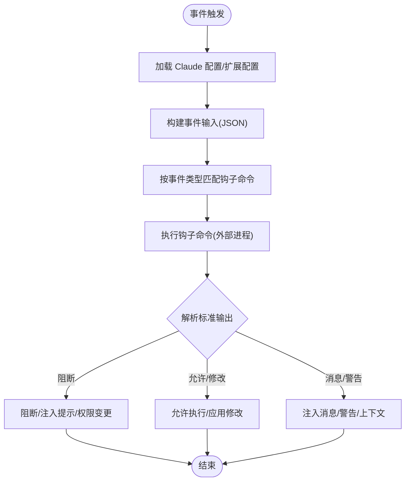
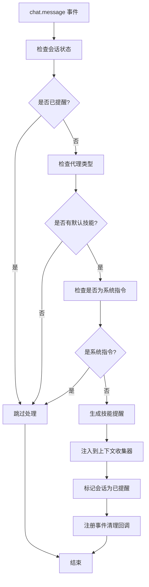
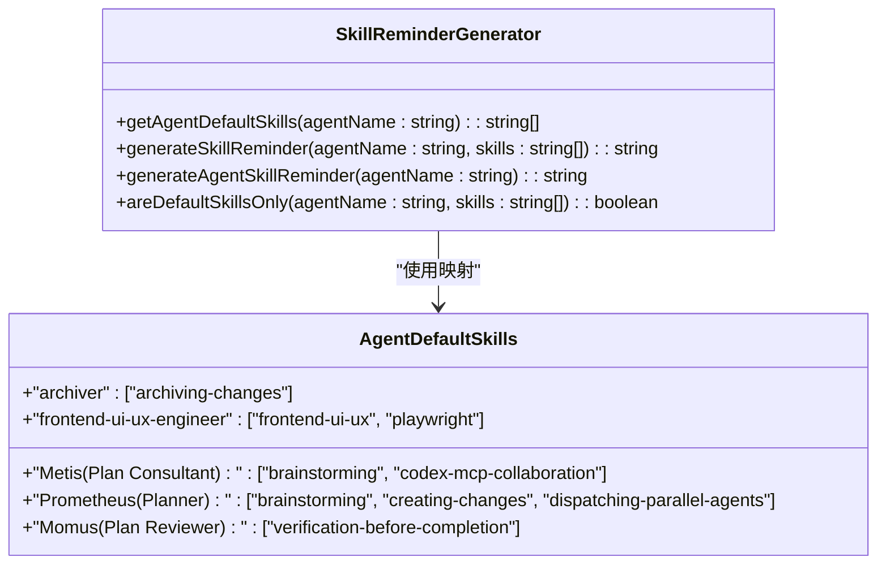
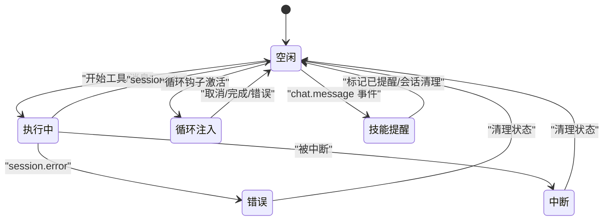
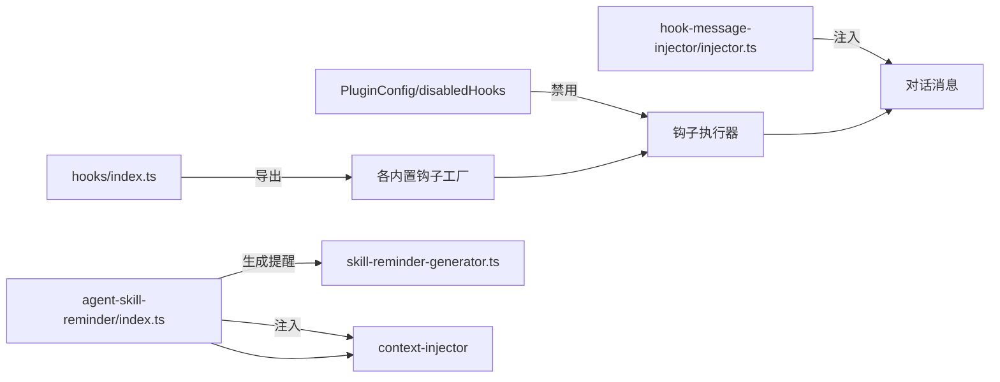
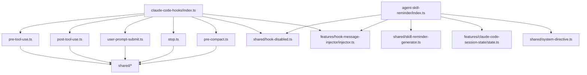

# 钩子架构设计

<cite>
**本文档引用的文件**
- [src/hooks/index.ts](file://src/hooks/index.ts)
- [src/hooks/claude-code-hooks/types.ts](file://src/hooks/claude-code-hooks/types.ts)
- [src/hooks/claude-code-hooks/index.ts](file://src/hooks/claude-code-hooks/index.ts)
- [src/hooks/claude-code-hooks/pre-tool-use.ts](file://src/hooks/claude-code-hooks/pre-tool-use.ts)
- [src/hooks/claude-code-hooks/post-tool-use.ts](file://src/hooks/claude-code-hooks/post-tool-use.ts)
- [src/hooks/claude-code-hooks/user-prompt-submit.ts](file://src/hooks/claude-code-hooks/user-prompt-submit.ts)
- [src/hooks/claude-code-hooks/stop.ts](file://src/hooks/claude-code-hooks/stop.ts)
- [src/hooks/claude-code-hooks/pre-compact.ts](file://src/hooks/claude-code-hooks/pre-compact.ts)
- [src/shared/hook-disabled.ts](file://src/shared/hook-disabled.ts)
- [src/features/hook-message-injector/injector.ts](file://src/features/hook-message-injector/injector.ts)
- [src/hooks/ralph-loop/index.ts](file://src/hooks/ralph-loop/index.ts)
- [src/hooks/tdd-guard/handlers/sessionHandler.ts](file://src/hooks/tdd-guard/handlers/sessionHandler.ts)
- [src/config/index.ts](file://src/config/index.ts)
- [src/hooks/agent-skill-reminder/index.ts](file://src/hooks/agent-skill-reminder/index.ts)
- [src/hooks/agent-skill-reminder/constants.ts](file://src/hooks/agent-skill-reminder/constants.ts)
- [src/hooks/agent-skill-reminder/types.ts](file://src/hooks/agent-skill-reminder/types.ts)
- [src/shared/skill-reminder-generator.ts](file://src/shared/skill-reminder-generator.ts)
- [src/features/claude-code-session-state/state.ts](file://src/features/claude-code-session-state/state.ts)
- [src/shared/system-directive.ts](file://src/shared/system-directive.ts)
- [src/hooks/skill-suggestion/index.ts](file://src/hooks/skill-suggestion/index.ts)
- [src/tools/delegate-task/constants.ts](file://src/tools/delegate-task/constants.ts)
- [src/tools/delegate-task/tools.ts](file://src/tools/delegate-task/tools.ts)
- [changes/skill-reminder-system/design.md](file://changes/skill-reminder-system/design.md)
- [changes/skill-reminder-system/proposal.md](file://changes/skill-reminder-system/proposal.md)
- [changes/skill-reminder-system/findings.md](file://changes/skill-reminder-system/findings.md)
</cite>

## 更新摘要
**所做更改**
- 新增了 agent-skill-reminder 系统，实现了"提醒优于注入"的设计理念
- 更新了钩子执行管道，增加了技能提醒生成和注入机制
- 改进了状态管理机制，支持会话级别的技能提醒跟踪
- 扩展了钩子架构以支持新的技能提醒工作流
- 更新了代理默认技能配置和执行模式选择功能

## 目录
1. [引言](#引言)
2. [项目结构](#项目结构)
3. [核心组件](#核心组件)
4. [架构总览](#架构总览)
5. [详细组件分析](#详细组件分析)
6. [依赖关系分析](#依赖关系分析)
7. [性能考量](#性能考量)
8. [故障排除指南](#故障排除指南)
9. [结论](#结论)
10. [附录](#附录)

## 引言
本文件面向 Oh My OpenCode 的钩子架构设计，系统性阐述钩子系统的核心理念与事件驱动机制，覆盖生命周期管理、事件触发与执行顺序控制、接口规范与类型定义、上下文传递与返回值处理、注册与管理实现细节（创建、销毁、状态管理），以及扩展点设计与最佳实践。文档以代码为依据，辅以可视化图表帮助不同背景读者理解。

**更新** 本次更新重点介绍了新增的 agent-skill-reminder 系统，该系统实现了"提醒优于注入"的设计理念，通过智能的技能提醒机制改善用户体验，同时优化了上下文使用效率。

## 项目结构
Oh My OpenCode 将钩子分为两大类：
- Claude Code 钩子：与 Claude Code 插件生态对接，提供 PreToolUse、PostToolUse、UserPromptSubmit、Stop、PreCompact 等事件钩子，统一通过插件入口暴露。
- 内置钩子：围绕会话、规划、调试、失败计数、技能提醒等场景的业务钩子，集中导出并可按需启用/禁用。



**图表来源**
- [src/hooks/claude-code-hooks/index.ts](file://src/hooks/claude-code-hooks/index.ts#L36-L401)
- [src/hooks/index.ts](file://src/hooks/index.ts#L1-L73)
- [src/hooks/agent-skill-reminder/index.ts](file://src/hooks/agent-skill-reminder/index.ts#L1-L140)
- [src/shared/skill-reminder-generator.ts](file://src/shared/skill-reminder-generator.ts#L1-L112)

**章节来源**
- [src/hooks/index.ts](file://src/hooks/index.ts#L1-L73)
- [src/hooks/claude-code-hooks/index.ts](file://src/hooks/claude-code-hooks/index.ts#L36-L401)

## 核心组件
- Claude Code 钩子适配器：将 OpenCode 的内部钩子与 Claude Code 事件模型映射，负责加载配置、记录转录、缓存工具输入、注入消息、事件分发与状态管理。
- 钩子执行器：针对不同事件类型（PreToolUse、PostToolUse、UserPromptSubmit、Stop、PreCompact）构建标准输入，调用外部命令执行钩子，并解析标准输出的 JSON 结果。
- 配置与禁用控制：支持全局禁用、按事件类型禁用、按命令模式禁用；提供扩展配置加载与正则匹配。
- 上下文注入：在用户提示提交时，将钩子生成的消息安全注入到对话中，并可注册到上下文收集器参与后续合成消息注入。
- 生命周期与状态：维护会话错误状态、中断状态、首次消息标记、Stop 钩子激活状态等，确保钩子在合适时机执行或跳过。
- **新增** Agent 技能提醒钩子：在用户直接切换代理时智能生成技能提醒，避免上下文浪费，支持会话级别的提醒跟踪。
- **新增** 技能提醒生成器：统一管理技能提醒内容生成，支持代理默认技能映射和动态提醒内容构建。

**章节来源**
- [src/hooks/claude-code-hooks/index.ts](file://src/hooks/claude-code-hooks/index.ts#L36-L401)
- [src/hooks/claude-code-hooks/types.ts](file://src/hooks/claude-code-hooks/types.ts#L1-L205)
- [src/shared/hook-disabled.ts](file://src/shared/hook-disabled.ts#L1-L23)
- [src/hooks/agent-skill-reminder/index.ts](file://src/hooks/agent-skill-reminder/index.ts#L1-L140)
- [src/shared/skill-reminder-generator.ts](file://src/shared/skill-reminder-generator.ts#L1-L112)

## 架构总览
下图展示 Claude Code 钩子在插件生命周期中的关键交互，以及新增的 agent-skill-reminder 系统的工作流程：从事件触发到钩子执行再到结果回传与 UI 反馈。



**图表来源**
- [src/hooks/claude-code-hooks/index.ts](file://src/hooks/claude-code-hooks/index.ts#L42-L399)
- [src/hooks/claude-code-hooks/pre-tool-use.ts](file://src/hooks/claude-code-hooks/pre-tool-use.ts#L46-L173)
- [src/hooks/claude-code-hooks/post-tool-use.ts](file://src/hooks/claude-code-hooks/post-tool-use.ts#L44-L200)
- [src/hooks/claude-code-hooks/user-prompt-submit.ts](file://src/hooks/claude-code-hooks/user-prompt-submit.ts#L35-L118)
- [src/hooks/claude-code-hooks/stop.ts](file://src/hooks/claude-code-hooks/stop.ts#L39-L119)
- [src/hooks/agent-skill-reminder/index.ts](file://src/hooks/agent-skill-reminder/index.ts#L40-L109)

## 详细组件分析

### Claude Code 钩子类型与接口规范
- 事件类型：PreToolUse、PostToolUse、UserPromptSubmit、Stop、PreCompact。
- 输入/输出：每类事件定义了对应的输入结构（包含会话 ID、工作目录、权限模式、工具名/输入/输出、转录路径等）与输出结构（通用字段 + 事件特有字段）。
- 权限模式与决策：支持 default、plan、acceptEdits、bypassPermissions；PreToolUse 支持 allow/deny/ask 决策，Stop 支持 block/continue。
- 扩展配置：支持按事件类型与命令模式禁用钩子，支持正则匹配命令模式。

```mermaid
classDiagram
class ClaudeHookEvent {
<<enumeration>>
"PreToolUse"
"PostToolUse"
"UserPromptSubmit"
"Stop"
"PreCompact"
}
class PreToolUseInput {
+string session_id
+string cwd
+string hook_event_name
+string tool_name
+Record tool_input
+string tool_use_id
}
class PreToolUseOutput {
+boolean continue
+string stopReason
+boolean suppressOutput
+string systemMessage
+PermissionDecision decision
}
class PostToolUseInput
class PostToolUseOutput
class UserPromptSubmitInput
class StopInput
class PreCompactInput
ClaudeHookEvent --> PreToolUseInput : "映射"
ClaudeHookEvent --> PostToolUseInput : "映射"
ClaudeHookEvent --> UserPromptSubmitInput : "映射"
ClaudeHookEvent --> StopInput : "映射"
ClaudeHookEvent --> PreCompactInput : "映射"
```

**图表来源**
- [src/hooks/claude-code-hooks/types.ts](file://src/hooks/claude-code-hooks/types.ts#L6-L92)

**章节来源**
- [src/hooks/claude-code-hooks/types.ts](file://src/hooks/claude-code-hooks/types.ts#L1-L205)

### 钩子执行器与事件驱动机制
- PreToolUse：在工具执行前根据配置匹配命令，执行后解析输出决定允许/拒绝/询问，支持修改输入参数与通用字段。
- PostToolUse：在工具执行后根据配置匹配命令，解析输出决定是否阻断、追加消息/警告、注入额外上下文。
- UserPromptSubmit：在用户消息发送前注入钩子消息片段，支持阻断与消息包装。
- Stop：在会话空闲时评估是否阻断停止、注入提示或调整权限模式。
- PreCompact：在会话压缩前收集上下文，支持阻断与通用字段。



**图表来源**
- [src/hooks/claude-code-hooks/pre-tool-use.ts](file://src/hooks/claude-code-hooks/pre-tool-use.ts#L46-L173)
- [src/hooks/claude-code-hooks/post-tool-use.ts](file://src/hooks/claude-code-hooks/post-tool-use.ts#L44-L200)
- [src/hooks/claude-code-hooks/user-prompt-submit.ts](file://src/hooks/claude-code-hooks/user-prompt-submit.ts#L35-L118)
- [src/hooks/claude-code-hooks/stop.ts](file://src/hooks/claude-code-hooks/stop.ts#L39-L119)
- [src/hooks/claude-code-hooks/pre-compact.ts](file://src/hooks/claude-code-hooks/pre-compact.ts#L25-L110)

**章节来源**
- [src/hooks/claude-code-hooks/pre-tool-use.ts](file://src/hooks/claude-code-hooks/pre-tool-use.ts#L1-L173)
- [src/hooks/claude-code-hooks/post-tool-use.ts](file://src/hooks/claude-code-hooks/post-tool-use.ts#L1-L200)
- [src/hooks/claude-code-hooks/user-prompt-submit.ts](file://src/hooks/claude-code-hooks/user-prompt-submit.ts#L1-L118)
- [src/hooks/claude-code-hooks/stop.ts](file://src/hooks/claude-code-hooks/stop.ts#L1-L119)
- [src/hooks/claude-code-hooks/pre-compact.ts](file://src/hooks/claude-code-hooks/pre-compact.ts#L1-L110)

### Agent 技能提醒系统
**新增** Agent 技能提醒钩子是本次更新的核心组件，实现了"提醒优于注入"的设计理念：

- **触发机制**：监听 chat.message 事件，在用户首次发送消息时检查当前代理是否有默认技能。
- **智能过滤**：跳过系统指令消息、子代理会话和已提醒的会话，避免重复提醒。
- **提醒生成**：使用统一的技能提醒生成器创建格式化的技能表格提醒。
- **上下文注入**：通过上下文收集器将提醒内容注册到会话中，确保在后续对话中可见。
- **状态管理**：维护会话级别的提醒状态，支持会话删除和压缩时的状态清理。



**图表来源**
- [src/hooks/agent-skill-reminder/index.ts](file://src/hooks/agent-skill-reminder/index.ts#L40-L138)

**章节来源**
- [src/hooks/agent-skill-reminder/index.ts](file://src/hooks/agent-skill-reminder/index.ts#L1-L140)
- [src/hooks/agent-skill-reminder/constants.ts](file://src/hooks/agent-skill-reminder/constants.ts#L1-L18)
- [src/hooks/agent-skill-reminder/types.ts](file://src/hooks/agent-skill-reminder/types.ts#L1-L21)

### 技能提醒生成器
**新增** 技能提醒生成器是统一的提醒内容生成组件：

- **默认技能映射**：维护代理到默认技能的映射关系，支持多种内置代理。
- **提醒内容格式化**：生成标准化的 Markdown 格式提醒内容，包含技能名称和使用说明。
- **动态内容生成**：根据代理名称和技能列表动态生成提醒内容。
- **工作流指导**：为关键技能提供下一步工作流指导，确保技能调用的连续性。



**图表来源**
- [src/shared/skill-reminder-generator.ts](file://src/shared/skill-reminder-generator.ts#L47-L94)
- [src/tools/delegate-task/constants.ts](file://src/tools/delegate-task/constants.ts#L323-L332)

**章节来源**
- [src/shared/skill-reminder-generator.ts](file://src/shared/skill-reminder-generator.ts#L1-L112)
- [src/tools/delegate-task/constants.ts](file://src/tools/delegate-task/constants.ts#L323-L332)

### 钩子生命周期管理与状态控制
- 会话状态：维护错误状态、中断状态、首次消息标记，确保钩子在合适时机执行或跳过。
- Stop 钩子激活状态：按会话维度维护 stop_hook_active，避免在异常/中断状态下误阻断。
- 事件清理：删除会话时清理对应状态，防止内存泄漏。
- 会话恢复与循环：在会话错误期间跳过注入，在空闲时进行状态检查与清理。
- **新增** Agent 技能提醒状态：维护会话级别的提醒状态集合，支持提醒去重和状态清理。



**图表来源**
- [src/hooks/claude-code-hooks/index.ts](file://src/hooks/claude-code-hooks/index.ts#L314-L399)
- [src/hooks/claude-code-hooks/stop.ts](file://src/hooks/claude-code-hooks/stop.ts#L11-L20)
- [src/hooks/ralph-loop/index.ts](file://src/hooks/ralph-loop/index.ts#L193-L235)
- [src/hooks/agent-skill-reminder/index.ts](file://src/hooks/agent-skill-reminder/index.ts#L114-L137)

**章节来源**
- [src/hooks/claude-code-hooks/index.ts](file://src/hooks/claude-code-hooks/index.ts#L314-L399)
- [src/hooks/claude-code-hooks/stop.ts](file://src/hooks/claude-code-hooks/stop.ts#L11-L20)
- [src/hooks/ralph-loop/index.ts](file://src/hooks/ralph-loop/index.ts#L193-L235)
- [src/hooks/agent-skill-reminder/index.ts](file://src/hooks/agent-skill-reminder/index.ts#L114-L137)

### 钩子注册与管理
- 导出入口：通过 hooks/index.ts 暴露所有内置钩子工厂函数，便于统一导入与按需启用。
- 禁用机制：支持全局禁用、按事件类型禁用、按命令模式禁用；扩展配置支持正则匹配命令。
- 上下文注入：在 UserPromptSubmit 钩子中，将钩子消息注入到对话，并可注册到上下文收集器参与后续合成消息注入。
- **新增** Agent 技能提醒注册：通过 createAgentSkillReminderHook 工厂函数创建技能提醒钩子实例。



**图表来源**
- [src/hooks/index.ts](file://src/hooks/index.ts#L1-L73)
- [src/shared/hook-disabled.ts](file://src/shared/hook-disabled.ts#L1-L23)
- [src/features/hook-message-injector/injector.ts](file://src/features/hook-message-injector/injector.ts#L113-L127)
- [src/hooks/agent-skill-reminder/index.ts](file://src/hooks/agent-skill-reminder/index.ts#L32-L35)

**章节来源**
- [src/hooks/index.ts](file://src/hooks/index.ts#L1-L73)
- [src/shared/hook-disabled.ts](file://src/shared/hook-disabled.ts#L1-L23)
- [src/features/hook-message-injector/injector.ts](file://src/features/hook-message-injector/injector.ts#L113-L127)
- [src/hooks/agent-skill-reminder/index.ts](file://src/hooks/agent-skill-reminder/index.ts#L32-L35)

### 执行顺序控制与上下文传递
- 顺序：PreToolUse → 工具执行 → PostToolUse → 用户消息注入 → Stop（空闲时）。
- 上下文：PreToolUse 缓存工具输入，PostToolUse 使用缓存与转录路径构建上下文，UserPromptSubmit 注入消息，PreCompact 收集上下文。
- 权限与模式：根据事件类型设置权限模式，支持 bypassPermissions 以保证钩子操作能力。
- **新增** 技能提醒优先级：Agent 技能提醒具有高优先级，确保用户能够及时看到重要的技能信息。

**章节来源**
- [src/hooks/claude-code-hooks/index.ts](file://src/hooks/claude-code-hooks/index.ts#L169-L399)
- [src/hooks/claude-code-hooks/pre-tool-use.ts](file://src/hooks/claude-code-hooks/pre-tool-use.ts#L46-L173)
- [src/hooks/claude-code-hooks/post-tool-use.ts](file://src/hooks/claude-code-hooks/post-tool-use.ts#L44-L200)
- [src/hooks/claude-code-hooks/user-prompt-submit.ts](file://src/hooks/claude-code-hooks/user-prompt-submit.ts#L35-L118)
- [src/hooks/claude-code-hooks/pre-compact.ts](file://src/hooks/claude-code-hooks/pre-compact.ts#L25-L110)
- [src/hooks/agent-skill-reminder/index.ts](file://src/hooks/agent-skill-reminder/index.ts#L96-L107)

### 返回值处理与 UI 反馈
- PreToolUse：根据决策显示 Toast 提示，阻断时抛出错误终止工具执行。
- PostToolUse：根据输出追加警告/消息，必要时显示成功 Toast。
- Stop：根据输出决定阻断、注入提示或调整权限模式。
- **新增** 技能提醒反馈：Agent 技能提醒通过上下文收集器注入，无需额外的 UI 反馈，确保与现有消息流一致。

**章节来源**
- [src/hooks/claude-code-hooks/index.ts](file://src/hooks/claude-code-hooks/index.ts#L214-L311)
- [src/hooks/agent-skill-reminder/index.ts](file://src/hooks/agent-skill-reminder/index.ts#L96-L107)

## 依赖关系分析
- 钩子适配器依赖配置加载、转录记录、工具输入缓存、消息注入器与禁用判断模块。
- 执行器依赖共享工具（模式匹配、命令执行、对象键名转换）与扩展配置加载。
- 内置钩子依赖共享工具与各自的状态存储。
- **新增** Agent 技能提醒依赖技能提醒生成器、会话状态管理和系统指令检测模块。



**图表来源**
- [src/hooks/claude-code-hooks/index.ts](file://src/hooks/claude-code-hooks/index.ts#L1-L401)
- [src/hooks/agent-skill-reminder/index.ts](file://src/hooks/agent-skill-reminder/index.ts#L1-L140)
- [src/shared/skill-reminder-generator.ts](file://src/shared/skill-reminder-generator.ts#L1-L112)
- [src/features/claude-code-session-state/state.ts](file://src/features/claude-code-session-state/state.ts#L1-L38)

**章节来源**
- [src/hooks/claude-code-hooks/index.ts](file://src/hooks/claude-code-hooks/index.ts#L1-L401)

## 性能考量
- 执行顺序与短路：当钩子返回阻断或明确决策时，尽快短路，避免不必要的后续钩子执行。
- 输出解析与序列化：仅在需要时解析 JSON，减少异常处理开销。
- 临时资源清理：PostToolUse 在 finally 中清理临时转录文件，避免磁盘累积。
- 并行与队列：对于后台任务可采用并发管理器（见相关模块），但钩子执行本身以串行为主，确保一致性。
- **新增** 上下文节省：Agent 技能提醒系统通过"提醒优于注入"的理念，显著减少了上下文消耗，相比完整的技能内容注入节省了 50% 以上的 token 使用。

**章节来源**
- [src/hooks/claude-code-hooks/post-tool-use.ts](file://src/hooks/claude-code-hooks/post-tool-use.ts#L195-L198)
- [changes/skill-reminder-system/design.md](file://changes/skill-reminder-system/design.md#L32-L33)

## 故障排除指南
- 钩子被禁用：检查 PluginConfig 中的 disabledHooks 设置，确认事件类型或命令模式是否被禁用。
- 阻断与提示：PreToolUse/PostToolUse/Stop 返回阻断时，查看钩子输出的 reason 与 stderr/stdout；必要时放宽策略或修复钩子逻辑。
- 注入失败：UserPromptSubmit 注入消息为空时，检查钩子输出是否为空或格式不正确。
- 会话状态异常：若出现循环注入或恢复模式问题，检查 session.error 与 session.idle 事件处理逻辑，确认状态清理是否及时。
- **新增** 技能提醒问题：如果用户未收到技能提醒，检查代理是否在 AGENTS_WITH_DEFAULT_SKILLS 列表中，确认会话状态是否被正确标记为已提醒，验证系统指令过滤逻辑。

**章节来源**
- [src/shared/hook-disabled.ts](file://src/shared/hook-disabled.ts#L1-L23)
- [src/hooks/claude-code-hooks/index.ts](file://src/hooks/claude-code-hooks/index.ts#L314-L399)
- [src/features/hook-message-injector/injector.ts](file://src/features/hook-message-injector/injector.ts#L113-L127)
- [src/hooks/agent-skill-reminder/index.ts](file://src/hooks/agent-skill-reminder/index.ts#L46-L83)

## 结论
Oh My OpenCode 的钩子架构以事件驱动为核心，通过 Claude Code 钩子适配器将内部钩子与外部生态无缝集成。系统提供了完善的类型定义、上下文传递、返回值处理与禁用控制，并在生命周期管理上兼顾一致性与灵活性。

**更新** 本次更新引入了 agent-skill-reminder 系统，实现了"提醒优于注入"的设计理念，通过智能的技能提醒机制改善用户体验，同时优化了上下文使用效率。新增的技能提醒生成器统一管理提醒内容，支持代理默认技能映射和动态提醒内容构建。这些改进使得系统能够更好地覆盖用户直接切换代理的场景，提供更灵活的技能使用体验，同时保持与现有钩子架构的兼容性和一致性。

## 附录
- 配置类型与校验：通过 config/index.ts 暴露 HookNameSchema 等类型，确保配置合法。
- 会话生命周期处理器：如 TDD Guard 的 SessionHandler 在会话开始时清理瞬态数据，确保状态一致性。
- **新增** 技能提醒系统设计文档：详细描述了提醒系统的设计理念、技术实现和预期效果。
- **新增** 代理默认技能配置：维护了代理到默认技能的映射关系，支持多种内置代理类型。

**章节来源**
- [src/config/index.ts](file://src/config/index.ts#L1-L26)
- [src/hooks/tdd-guard/handlers/sessionHandler.ts](file://src/hooks/tdd-guard/handlers/sessionHandler.ts#L1-L52)
- [changes/skill-reminder-system/design.md](file://changes/skill-reminder-system/design.md#L1-L140)
- [changes/skill-reminder-system/proposal.md](file://changes/skill-reminder-system/proposal.md#L1-L49)
- [changes/skill-reminder-system/findings.md](file://changes/skill-reminder-system/findings.md#L1-L80)
- [src/tools/delegate-task/constants.ts](file://src/tools/delegate-task/constants.ts#L323-L332)