# 钩子系统

<cite>
**本文引用的文件**
- [src/hooks/index.ts](file://src/hooks/index.ts)
- [src/hooks/context-window-monitor.ts](file://src/hooks/context-window-monitor.ts)
- [src/hooks/session-recovery/index.ts](file://src/hooks/session-recovery/index.ts)
- [src/hooks/auto-update-checker/index.ts](file://src/hooks/auto-update-checker/index.ts)
- [src/hooks/edit-error-recovery/index.ts](file://src/hooks/edit-error-recovery/index.ts)
- [src/hooks/claude-code-hooks/index.ts](file://src/hooks/claude-code-hooks/index.ts)
- [src/hooks/tool-output-truncator.ts](file://src/hooks/tool-output-truncator.ts)
- [src/hooks/background-notification/index.ts](file://src/hooks/background-notification/index.ts)
- [src/hooks/anthropic-context-window-limit-recovery/index.ts](file://src/hooks/anthropic-context-window-limit-recovery/index.ts)
- [src/hooks/session-notification.ts](file://src/hooks/session-notification.ts)
- [src/hooks/compaction-context-injector/index.ts](file://src/hooks/compaction-context-injector/index.ts)
- [src/hooks/tdd-guard/index.ts](file://src/hooks/tdd-guard/index.ts)
- [src/hooks/debugging-injector/index.ts](file://src/hooks/debugging-injector/index.ts)
- [src/hooks/failure-counter/index.ts](file://src/hooks/failure-counter/index.ts)
- [src/hooks/sisyphus-orchestrator/index.ts](file://src/hooks/sisyphus-orchestrator/index.ts)
- [src/hooks/todo-continuation-enforcer.ts](file://src/hooks/todo-continuation-enforcer.ts)
- [src/hooks/agent-skill-reminder/index.ts](file://src/hooks/agent-skill-reminder/index.ts)
- [src/hooks/agent-usage-reminder/index.ts](file://src/hooks/agent-usage-reminder/index.ts)
- [src/hooks/keyword-detector/index.ts](file://src/hooks/keyword-detector/index.ts)
- [src/hooks/non-interactive-env/index.ts](file://src/hooks/non-interactive-env/index.ts)
- [src/hooks/interactive-bash-session/index.ts](file://src/hooks/interactive-bash-session/index.ts)
- [src/hooks/skill-suggestion/index.ts](file://src/hooks/skill-suggestion/index.ts)
- [src/hooks/planning-flow-guide/index.ts](file://src/hooks/planning-flow-guide/index.ts)
- [src/hooks/plan-reorganizer/index.ts](file://src/hooks/plan-reorganizer/index.ts)
- [src/hooks/plan-update-reminder/index.ts](file://src/hooks/plan-update-reminder/index.ts)
- [src/hooks/plan-attention-refresher/index.ts](file://src/hooks/plan-attention-refresher/index.ts)
- [src/hooks/subagent-verification/index.ts](file://src/hooks/subagent-verification/index.ts)
- [src/hooks/background-compaction/index.ts](file://src/hooks/background-compaction/index.ts)
- [src/hooks/codebase-assessment/index.ts](file://src/hooks/codebase-assessment/index.ts)
- [src/hooks/lsp-diagnostics-enforcer/index.ts](file://src/hooks/lsp-diagnostics-enforcer/index.ts)
- [src/hooks/phase-flow-enforcer/index.ts](file://src/hooks/phase-flow-enforcer/index.ts)
</cite>

## 更新摘要
**变更内容**
- 新增12个休眠钩子的激活，包括智能技能提醒、代理使用提醒、关键词检测、非交互环境保护、交互式Bash会话管理等
- 新增agent-skill-reminder钩子系统，提供智能技能提醒功能
- 更新钩子注册机制，改进钩子类型签名和兼容性
- 扩展钩子生态系统，增强用户体验和开发效率

## 目录
1. [简介](#简介)
2. [项目结构](#项目结构)
3. [核心组件](#核心组件)
4. [架构总览](#架构总览)
5. [详细组件分析](#详细组件分析)
6. [依赖关系分析](#依赖关系分析)
7. [性能考量](#性能考量)
8. [故障排查指南](#故障排查指南)
9. [结论](#结论)
10. [附录](#附录)

## 简介
本文件面向 Oh My OpenCode 的钩子系统，系统性阐述其事件驱动架构与设计理念，覆盖上下文窗口监控、会话恢复、自动更新检查、错误恢复、通知管理、工具输出截断、编排上下文注入、TDD 强制、调试注入与失败计数等内置钩子。文档同时提供钩子生命周期、触发条件与执行顺序说明，并给出扩展开发指南（自定义钩子创建、注册与配置）、实际配置示例与调试技巧。

**更新**：系统现已激活12个休眠钩子并新增agent-skill-reminder钩子系统，大幅扩展了钩子生态系统，包括智能技能提醒、代理使用监控、关键词检测、非交互环境保护等功能。

## 项目结构
钩子系统位于 src/hooks 目录下，按功能域拆分多个独立模块，每个模块导出一个或多个工厂函数用于创建钩子实例。入口索引文件集中导出所有可用钩子，便于统一注册与使用。

```mermaid
graph TB
subgraph "钩子入口"
IDX["src/hooks/index.ts"]
end
subgraph "内置钩子模块"
CW["context-window-monitor.ts"]
SR["session-recovery/index.ts"]
AUC["auto-update-checker/index.ts"]
EER["edit-error-recovery/index.ts"]
CCH["claude-code-hooks/index.ts"]
TOT["tool-output-truncator.ts"]
BGN["background-notification/index.ts"]
ACW["anthropic-context-window-limit-recovery/index.ts"]
SN["session-notification.ts"]
CCI["compaction-context-injector/index.ts"]
TDG["tdd-guard/index.ts"]
DDI["debugging-injector/index.ts"]
FCT["failure-counter/index.ts"]
SIS["sisyphus-orchestrator/index.ts"]
TCE["todo-continuation-enforcer.ts"]
ASR["agent-skill-reminder/index.ts"]
AUR["agent-usage-reminder/index.ts"]
KD["keyword-detector/index.ts"]
NIE["non-interactive-env/index.ts"]
IBS["interactive-bash-session/index.ts"]
SS["skill-suggestion/index.ts"]
PFG["planning-flow-guide/index.ts"]
PRO["plan-reorganizer/index.ts"]
PUR["plan-update-reminder/index.ts"]
PAR["plan-attention-refresher/index.ts"]
SV["subagent-verification/index.ts"]
BC["background-compaction/index.ts"]
CA["codebase-assessment/index.ts"]
LDE["lsp-diagnostics-enforcer/index.ts"]
PFE["phase-flow-enforcer/index.ts"]
end
IDX --> CW
IDX --> SR
IDX --> AUC
IDX --> EER
IDX --> CCH
IDX --> TOT
IDX --> BGN
IDX --> ACW
IDX --> SN
IDX --> CCI
IDX --> TDG
IDX --> DDI
IDX --> FCT
IDX --> SIS
IDX --> TCE
IDX --> ASR
IDX --> AUR
IDX --> KD
IDX --> NIE
IDX --> IBS
IDX --> SS
IDX --> PFG
IDX --> PRO
IDX --> PUR
IDX --> PAR
IDX --> SV
IDX --> BC
IDX --> CA
IDX --> LDE
IDX --> PFE
```

**图表来源**
- [src/hooks/index.ts](file://src/hooks/index.ts#L1-L73)
- [src/hooks/agent-skill-reminder/index.ts](file://src/hooks/agent-skill-reminder/index.ts#L1-L140)
- [src/hooks/agent-usage-reminder/index.ts](file://src/hooks/agent-usage-reminder/index.ts#L1-L110)
- [src/hooks/keyword-detector/index.ts](file://src/hooks/keyword-detector/index.ts#L1-L101)
- [src/hooks/non-interactive-env/index.ts](file://src/hooks/non-interactive-env/index.ts#L1-L64)
- [src/hooks/interactive-bash-session/index.ts](file://src/hooks/interactive-bash-session/index.ts#L1-L263)
- [src/hooks/skill-suggestion/index.ts](file://src/hooks/skill-suggestion/index.ts#L1-L140)
- [src/hooks/planning-flow-guide/index.ts](file://src/hooks/planning-flow-guide/index.ts#L1-L210)

**章节来源**
- [src/hooks/index.ts](file://src/hooks/index.ts#L1-L73)

## 核心组件
- 事件驱动钩子模型：钩子以事件回调形式接入插件运行时，支持 session.*、tool.execute.*、message.*、event 等多种事件类型。
- 工厂函数模式：每个钩子通过 createXxxHook(ctx, options?) 返回事件处理器对象，统一注册到插件输入上下文。
- 生命周期与触发条件：钩子在会话创建、消息变更、工具执行前后、事件广播等节点被触发；部分钩子还维护内部状态（如会话集合、计数器、版本缓存）。
- 执行顺序：同一事件类型下，多个钩子的执行顺序由插件运行时决定；钩子内部可利用"阻断""注入消息"等机制影响后续处理。

**章节来源**
- [src/hooks/context-window-monitor.ts](file://src/hooks/context-window-monitor.ts#L33-L99)
- [src/hooks/session-recovery/index.ts](file://src/hooks/session-recovery/index.ts#L321-L432)
- [src/hooks/auto-update-checker/index.ts](file://src/hooks/auto-update-checker/index.ts#L46-L97)
- [src/hooks/claude-code-hooks/index.ts](file://src/hooks/claude-code-hooks/index.ts#L36-L401)

## 架构总览
钩子系统采用"事件驱动 + 工厂函数"的架构，围绕插件输入上下文（ctx）与客户端（client）进行交互。不同钩子在各自生命周期节点执行业务逻辑，部分钩子通过外部服务（如包管理器、系统通知）增强用户体验。

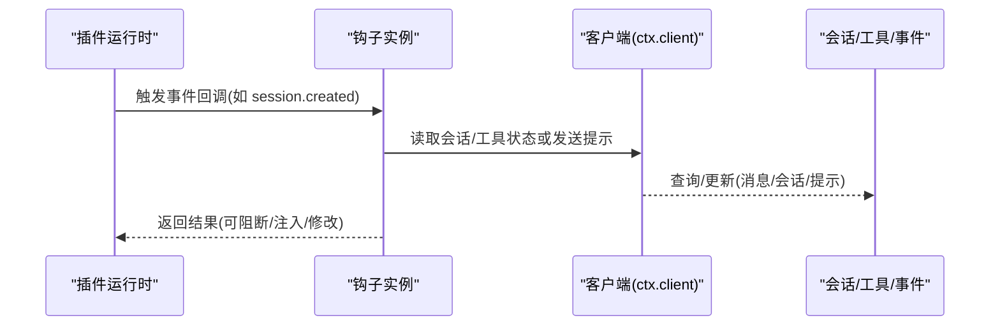

**图表来源**
- [src/hooks/session-notification.ts](file://src/hooks/session-notification.ts#L260-L330)
- [src/hooks/auto-update-checker/index.ts](file://src/hooks/auto-update-checker/index.ts#L63-L96)
- [src/hooks/claude-code-hooks/index.ts](file://src/hooks/claude-code-hooks/index.ts#L170-L234)

## 详细组件分析

### 上下文窗口监控钩子
- 功能概述：在工具执行后根据会话最后一条助手消息的令牌用量，计算当前使用占比并在阈值较高时追加提醒。
- 关键点：
  - 仅对 Anthropic 提供商生效，支持 20 万/100 万令牌上限切换。
  - 使用最近一次助手消息的输入+缓存读取令牌作为实际使用量。
  - 会话删除事件清理内存状态，避免重复提醒。
- 触发条件：tool.execute.after；事件回调中处理 session.deleted 清理。
- 性能与健壮性：异常捕获后优雅降级，不影响工具执行。

**图表来源**
- [src/hooks/context-window-monitor.ts](file://src/hooks/context-window-monitor.ts#L36-L82)

**章节来源**
- [src/hooks/context-window-monitor.ts](file://src/hooks/context-window-monitor.ts#L1-L100)

### 会话恢复钩子
- 功能概述：检测并恢复因格式错误导致的会话中断，支持三类错误类型：缺少工具结果、思维块顺序问题、禁用思维时仍包含思维内容。
- 关键点：
  - 错误类型识别基于错误消息字符串匹配。
  - 对应恢复策略：注入取消的工具结果、前置思维块、剥离思维内容。
  - 可选自动续跑：当启用实验选项时，在修复后自动发起一次用户提示以继续任务。
  - 回调钩子：支持设置"中止前""恢复完成"回调，便于 UI 或日志联动。
- 触发条件：会话错误事件；内部通过消息列表定位失败助手消息并执行修复。
- 复杂度与可靠性：O(n) 遍历消息；失败时返回 false 并记录错误日志。

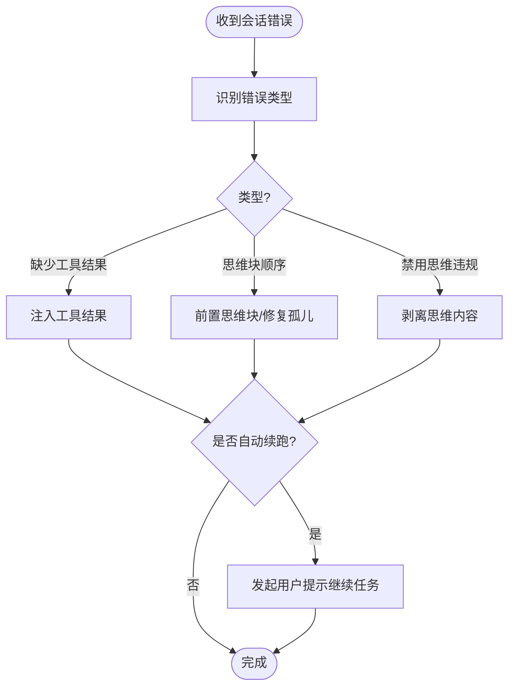

**图表来源**
- [src/hooks/session-recovery/index.ts](file://src/hooks/session-recovery/index.ts#L125-L149)
- [src/hooks/session-recovery/index.ts](file://src/hooks/session-recovery/index.ts#L394-L410)

**章节来源**
- [src/hooks/session-recovery/index.ts](file://src/hooks/session-recovery/index.ts#L1-L433)

### 自动更新检查钩子
- 功能概述：在会话创建时检查本地版本与最新版本，支持本地开发模式、可选自动安装与 TUI 提示。
- 关键点：
  - 版本通道解析：预发布与 dist-tag 通道识别。
  - 后台检查：若发现新版本，可自动更新配置中的固定版本并安全执行安装。
  - 启动提示：支持旋转动画提示与本地开发模式提示。
  - 配置错误展示：首次启动显示配置加载错误。
- 触发条件：session.created；带父会话 ID 的会话不触发。
- 容错性：安装失败回退为仅通知。

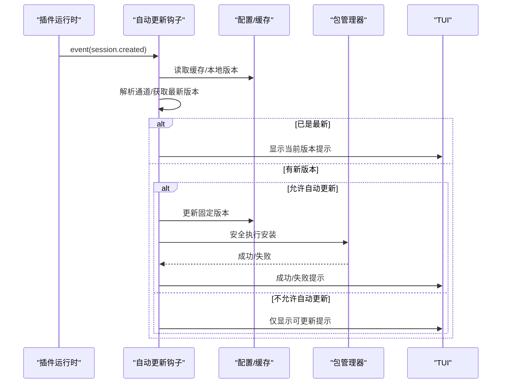

**图表来源**
- [src/hooks/auto-update-checker/index.ts](file://src/hooks/auto-update-checker/index.ts#L63-L96)
- [src/hooks/auto-update-checker/index.ts](file://src/hooks/auto-update-checker/index.ts#L99-L158)

**章节来源**
- [src/hooks/auto-update-checker/index.ts](file://src/hooks/auto-update-checker/index.ts#L1-L261)

### 编辑错误恢复钩子
- 功能概述：针对编辑工具的常见 AI 错误（旧内容未找到、重复匹配等）注入即时纠正提醒，强制用户先核对真实文件状态再继续。
- 关键点：
  - 错误模式常量与提醒文本内联定义。
  - 工具执行后扫描输出文本，命中即追加提醒。
- 触发条件：tool.execute.after；仅对 edit 工具生效。

**图表来源**
- [src/hooks/edit-error-recovery/index.ts](file://src/hooks/edit-error-recovery/index.ts#L40-L56)

**章节来源**
- [src/hooks/edit-error-recovery/index.ts](file://src/hooks/edit-error-recovery/index.ts#L1-L58)

### Claude Code 钩子（实验性）
- 功能概述：围绕 Claude 会话生命周期提供多阶段钩子：预压缩、用户提示提交、工具使用前后、停止时机等；支持禁用开关与上下文收集。
- 关键点：
  - 预压缩：向上下文注入额外内容。
  - 用户提示：可阻断或注入额外消息。
  - 工具使用：可拒绝、修改输入或追加警告/消息。
  - 停止时机：在会话空闲时根据错误/中断状态决定是否注入提示或忽略阻断。
  - 事件清理：会话删除时清理错误/中断/首条消息标记。
- 触发条件：experimental.session.compacting、chat.message、tool.execute.before/after、event(session.*)。
- 安全性：阻断与注入均通过 TUI 提示反馈。

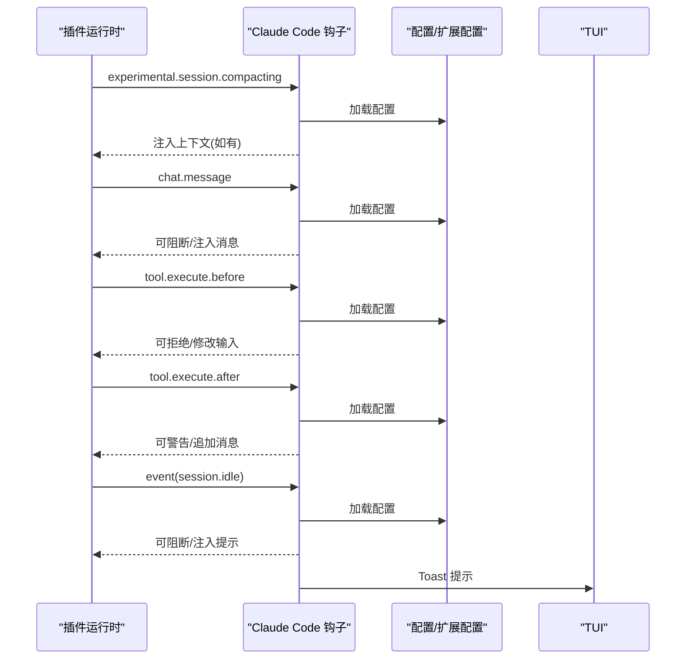

**图表来源**
- [src/hooks/claude-code-hooks/index.ts](file://src/hooks/claude-code-hooks/index.ts#L42-L69)
- [src/hooks/claude-code-hooks/index.ts](file://src/hooks/claude-code-hooks/index.ts#L170-L234)
- [src/hooks/claude-code-hooks/index.ts](file://src/hooks/claude-code-hooks/index.ts#L314-L399)

**章节来源**
- [src/hooks/claude-code-hooks/index.ts](file://src/hooks/claude-code-hooks/index.ts#L1-L402)

### 工具输出截断钩子
- 功能概述：对指定工具输出进行动态截断，避免超长输出影响上下文窗口与性能。
- 关键点：
  - 支持按工具特定阈值与全局阈值控制。
  - 可通过实验配置开启"截断全部工具输出"。
  - 截断失败时优雅降级。
- 触发条件：tool.execute.after；命中工具名单或全局开关。

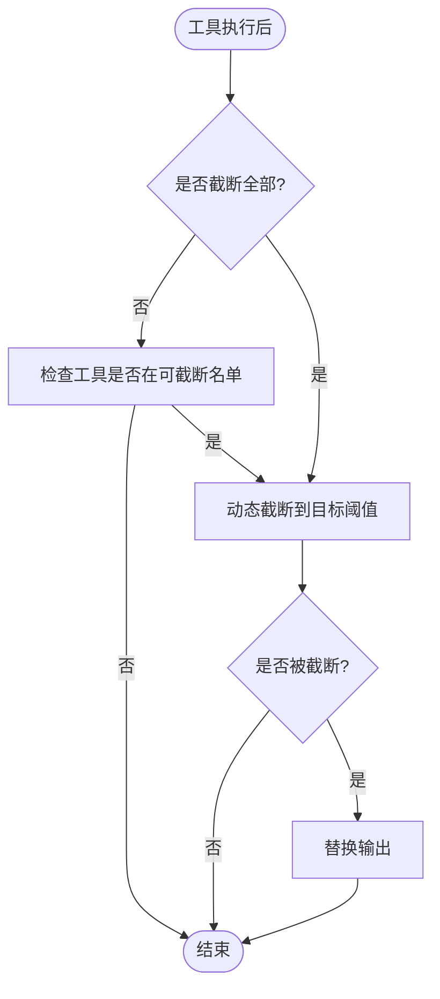

**图表来源**
- [src/hooks/tool-output-truncator.ts](file://src/hooks/tool-output-truncator.ts#L37-L60)

**章节来源**
- [src/hooks/tool-output-truncator.ts](file://src/hooks/tool-output-truncator.ts#L1-L62)

### 背景通知钩子
- 功能概述：将事件路由给后台管理器，负责后续通知投递。
- 关键点：
  - 事件路由：接收 event 并转发至 manager.handleEvent。
  - 通知投递：由管理器直接通过 session.prompt 发送无回复提示。
- 触发条件：任意 event；主要用于事件汇聚与解耦。

**章节来源**
- [src/hooks/background-notification/index.ts](file://src/hooks/background-notification/index.ts#L1-L29)

### Anthropic 上下文限制恢复钩子
- 功能概述：在会话错误或消息更新携带令牌限制错误时，自动执行压缩与恢复流程，必要时注入提示。
- 关键点：
  - 错误解析：从错误中提取提供商与模型信息。
  - 状态机：维护待压缩会话、错误数据、重试/截断/空内容尝试状态、压缩进行中集合。
  - 会话空闲时触发恢复：显示 Toast 并执行压缩。
  - 事件清理：会话删除时清理相关状态。
- 触发条件：session.error、message.updated、session.idle、session.deleted。

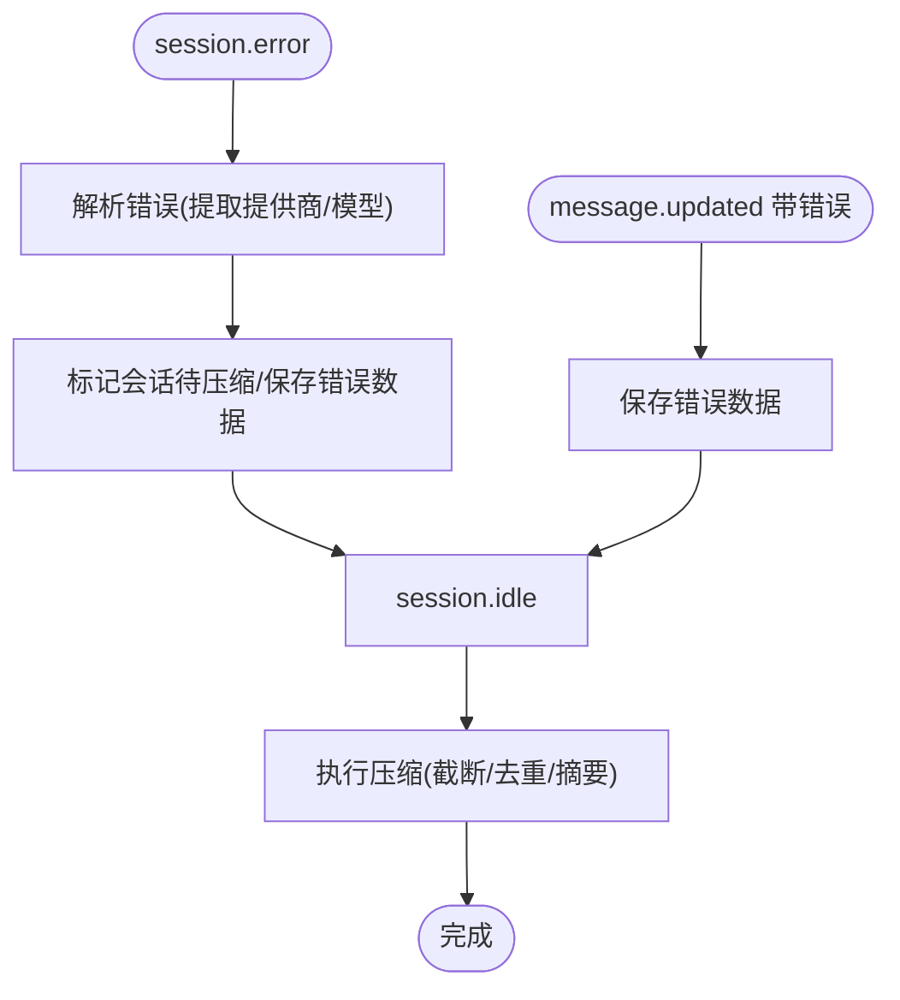

**图表来源**
- [src/hooks/anthropic-context-window-limit-recovery/index.ts](file://src/hooks/anthropic-context-window-limit-recovery/index.ts#L27-L85)
- [src/hooks/anthropic-context-window-limit-recovery/index.ts](file://src/hooks/anthropic-context-window-limit-recovery/index.ts#L105-L142)

**章节来源**
- [src/hooks/anthropic-context-window-limit-recovery/index.ts](file://src/hooks/anthropic-context-window-limit-recovery/index.ts#L1-L152)

### 会话通知钩子
- 功能概述：在会话空闲时发送跨平台系统通知与声音提示，支持跳过未完成任务、延迟确认、最大跟踪会话数等配置。
- 关键点：
  - 平台检测与默认音效路径。
  - 延迟确认与版本号防竞态，避免并发通知冲突。
  - 子代理会话过滤：仅对主会话触发。
  - 未完成任务跳过：可配置是否在存在未完成任务时跳过通知。
- 触发条件：session.updated/created、session.idle、message.created/updated、tool.execute.*、session.deleted。

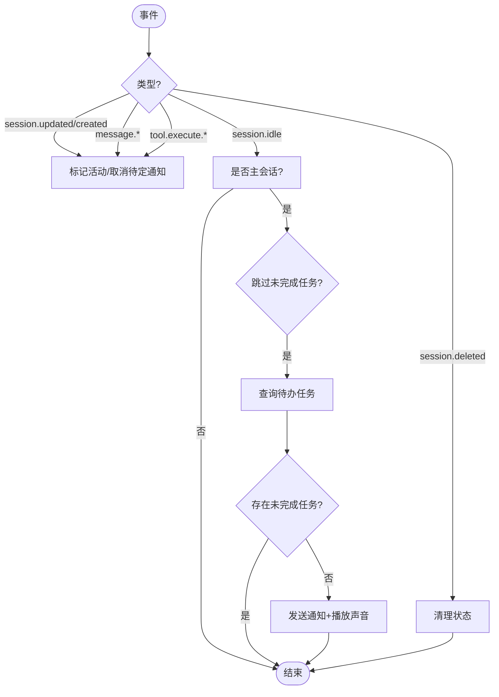

**图表来源**
- [src/hooks/session-notification.ts](file://src/hooks/session-notification.ts#L260-L330)

**章节来源**
- [src/hooks/session-notification.ts](file://src/hooks/session-notification.ts#L1-L331)

### 编排上下文注入器
- 功能概述：在会话编排（压缩）时注入结构化上下文提示，帮助总结保留关键信息。
- 关键点：
  - 注入系统指令风格的结构化摘要要求。
  - 标记编排时间用于冷却控制。
  - 失败时记录日志但不影响流程。

**章节来源**
- [src/hooks/compaction-context-injector/index.ts](file://src/hooks/compaction-context-injector/index.ts#L1-L67)

### Sisyphus 编排器钩子
- 功能概述：管理 Sisyphus 开发流程的编排与协调，包括任务规划、执行监督、阶段转换与最终归档。
- 关键点：
  - **重复触发防护**：通过 `awaiting_user` 状态检查防止 Phase 3 的重复触发，确保编排流程的正确性。
  - 阶段状态管理：支持 planning、executing、awaiting_user、completed 等阶段状态。
  - 任务委派：强制单任务原则，阻止批量任务委派。
  - 文件操作监督：防止直接文件修改，强制通过委派任务机制。
  - 阶段转换追踪：通过技能调用自动更新阶段状态。
- 触发条件：session.idle、message.updated、tool.execute.before/after、session.error、session.deleted。
- **更新**：修复了重复触发 Phase 3 的问题，通过检查 `boulderState.phase === "awaiting_user"` 来防止重复触发。

**图表来源**
- [src/hooks/sisyphus-orchestrator/index.ts](file://src/hooks/sisyphus-orchestrator/index.ts#L706-L737)

**章节来源**
- [src/hooks/sisyphus-orchestrator/index.ts](file://src/hooks/sisyphus-orchestrator/index.ts#L1-L1013)

### Todo 继续强制钩子
- 功能概述：强制执行待办事项的连续性，通过倒计时提醒和自动注入继续提示来确保任务完成。
- 关键点：
  - **关键字检测增强**：新增 git 和发布决策关键字检测系统，防止在用户进行 git 操作或发布决策时中断。
  - 事件驱动的倒计时机制：2 秒倒计时，期间用户活动会取消注入。
  - 代理权限检查：确保代理具有写权限才能执行注入。
  - 抑制条件：背景任务运行中、代理恢复模式、编排冷却期、boulder 终止状态。
  - **更新**：增强了 git 操作（merge、push、commit 等）和发布决策（publish、deploy、release）的检测能力。
- 触发条件：session.idle、message.updated、message.part.updated、tool.execute.before/after、session.error、session.deleted。
- **更新**：添加了 `containsGitPublishKeywords` 函数和 `GIT_PUBLISH_KEYWORDS` 关键字数组，用于智能检测用户意图。

**图表来源**
- [src/hooks/todo-continuation-enforcer.ts](file://src/hooks/todo-continuation-enforcer.ts#L341-L487)
- [src/hooks/todo-continuation-enforcer.ts](file://src/hooks/todo-continuation-enforcer.ts#L490-L539)

**章节来源**
- [src/hooks/todo-continuation-enforcer.ts](file://src/hooks/todo-continuation-enforcer.ts#L1-L570)

### TDD 强制钩子
- 功能概述：强制测试驱动开发，拦截对高风险文件的编辑，必要时注入 TDD 技能并追加后续提示。
- 关键点：
  - 风险分级与豁免规则。
  - /tdd on/off 命令控制启用状态。
  - 编辑后追加 lint 提醒。
  - 会话生命周期事件初始化状态。
- 触发条件：tool.execute.before/after、chat.message(UserPromptSubmit)、event(session.created)。

**章节来源**
- [src/hooks/tdd-guard/index.ts](file://src/hooks/tdd-guard/index.ts#L1-L296)

### 调试注入钩子
- 功能概述：跟踪修复失败次数，达到阈值后注入系统化调试技能，引导根因调查。
- 关键点：
  - 失败模式识别与时间窗口清理。
  - 连续失败阈值触发一次性注入。
  - 成功时可重置状态。
- 触发条件：tool.execute.before/after。

**章节来源**
- [src/hooks/debugging-injector/index.ts](file://src/hooks/debugging-injector/index.ts#L1-L224)

### 失败计数钩子
- 功能概述：统计 sisyphus_task 等工具的连续失败次数，依次触发"注入调试技能""调度 Oracle""阻断工具"，并支持命令重置。
- 关键点：
  - 多阈值响应链路。
  - 会话级阻断状态与消息注入。
  - /reset-failures 命令重置。
- 触发条件：tool.execute.before/after、UserPromptSubmit。

**章节来源**
- [src/hooks/failure-counter/index.ts](file://src/hooks/failure-counter/index.ts#L1-L338)

### 智能技能提醒钩子
- 功能概述：当用户直接切换到具有默认技能的代理时，智能生成技能提醒，确保用户了解可用技能。
- 关键点：
  - **提醒优于注入**：仅生成提醒而非完整技能内容注入
  - 仅在直接代理切换时触发，背景任务会话除外
  - 支持的代理：Prometheus、Metis、Momus、archiver、frontend-ui-ux-engineer
  - 使用上下文收集器进行提醒注入
- 触发条件：chat.message；事件清理：session.deleted、session.compacted
- **新增**：这是新增的agent-skill-reminder钩子系统的核心功能

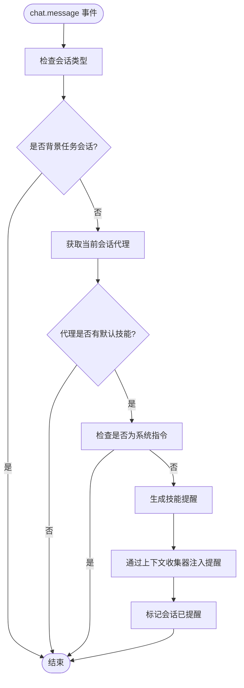

**图表来源**
- [src/hooks/agent-skill-reminder/index.ts](file://src/hooks/agent-skill-reminder/index.ts#L39-L109)

**章节来源**
- [src/hooks/agent-skill-reminder/index.ts](file://src/hooks/agent-skill-reminder/index.ts#L1-L140)
- [src/hooks/agent-skill-reminder/constants.ts](file://src/hooks/agent-skill-reminder/constants.ts#L1-L18)
- [src/hooks/agent-skill-reminder/types.ts](file://src/hooks/agent-skill-reminder/types.ts#L1-L21)

### 代理使用提醒钩子
- 功能概述：监控代理工具使用情况，当用户使用目标工具但未使用代理时显示提醒。
- 关键点：
  - 记录代理使用状态并持久化
  - 目标工具：delegate_task、sisyphus_task 等
  - 代理工具：explore、librarian、frontend-ui-ux-engineer 等
  - 支持状态重置和清理
- 触发条件：tool.execute.after；事件清理：session.deleted、session.compacted
- **新增**：这是新增的agent-usage-reminder钩子系统的核心功能

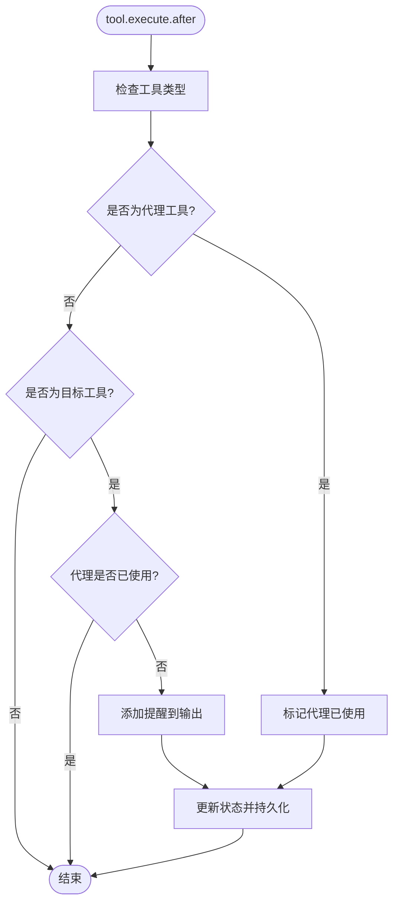

**图表来源**
- [src/hooks/agent-usage-reminder/index.ts](file://src/hooks/agent-usage-reminder/index.ts#L58-L84)

**章节来源**
- [src/hooks/agent-usage-reminder/index.ts](file://src/hooks/agent-usage-reminder/index.ts#L1-L110)

### 关键词检测钩子
- 功能概述：检测用户提示中的关键词，自动激活相应模式并注入上下文提醒。
- 关键点：
  - 支持多种模式：ultrawork、search、analyze、brainstorm、consult-metis
  - 自动检测和注入上下文提醒
  - 支持非主会话的关键词过滤
  - 背景任务会话的模式注入保护
- 触发条件：chat.message；支持系统指令跳过
- **新增**：这是新增的keyword-detector钩子系统的核心功能

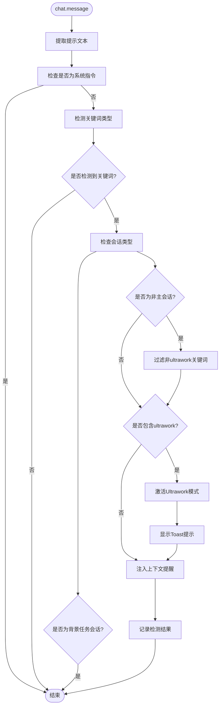

**图表来源**
- [src/hooks/keyword-detector/index.ts](file://src/hooks/keyword-detector/index.ts#L14-L98)

**章节来源**
- [src/hooks/keyword-detector/index.ts](file://src/hooks/keyword-detector/index.ts#L1-L101)
- [src/hooks/keyword-detector/detector.ts](file://src/hooks/keyword-detector/detector.ts#L1-L53)
- [src/hooks/keyword-detector/constants.ts](file://src/hooks/keyword-detector/constants.ts#L1-L276)

### 非交互环境保护钩子
- 功能概述：检测并阻止在非交互环境中使用的交互式命令，自动为git命令添加非交互环境变量。
- 关键点：
  - 检测交互式命令并发出警告
  - 为git命令自动添加非交互环境变量前缀
  - 支持多种shell类型的环境变量构建
- 触发条件：tool.execute.before；仅对bash工具生效
- **新增**：这是新增的non-interactive-env钩子系统的核心功能

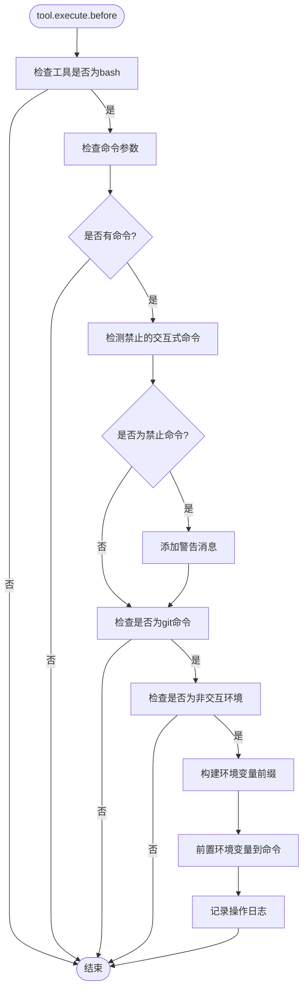

**图表来源**
- [src/hooks/non-interactive-env/index.ts](file://src/hooks/non-interactive-env/index.ts#L25-L61)

**章节来源**
- [src/hooks/non-interactive-env/index.ts](file://src/hooks/non-interactive-env/index.ts#L1-L64)

### 交互式Bash会话管理钩子
- 功能概述：监控tmux会话的创建和销毁，自动管理Omni-OpenCode会话并提供会话提醒。
- 关键点：
  - 解析tmux命令参数，支持复杂的命令行语法
  - 跟踪Omni-OpenCode会话（omo-前缀）
  - 自动清理会话并提供会话状态提醒
  - 支持会话状态的持久化存储
- 触发条件：tool.execute.after；事件清理：session.deleted
- **新增**：这是新增的interactive-bash-session钩子系统的核心功能

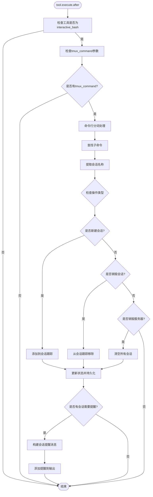

**图表来源**
- [src/hooks/interactive-bash-session/index.ts](file://src/hooks/interactive-bash-session/index.ts#L183-L240)

**章节来源**
- [src/hooks/interactive-bash-session/index.ts](file://src/hooks/interactive-bash-session/index.ts#L1-L263)
- [src/hooks/interactive-bash-session/storage.ts](file://src/hooks/interactive-bash-session/storage.ts#L1-L60)
- [src/hooks/interactive-bash-session/constants.ts](file://src/hooks/interactive-bash-session/constants.ts#L1-L16)
- [src/hooks/interactive-bash-session/types.ts](file://src/hooks/interactive-bash-session/types.ts#L1-L12)

### 智能技能建议钩子
- 功能概述：根据用户提示中的关键词自动建议相关技能，提升工作流程质量。
- 关键点：
  - 检测关键词并过滤已在提示中提及的技能
  - 仅在主会话中显示建议，避免子代理会话的噪音
  - 每个会话每种技能只建议一次
  - 支持多种语言的关键词检测
- 触发条件：chat.message；支持代码块过滤
- **新增**：这是新增的skill-suggestion钩子系统的核心功能

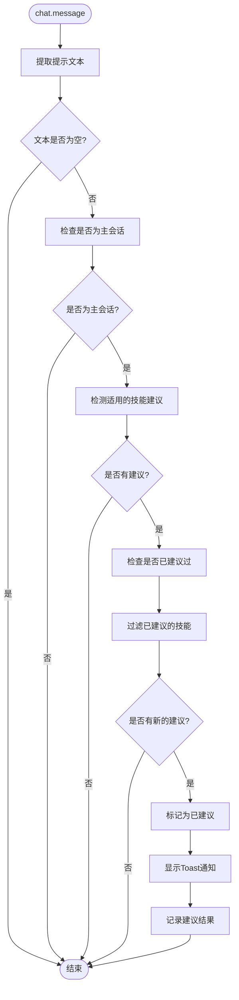

**图表来源**
- [src/hooks/skill-suggestion/index.ts](file://src/hooks/skill-suggestion/index.ts#L64-L137)

**章节来源**
- [src/hooks/skill-suggestion/index.ts](file://src/hooks/skill-suggestion/index.ts#L1-L140)

### 规划流程指导钩子
- 功能概述：监控sisyphus_task调用，提供Metis→Prometheus→Momus规划流程的指导和警告。
- 关键点：
  - 检测规划阶段并跟踪已完成的阶段
  - 当流程顺序不标准时提供警告
  - 根据Momus的反馈更新阶段状态
  - 支持阶段状态的自动更新
- 触发条件：tool.execute.after；仅监控sisyphus_task工具
- **新增**：这是新增的planning-flow-guide钩子系统的核心功能

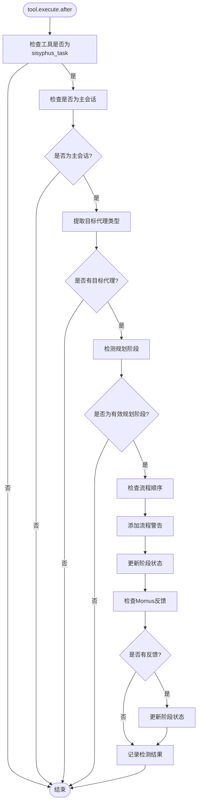

**图表来源**
- [src/hooks/planning-flow-guide/index.ts](file://src/hooks/planning-flow-guide/index.ts#L46-L207)

**章节来源**
- [src/hooks/planning-flow-guide/index.ts](file://src/hooks/planning-flow-guide/index.ts#L1-L210)

### 计划重组钩子
- 功能概述：将已完成的阶段移动到tasks.md底部，保持计划文档的整洁有序。
- 关键点：
  - 自动识别已完成的任务阶段
  - 将已完成内容移动到文档末尾
  - 维护任务的原始顺序和完整性
- 触发条件：相关事件触发时自动执行
- **新增**：这是新增的plan-reorganizer钩子系统的核心功能

**章节来源**
- [src/hooks/plan-reorganizer/index.ts](file://src/hooks/plan-reorganizer/index.ts#L1-L100)

### 计划更新提醒钩子
- 功能概述：在代码变更后提醒用户更新tasks.md，确保计划与实际进展保持一致。
- 关键点：
  - 监控代码变更事件
  - 自动检测需要更新的计划
  - 提供友好的更新提醒
- 触发条件：相关事件触发时自动执行
- **新增**：这是新增的plan-update-reminder钩子系统的核心功能

**章节来源**
- [src/hooks/plan-update-reminder/index.ts](file://src/hooks/plan-update-reminder/index.ts#L1-L100)

### 计划注意力刷新钩子
- 功能概述：将tasks.md内容刷新到注意力窗口，确保用户能够及时关注到重要信息。
- 关键点：
  - 自动检测需要刷新的计划内容
  - 将重要内容重新置于注意力窗口
  - 维护用户的注意力焦点
- 触发条件：相关事件触发时自动执行
- **新增**：这是新增的plan-attention-refresher钩子系统的核心功能

**章节来源**
- [src/hooks/plan-attention-refresher/index.ts](file://src/hooks/plan-attention-refresher/index.ts#L1-L100)

### 子代理验证钩子
- 功能概述：提醒编排器验证委托的工作，确保任务质量和一致性。
- 关键点：
  - 监控子代理任务的完成情况
  - 自动触发验证提醒
  - 确保工作成果符合预期
- 触发条件：相关事件触发时自动执行
- **新增**：这是新增的subagent-verification钩子系统的核心功能

**章节来源**
- [src/hooks/subagent-verification/index.ts](file://src/hooks/subagent-verification/index.ts#L1-L100)

### 背景压缩钩子
- 功能概述：在上下文压缩过程中保留后台任务状态，确保压缩过程不影响正在进行的任务。
- 关键点：
  - 检测后台任务状态
  - 在压缩过程中保护任务状态
  - 确保压缩后的状态一致性
- 触发条件：相关事件触发时自动执行
- **新增**：这是新增的background-compaction钩子系统的核心功能

**章节来源**
- [src/hooks/background-compaction/index.ts](file://src/hooks/background-compaction/index.ts#L1-L100)

### 代码库评估钩子
- 功能概述：在会话开始时评估项目状态，为用户提供全面的代码库概览。
- 关键点：
  - 自动收集代码库信息
  - 生成项目状态报告
  - 提供有用的洞察和建议
- 触发条件：会话创建时自动执行
- **新增**：这是新增的codebase-assessment钩子系统的核心功能

**章节来源**
- [src/hooks/codebase-assessment/index.ts](file://src/hooks/codebase-assessment/index.ts#L1-L100)

### LSP诊断强制钩子
- 功能概述：在任务完成前确保运行LSP诊断，提高代码质量。
- 关键点：
  - 自动检测需要运行诊断的任务
  - 在完成前强制执行诊断
  - 确保代码质量标准
- 触发条件：相关事件触发时自动执行
- **新增**：这是新增的lsp-diagnostics-enforcer钩子系统的核心功能

**章节来源**
- [src/hooks/lsp-diagnostics-enforcer/index.ts](file://src/hooks/lsp-diagnostics-enforcer/index.ts#L1-L100)

### 阶段流程强制钩子
- 功能概述：警告跳过boulder阶段转换的行为，确保遵循正确的开发流程。
- 关键点：
  - 监控阶段转换事件
  - 检测跳过的转换
  - 提供相应的警告和指导
- 触发条件：相关事件触发时自动执行
- **新增**：这是新增的phase-flow-enforcer钩子系统的核心功能

**章节来源**
- [src/hooks/phase-flow-enforcer/index.ts](file://src/hooks/phase-flow-enforcer/index.ts#L1-L100)

## 依赖关系分析
- 组件内聚与耦合：
  - 各钩子模块相对独立，通过插件输入上下文与客户端交互，耦合度低。
  - 部分钩子共享通用能力（如动态截断、系统指令、日志）。
  - 新增钩子模块之间存在合理的依赖关系，如agent-skill-reminder依赖claude-code-session-state。
- 外部依赖：
  - 包管理器（bun install）用于自动更新。
  - 平台通知与声音（osascript/notify-send/powershell/afplay/paplay/aplay）用于会话通知。
  - Claude Hooks 配置加载与扩展配置。
  - 文件系统操作用于状态持久化（interactive-bash-session）。
- 循环依赖：未见循环导入迹象。

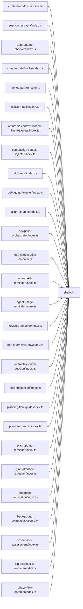

**图表来源**
- [src/hooks/context-window-monitor.ts](file://src/hooks/context-window-monitor.ts#L1-L100)
- [src/hooks/session-recovery/index.ts](file://src/hooks/session-recovery/index.ts#L1-L433)
- [src/hooks/auto-update-checker/index.ts](file://src/hooks/auto-update-checker/index.ts#L1-L261)
- [src/hooks/claude-code-hooks/index.ts](file://src/hooks/claude-code-hooks/index.ts#L1-L402)
- [src/hooks/tool-output-truncator.ts](file://src/hooks/tool-output-truncator.ts#L1-L62)
- [src/hooks/session-notification.ts](file://src/hooks/session-notification.ts#L1-L331)
- [src/hooks/anthropic-context-window-limit-recovery/index.ts](file://src/hooks/anthropic-context-window-limit-recovery/index.ts#L1-L152)
- [src/hooks/compaction-context-injector/index.ts](file://src/hooks/compaction-context-injector/index.ts#L1-L67)
- [src/hooks/tdd-guard/index.ts](file://src/hooks/tdd-guard/index.ts#L1-L296)
- [src/hooks/debugging-injector/index.ts](file://src/hooks/debugging-injector/index.ts#L1-L224)
- [src/hooks/failure-counter/index.ts](file://src/hooks/failure-counter/index.ts#L1-L338)
- [src/hooks/sisyphus-orchestrator/index.ts](file://src/hooks/sisyphus-orchestrator/index.ts#L1-L1013)
- [src/hooks/todo-continuation-enforcer.ts](file://src/hooks/todo-continuation-enforcer.ts#L1-L570)
- [src/hooks/agent-skill-reminder/index.ts](file://src/hooks/agent-skill-reminder/index.ts#L1-L140)
- [src/hooks/agent-usage-reminder/index.ts](file://src/hooks/agent-usage-reminder/index.ts#L1-L110)
- [src/hooks/keyword-detector/index.ts](file://src/hooks/keyword-detector/index.ts#L1-L101)
- [src/hooks/non-interactive-env/index.ts](file://src/hooks/non-interactive-env/index.ts#L1-L64)
- [src/hooks/interactive-bash-session/index.ts](file://src/hooks/interactive-bash-session/index.ts#L1-L263)
- [src/hooks/skill-suggestion/index.ts](file://src/hooks/skill-suggestion/index.ts#L1-L140)
- [src/hooks/planning-flow-guide/index.ts](file://src/hooks/planning-flow-guide/index.ts#L1-L210)

## 性能考量
- 事件节流与幂等：会话状态集合（如提醒/通知/压缩）避免重复触发；版本检查与安装失败回退减少无效 IO。
- 计算复杂度：消息遍历与状态清理多为 O(n)，阈值判断为 O(1)；整体在合理范围内。
- I/O 优化：通知与声音调用在平台可用时才执行；工具输出截断采用动态阈值，避免一次性大对象处理。
- 可观测性：大量日志与 Toast 提示便于定位问题，但需注意在高频事件下的日志密度控制。
- **新增**：新钩子模块引入了状态持久化（interactive-bash-session）、上下文收集（agent-skill-reminder）等机制，需要考虑磁盘I/O和内存使用的影响。

## 故障排查指南
- 常见问题与定位
  - 会话恢复失败：查看错误类型识别与对应恢复函数返回值；确认消息列表与存储读取是否成功。
  - 自动更新未生效：检查通道解析、配置固定版本更新与安装过程；关注安装失败回退路径。
  - 编辑错误未注入提醒：确认工具名大小写匹配与输出文本包含错误模式。
  - Claude 钩子未生效：检查配置禁用开关、会话中断/错误状态、事件是否到达。
  - 通知未弹出：确认平台支持、默认音效路径、未完成任务跳过策略、会话主从关系。
  - **Sisyphus 编排器重复触发**：检查 `awaiting_user` 状态检查是否正常工作。
  - **Todo 继续强制钩子误触发**：确认 git/publish 关键字检测是否正确识别用户意图。
  - **智能技能提醒未触发**：检查代理是否具有默认技能、会话类型是否为背景任务、系统指令过滤是否生效。
  - **代理使用提醒重复显示**：确认状态持久化是否正常工作、会话清理事件是否触发。
  - **关键词检测误报/漏报**：检查关键词正则表达式、代码块过滤是否正确。
  - **非交互环境保护失效**：确认shell类型检测、环境变量构建是否正确。
  - **交互式Bash会话管理异常**：检查命令行解析、会话状态持久化、会话清理逻辑。
  - **智能技能建议重复建议**：确认会话状态跟踪、已建议技能过滤逻辑。
  - **规划流程指导错误**：检查代理类型检测、阶段状态更新逻辑。
- 调试技巧
  - 启用详细日志：钩子内部广泛使用日志记录关键路径与耗时。
  - 使用事件监听：通过 event 回调观察会话生命周期变化。
  - 临时禁用钩子：通过配置禁用开关快速隔离问题。
  - 复现最小场景：构造最小会话与工具调用，逐步验证各钩子行为。
  - **新增**：使用专门的日志前缀区分新钩子功能，如"[agent-skill-reminder]"、"[keyword-detector]"、"[interactive-bash-session]"等。

**章节来源**
- [src/hooks/session-recovery/index.ts](file://src/hooks/session-recovery/index.ts#L413-L424)
- [src/hooks/auto-update-checker/index.ts](file://src/hooks/auto-update-checker/index.ts#L160-L168)
- [src/hooks/edit-error-recovery/index.ts](file://src/hooks/edit-error-recovery/index.ts#L40-L56)
- [src/hooks/claude-code-hooks/index.ts](file://src/hooks/claude-code-hooks/index.ts#L46-L48)
- [src/hooks/session-notification.ts](file://src/hooks/session-notification.ts#L260-L330)
- [src/hooks/sisyphus-orchestrator/index.ts](file://src/hooks/sisyphus-orchestrator/index.ts#L706-L710)
- [src/hooks/todo-continuation-enforcer.ts](file://src/hooks/todo-continuation-enforcer.ts#L413-L426)
- [src/hooks/agent-skill-reminder/index.ts](file://src/hooks/agent-skill-reminder/index.ts#L77-L83)
- [src/hooks/agent-usage-reminder/index.ts](file://src/hooks/agent-usage-reminder/index.ts#L58-L84)
- [src/hooks/keyword-detector/index.ts](file://src/hooks/keyword-detector/index.ts#L28-L31)
- [src/hooks/non-interactive-env/index.ts](file://src/hooks/non-interactive-env/index.ts#L38-L41)
- [src/hooks/interactive-bash-session/index.ts](file://src/hooks/interactive-bash-session/index.ts#L169-L181)
- [src/hooks/skill-suggestion/index.ts](file://src/hooks/skill-suggestion/index.ts#L118-L131)
- [src/hooks/planning-flow-guide/index.ts](file://src/hooks/planning-flow-guide/index.ts#L141-L174)

## 结论
Oh My OpenCode 的钩子系统以事件驱动为核心，围绕会话生命周期与工具执行前后提供细粒度扩展点。内置钩子覆盖上下文管理、错误恢复、更新与通知、质量保障（TDD/调试/失败计数）等多个维度，既保证稳定性又具备良好的可扩展性。

**更新**：最新的重大更新包括激活12个休眠钩子并新增agent-skill-reminder钩子系统，大幅扩展了钩子生态系统。新增功能包括智能技能提醒、代理使用监控、关键词检测、非交互环境保护、交互式Bash会话管理、智能技能建议、规划流程指导等，显著提升了系统的智能化水平和用户体验。

通过工厂函数与统一注册接口，开发者可便捷地创建、配置与集成自定义钩子。新的钩子类型签名和兼容性改进使得钩子系统的扩展更加灵活和可靠。

## 附录

### 钩子生命周期与触发顺序
- 生命周期节点
  - 会话：created、updated、idle、deleted、error
  - 消息：created、updated
  - 工具：execute.before、execute.after
  - 事件：任意 event
- 执行顺序
  - 同一事件类型下，多个钩子的先后顺序由插件运行时决定；钩子内部可通过阻断、注入消息等方式影响后续处理。
  - **更新**：Sisyphus 编排器钩子现在优先检查 `awaiting_user` 状态，防止重复触发 Phase 3。
  - **新增**：新钩子模块遵循相同的生命周期模式，支持事件清理和状态持久化。

**章节来源**
- [src/hooks/claude-code-hooks/index.ts](file://src/hooks/claude-code-hooks/index.ts#L314-L399)
- [src/hooks/session-notification.ts](file://src/hooks/session-notification.ts#L260-L330)
- [src/hooks/sisyphus-orchestrator/index.ts](file://src/hooks/sisyphus-orchestrator/index.ts#L706-L710)

### 钩子扩展开发指南
- 创建步骤
  - 定义工厂函数：createXxxHook(ctx, options?)
  - 实现事件处理器：返回包含事件回调的对象（如 "tool.execute.after"、event 等）
  - 使用 ctx.client 与 ctx.directory 访问会话与文件系统
  - 在钩子内部维护必要的状态（Set/Map/计数器），并在 session.deleted 等事件清理
  - **新增**：考虑状态持久化需求，使用适当的存储机制
- 注册与配置
  - 在插件初始化处调用 createXxxHook(ctx, options) 获取处理器对象
  - 将返回对象合并到插件输入上下文，等待运行时自动触发
  - options 中可传入实验配置、回调钩子等参数
  - **更新**：新钩子类型签名更加规范，支持更好的类型安全
- 最佳实践
  - 保持幂等与可重入：多次触发不应产生副作用
  - 优雅降级：异常捕获后不影响主流程
  - 明确阻断与注入边界：通过 TUI 提示反馈
  - 文档化触发条件与副作用：便于他人理解与维护
  - **更新**：考虑状态检查机制，如 `awaiting_user` 状态检查，避免重复触发。
  - **新增**：实现事件清理逻辑，确保状态一致性；使用上下文收集器进行非侵入式注入。

**章节来源**
- [src/hooks/context-window-monitor.ts](file://src/hooks/context-window-monitor.ts#L33-L99)
- [src/hooks/claude-code-hooks/index.ts](file://src/hooks/claude-code-hooks/index.ts#L36-L401)
- [src/hooks/sisyphus-orchestrator/index.ts](file://src/hooks/sisyphus-orchestrator/index.ts#L706-L710)

### 实际配置示例与调试技巧
- 自动更新检查
  - 启用自动更新与启动提示：在 createAutoUpdateCheckerHook(options) 中设置 autoUpdate 与 showStartupToast
  - 通道解析：支持预发布与 dist-tag，自动识别 channel
- 会话通知
  - 跳过未完成任务：skipIfIncompleteTodos=true
  - 延迟确认：idleConfirmationDelay=1500（毫秒）
  - 最大跟踪会话数：maxTrackedSessions=100
- 编排上下文注入
  - 在编排阶段调用 createCompactionContextInjector() 注入结构化摘要提示
- **Sisyphus 编排器钩子**
  - **重复触发防护**：系统自动检查 `awaiting_user` 状态，防止 Phase 3 重复触发
  - 阶段状态管理：通过技能调用自动更新阶段状态
- **Todo 继续强制钩子**
  - **关键字检测**：自动检测 git 操作（merge、push、commit 等）和发布决策（publish、deploy、release）关键字
  - **智能抑制**：在用户进行 git 操作或发布决策时自动抑制继续提醒
- **智能技能提醒钩子**
  - **代理技能提醒**：自动检测具有默认技能的代理切换，生成并注入技能提醒
  - **上下文收集**：使用上下文收集器进行非侵入式提醒注入
- **代理使用提醒钩子**
  - **状态持久化**：使用文件系统存储代理使用状态，支持重启后状态恢复
  - **事件清理**：在会话删除和压缩时自动清理状态
- **关键词检测钩子**
  - **多语言支持**：支持英文、韩语、日语、中文、越南语等多种语言的关键词检测
  - **模式激活**：自动激活Ultrawork、Search、Analyze、Brainstorm、Consult-Metis等模式
- **非交互环境保护钩子**
  - **命令检测**：自动检测交互式命令并发出警告
  - **环境变量**：为git命令自动添加非交互环境变量前缀
- **交互式Bash会话管理钩子**
  - **命令解析**：支持复杂的tmux命令行语法解析
  - **会话跟踪**：自动跟踪Omni-OpenCode会话并提供状态提醒
- **智能技能建议钩子**
  - **关键词过滤**：自动过滤已在提示中提及的技能
  - **会话隔离**：仅在主会话中显示建议，避免子代理会话的噪音
- **规划流程指导钩子**
  - **阶段检测**：自动检测Metis、Prometheus、Momus等规划阶段
  - **状态更新**：根据Momus反馈自动更新阶段状态
- 调试技巧
  - 通过日志定位：关注 "[auto-update-checker]"、"[session-recovery]"、"[auto-compact]"、"[sisyphus-orchestrator]"、"[todo-continuation-enforcer]"、"[agent-skill-reminder]"、"[keyword-detector]"、"[interactive-bash-session]" 等前缀日志
  - 使用事件回调观察状态变化：session.error、message.updated、session.idle
  - 临时禁用钩子：通过配置禁用开关快速隔离问题
  - **更新**：检查 `awaiting_user` 状态和关键字检测日志，确认重复触发防护和智能抑制功能正常工作
  - **新增**：使用专门的日志前缀区分新钩子功能，便于调试和问题定位

**章节来源**
- [src/hooks/auto-update-checker/index.ts](file://src/hooks/auto-update-checker/index.ts#L46-L97)
- [src/hooks/session-notification.ts](file://src/hooks/session-notification.ts#L151-L160)
- [src/hooks/compaction-context-injector/index.ts](file://src/hooks/compaction-context-injector/index.ts#L46-L66)
- [src/hooks/sisyphus-orchestrator/index.ts](file://src/hooks/sisyphus-orchestrator/index.ts#L706-L720)
- [src/hooks/todo-continuation-enforcer.ts](file://src/hooks/todo-continuation-enforcer.ts#L62-L87)
- [src/hooks/agent-skill-reminder/index.ts](file://src/hooks/agent-skill-reminder/index.ts#L86-L108)
- [src/hooks/agent-usage-reminder/index.ts](file://src/hooks/agent-usage-reminder/index.ts#L46-L51)
- [src/hooks/keyword-detector/index.ts](file://src/hooks/keyword-detector/index.ts#L63-L81)
- [src/hooks/non-interactive-env/index.ts](file://src/hooks/non-interactive-env/index.ts#L38-L61)
- [src/hooks/interactive-bash-session/index.ts](file://src/hooks/interactive-bash-session/index.ts#L215-L239)
- [src/hooks/skill-suggestion/index.ts](file://src/hooks/skill-suggestion/index.ts#L118-L131)
- [src/hooks/planning-flow-guide/index.ts](file://src/hooks/planning-flow-guide/index.ts#L126-L140)