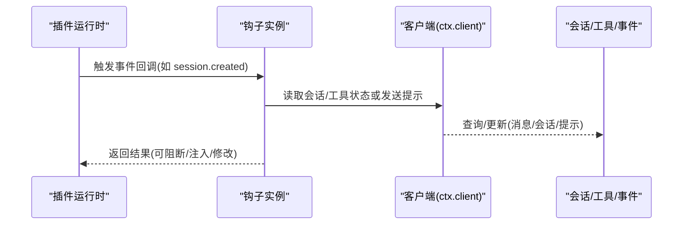
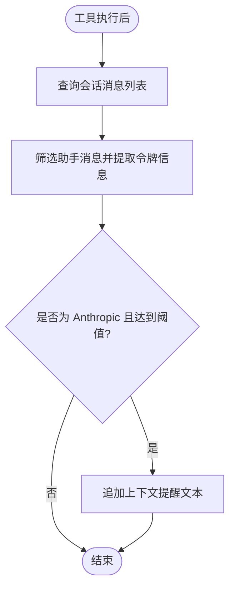
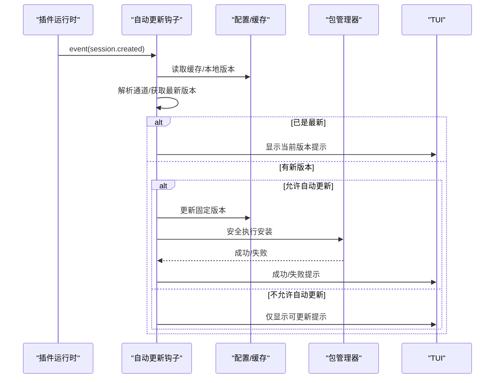
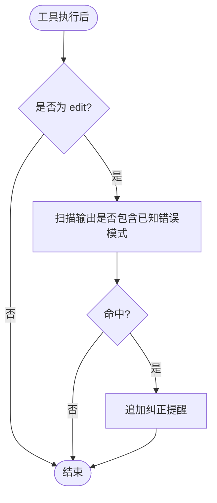
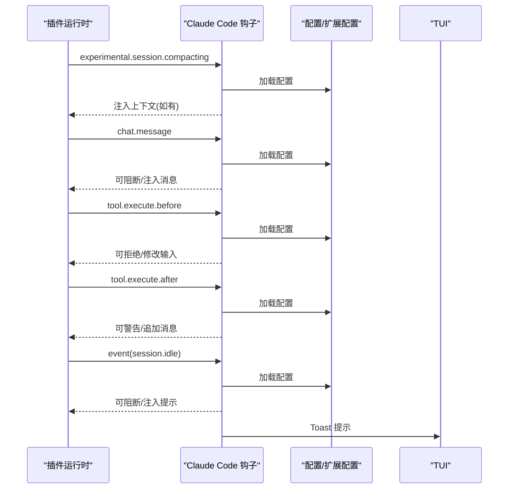
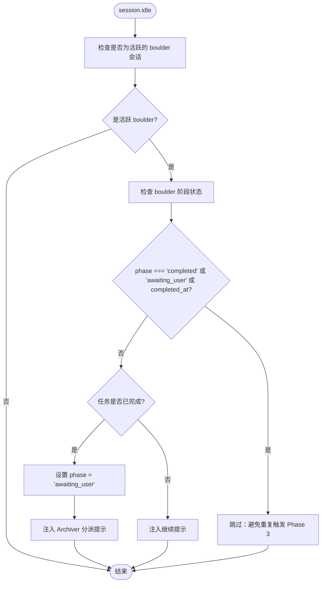
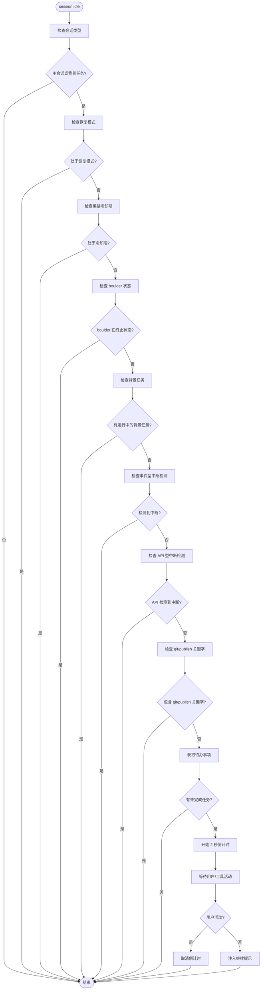
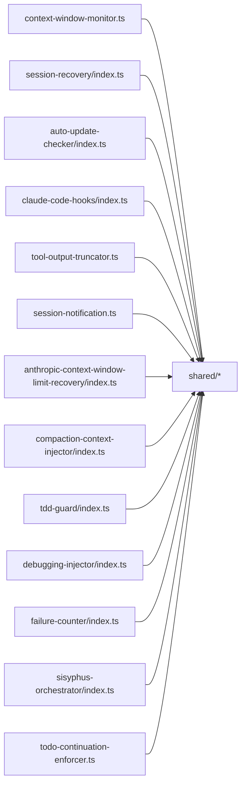

# 钩子系统

<cite>
**本文引用的文件**
- [src/hooks/index.ts](file://src/hooks/index.ts)
- [src/hooks/context-window-monitor.ts](file://src/hooks/context-window-monitor.ts)
- [src/hooks/session-recovery/index.ts](file://src/hooks/session-recovery/index.ts)
- [src/hooks/auto-update-checker/index.ts](file://src/hooks/auto-update-checker/index.ts)
- [src/hooks/edit-error-recovery/index.ts](file://src/hooks/edit-error-recovery/index.ts)
- [src/hooks/claude-code-hooks/index.ts](file://src/hooks/claude-code-hooks/index.ts)
- [src/hooks/tool-output-truncator.ts](file://src/hooks/tool-output-truncator.ts)
- [src/hooks/background-notification/index.ts](file://src/hooks/background-notification/index.ts)
- [src/hooks/anthropic-context-window-limit-recovery/index.ts](file://src/hooks/anthropic-context-window-limit-recovery/index.ts)
- [src/hooks/session-notification.ts](file://src/hooks/session-notification.ts)
- [src/hooks/compaction-context-injector/index.ts](file://src/hooks/compaction-context-injector/index.ts)
- [src/hooks/tdd-guard/index.ts](file://src/hooks/tdd-guard/index.ts)
- [src/hooks/debugging-injector/index.ts](file://src/hooks/debugging-injector/index.ts)
- [src/hooks/failure-counter/index.ts](file://src/hooks/failure-counter/index.ts)
- [src/hooks/sisyphus-orchestrator/index.ts](file://src/hooks/sisyphus-orchestrator/index.ts)
- [src/hooks/todo-continuation-enforcer.ts](file://src/hooks/todo-continuation-enforcer.ts)
</cite>

## 更新摘要
**变更内容**
- 更新Sisyphus编排器钩子章节，添加重复触发问题修复说明
- 新增Todo继续强制钩子关键字检测增强功能章节
- 更新钩子生命周期与触发顺序说明，反映最新的状态检查机制

## 目录
1. [简介](#简介)
2. [项目结构](#项目结构)
3. [核心组件](#核心组件)
4. [架构总览](#架构总览)
5. [详细组件分析](#详细组件分析)
6. [依赖关系分析](#依赖关系分析)
7. [性能考量](#性能考量)
8. [故障排查指南](#故障排查指南)
9. [结论](#结论)
10. [附录](#附录)

## 简介
本文件面向 Oh My OpenCode 的钩子系统，系统性阐述其事件驱动架构与设计理念，覆盖上下文窗口监控、会话恢复、自动更新检查、错误恢复、通知管理、工具输出截断、编排上下文注入、TDD 强制、调试注入与失败计数等内置钩子。文档同时提供钩子生命周期、触发条件与执行顺序说明，并给出扩展开发指南（自定义钩子创建、注册与配置）、实际配置示例与调试技巧。

## 项目结构
钩子系统位于 src/hooks 目录下，按功能域拆分多个独立模块，每个模块导出一个或多个工厂函数用于创建钩子实例。入口索引文件集中导出所有可用钩子，便于统一注册与使用。

```mermaid
graph TB
subgraph "钩子入口"
IDX["src/hooks/index.ts"]
end
subgraph "内置钩子模块"
CW["context-window-monitor.ts"]
SR["session-recovery/index.ts"]
AUC["auto-update-checker/index.ts"]
EER["edit-error-recovery/index.ts"]
CCH["claude-code-hooks/index.ts"]
TOT["tool-output-truncator.ts"]
BGN["background-notification/index.ts"]
ACW["anthropic-context-window-limit-recovery/index.ts"]
SN["session-notification.ts"]
CCI["compaction-context-injector/index.ts"]
TDG["tdd-guard/index.ts"]
DDI["debugging-injector/index.ts"]
FCT["failure-counter/index.ts"]
SIS["sisyphus-orchestrator/index.ts"]
TCE["todo-continuation-enforcer.ts"]
end
IDX --> CW
IDX --> SR
IDX --> AUC
IDX --> EER
IDX --> CCH
IDX --> TOT
IDX --> BGN
IDX --> ACW
IDX --> SN
IDX --> CCI
IDX --> TDG
IDX --> DDI
IDX --> FCT
IDX --> SIS
IDX --> TCE
```

**图表来源**
- [src/hooks/index.ts](file://src/hooks/index.ts#L1-L48)
- [src/hooks/context-window-monitor.ts](file://src/hooks/context-window-monitor.ts#L1-L100)
- [src/hooks/session-recovery/index.ts](file://src/hooks/session-recovery/index.ts#L1-L433)
- [src/hooks/auto-update-checker/index.ts](file://src/hooks/auto-update-checker/index.ts#L1-L261)
- [src/hooks/edit-error-recovery/index.ts](file://src/hooks/edit-error-recovery/index.ts#L1-L58)
- [src/hooks/claude-code-hooks/index.ts](file://src/hooks/claude-code-hooks/index.ts#L1-L402)
- [src/hooks/tool-output-truncator.ts](file://src/hooks/tool-output-truncator.ts#L1-L62)
- [src/hooks/background-notification/index.ts](file://src/hooks/background-notification/index.ts#L1-L29)
- [src/hooks/anthropic-context-window-limit-recovery/index.ts](file://src/hooks/anthropic-context-window-limit-recovery/index.ts#L1-L152)
- [src/hooks/session-notification.ts](file://src/hooks/session-notification.ts#L1-L331)
- [src/hooks/compaction-context-injector/index.ts](file://src/hooks/compaction-context-injector/index.ts#L1-L67)
- [src/hooks/tdd-guard/index.ts](file://src/hooks/tdd-guard/index.ts#L1-L296)
- [src/hooks/debugging-injector/index.ts](file://src/hooks/debugging-injector/index.ts#L1-L224)
- [src/hooks/failure-counter/index.ts](file://src/hooks/failure-counter/index.ts#L1-L338)
- [src/hooks/sisyphus-orchestrator/index.ts](file://src/hooks/sisyphus-orchestrator/index.ts#L1-L1013)
- [src/hooks/todo-continuation-enforcer.ts](file://src/hooks/todo-continuation-enforcer.ts#L1-L570)

**章节来源**
- [src/hooks/index.ts](file://src/hooks/index.ts#L1-L48)

## 核心组件
- 事件驱动钩子模型：钩子以事件回调形式接入插件运行时，支持 session.*、tool.execute.*、message.*、event 等多种事件类型。
- 工厂函数模式：每个钩子通过 createXxxHook(ctx, options?) 返回事件处理器对象，统一注册到插件输入上下文。
- 生命周期与触发条件：钩子在会话创建、消息变更、工具执行前后、事件广播等节点被触发；部分钩子还维护内部状态（如会话集合、计数器、版本缓存）。
- 执行顺序：同一事件类型下，多个钩子的执行顺序由插件运行时决定；钩子内部可利用"阻断""注入消息"等机制影响后续处理。

**章节来源**
- [src/hooks/context-window-monitor.ts](file://src/hooks/context-window-monitor.ts#L33-L99)
- [src/hooks/session-recovery/index.ts](file://src/hooks/session-recovery/index.ts#L321-L432)
- [src/hooks/auto-update-checker/index.ts](file://src/hooks/auto-update-checker/index.ts#L46-L97)
- [src/hooks/claude-code-hooks/index.ts](file://src/hooks/claude-code-hooks/index.ts#L36-L401)

## 架构总览
钩子系统采用"事件驱动 + 工厂函数"的架构，围绕插件输入上下文（ctx）与客户端（client）进行交互。不同钩子在各自生命周期节点执行业务逻辑，部分钩子通过外部服务（如包管理器、系统通知）增强用户体验。

**图表来源**
- [src/hooks/session-notification.ts](file://src/hooks/session-notification.ts#L260-L330)
- [src/hooks/auto-update-checker/index.ts](file://src/hooks/auto-update-checker/index.ts#L63-L96)
- [src/hooks/claude-code-hooks/index.ts](file://src/hooks/claude-code-hooks/index.ts#L170-L234)

## 详细组件分析

### 上下文窗口监控钩子
- 功能概述：在工具执行后根据会话最后一条助手消息的令牌用量，计算当前使用占比并在阈值较高时追加提醒。
- 关键点：
  - 仅对 Anthropic 提供商生效，支持 20 万/100 万令牌上限切换。
  - 使用最近一次助手消息的输入+缓存读取令牌作为实际使用量。
  - 会话删除事件清理内存状态，避免重复提醒。
- 触发条件：tool.execute.after；事件回调中处理 session.deleted 清理。
- 性能与健壮性：异常捕获后优雅降级，不影响工具执行。

**图表来源**
- [src/hooks/context-window-monitor.ts](file://src/hooks/context-window-monitor.ts#L36-L82)

**章节来源**
- [src/hooks/context-window-monitor.ts](file://src/hooks/context-window-monitor.ts#L1-L100)

### 会话恢复钩子
- 功能概述：检测并恢复因格式错误导致的会话中断，支持三类错误类型：缺少工具结果、思维块顺序问题、禁用思维时仍包含思维内容。
- 关键点：
  - 错误类型识别基于错误消息字符串匹配。
  - 对应恢复策略：注入取消的工具结果、前置思维块、剥离思维内容。
  - 可选自动续跑：当启用实验选项时，在修复后自动发起一次用户提示以继续任务。
  - 回调钩子：支持设置"中止前""恢复完成"回调，便于 UI 或日志联动。
- 触发条件：会话错误事件；内部通过消息列表定位失败助手消息并执行修复。
- 复杂度与可靠性：O(n) 遍历消息；失败时返回 false 并记录错误日志。

**图表来源**
- [src/hooks/session-recovery/index.ts](file://src/hooks/session-recovery/index.ts#L125-L149)
- [src/hooks/session-recovery/index.ts](file://src/hooks/session-recovery/index.ts#L394-L410)

**章节来源**
- [src/hooks/session-recovery/index.ts](file://src/hooks/session-recovery/index.ts#L1-L433)

### 自动更新检查钩子
- 功能概述：在会话创建时检查本地版本与最新版本，支持本地开发模式、可选自动安装与 TUI 提示。
- 关键点：
  - 版本通道解析：预发布与 dist-tag 通道识别。
  - 后台检查：若发现新版本，可自动更新配置中的固定版本并安全执行安装。
  - 启动提示：支持旋转动画提示与本地开发模式提示。
  - 配置错误展示：首次启动显示配置加载错误。
- 触发条件：session.created；带父会话 ID 的会话不触发。
- 容错性：安装失败回退为仅通知。

**图表来源**
- [src/hooks/auto-update-checker/index.ts](file://src/hooks/auto-update-checker/index.ts#L63-L96)
- [src/hooks/auto-update-checker/index.ts](file://src/hooks/auto-update-checker/index.ts#L99-L158)

**章节来源**
- [src/hooks/auto-update-checker/index.ts](file://src/hooks/auto-update-checker/index.ts#L1-L261)

### 编辑错误恢复钩子
- 功能概述：针对编辑工具的常见 AI 错误（旧内容未找到、重复匹配等）注入即时纠正提醒，强制用户先核对真实文件状态再继续。
- 关键点：
  - 错误模式常量与提醒文本内联定义。
  - 工具执行后扫描输出文本，命中即追加提醒。
- 触发条件：tool.execute.after；仅对 edit 工具生效。

**图表来源**
- [src/hooks/edit-error-recovery/index.ts](file://src/hooks/edit-error-recovery/index.ts#L40-L56)

**章节来源**
- [src/hooks/edit-error-recovery/index.ts](file://src/hooks/edit-error-recovery/index.ts#L1-L58)

### Claude Code 钩子（实验性）
- 功能概述：围绕 Claude 会话生命周期提供多阶段钩子：预压缩、用户提示提交、工具使用前后、停止时机等；支持禁用开关与上下文收集。
- 关键点：
  - 预压缩：向上下文注入额外内容。
  - 用户提示：可阻断或注入额外消息。
  - 工具使用：可拒绝、修改输入或追加警告/消息。
  - 停止时机：在会话空闲时根据错误/中断状态决定是否注入提示或忽略阻断。
  - 事件清理：会话删除时清理错误/中断/首条消息标记。
- 触发条件：experimental.session.compacting、chat.message、tool.execute.before/after、event(session.*)。
- 安全性：阻断与注入均通过 TUI 提示反馈。

**图表来源**
- [src/hooks/claude-code-hooks/index.ts](file://src/hooks/claude-code-hooks/index.ts#L42-L69)
- [src/hooks/claude-code-hooks/index.ts](file://src/hooks/claude-code-hooks/index.ts#L170-L234)
- [src/hooks/claude-code-hooks/index.ts](file://src/hooks/claude-code-hooks/index.ts#L314-L399)

**章节来源**
- [src/hooks/claude-code-hooks/index.ts](file://src/hooks/claude-code-hooks/index.ts#L1-L402)

### 工具输出截断钩子
- 功能概述：对指定工具输出进行动态截断，避免超长输出影响上下文窗口与性能。
- 关键点：
  - 支持按工具特定阈值与全局阈值控制。
  - 可通过实验配置开启"截断全部工具输出"。
  - 截断失败时优雅降级。
- 触发条件：tool.execute.after；命中工具名单或全局开关。

**图表来源**
- [src/hooks/tool-output-truncator.ts](file://src/hooks/tool-output-truncator.ts#L37-L60)

**章节来源**
- [src/hooks/tool-output-truncator.ts](file://src/hooks/tool-output-truncator.ts#L1-L62)

### 背景通知钩子
- 功能概述：将事件路由给后台管理器，负责后续通知投递。
- 关键点：
  - 事件路由：接收 event 并转发至 manager.handleEvent。
  - 通知投递：由管理器直接通过 session.prompt 发送无回复提示。
- 触发条件：任意 event；主要用于事件汇聚与解耦。

**章节来源**
- [src/hooks/background-notification/index.ts](file://src/hooks/background-notification/index.ts#L1-L29)

### Anthropic 上下文限制恢复钩子
- 功能概述：在会话错误或消息更新携带令牌限制错误时，自动执行压缩与恢复流程，必要时注入提示。
- 关键点：
  - 错误解析：从错误中提取提供商与模型信息。
  - 状态机：维护待压缩会话、错误数据、重试/截断/空内容尝试状态、压缩进行中集合。
  - 会话空闲时触发恢复：显示 Toast 并执行压缩。
  - 事件清理：会话删除时清理相关状态。
- 触发条件：session.error、message.updated、session.idle、session.deleted。

**图表来源**
- [src/hooks/anthropic-context-window-limit-recovery/index.ts](file://src/hooks/anthropic-context-window-limit-recovery/index.ts#L27-L85)
- [src/hooks/anthropic-context-window-limit-recovery/index.ts](file://src/hooks/anthropic-context-window-limit-recovery/index.ts#L105-L142)

**章节来源**
- [src/hooks/anthropic-context-window-limit-recovery/index.ts](file://src/hooks/anthropic-context-window-limit-recovery/index.ts#L1-L152)

### 会话通知钩子
- 功能概述：在会话空闲时发送跨平台系统通知与声音提示，支持跳过未完成任务、延迟确认、最大跟踪会话数等配置。
- 关键点：
  - 平台检测与默认音效路径。
  - 延迟确认与版本号防竞态，避免并发通知冲突。
  - 子代理会话过滤：仅对主会话触发。
  - 未完成任务跳过：可配置是否在存在未完成任务时跳过通知。
- 触发条件：session.updated/created、session.idle、message.created/updated、tool.execute.*、session.deleted。

**图表来源**
- [src/hooks/session-notification.ts](file://src/hooks/session-notification.ts#L260-L330)

**章节来源**
- [src/hooks/session-notification.ts](file://src/hooks/session-notification.ts#L1-L331)

### 编排上下文注入器
- 功能概述：在会话编排（压缩）时注入结构化上下文提示，帮助总结保留关键信息。
- 关键点：
  - 注入系统指令风格的结构化摘要要求。
  - 标记编排时间用于冷却控制。
  - 失败时记录日志但不影响流程。

**章节来源**
- [src/hooks/compaction-context-injector/index.ts](file://src/hooks/compaction-context-injector/index.ts#L1-L67)

### Sisyphus 编排器钩子
- 功能概述：管理 Sisyphus 开发流程的编排与协调，包括任务规划、执行监督、阶段转换与最终归档。
- 关键点：
  - **重复触发防护**：通过 `awaiting_user` 状态检查防止 Phase 3 的重复触发，确保编排流程的正确性。
  - 阶段状态管理：支持 planning、executing、awaiting_user、completed 等阶段状态。
  - 任务委派：强制单任务原则，阻止批量任务委派。
  - 文件操作监督：防止直接文件修改，强制通过委派任务机制。
  - 阶段转换追踪：通过技能调用自动更新阶段状态。
- 触发条件：session.idle、message.updated、tool.execute.before/after、session.error、session.deleted。
- **更新**：修复了重复触发 Phase 3 的问题，通过检查 `boulderState.phase === "awaiting_user"` 来防止重复触发。

**图表来源**
- [src/hooks/sisyphus-orchestrator/index.ts](file://src/hooks/sisyphus-orchestrator/index.ts#L706-L737)

**章节来源**
- [src/hooks/sisyphus-orchestrator/index.ts](file://src/hooks/sisyphus-orchestrator/index.ts#L1-L1013)

### Todo 继续强制钩子
- 功能概述：强制执行待办事项的连续性，通过倒计时提醒和自动注入继续提示来确保任务完成。
- 关键点：
  - **关键字检测增强**：新增 git 和发布决策关键字检测系统，防止在用户进行 git 操作或发布决策时中断。
  - 事件驱动的倒计时机制：2 秒倒计时，期间用户活动会取消注入。
  - 代理权限检查：确保代理具有写权限才能执行注入。
  - 抑制条件：背景任务运行中、代理恢复模式、编排冷却期、boulder 终止状态。
  - **更新**：增强了 git 操作（merge、push、commit 等）和发布决策（publish、deploy、release）的检测能力。
- 触发条件：session.idle、message.updated、message.part.updated、tool.execute.before/after、session.error、session.deleted。
- **更新**：添加了 `containsGitPublishKeywords` 函数和 `GIT_PUBLISH_KEYWORDS` 关键字数组，用于智能检测用户意图。

**图表来源**
- [src/hooks/todo-continuation-enforcer.ts](file://src/hooks/todo-continuation-enforcer.ts#L341-L487)
- [src/hooks/todo-continuation-enforcer.ts](file://src/hooks/todo-continuation-enforcer.ts#L490-L539)

**章节来源**
- [src/hooks/todo-continuation-enforcer.ts](file://src/hooks/todo-continuation-enforcer.ts#L1-L570)

### TDD 强制钩子
- 功能概述：强制测试驱动开发，拦截对高风险文件的编辑，必要时注入 TDD 技能并追加后续提示。
- 关键点：
  - 风险分级与豁免规则。
  - /tdd on/off 命令控制启用状态。
  - 编辑后追加 lint 提醒。
  - 会话生命周期事件初始化状态。
- 触发条件：tool.execute.before/after、chat.message(UserPromptSubmit)、event(session.created)。

**章节来源**
- [src/hooks/tdd-guard/index.ts](file://src/hooks/tdd-guard/index.ts#L1-L296)

### 调试注入钩子
- 功能概述：跟踪修复失败次数，达到阈值后注入系统化调试技能，引导根因调查。
- 关键点：
  - 失败模式识别与时间窗口清理。
  - 连续失败阈值触发一次性注入。
  - 成功时可重置状态。
- 触发条件：tool.execute.before/after。

**章节来源**
- [src/hooks/debugging-injector/index.ts](file://src/hooks/debugging-injector/index.ts#L1-L224)

### 失败计数钩子
- 功能概述：统计 sisyphus_task 等工具的连续失败次数，依次触发"注入调试技能""调度 Oracle""阻断工具"，并支持命令重置。
- 关键点：
  - 多阈值响应链路。
  - 会话级阻断状态与消息注入。
  - /reset-failures 命令重置。
- 触发条件：tool.execute.before/after、UserPromptSubmit。

**章节来源**
- [src/hooks/failure-counter/index.ts](file://src/hooks/failure-counter/index.ts#L1-L338)

## 依赖关系分析
- 组件内聚与耦合：
  - 各钩子模块相对独立，通过插件输入上下文与客户端交互，耦合度低。
  - 部分钩子共享通用能力（如动态截断、系统指令、日志）。
- 外部依赖：
  - 包管理器（bun install）用于自动更新。
  - 平台通知与声音（osascript/notify-send/powershell/afplay/paplay/aplay）用于会话通知。
  - Claude Hooks 配置加载与扩展配置。
- 循环依赖：未见循环导入迹象。

**图表来源**
- [src/hooks/context-window-monitor.ts](file://src/hooks/context-window-monitor.ts#L1-L100)
- [src/hooks/session-recovery/index.ts](file://src/hooks/session-recovery/index.ts#L1-L433)
- [src/hooks/auto-update-checker/index.ts](file://src/hooks/auto-update-checker/index.ts#L1-L261)
- [src/hooks/claude-code-hooks/index.ts](file://src/hooks/claude-code-hooks/index.ts#L1-L402)
- [src/hooks/tool-output-truncator.ts](file://src/hooks/tool-output-truncator.ts#L1-L62)
- [src/hooks/session-notification.ts](file://src/hooks/session-notification.ts#L1-L331)
- [src/hooks/anthropic-context-window-limit-recovery/index.ts](file://src/hooks/anthropic-context-window-limit-recovery/index.ts#L1-L152)
- [src/hooks/compaction-context-injector/index.ts](file://src/hooks/compaction-context-injector/index.ts#L1-L67)
- [src/hooks/tdd-guard/index.ts](file://src/hooks/tdd-guard/index.ts#L1-L296)
- [src/hooks/debugging-injector/index.ts](file://src/hooks/debugging-injector/index.ts#L1-L224)
- [src/hooks/failure-counter/index.ts](file://src/hooks/failure-counter/index.ts#L1-L338)
- [src/hooks/sisyphus-orchestrator/index.ts](file://src/hooks/sisyphus-orchestrator/index.ts#L1-L1013)
- [src/hooks/todo-continuation-enforcer.ts](file://src/hooks/todo-continuation-enforcer.ts#L1-L570)

## 性能考量
- 事件节流与幂等：会话状态集合（如提醒/通知/压缩）避免重复触发；版本检查与安装失败回退减少无效 IO。
- 计算复杂度：消息遍历与状态清理多为 O(n)，阈值判断为 O(1)；整体在合理范围内。
- I/O 优化：通知与声音调用在平台可用时才执行；工具输出截断采用动态阈值，避免一次性大对象处理。
- 可观测性：大量日志与 Toast 提示便于定位问题，但需注意在高频事件下的日志密度控制。

## 故障排查指南
- 常见问题与定位
  - 会话恢复失败：查看错误类型识别与对应恢复函数返回值；确认消息列表与存储读取是否成功。
  - 自动更新未生效：检查通道解析、配置固定版本更新与安装过程；关注安装失败回退路径。
  - 编辑错误未注入提醒：确认工具名大小写匹配与输出文本包含错误模式。
  - Claude 钩子未生效：检查配置禁用开关、会话中断/错误状态、事件是否到达。
  - 通知未弹出：确认平台支持、默认音效路径、未完成任务跳过策略、会话主从关系。
  - **Sisyphus 编排器重复触发**：检查 `awaiting_user` 状态检查是否正常工作。
  - **Todo 继续强制钩子误触发**：确认 git/publish 关键字检测是否正确识别用户意图。
- 调试技巧
  - 启用详细日志：钩子内部广泛使用日志记录关键路径与耗时。
  - 使用事件监听：通过 event 回调观察会话生命周期变化。
  - 临时禁用钩子：通过配置禁用开关快速隔离问题。
  - 复现最小场景：构造最小会话与工具调用，逐步验证各钩子行为。

**章节来源**
- [src/hooks/session-recovery/index.ts](file://src/hooks/session-recovery/index.ts#L413-L424)
- [src/hooks/auto-update-checker/index.ts](file://src/hooks/auto-update-checker/index.ts#L160-L168)
- [src/hooks/edit-error-recovery/index.ts](file://src/hooks/edit-error-recovery/index.ts#L40-L56)
- [src/hooks/claude-code-hooks/index.ts](file://src/hooks/claude-code-hooks/index.ts#L46-L48)
- [src/hooks/session-notification.ts](file://src/hooks/session-notification.ts#L260-L330)
- [src/hooks/sisyphus-orchestrator/index.ts](file://src/hooks/sisyphus-orchestrator/index.ts#L706-L710)
- [src/hooks/todo-continuation-enforcer.ts](file://src/hooks/todo-continuation-enforcer.ts#L413-L426)

## 结论
Oh My OpenCode 的钩子系统以事件驱动为核心，围绕会话生命周期与工具执行前后提供细粒度扩展点。内置钩子覆盖上下文管理、错误恢复、更新与通知、质量保障（TDD/调试/失败计数）等多个维度，既保证稳定性又具备良好的可扩展性。通过工厂函数与统一注册接口，开发者可便捷地创建、配置与集成自定义钩子。

**更新**：最新的变更包括 Sisyphus 编排器钩子的重复触发防护机制和 Todo 继续强制钩子的关键字检测增强，进一步提升了系统的稳定性和智能化水平。

## 附录

### 钩子生命周期与触发顺序
- 生命周期节点
  - 会话：created、updated、idle、deleted、error
  - 消息：created、updated
  - 工具：execute.before、execute.after
  - 事件：任意 event
- 执行顺序
  - 同一事件类型下，多个钩子的先后顺序由插件运行时决定；钩子内部可通过阻断、注入消息等方式影响后续处理。
  - **更新**：Sisyphus 编排器钩子现在优先检查 `awaiting_user` 状态，防止重复触发 Phase 3。

**章节来源**
- [src/hooks/claude-code-hooks/index.ts](file://src/hooks/claude-code-hooks/index.ts#L314-L399)
- [src/hooks/session-notification.ts](file://src/hooks/session-notification.ts#L260-L330)
- [src/hooks/sisyphus-orchestrator/index.ts](file://src/hooks/sisyphus-orchestrator/index.ts#L706-L710)

### 钩子扩展开发指南
- 创建步骤
  - 定义工厂函数：createXxxHook(ctx, options?)
  - 实现事件处理器：返回包含事件回调的对象（如 "tool.execute.after"、event 等）
  - 使用 ctx.client 与 ctx.directory 访问会话与文件系统
  - 在钩子内部维护必要的状态（Set/Map/计数器），并在 session.deleted 等事件清理
- 注册与配置
  - 在插件初始化处调用 createXxxHook(ctx, options) 获取处理器对象
  - 将返回对象合并到插件输入上下文，等待运行时自动触发
  - options 中可传入实验配置、回调钩子等参数
- 最佳实践
  - 保持幂等与可重入：多次触发不应产生副作用
  - 优雅降级：异常捕获后不影响主流程
  - 明确阻断与注入边界：通过 TUI 提示反馈
  - 文档化触发条件与副作用：便于他人理解与维护
  - **更新**：考虑状态检查机制，如 `awaiting_user` 状态检查，避免重复触发。

**章节来源**
- [src/hooks/context-window-monitor.ts](file://src/hooks/context-window-monitor.ts#L33-L99)
- [src/hooks/claude-code-hooks/index.ts](file://src/hooks/claude-code-hooks/index.ts#L36-L401)
- [src/hooks/sisyphus-orchestrator/index.ts](file://src/hooks/sisyphus-orchestrator/index.ts#L706-L710)

### 实际配置示例与调试技巧
- 自动更新检查
  - 启用自动更新与启动提示：在 createAutoUpdateCheckerHook(options) 中设置 autoUpdate 与 showStartupToast
  - 通道解析：支持预发布与 dist-tag，自动识别 channel
- 会话通知
  - 跳过未完成任务：skipIfIncompleteTodos=true
  - 延迟确认：idleConfirmationDelay=1500（毫秒）
  - 最大跟踪会话数：maxTrackedSessions=100
- 编排上下文注入
  - 在编排阶段调用 createCompactionContextInjector() 注入结构化摘要提示
- **Sisyphus 编排器钩子**
  - **重复触发防护**：系统自动检查 `awaiting_user` 状态，防止 Phase 3 重复触发
  - 阶段状态管理：通过技能调用自动更新阶段状态
- **Todo 继续强制钩子**
  - **关键字检测**：自动检测 git 操作（merge、push、commit 等）和发布决策（publish、deploy、release）关键字
  - **智能抑制**：在用户进行 git 操作或发布决策时自动抑制继续提醒
- 调试技巧
  - 通过日志定位：关注 "[auto-update-checker]"、"[session-recovery]"、"[auto-compact]"、"[sisyphus-orchestrator]"、"[todo-continuation-enforcer]" 等前缀日志
  - 使用事件回调观察状态变化：session.error、message.updated、session.idle
  - 临时禁用钩子：通过配置禁用开关快速隔离问题
  - **更新**：检查 `awaiting_user` 状态和关键字检测日志，确认重复触发防护和智能抑制功能正常工作

**章节来源**
- [src/hooks/auto-update-checker/index.ts](file://src/hooks/auto-update-checker/index.ts#L46-L97)
- [src/hooks/session-notification.ts](file://src/hooks/session-notification.ts#L151-L160)
- [src/hooks/compaction-context-injector/index.ts](file://src/hooks/compaction-context-injector/index.ts#L46-L66)
- [src/hooks/sisyphus-orchestrator/index.ts](file://src/hooks/sisyphus-orchestrator/index.ts#L706-L720)
- [src/hooks/todo-continuation-enforcer.ts](file://src/hooks/todo-continuation-enforcer.ts#L62-L87)