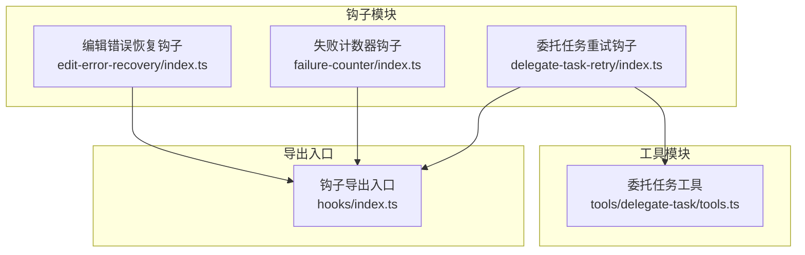
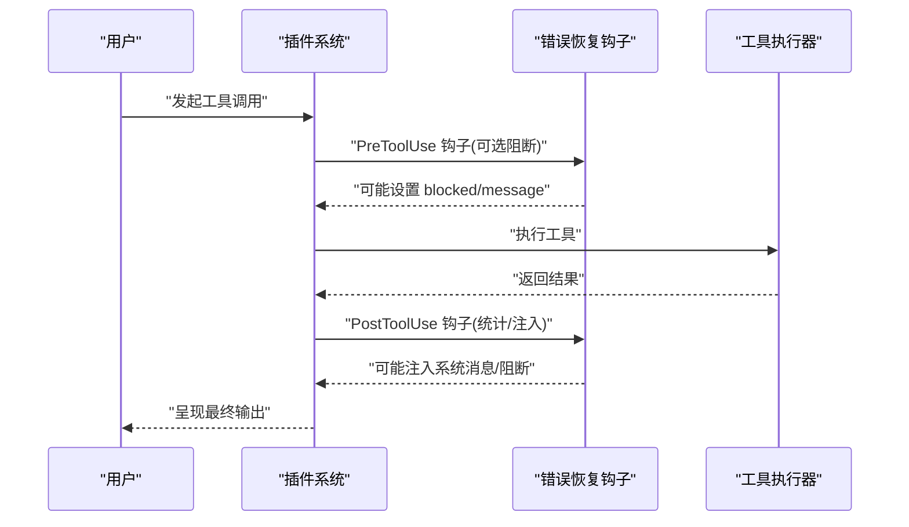
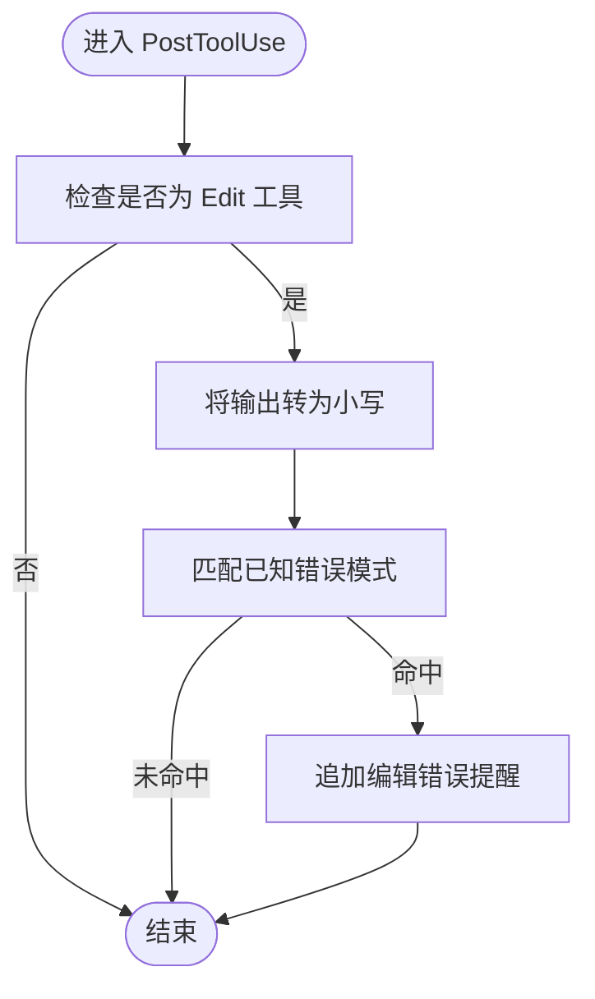
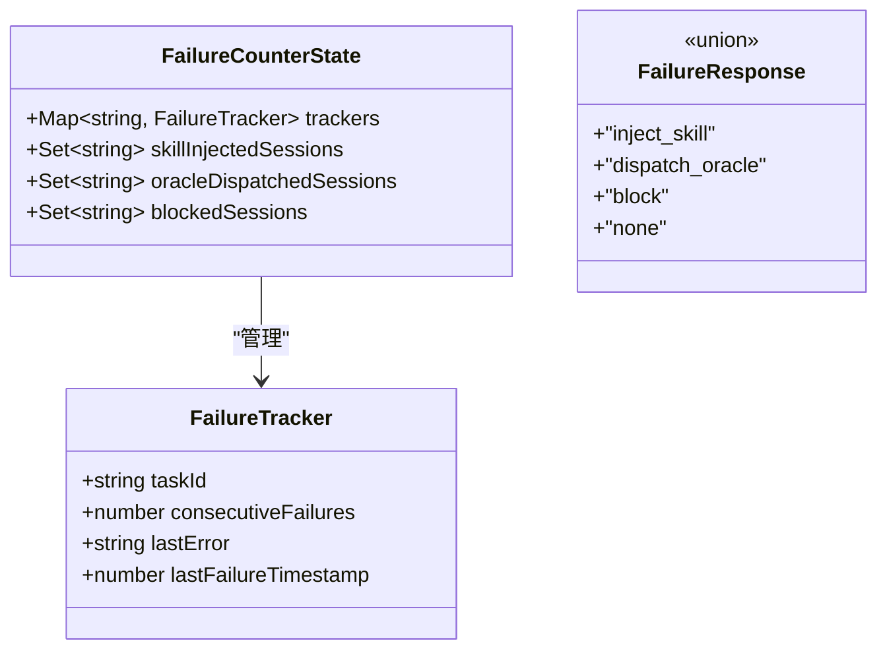
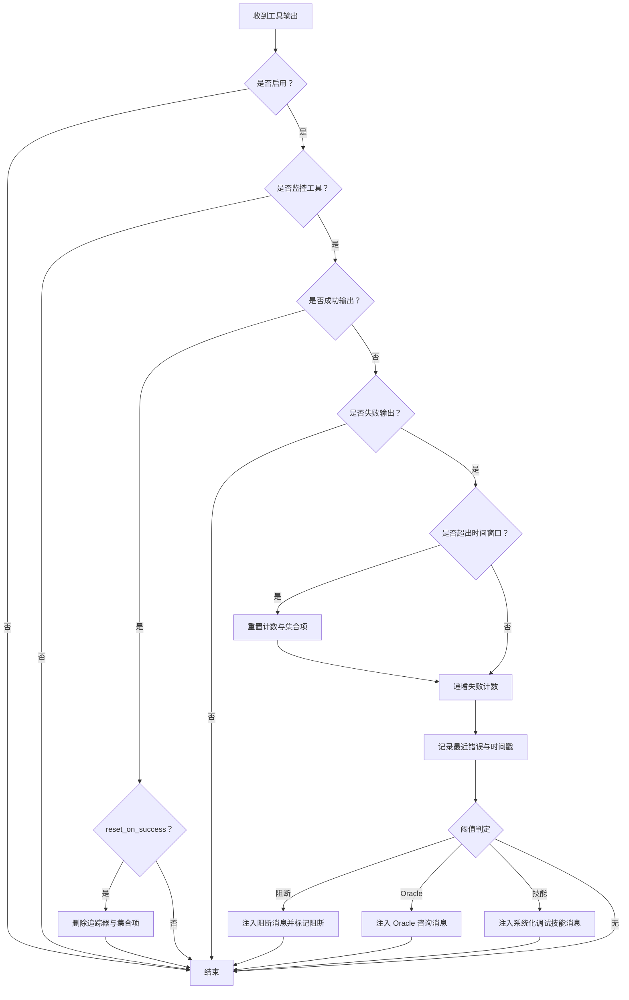
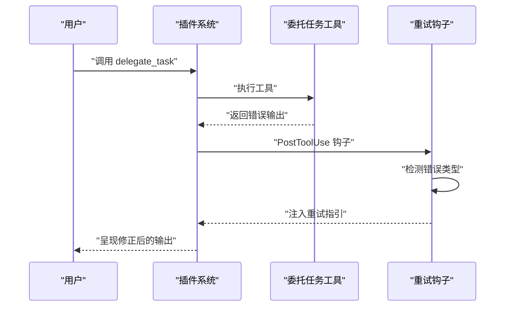
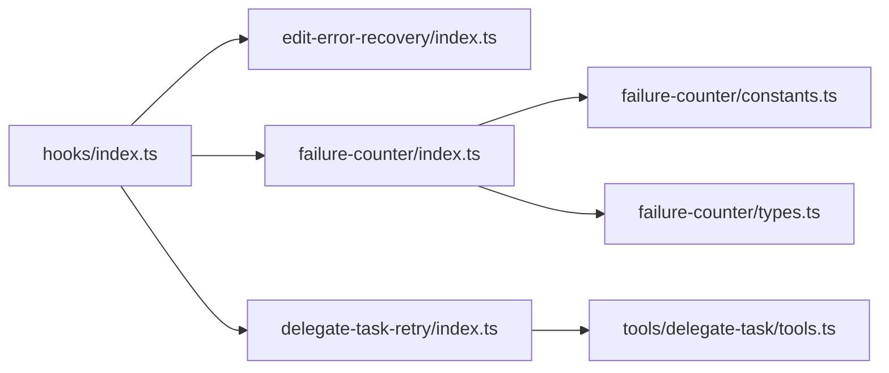

# 错误恢复钩子

<cite>
**本文引用的文件**
- [src/hooks/edit-error-recovery/index.ts](file://src/hooks/edit-error-recovery/index.ts)
- [src/hooks/edit-error-recovery/index.test.ts](file://src/hooks/edit-error-recovery/index.test.ts)
- [src/hooks/failure-counter/index.ts](file://src/hooks/failure-counter/index.ts)
- [src/hooks/failure-counter/constants.ts](file://src/hooks/failure-counter/constants.ts)
- [src/hooks/failure-counter/types.ts](file://src/hooks/failure-counter/types.ts)
- [src/hooks/delegate-task-retry/index.ts](file://src/hooks/delegate-task-retry/index.ts)
- [src/hooks/delegate-task-retry/index.test.ts](file://src/hooks/delegate-task-retry/index.test.ts)
- [src/hooks/index.ts](file://src/hooks/index.ts)
- [src/tools/delegate-task/tools.ts](file://src/tools/delegate-task/tools.ts)
- [docs/SUBAGENTS-COMPARISON.md](file://docs/SUBAGENTS-COMPARISON.md)
</cite>

## 目录
1. [简介](#简介)
2. [项目结构](#项目结构)
3. [核心组件](#核心组件)
4. [架构总览](#架构总览)
5. [详细组件分析](#详细组件分析)
6. [依赖分析](#依赖分析)
7. [性能考虑](#性能考虑)
8. [故障排查指南](#故障排查指南)
9. [结论](#结论)
10. [附录](#附录)

## 简介
本文件面向 Oh My OpenCode 的“错误恢复钩子”体系，系统性阐述三类关键钩子的设计理念与实现策略：
- 编辑错误恢复钩子：针对编辑工具的常见错误进行检测，并注入即时纠正提醒，强制 AI 在修正真实文件状态后再继续。
- 失败计数器钩子：对 sisyphus_task 等工具的连续失败进行统计与阈值判断，自动触发技能注入、Oracle 咨询与阻断，配合用户指令重置。
- 委托任务重试钩子：对 delegate_task 的参数错误进行分类检测，生成可执行的重试指引，帮助用户快速修正参数并重试。

文档同时解释失败计数器的工作原理（统计、阈值、响应触发），委托任务重试钩子的策略（检测、指引构建、注入），并给出最佳实践与性能优化建议。

## 项目结构
错误恢复钩子位于 src/hooks 下，分别实现于独立模块中，并通过统一导出入口集中暴露。委托任务工具位于 src/tools/delegate-task，其内部实现提供了大量错误提示文本，为重试钩子的检测与指引构建提供依据。

图表来源
- [src/hooks/edit-error-recovery/index.ts](file://src/hooks/edit-error-recovery/index.ts#L1-L58)
- [src/hooks/failure-counter/index.ts](file://src/hooks/failure-counter/index.ts#L1-L338)
- [src/hooks/delegate-task-retry/index.ts](file://src/hooks/delegate-task-retry/index.ts#L1-L137)
- [src/hooks/index.ts](file://src/hooks/index.ts#L27-L32)
- [src/tools/delegate-task/tools.ts](file://src/tools/delegate-task/tools.ts#L132-L396)

章节来源
- [src/hooks/index.ts](file://src/hooks/index.ts#L1-L48)

## 核心组件
- 编辑错误恢复钩子：在工具执行后阶段检测编辑错误模式，若命中则向输出追加“即时纠正提醒”，强制 AI 先核验文件真实状态再继续。
- 失败计数器钩子：监控指定工具输出，统计会话维度的连续失败次数，基于时间窗口与阈值触发技能注入、Oracle 咨询或阻断；支持用户指令重置。
- 委托任务重试钩子：解析 delegate_task 的错误输出，匹配预定义错误类型，生成可执行的重试指引（含可用选项列表与正确示例），并注入到输出中。

章节来源
- [src/hooks/edit-error-recovery/index.ts](file://src/hooks/edit-error-recovery/index.ts#L1-L58)
- [src/hooks/failure-counter/index.ts](file://src/hooks/failure-counter/index.ts#L1-L338)
- [src/hooks/delegate-task-retry/index.ts](file://src/hooks/delegate-task-retry/index.ts#L1-L137)

## 架构总览
错误恢复钩子通过插件生命周期事件接入系统：PreToolUse 与 PostToolUse 用于拦截与处理工具调用前后事件；UserPromptSubmit 用于处理用户指令（如重置失败计数）。委托任务重试钩子还依赖委托任务工具的错误输出文本进行检测。

图表来源
- [src/hooks/failure-counter/index.ts](file://src/hooks/failure-counter/index.ts#L128-L160)
- [src/hooks/failure-counter/index.ts](file://src/hooks/failure-counter/index.ts#L165-L284)
- [src/hooks/delegate-task-retry/index.ts](file://src/hooks/delegate-task-retry/index.ts#L121-L136)

## 详细组件分析

### 编辑错误恢复钩子
- 设计理念：将编辑错误归类为“AI 对文件状态的错误假设”，通过注入“即时纠正提醒”强制 AI 先核验真实文件状态，再进行下一步操作。
- 功能特性：
  - 错误检测：匹配编辑工具输出中的典型错误模式（如“oldString 与 newString 必须不同”、“未找到 oldString”、“oldString 多次出现”等）。
  - 响应注入：命中错误时，在输出末尾追加“编辑错误提醒”，明确要求核验文件状态并道歉。
  - 安全边界：仅对 Edit 工具生效，大小写不敏感。
- 实现要点：
  - 使用工具执行后事件进行检测与注入。
  - 输出字符串包含特定关键词即视为命中。
  - 不影响非编辑工具或成功输出。

图表来源
- [src/hooks/edit-error-recovery/index.ts](file://src/hooks/edit-error-recovery/index.ts#L39-L57)

章节来源
- [src/hooks/edit-error-recovery/index.ts](file://src/hooks/edit-error-recovery/index.ts#L1-L58)
- [src/hooks/edit-error-recovery/index.test.ts](file://src/hooks/edit-error-recovery/index.test.ts#L1-L127)

### 失败计数器钩子
- 设计理念：将“连续失败”的提示驱动恢复转为代码强制执行，避免 LLM 忘记或继续盲目尝试。
- 功能特性：
  - 失败统计：按会话维度统计连续失败次数，支持时间窗口重置。
  - 阈值判断：首次失败注入系统化调试技能；第二次失败自动派发 Oracle 咨询；第三次失败阻断工具调用并提示用户介入。
  - 响应触发：根据阈值向消息流注入系统消息，或设置 blocked 状态。
  - 用户干预：提供 /reset-failures 指令重置计数器与阻断状态。
- 关键数据结构：
  - FailureTracker：记录任务 ID、连续失败次数、最近错误与时间戳。
  - FailureCounterState：按会话维护追踪器与已注入/已派发/已阻断集合。
  - FailureResponse：三种响应类型（注入技能、派发 Oracle、阻断）与“无响应”。

图表来源
- [src/hooks/failure-counter/types.ts](file://src/hooks/failure-counter/types.ts#L8-L52)

- 工作流程（时间窗口与阈值）：
  - 成功输出：可选择重置计数器与相关集合。
  - 失败输出：若超出时间窗口则重置；否则递增失败计数并记录最近错误。
  - 阈值决策：依次检查阻断阈值、Oracle 阈值、技能注入阈值，按需注入系统消息。
  - 阻断保护：若会话被阻断，PreToolUse 将直接阻止后续调用并提示重置。

图表来源
- [src/hooks/failure-counter/index.ts](file://src/hooks/failure-counter/index.ts#L165-L284)
- [src/hooks/failure-counter/index.ts](file://src/hooks/failure-counter/index.ts#L128-L160)
- [src/hooks/failure-counter/constants.ts](file://src/hooks/failure-counter/constants.ts#L13-L20)

章节来源
- [src/hooks/failure-counter/index.ts](file://src/hooks/failure-counter/index.ts#L1-L338)
- [src/hooks/failure-counter/constants.ts](file://src/hooks/failure-counter/constants.ts#L1-L99)
- [src/hooks/failure-counter/types.ts](file://src/hooks/failure-counter/types.ts#L1-L52)
- [docs/SUBAGENTS-COMPARISON.md](file://docs/SUBAGENTS-COMPARISON.md#L394-L444)

### 委托任务重试钩子
- 设计理念：将 delegate_task 的常见参数错误进行分类与可执行指引生成，帮助用户快速修正并重试。
- 功能特性：
  - 错误检测：扫描输出中的错误模式，匹配预定义的错误类型（如缺少 run_in_background、互斥参数、未知类别/代理、主代理不可调用、技能缺失等）。
  - 指引构建：根据错误类型生成“修复建议 + 可用选项列表 + 正确示例”，并注入到输出中。
  - 注入策略：仅对 delegate_task 工具生效，命中后追加指引。
- 与委托任务工具的关系：
  - 工具内部返回大量错误文本（如“缺少参数”、“互斥参数”、“未知类别/代理”、“主代理不可调用”、“技能缺失”等），重试钩子据此进行检测与分类。

图表来源
- [src/hooks/delegate-task-retry/index.ts](file://src/hooks/delegate-task-retry/index.ts#L121-L136)
- [src/tools/delegate-task/tools.ts](file://src/tools/delegate-task/tools.ts#L132-L396)

章节来源
- [src/hooks/delegate-task-retry/index.ts](file://src/hooks/delegate-task-retry/index.ts#L1-L137)
- [src/hooks/delegate-task-retry/index.test.ts](file://src/hooks/delegate-task-retry/index.test.ts#L1-L120)
- [src/tools/delegate-task/tools.ts](file://src/tools/delegate-task/tools.ts#L132-L396)

## 依赖分析
- 统一导出：钩子通过 hooks/index.ts 暴露，便于插件系统统一注册与启用。
- 工具依赖：委托任务重试钩子依赖委托任务工具的错误输出文本进行检测；失败计数器钩子依赖工具输出中的成功/失败模式进行统计。
- 配置与常量：失败计数器钩子通过 constants.ts 提供默认配置、监控工具列表、失败/成功模式与消息模板。

图表来源
- [src/hooks/index.ts](file://src/hooks/index.ts#L27-L32)
- [src/hooks/delegate-task-retry/index.ts](file://src/hooks/delegate-task-retry/index.ts#L1-L137)
- [src/tools/delegate-task/tools.ts](file://src/tools/delegate-task/tools.ts#L132-L396)
- [src/hooks/failure-counter/constants.ts](file://src/hooks/failure-counter/constants.ts#L1-L99)
- [src/hooks/failure-counter/types.ts](file://src/hooks/failure-counter/types.ts#L1-L52)

章节来源
- [src/hooks/index.ts](file://src/hooks/index.ts#L1-L48)

## 性能考虑
- 时间窗口与内存占用：失败计数器按会话维护追踪器与集合，建议合理设置失败时间窗口，避免长期累积导致内存增长。
- 字符串匹配成本：编辑与委托任务重试钩子均采用字符串包含/正则匹配，建议保持错误模式数量可控，避免过多模式导致检测开销上升。
- 注入消息的体积控制：失败计数器在注入系统消息时会附加较长提示，注意控制消息长度以减少传输与渲染开销。
- 并发与会话隔离：失败计数器按会话维度隔离状态，避免跨会话干扰；在高并发场景下建议关注会话数量与状态清理频率。

## 故障排查指南
- 编辑错误恢复未生效
  - 确认工具名称大小写不敏感检测逻辑是否满足输入格式。
  - 检查输出中是否包含已知错误模式关键词。
  - 参考测试用例验证行为。
- 失败计数器未触发或误触发
  - 检查监控工具列表与输出中的成功/失败模式是否匹配。
  - 确认时间窗口设置是否过短或过长。
  - 使用 /reset-failures 指令重置状态并观察后续行为。
- 委托任务重试未生成指引
  - 确认输出包含工具返回的错误文本片段。
  - 检查错误类型映射表是否覆盖该错误。
  - 参考测试用例验证检测与指引构建逻辑。

章节来源
- [src/hooks/edit-error-recovery/index.test.ts](file://src/hooks/edit-error-recovery/index.test.ts#L1-L127)
- [src/hooks/delegate-task-retry/index.test.ts](file://src/hooks/delegate-task-retry/index.test.ts#L1-L120)
- [src/hooks/failure-counter/index.ts](file://src/hooks/failure-counter/index.ts#L165-L284)

## 结论
错误恢复钩子体系通过“检测—响应—阻断—重置”的闭环机制，将原本依赖 LLM 记忆的恢复逻辑转化为可预测、可审计的代码驱动行为。编辑错误恢复钩子强调“先核验再修改”的安全原则；失败计数器钩子以阈值与时间窗口保障不会陷入无效重试；委托任务重试钩子提供可执行的参数修正指引。三者协同可显著提升系统稳定性与用户体验。

## 附录
- 最佳实践
  - 明确错误模式清单，定期评估与补充。
  - 合理设置失败时间窗口与阈值，平衡自动化与人工干预。
  - 对注入的消息进行结构化组织，便于用户阅读与执行。
  - 提供清晰的用户指令（如 /reset-failures）以支持手动恢复。
- 性能优化建议
  - 控制错误模式数量与匹配复杂度。
  - 合理清理过期追踪器与集合项，避免内存膨胀。
  - 在高并发场景下关注会话隔离与状态同步。