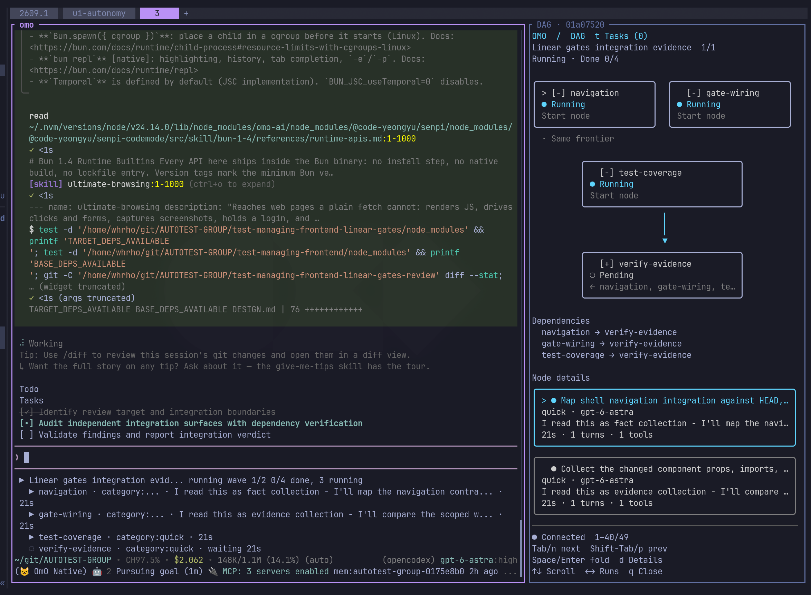
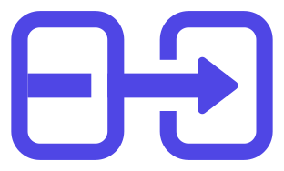
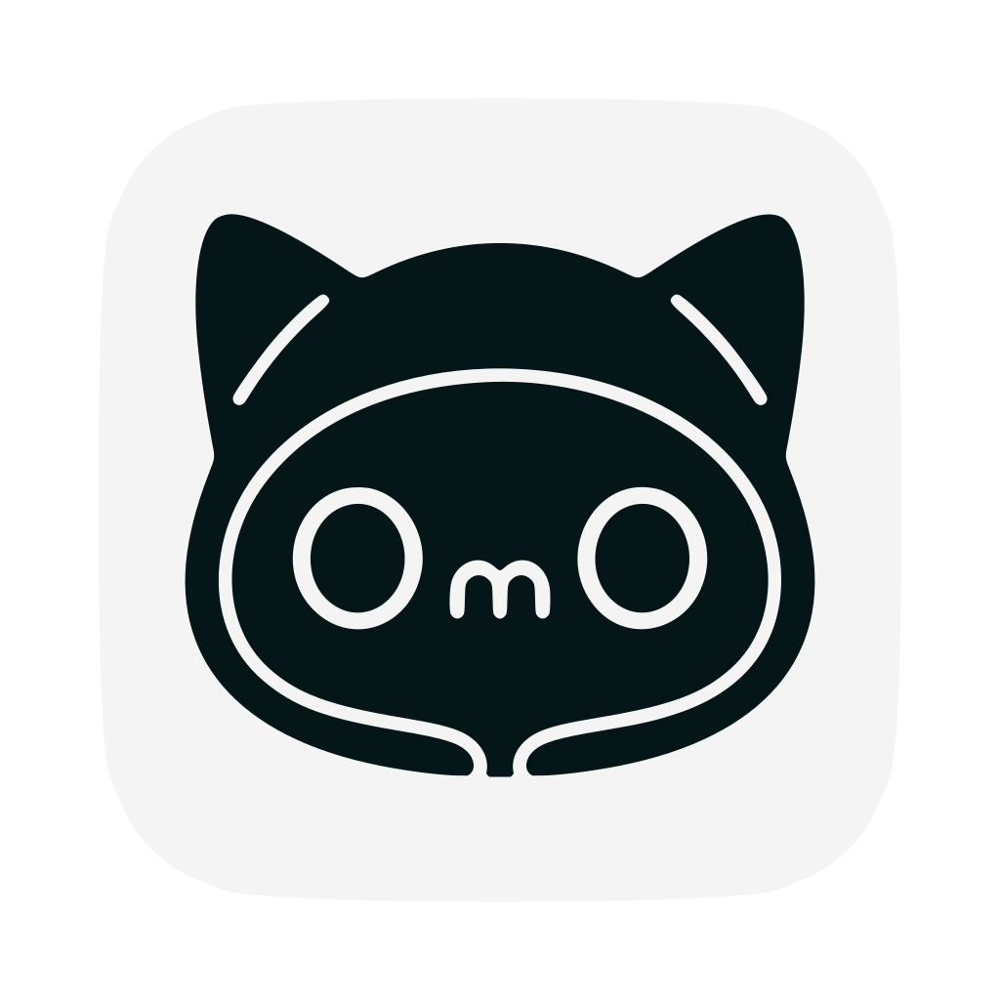

> [!NOTE]
> **OmO 베타: OmO ❤️ Pi**
> `bun add -g omo-ai`로 설치하세요. 메모리 시스템, CodeMode, Anthropic 구독까지 전부 지원됩니다.
> [](https://github.com/jc01rho/omo-herdr-dag)
> *프롬프트에 "mass ulw" 한 줄이면 끝. 당신도 그래프 엔지니어링의 마스터가 됩니다. 멀티 모델 ultracode, 더 나은 메모리 시스템과 함께. (우측의 패널은 [omo-herdr-dag](https://github.com/jc01rho/omo-herdr-dag) 입니다)*


> **Sponsors**
> 아래는 저희의 스폰서입니다. 개인 사이드 프로젝트를 지속하는 데 도움을 주고 있습니다.
> | [](https://opengateway.ai/) | **[OpenGateway](https://opengateway.ai/)**가 OmO를 후원하고 있습니다. 여러 모델 제공사를 하나의 API로 쓸 수 있는 OpenAI 호환 게이트웨이입니다. 오픈소스를 응원해주셔서 감사합니다. |
> | :-----| :----- |

> [!NOTE]
>
> [](https://sisyphuslabs.ai)
> > **OmO는 위의 Jobdori에 의해 메인테이닝되고 있습니다. 당신의 Jobdori, Dori를 만나세요. <br />대기 명단은 [여기](https://sisyphuslabs.ai)에서 받습니다.**

> [!TIP]
> 함께해요!
>
> | [](https://discord.gg/PUwSMR9XNk) | 기여자와 OmO 사용자들을 만나려면 [Discord 커뮤니티](https://discord.gg/PUwSMR9XNk)로 오세요. |
> | :-----| :----- |
> | [](https://x.com/justsisyphus) | 원래 제 X 계정에서 OmO 업데이트를 올렸는데, 계정이 실수로 정지되어 지금은 [@justsisyphus](https://x.com/justsisyphus)에서 대신 업데이트가 올라옵니다. |
> | [](https://github.com/code-yeongyu) | 다른 프로젝트도 궁금하다면 GitHub에서 [@code-yeongyu](https://github.com/code-yeongyu)를 팔로우하세요. |

<!-- <CENTERED SECTION FOR GITHUB DISPLAY> -->

<div align="center">

<a href="https://omo.dev"></a>

# OmO

**Your tool for real work. But it's an agent.**

[](https://github.com/code-yeongyu/oh-my-openagent/releases)
[](https://www.npmjs.com/package/omo-ai)
[](https://github.com/code-yeongyu/oh-my-openagent/graphs/contributors)
[](https://github.com/code-yeongyu/oh-my-openagent/stargazers)
[](https://github.com/code-yeongyu/oh-my-openagent/blob/dev/LICENSE.md)
[](https://omo.dev/docs)

[English](README.md) | [한국어](README.ko.md) | [日本語](README.ja.md) | [简体中文](README.zh-cn.md) | [Русский](README.ru.md)

</div>

<!-- </CENTERED SECTION FOR GITHUB DISPLAY> -->

OmO는 토큰을 끝난 일로 바꿔 주는 `omo` 명령 하나입니다. 만 개가 넘는 소스를 훑는 리서치, 한 번에 이해되는 발표자료, 백엔드, 프론트엔드, 코드까지 맡겨 보세요.

엔진은 [pi](https://github.com/badlogic/pi-mono)를 포크한 senpi이고, 아래 기능은 전부 기본으로 들어 있어요.

## 설치

```bash
bun add -g omo-ai
omo
```

bun이 없으면 `npm i -g omo-ai`로 설치해도 됩니다. 패키지 이름은 `omo-ai`예요. npm의 `omo` 패키지는 다른 사람이 만든 전혀 다른 물건입니다.

프로젝트를 열고 `omo`를 실행한 다음, 할 일을 말하세요. 설정은 그게 끝.

OpenCode 에디션이나 LazyCodex에서 넘어오셨다면 `omo setup`을 한 번 실행하세요. 프로바이더 키, 커스텀 프로바이더, MCP 서버, 스킬, 모델 선택까지 그대로 옮겨 옵니다.

그다음 `omo doctor`가 지금 연결된 프로바이더로 어떤 작업 카테고리를 돌릴 수 있는지, 이전 설치가 무엇을 남겼는지 보여 줘요. 자세한 과정은 [OpenCode에서 옮겨 오기](docs/guide/migrating-from-opencode.md)에 있습니다.

업데이트는 `omo update`, 제거는 `bun remove -g omo-ai`(npm으로 깔았다면 `npm uninstall -g omo-ai`)입니다.

## 왜 OmO인가

**ultrawork.** 따로 공부할 필요는 없어요. 어려운 일이다 싶으면 프롬프트에 `ultrawork`(또는 `ulw`)를 붙이세요. 에이전트가 코드를 고치기 전에 코드베이스부터 읽고, 계획을 세우고, 단계마다 검증하고, 실제 화면에서 결과를 확인한 다음 멈춥니다.

**수백 개의 에이전트, 키워드 하나로.** `mass ulw`를 입력하면 일 전체가 에이전트 그래프가 됩니다. 수천 개 소스를 훑는 딥 리서치, 머신러닝 파이프라인, 아무도 하기 싫은 마이그레이션까지요. 조각마다 맞는 모델이 동시에 돌고, 확인을 거친 뒤에야 끝났다고 말합니다.

**Kibitzer. 당신의 에이전트가 당신과 당신의 일을 잊지 않습니다.** 기억은 마크다운 파일로 된 git 저장소에 쌓여요. 작고 싼 모델이 비싼 메인 에이전트 옆에서 당신이 해 온 일을 다시 읽고, 같은 실수를 하기 전에 한마디 넣어 줍니다. 같은 설명을 두 번 할 일이 없죠.

**고민 없는 멀티모델.** 좋아하는 프론티어 모델과 싼 모델을 섞어 쓰세요. `/login` 하나면 Claude, ChatGPT, Kimi, GLM 구독이 붙습니다. 모델마다 손본 시스템 프롬프트가 딸려 있어서 잘못 고를 일도 없어요.

**고품질 스킬, 꼭 필요한 것만.** 모델은 똑똑해도 현실의 문제를 푸는 요령은 아직 모르는 게 많습니다. OmO는 그 빈자리를 브라우저 사용까지 포함한 스킬로 채우고, 지금 일에 필요한 것만 불러와요.

**나머지도 전부 손봤습니다.** 서로 기다릴 필요 없는 툴 호출은 작은 프로그램 하나로 묶어 한 번에 돌려서, 파일 스무 개를 읽어도 왕복은 한 번이에요. 잘못 만든 툴 인자는 실행 전에 고쳐집니다.

빌드나 배포를 기다릴 때는 계속 들여다보지 않고 알림을 받습니다. 긴 작업은 무엇을 확인했는지 기록해 두니까 세션이 다시 떠도 멈춘 곳부터 이어가요. 설정, 스킬, 프롬프트는 바꾸는 즉시 반영됩니다.

## 설정

기본값에는 분명한 취향이 들어 있지만, 원하면 바꿀 수 있어요. 개인 설정은 `~/.omo/omo.jsonc`, 프로젝트 설정은 그 프로젝트의 `.omo/omo.jsonc`에 두고, 가까운 파일이 이깁니다.

모든 키는 [설정 레퍼런스](docs/reference/configuration.md)에 있습니다.

## 문서

- [omo.dev/docs](https://omo.dev/docs)
- [OpenCode에서 옮겨 오기](docs/guide/migrating-from-opencode.md)
- [설정 레퍼런스](docs/reference/configuration.md)
- [기능](docs/reference/features.md)
- [Ultrawork 선언문](docs/manifesto.md)

## 리뷰

> "It made me cancel my Cursor subscription. Unbelievable things are happening in the open source community." - [Arthur Guiot](https://x.com/arthur_guiot/status/2008736347092382053?s=20)

> "If Claude Code does in 7 days what a human does in 3 months, OmO does it in 1 hour." <br/>- B, Quant Researcher

> "You guys should pull this into core and recruit him. Seriously. It's really, really, really good." <br/>- Henning Kilset

## 제작자의 말

에이전트한테서 운전대를 다시 뺏어 와야 한다면 그건 협업이 아니에요. 시스템이 실패한 거죠. OmO는 그 생각에서 출발했습니다.

당신은 원하는 걸 말하면 됩니다. 조사하고, 계획하고, 시니어 엔지니어가 쓴 것과 구별이 안 되는 코드를 쓰고, 검증하고, 끝날 때까지 가는 건 에이전트 몫이에요. 토큰은 속도가 확실히 붙을 때 쓰고, 쉬운 일은 싼 모델에게 넘깁니다.

저는 이 프로젝트를 제일 집요하게 쓰는 사용자예요. 어느 모델이 논리가 제일 날카로운지, 누가 글을 제일 잘 쓰는지, 이번 주에 다들 뭘 내놨는지. 그 답이 모이는 곳이 OmO입니다. 더 나은 방법이 있으면 PR 주세요.

목표는 있는 줄도 모르게 되는 에이전트. 스위치를 켜면 불이 들어오듯이요. 긴 버전은 [Ultrawork 선언문](docs/manifesto.md)에 있습니다.

여기 나온 어떤 프로젝트나 모델과도 제휴 관계는 없습니다. Ultragoal과 UltraQA 아이디어는 [oh-my-codex](https://github.com/Yeachan-Heo/oh-my-codex)에서 가져와 OmO에 맞게 새로 구현했어요.

## 이런 곳의 전문가들이 씁니다

[Indent](https://indentcorp.com), makers of Spray (influencer marketing solution), vovushop (cross-border commerce platform) and vreview (AI commerce review marketing solution). [Google](https://google.com). [Microsoft](https://microsoft.com). [Vercel](https://vercel.com). [ELESTYLE](https://elestyle.jp), makers of elepay (multi-mobile payment gateway) and OneQR (mobile application SaaS for cashless solutions). [Deepgram](https://deepgram.com).
