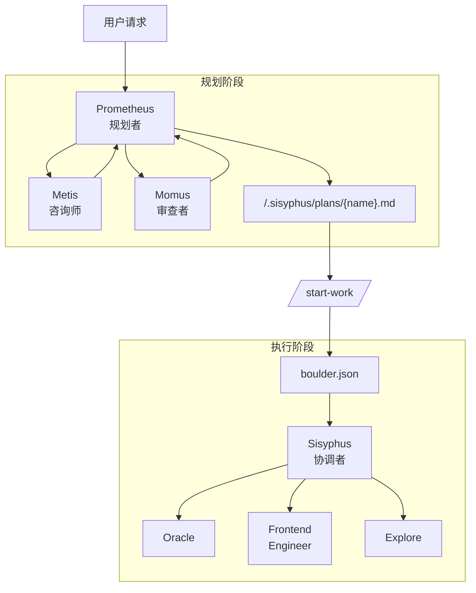

# Oh-My-OpenCode Subagents 完整对比指南

> 本文档详细对比 oh-my-opencode 中所有可用的 subagent，帮助你理解何时使用哪个 agent。

---

## 版本说明

### 原版 v3.0.0-beta（10 个 Agents）

这些是 "THE ORCHESTRATOR" PR #600 (2026-01-09) 引入的官方 agents：

| Agent                             | 模型            | 用途                          |
| --------------------------------- | --------------- | ----------------------------- |
| **Sisyphus**                | Claude Opus 4.5 | 主协调者                      |
| **orchestrator-sisyphus**   | Claude Opus 4.5 | Sisyphus 增强层（动态上下文） |
| **oracle**                  | GPT-5.2         | 只读战略顾问                  |
| **librarian**               | GLM-4.7-free    | 外部文档/开源研究             |
| **explore**                 | Grok Code       | 代码库搜索                    |
| **frontend-ui-ux-engineer** | Gemini 3 Pro    | 前端 UI/UX                    |
| **document-writer**         | Gemini 3 Flash  | 技术文档                      |
| **multimodal-looker**       | Gemini 3 Flash  | PDF/图片分析                  |
| **Metis (Plan Consultant)** | Claude Opus 4.5 | 规划前咨询                    |
| **Momus (Plan Reviewer)**   | GPT-5.2         | 计划审查                      |

### 本地新增（2 个 Agents）- 未合并到主分支

| Agent                 | 模型          | 用途                               | 状态          |
| --------------------- | ------------- | ---------------------------------- | ------------- |
| **implementer** | GPT-5.2-codex | TDD 驱动实现，Codex 协作           | 🔧 本地开发中 |
| **archiver**    | Grok Code     | Phase 3 归档（Git 策略、构建验证） | 🔧 本地开发中 |

### 动态生成的 Agents（不在 builtinAgents 中）

| Agent                                | 生成方式                          | 说明                                     |
| ------------------------------------ | --------------------------------- | ---------------------------------------- |
| **Sisyphus-Junior-{category}** | `sisyphus_task(category="xxx")` | 按 category 动态创建的执行者             |
| **Prometheus (Planner)**       | `@plan` 或 plan 模式            | 作为 plan agent 使用，不在 builtinAgents |

---

## 原版 v3.0.0-beta 核心流程

### 整体架构图



### 三阶段工作流

#### Phase 1: 面谈与规划（Interview Mode）

Prometheus 默认以**面谈模式**启动，先收集足够的上下文再创建计划。

```
用户请求 → Prometheus 面谈 → 收集上下文 → 草稿记录
                ↓
        使用 explore/librarian 调查
                ↓
        保存到 .sisyphus/drafts/
```

**关键步骤**：

1. **意图识别**：判断是重构还是新功能
2. **上下文收集**：通过 `explore` 和 `librarian` 调查代码库和外部文档
3. **草稿创建**：持续记录讨论内容到 `.sisyphus/drafts/`

#### Phase 2: 计划生成

当用户说 "Make it a plan" 时，开始生成计划。

```
用户确认 → Metis 咨询 → 计划创建 → 引导执行
                ↓
        确认遗漏的需求或风险
                ↓
        写入 .sisyphus/plans/{name}.md
                ↓
        提示用户使用 /start-work
```

**关键步骤**：

1. **Metis 咨询**：确认是否有遗漏的需求或风险因素
2. **计划创建**：在 `.sisyphus/plans/{name}.md` 中写入单一计划
3. **交接**：计划创建完成后，引导用户使用 `/start-work` 命令

#### Phase 3: 执行

当用户输入 `/start-work` 时，进入执行阶段。

```
/start-work → 创建 boulder.json → Sisyphus 读取计划
                                        ↓
                              逐个处理 TODO 任务
                                        ↓
                    ┌───────────────────┼───────────────────┐
                    ↓                   ↓                   ↓
              Oracle 咨询         Frontend 委派        Explore 搜索
                    ↓                   ↓                   ↓
                    └───────────────────┼───────────────────┘
                                        ↓
                              标记完成，继续下一个
```

**关键步骤**：

1. **状态管理**：创建 `boulder.json` 文件跟踪当前计划和会话 ID
2. **任务执行**：Sisyphus 读取计划，逐个处理 TODO
3. **委派**：UI 工作委派给 Frontend agent，复杂逻辑咨询 Oracle
4. **连续性**：即使会话中断，通过 `boulder.json` 在下一个会话继续工作

### 使用命令

| 命令                     | 作用                               |
| ------------------------ | ---------------------------------- |
| `@plan [请求]`         | 调用 Prometheus 开始规划会话       |
| `/start-work`          | 执行生成的计划                     |
| `ulw` 或 `ultrawork` | 复杂任务的懒人模式，agent 自己搞定 |

### 决策流程

```
是否是快速修复或简单任务？
  └─ YES → 直接正常提问（见下方"简单修复/快速任务"章节）
  └─ NO  → 解释完整上下文是否麻烦？
             └─ YES → 输入 "ulw"，让 agent 自己搞定
             └─ NO  → 需要精确、可验证的执行吗？
                        └─ YES → 使用 @plan 让 Prometheus 规划，然后 /start-work
                        └─ NO  → 直接用 "ulw"
```

---

## 简单修复/快速任务执行指南

### 什么是"简单修复/快速任务"？

| 特征                   | 示例                                      |
| ---------------------- | ----------------------------------------- |
| **单文件修改**   | 修复一个 typo、调整一个配置值             |
| **明确位置**     | "修复 src/utils/format.ts 第 42 行的 bug" |
| **无需探索**     | 用户已经知道问题在哪里                    |
| **低风险**       | 不涉及核心业务逻辑                        |
| **5 分钟内完成** | 简单的代码调整                            |

### 直接执行方式

**不需要** `@plan`、`ulw`、`sisyphus_task` 等复杂流程。

#### 方式 1：直接向 Sisyphus 提问（推荐）

```
用户: 修复 src/config/index.ts 中的 typo，把 "recieve" 改成 "receive"
Sisyphus: [直接使用 Edit 工具修改文件]
```

**适用场景**：

- 用户提供了明确的文件路径和修改内容
- 不需要探索代码库
- 修改范围小且明确

#### 方式 2：使用 `quick` Category

```typescript
sisyphus_task(category="quick", prompt="修复 config.ts 中的 typo")
```

**适用场景**：

- 需要委派但任务很简单
- 想要使用更便宜的模型（Grok Code）
- 任务明确但不想自己处理

#### 方式 3：使用 Sisyphus-Junior

```typescript
sisyphus_task(category="general", prompt="修复这个简单的 bug: ...")
```

**适用场景**：

- 略微复杂但仍是单一任务
- 需要一些探索但范围有限

### 简单任务 vs 复杂任务决策表

| 判断维度                 | 简单任务 → 直接执行 | 复杂任务 → 使用工作流 |
| ------------------------ | -------------------- | ---------------------- |
| **文件数量**       | 1-2 个文件           | 3+ 个文件              |
| **是否需要探索**   | 不需要               | 需要理解代码库         |
| **是否需要设计**   | 不需要               | 需要设计决策           |
| **是否涉及多组件** | 否                   | 是                     |
| **风险级别**       | Tier 0-1             | Tier 2-3               |
| **预计时间**       | < 5 分钟             | > 15 分钟              |

### 不要过度使用工作流

以下情况**不应该**使用 `@plan` 或 `ulw`：

| 场景                   | 正确做法 |
| ---------------------- | -------- |
| "帮我加个注释"         | 直接提问 |
| "修复这个 typo"        | 直接提问 |
| "把变量名从 x 改成 y"  | 直接提问 |
| "删除这个未使用的导入" | 直接提问 |
| "调整这个 CSS 值"      | 直接提问 |

---

## Skill 工作流完整特性说明

### 全部 18 个 Builtin Skills 总览

Skills 是专业化的工作流程，保证特定类型任务的质量和一致性。

#### 按开发阶段分类

| 阶段                 | Skill                              | 描述               | 触发条件                 |
| -------------------- | ---------------------------------- | ------------------ | ------------------------ |
| **需求与设计** | `brainstorming`                  | 需求澄清、方案探索 | 新功能、创意任务         |
|                      | `creating-changes`               | 技术设计、任务分解 | brainstorming 完成后     |
| **环境准备**   | `using-git-worktrees`            | 创建隔离工作区     | 开始功能开发前           |
| **执行计划**   | `executing-plans`                | 顺序执行计划       | 有 tasks.md，任务 ≤5 个 |
|                      | `wave-parallel-execution`        | 并行执行多 Wave    | 有 tasks.md，任务 >5 个  |
|                      | `subagent-driven-development`    | 子代理驱动开发     | 当前会话执行独立任务     |
|                      | `dispatching-parallel-agents`    | 并行派发多代理     | 2+ 独立问题域            |
| **实现质量**   | `test-driven-development`        | RED-GREEN-REFACTOR | 任何代码实现             |
|                      | `systematic-debugging`           | 系统化调试         | bug、测试失败、异常行为  |
|                      | `codex-mcp-collaboration`        | Codex 协作         | 编码任务的三个检查点     |
| **代码审查**   | `requesting-code-review`         | 请求代码审查       | 完成任务后、合并前       |
|                      | `receiving-code-review`          | 接收代码审查       | 收到审查反馈时           |
| **完成与归档** | `verification-before-completion` | 完成验证           | 标记任务完成前           |
|                      | `finishing-a-development-branch` | 完成开发分支       | 所有测试通过、准备集成   |
|                      | `archiving-changes`              | 归档变更           | 分支已合并/PR 已创建     |
| **领域专家**   | `frontend-ui-ux`                 | 前端 UI/UX 设计    | 视觉/界面任务            |
|                      | `git-master`                     | Git 操作专家       | commit/rebase/历史搜索   |
|                      | `writing-skills`                 | 编写新 Skills      | 创建或修改 Skills        |

---

### 每个 Skill 的核心特性

#### 1. brainstorming（需求澄清）

```
触发: 新功能、创意任务、"build"、"create"、"add"
输出: changes/<name>/proposal.md
```

| 特性          | 描述           |
| ------------- | -------------- |
| 一次一个问题  | 不堆积问题     |
| 多选题优先    | 降低用户负担   |
| 探索 2-3 方案 | 带权衡对比     |
| YAGNI 原则    | 移除不必要功能 |
| 渐进式展示    | 200-300 字分段 |

**铁律**: 即使用户说"直接做"，也要确认关键需求

---

#### 2. creating-changes（技术设计）

```
触发: brainstorming 完成后
输入: proposal.md
输出: design.md + tasks.md
```

| 特性         | 描述               |
| ------------ | ------------------ |
| 明确文件路径 | create/modify/test |
| 具体验收标准 | 可测量、可验证     |
| TDD 测试描述 | 每个任务的测试用例 |
| 风险等级标注 | Tier 0-3           |
| 任务依赖关系 | 明确执行顺序       |
| 任务粒度     | 2-5 分钟专注工作   |

**铁律**: 不含实现代码，只有任务描述

---

#### 3. using-git-worktrees（隔离工作区）

```
触发: 开始功能开发前
输出: feature/<name> 分支在独立目录
```

| 特性          | 描述                          |
| ------------- | ----------------------------- |
| 智能目录选择  | .worktrees > worktrees > 询问 |
| 安全验证      | .gitignore 检查               |
| 依赖安装      | 自动运行 npm install          |
| Baseline 测试 | 确保干净起点                  |

---

#### 4. executing-plans（顺序执行）

```
触发: 有 tasks.md，任务 ≤5 个
执行者: Implementer agent per task
```

| 特性             | 描述               |
| ---------------- | ------------------ |
| 环境检查         | 确认 worktree 就绪 |
| 状态恢复         | 从中断位置继续     |
| 自动检查点       | 每任务后验证       |
| Implementer 派发 | 每任务一个代理     |

---

#### 5. wave-parallel-execution（并行执行）

```
触发: 有 tasks.md，任务 >5 个，可分 Wave
执行者: 多个并行 Implementer agents
```

| 特性         | 描述               |
| ------------ | ------------------ |
| Wave 分组    | 按依赖关系分组     |
| 文件冲突检测 | 防止并行冲突       |
| Wave 间并行  | 最大化效率         |
| Wave 内串行  | 保持依赖顺序       |
| 自动降级     | 1 个 Wave 降为顺序 |

---

#### 6. subagent-driven-development（子代理开发）

```
触发: 当前会话执行独立任务
执行者: Implementer + Spec Reviewer + Code Reviewer
```

| 特性         | 描述                |
| ------------ | ------------------- |
| 每任务新代理 | 无上下文污染        |
| 两阶段审查   | 规格合规 + 代码质量 |
| 快速迭代     | 无人工循环          |

---

#### 7. dispatching-parallel-agents（并行派发）

```
触发: 2+ 独立问题域（不同测试文件、不同子系统）
```

| 特性           | 描述           |
| -------------- | -------------- |
| 一代理一问题域 | 并行调查       |
| 结果收集       | 汇总后分析     |
| 独立性验证     | 确认无共享状态 |

---

#### 8. test-driven-development（TDD）

```
触发: 任何代码实现
周期: RED → GREEN → REFACTOR
```

| 特性         | 描述          |
| ------------ | ------------- |
| 先写失败测试 | 验证测试有效  |
| 最小代码通过 | 不多写一行    |
| 重构保持绿色 | 持续验证      |
| 风险等级执行 | Tier 2/3 强制 |

**铁律**: `NO PRODUCTION CODE WITHOUT A FAILING TEST FIRST`

| Tier | 要求         | Hook 行为        |
| ---- | ------------ | ---------------- |
| 0    | 无           | 通过             |
| 1    | 记录         | 记录并通过       |
| 2    | 测试或豁免   | 无测试则阻止     |
| 3    | 严格测试优先 | 无失败测试则阻止 |

---

#### 9. systematic-debugging（系统化调试）

```
触发: bug、测试失败、异常行为
阶段: 调查 → 复现 → 诊断 → 修复 → 验证
```

| 特性         | 描述           |
| ------------ | -------------- |
| 读完错误信息 | 不跳过任何信息 |
| 稳定复现     | 确认可重现     |
| 检查最近更改 | git diff/log   |
| 多组件诊断   | 每层添加日志   |
| 先找根因     | 不瞎猜修复     |

**铁律**: `NO FIXES WITHOUT ROOT CAUSE INVESTIGATION FIRST`

---

#### 10. codex-mcp-collaboration（Codex 协作）

```
触发: 任何编码任务
检查点: 分析 + 原型 + 审查（三个都必须）
```

| 检查点   | 描述                         |
| -------- | ---------------------------- |
| 分析完善 | 初步分析后让 Codex 完善      |
| 原型获取 | 编码前获取 unified diff 原型 |
| 变更审查 | 编码后让 Codex 审查          |

**铁律**: Codex 只能 read-only，原型只是参考

---

#### 11. requesting-code-review（请求审查）

```
触发: 完成任务后、合并前
执行者: code-reviewer subagent
```

| 特性         | 描述                                |
| ------------ | ----------------------------------- |
| 获取 SHAs    | BASE 和 HEAD                        |
| 派发审查代理 | 填充模板                            |
| 处理反馈     | Critical 立即修、Important 继续前修 |

---

#### 12. receiving-code-review（接收审查）

```
触发: 收到审查反馈时
```

| 特性       | 描述           |
| ---------- | -------------- |
| 完整阅读   | 不急于反应     |
| 理解要求   | 用自己的话复述 |
| 验证建议   | 对照代码库现实 |
| 技术评估   | 适合本代码库吗 |
| 推回或实现 | 有理有据       |

**禁止**: "You're absolutely right!" 等表演性回应

---

#### 13. verification-before-completion（完成验证）

```
触发: 标记任务完成前
```

| 检查项     | 命令                      |
| ---------- | ------------------------- |
| 验收标准   | 对照 tasks.md             |
| 测试通过   | `npm test` / `pytest` |
| 类型检查   | `npm run typecheck`     |
| 代码检查   | `npm run lint`          |
| 无调试日志 | grep console.log          |
| 文档更新   | README 等                 |

---

#### 14. finishing-a-development-branch（完成分支）

```
触发: 所有测试通过，准备集成
选项: merge / pr / keep / discard
```

| 特性         | 描述                   |
| ------------ | ---------------------- |
| Wave 合并    | 多 Wave 分支按顺序合并 |
| 冲突处理     | 暂停等待解决           |
| 测试验证     | 确保合并后绿色         |
| Git 策略执行 | 按用户选择             |

---

#### 15. archiving-changes（归档变更）

```
触发: 分支已合并或 PR 已创建
命令: /archive <change-name>
```

| 特性               | 描述                               |
| ------------------ | ---------------------------------- |
| 合并 Worktree      | 如需                               |
| 删除 Worktree      | 清理                               |
| 生成 metadata.json | commit SHAs、文件列表              |
| 移动到归档目录     | changes/archive/YYYY-MM-DD-{name}/ |

---

#### 16. frontend-ui-ux（前端设计）

```
触发: 视觉/界面任务
身份: 设计师转开发者
```

| 特性         | 描述                    |
| ------------ | ----------------------- |
| 大胆美学方向 | 极简/极繁/复古/有机     |
| 字体选择     | 避免 Arial/Inter/Roboto |
| 色彩搭配     | CSS 变量、锐利对比      |
| 微交互       | 动画、过渡              |

---

#### 17. git-master（Git 专家）

```
触发: commit/rebase/squash/历史搜索
模式: COMMIT / REBASE / HISTORY_SEARCH
```

| 特性            | 描述                   |
| --------------- | ---------------------- |
| 原子提交        | 3+ 文件必须 2+ commits |
| 智能分割        | 按目录/模块/类型       |
| Rebase 外科手术 | 历史重写、冲突解决     |
| 历史考古        | blame/bisect/log -S    |

**铁律**: 单 commit = 自动失败

---

#### 18. writing-skills（编写 Skills）

```
触发: 创建或修改 Skills
方法: TDD 应用于文档
```

| 阶段     | 描述                      |
| -------- | ------------------------- |
| RED      | 无 skill 时代理失败的基线 |
| GREEN    | 写 skill 修复失败         |
| REFACTOR | 堵住漏洞                  |

---

### Skills 的核心价值（总结）

| Skill                                    | 核心价值 | 保证的质量                 |
| ---------------------------------------- | -------- | -------------------------- |
| **brainstorming**                  | 需求澄清 | 避免过早实现、确保理解需求 |
| **creating-changes**               | 技术设计 | 任务粒度合理、验收标准明确 |
| **test-driven-development**        | 代码质量 | 先测试后实现、防止回归     |
| **systematic-debugging**           | 调试效率 | 避免瞎猜、找到根因         |
| **verification-before-completion** | 交付质量 | 验证所有验收标准           |

### Skill 工作流必须保留的特性

#### 1. 渐进式澄清（Brainstorming）

```
用户请求 → 一次一个问题 → 多选题优先 → 完整理解 → 开始设计
```

**核心特性**：

- ✅ 一次只问一个问题
- ✅ 优先使用多选题
- ✅ 探索 2-3 种方案
- ✅ YAGNI 原则（不添加不需要的功能）

**不能省略**：即使用户说"直接做"，也要确认关键需求

#### 2. 技术设计文档（Creating-Changes）

```
proposal.md → design.md → tasks.md
```

**核心特性**：

- ✅ 明确的文件路径（create/modify/test）
- ✅ 具体的验收标准（可测量）
- ✅ TDD 测试用例描述
- ✅ 风险等级标注
- ✅ 任务依赖关系

**任务粒度**：2-5 分钟的专注工作，单一职责

#### 3. TDD 纪律（Test-Driven Development）

```
RED → GREEN → REFACTOR
```

**核心特性**：

- ✅ 先写失败的测试
- ✅ 观察测试失败
- ✅ 写最小代码通过测试
- ✅ 重构时保持绿色

**铁律**：`NO PRODUCTION CODE WITHOUT A FAILING TEST FIRST`

**风险等级执行**：

| 等级   | 要求         | Hook 行为        |
| ------ | ------------ | ---------------- |
| Tier 0 | 无           | 通过             |
| Tier 1 | 记录         | 记录并通过       |
| Tier 2 | 测试或豁免   | 无测试则阻止     |
| Tier 3 | 严格测试优先 | 无失败测试则阻止 |

#### 4. 系统化调试（Systematic Debugging）

```
调查 → 复现 → 诊断 → 修复 → 验证
```

**核心特性**：

- ✅ 先找根因再修复
- ✅ 读完错误信息
- ✅ 稳定复现问题
- ✅ 检查最近更改

**铁律**：`NO FIXES WITHOUT ROOT CAUSE INVESTIGATION FIRST`

#### 5. 完成验证（Verification Before Completion）

**核心特性**：

- ✅ 验证所有验收标准
- ✅ 运行所有测试
- ✅ 运行 lsp_diagnostics
- ✅ 确认无回归

### 工作流程融合：保留 Skill 优点

融合后的工作流必须保留以上所有特性：

```
┌─────────────────────────────────────────────────────────────────┐
│                         融合工作流                               │
├─────────────────────────────────────────────────────────────────┤
│                                                                 │
│  Phase 0: 意图门控                                               │
│    └─ Skills 检查 ← 保留 Skill 的自动触发                        │
│                                                                 │
│  创意任务:                                                       │
│    └─ brainstorming skill ← 保留渐进式澄清                       │
│    └─ creating-changes skill ← 保留技术设计                      │
│                                                                 │
│  实现任务:                                                       │
│    └─ TDD skill (Tier 2/3) ← 保留测试优先                       │
│    └─ Implementer agent ← Codex 协作                            │
│                                                                 │
│  调试任务:                                                       │
│    └─ systematic-debugging skill ← 保留根因调查                  │
│    └─ Oracle 咨询 (2+ 失败后)                                    │
│                                                                 │
│  完成任务:                                                       │
│    └─ verification-before-completion ← 保留验收验证              │
│    └─ Archiver agent ← Git 策略 + 归档                          │
│                                                                 │
└─────────────────────────────────────────────────────────────────┘
```

### 融合方法的核心原则

| 原则                 | 说明                  | 实现方式            |
| -------------------- | --------------------- | ------------------- |
| **Skill 优先** | 匹配的 Skill 必须调用 | Phase 0 Step 0 检查 |
| **质量不妥协** | TDD/调试纪律不能跳过  | Hook 强制执行       |
| **渐进式设计** | 创意任务必须先澄清    | brainstorming skill |
| **验证闭环**   | 没有证据不算完成      | verification skill  |
| **灵活委派**   | 简单任务可以直接执行  | 意图分类决定路径    |

### 何时使用完整 Skill 工作流 vs 简化流程

| 任务类型     | 推荐流程   | Skills 使用                                                       |
| ------------ | ---------- | ----------------------------------------------------------------- |
| Typo 修复    | 直接执行   | 无                                                                |
| 小 bug 修复  | 直接执行   | systematic-debugging（可选）                                      |
| 配置调整     | 直接执行   | 无                                                                |
| 新功能开发   | 完整工作流 | brainstorming → creating-changes → TDD → verification          |
| 重大重构     | 完整工作流 | @plan → brainstorming → creating-changes → TDD → verification |
| 核心业务逻辑 | 完整工作流 | creating-changes → TDD (Tier 3) → verification                  |

---

## 完整 Skill + Subagent 融合开发流程图

### 端到端完整流程（包含所有 18 个 Skills 和所有 Subagents）

```
┌═══════════════════════════════════════════════════════════════════════════════════════════════════┐
║                                         用户请求                                                   ║
║                                            │                                                       ║
║                          ┌─────────────────┴─────────────────┐                                    ║
║                          │         PHASE 0: 意图门控          │                                    ║
║                          │  ┌─────────────────────────────┐  │                                    ║
║                          │  │ Step 0: Skills 检查          │  │                                    ║
║                          │  │   匹配 → 立即调用对应 Skill   │  │                                    ║
║                          │  │                             │  │                                    ║
║                          │  │ Step 1: 请求分类             │  │                                    ║
║                          │  │   Trivial / Explicit /      │  │                                    ║
║                          │  │   Exploratory / Open-ended  │  │                                    ║
║                          │  │                             │  │                                    ║
║                          │  │ Step 2: 歧义检查             │  │                                    ║
║                          │  │   2x 工作量差异 → 询问       │  │                                    ║
║                          │  └─────────────────────────────┘  │                                    ║
║                          └─────────────────┬─────────────────┘                                    ║
║                                            │                                                       ║
║              ┌─────────────────────────────┼─────────────────────────────┐                        ║
║              │                             │                             │                        ║
║         简单任务?                      需要规划?                     创意任务?                    ║
║              │                             │                             │                        ║
║              ▼                             ▼                             ▼                        ║
║    ┌─────────────────┐         ┌─────────────────┐         ┌─────────────────────────┐           ║
║    │   直接执行       │         │ PLANNING PHASE  │         │ BRAINSTORMING PHASE     │           ║
║    │                 │         │                 │         │                         │           ║
║    │ • Sisyphus 直接 │         │ ┌─────────────┐ │         │ ┌─────────────────────┐ │           ║
║    │   使用工具      │         │ │   Metis     │ │         │ │ skill:brainstorming │ │           ║
║    │ • 或 quick      │         │ │ (咨询师)    │ │         │ │                     │ │           ║
║    │   category      │         │ └──────┬──────┘ │         │ │ • 一次一个问题      │ │           ║
║    │                 │         │        ▼        │         │ │ • 多选题优先        │ │           ║
║    │ 触发 Skills:    │         │ ┌─────────────┐ │         │ │ • 探索 2-3 方案     │ │           ║
║    │ • git-master    │         │ │ Prometheus  │ │         │ │ • YAGNI 原则        │ │           ║
║    │   (commit 时)   │         │ │ (规划者)    │ │         │ │                     │ │           ║
║    │                 │         │ └──────┬──────┘ │         │ │ 输出: proposal.md   │ │           ║
║    └────────┬────────┘         │        ▼        │         │ └──────────┬──────────┘ │           ║
║             │                  │ ┌─────────────┐ │         │            │            │           ║
║             │                  │ │   Momus     │ │         │            ▼            │           ║
║             │                  │ │ (审查者)    │ │         │ ┌─────────────────────┐ │           ║
║             │                  │ │ OKAY/REJECT │ │         │ │skill:creating-changes│ │           ║
║             │                  │ └──────┬──────┘ │         │ │                     │ │           ║
║             │                  │        │        │         │ │ • design.md         │ │           ║
║             │                  │        ▼        │         │ │ • tasks.md          │ │           ║
║             │                  │  /start-work    │         │ │ • 任务粒度 2-5 min  │ │           ║
║             │                  │        │        │         │ │ • 验收标准          │ │           ║
║             │                  └────────┼────────┘         │ │ • 风险等级          │ │           ║
║             │                           │                  │ └──────────┬──────────┘ │           ║
║             │                           │                  └────────────┼────────────┘           ║
║             │                           │                               │                        ║
║             └───────────────────────────┴───────────────────────────────┘                        ║
║                                                   │                                               ║
║                                                   ▼                                               ║
║                          ┌─────────────────────────────────────────┐                             ║
║                          │      ENVIRONMENT SETUP PHASE            │                             ║
║                          │  ┌───────────────────────────────────┐  │                             ║
║                          │  │  skill: using-git-worktrees       │  │                             ║
║                          │  │                                   │  │                             ║
║                          │  │  • 智能目录选择                    │  │                             ║
║                          │  │  • 安全验证 (.gitignore)          │  │                             ║
║                          │  │  • 依赖安装 (npm install)         │  │                             ║
║                          │  │  • Baseline 测试                  │  │                             ║
║                          │  │                                   │  │                             ║
║                          │  │  输出: feature/<name> worktree    │  │                             ║
║                          │  └───────────────────────────────────┘  │                             ║
║                          └─────────────────────┬───────────────────┘                             ║
║                                                │                                                  ║
║                                                ▼                                                  ║
║                          ┌─────────────────────────────────────────┐                             ║
║                          │        EXECUTION STRATEGY DECISION      │                             ║
║                          │                                         │                             ║
║                          │    任务数量 ≤5?        任务数量 >5?      │                             ║
║                          │         │                   │           │                             ║
║                          │         ▼                   ▼           │                             ║
║                          │  ┌────────────┐     ┌────────────────┐  │                             ║
║                          │  │ Sequential │     │    Parallel    │  │                             ║
║                          │  │   Mode     │     │     Mode       │  │                             ║
║                          │  └─────┬──────┘     └───────┬────────┘  │                             ║
║                          └────────┼────────────────────┼───────────┘                             ║
║                                   │                    │                                          ║
║                                   ▼                    ▼                                          ║
║    ┌──────────────────────────────────────┐  ┌──────────────────────────────────────┐            ║
║    │      SEQUENTIAL EXECUTION            │  │      PARALLEL EXECUTION              │            ║
║    │  skill: executing-plans              │  │  skill: wave-parallel-execution      │            ║
║    │                                      │  │                                      │            ║
║    │  For each task:                      │  │  1. Wave 分组计算                    │            ║
║    │                                      │  │     └─ 依赖分析 + 冲突检测           │            ║
║    │  ┌──────────────────────────────┐   │  │                                      │            ║
║    │  │    Per-Task Execution Loop    │   │  │  2. 如果只有 1 Wave → 降级为 Sequential│           ║
║    │  │                              │   │  │                                      │            ║
║    │  │  ┌────────────────────────┐  │   │  │  3. Wave 间并行执行:                  │            ║
║    │  │  │ skill: codex-mcp-collab│  │   │  │                                      │            ║
║    │  │  │ 检查点1: 分析完善      │  │   │  │  ┌────────┐ ┌────────┐ ┌────────┐   │            ║
║    │  │  │ 检查点2: 获取原型      │  │   │  │  │ Wave 0 │ │ Wave 1 │ │ Wave 2 │   │            ║
║    │  │  └───────────┬────────────┘  │   │  │  │        │ │        │ │        │   │            ║
║    │  │              ▼               │   │  │  │ Impl-1 │ │ Impl-3 │ │ Impl-5 │   │            ║
║    │  │  ┌────────────────────────┐  │   │  │  │ Impl-2 │ │ Impl-4 │ │ Impl-6 │   │            ║
║    │  │  │ Dispatch: Implementer  │  │   │  │  │(串行)  │ │(串行)  │ │(串行)  │   │            ║
║    │  │  │                        │  │   │  │  └────┬───┘ └────┬───┘ └────┬───┘   │            ║
║    │  │  │ 使用 Skills:           │  │   │  │       │          │          │       │            ║
║    │  │  │ • test-driven-dev      │  │   │  │       └──────────┴──────────┘       │            ║
║    │  │  │ • systematic-debugging │  │   │  │                  │                  │            ║
║    │  │  │ • frontend-ui-ux       │  │   │  │                  ▼                  │            ║
║    │  │  │   (视觉任务时)         │  │   │  │     skill: finishing-dev-branch     │            ║
║    │  │  │                        │  │   │  │     (Wave 合并流程)                  │            ║
║    │  │  └───────────┬────────────┘  │   │  │                                      │            ║
║    │  │              ▼               │   │  └──────────────────────────────────────┘            ║
║    │  │  ┌────────────────────────┐  │   │                                                      ║
║    │  │  │ skill: codex-mcp-collab│  │   │                                                      ║
║    │  │  │ 检查点3: 变更审查      │  │   │                                                      ║
║    │  │  └───────────┬────────────┘  │   │                                                      ║
║    │  │              ▼               │   │                                                      ║
║    │  │  ┌────────────────────────┐  │   │                                                      ║
║    │  │  │skill: requesting-review│  │   │                                                      ║
║    │  │  │ → code-reviewer agent  │  │   │                                                      ║
║    │  │  └───────────┬────────────┘  │   │                                                      ║
║    │  │              ▼               │   │                                                      ║
║    │  │  ┌────────────────────────┐  │   │                                                      ║
║    │  │  │skill: receiving-review │  │   │                                                      ║
║    │  │  │ (如有反馈)             │  │   │                                                      ║
║    │  │  └───────────┬────────────┘  │   │                                                      ║
║    │  │              │               │   │                                                      ║
║    │  │      Next Task ←─────────────┘   │                                                      ║
║    │  │                                  │                                                      ║
║    │  └──────────────────────────────────┘                                                      ║
║    └──────────────────────────────────────┘                                                      ║
║                                   │                                                              ║
║                                   ▼                                                              ║
║                   ┌───────────────────────────────────────┐                                      ║
║                   │     FAILURE RECOVERY (如需)           │                                      ║
║                   │                                       │                                      ║
║                   │  skill: systematic-debugging          │                                      ║
║                   │  ┌─────────────────────────────────┐  │                                      ║
║                   │  │ 1. 读完错误信息                  │  │                                      ║
║                   │  │ 2. 稳定复现                      │  │                                      ║
║                   │  │ 3. 检查最近更改 (git diff/log)   │  │                                      ║
║                   │  │ 4. 多组件诊断 (添加日志)         │  │                                      ║
║                   │  │ 5. 找根因 → 修复 → 验证          │  │                                      ║
║                   │  └─────────────────────────────────┘  │                                      ║
║                   │                                       │                                      ║
║                   │  2+ 失败后:                           │                                      ║
║                   │  ┌─────────────────────────────────┐  │                                      ║
║                   │  │    Consult: Oracle Agent        │  │                                      ║
║                   │  │    (只读战略咨询)                │  │                                      ║
║                   │  └─────────────────────────────────┘  │                                      ║
║                   │                                       │                                      ║
║                   │  3 次连续失败:                        │                                      ║
║                   │  1. STOP 所有编辑                     │                                      ║
║                   │  2. REVERT 到最后工作状态             │                                      ║
║                   │  3. DOCUMENT 尝试和失败               │                                      ║
║                   │  4. ASK USER                          │                                      ║
║                   └───────────────────────────────────────┘                                      ║
║                                   │                                                              ║
║                                   ▼                                                              ║
║                   ┌───────────────────────────────────────┐                                      ║
║                   │      COMPLETION PHASE                 │                                      ║
║                   │                                       │                                      ║
║                   │  skill: verification-before-completion│                                      ║
║                   │  ┌─────────────────────────────────┐  │                                      ║
║                   │  │ ✓ 验收标准满足                   │  │                                      ║
║                   │  │ ✓ 所有测试通过                   │  │                                      ║
║                   │  │ ✓ Linters 干净                   │  │                                      ║
║                   │  │ ✓ 无调试日志                     │  │                                      ║
║                   │  │ ✓ 文档已更新                     │  │                                      ║
║                   │  │ ✓ Commit 消息规范                │  │                                      ║
║                   │  └─────────────────────────────────┘  │                                      ║
║                   │                                       │                                      ║
║                   │  skill: finishing-a-development-branch│                                      ║
║                   │  ┌─────────────────────────────────┐  │                                      ║
║                   │  │ 询问 Git 策略:                   │  │                                      ║
║                   │  │ • merge  → 合并到 main           │  │                                      ║
║                   │  │ • pr     → 创建 Pull Request     │  │                                      ║
║                   │  │ • keep   → 保留分支              │  │                                      ║
║                   │  │ • discard→ 丢弃变更              │  │                                      ║
║                   │  └─────────────────────────────────┘  │                                      ║
║                   │                                       │                                      ║
║                   │  Dispatch: Archiver Agent             │                                      ║
║                   │  ┌─────────────────────────────────┐  │                                      ║
║                   │  │ • 运行 lsp_diagnostics          │  │                                      ║
║                   │  │ • 运行构建验证                   │  │                                      ║
║                   │  │ • 执行 Git 策略                  │  │                                      ║
║                   │  │ • 生成 metadata.json            │  │                                      ║
║                   │  └─────────────────────────────────┘  │                                      ║
║                   │                                       │                                      ║
║                   │  skill: archiving-changes             │                                      ║
║                   │  ┌─────────────────────────────────┐  │                                      ║
║                   │  │ • 合并 Worktree                  │  │                                      ║
║                   │  │ • 删除 Worktree                  │  │                                      ║
║                   │  │ • 移动到归档目录                 │  │                                      ║
║                   │  │   changes/archive/YYYY-MM-DD-*  │  │                                      ║
║                   │  └─────────────────────────────────┘  │                                      ║
║                   │                                       │                                      ║
║                   │  Sisyphus 最终职责:                    │                                      ║
║                   │  • background_cancel(all=true)        │                                      ║
║                   │  • 确认所有 TODO 完成                  │                                      ║
║                   │  • 报告完成                           │                                      ║
║                   └───────────────────────────────────────┘                                      ║
║                                   │                                                              ║
║                                   ▼                                                              ║
║                          ✅ 任务完成                                                             ║
║                                                                                                  ║
└═══════════════════════════════════════════════════════════════════════════════════════════════════┘
```

---

### Skill 与 Subagent 对应关系图

> **核心原则**：Sisyphus 编排器调用 Subagent，Subagent 内部加载 Skills 实现专业能力。

```
┌─────────────────────────────────────────────────────────────────────────────────────┐
│                     SUBAGENT 调用 SKILL 映射关系 (混合架构)                           │
├─────────────────────────────────────────────────────────────────────────────────────┤
│                                                                                     │
│  ┌─────────────────────────────────────────────────────────────────────────────┐   │
│  │                              规划阶段                                        │   │
│  │                                                                             │   │
│  │  Sisyphus 调用 →  ┌─────────────────┐  内部加载  ┌─────────────────────┐   │   │
│  │                   │     Metis       │ ─────────→ │ • brainstorming     │   │   │
│  │                   │   Subagent      │            │   (探索用户意图)     │   │   │
│  │                   └─────────────────┘            │ • codex-mcp-collab  │   │   │
│  │                                                  │   (客观需求分析)     │   │   │
│  │                                                  └─────────────────────┘   │   │
│  │                          │                                                  │   │
│  │                          ▼                                                  │   │
│  │  Sisyphus 调用 →  ┌─────────────────┐  内部加载  ┌─────────────────────┐   │   │
│  │                   │   Prometheus    │ ─────────→ │ • creating-changes  │   │   │
│  │                   │   Subagent      │            │   (设计文档+任务)    │   │   │
│  │                   └─────────────────┘            │ • dispatching-      │   │   │
│  │                                                  │   parallel-agents   │   │   │
│  │                                                  │   (规划并行任务)     │   │   │
│  │                          │                       └─────────────────────┘   │   │
│  │                          ▼                                                  │   │
│  │  Sisyphus 调用 →  ┌─────────────────┐  内部加载  ┌─────────────────────┐   │   │
│  │                   │     Momus       │ ─────────→ │ • verification-     │   │   │
│  │                   │   Subagent      │            │   before-completion │   │   │
│  │                   └─────────────────┘            │   (审查计划完整性)   │   │   │
│  │                                                  └─────────────────────┘   │   │
│  └─────────────────────────────────────────────────────────────────────────────┘   │
│                                                                                     │
│  ┌─────────────────────────────────────────────────────────────────────────────┐   │
│  │                              探索阶段                                        │   │
│  │                                                                             │   │
│  │  Sisyphus 并行 →  ┌─────────────────┐                                       │   │
│  │     调用          │    Explore      │  无需加载 Skill (专注搜索)             │   │
│  │                   │   Subagent(s)   │                                       │   │
│  │                   └─────────────────┘                                       │   │
│  │                                                                             │   │
│  │  Sisyphus 并行 →  ┌─────────────────┐                                       │   │
│  │     调用          │   Librarian     │  无需加载 Skill (专注研究)             │   │
│  │                   │   Subagent(s)   │                                       │   │
│  │                   └─────────────────┘                                       │   │
│  └─────────────────────────────────────────────────────────────────────────────┘   │
│                                                                                     │
│  ┌─────────────────────────────────────────────────────────────────────────────┐   │
│  │                         执行阶段 (混合架构核心)                               │   │
│  │                                                                             │   │
│  │  ┌───────────────────────────────────────────────────────────────────────┐  │   │
│  │  │ STEP 1: Sisyphus 编排器决定执行策略                                    │  │   │
│  │  │                                                                       │  │   │
│  │  │         任务 ≤5 个              任务 >5 个                             │  │   │
│  │  │              │                      │                                 │  │   │
│  │  │              ▼                      ▼                                 │  │   │
│  │  │    加载: executing-plans    加载: wave-parallel-execution             │  │   │
│  │  │         (串行执行)                (并行执行)                           │  │   │
│  │  └───────────────────────────────────────────────────────────────────────┘  │   │
│  │                                    │                                        │   │
│  │                                    ▼                                        │   │
│  │  ┌───────────────────────────────────────────────────────────────────────┐  │   │
│  │  │ STEP 2: Sisyphus-Junior (统一执行者，合并 Implementer 能力)            │  │   │
│  │  │                                                                       │  │   │
│  │  │  Sisyphus 调用 →  ┌─────────────────┐  按任务类型加载 Skills:          │  │   │
│  │  │                   │ Sisyphus-Junior │                                 │  │   │
│  │  │                   │   Subagent      │  ┌───────────────────────────┐  │  │   │
│  │  │                   └─────────────────┘  │ 代码实现 → tdd +           │  │  │   │
│  │  │                                        │           test-driven-dev  │  │  │   │
│  │  │                                        │ 调试任务 → systematic-     │  │  │   │
│  │  │                                        │           debugging        │  │  │   │
│  │  │                                        │ Git操作  → git-master      │  │  │   │
│  │  │                                        │ 代码审查 → requesting/     │  │  │   │
│  │  │                                        │           receiving-       │  │  │   │
│  │  │                                        │           code-review      │  │  │   │
│  │  │                                        │ Worktree → using-git-      │  │  │   │
│  │  │                                        │           worktrees        │  │  │   │
│  │  │                                        │ Codex协作→ codex-mcp-      │  │  │   │
│  │  │                                        │           collaboration    │  │  │   │
│  │  │                                        └───────────────────────────┘  │  │   │
│  │  └───────────────────────────────────────────────────────────────────────┘  │   │
│  │                                    │                                        │   │
│  │                                    ▼                                        │   │
│  │  ┌───────────────────────────────────────────────────────────────────────┐  │   │
│  │  │ STEP 3: 专家 Subagents (按需调用)                                      │  │   │
│  │  │                                                                       │  │   │
│  │  │  Sisyphus 调用 →  ┌─────────────────┐  内部加载  ┌────────────────┐   │  │   │
│  │  │  (视觉/UI任务)    │ Frontend-UI-UX  │ ─────────→ │ • frontend-    │   │  │   │
│  │  │                   │   Subagent      │            │   ui-ux        │   │  │   │
│  │  │                   └─────────────────┘            │ • playwright   │   │  │   │
│  │  │                                                  └────────────────┘   │  │   │
│  │  │                                                                       │  │   │
│  │  │  Sisyphus 调用 →  ┌─────────────────┐  内置写作规则                    │  │   │
│  │  │  (文档任务)       │ Document-Writer │  (验证代码示例、链接)             │  │   │
│  │  │                   │   Subagent      │                                 │  │   │
│  │  │                   └─────────────────┘                                 │  │   │
│  │  │                                                                       │  │   │
│  │  │  Sisyphus 调用 →  ┌─────────────────┐  无需加载 Skill                  │  │   │
│  │  │  (架构咨询)       │     Oracle      │  (只读战略咨询)                   │  │   │
│  │  │                   │   Subagent      │                                 │  │   │
│  │  │                   └─────────────────┘                                 │  │   │
│  │  └───────────────────────────────────────────────────────────────────────┘  │   │
│  └─────────────────────────────────────────────────────────────────────────────┘   │
│                                                                                     │
│  ┌─────────────────────────────────────────────────────────────────────────────┐   │
│  │                              失败恢复阶段                                    │   │
│  │                                                                             │   │
│  │  3次失败后 →  ┌─────────────────┐                                           │   │
│  │               │     Oracle      │  无需加载 Skill                           │   │
│  │               │   Subagent      │  (高智商战略咨询)                          │   │
│  │               └─────────────────┘                                           │   │
│  │                                                                             │   │
│  │  Oracle无法解决 → ASK USER                                                  │   │
│  └─────────────────────────────────────────────────────────────────────────────┘   │
│                                                                                     │
│  ┌─────────────────────────────────────────────────────────────────────────────┐   │
│  │                              完成阶段                                        │   │
│  │                                                                             │   │
│  │  Sisyphus 调用 →  ┌─────────────────┐  内部加载  ┌─────────────────────┐   │   │
│  │                   │    Archiver     │ ─────────→ │ • verification-     │   │   │
│  │                   │   Subagent      │            │   before-completion │   │   │
│  │                   └─────────────────┘            │   (验收检查)         │   │   │
│  │                                                  │ • finishing-dev-    │   │   │
│  │                                                  │   branch            │   │   │
│  │                                                  │   (Git策略执行)      │   │   │
│  │                                                  │ • archiving-changes │   │   │
│  │                                                  │   (归档变更)         │   │   │
│  │                                                  └─────────────────────┘   │   │
│  └─────────────────────────────────────────────────────────────────────────────┘   │
│                                                                                     │
└─────────────────────────────────────────────────────────────────────────────────────┘
```

### Skill 加载理由说明

| Subagent                    | 加载的 Skills                         | 理由                                                            |
| --------------------------- | ------------------------------------- | --------------------------------------------------------------- |
| **Metis**             | `brainstorming`                     | 探索用户真实意图，发现隐藏需求，避免 AI 过度工程                |
|                             | `codex-mcp-collaboration`           | 分析阶段需要客观全面的需求分析，Codex 提供第二视角              |
| **Prometheus**        | `creating-changes`                  | 写设计文档(design.md)和任务分解(tasks.md)，这是规划者的核心输出 |
|                             | `dispatching-parallel-agents`       | 规划哪些任务可以并行执行，预先优化执行效率                      |
| **Momus**             | `verification-before-completion`    | 复用验收标准来审查计划的完整性、可验证性、清晰度                |
| **Sisyphus-Junior**   | `tdd` + `test-driven-development` | 保证代码质量，RED-GREEN-REFACTOR 工作流                         |
|                             | `systematic-debugging`              | 系统化定位问题，避免盲目尝试                                    |
|                             | `git-master`                        | 专业 Git 操作（atomic commits, rebase, history search）         |
|                             | `requesting/receiving-code-review`  | 审查流程规范化                                                  |
|                             | `using-git-worktrees`               | 创建隔离工作区，保护主分支                                      |
|                             | `codex-mcp-collaboration`           | 获取代码原型 + 实现后审查                                       |
| **Frontend-UI-UX**    | `frontend-ui-ux`                    | 设计师视角的 UI/UX 专业能力                                     |
|                             | `playwright`                        | 浏览器自动化测试和验证                                          |
| **Document-Writer**   | (内置规则)                            | 技术文档专业化，验证代码示例和链接                              |
| **Oracle**            | (无需 Skill)                          | 只读战略咨询，不需要执行类 Skill                                |
| **Archiver**          | `verification-before-completion`    | 最终验收检查                                                    |
|                             | `finishing-a-development-branch`    | 执行 Git 策略（merge/pr/keep/discard）                          |
|                             | `archiving-changes`                 | 归档变更及元数据                                                |
| **explore/librarian** | (无需 Skill)                          | 专注搜索和研究，不需要额外能力增强                              |

---

### 按任务类型的 Skill + Agent 选择速查表

| 任务类型             | 触发 Skills                                                                                                                  | 使用 Agents                                     | 调用方式                            |
| -------------------- | ---------------------------------------------------------------------------------------------------------------------------- | ----------------------------------------------- | ----------------------------------- |
| **新功能开发** | brainstorming → creating-changes → using-git-worktrees → executing-plans → TDD → verification → finishing → archiving | Metis, Prometheus, Momus, Implementer, Archiver | 完整流程                            |
| **Bug 修复**   | systematic-debugging → TDD → verification                                                                                  | Sisyphus 直接 或 Implementer                    | 直接执行 + Skills                   |
| **UI/前端**    | frontend-ui-ux → verification                                                                                               | Frontend-UI-UX-Engineer                         | `agent="frontend-ui-ux-engineer"` |
| **重构**       | creating-changes → TDD → verification                                                                                      | Implementer                                     | Tier 3 TDD                          |
| **文档编写**   | verification                                                                                                                 | Document-Writer                                 | `agent="document-writer"`         |
| **代码搜索**   | dispatching-parallel-agents                                                                                                  | Explore (多个并行)                              | `agent="explore"`                 |
| **外部调研**   | dispatching-parallel-agents                                                                                                  | Librarian (多个并行)                            | `agent="librarian"`               |
| **架构咨询**   | -                                                                                                                            | Oracle                                          | `agent="oracle"`                  |
| **Git 操作**   | git-master                                                                                                                   | Sisyphus 或 quick category                      | 直接执行                            |
| **简单修复**   | - (无 skill)                                                                                                                 | Sisyphus 直接                                   | 直接提问                            |

### 端到端流程（从用户请求到完成）

> **架构原则**：混合架构 - Sisyphus 编排器调用 Subagent，Subagent 内部调用 Skills 实现专业能力。

```
┌─────────────────────────────────────────────────────────────────────────────┐
│                              用户请求                                        │
└─────────────────────────────────────────────────────────────────────────────┘
                                    │
                                    ▼
┌─────────────────────────────────────────────────────────────────────────────┐
│                         PHASE 0: 意图门控 (Sisyphus)                         │
│  ┌─────────────────────────────────────────────────────────────────────┐    │
│  │ Step 0: 检查 Skills → 匹配则选择对应 Subagent                        │    │
│  │ Step 1: 分类请求类型                                                 │    │
│  │ Step 2: 检查歧义性 → 2x 工作量差异则询问                              │    │
│  │ Step 3: 验证假设、搜索范围、选择目标 Subagent                         │    │
│  └─────────────────────────────────────────────────────────────────────┘    │
└─────────────────────────────────────────────────────────────────────────────┘
                                    │
                    ┌───────────────┴───────────────┐
                    │                               │
              需要规划？                         直接执行？
                    │                               │
                    ▼                               │
┌───────────────────────────────────────────────────────────────────────────────┐
│              PLANNING PHASE (Subagent 调用 Skill 实现)                        │
│                                                                               │
│  ┌─────────────────────────────────────────────────────────────────────────┐  │
│  │  Sisyphus 调用 → Metis Subagent                                         │  │
│  │  ┌───────────────────────────────────────────────────────────────────┐  │  │
│  │  │ Metis 加载 Skills:                                                │  │  │
│  │  │  • brainstorming                                                  │  │  │
│  │  │    理由: 探索用户真实意图，避免 AI 过度工程                         │  │  │
│  │  │  • codex-mcp-collaboration                                        │  │  │
│  │  │    理由: 分析阶段需要客观全面的需求分析                            │  │  │
│  │  │                                                                   │  │  │
│  │  │ 输出: 澄清问题 + 隐藏需求 + 风险警告                               │  │  │
│  │  └───────────────────────────────────────────────────────────────────┘  │  │
│  └─────────────────────────────────────────────────────────────────────────┘  │
│                                    │                                          │
│                                    ▼                                          │
│  ┌─────────────────────────────────────────────────────────────────────────┐  │
│  │  Sisyphus 调用 → Prometheus Subagent                                    │  │
│  │  ┌───────────────────────────────────────────────────────────────────┐  │  │
│  │  │ Prometheus 加载 Skills:                                           │  │  │
│  │  │  • creating-changes                                               │  │  │
│  │  │    理由: 写设计文档(design.md)和任务分解(tasks.md)                 │  │  │
│  │  │  • dispatching-parallel-agents                                    │  │  │
│  │  │    理由: 规划哪些任务可以并行执行，优化执行效率                     │  │  │
│  │  │                                                                   │  │  │
│  │  │ 并行调用 explore/librarian 收集上下文                             │  │  │
│  │  │ 输出: .sisyphus/plans/{name}.md + tasks.md                        │  │  │
│  │  └───────────────────────────────────────────────────────────────────┘  │  │
│  └─────────────────────────────────────────────────────────────────────────┘  │
│                                    │                                          │
│                                    ▼                                          │
│  ┌─────────────────────────────────────────────────────────────────────────┐  │
│  │  Sisyphus 调用 → Momus Subagent                                         │  │
│  │  ┌───────────────────────────────────────────────────────────────────┐  │  │
│  │  │ Momus 加载 Skills:                                                │  │  │
│  │  │  • verification-before-completion                                 │  │  │
│  │  │    理由: 审查计划的完整性、可验证性、清晰度（复用验收标准）         │  │  │
│  │  │                                                                   │  │  │
│  │  │ 审查: 清晰度 / 可验证性 / 完整性 / 大局观                          │  │  │
│  │  │ 输出: OKAY → 继续 / REJECT → 返回 Prometheus                      │  │  │
│  │  └───────────────────────────────────────────────────────────────────┘  │  │
│  └─────────────────────────────────────────────────────────────────────────┘  │
│                                    │                                          │
│                                    ▼                                          │
│                         /start-work → boulder.json                            │
└───────────────────────────────────────────────────────────────────────────────┘
                                    │
                                    ▼
┌─────────────────────────────────────────────────────────────────────────────┐
│                      PHASE 1: 代码库评估 (Sisyphus)                          │
│  ┌─────────────────────────────────────────────────────────────────────┐    │
│  │ Disciplined  → 严格遵循现有风格                                      │    │
│  │ Transitional → 询问用户遵循哪种模式                                  │    │
│  │ Legacy       → 提议新规范                                           │    │
│  │ Greenfield   → 应用最佳实践                                         │    │
│  └─────────────────────────────────────────────────────────────────────┘    │
└─────────────────────────────────────────────────────────────────────────────┘
                                    │
                                    ▼
┌─────────────────────────────────────────────────────────────────────────────┐
│                      PHASE 2A: 探索与研究                                    │
│  ┌─────────────────────────────────────────────────────────────────────┐    │
│  │ Sisyphus 调用 skill: dispatching-parallel-agents                    │    │
│  │                                                                     │    │
│  │ 并行调用 explore/librarian Subagents（后台）:                        │    │
│  │ ┌──────────────────┐  ┌──────────────────┐  ┌──────────────────┐   │    │
│  │ │ explore: 内部代码 │  │ explore: 模式搜索 │  │ librarian: 文档  │   │    │
│  │ └──────────────────┘  └──────────────────┘  └──────────────────┘   │    │
│  │                                                                     │    │
│  │ dispatching-parallel-agents 最佳实践:                               │    │
│  │ • Focused: 每个 agent 一个明确问题域                                 │    │
│  │ • Self-contained: 包含理解问题所需的全部上下文                       │    │
│  │ • Specific output: 明确返回格式                                     │    │
│  │ • Constraints: 明确限制                                             │    │
│  │                                                                     │    │
│  │ 停止条件：足够上下文 / 重复信息 / 2次无新数据 / 直接答案             │    │
│  └─────────────────────────────────────────────────────────────────────┘    │
└─────────────────────────────────────────────────────────────────────────────┘
                                    │
                                    ▼
┌─────────────────────────────────────────────────────────────────────────────┐
│                      PHASE 2B: 实现 (混合架构 - 详细工作流)                   │
│                                                                             │
│  ┌─────────────────────────────────────────────────────────────────────┐    │
│  │ STEP 1: Sisyphus 创建 TODO 列表，统计任务数量                        │    │
│  └─────────────────────────────────────────────────────────────────────┘    │
│                                    │                                        │
│         ┌──────────────────────────┴──────────────────────────┐             │
│         │                                                     │             │
│         ▼                                                     ▼             │
│  ┌────────────────────────────────┐    ┌────────────────────────────────┐   │
│  │     SEQUENTIAL EXECUTION       │    │      PARALLEL EXECUTION        │   │
│  │     skill: executing-plans     │    │  skill: wave-parallel-execution│   │
│  │     (任务 ≤5 个)               │    │  (任务 >5 个)                   │   │
│  │                                │    │                                │   │
│  │  For each task:                │    │  1. Wave 分组计算               │   │
│  │  ┌──────────────────────────┐  │    │     └─ 依赖分析 + 冲突检测      │   │
│  │  │ Per-Task Execution Loop  │  │    │                                │   │
│  │  │                          │  │    │  2. 如果只有 1 Wave             │   │
│  │  │ ① codex-mcp-collab      │  │    │     → 降级为 Sequential         │   │
│  │  │    检查点1: 分析完善     │  │    │                                │   │
│  │  │    检查点2: 获取原型     │  │    │  3. Wave 间并行执行:            │   │
│  │  │           ↓              │  │    │     (已内置 dispatching 最佳实践)│   │
│  │  │ ② Dispatch 执行者       │  │    │  ┌──────┐┌──────┐┌──────┐     │   │
│  │  │    按任务类型选择:       │  │    │  │Wave 0││Wave 1││Wave 2│     │   │
│  │  │    • 代码 → Junior       │  │    │  │      ││      ││      │     │   │
│  │  │      +tdd/debugging      │  │    │  │按类型││按类型││按类型│     │   │
│  │  │    • UI → Frontend       │  │    │  │选执行││选执行││选执行│     │   │
│  │  │      +frontend-ui-ux     │  │    │  │者    ││者    ││者    │     │   │
│  │  │      +playwright         │  │    │  │(串行)││(串行)││(串行)│     │   │
│  │  │    • 文档 → Doc-Writer   │  │    │  └──┬───┘└──┬───┘└──┬───┘     │   │
│  │  │    • 咨询 → Oracle(只读) │  │    │     │       │       │         │   │
│  │  │           ↓              │  │    │     │       │       │         │   │
│  │  │ ③ codex-mcp-collab      │  │    │             │                 │   │
│  │  │    检查点3: 变更审查     │  │    │  4. 每 Wave 完成后:            │   │
│  │  │           ↓              │  │    │     执行 codex-mcp-collab     │   │
│  │  │ ④ 验证                  │  │    │     (检查点3: 变更审查)        │   │
│  │  │    lsp_diagnostics      │  │    │             │                 │   │
│  │  │    build / test         │  │    │  5. 验证                       │   │
│  │  └──────────────────────────┘  │    │     lsp_diagnostics           │   │
│  └────────────────────────────────┘    │     build / test              │   │
│                                    │   └────────────────────────────────┘   │
│                                    │                                        │
│  ┌─────────────────────────────────────────────────────────────────────┐    │
│  │ 执行者类型说明 (Sequential 和 Wave 模式统一使用此选择逻辑):          │    │
│  │                                                                     │    │
│  │ 任务类型判断 → 选择对应执行者:                                       │    │
│  │                                                                     │    │
│  │ ┌─────────────────┐  ┌─────────────────┐  ┌─────────────────┐      │    │
│  │ │ Sisyphus-Junior │  │ Frontend-UI-UX  │  │ Document-Writer │      │    │
│  │ │ (代码任务)       │  │ (UI/视觉任务)   │  │ (文档任务)       │      │    │
│  │ │                 │  │                 │  │                 │      │    │
│  │ │ 触发条件:       │  │ 触发条件:       │  │ 触发条件:       │      │    │
│  │ │ • .ts/.js/.py   │  │ • .tsx/.jsx/.vue│  │ • .md/.rst/.txt │      │    │
│  │ │ • 后端逻辑      │  │ • .css/.scss    │  │ • README/DOCS   │      │    │
│  │ │ • API/数据库    │  │ • 视觉/样式改动 │  │ • 注释/说明     │      │    │
│  │ │                 │  │                 │  │                 │      │    │
│  │ │ Skills:         │  │ Skills:         │  │ Skills:         │      │    │
│  │ │ • tdd           │  │ • frontend-ui-ux│  │ • (内置规则)     │      │    │
│  │ │ • test-driven   │  │ • playwright    │  │                 │      │    │
│  │ │ • git-master    │  │                 │  │                 │      │    │
│  │ │ • debugging     │  │                 │  │                 │      │    │
│  │ └─────────────────┘  └─────────────────┘  └─────────────────┘      │    │
│  │                                                                     │    │
│  │ ┌─────────────────┐                                                 │    │
│  │ │ Oracle (只读)   │  ← 架构咨询，不执行代码修改                      │    │
│  │ │ 触发条件:       │     2+ 失败后 / 复杂架构决策 / 多系统权衡        │    │
│  │ └─────────────────┘                                                 │    │
│  └─────────────────────────────────────────────────────────────────────┘    │
└─────────────────────────────────────────────────────────────────────────────┘
                                    │
                                    ▼
┌─────────────────────────────────────────────────────────────────────────────┐
│                      PHASE 2C: 失败恢复                                      │
│  ┌─────────────────────────────────────────────────────────────────────┐    │
│  │ 执行者注入 skill: systematic-debugging                              │    │
│  │ ┌─────────────────────────────────────────────────────────────┐     │    │
│  │ │ 1. 读完错误信息                                              │     │    │
│  │ │ 2. 稳定复现                                                  │     │    │
│  │ │ 3. 检查最近更改 (git diff/log)                               │     │    │
│  │ │ 4. 多组件诊断 (添加日志)                                     │     │    │
│  │ │ 5. 找根因 → 修复 → 验证                                      │     │    │
│  │ └─────────────────────────────────────────────────────────────┘     │    │
│  │                                                                     │    │
│  │ 2+ 失败后: Consult Oracle Agent (只读战略咨询)                      │    │
│  │                                                                     │    │
│  │ 3 次连续失败:                                                       │    │
│  │ 1. STOP 所有编辑                                                    │    │
│  │ 2. REVERT 到最后工作状态                                            │    │
│  │ 3. DOCUMENT 尝试和失败                                              │    │
│  │ 4. ASK USER                                                         │    │
│  └─────────────────────────────────────────────────────────────────────┘    │
└─────────────────────────────────────────────────────────────────────────────┘
                                    │
                                    ▼
┌─────────────────────────────────────────────────────────────────────────────┐
│                      PHASE 3: 完成                                           │
│  ┌─────────────────────────────────────────────────────────────────────┐    │
│  │ Sisyphus 执行 skill: verification-before-completion                 │    │
│  │ ┌─────────────────────────────────────────────────────────────┐     │    │
│  │ │ ✓ 验收标准满足                                               │     │    │
│  │ │ ✓ 所有测试通过                                               │     │    │
│  │ │ ✓ Linters 干净                                               │     │    │
│  │ │ ✓ 无调试日志                                                 │     │    │
│  │ │ ✓ 文档已更新                                                 │     │    │
│  │ │ ✓ Commit 消息规范                                            │     │    │
│  │ └─────────────────────────────────────────────────────────────┘     │    │
│  └─────────────────────────────────────────────────────────────────────┘    │
│                                │                                            │
│                                ▼                                            │
│  ┌─────────────────────────────────────────────────────────────────────┐    │
│  │ Sisyphus 执行 skill: finishing-a-development-branch                 │    │
│  │ ┌─────────────────────────────────────────────────────────────┐     │    │
│  │ │ 询问 Git 策略:                                               │     │    │
│  │ │ • merge   → 合并到 main                                      │     │    │
│  │ │ • pr      → 创建 Pull Request                                │     │    │
│  │ │ • keep    → 保留分支                                         │     │    │
│  │ │ • discard → 丢弃变更                                         │     │    │
│  │ └─────────────────────────────────────────────────────────────┘     │    │
│  └─────────────────────────────────────────────────────────────────────┘    │
│                                │                                            │
│                                ▼                                            │
│  ┌─────────────────────────────────────────────────────────────────────┐    │
│  │ Sisyphus 派发 → Archiver Agent                                      │    │
│  │ ┌─────────────────────────────────────────────────────────────┐     │    │
│  │ │ • 运行 lsp_diagnostics                                       │     │    │
│  │ │ • 运行构建验证                                               │     │    │
│  │ │ • 执行 Git 策略                                              │     │    │
│  │ │ • 生成 metadata.json                                         │     │    │
│  │ └─────────────────────────────────────────────────────────────┘     │    │
│  │                                                                     │    │
│  │ Archiver 执行 skill: archiving-changes                              │    │
│  │ ┌─────────────────────────────────────────────────────────────┐     │    │
│  │ │ • 合并 Worktree                                              │     │    │
│  │ │ • 删除 Worktree                                              │     │    │
│  │ │ • 移动到归档目录 changes/archive/YYYY-MM-DD-*                │     │    │
│  │ └─────────────────────────────────────────────────────────────┘     │    │
│  └─────────────────────────────────────────────────────────────────────┘    │
│                                │                                            │
│                                ▼                                            │
│  ┌─────────────────────────────────────────────────────────────────────┐    │
│  │ Sisyphus 最终职责:                                                  │    │
│  │ • background_cancel(all=true)                                       │    │
│  │ • 确认所有 TODO 完成                                                │    │
│  │ • 报告完成                                                          │    │
│  └─────────────────────────────────────────────────────────────────────┘    │
└─────────────────────────────────────────────────────────────────────────────┘
                                    │
                                    ▼
                              ✅ 任务完成
```

---

### 与官方纯 Agent 流程的对比

#### 总览对比表

| 维度 | 官方纯 Agent 流程 | 本文档混合架构 (Subagent + Skill) |
|------|-------------------|----------------------------------|
| **调用方向** | Skill 触发 → 选择 Agent | Sisyphus 选择 Subagent → Subagent 内部加载 Skill |
| **上下文管理** | 主编排器加载 Skill，上下文膨胀 | Subagent 内部加载 Skill，主编排器保持轻量 |
| **执行策略决策** | 隐式，由各 Skill 自行处理 | 显式，Sisyphus 统一决策串行/并行 |
| **任务派发** | Skill 内部派发 Agent | Sisyphus 根据任务类型选择性派发执行者 |
| **Codex 协作** | 可选 | 强制三检查点（分析、原型、审查） |
| **审查流程** | requesting-code-review Skill | codex-mcp-collaboration 作为审查（每任务/每 Wave）|
| **失败恢复** | Oracle 咨询 | 注入 systematic-debugging Skill → Oracle → User |
| **完成阶段** | Archiver Agent 执行归档 Skill | Sisyphus 先执行验收/分支 Skill，再派发 Archiver |

---

#### 详细差异说明

##### 1. 调用方向反转

**官方流程 (Skill 驱动)**：
```
用户请求
    ↓
Sisyphus 检查 Skill 匹配
    ↓
匹配到 Skill → Sisyphus 加载 Skill 内容到自己的上下文
    ↓
Skill 内部逻辑决定调用哪个 Agent
    ↓
Sisyphus 派发 Agent

问题：
• 主编排器上下文随 Skill 数量线性增长
• 18 个 Skills 的内容全部可能被加载
• 上下文膨胀导致响应变慢、成本增加
```

**本架构 (Subagent 驱动)**：
```
用户请求
    ↓
Sisyphus 快速分类任务类型（不加载 Skill）
    ↓
选择目标 Subagent（基于任务类型）
    ↓
派发任务给 Subagent
    ↓
Subagent 内部加载需要的 Skill

优势：
• 主编排器上下文保持精简（只有分类逻辑）
• Skill 内容在 Subagent 内部，不污染主上下文
• 每个 Subagent 只加载自己需要的 Skill
```

**流程图对比**：
```
官方流程:
┌──────────────────────────────────────────────────────────────────┐
│ Sisyphus 上下文                                                   │
│ ┌──────────────────────────────────────────────────────────────┐ │
│ │ 核心 Prompt + brainstorming Skill + creating-changes Skill   │ │
│ │ + tdd Skill + frontend-ui-ux Skill + ... (18 个 Skills)      │ │
│ │                                                              │ │
│ │ 上下文大小: ~50K tokens                                       │ │
│ └──────────────────────────────────────────────────────────────┘ │
│                              ↓                                    │
│                        派发 Agent                                 │
└──────────────────────────────────────────────────────────────────┘

本架构:
┌──────────────────────────────────────────────────────────────────┐
│ Sisyphus 上下文                                                   │
│ ┌──────────────────────────────────────────────────────────────┐ │
│ │ 核心 Prompt + 任务分类逻辑 + Subagent 选择规则                 │ │
│ │                                                              │ │
│ │ 上下文大小: ~10K tokens                                       │ │
│ └──────────────────────────────────────────────────────────────┘ │
│                              ↓                                    │
│                        派发 Subagent                              │
└──────────────────────────────────────────────────────────────────┘
                               ↓
┌──────────────────────────────────────────────────────────────────┐
│ Subagent 上下文 (例如 Sisyphus-Junior)                            │
│ ┌──────────────────────────────────────────────────────────────┐ │
│ │ 基础 Prompt + tdd Skill + systematic-debugging Skill         │ │
│ │                                                              │ │
│ │ 上下文大小: ~15K tokens (只加载需要的 Skill)                   │ │
│ └──────────────────────────────────────────────────────────────┘ │
└──────────────────────────────────────────────────────────────────┘
```

---

##### 2. 执行者选择逻辑

**官方流程**：
```
Skill (如 executing-plans) 内部逻辑:
    ↓
可能同时派发多个 Agent:
• Implementer (代码任务)
• Frontend-UI-UX (UI 任务)  
• Document-Writer (文档任务)
    ↓
各 Agent 并行或串行执行（由 Skill 决定）

特点：
• Skill 控制派发逻辑
• 多个专家 Agent 可能同时被调用
• 派发决策在 Skill 内部，主编排器不可见
```

**本架构**：
```
Sisyphus 分析每个任务:
    ↓
根据任务类型选择 ONE 执行者:
┌─────────────────────────────────────────────────────┐
│ 任务类型           执行者              加载的 Skills │
├─────────────────────────────────────────────────────┤
│ 代码实现/修改      Sisyphus-Junior     tdd, debugging│
│ UI/视觉任务        Frontend-UI-UX      frontend, playwright│
│ 文档编写           Document-Writer     (内置规则)    │
│ 架构咨询           Oracle              (无需 Skill)  │
└─────────────────────────────────────────────────────┘
    ↓
选择性派发，非同时进行
    ↓
完成后返回，处理下一个任务

特点：
• Sisyphus 控制派发决策（显式可见）
• 每个任务只派发一个执行者
• 减少并发冲突，简化状态管理
```

**为什么不同时调用多个专家 Agent？**
```
问题场景：同时派发 Junior + Frontend + Doc-Writer

┌──────────────────────────────────────────────────────────────────┐
│ 并发执行时的问题：                                                 │
│                                                                  │
│ 1. 文件冲突：                                                     │
│    • Junior 修改 src/index.ts                                    │
│    • Frontend 也在修改 src/index.ts (添加样式导入)                │
│    → Git 冲突，需要人工解决                                       │
│                                                                  │
│ 2. 状态不一致：                                                   │
│    • Junior 的测试依赖 Frontend 的组件                            │
│    • 但 Frontend 还没完成                                         │
│    → 测试失败，需要等待                                           │
│                                                                  │
│ 3. 审查困难：                                                     │
│    • 三个 Agent 同时完成                                          │
│    • Codex 需要审查三份变更                                       │
│    → 变更混在一起，难以定位问题                                    │
└──────────────────────────────────────────────────────────────────┘

本架构解决方案：
┌──────────────────────────────────────────────────────────────────┐
│ 串行执行：                                                        │
│                                                                  │
│ Task 1 (代码) → Junior → Codex 审查 → 验证 ✓                      │
│                    ↓                                              │
│ Task 2 (UI)   → Frontend → Codex 审查 → 验证 ✓                    │
│                    ↓                                              │
│ Task 3 (文档) → Doc-Writer → 验证 ✓                               │
│                                                                  │
│ 优势：                                                            │
│ • 每个变更独立审查                                                 │
│ • 后续任务可以依赖前序任务的产出                                    │
│ • 出错时容易定位和回滚                                             │
└──────────────────────────────────────────────────────────────────┘
```

---

##### 3. 审查机制差异

**官方流程**：
```
代码完成后:
    ↓
触发 requesting-code-review Skill
    ↓
Skill 派发 Code-Reviewer Subagent
    ↓
Code-Reviewer 审查代码
    ↓
返回审查结果
    ↓
如有问题，触发 receiving-code-review Skill 处理反馈

流程特点：
• 审查是独立的 Skill
• 需要额外的 Agent (Code-Reviewer)
• 审查点在代码完成后
```

**本架构**：
```
使用 codex-mcp-collaboration Skill 贯穿整个执行过程:

┌──────────────────────────────────────────────────────────────────┐
│ 检查点 1: 分析完善 (执行前)                                        │
│ ┌──────────────────────────────────────────────────────────────┐ │
│ │ 执行者调用 Codex:                                            │ │
│ │ "我要实现 X 功能，初步分析如下...请帮我完善需求分析"           │ │
│ │                                                              │ │
│ │ Codex 返回：                                                 │ │
│ │ • 遗漏的边界情况                                              │ │
│ │ • 潜在的性能问题                                              │ │
│ │ • 建议的实现方向                                              │ │
│ └──────────────────────────────────────────────────────────────┘ │
│                              ↓                                    │
│ 检查点 2: 获取原型 (执行前)                                        │
│ ┌──────────────────────────────────────────────────────────────┐ │
│ │ 执行者调用 Codex:                                            │ │
│ │ "请给我一个 unified diff patch 形式的代码原型"                 │ │
│ │                                                              │ │
│ │ Codex 返回：                                                 │ │
│ │ • 只读的代码原型（diff 格式）                                  │ │
│ │ • 执行者参考原型重写，形成生产级代码                           │ │
│ │                                                              │ │
│ │ 注意：Codex 不直接修改代码，只提供参考                         │ │
│ └──────────────────────────────────────────────────────────────┘ │
│                              ↓                                    │
│              执行者实现代码                                        │
│                              ↓                                    │
│ 检查点 3: 变更审查 (执行后)                                        │
│ ┌──────────────────────────────────────────────────────────────┐ │
│ │ 执行者调用 Codex:                                            │ │
│ │ "这是我的代码改动，请审查是否符合需求和代码规范"                │ │
│ │                                                              │ │
│ │ Codex 返回：                                                 │ │
│ │ • 代码质量反馈                                                │ │
│ │ • 潜在 bug 警告                                               │ │
│ │ • 改进建议                                                    │ │
│ │                                                              │ │
│ │ 如有问题 → 执行者修正 → 再次审查                               │ │
│ └──────────────────────────────────────────────────────────────┘ │
└──────────────────────────────────────────────────────────────────┘

优势：
• 审查贯穿执行过程，而非事后检查
• Codex 提供客观第三方视角
• 三个检查点确保代码质量
• 不需要额外的 Code-Reviewer Agent
```

---

##### 4. 失败恢复机制

**官方流程**：
```
执行失败
    ↓
2+ 次失败后咨询 Oracle Agent
    ↓
Oracle 提供战略建议
    ↓
继续尝试或上报用户
```

**本架构**：
```
执行失败
    ↓
┌──────────────────────────────────────────────────────────────────┐
│ 注入 systematic-debugging Skill 到执行者                          │
│                                                                  │
│ 调试工作流：                                                      │
│ 1. 读完错误信息（不要只看第一行）                                  │
│ 2. 稳定复现（确保问题可重复）                                      │
│ 3. 检查最近更改 (git diff HEAD~3, git log --oneline -10)          │
│ 4. 多组件诊断（添加日志定位问题组件）                              │
│ 5. 找根因 → 修复 → 验证                                           │
└──────────────────────────────────────────────────────────────────┘
    ↓
如果 2+ 次失败
    ↓
┌──────────────────────────────────────────────────────────────────┐
│ Consult Oracle Agent (只读战略咨询)                               │
│                                                                  │
│ Oracle 分析：                                                     │
│ • 问题根因分析                                                    │
│ • 可能的解决方案                                                  │
│ • 风险评估                                                        │
│ • 建议的下一步                                                    │
└──────────────────────────────────────────────────────────────────┘
    ↓
如果 3 次连续失败
    ↓
┌──────────────────────────────────────────────────────────────────┐
│ 终止并上报：                                                      │
│ 1. STOP 所有编辑                                                  │
│ 2. REVERT 到最后工作状态                                          │
│ 3. DOCUMENT 尝试和失败                                            │
│ 4. ASK USER                                                       │
│                                                                  │
│ 确保：代码不会留在破损状态                                         │
└──────────────────────────────────────────────────────────────────┘
```

---

##### 5. 完成阶段职责分离

**官方流程**：
```
所有任务完成
    ↓
派发 Archiver Agent
    ↓
Archiver 执行所有归档相关 Skills:
• verification-before-completion
• finishing-a-development-branch  
• archiving-changes
    ↓
完成
```

**本架构**：
```
所有任务完成
    ↓
┌──────────────────────────────────────────────────────────────────┐
│ Sisyphus 执行 (验收决策权保留在主编排器)                           │
│                                                                  │
│ 1. skill: verification-before-completion                         │
│    ┌────────────────────────────────────────────────────────────┐│
│    │ ✓ 验收标准满足                                              ││
│    │ ✓ 所有测试通过                                              ││
│    │ ✓ Linters 干净                                              ││
│    │ ✓ 无调试日志                                                ││
│    │ ✓ 文档已更新                                                ││
│    │ ✓ Commit 消息规范                                           ││
│    └────────────────────────────────────────────────────────────┘│
│                                                                  │
│ 2. skill: finishing-a-development-branch                         │
│    ┌────────────────────────────────────────────────────────────┐│
│    │ 询问用户 Git 策略:                                          ││
│    │ • merge   → 合并到 main                                     ││
│    │ • pr      → 创建 Pull Request                               ││
│    │ • keep    → 保留分支                                        ││
│    │ • discard → 丢弃变更                                        ││
│    └────────────────────────────────────────────────────────────┘│
│                                                                  │
│ 为什么 Sisyphus 执行而不是 Archiver？                             │
│ • 验收决策需要用户确认，应由主编排器处理                           │
│ • Git 策略询问涉及用户交互，主编排器更合适                         │
│ • 保持 Archiver 专注于技术执行                                    │
└──────────────────────────────────────────────────────────────────┘
    ↓
用户确认 Git 策略后
    ↓
┌──────────────────────────────────────────────────────────────────┐
│ 派发 Archiver Agent (技术执行)                                    │
│                                                                  │
│ Archiver 执行:                                                    │
│ • 运行 lsp_diagnostics                                           │
│ • 运行构建验证                                                    │
│ • 执行 Git 策略（根据用户选择）                                   │
│ • 生成 metadata.json                                             │
│                                                                  │
│ skill: archiving-changes                                         │
│ • 合并 Worktree                                                  │
│ • 删除 Worktree                                                  │
│ • 移动到归档目录 changes/archive/YYYY-MM-DD-*                    │
└──────────────────────────────────────────────────────────────────┘
    ↓
┌──────────────────────────────────────────────────────────────────┐
│ Sisyphus 最终职责                                                 │
│                                                                  │
│ • background_cancel(all=true) - 取消所有后台任务                  │
│ • 确认所有 TODO 完成                                              │
│ • 报告完成给用户                                                  │
└──────────────────────────────────────────────────────────────────┘
```

---

#### 架构选择指南

| 场景 | 推荐架构 | 理由 |
|------|----------|------|
| 简单任务 (1-2 文件修改) | 官方流程 | 开销小，无需 Subagent 派发 |
| 复杂多任务项目 | 本架构 | 上下文精简，执行可控 |
| 需要严格代码审查 | 本架构 | Codex 三检查点保证质量 |
| 主编排器上下文受限 | 本架构 | Skill 在 Subagent 内加载 |
| 需要灵活 Skill 组合 | 官方流程 | Skill 可自由组合触发 |

```
┌─────────────────────────────────────────────────────────────────────────────┐
│                         PROMETHEUS 工作流程                                  │
└─────────────────────────────────────────────────────────────────────────────┘

用户请求（@plan 或明确要求规划）
    │
    ▼
┌─────────────────────────────────────────────────────────────────────────────┐
│                    PHASE 1: 面谈模式（默认）                                 │
│                                                                             │
│  ┌─────────────────────────────────────────────────────────────────────┐    │
│  │ Step 0: 意图分类                                                    │    │
│  │                                                                     │    │
│  │ ┌─────────────┬─────────────────────┬───────────────────────┐       │    │
│  │ │ 意图类型     │ 信号                │ 面谈重点               │       │    │
│  │ ├─────────────┼─────────────────────┼───────────────────────┤       │    │
│  │ │ 重构        │ "refactor","clean"  │ 安全：回归预防         │       │    │
│  │ │ 从零构建    │ "create","add"      │ 发现：先探索模式       │       │    │
│  │ │ 中型任务    │ 有范围的功能         │ 护栏：明确边界         │       │    │
│  │ │ 协作        │ "help me plan"      │ 互动：渐进式澄清       │       │    │
│  │ │ 架构        │ "how should we"     │ 战略：长期影响         │       │    │
│  │ │ 研究        │ 需要调查             │ 调查：退出标准         │       │    │
│  │ └─────────────┴─────────────────────┴───────────────────────┘       │    │
│  └─────────────────────────────────────────────────────────────────────┘    │
│                                │                                            │
│                                ▼                                            │
│  ┌─────────────────────────────────────────────────────────────────────┐    │
│  │ 持续记录到 .sisyphus/drafts/{name}.md                               │    │
│  │                                                                     │    │
│  │ # Draft: {Topic}                                                    │    │
│  │ ## Requirements (confirmed)                                         │    │
│  │ ## Technical Decisions                                              │    │
│  │ ## Research Findings                                                │    │
│  │ ## Open Questions                                                   │    │
│  │ ## Scope Boundaries                                                 │    │
│  └─────────────────────────────────────────────────────────────────────┘    │
│                                │                                            │
│                                ▼                                            │
│  ┌─────────────────────────────────────────────────────────────────────┐    │
│  │ 调用 explore/librarian 收集上下文                                    │    │
│  │ - explore: 内部代码库搜索                                           │    │
│  │ - librarian: 外部文档和最佳实践                                     │    │
│  └─────────────────────────────────────────────────────────────────────┘    │
└─────────────────────────────────────────────────────────────────────────────┘
                                │
              用户说 "Make it into a work plan!" 
                                │
                                ▼
┌─────────────────────────────────────────────────────────────────────────────┐
│                    PHASE 2: 规划生成模式                                     │
│                                                                             │
│  ┌─────────────────────────────────────────────────────────────────────┐    │
│  │ 咨询 Metis（可选但推荐）                                             │    │
│  │ - 检查是否有遗漏的需求                                               │    │
│  │ - 识别 AI 过度工程风险                                               │    │
│  │ - 生成澄清问题                                                      │    │
│  └──────────────────────────────────────────────────────────────────────┘   │
│                                │                                            │
│                                ▼                                            │
│  ┌─────────────────────────────────────────────────────────────────────┐    │
│  │ 生成工作计划 → .sisyphus/plans/{name}.md                            │    │
│  │                                                                     │    │
│  │ 关键规则：                                                          │    │
│  │ - 无论多大任务，都放入 ONE 计划文件                                  │    │
│  │ - 可以有 50+ TODOs，但必须是单一文件                                 │    │
│  │ - 包含完整的任务范围                                                │    │
│  └──────────────────────────────────────────────────────────────────────┘   │
│                                │                                            │
│                                ▼                                            │
│  ┌─────────────────────────────────────────────────────────────────────┐    │
│  │ Momus 审查（可选但推荐）                                             │    │
│  │                                                                     │    │
│  │ 审查标准：                                                          │    │
│  │ 1. 工作内容清晰度 - 是否指定实现细节来源？                           │    │
│  │ 2. 验证和接受标准 - 是否有具体成功标准？                             │    │
│  │ 3. 上下文完整性 - 是否足以在 <10% 猜测下进行？                       │    │
│  │ 4. 大局观 - 是否理解 WHY/WHAT/HOW？                                 │    │
│  │                                                                     │    │
│  │ 输出：OKAY → 继续 / REJECT → 返回修改                               │    │
│  └─────────────────────────────────────────────────────────────────────┘    │
└─────────────────────────────────────────────────────────────────────────────┘
                                │
                                ▼
                    提示用户使用 /start-work
                                │
                                ▼
                     → 进入 Sisyphus 执行阶段
```

### Sisyphus 阶段总览

| 阶段               | 名称       | 核心职责                        | 关键输出     |
| ------------------ | ---------- | ------------------------------- | ------------ |
| **Phase 0**  | 意图门控   | 分类请求、检查 Skills、验证假设 | 执行路径决策 |
| **Phase 1**  | 代码库评估 | 判断代码库状态、选择遵循策略    | 风格决策     |
| **Phase 2A** | 探索与研究 | 并行发送 explore/librarian      | 上下文收集   |
| **Phase 2B** | 实现       | 委派执行、TODO 管理、验证       | 代码变更     |
| **Phase 2C** | 失败恢复   | 回滚、文档化、咨询 Oracle       | 恢复或上报   |
| **Phase 3**  | 完成       | 验收、Git 策略、归档、清理      | 最终交付     |

---

## 快速总览

### Agent 分类

| 类别               | Agents                                   | 用途                     | 版本        |
| ------------------ | ---------------------------------------- | ------------------------ | ----------- |
| **主协调者** | Sisyphus, Orchestrator-Sisyphus          | 主代理，协调所有工作     | ✅ 原版     |
| **规划类**   | Prometheus, Metis, Momus                 | 规划、咨询、审查         | ✅ 原版     |
| **执行类**   | Sisyphus-Junior                          | 执行具体任务（动态生成） | ✅ 原版     |
| **执行类**   | Implementer, Archiver                    | TDD 实现、归档           | 🔧 本地新增 |
| **专家类**   | Oracle, Librarian, Explore               | 咨询、研究、探索         | ✅ 原版     |
| **领域类**   | Frontend-UI-UX-Engineer, Document-Writer | 前端、文档               | ✅ 原版     |
| **工具类**   | Multimodal-Looker                        | 多模态文件分析           | ✅ 原版     |

---

## 核心 Agent 对比表

| Agent                             | 默认模型         | 成本   | 能委派 | 能写代码 | 主要用途              | 版本    |
| --------------------------------- | ---------------- | ------ | ------ | -------- | --------------------- | ------- |
| **Sisyphus**                | Claude Opus 4.5  | 💰💰💰 | ✅     | ✅       | 主协调者              | ✅ 原版 |
| **Orchestrator-Sisyphus**   | Claude Opus 4.5  | 💰💰💰 | ✅     | ✅       | Sisyphus 的增强版     | ✅ 原版 |
| **Prometheus**              | -                | 💰💰   | ❌     | ❌       | 规划者（只写 .md）    | ✅ 原版 |
| **Metis**                   | Claude Opus 4.5  | 💰💰💰 | ❌     | ❌       | 规划前咨询            | ✅ 原版 |
| **Momus**                   | GPT-5.2          | 💰💰💰 | ❌     | ❌       | 计划审查              | ✅ 原版 |
| **Sisyphus-Junior**         | 按 category 配置 | 💰     | ❌     | ✅       | 执行单一任务          | ✅ 原版 |
| **Implementer**             | GPT-5.2-codex    | 💰     | ❌     | ✅       | TDD 驱动实现          | 🔧 本地 |
| **Archiver**                | Grok Code        | 💰     | ❌     | ✅       | Phase 3 归档          | 🔧 本地 |
| **Oracle**                  | GPT-5.2          | 💰💰💰 | ❌     | ❌       | 只读咨询（架构/调试） | ✅ 原版 |
| **Librarian**               | GLM-4.7-free     | 免费   | ❌     | ❌       | 外部文档/开源搜索     | ✅ 原版 |
| **Explore**                 | Grok Code        | 免费   | ❌     | ❌       | 代码库搜索            | ✅ 原版 |
| **Frontend-UI-UX-Engineer** | Gemini 3 Pro     | 💰     | ❌     | ✅       | UI/UX 开发            | ✅ 原版 |
| **Document-Writer**         | Gemini 3 Flash   | 💰     | ❌     | ✅       | 技术文档              | ✅ 原版 |
| **Multimodal-Looker**       | Gemini 3 Flash   | 💰     | ❌     | ❌       | PDF/图片分析          | ✅ 原版 |

---

## 详细 Agent 说明

### 1. Sisyphus（主协调者）

```
文件: src/agents/sisyphus.ts
模型: anthropic/claude-opus-4-5
```

**身份定位**：

- 主代理，用户直接交互的对象
- 像旧金山湾区的高级工程师：工作、委派、验证、交付
- 代码应该与人类写的无法区分

**核心能力**：

- 解析隐式需求
- 适应代码库成熟度（规范 vs 混乱）
- 委派专业工作给子代理
- 并行执行以最大化吞吐量

**工作模式**：

```
用户请求 → 分析 → 创建 TODO → 并行委派 → 验证 → 完成
```

**关键约束**：

- 除非用户明确要求，否则不主动开始实现
- 前端视觉工作必须委派给 `frontend-ui-ux-engineer`
- 禁止使用 `as any`、`@ts-ignore` 等类型抑制

---

### 2. Orchestrator-Sisyphus

```
文件: src/agents/orchestrator-sisyphus.ts
模型: anthropic/claude-opus-4-5
```

**与 Sisyphus 的关系**：

- 是 Sisyphus 的**增强版本**，不是独立的 agent
- 动态注入可用的 agents、skills、categories 列表
- 提供更丰富的上下文给主代理

**实际使用**：

- 用户感知不到区别
- 系统内部合并 `sisyphus.ts` + `orchestrator-sisyphus.ts` 形成完整主代理

---

### 3. Prometheus（规划者）

```
文件: src/agents/prometheus-prompt.ts
模型: 继承自调用者
```

**核心身份**：

> **YOU ARE A PLANNER. YOU ARE NOT AN IMPLEMENTER. YOU DO NOT WRITE CODE.**

**工作模式**：

1. **面谈模式（默认）**：询问用户需求，收集上下文
2. **规划模式**：用户明确要求后，生成工作计划

**输出物**：

- `.sisyphus/plans/*.md` - 工作计划
- `.sisyphus/drafts/*.md` - 草稿

**禁止操作**：

- 写代码文件（.ts, .js, .py 等）
- 执行实现命令
- 创建非 markdown 文件

**触发规划**：

- 用户说 "Make it into a work plan!"
- 用户说 "Save it as a file"

**请求解释**：

| 用户说                        | Prometheus 理解为                          |
| ----------------------------- | ------------------------------------------ |
| "Fix the login bug"           | "Create a work plan to fix the login bug"  |
| "Add dark mode"               | "Create a work plan to add dark mode"      |
| "Implement user registration" | "Create a work plan for user registration" |

---

### 4. Metis（规划前咨询）

```
文件: src/agents/metis.ts
模型: anthropic/claude-opus-4-5
成本: EXPENSIVE
```

**命名由来**：希腊智慧女神 Metis

**核心职责**：

- 识别隐藏意图和未声明需求
- 检测可能导致实现失败的模糊性
- 标记 AI 过度工程模式
- 生成澄清问题
- 为规划者准备指令

**意图分类**：

| 意图类型           | 信号                        | 主要关注点       |
| ------------------ | --------------------------- | ---------------- |
| **重构**     | "refactor", "clean up"      | 安全：回归预防   |
| **从零构建** | "create new", "add feature" | 发现：先探索模式 |
| **中型任务** | 有范围的功能                | 护栏：明确边界   |
| **协作**     | "help me plan"              | 互动：渐进式澄清 |
| **架构**     | "how should we structure"   | 战略：长期影响   |
| **研究**     | 需要调查                    | 调查：退出标准   |

**使用时机**：

- 规划非平凡任务之前
- 用户请求模糊或开放时
- 防止 AI 过度工程

---

### 5. Momus（计划审查）

```
文件: src/agents/momus.ts
模型: openai/gpt-5.2
成本: EXPENSIVE
```

**命名由来**：希腊讽刺之神 Momus，以批评一切著称

**核心职责**：

- 审查工作计划的清晰度、可验证性、完整性
- 捕捉每一个缺口、模糊性、缺失的上下文

**审查标准**：

1. **工作内容清晰度**：是否指定了实现细节的来源？
2. **验证和接受标准**：是否有具体的成功标准？
3. **上下文完整性**：是否足以在 <10% 猜测下进行？
4. **大局观**：是否理解 WHY、WHAT、HOW？

**输出**：

- `OKAY` - 计划通过审查
- `REJECT` - 计划需要改进（附带改进建议）

---

### 6. Sisyphus-Junior（执行者）

```
文件: src/agents/sisyphus-junior.ts
模型: 按 category 配置（可能是 Gemini、GPT 等）
```

**核心身份**：

> Focused executor. Execute tasks directly. NEVER delegate or spawn other agents.

**与 Sisyphus 的关系**：

- 是 Sisyphus 通过 `sisyphus_task(category="xxx")` 生成的执行者
- 继承 Sisyphus 的纪律，但没有委派能力

**禁止操作**：

- `task` 工具
- `sisyphus_task` 工具
- `call_omo_agent` 工具

**工作区域**：

- Notepad: `.sisyphus/notepads/{plan-name}/`
- Plan (只读): `.sisyphus/plans/{plan-name}.md`

**⚠️ 关键规则**：

- **绝对禁止修改计划文件**
- 只有 Orchestrator 管理计划状态

---

### 7. Implementer（TDD 实现者）🔧 本地新增

```
文件: src/agents/implementer.ts
模型: openai/gpt-5.2-codex
成本: CHEAP
状态: 🔧 本地开发中，未合并到主分支
```

**核心身份**：

- 接收 Sisyphus 的**单一任务**并完整实现
- 精确实现，遵循任务规格
- TDD 合规（Tier 2/3 先测试后代码）
- Codex 辅助原型和审查

**工作流程**：

```
1. 理解任务 → 2. Codex 原型 → 3. 实现 → 4. Codex 审查 → 5. 提交报告
```

**TDD 层级**：

| Tier | TDD 要求   | 示例              |
| ---- | ---------- | ----------------- |
| 0    | 无         | 文档、.gitignore  |
| 1    | 仅记录     | CSS、重命名、配置 |
| 2    | 测试或豁免 | UI 组件、工具函数 |
| 3    | 严格先测试 | 核心逻辑、新功能  |

**禁止操作**：

- 委派（task/sisyphus_task/call_omo_agent）
- webfetch/websearch（用 context7 代替）

**输出格式**：

```
COMPLETED:
- Summary: [what was implemented]
- Files: [list of modified files]
- Commit: [SHA]
- Notes: [any concerns]
```

---

### 8. Archiver（归档者）🔧 本地新增

```
文件: src/agents/archiver.ts
模型: opencode/grok-code
成本: CHEAP
状态: 🔧 本地开发中，未合并到主分支
```

**核心职责**：

- Phase 3 执行代理
- 执行 Git 策略（merge/pr/keep/discard）
- 运行诊断和构建验证
- 归档变更及元数据

**工作流程**：

```
1. 验证上下文 → 2. 执行 Git 策略 → 3. 诊断 → 4. 构建验证 → 5. 归档 → 6. 报告
```

**相关 Skills**：

- `finishing-a-development-branch`
- `archiving-changes`

**⚠️ 注意**：

- Codex 对 Archiver 禁用
- 禁止委派和网络请求

---

### 9. Oracle（战略顾问）

```
文件: src/agents/oracle.ts
模型: openai/gpt-5.2
成本: EXPENSIVE
```

**核心身份**：

- **只读**战略技术顾问
- 深度推理能力
- 高智商调试和架构设计

**使用时机**：

| 触发             | 动作          |
| ---------------- | ------------- |
| 复杂架构设计     | 先咨询 Oracle |
| 完成重要工作后   | 先咨询 Oracle |
| 2+ 次修复失败    | 先咨询 Oracle |
| 不熟悉的代码模式 | 先咨询 Oracle |
| 安全/性能问题    | 先咨询 Oracle |
| 多系统权衡       | 先咨询 Oracle |

**不使用时机**：

- 简单文件操作
- 首次尝试修复
- 可从代码推断的问题
- 琐碎决策（变量名、格式化）

**决策框架**：

- 偏向简单性
- 利用现有资源
- 优先开发者体验
- 一条清晰路径

**输出结构**：

- **底线**：2-3 句建议
- **行动计划**：编号步骤
- **工作量估计**：Quick(<1h) / Short(1-4h) / Medium(1-2d) / Large(3d+)

**禁止操作**：

- `write`、`edit`、`task`

---

### 10. Librarian（图书馆员）

```
文件: src/agents/librarian.ts
模型: opencode/glm-4.7-free
成本: CHEAP (免费模型)
```

**核心身份**：

> THE LIBRARIAN - 专业开源代码库理解代理

**核心职责**：

- 回答关于开源库的问题
- 通过 **GitHub permalinks** 提供**证据**

**请求分类**：

| 类型                     | 触发示例                  | 工具                 |
| ------------------------ | ------------------------- | -------------------- |
| **TYPE A: 概念性** | "How do I use X?"         | context7 + websearch |
| **TYPE B: 实现**   | "How does X implement Y?" | gh clone + read      |
| **TYPE C: 上下文** | "Why was this changed?"   | gh issues/prs        |
| **TYPE D: 综合**   | 复杂/模糊请求             | 全部工具             |

**工作流程**：

```
1. 分类请求 → 2. 文档发现（TYPE A/D）→ 3. 执行调查 → 4. 证据综合
```

**必须包含**：

- 每个声明都有 permalink
- 代码证据
- 解释

**禁止操作**：

- `write`、`edit`、`background_task`

---

### 11. Explore（探索者）

```
文件: src/agents/explore.ts
模型: opencode/grok-code
成本: FREE
```

**核心身份**：

> Codebase search specialist. Find files and code, return actionable results.

**回答问题类型**：

- "Where is X implemented?"
- "Which files contain Y?"
- "Find the code that does Z"

**输出格式**（必须）：

```xml
<analysis>
**Literal Request**: [What they literally asked]
**Actual Need**: [What they're really trying to accomplish]
**Success Looks Like**: [What result would let them proceed immediately]
</analysis>

<results>
<files>
- /absolute/path/to/file1.ts — [why this file is relevant]
</files>

<answer>
[Direct answer to their actual need]
</answer>

<next_steps>
[What they should do with this information]
</next_steps>
</results>
```

**成功标准**：

- 所有路径必须是**绝对路径**
- 找到**所有**相关匹配
- 调用者可以**无需追问**直接继续

**工具策略**：

| 目的      | 工具            |
| --------- | --------------- |
| 语义搜索  | LSP 工具        |
| 结构模式  | ast_grep_search |
| 文本模式  | grep            |
| 文件模式  | glob            |
| 历史/演变 | git 命令        |

**禁止操作**：

- `write`、`edit`、`task`、`sisyphus_task`、`call_omo_agent`

---

### 12. Frontend-UI-UX-Engineer（前端工程师）

```
文件: src/agents/frontend-ui-ux-engineer.ts
模型: google/gemini-3-pro-preview
成本: CHEAP
```

**核心身份**：

> Designer who learned to code. See what pure developers miss.

**使用时机**：

- 视觉/UI/UX 变更：颜色、间距、布局、排版、动画、响应式断点、悬停状态、阴影、边框、图标、图片

**不使用时机**：

- 纯逻辑：API 调用、数据获取、状态管理、事件处理器（非视觉）、类型定义、工具函数、业务逻辑

**设计过程**：

1. **目的**：解决什么问题？谁使用？
2. **基调**：选择极端——极简、极繁、复古未来主义、奢华、俏皮...
3. **约束**：技术要求
4. **差异化**：用户会记住的**一件事**

**反模式（禁止）**：

- 通用字体（Inter, Roboto, Arial）
- 老套配色（白底紫渐变）
- 可预测的布局
- 千篇一律的设计

---

### 13. Document-Writer（文档作者）

```
文件: src/agents/document-writer.ts
模型: google/gemini-3-flash-preview
成本: CHEAP
```

**核心身份**：

> Technical writer with deep engineering background.

**文档类型**：

| 类型     | 结构                                    | 基调           | 重点           |
| -------- | --------------------------------------- | -------------- | -------------- |
| README   | 标题、描述、安装、用法、API、贡献、许可 | 欢迎但专业     | 快速上手       |
| API 文档 | 端点、方法、参数、请求/响应示例、错误码 | 技术、精确     | 集成所需细节   |
| 架构文档 | 概述、组件、数据流、依赖、设计决策      | 教育性、解释性 | 为什么这样构建 |
| 用户指南 | 介绍、前提条件、教程、故障排除          | 友好、支持性   | 引导用户成功   |

**关键规则**：

- 验证所有代码示例
- 测试安装/设置指令
- 检查所有链接
- 验证 API 请求/响应

---

### 14. Multimodal-Looker（多模态观察者）

```
文件: src/agents/multimodal-looker.ts
模型: google/gemini-3-flash
成本: CHEAP
```

**核心身份**：

> Interpret media files that cannot be read as plain text.

**使用时机**：

- Read 工具无法解释的媒体文件
- 从文档提取特定信息或摘要
- 描述图片或图表中的视觉内容
- 需要分析/提取的数据，而非原始文件内容

**不使用时机**：

- 源代码或纯文本文件
- 之后需要编辑的文件
- 不需要解释的简单文件读取

**工作方式**：

1. 接收文件路径和目标
2. 深度读取和分析文件
3. 只返回相关提取信息
4. 主代理从不处理原始文件 - 节省上下文 tokens

**禁止操作**：

- `write`、`edit`、`bash`

---

## 调用关系图

```
                              ┌─────────────────┐
                              │      用户        │
                              └────────┬────────┘
                                       │
                                       ▼
                    ┌──────────────────────────────────┐
                    │   Sisyphus / Orchestrator        │
                    │   (主协调者 - Claude Opus 4.5)    │
                    └──────────────────┬───────────────┘
                                       │
           ┌───────────────────────────┼───────────────────────────┐
           │                           │                           │
           ▼                           ▼                           ▼
    ┌─────────────┐           ┌─────────────┐           ┌─────────────┐
    │   规划流程   │           │   执行流程   │           │   咨询流程   │
    └──────┬──────┘           └──────┬──────┘           └──────┬──────┘
           │                         │                         │
           ▼                         │                         ▼
    ┌─────────────┐                  │                  ┌─────────────┐
    │   Metis     │                  │                  │   Oracle    │
    │ (规划前咨询) │                  │                  │ (战略顾问)  │
    └──────┬──────┘                  │                  └─────────────┘
           │                         │                     
           ▼                         │                     
    ┌─────────────┐                  │                  ┌─────────────┐
    │  Prometheus │                  │                  │  Librarian  │
    │   (规划者)   │                  │                  │ (外部研究)  │
    └──────┬──────┘                  │                  └─────────────┘
           │                         │                     
           ▼                         │                  ┌─────────────┐
    ┌─────────────┐                  │                  │   Explore   │
    │   Momus     │                  │                  │ (代码搜索)  │
    │  (计划审查)  │                  │                  └─────────────┘
    └─────────────┘                  │
                                     │
           ┌─────────────────────────┼─────────────────────────┐
           │                         │                         │
           ▼                         ▼                         ▼
    ┌─────────────┐          ┌─────────────┐          ┌─────────────┐
    │  Sisyphus-  │          │ Implementer │          │  Archiver   │
    │   Junior    │          │ (TDD 实现)   │          │   (归档)    │
    │ (按category) │          └─────────────┘          └─────────────┘
    └─────────────┘
           │
    ┌──────┴──────┐
    │             │
    ▼             ▼
┌────────┐  ┌────────────┐
│Frontend│  │ Document-  │
│UI/UX   │  │  Writer    │
└────────┘  └────────────┘
```

---

## 如何调用 Subagents

### 方法 1: 使用 `sisyphus_task` (推荐)

```typescript
// 按 category 调用（生成 Sisyphus-Junior-{category}）
sisyphus_task(category="visual-engineering", prompt="Create a responsive dashboard")
sisyphus_task(category="ultrabrain", prompt="Design the payment flow")

// 直接指定 agent
sisyphus_task(agent="oracle", prompt="Review this architecture")
sisyphus_task(agent="implementer", prompt="Implement user authentication")
sisyphus_task(agent="librarian", prompt="Find React Query best practices")
sisyphus_task(agent="explore", prompt="Find all auth implementations")

// 后台并行执行
sisyphus_task(agent="explore", background=true, prompt="Find auth code")
sisyphus_task(agent="librarian", background=true, prompt="Find JWT docs")
// 继续工作，稍后用 background_output 收集结果
```

### 方法 2: 使用 `call_omo_agent`

```typescript
// 仅支持 explore 和 librarian
call_omo_agent(subagent_type="explore", prompt="Find X", run_in_background=true)
call_omo_agent(subagent_type="librarian", prompt="Research Y", run_in_background=false)
```

### 方法 3: 使用 `@agent` 语法

```
Ask @oracle to review this design
Ask @librarian how this is implemented
Ask @explore for the policy on this feature
```

---

## 常见场景对应表

| 场景                 | 推荐 Agent              | 调用方式                          |
| -------------------- | ----------------------- | --------------------------------- |
| UI/前端视觉工作      | Frontend-UI-UX-Engineer | `category="visual-engineering"` |
| 后端逻辑/架构        | Sisyphus-Junior         | `category="ultrabrain"`         |
| 需要 TDD 的实现      | Implementer             | `agent="implementer"`           |
| 架构设计咨询         | Oracle                  | `agent="oracle"`                |
| 调试卡住（2+次失败） | Oracle                  | `agent="oracle"`                |
| 查外部文档/开源实现  | Librarian               | `agent="librarian"`             |
| 代码库搜索           | Explore                 | `agent="explore"`               |
| 分析 PDF/图片        | Multimodal-Looker       | `look_at` 工具                  |
| 写 README/API 文档   | Document-Writer         | `agent="document-writer"`       |
| 创建工作计划         | Prometheus              | 用户明确要求时                    |
| 规划前澄清需求       | Metis                   | 复杂/模糊请求时                   |
| 审查工作计划         | Momus                   | Prometheus 生成计划后             |
| Git 归档/完成分支    | Archiver                | `agent="archiver"`              |

---

## Category 配置

Categories 通过 `sisyphus_task(category="xxx")` 调用，生成对应的 `Sisyphus-Junior-{category}` 执行者。

### 默认 Categories

| Category               | 模型            | 温度 | 用途                     |
| ---------------------- | --------------- | ---- | ------------------------ |
| `visual-engineering` | Gemini 3 Pro    | 0.7  | 前端、UI/UX、设计相关    |
| `ultrabrain`         | GPT-5.2         | 0.1  | 后端逻辑、架构、战略推理 |
| `quick`              | Grok Code       | 0.1  | 快速简单任务             |
| `most-capable`       | Claude Opus 4.5 | 0.1  | 需要最强能力的任务       |
| `writing`            | Gemini 3 Pro    | 0.5  | 写作相关                 |
| `general`            | 按配置          | 0.3  | 通用任务                 |
| `artistry`           | Gemini 3 Pro    | 0.9  | 创意/艺术任务            |

### 自定义 Category

在 `oh-my-opencode.json` 中配置：

```json
{
  "categories": {
    "data-science": {
      "model": "anthropic/claude-sonnet-4-5",
      "temperature": 0.2,
      "prompt_append": "Focus on data analysis, ML pipelines, and statistical methods."
    }
  }
}
```

---

## 最佳实践

### 1. 并行优先

```typescript
// ✅ 好：并行发送多个探索任务
sisyphus_task(agent="explore", background=true, prompt="Find auth code")
sisyphus_task(agent="explore", background=true, prompt="Find error handling")
sisyphus_task(agent="librarian", background=true, prompt="Find JWT best practices")
// 继续其他工作...

// ❌ 差：顺序执行
result1 = sisyphus_task(agent="explore", prompt="Find auth code")
result2 = sisyphus_task(agent="explore", prompt="Find error handling")
```

### 2. 正确选择 Agent

```typescript
// ✅ 好：视觉工作委派给前端专家
sisyphus_task(category="visual-engineering", prompt="Add dark mode toggle UI")

// ❌ 差：主代理直接做视觉工作
// Sisyphus 直接编辑 CSS/样式代码
```

### 3. 使用 Resume 继续会话

```typescript
// 第一次调用
result = sisyphus_task(agent="explore", prompt="Find auth code")
// result.session_id = "ses_abc123"

// 后续调用：使用 resume 保持上下文
sisyphus_task(resume="ses_abc123", prompt="Also look for password reset logic")
```

### 4. 分清只读和可写 Agents

| 只读 Agents                                                 | 可写 Agents                                                                       |
| ----------------------------------------------------------- | --------------------------------------------------------------------------------- |
| Oracle, Librarian, Explore, Metis, Momus, Multimodal-Looker | Sisyphus, Sisyphus-Junior, Implementer, Archiver, Frontend-UI-UX, Document-Writer |

---

## 原版 v3.0.0-beta 详细流程

### Sisyphus 的工作阶段

原版 Sisyphus 的核心工作流程分为以下阶段：

#### Phase 0: 意图门控（Intent Gate）

每条消息都必须经过意图门控：

```
用户消息
    ↓
┌─────────────────────────────┐
│ Step 0: 检查 Skills         │ ← 如果匹配 skill，立即调用
├─────────────────────────────┤
│ Step 1: 分类请求类型         │
│  - Trivial: 单文件，直接工具 │
│  - Explicit: 明确命令       │
│  - Exploratory: 探索性问题  │
│  - Open-ended: 开放式任务   │
│  - GitHub Work: 完整周期    │
│  - Ambiguous: 需澄清        │
├─────────────────────────────┤
│ Step 2: 检查歧义性          │
│  - 多种解释 + 2x 工作量差异  │
│    → 必须询问               │
├─────────────────────────────┤
│ Step 3: 验证后再行动         │
│  - 隐式假设？               │
│  - 搜索范围清晰？           │
│  - 可用工具/代理？          │
└─────────────────────────────┘
    ↓
执行或委派
```

#### Phase 1: 代码库评估（Open-ended 任务）

```
代码库状态判断
    ↓
┌─────────────────────────────────────────────────────┐
│ 状态        │ 信号                 │ 行为           │
├─────────────────────────────────────────────────────┤
│ Disciplined │ 一致模式，有配置     │ 严格遵循风格   │
│ Transitional│ 混合模式             │ 询问遵循哪个   │
│ Legacy      │ 无一致性             │ 提议新规范     │
│ Greenfield  │ 新/空项目            │ 应用最佳实践   │
└─────────────────────────────────────────────────────┘
```

#### Phase 2A: 探索与研究

**并行执行是默认行为**：

```typescript
// 正确：总是后台，总是并行
sisyphus_task(agent="explore", prompt="Find auth implementations...")
sisyphus_task(agent="explore", prompt="Find error handling patterns...")
sisyphus_task(agent="librarian", prompt="Find JWT best practices...")
sisyphus_task(agent="librarian", prompt="Find production auth examples...")
// 立即继续工作，需要时用 background_output 收集结果

// 错误：顺序或阻塞
result = task(...)  // 永远不要同步等待 explore/librarian
```

**搜索停止条件**：

- 有足够上下文可以自信地继续
- 多个来源出现相同信息
- 2 次搜索迭代没有新数据
- 找到直接答案

#### Phase 2B: 实现

**委派前规划（必须）**：

每次 `sisyphus_task` 调用前，必须显式声明推理：

```
我将使用 sisyphus_task：
- **Category/Agent**: [名称]
- **Reason**: [为什么这个选择适合任务]
- **Skills** (如有): [skill 名称]
- **Expected Outcome**: [成功是什么样的]
```

**委派表**：

| 领域       | 委派给                      | 触发条件                   |
| ---------- | --------------------------- | -------------------------- |
| 架构决策   | `oracle`                  | 多系统权衡，不熟悉的模式   |
| 自我审查   | `oracle`                  | 完成重要实现后             |
| 困难调试   | `oracle`                  | 2+ 次修复失败后            |
| 图书馆员   | `librarian`               | 不熟悉的包/库              |
| 探索       | `explore`                 | 查找代码库结构、模式和风格 |
| 前端 UI/UX | `frontend-ui-ux-engineer` | 仅视觉变更                 |
| 文档       | `document-writer`         | README, API 文档, 指南     |

#### Phase 3: 完成

```
所有 TODO 完成
    ↓
┌─────────────────────────────┐
│ 1. 确认所有 TODO 完成       │
│ 2. 业务验收                 │
│ 3. Git 策略询问             │
│    - merge / pr / keep / discard │
│ 4. 运行诊断                 │
│ 5. 构建验证                 │
│ 6. 归档变更                 │
│ 7. 取消后台任务             │
│ 8. 最终确认                 │
└─────────────────────────────┘
```

### 关键约束

**硬性阻止（绝不违反）**：

| 约束                                       | 无例外                                 |
| ------------------------------------------ | -------------------------------------- |
| 前端视觉变更（样式、布局、动画）           | 总是委派给 `frontend-ui-ux-engineer` |
| 类型错误抑制（`as any`, `@ts-ignore`） | 永不                                   |
| 未经请求就提交                             | 永不                                   |
| 猜测未读代码                               | 永不                                   |
| 失败后留下破损代码                         | 永不                                   |

---

## 功能重叠分析

### 概览：存在的重叠

| 重叠类型           | 涉及 Agents                                                | 重叠程度    | 结论                                            |
| ------------------ | ---------------------------------------------------------- | ----------- | ----------------------------------------------- |
| **主协调者** | Sisyphus vs Orchestrator-Sisyphus                          | 🔴 完全重叠 | 实际是同一个，Orchestrator 是增强层             |
| **执行类**   | Sisyphus-Junior vs Implementer                             | 🟡 部分重叠 | Implementer 是 Junior 的 TDD 专业版             |
| **视觉类**   | Frontend-UI-UX-Engineer vs `visual-engineering` category | 🟡 部分重叠 | Category 用 Junior，可考虑直接用 Frontend agent |
| **写作类**   | Document-Writer vs `writing` category                    | 🟡 部分重叠 | 不同模型，不同温度                              |
| **咨询类**   | Oracle vs Metis（架构场景）                                | 🟢 互补     | 不同阶段：Metis 规划前，Oracle 实现中           |
| **研究类**   | Librarian vs Explore                                       | 🟢 互补     | 不同范围：Explore 内部，Librarian 外部          |

---

### 详细分析

#### 1. 🔴 Sisyphus vs Orchestrator-Sisyphus（完全重叠）

```
实际关系：Orchestrator = Sisyphus 核心 + 动态上下文注入
```

**结论**：这不是真正的重叠，而是**同一个 agent 的两个组成部分**。

- `sisyphus.ts` - 核心 prompt（角色、技能纪律、委派规则）
- `orchestrator-sisyphus.ts` - 动态部分（可用 agents/skills/categories 列表）

**用户视角**：感知不到区别，始终与"Sisyphus"交互。

---

#### 2. 🟡 Sisyphus-Junior vs Implementer（部分重叠）

| 维度                   | Sisyphus-Junior                            | Implementer                                   |
| ---------------------- | ------------------------------------------ | --------------------------------------------- |
| **生成方式**     | `sisyphus_task(category="xxx")` 动态创建 | `sisyphus_task(agent="implementer")` 预定义 |
| **模型**         | 按 category 配置（Gemini/GPT/Claude 等）   | 固定 GPT-5.2-codex                            |
| **TDD 纪律**     | ❌ 无强制                                  | ✅ Tier 2/3 必须 TDD                          |
| **Codex 协作**   | ❌ 无                                      | ✅ 必须获取原型 + Review                      |
| **工作流复杂度** | 简单：直接执行                             | 复杂：原型 → 实现 → Review                  |

**何时用哪个**：

| 场景                        | 推荐                                     |
| --------------------------- | ---------------------------------------- |
| 简单修改、快速任务          | Sisyphus-Junior (via category)           |
| 核心业务逻辑、需要测试保障  | Implementer                              |
| 前端视觉任务                | Sisyphus-Junior (`visual-engineering`) |
| 关键功能、容易出 bug 的代码 | Implementer                              |

**优化建议**：

- Implementer 适合**高风险任务**（Tier 2/3）
- Sisyphus-Junior 适合**低风险任务**（Tier 0/1）
- 可以考虑将 TDD 纪律作为可选参数注入 Junior

---

#### 3. 🟡 Frontend-UI-UX-Engineer vs `visual-engineering` Category

| 维度               | Frontend-UI-UX-Engineer             | `visual-engineering` Category   |
| ------------------ | ----------------------------------- | --------------------------------- |
| **调用方式** | `agent="frontend-ui-ux-engineer"` | `category="visual-engineering"` |
| **模型**     | Gemini 3 Pro                        | Gemini 3 Pro                      |
| **温度**     | 默认                                | 0.7                               |
| **Prompt**   | 完整设计师身份 + 反模式列表         | Junior 基础 + 视觉上下文          |
| **身份深度** | 深度（设计师转开发者角色扮演）      | 浅层（只有任务上下文）            |

**差异总结**：

- **Frontend-UI-UX-Engineer**：完整的"设计师转开发者"人设，有详细的美学指导和反模式列表
- **`visual-engineering` Category**：只是 Sisyphus-Junior + 视觉任务上下文

**何时用哪个**：

| 场景                       | 推荐                            |
| -------------------------- | ------------------------------- |
| 需要创意设计决策、美学判断 | Frontend-UI-UX-Engineer         |
| 简单的 UI 调整、已有设计稿 | `visual-engineering` category |
| 从零设计组件               | Frontend-UI-UX-Engineer         |
| 实现已定义的 UI 规范       | `visual-engineering` category |

**优化建议**：

- 考虑让 `visual-engineering` category 直接使用 Frontend-UI-UX-Engineer 的 prompt
- 或者在文档中明确：**需要创意** → Frontend agent，**执行实现** → category

---

#### 4. 🟡 Document-Writer vs `writing` Category

| 维度             | Document-Writer               | `writing` Category |
| ---------------- | ----------------------------- | -------------------- |
| **模型**   | Gemini 3 Flash                | Gemini 3 Flash       |
| **温度**   | 默认                          | 0.5                  |
| **Prompt** | 完整技术写作者身份 + 验证规则 | Junior + 写作上下文  |
| **验证**   | ✅ 强制验证代码示例、链接     | ❌ 无强制            |

**差异总结**：

- **Document-Writer**：完整的技术写作工作流（验证所有代码示例、测试链接）
- **`writing` Category**：通用写作任务，无验证强制

**何时用哪个**：

| 场景                   | 推荐                 |
| ---------------------- | -------------------- |
| README、API 文档       | Document-Writer      |
| 一般文案、博客         | `writing` category |
| 需要验证代码示例的文档 | Document-Writer      |
| 创意写作               | `writing` category |

---

#### 5. 🟢 Oracle vs Metis（互补关系）

这两个 agent **看起来**有重叠（都涉及架构咨询），但实际是**不同阶段**的工具：

| 维度               | Metis                          | Oracle                |
| ------------------ | ------------------------------ | --------------------- |
| **阶段**     | 规划**前**               | 实现**中**      |
| **目的**     | 发现隐藏需求、防止 AI 过度工程 | 解决具体架构/调试问题 |
| **输出**     | 澄清问题 + Prometheus 指令     | 行动计划 + 工作量估计 |
| **触发时机** | 复杂/模糊请求                  | 2+ 次失败、架构决策   |

**工作流位置**：

```
用户请求 → [Metis: 需求澄清] → Prometheus: 规划 → 实现 → [Oracle: 卡住时咨询]
```

**结论**：**不是重叠，是互补**。Metis 是"规划前顾问"，Oracle 是"实现中顾问"。

---

#### 6. 🟢 Librarian vs Explore（互补关系）

| 维度               | Explore                        | Librarian                        |
| ------------------ | ------------------------------ | -------------------------------- |
| **搜索范围** | **内部**代码库           | **外部**资源（文档、开源） |
| **典型问题** | "Where is X in our code?"      | "How does library Y work?"       |
| **工具**     | grep, glob, LSP, ast_grep, git | context7, websearch, gh clone    |
| **输出**     | 文件路径 + 代码位置            | GitHub permalinks + 证据         |

**使用决策树**：

```
搜索请求
    │
    ├── 关于 **我们的代码库** → Explore
    │       "Find auth implementation"
    │       "Which files use this pattern?"
    │
    └── 关于 **外部库/文档** → Librarian
            "How does React Query work?"
            "Find JWT best practices"
```

**结论**：**不是重叠，是互补**。Explore = 内部 grep，Librarian = 外部研究。

---

### 重叠优化建议

| 问题                                      | 当前状态           | 建议                                     |
| ----------------------------------------- | ------------------ | ---------------------------------------- |
| Junior vs Implementer 边界模糊            | 用户需要自己判断   | 添加 TDD tier 参数到 Junior，自动升级    |
| Frontend agent vs visual category         | 两种方式都能做 UI  | Category 使用 Frontend 的完整 prompt     |
| Document-Writer vs writing category       | 两种方式都能写文档 | Category 使用 Document-Writer 的验证规则 |
| Orchestrator-Sisyphus 作为独立 agent 列出 | 可能造成困惑       | 文档明确说明这是 Sisyphus 的一部分       |

---

### 选择流程图

```
                                用户任务
                                   │
                    ┌──────────────┴──────────────┐
                    │                             │
               需要规划？                      直接执行？
                    │                             │
              ┌─────┴─────┐                      │
              │           │                      │
           模糊请求    明确请求                   │
              │           │                      │
              ▼           ▼                      │
           Metis     Prometheus                  │
              │           │                      │
              └─────┬─────┘                      │
                    │                            │
                    ▼                            │
                  Momus                          │
                (审查计划)                        │
                    │                            │
                    └────────────┬───────────────┘
                                 │
                    ┌────────────┴────────────┐
                    │                         │
               什么类型任务？                   │
                    │                         │
    ┌───────┬───────┼───────┬───────┐        │
    │       │       │       │       │        │
  视觉    后端    文档    研究    调试卡住     │
    │       │       │       │       │        │
    ▼       ▼       ▼       ▼       ▼        │
Frontend  Impl-   Doc-   ┌───┴───┐  Oracle   │
 或       ementer Writer │       │          │
visual    或ultra-       内部   外部         │
category  brain    Explore  Librarian       │
                                             │
                    ┌────────────────────────┘
                    │
                    ▼
              完成后归档
                    │
                    ▼
               Archiver
```

---

## 总结

oh-my-opencode 的 agent 体系是一个**分工明确的团队**：

- **Sisyphus** 是团队主管，协调所有工作
- **Prometheus + Metis + Momus** 是规划团队，确保计划质量
- **Sisyphus-Junior + Implementer + Archiver** 是执行团队，完成具体任务
- **Oracle** 是战略顾问，处理复杂架构和调试
- **Librarian + Explore** 是研究团队，收集信息和上下文
- **Frontend-UI-UX + Document-Writer** 是领域专家，处理专业任务
- **Multimodal-Looker** 是多媒体分析师，处理非文本文件

理解这个体系，就能更高效地使用 oh-my-opencode！
