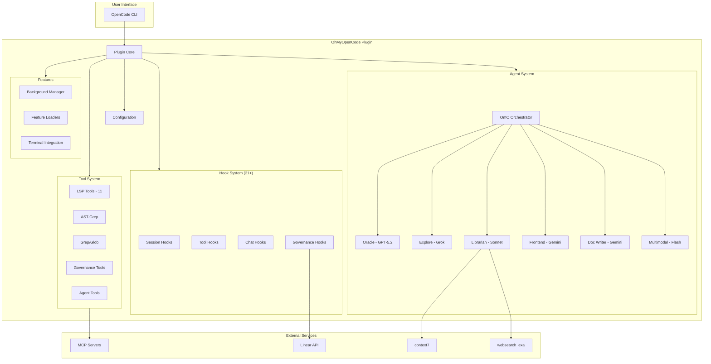

# OhMyOpenCode Architecture Overview

OhMyOpenCode (OMO) is a comprehensive plugin for OpenCode that transforms the development experience through multi-model AI orchestration, governance enforcement, and deep tool integration. Think of it as "oh-my-zsh" for AI-assisted development.

## Quick Navigation

| Document | Description |
|----------|-------------|
| [01 - Plugin Core](/architecture/01-plugin-core) | Entry point, initialization, lifecycle |
| [02 - Agent System](/architecture/02-agent-system) | Multi-model orchestration, OmO, subagents |
| [03 - Background Tasks](/architecture/03-background-tasks) | Async execution, polling, notifications |
| [04 - Hook System](/architecture/04-hook-system) | 21+ lifecycle hooks, event handling |
| [05 - Tool System](/architecture/05-tool-system) | LSP, AST-Grep, governance tools |
| [06 - MCP Integration](/architecture/06-mcp-integration) | context7, websearch_exa, grep_app |
| [07 - Governance System](/architecture/07-governance-system) | Path validation, historian, Linear |
| [08 - Configuration](/architecture/08-configuration) | Zod schema, merging, overrides |
| [09 - Feature Loaders](/architecture/09-feature-loaders) | Claude Code compatibility layer |
| [10 - Data Flows](/architecture/10-data-flows) | Visual diagrams of all flows |
| [11 - Inter-Component](/architecture/11-inter-component) | Dependencies and interactions |

### Architecture Decision Records

| ADR | Decision |
|-----|----------|
| [ADR-001](/architecture/decisions/ADR-001-agent-orchestration) | Multi-model agent orchestration pattern |
| [ADR-002](/architecture/decisions/ADR-002-background-task-design) | Child session background task design |
| [ADR-003](/architecture/decisions/ADR-003-governance-hooks) | Governance via lifecycle hooks |

## System Architecture



## Core Concepts

### 1. Multi-Model Orchestration

OMO uses a **hierarchical orchestration** pattern where OmO (Claude Opus 4.5) acts as the primary "team lead" that delegates to specialized subagents:

| Agent | Model | Specialty |
|-------|-------|-----------|
| **OmO** | Claude Opus 4.5 | Orchestration, planning, todo management |
| **Oracle** | GPT-5.2 | Architecture, code review, debugging |
| **Explore** | Grok-Code | Fast codebase search, pattern finding |
| **Librarian** | Claude Sonnet 4.5 | External docs, GitHub search |
| **Frontend** | Gemini 3 Pro | UI/UX implementation |
| **Document Writer** | Gemini 3 Pro | Technical documentation |
| **Multimodal Looker** | Gemini 2.5 Flash | Image/PDF analysis |

### 2. Hook-Based Architecture

The plugin intercepts OpenCode lifecycle events through hooks:

- **`chat.message`**: Inject context, detect keywords
- **`tool.execute.before`**: Validate paths, check comments
- **`tool.execute.after`**: Truncate output, inject rules, track changes
- **`event`**: Handle session lifecycle (created, idle, error, deleted)

### 3. Governance System

Three governance hooks enforce project standards:

1. **Path Validator**: Prevents file creation in unauthorized locations
2. **Historian**: Automatically generates changelog entries
3. **Linear Injector**: Injects issue context into agent prompts

### 4. Background Task System

Enables asynchronous agent execution via child sessions:

```
Parent Session → BackgroundManager.launch() → Child Session
                         ↓
                   Polling (2s) → Completion → Notification
```

## Configuration

OMO uses a dual-level configuration system:

1. **User Level**: `~/.config/opencode/oh-my-opencode.json`
2. **Project Level**: `.opencode/oh-my-opencode.json`

Configurations are merged with project overriding user settings.

```json
{
  "$schema": "https://raw.githubusercontent.com/sst/oh-my-opencode/master/assets/oh-my-opencode.schema.json",
  "disabled_hooks": ["session-notification"],
  "agents": {
    "oracle": {
      "model": "openai/gpt-4o",
      "temperature": 0.2
    }
  },
  "governance": {
    "path_validation": {
      "mode": "warn",
      "allowed_paths": ["src/", "docs/", "tests/"]
    }
  }
}
```

## Key Files

| File | Purpose |
|------|---------|
| `src/index.ts` | Plugin entry point, initialization |
| `src/agents/*.ts` | Agent definitions |
| `src/hooks/*.ts` | Hook implementations |
| `src/tools/*.ts` | Tool implementations |
| `src/features/background-agent/manager.ts` | Background task management |
| `src/config/schema.ts` | Zod configuration schema |

## Integration Points

### MCP Servers

| Server | Purpose |
|--------|---------|
| `context7` | Official library documentation |
| `websearch_exa` | Web search via Exa AI |
| `grep_app` | GitHub code search |
| `linear` | Linear issue management (user-configured) |

### Claude Code Compatibility

OMO loads assets from Claude Code directories:

- `~/.claude/agents/*.md` → Custom agents
- `~/.claude/commands/*.md` → Slash commands
- `~/.claude/skills/*/SKILL.md` → Skills as commands
- `.mcp.json` → MCP server configurations

## Getting Started

1. Install the plugin via OpenCode
2. Create `~/.config/opencode/oh-my-opencode.json` for global settings
3. Create `.opencode/oh-my-opencode.json` for project-specific settings
4. Configure Linear MCP if using governance features

## Further Reading

- **For Developers**: Start with [Plugin Core](/architecture/01-plugin-core) and [Hook System](/architecture/04-hook-system)
- **For Users**: See [Configuration](/architecture/08-configuration) and [Governance](/architecture/07-governance-system)
- **For Contributors**: Review [ADRs](/architecture/decisions/) for design rationale

---

*Documentation generated: 2025-12-17*
*Source commit: See repository for latest*
