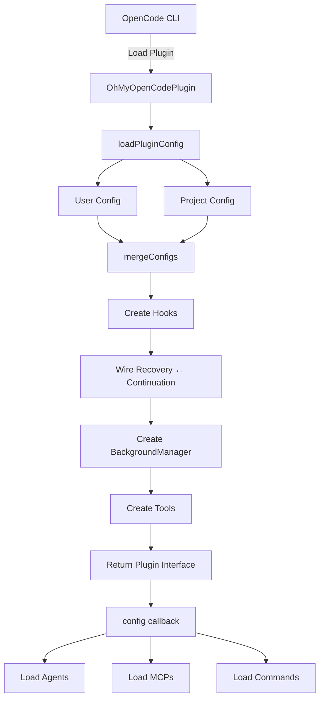

# Plugin Core Architecture

OhMyOpenCode (OmO) is a comprehensive plugin for OpenCode designed to enhance the developer experience, acting as the "oh-my-zsh" for the OpenCode environment. It provides a robust system of agents, tools, and hooks that automate workflows, enforce governance, and provide deep integration with external services like Linear and Google Antigravity.

## Overview

The core architecture is built around a central plugin entry point that manages the lifecycle of various components. It handles configuration merging, hook orchestration, and event delegation.

## Plugin Interface

The plugin exports a standard interface that OpenCode interacts with:

```typescript
{
  auth?: { ... }, // Optional authentication providers
  tool: { ... }, // Registered tools available to agents
  "chat.message": async (input, output) => { ... }, // Hook for chat messages
  config: async (config) => { ... }, // Configuration callback for agents, tools, and MCPs
  event: async (input) => { ... }, // Event handler for session lifecycle
  "tool.execute.before": async (input, output) => { ... }, // Pre-execution tool hook
  "tool.execute.after": async (input, output) => { ... } // Post-execution tool hook
}
```

## Initialization Flow

When OpenCode loads the plugin, the following sequence occurs:

1.  **Configuration Loading**:
    *   Loads user-level configuration from `~/.config/opencode/oh-my-opencode.json` (or OS equivalent).
    *   Loads project-level configuration from `.opencode/oh-my-opencode.json`.
    *   Merges configurations using a deep merge strategy.
2.  **Hook Creation**:
    *   Hooks are conditionally instantiated based on the `disabled_hooks` configuration.
    *   Governance hooks (Path Validator, Historian, Linear Injector) are initialized.
3.  **Hook Wiring**:
    *   Specific hooks are cross-wired to share state. For example, `session-recovery` informs `todo-continuation-enforcer` when a recovery is in progress to prevent redundant prompts.
4.  **Background Management**:
    *   A `BackgroundManager` is created to handle long-running tasks and notifications.
5.  **Tool Registration**:
    *   Builtin tools, background tools, and custom tools (e.g., `look_at`, `call_omo_agent`) are registered.
    *   Governance tools (e.g., `linear_branch`, `read_context`) are added to the toolset.
6.  **Terminal Initialization**:
    *   The terminal title is initialized to reflect the "main" session state.

## Configuration System

The configuration system uses Zod for strict schema validation and type safety.

### Config Locations

| Level | Path | Purpose |
| :--- | :--- | :--- |
| **User** | `~/.config/opencode/oh-my-opencode.json` | Global preferences and API keys |
| **Project** | `.opencode/oh-my-opencode.json` | Project-specific overrides and governance rules |

### Merging Strategy

Configurations are merged using the following rules:
*   **Objects**: Deeply merged (e.g., `agents`, `claude_code`).
*   **Arrays**: Concatenated and de-duplicated (e.g., `disabled_hooks`, `disabled_agents`).
*   **Primitives**: Project-level values override user-level values.

### Schema Validation

The `OhMyOpenCodeConfigSchema` ensures that all configuration options are valid. It includes definitions for:
*   `agents`: Overrides for builtin and custom agents.
*   `disabled_hooks`: List of hooks to deactivate.
*   `governance`: Settings for path validation, historian, and Linear integration.

## Hook Lifecycle

Hooks are the primary way OhMyOpenCode extends OpenCode's behavior. They are created during initialization and registered to specific lifecycle events.

### Conditional Creation

```typescript
const isHookEnabled = (hookName: HookName) => !disabledHooks.has(hookName);

const sessionRecovery = isHookEnabled("session-recovery")
  ? createSessionRecoveryHook(ctx)
  : null;
```

### Hook Wiring

State sharing between hooks is handled explicitly during initialization:

```typescript
if (sessionRecovery && todoContinuationEnforcer) {
  sessionRecovery.setOnAbortCallback(todoContinuationEnforcer.markRecovering);
  sessionRecovery.setOnRecoveryCompleteCallback(todoContinuationEnforcer.markRecoveryComplete);
}
```

## Config Callback

The `config` callback is responsible for dynamically configuring the OpenCode environment based on the merged plugin configuration.

1.  **Agent Loading**:
    *   Loads builtin agents (OmO, oracle, librarian, etc.).
    *   Injects user and project-defined agents.
    *   **OmO Integration**: If OmO is enabled, it demotes standard `build` and `plan` agents to subagents and sets `OmO` as the primary orchestrator.
2.  **Tool Restrictions**:
    *   Applies tool-level permissions and restrictions (e.g., disabling `call_omo_agent` for the `explore` agent to prevent recursion).
3.  **MCP Registration**:
    *   Loads builtin MCPs (context7, websearch_exa, etc.) and any user-configured MCP servers.
4.  **Command & Skill Loading**:
    *   Aggregates commands and skills from global, user, and project locations.

## Event Handling

The plugin listens to session lifecycle events to maintain state and update the user interface.

*   **`session.created`**: Sets the main session ID and updates the terminal title to "idle".
*   **`session.updated`**: Updates the current session state and sets terminal status to "processing".
*   **`session.deleted`**: Cleans up session state if the main session is closed.
*   **`session.error`**: Triggers the `session-recovery` hook to handle recoverable errors (e.g., rate limits or context window overflows).
*   **`session.idle`**: Resets the terminal status to "idle".

## Tool Hook Flow

Tool execution is wrapped in `before` and `after` hooks to provide governance and utility functions.

### `tool.execute.before`
1.  **Claude Code Hooks**: Standard compatibility hooks.
2.  **Non-Interactive Env**: Sets up environment variables for non-interactive tools.
3.  **Comment Checker**: Validates tool arguments for forbidden patterns.
4.  **Governance Path Validator**: Enforces path discipline (runs last to allow other hooks to modify paths if necessary).

### `tool.execute.after`
1.  **Truncators**: Truncates large tool outputs to save context window.
2.  **Injectors**: Injects relevant context (READMEs, agent info) into the session.
3.  **Historian**: Records the tool execution and its impact in the audit trail (runs last to capture all changes).

## Mermaid Diagram


